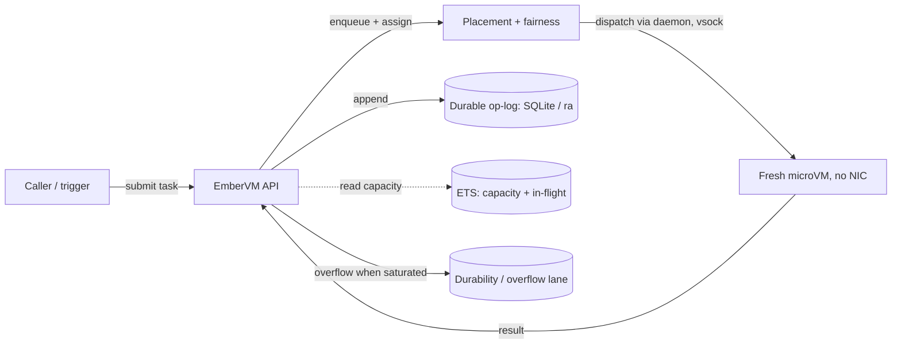
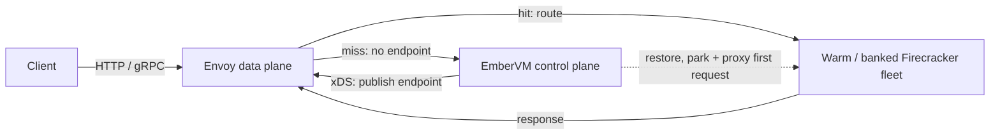

# ADR 001: EmberVM, a BEAM Orchestrator for Firecracker Workloads

**Author:** Joe McGinley
**Status:** Accepted
**Created:** 2026-07-12

---

## Problem

We have a mature microVM data plane (fc-invoke, [agents/030](../agents/030-fc-invoke-configurable-firecracker-surface.md)), a zero-egress untrusted-code runtime on it (`sandbox`, [agents/044](../agents/044-code-executor-sandbox.md)), and a named-function framework above that (FaaS, [agents/045](../agents/045-faas-on-fc-invoke-sandbox-runtime.md)). What we do not have is a **general control plane that owns workload lifecycle, placement, fairness, backpressure, and progress across the whole node fleet**.

The gap is **task semantics**. Today's dispatch is a stateless RPC to a single daemon on a single node: there is no durable task record, no ownership, no managed retry (errors are the caller's problem), no result store, no cross-node placement, and no per-tenant fairness. Current throughput numbers hold only because every invocation is one RPC routed to one daemon; the moment the fleet spans nodes and mutually-competing callers, ad hoc dispatch stops being an option.

The goal is a standalone, open-sourceable orchestrator that lets an organization run **predictable internal workloads on their own nodepool with Lambda-style ergonomics**: they size (or elastically bound) the nodepool, we provide the orchestration that makes it work reliably at scale. The motivating first consumer is a high-throughput scan fleet (Semgrep-shaped, with a sub-500ms end-to-end latency target), but the platform is deliberately not scan-specific.

The pattern being displaced at scale is **Argo Workflows**, which represents every workload and every step as a Kubernetes API object. At millions of short-lived jobs a day this hammers etcd, the centralized controller reconcile loop becomes the throughput ceiling, and per-job pod cold-start (seconds) dwarfs the work itself. The win is **getting workload execution state out of etcd and off per-invocation pods**, not swapping one workflow DAG engine for another.

---

## Decision

Adopt a **BEAM (Elixir) control plane, named EmberVM**, as the orchestrator over the fc-invoke Firecracker fleet, delivered as **one operable component with a pluggable durable backend**. The control plane owns the queue, placement, per-tenant fairness, backpressure, supervision, and progress. The data plane stays the fc-invoke microVM fleet.

**Naming.** Formal name `embervm`, spoken "Ember". An ember is a banked fire relit on demand, which is the platform's signature state. The suffix names the substrate (Firecracker microVMs) rather than `-k8s`: this is not a Kubernetes-native orchestrator, and the roadmap eventually inverts the relationship with Kubernetes. Lifecycle vocabulary used throughout: a workload instance is **running**, **primed** (live and pristine, awaiting its first assignment), **banked** (suspended with a warm snapshot, relit on demand), or **cold**.

| Aspect                   | Today (Argo Workflows / monolith dispatch)             | Decided (EmberVM)                                                           |
| ------------------------ | ------------------------------------------------------ | --------------------------------------------------------------------------- |
| Execution state store    | K8s API objects in etcd, or none (fire-and-forget RPC) | ETS hot set + pluggable durable op-log (SQLite / `ra`), off etcd            |
| Task semantics           | RPC; caller retries; results evaporate                 | Durable record, ownership, managed retry, DLQ, result store                  |
| Per-invocation compute   | New pod per step (seconds cold start)                  | Fresh microVM per task (snapshot-restored); banked VMs for sessions/serving  |
| Coordinator              | Argo controller reconcile loop (single ceiling)        | BEAM control plane: placement, fairness, backpressure, supervision           |
| Request path at scale    | Through the workflow engine                            | Envoy to warm VM; control plane off the steady-state path                    |
| Operability for adopters | Assemble queue + autoscaler + dispatcher + ...         | One BEAM component + pluggable durable backend; org bounds the nodepool      |
| Untrusted-code isolation | Varies per step                                        | Firecracker microVM per task, never reused across principals                 |

### The invocation-path invariant (hit/miss)

The single most important architectural property: **the control plane is on the invocation path if and only if the invocation requires a lifecycle action** (create, restore, wake). Steady-state requests never traverse it.

- A **hit** (a live VM endpoint exists) is routed by Envoy directly to the VM. Throughput scales with the nodepool, up to millions of requests per second as an emergent property of node count.
- A **miss** (no live endpoint) inherently requires a lifecycle action costing a snapshot restore, so EmberVM belongs on the path for exactly these requests. It makes the placement decision, parks the triggering request while the restore completes (holding many parked requests open cheaply is what BEAM processes are for), proxies it activator-style, publishes the new endpoint via xDS, and exits the path.
- **Task execution is the degenerate all-miss case**: every task gets a fresh VM by isolation policy, so the dispatcher is on the path for every task, bounded by fleet restore capacity rather than by BEAM.

The invariant is checkable per request, and it is what keeps BEAM's dispatch ceiling (tens of thousands per second) irrelevant to serving throughput: BEAM answers at miss rate, never at request rate.

The scan fleet's sub-500ms target is end-to-end. The workload engine is optimized outside EmberVM; the orchestrator's share of the budget is dispatch overhead, held near zero by assignment-only dispatch from the primed pool (below).

### State model: definitions in a CRD, executions in the op-log

The **hot working set lives in ETS** (in-memory, rebuilt on start) and the **durable book-of-record is an operation log with a pluggable backend**: embedded SQLite-WAL by default (single-active, inspectable; PVC-backed so the minimum example is self-contained), and `ra`/Raft for HA (per-replica local log, quorum provides availability). SQLite-WAL is the v1 default; `ra` ships as a follow-on provided its resource footprint stays small. The rule that keeps this honest: **a PVC provides durability, not availability.** Adopters at scale offload durability to a managed backend through the same pluggable seam. The durable store is never on the dispatch path; dispatch reads capacity from ETS.

The failure posture is asymmetric by rule: **enforcement fails closed, warmth fails open**. If quota or capacity state cannot be read, dispatch is denied; if warmth is lost (a missing snapshot, a stale residency entry), the workload cold-boots. Availability may degrade; correctness and containment never do. The op-log also doubles as the audit record: every lifecycle and enforcement action (dispatch, wake, denial, cap enforcement) is an ordered, durable append.

Workload **definitions** are the opposite kind of data: low-churn, human-authored declarative intent. They live in a **`Workload` CRD** (schema-validated, RBAC'd, GitOps-synced) that EmberVM consumes the way Envoy consumes xDS: one watch over a handful of objects, no controller-runtime, no per-invocation writes. The **status subresource** is the read-back surface (`snapshotRef`, `observedGeneration`, readiness), which makes `kubectl get workloads` the MVP dashboard. **kubectl, Helm, and ArgoCD are the entire MVP management surface**: no bespoke workload API or UI in v1; any later API or UI writes CRs.

### Facts through the control plane, payloads never

One generative rule applied at every altitude: the coordinator handles facts and never carries steady-state payloads. BEAM is off the request hit path (cluster level); snapshot bytes move between node disk and object store via the node daemon, never through BEAM (storage level); the daemon reports VM endpoints and never proxies serving traffic (node level). The two deliberate exceptions are lifecycle-rate, not request-rate: the control plane proxies the parked first request after a serving miss, and task dispatch and results flow through it by definition (task-class delivery over vsock is the one place the daemon carries payloads).

### Isolation model

**No VM or snapshot lineage ever crosses a principal.** A principal is the identity a workload runs as (a tenant, user, or service account); the table states what may be reused within one principal.

| Class    | Reuse                                             | Why it is safe                                          |
| -------- | ------------------------------------------------- | -------------------------------------------------------- |
| Task     | None: fresh restore from a pristine base per task | Pristine lineage carries no principal state              |
| Session  | Within one principal's own snapshot lineage       | State in the lineage is only ever that principal's       |
| Serving  | Shared VM across many requests                    | The code is the tenant's own app; requests are its users |
| Stateful | Volume owned by one workload                      | Data never leaves the owning workload's boundary         |
| Composite | Bundle set and private subnet owned by one group instance's lineage | The group is one principal's environment; members share a private per-group subnet and never route to another group or the host, and the whole group banks and relights as one lineage |

"Cold" and "warm" describe **boot mechanics only**. The task-class isolation property is **no reuse**: a fresh, never-reused microVM per task, snapshot-restored from a pristine base (restore is allowed and expected; it preserves the isolation property while killing the boot cost). The one forbidden cell is warm-reusing untrusted code across principals.

The task-class concurrency floor materializes as a **primed pool**: live pristine VMs restored ahead of demand, idling on vsock, each awaiting one task. A VM enters the pool only via a pristine-base restore, becomes principal-bound at assignment, and is destroyed after its single task, so pre-warming changes dispatch latency and nothing about isolation. Dispatch to a primed VM is assignment only; restore cost moves off the dispatch latency path onto a background refill path, and sustained task throughput is then bounded by refill rate (reclaim under pressure per [agents/028](../agents/028-elastic-agent-microvm-capacity-and-reclaim.md)). The pool is a shared latency resource: per-workload floors and fair pool admission keep one workload's burst from draining it for everyone else.

### Wire contract

**Every workload receives an HTTP request and returns an HTTP response**: HTTP/1.1, HTTP/2, and therefore gRPC (Envoy sees request boundaries in all three). The classes differ only in who delivers it: the node daemon relays over vsock for the task class, Envoy routes over the VM's tap device for serving hits, and the control plane proxies the parked first request after a serving miss. Trigger events (queue messages, cron firings) are CloudEvents-shaped POSTs. Task-class VMs are **vsock-only with no NIC at all**: the absence of a network device is the strongest isolation statement available.

Protocol support follows a visibility spectrum: **L7** (this contract: full request semantics, fairness, retries, miss-parking, per-request metering), **protocol-aware L4** (DB wire protocols via Envoy network filters: connection routing plus protocol stats, for the stateful class), and **opaque L4** (routing and wake-on-connect only). Miss-parking, per-request fairness, and chargeback all require the data plane to see request boundaries.

### Workload sources

The CRD `source` field is a oneOf ladder, ordered by how much structure the user brings:

- **`image` (v1)**: bring an OCI image reference. The platform pulls, boots, runs the declared init, health-gates, snapshots the initialized environment, and writes `snapshotRef` to status; this snapshot is the pristine base the task class restores from. The image build stays in the adopter's CI; the build-to-snapshot pipeline is ours. Contract: listen on the declared port, answer a health path. No SDK, no framework.
- **`zip` (v1.x)**: `runtime` + `codeUri`. Dependencies are vendored in the archive (no install step at prep time, so snapshot identity is a pure function of runtime-base digest plus zip hash). The guest fetches and unpacks the archive itself, so the zip attack surface stays inside a disposable microVM. A bootstrap shim baked into the runtime base locates and calls `handler(event, context)`, signature-compatible with Lambda for migration (the AWS event catalog is not cloned; events are CloudEvents). An executable `bootstrap` in the archive replaces the shim, covering any language. The runtime matrix stays small (Python, Node); each runtime is an apko base plus a permanent EOL treadmill. The zip lane is pinned to HTTP+JSON. (R3 serving note: a serving VM cold-boots with a NIC and cannot resume the tmpfs/RAM-baked handler in the base memory snapshot, so a serving zip base additionally produces a cold-boot-readable handler artifact the shim imports off a read-only drive before serving; see DECISIONS.md D-R3.11.2.)
- **`build` (future, possibly never)**: managed Dockerfile builds are a builder subsystem with its own security posture, not a schema field. Only if demand proves it; build context by reference, never inlined.

### Per-workload contract surface

The configuration surface adopters actually program against, all living in the CRD:

- **Invocation semantics**: sync and async invoke; per-workload retry policy, dead-letter queue, failure destinations. Delivery is at-least-once in v1 with caller-supplied idempotency keys; exactly-once deduplication is recorded as a revisit if duplicate-execution cost matters at scale. Results are part of the durable contract: v1 persists them retrievable by task id with a retention TTL (durable tasks are only half true if the answer evaporates); a richer query surface waits on scale and supportability needs.
- **Concurrency floor and cap**: a pre-warmed floor (provisioned-concurrency analog on the warm-pool machinery of [agents/028](../agents/028-elastic-agent-microvm-capacity-and-reclaim.md)): a primed pool of live pristine VMs for the task class, banked instances for session and serving classes; and a hard cap (reserved-concurrency analog). On finite capacity these matter more, not less, than on clouds that pretend capacity is infinite. Caps, quotas, and fair queues apply per tenant and per principal within a tenant (a user, an API key).
- **Triggers** via an adapter seam: cron plus one queue adapter in v1 (NATS, per agents/016); Broadway makes further adapters cheap.
- **Lifecycle knobs**: idle policy (when to bank), user-tunable max lifetime (which also bounds version drift, see roadmap R2), snapshot TTL.
- **Per-session endpoint tokens**: short-lived, minted at create/resume; who may hit a session's endpoint is a distinct auth surface from the management API.
- **Config and secrets**: MMDS dynamic workload env ([agents/046](../agents/046-mmds-dynamic-workload-env.md)) and brokered egress ([agents/023](../agents/023-egress-secret-proxy.md)).
- **Observability and metering by default**: guest logs shipped, per-invocation OTel spans, and per-tenant usage accounting (vCPU-seconds, GB-seconds) hooked into the dispatch path from day one; chargeback is the org-internal analog of billing and is expensive to retrofit.

### Placement and snapshot tiering

Snapshot **metadata** (lineage, residency, generation, size, last access) lives in the op-log and ETS; snapshot **bytes** move between node disk and object store via the node daemon. Node disk is a cache. Tiers: node-local banked (restore measured in the tens of milliseconds on the current substrate, per [agents/022](../agents/022-firecracker-snapshot-restore-controller.md); budget ~100ms with endpoint publication), object store (Firecracker **diff snapshots** against the pristine base keep stored size and fetch transfer to roughly the dirtied pages), GC'd (cold start from base).

**Write-through versus write-back is the durability contract**: upload-on-bank never loses session state to node death but pays object-store traffic per bank; lazy upload is cheaper and loses the newest state in the window. Snapshots are warmth, so the default is write-back with a bounded flush interval; write-through is required where a snapshot is the durability story (sessions with no external state) and in elastic nodepools, where consolidation can reap a node inside the write-back window. Anything the platform calls durable must be write-through or drain-flushed.

Placement biases toward locality without tracked coherence: **rendezvous hashing** of session/workload id over healthy nodes yields a preferred-node list, so the same workload keeps landing where its snapshots already are; the residency map handles exceptions and may be lossy (ETS, rebuilt) without correctness consequences. Locality signals consumed by the scheduler: warm git mirror ([agents/041](../agents/041-hot-git-mirror-agent-workspaces.md)), snapshot residency, node capacity.

### Capacity contract (elastic nodepools)

EmberVM bypasses per-invocation Kubernetes objects, which means node autoscalers (Karpenter and kin) never see its demand. The fix is a **scheduler/provisioner split with a minimal, level-triggered contract** (after the fleet-scale-Kubernetes framing in References): EmberVM places work on existing capacity; the provisioner creates capacity; neither simulates the other.

- **CapacityRequest** (EmberVM to provisioner): aggregated by class and resource profile, derived directly from placement miss reasons (the scheduler already knows why a dispatch cannot place), expressed as **total desired state** with implicit withdrawal, never deltas. Ten thousand queued tasks compress to a handful of profile rows.
- **UpcomingNode** (provisioner to EmberVM): duplicate suppression while nodes boot, so the control loop does not re-ask every tick during provisioning lag.
- **AvailableCapacity** (hint, not guarantee): feeds admission control, distinguishing "queue deepens, capacity is coming" from "at ceiling, shed now".

Scale-down requires a **drain protocol** wired to node-disruption signals: finish or reschedule in-flight tasks, flush banked snapshots to the object store, then release the node. Elastic mode therefore implies write-through (or drain-forced flush); aggressive consolidation plus write-back is a data-loss recipe. Domain sizing rule: a scheduling domain must be sized to hold the largest single tenant; beyond that, scale by adding domains, not by growing one.

### Data plane

Serving traffic reaches VMs through Envoy, never through the node daemon (the control plane's activator proxy on a miss is the sole, lifecycle-rate exception): the daemon creates the tap, reports the endpoint, and is thenceforth uninvolved. At scale, a **two-tier Envoy layout** absorbs endpoint churn: an edge fleet that only knows stable per-node addresses, and a per-node Envoy that fans into local VMs, so bank/wake churn stays a node-local xDS update. The node tier can be deferred until churn hurts; the architecture must simply not preclude it. **eBPF is an optimization lane, never the v1 architecture**: per-VM egress policy at the tap, sockmap short-circuiting for the node-Envoy-to-VM hop, XDP steering if a proxy saturates; EKS adopters get most of this packaged via Cilium. The design requires only that VM endpoints are IP-addressable.

**The node daemon is the health authority.** It already supervises the VM process and the vsock channel, so it feeds orchestrator-driven EDS for membership and lifecycle: a banking VM drains from EDS before suspend, closing the race between routing and lifecycle. Envoy active health checks run only at the node tier, where probing local VMs is cheap, for fast data-path ejection between EDS updates; the edge tier sees only stable node-level endpoints, so there is no probe amplification.

### Languages: Elixir control plane, Go node daemon

The control plane is **Elixir**. What BEAM buys concretely: supervision trees, preemptive per-process scheduling (a stuck tenant cannot starve the scheduler), millions of cheap parked processes (the miss path holds requests open), mature distribution primitives, and `ra` for many-Raft-groups consensus. Go could consolidate the same mechanics; the honest framing is that we trade contributor pool for fit and distinctiveness, with the toolchain tax (OTP releases, hex deps, dual-arch images inside a Bazel/apko repo) recorded as a risk and a Go control plane recorded as the fallback. Gleam is rejected for the core (see Alternatives); possible typed island later.

The **node daemon stays Go** (the existing fc-invoke daemon). The daemon's work is payload-and-OS work, where BEAM is weakest and Go is strongest: Firecracker process supervision via the mature firecracker-go-sdk, tap/netlink and cgroup manipulation, jailer integration, OCI pulls, and snapshot byte movement. Doing that from Elixir means NIFs or ports wrapping C, reintroducing the crash-the-VM risk BEAM otherwise avoids. Keeping the daemon a narrow-API Go binary also separates failure domains (a control-plane crash never touches running VMs) and keeps the language boundary on the facts/payloads line: Elixir coordinates facts, Go and Envoy move payloads. Fly.io similarly keeps BEAM out of its node agents and proxies (Go and Rust) while running Elixir higher in the stack. Fleet lifecycle is managed **directly over fc-invoke (vsock/gRPC), not by reconciling Kubernetes pod objects**; the daemon's small lifecycle API is the seam, and node agents are deliberately not members of the BEAM distribution cluster (a narrow gRPC surface on every node beats the distribution protocol on every node for both scaling and attack surface).

---

## Target Workload Classes and Roadmap

Rungs share primitives, not dates. Each rung names its target, its first consumer (no rung ships without one; rungs below Decided record a direction, not a commitment), the new primitives it needs, and the **v1 invariant that keeps it reachable**: cheap to hold now, expensive to retrofit. Outstanding work per rung is tracked in GitHub Issues when work starts.

| Rung | Target capability | First consumer | New primitive(s) | v1 invariant that keeps it reachable | Status |
| ---- | ----------------- | -------------- | ---------------- | ------------------------------------ | ------ |
| R0 Tasks | Durable, fair, retried task execution | Scan fleet | Dispatcher, op-log, Workload CRD, image source | (baseline) | Shipped 2026-07-14 |
| R1 Zip lane | Zero-toolchain internal functions | Monolith FaaS migration | Runtime bases + bootstrap shim | Uniform HTTP contract; `source` as oneOf | Shipped 2026-07-15 |
| R2 Sessions | Bank/relight stateful sandboxes | Agent sandboxes | Idle-bank, snapshot tiering, per-session tokens | Invocation front-end split from placement; lineage rule | Shipped 2026-07-15 |
| R3 Serving | Warm request serving at fleet scale | Tenant web APIs | xDS programming, two-tier Envoy option | Control plane off the hit path | Shipped 2026-07-16 |
| R4 Stateful | Scale-to-zero singleton datastores | Agent scratch-postgres | Volume attach, L4 wake-on-connect | Snapshot/volume generation pairing in snapshot metadata from day one | Shipped 2026-07-17 (gates live-pending) |
| R5 Composite | Multi-VM groups with private networks | Ephemeral k8s environments, DB clusters | Group lifecycle, per-group subnets | Group-shaped room in the CRD schema | Shipped 2026-07-17 (gates live-pending) |
| R6 Facade | Virtual control planes, hard multi-tenancy | (own ADRs) | etcd-shim over the op-log | Per-tenant op-log partitioning | Recorded (deferred, [009](009-roadmap-extension-continuity-before-tenancy.md)) |
| R6 Continuity | Deploys and node-daemon rolls interrupt nothing they don't have to | Every live workload (scratch-postgres, scratch-k8s, serving) | Drain protocol, artifact export/restore | A routine noded/CP roll never cold-boots a stateful workload and never destroys a banked group | Shipped 2026-07-18 (gates live-pending) |
| R7 Distribution | Redistribute and pre-warm workloads across many nodes | Serving and task fleets on a multi-node Firecracker pool | Placement policy, demand-driven artifact warming, multi-node endpoint fan-out | Placement moves are a copy, never a rebuild; bounded only by ISA/CPU compatibility and volume anchoring | Decided ([009](009-roadmap-extension-continuity-before-tenancy.md), amended; design [011](011-distribution-longhorn-fencing-cp-rollouts.md)) |
| R8 Consumers | Agent-thread tier runs on EmberVM sessions | goosecracker (fc-agentd successor) | Session-backed agent threads | Bespoke fc-agentd controller retired | Decided ([009](009-roadmap-extension-continuity-before-tenancy.md)) |
| R9 Packaging | Standalone open-sourceable artifact | External readers | Standalone distribution | Clean repo boundary plus a quickstart that boots on one machine | Decided ([009](009-roadmap-extension-continuity-before-tenancy.md)) |

Status legend: **Shipped** rungs are live in production (closure evidence tracked in GitHub Issues); **Decided** rungs are commitments (v1 marks initial release scope); **Recorded** rungs prevent foreclosure without committing; **Future ADR** rungs require their own decision records before any commitment exists.

**R1 resolves the [agents/045](../agents/045-faas-on-fc-invoke-sandbox-runtime.md) relationship**: EmberVM is built first and the monolith routes to it. The 045 registry/URL surface survives as a consumer; its execution semantics migrate. Nothing FaaS-shaped is built on the monolith in the meantime, so no dispatch layer is built twice.

**R2 sessions** carry one wrinkle stateless FaaS never faces: a session snapshot is pinned to the image version it was created from, so deploys do not converge sessions until they die. Sessions ride their birth version until the max-lifetime TTL forces a re-cold-start onto the current version; the TTL is chart-configurable with sensible defaults and documented caveats, and it doubles as the version-convergence bound.

**R4 stateful** splits state by contract: **data on the volume, warmth in the snapshot**. The volume owns the data (real durable storage); the memory snapshot only pre-pays cache warmth. Resume requires an exact (memory snapshot, volume generation) match, else discard warmth and cold-boot from the volume: slower, never incorrect. Replicate at one layer only: application-replicated workloads (Postgres streaming) get storage-replica-count-1 volumes. Volumes are node-anchored, so this class trades away free placement. Clustered stateful (CNPG-shaped: per-VM volumes, an EmberVM-supervised process per cluster orchestrating election and failover through the `ra` tier, rw/ro routes flipped via xDS) is recorded for later; the hard parts already exist in the design, and the immediate value is the scale-to-zero singleton tail.

**Shipped shape (2026-07-17).** The v1 that landed: a `class: stateful` singleton microVM owning one writable raw-file volume on node NVMe, opaque L4 with the inbound TCP connection as the wake signal (a per-node Envoy tcp_proxy listener, programmed by the xDS sidecar, fronts a control-plane TCP activator that parks the connection, single-flights `StartStateful(RELIGHT)` with a daemon-side cold-boot fallback, publishes the real endpoint, and splices bytes). Warmth is honest by the `bundle_generation == volume_generation` pairing recomputed on every node sweep; a mismatch cold-boots from the durable volume and evicts the stale bundle. Idle workloads bank to disk; a long-lived connection is never severed. First-boot secrets ride the MMDS-lite boot-args seam (base64url `ember.env.*`, a stopgap for real MMDS in a later ADR). The named first consumer is agent scratch-postgres, a scale-to-zero relational scratchpad for `run_python` sessions. Closure evidence, including the live-drill gate status, is tracked in GitHub Issues.

**R5 composite** workloads get a private subnet per group instance (stable internal IPs across restores), roles, and group lifecycle, with three stated constraints: group snapshots are crash-consistent per VM, not transactionally consistent across VMs; group resume includes guest clock resync as a required step; per-node pull-through OCI caches (the [agents/041](../agents/041-hot-git-mirror-agent-workspaces.md) pattern generalized) keep guest-cluster image pulls local and zero-egress. The showcase is instant, legitimately distributed Kubernetes environments: separate kernels, real inter-node networks, real node kills.

**Shipped shape (2026-07-17).** The v1 that landed: a `class: composite` group of member microVMs sharing a private per-group /24 (a noded-owned Linux bridge per group instance carved from a values-declared supernet, with an nftables forward deny isolating each group from every other group and from the serving bridge, and a per-member zero-egress drop). Members get deterministic, pinned tap/MAC/IP so Firecracker snapshot restore finds an identical host device world, and every resume runs a verified guest clock resync over a dedicated vsock control agent (fail the relight if the read-back delta exceeds one second). The group is the lifecycle atom: one instance per CR, role-ordered health-gated start, and an all-members-or-none bundle set (a group bank stamps one `set_id` across every member's snapshot in a single atomic op-log append; a partial or unreadable set is evicted whole and the next wake fresh-boots). The entry endpoint reuses the R4 L4 lane byte-for-byte, so a connection to a sleeping group is one single-flighted wake (relight when a complete set exists, a full ordered create when no instance exists) that publishes the real entry and splices. Idle groups bank to one set on disk (never severed while a live entry connection or an activator splice exists), max-lifetime and banked-TTL bound the cost, and a forced roll is both the convergence and degraded-recovery lever. Warmth is the only state: composite members own no volumes, so destroy, TTL expiry, a failed relight, or a forced roll each end the environment and the next wake is a brand-new one. **The shipped shape resolves one stated constraint differently:** guest clusters bring up from **baked airgap images** (the k3s binary plus its airgap image tarball vendored into the apko rootfs, so bring-up pulls nothing) rather than the per-node pull-through OCI cache the constraint named; that cache moves to the recorded follow-ons, needed only when guest clusters must run arbitrary user images. k3s realistically runs as root inside its guest, which is acceptable because the microVM boundary is the isolation statement (the task-class posture notes apply, documented in the image README rather than silently deviating from the uid 65532 convention). The named first consumer is `scratch-k8s`, a scale-to-zero three-node k3s cluster (one server, two agents) the agent toolchain reaches through a wake-on-connect kubeconfig, costing one bundle set on disk while idle instead of three running VMs. Closure evidence, including the live-drill gate status, is tracked in GitHub Issues.

**R6** is recorded in one sentence because it stays cheap only if this ADR lands as designed: the op-log plus ETS state model is shaped to back a kine-style etcd facade (revisions are log indices, watches are processes), enabling virtual control planes and hard multi-tenancy; separate ADRs if pursued. [ADR 009](009-roadmap-extension-continuity-before-tenancy.md) defers the facade to Recorded and extends the ladder with R6 Continuity, R7 Distribution, R8 Consumers, and R9 Packaging, on the finding that the R5 drills exposed continuity, not capability, as the platform's real gap.

**Out of scope**: multi-step workflow semantics (DAGs, durable branching). v1 is single-task semantics with retries. If DAG semantics come to dominate, the first candidate is a BEAM coordination layer over the same op-log (a workflow as a supervised process tree), with Temporal as the recorded fallback. Also out of scope: pretending capacity is infinite. Queue-depth visibility, saturation signals, priorities, and admission control are what the platform offers instead of "automatic scaling".

---

## Architecture

**Task execution (all-miss: control plane on the invocation path, fresh VM per task).**

**Request serving (hit/miss: control plane on the path only for lifecycle actions).**

The through-line: EmberVM owns the **soft state and coordination logic** in one runtime, delegates the **durable book-of-record** to a pluggable backend on proven stores, and delegates the **request path** to Envoy. It is never simultaneously the scheduler, the database, and the load balancer on the hot path; each responsibility is placed where it is cheapest to make correct.

---

## Alternatives Considered

- **Temporal (see agents/015, Deprecated)**: durable execution, battle-tested, polyglot SDKs. We previously adopted Temporal and physically removed it (2026-06-14); the run-a-heavy-stateful-system tax was paid once and refunded. Rejected as the primary because it does not consolidate queue + fairness + backpressure + progress into one operable unit and is not a microVM fleet manager. Recorded as the fallback if durable multi-step DAG semantics come to dominate.
- **Bare queue + pull-based workers (NATS/SQS + KEDA/Karpenter)**: simplest, inherently HA via the queue. Rejected as the core because pull discards placement and locality (banked snapshots, warm git mirrors, per-tenant fairness and preemption) and taxes every dispatch with a broker hop. Kept as the **overflow / durability lane** behind the control plane.
- **Go control plane (controller-runtime)**: fits the existing toolchain and the largest contributor pool, and could consolidate the same mechanics. Rejected as primary on fit (supervision, preemptive scheduling, parked processes, distribution) and distinctiveness; recorded as the fallback if BEAM's ecosystem or toolchain cost proves too high. The node daemon does stay Go (see Languages).
- **Argo Workflows (the incumbent)**: every workload is a K8s object, so etcd, the controller, and pod churn cap throughput. Rejected: wrong state store for high-churn, short-lived work.
- **Knative for serving**: the activator-on-path-only-during-cold-start pattern is what the hit/miss invariant adopts, but Knative is pod-based with no microVM isolation and worse cold starts. Rejected as substrate; its autoscaler design is the reference we copy.
- **Gleam instead of Elixir**: static types on BEAM, but a fraction of the ecosystem, with untyped boundaries at Broadway/OTP. Rejected for the core; possible typed island later.
- **BEAM owns durable consensus (Mnesia or hand-rolled)**: maximum single-component elegance, but ships adopters a homegrown distributed database with split-brain semantics they debug alone at 3am. Rejected: durability delegates to a pluggable backend; where self-contained consensus is required, `ra`/Raft (RabbitMQ quorum queues prove it), never Mnesia.
- **BEAM as a Kubernetes controller reconciling pods**: reinvents mature Go controller-runtime for the high-churn tier. Rejected: EmberVM manages the microVM fleet directly over fc-invoke; Kubernetes schedules the DaemonSet shell and holds the low-churn Workload CRD, nothing per-invocation.
- **Non-HTTP wire contracts (Cap'n Proto RPC and kin)**: opaque to Envoy, so the data plane degrades to L4 passthrough and loses per-request load balancing, retries, request-level observability, and miss detection (only connection-open remains as a signal). Zero-copy serialization aims at the wrong bottleneck (VM lifecycle, not encoding). Rejected as a contract; the legitimate non-HTTP want is the R4/L4 class, where connection-open **is** the wake signal.
- **Managed Dockerfile builds in v1**: a builder subsystem (arbitrary code execution with network at build time) rather than a schema field. Deferred behind image-ref and zip sources.
- **Hyperlight (a kernel-less isolation runtime) as a second data-plane backend**: Hyperlight runs a bare, kernel-less guest directly on KVM, trading the userland away for roughly 1-2ms starts and a tiny footprint. It is not a layer on top of Firecracker; it is an alternative runtime at the same hypervisor boundary, so the real proposal is a second isolation backend beside the Firecracker fleet, not a stacking of the two. Rejected as a v1 backend on fit. EmberVM's value model assumes a real userland: the `source` ladder (`image`, `zip`) boots an OCI or runtime rootfs, the wire contract is a real program answering HTTP, and the first consumers run arbitrary Python (the `sandbox`, [agents/044](../agents/044-code-executor-sandbox.md)) and a Semgrep binary (the scan fleet), none of which run in a kernel-less guest without a Wasm rewrite that defeats the point. A Hyperlight backend would also be a second of everything the platform is trying to keep singular: a second guest ABI (a Wasm component plus host functions, not "listen on a port and answer a health path"), a second build pipeline (Wasm componentization, not the apko bases and their EOL treadmill), and a second lifecycle model, because Hyperlight has no Firecracker-style snapshot, restore, or banking. Its speed is recreate-cheaply, so the op-log snapshot tiering that R2 through R5 are built on does not apply to it. The numbers do not yet force the question either: fc-invoke already restores a warm snapshot to scan start in the tens of milliseconds ([agents/022](../agents/022-firecracker-snapshot-restore-controller.md)), fast enough that sub-millisecond starts only pay off for a workload where that restore is the bottleneck AND the guest is Wasm-compilable, a shape no current rung targets.

  **The isolation-runtime seam stays open, deliberately.** This is recorded, not built, because the design is already committed to isolation being a pluggable property rather than "Firecracker, hardcoded": the Security section names gVisor ([security/003](../security/003-gvisor-runtime-class.md)) as an alternative isolation runtime baseline, and gVisor arrived additively (a new RuntimeClass) without displacing the default. Keeping the seam abstract costs nothing now and is precisely what lets a kernel-less runtime arrive later as a task-class-only backend behind the node daemon's existing control-to-node gRPC surface (`Assign`/`Destroy`), touching neither the control plane's placement, fairness, and op-log logic nor the Firecracker path. The task class is the clean fit by construction: it is all-miss, fresh-per-task, and never banks, so a runtime with no snapshot model is not a limitation there, and the session, serving, and stateful classes that do need banking simply would not select it. That per-class opt-in is what makes this the most contribution-shaped extension EmberVM has: a self-contained backend implementing one narrow gRPC contract for a new runtime, rather than a change to the coordination core. Recording it here names the gate any future backend (Hyperlight or otherwise) must clear before it lands: a real first consumer (the rung-gating discipline applied to backends, the missing one today being a Wasm-native, ultra-high-fanout, pure-compute class such as per-request policy evaluation or untrusted transform filters), the existing HTTP wire contract, and no second lifecycle model bolted onto the op-log.

## Security

Baseline per `docs/security.md`. The core property is the isolation rule: **no VM or snapshot lineage ever crosses a principal** (table in the Decision). Task-class VMs inherit the [agents/044](../agents/044-code-executor-sandbox.md) posture: non-root, resource-capped, zero-egress unless a workload opts into [agents/023](../agents/023-egress-secret-proxy.md) brokered egress, disposable OOM victim, and vsock-only with no NIC. Session and serving classes run tenant-trusted code; isolation is at the microVM boundary and the Envoy routing tier, with **short-lived per-session endpoint tokens** gating who may reach a session's URL. Zip-source archives are fetched and unpacked **inside the disposable guest**, so zip-slip and archive-bomb surfaces never touch the host. **Resource abuse is a security concern.** A hostile or runaway principal must not be able to starve the fleet, exhaust the control plane, or amplify cost: per-workload concurrency caps, per-tenant fair queues, and admission control are the containment, and the per-tenant metering stream is the detection signal (consumption beyond entitlement is visible per dispatch, not discovered on the invoice). The miss path needs its own guard: a request to a banked workload costs the caller one cheap HTTP request and costs the platform a snapshot restore, so wake events are rate-limited per principal and parked requests are capped, keeping the reconstruction path from becoming an asymmetric-cost amplifier. EmberVM ships these containment primitives; adjudicating intent (which principal is abusive, what happens to their account) is the adopter's layer above.

**Compromise blast radius** is bounded per layer: a compromised guest reaches only its own snapshot lineage and volume (and a task-class guest has no NIC at all); a compromised node daemon owns one node's payloads and nothing beyond it; the control plane is the highest-value target, so its surface is one narrow authenticated API, and the facts-not-payloads rule means it cannot leak request payloads it never carries.

The control plane's management API is authenticated and authorized (the TokenReview-gated `/invoke` pattern from the fc-invoke line). gVisor ([security/003](../security/003-gvisor-runtime-class.md)) remains an alternative isolation runtime baseline.

## Risks

| Risk                                                              | Likelihood | Impact | Mitigation                                                                                                        |
| ----------------------------------------------------------------- | ---------- | ------ | ------------------------------------------------------------------------------------------------------------------ |
| BEAM owns consensus, split-brain at scale                         | Medium     | High   | Delegate durability to SQLite / `ra`; PVC = durability-not-availability; never Mnesia                                |
| Scope: platform-company-sized (open-source Fly.io)                | High       | High   | Roadmap rungs each gated on a named first consumer; ship R0 for the scan fleet first                                 |
| Control plane leaks onto the request hot path                     | Medium     | High   | Hit/miss invariant is checkable per request; invocation front-end is a separate module from placement                |
| BEAM toolchain tax in a Bazel/apko repo                           | Medium     | Medium | OTP releases + hex deps + dual-arch images are new build surface; keep the data plane mainstream; Go fallback        |
| BEAM ecosystem / hiring smaller than Go                           | Medium     | Medium | Elixir not Gleam; Go control plane recorded as fallback; Envoy, Firecracker, and the Go daemon stay the ops surface  |
| Single-active durable tier: minutes-scale failover on node death  | Medium     | Medium | Stated tier semantics; `ra` tier for seconds-failover; scale adopters offload to a managed backend via the seam      |
| Node consolidation reaps nodes holding banked state               | Medium     | High   | Drain protocol wired to disruption signals; elastic mode implies write-through or drain-forced flush                 |
| Autoscaler over-asks during node boot lag                         | Medium     | Medium | UpcomingNode duplicate suppression is part of the capacity contract                                                  |
| Sessions keep serving old code after a deploy                     | High       | Low    | Snapshot pinned to birth version by design; the max-lifetime TTL bounds convergence and is chart-configurable        |
| Fresh-VM boot dominates short tasks                               | Medium     | Medium | Snapshot-restore from the pristine base; "cold" is boot mechanics, no-reuse is the policy                            |
| Adopter expects millions/sec of fresh-VM-per-request on a small fleet | Low    | Medium | State the cost model: all-miss throughput equals fleet restore capacity, so millions/sec fresh-per-request is a fleet-sizing exercise (small VMs, large clusters), not a default |
| Miss-path amplification: cheap requests force expensive restores  | Medium     | Medium | Per-principal wake-rate limits and parked-request caps; treat the wake path as an abuse surface                       |

## References

| Resource                                                                   | Relevance                                                                          |
| --------------------------------------------------------------------------- | ------------------------------------------------------------------------------------ |
| [agents/045](../agents/045-faas-on-fc-invoke-sandbox-runtime.md)            | The FaaS predecessor; its registry becomes an EmberVM consumer (roadmap R1)          |
| [agents/044](../agents/044-code-executor-sandbox.md)                        | Untrusted-code microVM posture reused for the task class                             |
| [agents/030](../agents/030-fc-invoke-configurable-firecracker-surface.md)   | The stateless microVM data-plane primitive EmberVM drives                            |
| [agents/031](../agents/031-cluster-node-control-data-plane-split.md)        | The control/data-plane split principle this applies                                  |
| [agents/022](../agents/022-firecracker-snapshot-restore-controller.md)      | Snapshot-restore mechanics behind pristine bases and banking                         |
| [agents/028](../agents/028-elastic-agent-microvm-capacity-and-reclaim.md)   | Warm-pool sizing and reclaim; the concurrency-floor machinery                        |
| agents/015             | Temporal, previously adopted and removed; the recorded DAG fallback                  |
| agents/016                  | Candidate for the overflow lane and the v1 queue trigger adapter                     |
| [agents/041](../agents/041-hot-git-mirror-agent-workspaces.md)              | Warm-mirror locality; the pattern behind snapshot residency and OCI caches           |
| [agents/023](../agents/023-egress-secret-proxy.md)                          | Brokered egress for workloads that opt out of zero-egress                            |
| [agents/046](../agents/046-mmds-dynamic-workload-env.md)                    | MMDS dynamic env: the per-workload config/secrets injection story                    |
| [networking/001](../networking/001-cloudflare-envoy-gateway.md)             | Envoy is already the ingress; serving programs it via xDS                            |
| [security/003](../security/003-gvisor-runtime-class.md)                     | Alternative isolation runtime baseline                                               |
| [AWS Lambda MicroVMs](https://aws.amazon.com/blogs/aws/run-isolated-sandboxes-with-full-lifecycle-control-aws-lambda-introduces-microvms/) | Convergent prior art for the session class: suspend/resume, idle policy, per-sandbox endpoints and tokens |
| [Fleet-scale Kubernetes](https://lucy.sh/fleet-scale-kubernetes)            | The scheduler/provisioner split and level-triggered capacity contract adopted here   |
| [kine](https://github.com/k3s-io/kine)                                      | Proof the etcd storage API is a small shim surface (roadmap R6)                      |
| [ra](https://github.com/rabbitmq/ra)                                        | Many-Raft-groups consensus library; the HA tier and R6 partitioning                  |
| Fly.io Machines                                                              | Closest commercial prior art: Firecracker workloads, volumes, wake-on-demand; keeps BEAM out of node agents and proxies |
| Knative KPA / activator                                                      | The on-path-only-during-lifecycle-action pattern the hit/miss invariant adopts       |
| AWS Lambda (Firecracker)                                                     | Prior art: warm reuse, snapshot-restore semantics, and the contract-surface checklist |

---

## Amendment (2026-07-26)

**The R7 rule "a placement move is a copy, never a rebuild" no longer holds for the stateful class.** [ADR 025](025-local-disk-authoritative-s3-archive-interval.md) withdraws Longhorn for stateful volumes and makes local disk authoritative, so moving a stateful workload is a restore from the S3 archive rather than a block-level copy. ADR 025 names this as one of three properties it gives up. The rule is unaffected for warmth artifacts and other classes.
