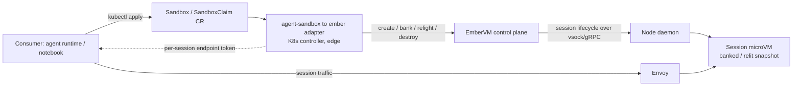

# ADR 002: Back the Kubernetes agent-sandbox Interface with the EmberVM Substrate

**Author:** Joe McGinley
**Status:** Accepted
**Created:** 2026-07-13

---

## Problem

[kubernetes-sigs/agent-sandbox](https://github.com/kubernetes-sigs/agent-sandbox)
is a SIG project defining a declarative Kubernetes API for isolated, stateful,
singleton workloads: a `Sandbox` CRD (a stateful pod with stable identity and
persistent storage, plus pause/resume and scheduled-deletion lifecycle),
extended by `SandboxTemplate` (reusable config), `SandboxClaim` (allocate from a
pool), and `SandboxWarmPool` (pre-warmed instances). Its target consumers are AI
agent runtimes, development environments, and notebook-style sessions. It is
gaining traction and is the most likely candidate to become the default
interface for this niche.

This is precisely the domain of EmberVM's **R2 sessions rung**
([ADR 001](001-embervm-beam-firecracker-workload-orchestrator.md)), whose named
first consumer is "Agent sandboxes." Ember's session-class primitives map onto
agent-sandbox's almost one for one: bank/relight is pause/resume, a session warm
pool (ADR 001's banked session-class floor, generalizing the task-class primed
pool) is `SandboxWarmPool`, its fair admission is `SandboxClaim`, the `Workload`
CRD is `SandboxTemplate`, and idle-bank / max-lifetime / snapshot TTL are the
lifecycle knobs.

Because the two overlap so cleanly, R2 faces a fork: build a **native** session
API that competes with the emerging standard, or **align with and back** that
standard. ADR 001 already commits to keeping each rung's seam "cheap to hold
now, expensive to retrofit." The compatibility stance has to be decided before
R2 is designed, because the cheap seam is only cheap if the session lifecycle
surface is shaped with it in mind. This ADR records that stance. It does not
build anything: R0 tasks is v1, R2 is unbuilt.

---

## Decision

**EmberVM treats agent-sandbox as the intended external interface for its
session/sandbox class, and positions itself as the substrate that backs it, via
a deferred adapter. Ember does not build a competing native session API, and
does not implement the agent-sandbox CRDs in its core.**

Three concrete commitments:

1. **Ember is the substrate; agent-sandbox is the interface.** The value ember
   adds over agent-sandbox's default runtime is the substrate underneath:
   Firecracker microVM isolation, snapshot bank/relight measured in tens of
   milliseconds, and the off-etcd control plane. We do not want to re-litigate
   the interface the ecosystem is standardizing; we want to run it faster and
   more securely. So the plan is to let a consumer program against `Sandbox` /
   `SandboxClaim` / `SandboxWarmPool` and have ember fulfill them.

2. **The adapter lives at the edge, not in ember's core.** This resolves the one
   real architectural mismatch. agent-sandbox's `Sandbox` is **one Kubernetes
   object per live instance** over a **pod** contract; ember's `Workload` is
   **one object per definition**, and ADR 001's founding thesis is getting
   instance state off etcd and off per-instance pods ("BEAM as a Kubernetes
   controller reconciling pods" is a Rejected alternative there). The adapter is
   exactly where those two altitudes reconcile: a thin Kubernetes controller
   owns the per-instance `Sandbox`/`SandboxClaim` objects (giving consumers the
   native kubectl/RBAC surface they expect) and translates their lifecycle into
   ember session calls over ember's control-plane API and the R2 session
   extension of the node contract (which today, for the task class, has no
   session verbs: `Assign` destroys the VM after one task).
   Ember's core still sees only low-churn definitions plus the node
   vsock/gRPC seam; the per-instance K8s object is deliberately pushed to the
   adapter edge, where it is the consumer's expected surface rather than an
   internal scaling cost.

3. **The adapter is deferred and gated.** It is not built now. It is gated on two
   conditions both holding: R2 sessions actually exists in ember, and
   agent-sandbox has retained enough traction to be worth targeting. Until then,
   the only obligation this ADR places on R2 is a cheap one (commitment 1's
   shaping): design the session lifecycle verbs, warm-pool, and claim-from-pool
   semantics so the adapter is a translation layer and not a redesign. If
   agent-sandbox stalls or a different standard wins, ember's session verbs
   remain directly usable and nothing is stranded.

| Aspect | Native session API (rejected) | Backed agent-sandbox (decided) |
| ------ | ----------------------------- | ------------------------------ |
| External interface | Bespoke ember CRD / API | `Sandbox` / `SandboxClaim` / `SandboxWarmPool` |
| Per-instance K8s object | Avoided, but no ecosystem surface | Owned by the adapter at the edge, off ember's core |
| Ember core sees | Definitions + node contract | Definitions + node contract (unchanged) |
| Distribution | Must win adoption alone | Rides the emerging default's adoption |
| Substrate differentiation | Full | Full (microVM isolation, ms bank/relight) |
| Build cost now | High (whole API surface) | Zero now; only shape the R2 seam |

### Interface-to-substrate mapping

| agent-sandbox | EmberVM session class (R2) |
| ------------- | -------------------------- |
| `Sandbox` (stateful singleton instance) | a live session-class instance in one principal's snapshot lineage |
| `SandboxTemplate` | `Workload` CRD (definition) |
| `SandboxClaim` (allocate from pool) | fair admission from the banked session-class floor |
| `SandboxWarmPool` | banked session instances (ADR 001's session-class floor; the task-class primed-pool machinery generalized, part of the R2 seam this ADR mandates) |
| pause / resume | bank / relight (snapshot suspend + restore) |
| scheduled deletion, idle | idle-bank, max-lifetime TTL, snapshot TTL |
| stable identity + persistent storage | per-session lineage (warmth); durable storage additionally depends on the R4 volume rung, which is only Recorded in ADR 001 |
| endpoint into the sandbox | per-session endpoint token + Envoy route |

---

## Architecture

The adapter is a translation edge. Consumers see a stock agent-sandbox surface;
ember sees its own definitions and node contract. Instance state does not enter
ember's core.

Contrast with agent-sandbox's default runtime, where the controller reconciles a
**pod** per `Sandbox`. Here the controller reconciles an **ember session**
instead, so the isolation boundary becomes a Firecracker microVM and the
pause/resume cost becomes a snapshot restore rather than a pod reschedule. The
`Sandbox` object still lives in etcd (it is the consumer's declarative intent, low
churn per instance), but ember's own high-churn execution state stays off
etcd exactly as ADR 001 requires.

---

## Alternatives Considered

- **Build a native ember session API, no agent-sandbox compatibility.** Rejected:
  it rebuilds an interface the ecosystem is standardizing and forces ember to win
  session-class adoption on its own, discarding the distribution the substrate
  play is meant to capture.
- **Implement the agent-sandbox CRDs directly in ember's core now.** Rejected on
  two counts: it reintroduces a per-instance Kubernetes object and the pod
  contract that ADR 001 exists to avoid, and it is premature (R0 tasks is v1, R2
  sessions is unbuilt, and there is no consumer yet).
- **Decide nothing; revisit when R2 starts.** Rejected: the adapter is only a
  cheap translation layer if R2's session surface is shaped for it. Deciding late
  risks a native surface that then needs a redesign to align, which is the exact
  retrofit cost ADR 001's per-rung invariants are meant to prevent.
- **Upstream an ember runtime backend into agent-sandbox itself.** Not rejected,
  deferred: if agent-sandbox grows a pluggable-runtime seam, contributing ember
  as a backend is strictly better than an out-of-tree adapter. Recorded as an
  open question rather than a commitment, since it depends on the upstream
  project's shape.

---

## Security

Baseline per `docs/security.md`; the substrate's isolation posture is unchanged
from [ADR 001](001-embervm-beam-firecracker-workload-orchestrator.md) (session
class runs tenant-trusted code inside a Firecracker microVM, gated by short-lived
per-session endpoint tokens, no cross-principal lineage). The adapter adds one
new surface: a Kubernetes controller with RBAC to watch and update
`Sandbox`/`SandboxClaim`/`SandboxWarmPool` objects and to call the ember control
plane's authenticated management API. It carries no session payloads (facts, not
payloads, per ADR 001), so a compromised adapter can drive lifecycle actions
within its RBAC scope but cannot read session traffic.

Two semantic-gap items to watch: agent-sandbox's pod-shaped affordances
(`kubectl exec`/`attach`/`port-forward`, ephemeral debug containers, arbitrary
volume mounts) do not all map onto a vsock-reached microVM session, and silently
accepting a `Sandbox` spec whose security-relevant fields are ignored would be a
misleading posture. The adapter must support the subset that maps and reject or
loudly no-op the rest, never imply enforcement it does not provide.

---

## Risks

| Risk | Likelihood | Impact | Mitigation |
| ---- | ---------- | ------ | ---------- |
| agent-sandbox API churns pre-1.0 | High | Low | The adapter isolates the surface; ember core never couples to it. Pin a supported API version, track upstream, absorb changes at the edge. |
| agent-sandbox loses traction / a rival standard wins | Medium | Medium | The adapter is deferred and gated on retained traction; ember's native session verbs stay directly usable, so nothing is stranded. |
| Semantic gap: pod-shaped features do not map to microVM sessions | High | Low | Support the mapping subset; reject or explicitly no-op the rest; document divergence. Do not imply enforcement not provided. |
| Version-pinning wrinkle: R2 sessions ride their birth image version, but a K8s-native API implies pod-like convergence on redeploy | Medium | Low | Surface the ADR 001 max-lifetime TTL convergence bound through the adapter's status; document that a `Sandbox` does not converge on template change until it dies. |
| Building the adapter early, before R2 exists | Low | Medium | Explicitly gated: no adapter code until R2 ships and the two gate conditions hold. This ADR shapes the seam only. |

---

## Open Questions

1. Is the adapter a standalone controller, or folded into the invocation
   front-end module that already fronts the control plane?
2. How much of the `Sandbox` surface do we commit to mapping (exec/attach/
   port-forward, ephemeral containers, multi-volume) versus the minimal
   create/bank/relight/destroy/endpoint core?
3. If agent-sandbox grows a pluggable-runtime backend seam, do we upstream ember
   as a backend instead of shipping an out-of-tree adapter?
4. Which agent-sandbox resource is the right ember entry point: does
   `SandboxClaim` (allocate-from-pool) map to ember's banked-session admission
   directly enough to be the primary integration point, with bare `Sandbox` as a
   claim-of-one?
5. A `Sandbox` carries an inline pod-template spec, so a bare `Sandbox` created
   without a `SandboxTemplate` brings its own per-instance definition. Since the
   mapping pins `SandboxTemplate` to the low-churn `Workload` CRD (and each
   unique spec implies a `BuildBase`), template-less Sandboxes would force the
   adapter to synthesize a `Workload` per unique spec, churning exactly the
   definition CRD this design protects. Do we require template-referenced
   Sandboxes, or hash-dedupe inline specs into shared definitions?

---

## References

| Resource | Relevance |
| -------- | --------- |
| [ADR 001 EmberVM](001-embervm-beam-firecracker-workload-orchestrator.md) | The platform this backs; R2 sessions is the rung, "Agent sandboxes" its named first consumer |
| [kubernetes-sigs/agent-sandbox](https://github.com/kubernetes-sigs/agent-sandbox) | The interface being backed: `Sandbox`, `SandboxTemplate`, `SandboxClaim`, `SandboxWarmPool` |
| [Fly.io Machines](https://fly.io/docs/machines/) | Prior art for microVM sandboxes with wake-on-demand behind a declarative API |
| [AWS Lambda MicroVMs](https://aws.amazon.com/blogs/aws/run-isolated-sandboxes-with-full-lifecycle-control-aws-lambda-introduces-microvms/) | Convergent prior art for suspend/resume, idle policy, per-sandbox endpoints and tokens |
