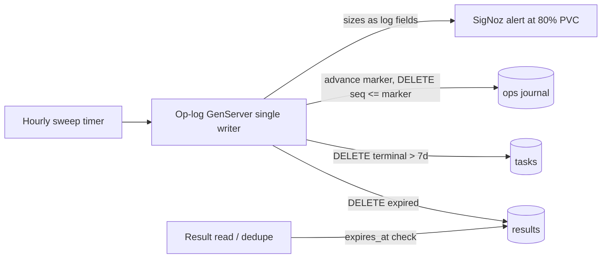

# ADR 002: Op-Log Retention and Compaction Policy

**Author:** Joe McGinley
**Status:** Accepted
**Created:** 2026-07-14

---

## Problem

EmberVM's durable book-of-record is a single SQLite-WAL database on a 2Gi
Longhorn PVC ([ADR 001](001-embervm-beam-firecracker-workload-orchestrator.md)),
holding three tables with different growth characters:

- **`ops`**: the append-only journal. Every lifecycle and enforcement action is
  an append, and the `submitted` op carries the task's full request envelope
  (headers plus the base64 body, i.e. the entire file contents of a scan
  submit). By R0 design it is never rewritten.
- **`tasks`**: the projection the control plane recovers from; terminal rows
  were specified to compact after a retention window.
- **`results`**: stored task responses (capped at `resultMaxBytes`, default
  1 MiB) with a per-row `expires_at` from the workload's `resultTtlSeconds`
  (default 24h).

R0 shipped the compaction *mechanism* (`OpLog.compact/2` deletes expired
results and terminal tasks past a 7-day retention, and is covered by tests) but
no process schedules it, and neither the submit dedupe path nor the result
read path checks `expires_at`. Three consequences:

1. All three tables grow without bound; the journal, which carries request
   payloads, dominates.
2. Because task-state transitions are write-through appends, a full PVC is a
   hard outage of the submit path (fail-closed, but abrupt and total).
3. Idempotency dedupe can serve a result older than its advertised TTL, so the
   caller-visible contract ("results live for `resultTtlSeconds`") is silently
   wrong in both directions.

Retention is also not just a bug fix: *how* the journal is truncated
constrains two recorded futures. The `ra`/Raft HA tier replicates the log, and
the R6 etcd facade maps revisions to log indices; both assume a log whose
compacted prefix is replaced by an authoritative state snapshot, not a log
whose middle was quietly deleted.

---

## Decision

Three rules, one per table class, plus an operational guard.

**1. TTLs are enforced at read time, independent of sweeping.** A result past
`expires_at` is never served: the result endpoint returns 404 and the
idempotency dedupe path treats the task as absent (a resubmit executes
fresh). Correctness never depends on sweeper cadence; the sweeper reclaims
space, reads enforce the contract. This also closes the R0 gap where a stale
result could be served between expiry and (never-arriving) deletion.

**2. Projections are swept on a schedule.** A supervised periodic job calls
`OpLog.compact/2` (default hourly, configurable via values): expired results
are deleted, terminal tasks older than the retention window (7 days, the R0
default, now actually enforced) are pruned. The dispatch path still never
reads the durable store; sweeping runs on the same single-writer GenServer
that owns the connection, so there is no new writer.

**3. The ops journal is bounded by prefix compaction with a durable marker.**
Compaction deletes ops with `seq <= compacted_through_seq`, where the marker
advances to the newest op that is (a) older than the journal horizon (default
30 days) and (b) not referenced by any non-terminal task. The marker is stored
in the database and is part of the durable state: any future consumer of the
log (a `ra` replica bootstrapping, an R6 watch replaying) learns that history
before the marker is available only as projected state, never as ops. Ops for
live tasks are never compacted regardless of age, so recovery is unaffected.
The projections *are* the v1 state snapshot; a Raft-style materialized
snapshot artifact is the `ra` tier's job, not v1's.

Audit older than the horizon is delegated to the observability pipeline: every
append is already emitted as a structured log line and span (Task 13), so
SigNoz retains the audit trail beyond the journal horizon. The journal is the
book of record for recovery and recent audit, not an archive.

**4. Disk is watched, not discovered.** The sweeper emits the post-compaction
table sizes and database file size as log fields, and a SigNoz alert fires at
a PVC usage watermark (80%), so exhaustion is a warning weeks out instead of a
submit outage.

| Aspect | Today (R0 as shipped) | Decided |
| ------ | -------------------- | ------- |
| Result TTL | Set on rows, never enforced | Enforced at read and dedupe time; swept hourly |
| Terminal tasks | Retained forever | Pruned past 7-day retention by the scheduled sweep |
| Ops journal | Append-only, unbounded | Prefix-compacted past a 30-day horizon behind a durable `compacted_through_seq` marker |
| Long-horizon audit | The journal, implicitly | SigNoz (logs + spans), explicitly |
| PVC exhaustion | Discovered as a submit outage | 80% watermark alert with sizes logged per sweep |

## Architecture

## Alternatives Considered

- **Unbounded journal plus a bigger PVC**: kicks the can and keeps the failure
  mode (hard submit outage at 100%); rejected.
- **Raft-style snapshot+truncate with a materialized snapshot artifact**: the
  correct shape for the `ra` tier, but building a snapshot format for a
  single-writer SQLite whose projections already are the state is speculative
  work now; the durable marker preserves the semantics at near-zero cost.
- **Horizon delete without a marker**: simplest, but a future replica cannot
  distinguish "log starts at seq N because compaction" from "ops lost"; the
  marker is one row and removes the ambiguity.
- **Scrubbing payloads from old ops instead of deleting rows** (keep lean audit
  facts forever): more moving parts for a need SigNoz already covers; rejected.
- **Spilling request/result payloads to the object store** so the journal holds
  references: the recorded R0 follow-on for oversized results; orthogonal to
  retention and still deferred.

## Security

Baseline per `docs/security.md`. The op-log doubles as the audit record
(ADR 001); this policy shortens on-box audit to the journal horizon and
delegates older audit to SigNoz, which is access-controlled on the private
tier. Compaction never removes ops for non-terminal tasks, so no in-flight
work loses its durable trail. Request payloads (which may contain scanned
source code) now age out of the PVC after the horizon instead of persisting
indefinitely, which is a small data-minimization improvement.

## Risks

| Risk | Likelihood | Impact | Mitigation |
| ---- | ---------- | ------ | ---------- |
| Hourly DELETE bursts stall the single writer and blow the 5ms append budget | Low | Medium | Sweep in bounded batches (LIMIT per pass) on the same GenServer; appends interleave between batches |
| A future replayer assumes ops start at seq 1 | Medium | Medium | `compacted_through_seq` is durable and part of the OpLog behaviour contract; replay-from must consult it |
| SigNoz retention shorter than the audit need | Low | Low | Journal horizon is values-configurable; raise it if 30 days proves short |
| Read-time TTL changes dedupe behavior for callers relying on stale hits | Low | Low | The advertised contract was always `resultTtlSeconds`; enforcing it is a fix, and semgrep's content-hash dedupe re-executes correctly |

## Open Questions

1. Whether the queued-task TTL (`expires_at` on non-terminal tasks, the D12
   known gap where over-budget parked tasks outlive expiry) should be enforced
   by the same sweep or by the dispatcher; leaning dispatcher, since expiring
   a queued task is a state transition, not garbage collection.

## References

| Resource | Relevance |
| -------- | --------- |
| [ADR 001](001-embervm-beam-firecracker-workload-orchestrator.md) | The op-log state model, audit role, `ra` tier, and R6 facade this policy must not foreclose |
| [`projects/embervm/ARCHITECTURE.md`](../../../projects/embervm/ARCHITECTURE.md) | Current state and invariants. The R0 execution decisions and the D12 known gaps this closes or scopes were recorded in the retired `DECISIONS.md` milestone log, readable in git history |
| [Raft dissertation, log compaction](https://raft.github.io/) | The snapshot-replaces-prefix semantics the marker preserves cheaply |
