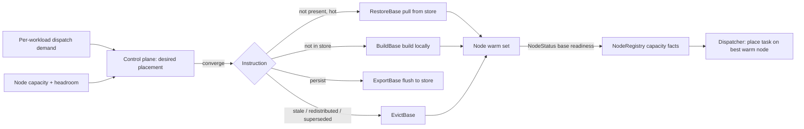

# ADR 003: Control-Plane-Managed Snapshot Distribution and Eviction

**Author:** Joe McGinley
**Status:** Accepted
**Created:** 2026-07-15

---

## Problem

A base snapshot (a pre-booted, handler-imported microVM captured to disk) is EmberVM's unit of warm capacity: per-task VMs restore from it in sub-second time. Today a base is built and owned entirely by the node that built it. Two things break as the fleet and the workload catalog grow:

1. **Bases do not move.** If node A holds the `og-image` base and node A is saturated while node B has a free slot but has never built that base, the task queues on A rather than spilling to B. There is no way to place a base on a node that did not build it, so "which node has the base" is a hard scheduling constraint instead of a lever.

2. **Bases are not portable, and they leak.** Until the R1 zip lane moved to vsock hydration ([R1 spec](../../plans/2026-07-14-embervm-r1-zip-lane-spec-and-plan.md), memory `embervm-zip-hydration`), a base snapshot carried a node-local backing-file dependency (the archive block device), so it could not be shipped or restored elsewhere. Hydration removed that: a base is now a self-contained (memory + rootfs) artifact addressable by `(runtime digest, code sha256)`. Separately, re-registering a function (new code -> new base key) orphans the old base bundle on the node with no cleanup path.

Hydration made the snapshot a portable artifact. This ADR decides who manages those artifacts and how, so warm capacity can be placed for utilization rather than pinned to wherever a base happened to be built.

---

## Decision

**The control plane manages snapshot distribution; the node exposes verbs, never decisions.** This extends the role the control plane already holds. It is the placement authority today (the Dispatcher picks the node per task; the NodeRegistry aggregates per-node capacity, base readiness, live-VM count, and headroom; the BaseBuilder drives base creation). Snapshot distribution is the same control loop applied to bases instead of only to VMs: it is not a new brain.

A base snapshot becomes a **schedulable resource**. The control plane holds a desired placement (which base keys should be warm on which nodes), derives it from the demand and capacity signals it already collects, and drives each node toward it by issuing lifecycle verbs. A shared object store (SeaweedFS S3, the pattern the monolith and the zip lane already use) holds snapshots so a node can materialize a base by **pulling a ready artifact** instead of rebuilding it from scratch.

| Aspect | Today (R0/R1) | Decided |
| ------ | ------------- | ------- |
| Base ownership | The building node, node-local | A content-addressed artifact the control plane places |
| Getting a base onto a node | `BuildBase` only (build from image + code) | `BuildBase` (fallback) or `RestoreBase` (pull from store) |
| Persisting a base off-node | none | `ExportBase` to the object store (or auto-on-build) |
| Removing a base | none (superseded bases leak) | `EvictBase`, control-plane-driven |
| Placement decision | implicit (wherever it was built) | explicit desired-state, demand + capacity driven |
| Cold-node warm-up | rebuild | pull the snapshot (far cheaper than a cold build) |

The node's snapshot lifecycle becomes symmetric and fully control-plane-driven: **Build / Restore** (materialize a base on a node), **Export** (persist it to the store), **Evict** (remove it). The node reports what it holds and refuses unsafe operations (evicting a base with live references); it does not decide *when* any of these happen.

`EvictBase` is not purely future work: it plugs a gap that exists today. Re-registering a function leaves the old base bundle orphaned, and the same RPC that evicts a stale or redistributed base also cleans up a superseded one. That near-term use is reason to land the eviction verb ahead of the full distribution loop.

---

## Architecture

The node gains three RPCs alongside the existing `BuildBase` / `Assign` / `Destroy`, all issued by the control plane:

- **`RestoreBase(baseKey)`** — pull the snapshot for `baseKey` from the object store onto this node and register it ready. The warm-pull path; far faster than a cold `BuildBase` and the way a base reaches a node that never built it.
- **`ExportBase(baseKey)`** — flush this node's self-contained snapshot for `baseKey` to the object store, making it a shared artifact. May also run automatically after a successful build for bases the control plane deems worth persisting.
- **`EvictBase(baseKey)`** — drop the base bundle from this node's local disk. Idempotent (unknown key is a no-op). It **must refuse or drain** if primed or assigned VMs still reference the base: the control plane either destroys those VMs first, or `EvictBase` reports "in use" and the control plane retries after draining. Uses: stale/LRU eviction, post-redistribution cleanup, and superseded-base GC.

The control loop mirrors the other reconcilers, over bases:

Placement is desired-state: the control plane computes, per base key, the set of nodes that should hold it warm (hot functions fanned wider, cold ones narrower or store-only), bounded by each node's live-VM and memory headroom. It then issues Restore/Build to add, Export to persist, and Evict to remove, and dispatch follows to whichever node is best-placed and warm. The object store is keyed by `(runtime digest, code sha256)`, the same identity the R0 change-detect and the zip lane already use, so an artifact is immutable and dedup'd across nodes.

---

## Alternatives Considered

- **Node-local only (status quo).** No sharing, no cross-node warmth, no cold-start acceleration; a saturated node cannot spill a base to a free one. Rejected: it makes base location a hard scheduling constraint the fleet cannot grow past.
- **Node-autonomous eviction/placement** (each node decides what to keep). Rejected: it splits the placement authority the control plane already owns, so no component has a fleet-wide view for utilization, and two nodes cannot be coordinated for balance.
- **Build-always, no object store.** Rejected: rebuilding a base on every cold node is slow and wasteful when an identical, immutable artifact already exists; the store turns a cold build into a fast pull.
- **Bake per-function content into the rootfs.** Rejected in the R1 zip lane already (it defeats the shared-base model and is not portable); the hydration-into-memory approach this ADR builds on is the accepted path.

---

## Security

Baseline per `docs/security.md`. A base snapshot embeds function code (imported into the captured memory image), so the object store is a code-distribution surface: access is restricted to the noded and control-plane service accounts (no public read), and artifacts are addressed and integrity-checked by `(runtime digest, code sha256)` so a tampered or wrong artifact cannot be silently restored. Registration remains the only code-submission surface ([ADR agents/045](../agents/045-faas-on-fc-invoke-sandbox-runtime.md)); distribution moves vetted snapshots, never unvetted code. Restored guests keep the zero-egress and no-cross-principal isolation rules of [ADR 001](001-embervm-beam-firecracker-workload-orchestrator.md); distribution changes where a base is warm, not what a guest may do.

---

## Risks

| Risk | Likelihood | Impact | Mitigation |
| ---- | ---------- | ------ | ---------- |
| Object store outage blocks warm-pull | Medium | Medium | `BuildBase` stays the fallback (build-if-not-in-store); a node can always rebuild from the runtime image + code |
| Evicting a base still referenced by live VMs | Medium | High | `EvictBase` is drain-guarded: refuses while referenced; the control plane destroys primed VMs first, then evicts |
| Stale placement thrashes (pull/evict churn) | Medium | Medium | Placement is demand-weighted with hysteresis; evict only after sustained cold, not per-tick |
| Snapshot store growth / cost | Medium | Low | Content-addressed dedup across nodes; store-side LRU/TTL for artifacts no live base key references |
| Snapshot format drift across noded upgrades | Low | High | Version the snapshot format; a node that cannot restore an artifact falls back to `BuildBase` rather than failing the workload |

---

## Open Questions

1. **Placement policy shape.** Demand-weighted fan-out vs simple LRU-warm vs a hybrid; the exact signals (recent dispatch rate, queue depth, locality) and their weights.
2. **Object store choice and layout.** SeaweedFS S3 (reuse the existing pattern) vs an OCI registry (content-addressed, but heavier for large memory images); bucket/key layout and retention on the store side.
3. **Export trigger.** Auto-export every base after build vs export-on-demand for bases the control plane elects to distribute (avoids persisting one-shot bases).
4. **Snapshot format versioning** across noded/Firecracker upgrades, and the migration/rebuild path when the format changes.
5. **Eviction sequencing** for a base mid-drain: how aggressively to destroy primed VMs to reclaim a slot vs waiting for natural turnover.

---

## References

| Resource | Relevance |
| -------- | --------- |
| [ADR 001 - EmberVM orchestrator](001-embervm-beam-firecracker-workload-orchestrator.md) | The control plane's placement authority and capacity contract this extends |
| [ADR 002 - Op-log retention](002-op-log-retention-and-compaction.md) | Sibling bounding decision; the durable-state discipline this mirrors for bases |
| [ADR agents/045 - FaaS on the sandbox runtime](../agents/045-faas-on-fc-invoke-sandbox-runtime.md) | Registration as the only code-submission surface; distribution moves vetted snapshots |
| [R1 zip-lane spec](../../plans/2026-07-14-embervm-r1-zip-lane-spec-and-plan.md) | The vsock hydration that made snapshots self-contained and portable (the enabler) |
