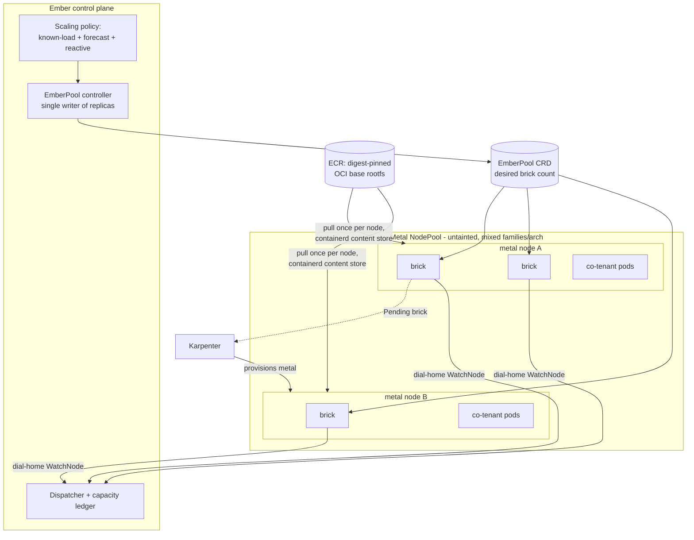

# ADR 005: EmberVM scale-out on EKS (metal pool, multi-daemon bricks, EmberPool CRD)

**Author:** Joe McGinley
**Status:** Accepted
**Created:** 2026-07-13
**Refines:** [001-embervm-beam-firecracker-workload-orchestrator](001-embervm-beam-firecracker-workload-orchestrator.md)

---

## Problem

[ADR 001](001-embervm-beam-firecracker-workload-orchestrator.md) defined EmberVM as a BEAM control plane over a Firecracker node fleet with a level-triggered capacity contract, and deliberately left the nodepool as something "the org bounds." That is fine for a fixed, hand-sized fleet. It does not answer how the fleet is packed and scaled when the target is **AWS EKS with a heterogeneous, autoscaled, maximally-utilized node pool**, which is the stated end state.

Two hard facts force the whole design, and both were nearly missed:

1. **Firecracker on EC2 requires bare-metal instances.** AWS does not expose nested virtualization on virtualized (Nitro-guest) EC2 instances; `/dev/kvm` exists only on `*.metal` types (this is why AWS's own Lambda and Fargate run Firecracker on their internal metal fleet). So "mixed instance types in a shared pool" cannot mean the general EKS pool. It means a **metal-only pool, mixed across metal families** (Intel, AMD, Graviton2+), with ordinary co-tenant workloads filling each metal node's considerable leftover headroom.

2. **On an autoscaled pool, capacity acquisition must be pod-shaped.** A `Pending` pod is the only thing a cluster autoscaler (Karpenter) natively converts into a new node. Any capacity mechanism whose "the cluster is full" state is not a Pending pod is invisible to the autoscaler and must reinvent node provisioning.

The homelab R0 state is a single dedicated FC node on k3s. The risk this ADR guards against is baking single-node assumptions into interfaces (daemon discovery, registry keying, snapshot identity) that are a one-line change today and a cross-cutting rewrite once there are 50 daemons across 10 CPU types.

**Scope.** ADR 001 states EmberVM is not a Kubernetes-native orchestrator and keeps workload execution state off etcd. This ADR does not change that. It governs only **how the node daemons are packaged, placed, and scaled on a Kubernetes host**, and the infrastructure-capacity control loop around them. Workload lifecycle, the durable op-log, and the hit/miss invocation-path invariant from 001 are untouched; nothing here puts per-task execution state into a Kubernetes API object.

---

## Decision

Four decisions and two corrections, all judged against the metal-pool, max-utilization end state.

| Aspect | Homelab R0 (today) | Decided (EKS scale-out) |
| ------ | ------------------ | ----------------------- |
| Node targeting | `nodeSelector` on a single FC-labelled node | Dedicated **attract-label**, untainted metal pool; co-tenants fill headroom |
| Capacity unit | One fat privileged daemon per node | A **portfolio of T-shirt-sized bricks** (noded Deployments, each class bounded by the smallest metal's allocatable) the scheduler bin-packs; Pending brick drives scale-up |
| Per-node budget | Static config, hand-sized | Daemon **budget-agnostic**: reads its own cgroup; one binary serves static / resize / brick tiers |
| In-place resize (KEP-1287) | (not used) | Demoted to an **optional intra-brick optimizer**, gated on runtime probe; never the macro allocator |
| Guest base rootfs | Runtime BaseBuilder writes a mutable nvme file | **Digest-pinned OCI image** (Pattern A), extract-once shared RO cache; BaseBuilder retired |
| Primed memory snapshot | Node-local nvme scratch, unkeyed | Node-local, **keyed by `(arch, CPU-key, kernel, base-digest)`**, warm/cold visible to the dispatcher |
| Node provisioning | Manual | **Karpenter** metal NodePool |
| Brick portfolio | Fixed (1) | **`EmberPool` CRD** maps to a small set of size-classes (one Deployment each); the Ember controller reconciles a per-class **count vector**, single writer of replicas |
| Daemon priority | `homelab-disposable` (lowest) | **Default / non-preempting**; disposability moves into the cgroup and VM TTLs |

### 1. Node targeting: attract-label, not a taint

Bricks carry a dedicated attract-label (`homelab.io/embervm=true`, effectively the metal NodePool's label on EKS), not a `NoSchedule` taint. The design exists precisely so co-tenant workloads fill the metal nodes' large leftover headroom; a taint forbids exactly that. Fairness becomes an intra-node concern, enforced by honest pod requests, not by dedicating nodes.

### 2. Capacity: multi-daemon bricks, bin-packed by the scheduler

Capacity is a pool of **fixed-size brick pods** (each a noded daemon owning a slice of a node's VMs inside its own cgroup). The kube-scheduler bin-packs bricks across heterogeneous metal without EmberVM knowing instance types exist, and a **Pending brick is the Karpenter scale-up signal**. This is chosen over a single fat daemon whose reservation grows via in-place resize: a `Deferred`/`Infeasible` resize signals nothing to the autoscaler (decision-point fact #2). In-place resize (KEP-1287) is kept only as an optional per-brick refinement (hand a mostly-idle brick's request back to co-tenants between VM waves) where a startup probe confirms the runtime applies it live; a static Guaranteed-QoS brick is the universal floor. The daemon is **budget-agnostic**: it reads its ceiling from its own cgroup at start and on refresh, so static / resize / brick are a deployment choice, not a code fork.

**Size-classes, not one size.** `EmberPool` maps to a small, fixed portfolio of brick size-classes (T-shirt sizes: e.g. `small` for dense sandbox packing, `large` for serving/session VMs that exceed a small brick's budget), one Deployment per class. Size-classes exist to span the **VM workload-class** size distribution, not node shapes (uniform bricks already absorb node-size heterogeneity, since a bigger node simply holds more bricks, and a brick already hosts a mix of VMs up to its cgroup budget). The daemon being budget-agnostic is what makes this cheap: a size-class is a Deployment with a different `resources` block, not a code difference. The portfolio is kept deliberately small (2-3 classes), and **every class is bounded by the smallest metal type's allocatable**, so warm slots stay fungible within a class, snapshot keys stay shared, and no class is ever unschedulable or triggers spurious node scale-up. Free-form per-request or per-forecast bespoke sizing is rejected: it fragments the warm pool and turns a tractable discrete bin-pack into an online optimization the scheduler cannot help with.

### 3. Guest base as a digest-pinned OCI image

The guest base rootfs becomes a build-time, digest-pinned OCI image built with the existing apko + Bazel pipeline, retiring the runtime BaseBuilder and its mutable-base guards (the "no-zero-base-window" and signature-change-detect dances exist only because the base was mutable). **Pattern A**: the image payload is a `rootfs.ext4` blob, unpacked by the default overlayfs snapshotter, extracted **once** into a shared read-only content-addressed cache on scratch and handed to Firecracker as the RO `/dev/vda`; only writable per-VM scratch is namespaced per brick. Pattern A (not the native OCI ImageVolume mount) is **forced** on EKS: KEP-4639 needs containerd 2.1+ and a control-plane feature gate that EKS does not let you flip. The **primed memory snapshot** (distinct from the rootfs) stays node-local nvme scratch but is now a first-class scheduling input: FC restores only on a compatible CPU/kernel/FC-version, so every snapshot artifact is keyed by `(arch, CPU-key or FC CPU template, guest kernel, base-rootfs digest)` and the dispatcher prefers warm nodes per key.

### 4. Scaling ownership: Karpenter for nodes, EmberPool CRD for bricks

Karpenter owns node provisioning. An **`EmberPool` CRD, owned by the Ember controller, owns brick count.** The controller is the **single writer of `replicas`** (the anti-pattern is two actuators fighting over replica count). No KEDA in the default path; it is reserved as a fallback actuator only if rented scale-to-zero plus damping is later wanted, and only as the *sole* writer if adopted. Scaling policy:

```
desired_bricks  =>  target = max(reactive_now, forecast_ahead(H)) + warm_buffer
```

where **committed-future-load is consumed exactly** from the job/submission surface (scheduled CronWorkflows, queued tasks with declared sizes are knowable, not predictable) and pre-provisions the **matching size-classes** by an offline bin-pack, while only the **stochastic residual** is forecast and held as a warm buffer in the smallest, most fungible class. The policy therefore emits a **count vector over `(arch, size-class)`**, not a scalar. Forecasting's job on a coarse pool with minutes-long metal provisioning is to **pre-warm ahead of predictable ramps** (hide provisioning latency), not to improve reactive scaling. Model choice: **TimesFM** for the periodic/autoregressive residual, a **TabPFN-style** tabular regressor where exogenous features dominate. Scale-down removes the emptiest brick first (`controller.kubernetes.io/pod-deletion-cost` by occupancy) and only via the drain protocol.

### Corrections carried from review

- **Priority class.** A lowest-priority brick holding a fleet of live VMs is the *first* thing scheduler preemption and Karpenter disruption remove, the opposite of intent. Bricks run at **default / non-preempting** priority with honest requests; disposability lives in the cgroup (`guestOomScoreAdj`, already set) and in product-level VM TTLs, not on the pod. A low priority class is reserved only for genuinely spare pre-warmed bricks.
- **De-privileging before shared co-tenancy.** The guests are the best-isolated objects on the node; the exposure is the daemon (privileged, uid 0, hostPath `/dev/kvm`). Before any shared-pool co-tenancy: expose `/dev/kvm` via a device plugin (not privileged hostPath), run non-root with minimal caps (the vsock egress funnel means no TAP devices, so `CAP_NET_ADMIN` may be droppable), and adopt FC's **jailer** for per-VM defense in depth.

---

## Architecture



Bricks **dial home** to the control plane and stream capacity over that connection; the control plane never lists-and-watches daemon pods (that direction ages badly under churn and rebuilds the fail-closed ledger for free on reconnect after a restart). The registry is keyed by `(node, pod-UID)`.

---

## Consequences

**Build now (R0): interface contracts that are one-line values changes today and cross-cutting rewrites at scale.**

1. **Dial-home registration** replacing control-plane-discovers-daemon (touches the registry seam directly; retrofitting re-plumbs the data path).
2. **Registry keyed by `(node, pod-UID)`** plus per-brick writable-scratch namespacing, even with one daemon, so multi-brick is a values change.
3. **Drain protocol** (Drain RPC / SIGTERM to draining to empty to exit); immediately useful for homelab node maintenance.
4. **Budget-agnostic daemon** (budget from its own cgroup, not static config).
5. **Snapshot content-key schema now**, while there is exactly one CPU type, so the key exists before there are two.
6. **Expose look-ahead signals** (queue depth, per-key warm/cold occupancy, committed-future-load) and the replica knob (the `EmberPool` desired count) in the control plane.

**Deferred to EKS-day.**

- In-place resize machinery (park it; on the single dedicated homelab node, honest static requests are nearly as good).
- De-privileging (device plugin, jailer, non-root; required before co-tenant sharing, unneeded on a dedicated node).
- Karpenter metal NodePool, warmer DaemonSet, Spot tuning, control-plane HA.
- Pattern B block-device snapshotters and custom AMIs (skip unless measured cold-start pain demands them).

---

## Alternatives Considered

| Alternative | Rejected because |
| ----------- | ---------------- |
| Fat daemon + in-place resize as the macro allocator | Autoscaler-invisible: a `Deferred` resize is not a Pending pod, so Karpenter never provisions for it. Kept only as an optional intra-brick optimizer. |
| Per-VM pods (firecracker-containerd / Kata-FC RuntimeClass) | Maximally k8s-native but forfeits primed-snapshot sub-second restore and warm-slot pooling (the product), and at metal density hits ENI / max-pods ceilings that the vsock egress funnel sidesteps. |
| `NoSchedule`-taint-dedicated nodes | Forbids the co-tenant headroom-filling the design exists for; fairness is intra-node via honest requests instead. |
| KEDA owns scaling | Poorer signal than the control plane (which holds the ledger and committed-future-load), and a split-brain risk if both write `replicas`. Reserved only as a sole-writer fallback actuator. |
| Native OCI ImageVolume (KEP-4639) | Needs containerd 2.1+ and an EKS control-plane feature gate you cannot flip; Pattern A (daemon reads the blob) is forced, not merely preferred. |
| Bottlerocket AMI | Hostile to custom containerd / device access; use AL2023 (which also buries Pattern B snapshotters as node-level surgery). |

---

## Security

Baseline in [docs/security.md](../../security.md). Deviations and requirements specific to this design:

- **Privileged daemon is the blast radius, not the guests.** On a shared pool, daemon compromise equals node compromise equals co-tenant compromise. De-privileging (device-plugin `/dev/kvm`, non-root, dropped caps, FC jailer) is a **precondition** of shared co-tenancy, not an optimization. It is deferred only because R0 runs on a single dedicated node.
- **No cross-principal VM reuse** (inherited from ADR 001) still holds; a microVM is never reused across principals.
- **Metal instance store is wiped per node lifecycle**, so no guest state persists across a Karpenter node replacement; the RO base and snapshots re-warm from ECR / re-prime.

---

## Risks

| Risk | Likelihood | Impact | Mitigation |
| ---- | ---------- | ------ | ---------- |
| Metal provisioning latency (minutes) hits at a demand spike | High | High | Predictive pre-warm on committed-future-load + forecast; warm buffer absorbs the residual |
| Cold node has no warm snapshot for a needed CPU-key | Medium | Medium | Snapshot keyed by `(arch, CPU, kernel, base-digest)`; dispatcher prefers warm nodes; optional FC CPU templates widen compatibility |
| Karpenter consolidation / Spot reclaim kills a brick holding live VMs | High | Medium | Drain protocol + `do-not-disrupt` while occupied + NodePool disruption budgets; long-lived VMs snapshot on drain |
| Instance-store NVMe absent on some metal types | Medium | Medium | Constrain NodePool to local-NVMe types; else tier to gp3/io2 EBS and accept multi-second restores |
| In-place resize unsupported on a node shape | Medium | Low | Capability probe per node shape; fall back to the static Guaranteed brick (the floor) |
| Base-image pull latency on every fresh node | High | Low | Small apko base; warmer DaemonSet pre-pull keyed to the pinned digest; extract-once shared cache |

---

## Open Questions

1. **Portfolio shape.** How many size-classes (2-3) and what sizes best span the VM workload-class distribution while every class stays within the smallest metal type's allocatable and warm slots stay fungible within a class?
2. **CPU compatibility strategy.** Per-`CPU-key` snapshot lanes vs applying FC CPU templates (T2/T2CL, T2A, V1N1) to widen restore compatibility at some feature/perf cost.
3. **Forecast validation.** Does EmberVM's load have enough periodic structure to make TimesFM earn its keep once committed-future-load is consumed exactly, or is the residual mostly unpredictable burst (warm buffer only)?
4. **EmberPool cardinality.** Does a single `EmberPool` span the whole `(arch, size-class)` matrix as one object with a count vector, or is it one pool per arch (cleaner scheduling, more objects)?
5. **Spot vs long-lived banked VMs.** How aggressively to place banked (session/serving) VMs on Spot metal given ~2-minute reclaim.

---

## References

| Resource | Relevance |
| -------- | --------- |
| [ADR embervm/001](001-embervm-beam-firecracker-workload-orchestrator.md) | The orchestrator this refines; capacity contract, primed/banked/cold vocabulary |
| [KEP-1287 In-Place Pod Vertical Scaling](https://github.com/kubernetes/enhancements/tree/master/keps/sig-node/1287-in-place-update-pod-resources) | The resize mechanism demoted to intra-brick optimizer; autoscaler-awareness is unfinished |
| [KEP-4639 OCI Image Volume Sources](https://github.com/kubernetes/enhancements/tree/master/keps/sig-storage/4639-oci-volume-source) | Why Pattern A is forced on EKS |
| [Karpenter](https://karpenter.sh) | Node provisioning; instance-size / local-nvme requirements for a metal NodePool |
| [Firecracker snapshot support](https://github.com/firecracker-microvm/firecracker/blob/main/docs/snapshotting/snapshot-support.md) | CPU/kernel restore-compatibility constraints behind the snapshot key |
| [TimesFM](https://github.com/google-research/timesfm) | Forecasting the stochastic residual of load |
