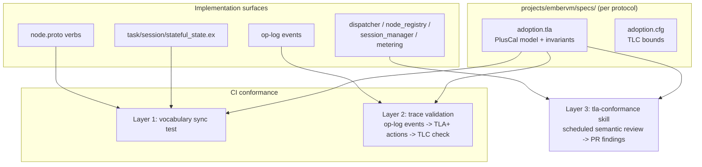

# ADR 006: TLA+ Formal Specification Pilot for Concurrency-Critical Protocols

**Author:** Joe McGinley
**Status:** Accepted
**Created:** 2026-07-16

---

## Problem

EmberVM's correctness risk is concentrated in a handful of distributed protocols where two components hold independent views of shared state and a crash or restart can interleave with in-flight operations. The bug history proves this is not hypothetical:

- **The dispatch restart wedge.** A control-plane restart left the dispatcher with an empty primed-VM inventory while noded kept the VMs alive, wedging dispatch until adoption was added (noded now reports `primed_vm_ids` on every `NodeStatus`, and `Dispatcher.adopt_inventory/1` reconciles on boot and every sweep). The bug was a missing crash-restart interleaving nobody had walked through.
- **Forget-before-kill (D-R2.7.2).** `NodeRegistry.handle_node_down` must forget a streamer pid before killing it, or a straggler `NodeStatus` message resurrects a dead node. This invariant exists only as ordering discipline in one function.
- **Reap-would-wipe-fleet.** An early reaper design would have destroyed live VMs the control plane had merely forgotten about; it was caught in review, not by a test.

These bugs share a shape: correctness depends on message ordering and crash-recovery interleavings across the Elixir control plane and the Go node daemon. Unit tests and the CI e2e drills probe only the interleavings someone thought to write down. Exhaustive exploration of small state spaces is exactly what a model checker does, and TLA+ is the mature tool for it.

The counter-risk is equally real: formal specs that drift from the implementation stop being trusted and die. Most industrial TLA+ adoptions outside Amazon and Microsoft failed this way, not by finding no bugs but by rotting. Any adoption here must decide up front how the model is kept honest.

Timing: the protocols below are now shipped and stable (R0 through R4). Specifying a stable protocol is cheap and durable; specifying a churning one is wasted work. The spec work is deliberately deferred until the remaining feature rungs are live, but the scope and conformance strategy are decided now so protocol changes between now and then can be judged against them.

---

## Decision

Run a **scoped TLA+ pilot**: specify EmberVM's highest-risk protocols as small, per-protocol PlusCal/TLA+ models checked with TLC, colocated with the code they describe (`projects/embervm/specs/`). Do not attempt a whole-system spec. The pilot starts with one protocol; extending to the others is contingent on the first spec earning its keep (finding a real interleaving bug, or materially sharpening the documented invariants).

| Aspect | Today | Decided |
| ------ | ----- | ------- |
| Interleaving invariants | Prose in DECISIONS.md + code comments (D-R2.7.2, D12.3) | Checked TLA+ actions and invariants per protocol |
| Crash-restart coverage | Manual drills (restart wedge found in prod) | Exhaustive within model bounds via TLC |
| Model honesty | n/a | Three-layer conformance: vocabulary tests, trace validation, scheduled review |
| Spec scope | n/a | Per-protocol models, a few hundred lines each; never whole-system |
| Timing | n/a | After remaining feature rungs are live; scope frozen by this ADR |

### Protocols in scope, ranked by payoff

1. **VM lifecycle + adoption** (the pilot spec). The `Prime`/`Assign`/`Destroy` verbs, the `NodeRegistry` health machine (`:starting` / `:healthy` / `:unknown` / `:down`), the primed-pool inventory in `Dispatcher`, and the adoption reconcile from noded's reported `primed_vm_ids` and `session_vms`. Model both processes plus an adversarial scheduler that can crash and restart either side at any step. Invariants to check: forget-before-kill (no resurrection by straggler status), adoption idempotence (`known_vm_ids` guard vs a just-claimed miss VM), reassign-before-adopt ordering on node death, and the safety property that no live VM is ever double-assigned and no reap destroys a VM the node still reports.
2. **Session bank/relight** (`SessionManager` / `SessionStore`). The FSM with ETS-only transient states (`:banking`, `:relighting`) that are deliberately never durable, durable outcome ops (`:session_banked`, `:session_relit`), single-flight relight with parked callers, the mid-bank invoke ledger, and crash rollback to last durable state healed by adoption. The R4 stateful variant adds generation pairing (volume generation bumped before every writable attach, stamped into the bundle at bank; mismatch forces cold boot). Invariants: at most one live VM per session, one relight per concurrent burst, no wake ever resumes a stale snapshot when the volume has moved on, snapshot never evicted unless a cold boot durably completed.
3. **Quota gate** (`Metering` + dispatcher park). Submit-time advisory check, dispatch-time enforcement inside `fq_take`, lock-free `:ets.update_counter` charging riding the durable op, fail-closed semantics (configured budget + unreadable cache = deny), daily bucket flip. Invariants: a principal with budget zero never dispatches, charges are never lost across a crash (they replay with the op), and the accepted overshoot is bounded by the concurrent-submit window (D12.3), not unbounded.

Out of scope, permanently: the router, FaaS registration, serving/xDS wiring, image/snapshot distribution. These fail loudly and locally; CI covers them.

### Keeping the model honest: three conformance layers

The pilot is judged not only on bugs found but on whether the spec can be kept demonstrably in sync. Drift defense is layered, mechanism first, judgment last, mirroring this repo's existing guard philosophy (deterministic CI checks plus scheduled judgment skills):

1. **Vocabulary sync tests (CI, deterministic).** A test extracts the action names, states, and verbs each spec claims to model and asserts they exist in the implementation surfaces: RPC verbs against `proto/embervm/node/v1/node.proto`, FSM states against `task_state.ex` / `session_state.ex` / `stateful_state.ex`, op-log verbs against `op_log.ex`. Adding a verb or state the spec does not know about fails CI and forces a human decision (update the spec or explicitly exclude it). Same pattern as the existing structure drift guards.
2. **Trace validation (CI, semantic).** The op-log is already a durable, ordered event trace of exactly the lifecycle actions the specs model, and the OTEL spans capture cross-component ordering. A conformance test maps op-log events from a CI e2e drill (or a replayed prod segment) to TLA+ actions and runs TLC in trace-checking mode: the run fails if the implementation took a step the model forbids. This is the published fix for spec-code divergence (MongoDB's eXtreme Modelling, CCF, etcd) and is what converts the spec from a design document into an executed artifact. The event-to-action translator is real work, comparable to the spec itself, and is budgeted as part of the pilot, not an afterthought. The pilot's success criterion includes a drill trace checked against the adoption spec.
3. **Scheduled review skill (judgment).** A `tla-conformance` skill on the `stpa` skill template: on a schedule, diff the protocol-relevant surfaces since the spec was last touched (proto file, FSM modules, manager GenServers, DECISIONS.md entries), judge whether any change is semantically inside the model's scope even though no names changed (a reordered guard, a new crash-recovery path), and land findings as a small reviewable PR. Deterministic scaffolding, judgment extracted as structured findings. Built only if the pilot survives its exit judgment.

### Exit judgment

The pilot ends after the adoption spec plus its layer-1 and layer-2 conformance checks. If TLC found a real interleaving bug or the trace validation caught a divergence, extend to protocols 2 and 3 and build layer 3. If it found nothing and the conformance plumbing feels like ceremony, stop: keep the one spec as documentation, lean on stateful property-based testing (StreamData) for the Elixir-local protocols, and record the outcome by superseding this ADR. Either outcome is a success; the cap on investment is the point.

---

## Architecture

The specs are design-time artifacts checked exhaustively by TLC over small bounds (2 nodes, 3 VMs, 2 principals); the conformance layers are what tie them to the running system over time.

---

## Alternatives Considered

- **Stateful property-based testing only (StreamData).** Simplest option and it stays; but generated command sequences against the real GenServers cannot model the noded side or crash-restart of the whole control plane without heavy stubbing, which is exactly where the wedge lived. Kept as the complement for Elixir-local logic (dispatcher fairness, quota arithmetic), not the answer for cross-component protocols.
- **Whole-system TLA+ spec.** Rejected: state-space explosion, unmaintainable, and the failure mode of every abandoned industrial adoption. Small per-protocol models are the published pattern that works.
- **Alloy / P / Quint instead of TLA+.** All plausible; TLA+ chosen for the mature model checker (TLC), trace-validation precedent in production systems, and the largest body of distributed-systems specs to crib from. Quint noted as a friendlier syntax over the same semantics if authoring friction proves high; switching surface languages does not invalidate this decision.
- **Spec now, before remaining rungs ship.** Rejected: specifying churning protocols multiplies the drift problem this ADR exists to contain. The scope freeze is the hedge; protocol changes landing before the pilot starts are judged against the in-scope invariants above.
- **Model checking the implementation directly (Concuerror for Elixir, Go race detector).** Complementary but different layers: they explore schedulings of the real code within one runtime, not cross-runtime message and crash interleavings. Neither models a control-plane restart against a live noded.

## Security

Baseline per `docs/security.md`; nothing here touches the running system. Specs and conformance tests are read-only artifacts in the repo and CI. One positive interaction: the no-cross-principal isolation rule from ADR 001 becomes a checkable invariant in the dispatcher and quota models (no action ever assigns principal A's task to a VM primed under principal B's session lineage).

## Risks

| Risk | Likelihood | Impact | Mitigation |
| ---- | ---------- | ------ | ---------- |
| Spec drifts from implementation and stops being trusted | High (it is the default outcome) | Pilot investment wasted, false confidence | The three conformance layers; layer 2 trace validation is a pilot success criterion, not a follow-up |
| Model idealizes away the real bug (BEAM mailbox semantics, GenServer call timeouts, caller death mid-call) | Medium | Checker passes, prod still wedges | Model the message channels explicitly (per-pid FIFO, loss on kill); trace validation catches idealization because real traces violate an idealized model |
| Trace-to-action translator becomes its own maintenance burden | Medium | Layer 2 quietly disabled | Keep the mapping table-driven off the op-log verb list that layer 1 already asserts on; one translator shared across specs |
| TLC state explosion makes checking too slow for CI | Medium | Layer 2 runs rarely, drift window grows | Small bounds are sufficient for interleaving bugs; trace checking is linear in trace length, only full checking is expensive and that runs on spec change, not every push |
| Nobody on the project reads TLA+ in a year | Low-Medium | Specs become write-only | PlusCal (algorithm-shaped) over raw TLA+; each spec headed by a prose map from actions to modules/verbs; the vocabulary test doubles as that map's freshness check |

## Open Questions

1. Where does TLC run in CI: hermetic Bazel java_binary target, or a prebuilt tool image like the OTP toolchain approach from R0?
2. Does the trace validator consume the op-log SQLite projection directly or the OTEL span export? The op-log is durable and already ordered; spans capture cross-component edges the op-log deliberately omits (ETS-only transient states are never logged, so `:banking`/`:relighting` entry is invisible to an op-log-only trace).
3. Should the session and stateful specs share a common bank/relight module with the generation-pairing extension layered on, or stay separate? (They share the FSM shape but differ in singleton and volume-anchoring invariants.)

## References

| Resource | Relevance |
| -------- | --------- |
| [ADR 001: EmberVM BEAM orchestrator](001-embervm-beam-firecracker-workload-orchestrator.md) | Hit/miss invariant, op-log design, isolation rule the specs check |
| [eXtreme Modelling in Practice (Schultz et al., VLDB 2020)](https://arxiv.org/abs/2006.00915) | MongoDB's trace-validation approach; the published fix for spec-code drift |
| [How Amazon Web Services Uses Formal Methods (CACM 2015)](https://cacm.acm.org/research/how-amazon-web-services-uses-formal-methods/) | Small per-protocol specs written post-design; the adoption posture this pilot copies |
| [etcd TLA+ spec and trace validation](https://github.com/etcd-io/raft/tree/main/tla) | Working example of CI-integrated trace checking against a Go implementation |
| [Quint](https://quint-lang.org/) | Candidate friendlier surface syntax if PlusCal authoring friction is high |
| [`projects/embervm/ARCHITECTURE.md`](../../../projects/embervm/ARCHITECTURE.md) | Current state and invariants. D-R2.7.2 forget-before-kill and adoption and D12.3 quota overshoot window, the prose invariants the specs formalize, were recorded in the retired root `DECISIONS.md`, readable in git history |
