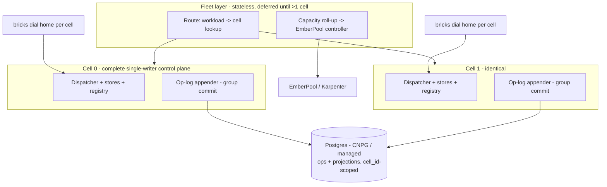

# ADR 007: Sharded Control Plane, Batched Postgres Op-Log Tier and Cell Architecture

**Author:** Joe McGinley
**Status:** Accepted
**Created:** 2026-07-17
**Refines:** [001-embervm-beam-firecracker-workload-orchestrator](001-embervm-beam-firecracker-workload-orchestrator.md), [005-embervm-eks-scale-out-metal-pool-bricks](005-embervm-eks-scale-out-metal-pool-bricks.md)

---

## Problem

A review of EmberVM against three convergent scale writeups (Modal's 1M-concurrent-sandbox redesign, Fly.io's scheduler carve-out, and the fleet-scale-Kubernetes paper ADR 001's capacity contract already borrows from) found the architecture aligned with their lessons but the implementation carrying a set of ceilings that [ADR 005](005-embervm-eks-scale-out-metal-pool-bricks.md) does not address. ADR 005 scales the data plane (bricks, Karpenter, snapshot keys); its "build now" list contains zero control-plane items. The control plane today is one instance of everything, and the first walls are there, not in the fleet:

1. **The op-log is Modal's lesson #1 verbatim.** Every task is at least four appends (`submitted`, `assigned`, `started`, terminal), each its own `BEGIN IMMEDIATE` transaction with an fsync (`PRAGMA synchronous=FULL`) on a single SQLite connection on a Longhorn PVC. Two of those fsyncs (`assign` + `start`) run synchronously inside the Dispatcher GenServer's drain loop, so dispatch throughput is roughly 1/(2 x PVC fsync latency): tens to low hundreds of tasks per second, far below the scan fleet's targets. Modal's original bottleneck was O(sandboxes) writes to an unshardable Postgres; ours is O(tasks x 4) writes to an unshareable SQLite.
2. **A genuine O(V^2) in the dispatcher sweep.** `adopt_inventory` rebuilds the full known-vm-id set per reported primed vm_id (`dispatcher.ex`, `put_vm_if_unknown` calling `known_vm_ids/1` per id), quadratic in total primed VMs, every 5s, inside the single dispatch process.
3. **Heartbeats are full-state snapshots fanning into one mailbox.** Every node streams its complete state (all primed vm_ids, session/serving/stateful VMs, all banked snapshots, volumes) every beat, and the single NodeRegistry GenServer serially reprojects each into ETS. Modal batches worker state (deltas into Redis streams); Fly gossips deltas (Corrosion). A node with thousands of banked snapshots re-serializes them all every few seconds.
4. **Timer-driven full-table reconciles.** SessionManager materializes every session 4x per 30s window; Serving/StatefulManager scan all instances every 10s; the sweepers do 3-4 full `Store.all` passes per tick and scrape every node's Envoy stats sequentially with blocking HTTP inside one GenServer. Work grows with fleet size regardless of change volume, the anti-pattern Fly names ("nothing in flyd is cached; everything is materialized on-demand").
5. **Hard-coded caps that do not scale with the fleet.** `@max_concurrent_primes 4` is cluster-global in PoolManager; bank concurrency defaults to 1 per node in both sweepers. At 50 bricks the warm pool refills at 4 in-flight primes total.
6. **First-fit task placement.** `pick_node` takes the first candidate, piling tasks onto one node until it saturates (Fly's "Katamari Damacy scheduling"); sessions and serving use rendezvous hashing, the task class has no ranking at all.
7. **Per-VM networking churn on the node.** Each serving VM add/remove execs 3+ `ip` commands (rtnl-serialized tap ops) and regenerates and re-applies the entire nftables table, O(N^2) total rule churn under one mutex. Modal hit >10s startup stalls from exactly this class of kernel contention.
8. **No horizontal path, minutes-scale failover.** Every subsystem is a singleton; the single-active SQLite tier fails over at Longhorn RWO-reattach speed. ADR 001 named `ra` as the HA tier and left "adopters offload durability to a managed backend" as the scale path, but did not decide which, or how the control plane itself shards.

The plan of record was "HA BEAM with external durable storage plugging in". This ADR decides the durable backend (batched Postgres, not `ra`), the horizontal-scaling shape (cells, not a distributed monolith), the interface seams to build now while they are one-line changes, and the performance corrections for findings 2 through 7.

---

## Decision

### 1. Durable tier: batched Postgres through the existing op-log seam

The `Embervm.OpLog` behaviour gains a Postgres backend (CloudNativePG in the homelab, a managed Postgres on EKS) and it becomes the deployment default; SQLite remains the zero-dependency single-node default for the open-source minimum example. The behaviour's callbacks (`append`, `load_*`, `list_usage`, `compact`, `evict_task`) map near 1:1 onto SQL; the write-through projections stay the same transactions they are today.

Appends are **group-committed**: a per-cell appender process collects concurrent appends for a bounded window (single-digit milliseconds or N ops, whichever first) and commits them in one transaction. Callers still block until their batch commits, so the ADR 001 invariant (durable-before-observed, enforcement fails closed) is untouched; only the fsync is amortized. The `assign`/`start` appends move off the Dispatcher's decision loop into the async worker path so the drain loop never blocks on the durable tier. Tens of thousands of appends per second is unremarkable at this shape, which retires finding 1 without weakening the audit/billing record.

**`ra` is parked, explicitly.** It is a replicated-log library, not a store: adopting it means rebuilding every projection as an applied state machine per replica, ending at the same single serialized writer, replicated, and batching entries anyway (that is where RabbitMQ quorum queues get their throughput). It also moves durability back inside the BEAM cluster when the plan is to move it out. It remains the right tool for R6 per-tenant op-log partitions and the etcd facade, where log semantics are the product.

With durability external, **control-plane pods become stateless**, which is what makes the next decision cheap.

### 2. Horizontal scaling: cells, not a distributed monolith

The unit of scale is a **cell**: a complete, boring, single-writer EmberVM control plane exactly as built today (its own Dispatcher, NodeRegistry, PoolManager, stores, one op-log appender) owning a bounded set of bricks and workloads. This is the fleet-scale-Kubernetes thesis ("clusters are homogeneous, disposable scheduling domains sized to the biggest workload, not the fleet") applied one level down, and it is the shape Fly (flaps per region) and Modal (a fleet of scheduler servers over worker-owned state) both landed on independently. ADR 001 already states the rule: a scheduling domain is sized to hold the largest single tenant; beyond that, scale by adding domains.

Cells bound n instead of re-engineering every loop: registry fan-in, sweeper scrapes, reconcile scans, and placement scans all become O(cell), where cell size is a measured budget (bricks, live VMs, appends/sec), not a wall. Ordering is only ever needed within a cell, so one appender per cell resolves the multi-writer sequence-visibility problem (a lower bigserial seq becoming visible after a higher one) by construction; nothing cross-cell needs ordering (usage roll-ups are commutative sums). A cell failing over is a stateless replica rebuilding projections from Postgres and adopting its bricks via the existing dial-home + adoption machinery, which already exists and has been drilled. A wedged dispatcher or poison workload takes down one cell.

Above the cells sits a **thin, stateless fleet layer**, deferred until there is more than one cell: it routes (which cell owns workload X, a lookup, never a scheduler) and aggregates per-profile capacity up to the EmberPool controller (the roll-up protocol from ADR 001's capacity contract). It holds no state of its own.

### 3. Build-now seams (one line today, cross-cutting rewrite later)

Applying ADR 005's discipline, the cell boundary is put into the interfaces now, with exactly one cell:

- **`cell_id` in the Postgres op-log schema** and in the registry/brick keying (alongside ADR 005's `(node, pod-UID)`), constant `cell-0` today. Retrofitting a partition key into a live billing/audit log is the canonical cross-cutting rewrite.
- **Workload-to-cell assignment as explicit data** (defaulting to `cell-0`), so routing is a lookup from day one and the fleet layer arrives as a stateless map, not a migration.
- **Bricks dial home to a per-cell address** carried in values, so re-parenting a brick is configuration, not code.
- **Per-cell budgets from measurement** once batched Postgres lands; "cell full" adds a cell, never grows the ceiling.

### 4. Control-plane performance corrections

The remaining review findings, decided direction and rationale each; sequencing lives in a plan, not here:

| Finding | Today | Decided direction |
| ------- | ----- | ----------------- |
| Dispatcher sweep O(V^2) | `known_vm_ids/1` rebuilt per adopted vm_id | Build the known-set once per sweep; O(V) |
| Heartbeat full-state fan-in | Full VM/snapshot lists per beat, one registry mailbox | Delta or hash-guarded status (send full state only when its digest changes); streamers project into ETS directly, the registry GenServer keeps only health transitions and reconnect policy |
| Timer-driven full scans | `Store.all` several times per tick; sequential blocking Envoy scrapes | Level-triggered/incremental reconciles keyed on change signals where change volume is the driver; scrapes concurrent and off the manager process |
| Global prime cap, per-node bank cap | 4 cluster-wide primes; 1 bank per node | Per-brick budgets owned near the daemon (the daemon already reports headroom); refill scales with fleet size |
| First-fit task placement | `Enum.find` over candidates | Utilization-ranked candidate ordering (best-fit spread, Fly's utility-function shape); rendezvous hashing stays for warmth-keyed classes |
| EndpointPublisher serial PUTs | One blocking Finch PUT per node per flush | Concurrent per-node pushes; a slow sidecar stalls only its own node |
| nftables full-table regen per VM event | Whole `embervm_serving` table rebuilt and re-applied per add/remove; taps via exec'd `ip` | Incremental `nft add/delete rule` per VM (recorded now, implemented when serving churn hurts, so it is not rediscovered at brick scale) |

One documentation correction rides along: the EmberVM README says state lives in a "Postgres op-log"; until the backend in this ADR ships it is SQLite-WAL, and the README should say what is true at each point.

| Aspect | Today | Decided |
| ------ | ----- | ------- |
| Durable backend | SQLite-WAL, single connection, PVC, fsync per append | Batched (group-commit) Postgres via the op-log seam; CNPG homelab, managed Pg on EKS; SQLite stays the zero-dep single-node default |
| Appends on the dispatch loop | `assign`+`start` fsync inside the drain loop | All appends off the decision loop; callers await their batch commit |
| HA story | Single-active SQLite, minutes on PVC reattach; `ra` named as the HA tier | Stateless replicas over Postgres; `ra` parked for R6 |
| Horizontal scaling | None (all singletons) | Cells: bounded single-writer control planes; thin stateless fleet layer when >1 |
| Sequence semantics | SQLite rowid, gapless global order | Per-cell appender; ordering guaranteed within a cell, never across |
| Control-plane hot loops | Findings 2-7 above | Corrections table above |

---

## Architecture

Nothing on the serving hit path changes: the hit/miss invariant keeps Envoy answering during any control-plane or Postgres event, exactly as today.

---

## Alternatives Considered

- **`ra` as the HA/durable tier (ADR 001's named option).** Rejected as the default path: a log library, not a store; projections rebuilt per replica; a single Raft group is still one serialized writer and needs entry batching anyway; internalizes the state the HA plan wants external. Reserved for R6 per-tenant partitions and the etcd facade.
- **One sharded distributed monolith** (global dispatcher over shared state, entities hash-distributed across replicas). Rejected: reintroduces cross-shard coordination on every hot loop and keeps every singleton scan unbounded; cells bound n and keep each control plane boring.
- **Postgres-per-cell now.** Deferred: one CNPG cluster with `cell_id`-scoped data first; splitting a cell out to its own database later is a data move behind the seam, and shared Postgres keeps fleet-wide usage queries trivial while cell count is small.
- **Async appends (ack before commit).** Rejected: breaks durable-before-observed, which is the audit and billing record. Batch the fsync, keep the invariant.
- **No store in the creation critical path (Modal's endgame).** Rejected for EmberVM: Modal's sandboxes are ephemeral; our durable task semantics are the product. Batching removes the store from the throughput path while keeping it in the correctness path.
- **Federation frameworks / bigger single domains.** Not applicable: EmberVM already keeps execution state off etcd; the fleet-scale paper's prescription (many small homogeneous domains, thin coordinator) is adopted at the cell layer instead.

---

## Security

Baseline in [docs/security.md](../../security.md). Postgres becomes the audit and billing book-of-record: access is scoped to the control-plane service account only (1Password-operator credentials, TLS in-cluster via CNPG), never to nodes or guests; the facts-not-payloads rule means it stores request envelopes and usage, and result bodies remain TTL-bounded projections as in ADR 002. Enforcement stays fail-closed and is unchanged: quota or capacity state unreadable means dispatch denied, per cell. Cell isolation bounds blast radius: a compromised or wedged cell owns its bricks and workloads, not the fleet's. The fleet layer holds no secrets and no state.

---

## Risks

| Risk | Likelihood | Impact | Mitigation |
| ---- | ---------- | ------ | ---------- |
| Shared Postgres outage halts dispatch in every cell | Medium | High | CNPG HA (seconds failover); serving hit path unaffected by design; per-cell Postgres is the recorded escape hatch behind the same seam |
| Group-commit window couples one slow fsync to a batch of callers | Medium | Medium | Bounded batch window with a latency budget; batch size caps; the window is tunable per cell |
| Seq-semantics regression for future replayers (gaps, per-cell ordering only) | Medium | Medium | One appender per cell by construction; the ordering contract (within-cell only) documented at the seam; `read_from` stays cell-scoped |
| Hot tenant outgrows its cell | Medium | Medium | ADR 001's domain-sizing rule (a cell holds the largest tenant); workload-to-cell assignment is data, so rebalancing is a re-assignment plus brick re-parenting |
| Migration from live SQLite loses or forks history | Low | High | One-time import replay through the seam during a maintenance window; SQLite file retained read-only until the retention horizon passes |
| Premature complexity while there is one cell | Medium | Low | Only the seams (cell_id, assignment data, dial-home address) are built now; the fleet layer waits for a second cell |

---

## Open Questions

1. **Partitioning shape in shared Postgres**: a `cell_id` column with declarative partitioning (compaction drops partitions cheaply) vs schema-per-cell (harder fleet queries, cleaner blast radius).
2. **Appender topology**: whether the group-commit appender lives inside each store's process tree or as one per-cell process all stores call, and its backpressure semantics at saturation (submit 429 vs bounded queue).
3. **Fleet-layer placement policy** for new workloads once cells multiply: least-loaded, hash, or tenant-pinned.
4. **Batch window tuning**: the latency/throughput point per class (task appends tolerate a few ms; serving lifecycle ops are rarer and latency-insensitive).
5. **When serving churn justifies the incremental-nftables work**, and whether taps move to a netlink library at the same time.

---

## References

| Resource | Relevance |
| -------- | --------- |
| [ADR embervm/001](001-embervm-beam-firecracker-workload-orchestrator.md) | The state model, capacity contract, and domain-sizing rule this refines; named `ra` as the HA option this ADR parks |
| [ADR embervm/002](002-op-log-retention-and-compaction.md) | Retention/compaction semantics carried onto the Postgres backend |
| [ADR embervm/005](005-embervm-eks-scale-out-metal-pool-bricks.md) | The data-plane scale-out this completes with a control-plane story; the build-now-seams discipline reused here |
| [Modal: scaling to 1M concurrent sandboxes](https://modal.com/blog/scaling-to-1-million-concurrent-sandboxes-in-seconds) | O(sandboxes) DB writes as the first wall; worker-owned state; batching; kernel/rtnl contention |
| [Fly.io: carving the scheduler out of our orchestrator](https://fly.io/blog/carving-the-scheduler-out-of-our-orchestrator/) | Worker-as-source-of-truth, utilization-ranked placement, Katamari scheduling, regional (cell) brokers |
| [Fleet-scale Kubernetes](https://lucy.sh/fleet-scale-kubernetes) | Homogeneous disposable domains + thin coordinator; the cell model and roll-up protocol adopted here |
| [CloudNativePG](https://cloudnative-pg.io) | The homelab Postgres HA operator already deployed (`projects/platform/cloudnative-pg/`) |
| [RabbitMQ quorum queues](https://www.rabbitmq.com/docs/quorum-queues) | Evidence that Raft throughput comes from entry batching; why `ra` alone does not retire finding 1 |

---

## Amendment (2026-07-26)

**[ADR 020](020-admission-control-plane-token-routing-peer-redistribution.md) decision 6 reverses this ADR's rejection of "no store in the creation critical path", for the metering write specifically.** Metering moves onto per-brick leases that debit locally and report on the dial-home cadence, so it leaves the creation path entirely. The reversal is narrow: task dispatch, results, and the ordered journal are unchanged, and the group-commit appender this ADR decided remains the durable tier. The justification is that metering allocates running costs within an organisation rather than charging customers, so an unverifiable count is an accounting inconvenience rather than a loss.
