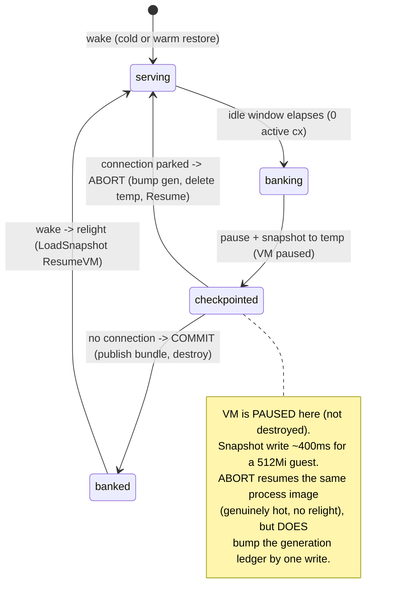

# ADR 008: Interruptible Bank for Scale-to-Zero Stateful Datastores

**Author:** Joe
**Status:** Accepted
**Created:** 2026-07-17

---

## Problem

The R4 stateful class scales a datastore to zero: when a workload goes idle its
microVM is banked (paused, snapshotted, destroyed) and the next inbound
connection wakes it. The bank is a single atomic operation on the node daemon,
`StopStateful(BANK)`, which does pause, then `CreateSnapshot`, then tear the VM
down. A relight (warm restore) is only possible when a completed bundle's stamped
generation still pairs with the volume's current generation.

That atomicity has a sharp edge for a latency-sensitive datastore. A connection
that arrives while a bank is in flight cannot get the live VM back (it is already
being destroyed) and there is no committed bundle yet to relight from, so the
wake falls through to a **cold boot**: for Postgres that means a fresh process
launch plus WAL recovery (and, on a first boot, `initdb`), landing well into the
hundreds of milliseconds to seconds. Worse, the cold boot bumps the volume
generation, which strands the bank that was still completing, so its bundle is
evicted and the *next* wake cold-boots too. Under an aggressive idle window (the
`demo-postgres` exhibit runs `idleBankSeconds: 1`) a human clicking at the wrong
moment reliably falls into this state, and `bundle_generation` never settles to a
resumable value: every wake is a cold boot.

For a demo this is merely unimpressive. For a real datastore backing
low-latency queries (the scratch-postgres tenants, Loom), a surprise
multi-hundred-millisecond cold boot on an ordinary query is a correctness-shaped
UX failure: the store is nominally "always available, scaled to zero," but a wake
that races an idle bank pays cold-boot latency with no signal to the caller.

We want a scale-to-zero datastore whose every steady-state wake is either **hot**
(the VM never actually went away) or a **warm restore** (relight from a clean
snapshot), and **never a cold boot**, without regressing the simpler workloads
(task, session, serving, composite, and stateful workloads that do not need this)
or expanding the frozen bank-relight invariant surface for all of them.

---

## Decision

Add a **per-workload, opt-in** interruptible bank mode to the stateful class.
It is **off by default**: an unset or false flag leaves the bank exactly as it is
today (atomic pause, snapshot, destroy), so every existing workload and the
existing bank-relight invariant are unchanged. A latency-sensitive datastore opts
in with a single boolean CR field, `spec.stateful.interruptibleBank: true`. A
boolean is chosen deliberately for a single alternative behavior; if future work
adds a third bank strategy this field is expected to be superseded by an enum
(`spec.stateful.bankMode: atomic | interruptible | ...`), and the code and CRD
should carry a comment to that effect so the migration is anticipated rather than
a surprise.

When the mode is on, the bank becomes **two-phase and abortable**:

1. **Checkpoint** (workload idle, zero active connections): pause the VM and
   write the snapshot to a temporary path that is **invisible to the bundle
   rescan** (written outside the `stateful/` bundle dir, so a `ScanStatefulBundles`
   after a crash never mistakes it for a committed bundle). The VM is paused, not
   destroyed, so it is still resumable. The snapshot is not yet committed as the
   workload's bundle.
2. **Resolve.** After the snapshot write completes, the control plane decides:
   - If a connection has **parked** for this workload in the meantime: **abort**.
     In this order: **bump the volume generation, delete the temporary snapshot,
     then resume** the paused VM and republish the endpoint. The parked connection
     splices to the now-hot VM. It is the **same instance** resumed (same process
     and memory image, so it is genuinely hot with no relight), but the generation
     ledger IS advanced by one write. This is the **hot** path.
   - If **no** connection is waiting: **commit**. Destroy the VM and publish the
     temporary snapshot into the bundle dir as the workload's bundle (stamped with
     the current, now frozen, volume generation, snapfile published last per the
     completeness discipline). The next wake relights from it. This is the
     **warm-restore** path.

So an opted-in workload's wake is always hot or warm, never cold, in steady
state. There are exactly **three cold exceptions**, all outside steady-state
operation: the genuine first boot (no snapshot exists yet), an explicit operator
`DeleteVolume` / force-cold-boot, and the **max-lifetime forced roll** (see the
Forced roll note below). Opted-in datastores should therefore set a
`maxLifetimeSeconds` long enough that rolls are rare.

The commit-vs-abort decision is driven by a **two-phase `StopStateful`**
contract: a checkpoint call (pause and snapshot to a rescan-invisible temporary
path, leaving the VM paused and resumable) followed by a resolve call that either
commits (publish the bundle, destroy) or aborts (bump generation, delete the temp,
resume). The control plane owns the resolve because only it sees whether a
connection has parked. The two-phase split is preferred over a single blocking RPC
that polls a control-plane abort signal: it keeps the node daemon's role mechanical
(do what the resolve says) and the policy in the control plane.

**Forced roll.** The max-lifetime roll (decision 8) exists to retire a stale base
lineage, so it must genuinely destroy and it cannot be satisfied by a relight (a
relight resumes the same over-lifetime process image, which would immediately be
over-lifetime again: a roll loop). So a forced roll always `DESTROY`s with no
bundle even if a connection is waiting, and the next wake cold-boots. This is why
the forced roll is one of the three named cold exceptions rather than a
steady-state guarantee, and why opted-in datastores want a long
`maxLifetimeSeconds`.

To bound pathological flapping, the mode carries a **coarse bank-rate guard**: a
workload that keeps aborting without ever committing a bundle (wake, bank, abort,
wake, bank, abort ...) must not be able to thrash pause/resume indefinitely. The
guard is deliberately blunt for now (the intent is only to stop a workload
churning for tens of minutes, not to finely pace it); once a workload trips it,
the bank commits (destroy) on the next cycle instead of aborting, so it settles
into a banked bundle rather than spinning. Note this does not truly end a periodic
traffic pattern that straddles the idle window; it converts those wakes from hot
to warm-restore, which is acceptable for a blunt guard. The exact threshold is a
tuning knob to refine with real traffic, not a precise contract. The guard's
counter is in-memory and resets on a control-plane restart (a fresh window after a
restart is harmless).

| Aspect                             | Today (atomic bank)                          | Decided (opt-in interruptible bank)                        |
| ---------------------------------- | -------------------------------------------- | ---------------------------------------------------------- |
| Bank operation                     | pause, snapshot, destroy (one shot)          | pause, snapshot, then commit-destroy OR abort-resume       |
| Wake racing an in-flight bank      | cold boot (and strands the bank)             | hot (VM resumed) or warm (relight from the committed bundle) |
| Steady-state cold boots            | possible under aggressive idle windows       | none; the only cold paths are the three exceptions (first boot, explicit reset, max-lifetime roll) |
| Aggressive idle window (e.g. 1s)   | degrades to always-cold-boot                 | safe: keep the aggressive sleep AND never cold-boot        |
| Applies to                         | all stateful workloads                       | only workloads that set the flag; others unchanged         |
| Invariant surface                  | one bank-relight FSM                         | second, gated FSM path scoped to opted-in workloads        |

---

## Architecture

The node driver already exposes every primitive this needs: `Pause`, `Resume`,
`CreateSnapshot`, and `LoadSnapshot(ResumeVM: true)`. The serving class already
uses pause, snapshot, resume (keeping a VM live across a snapshot) and already
recovers a paused VM with `Resume` when a snapshot fails. Only
`SnapshotStateful` hardcodes pause, snapshot, destroy. So this is an
orchestration change (a two-phase `StopStateful` contract plus control-plane
coordination), not new Firecracker plumbing.

Three coordination facts make the resolve step correct:

- **A parked connection is the abort signal.** The bank only begins after the
  endpoint is unpublished and the activator fallback is installed, so a connection
  that arrives during the snapshot parks at the activator and is visible to the
  control plane. The commit-vs-abort decision runs in `StatefulSweeper` while the
  parked signal lives in `StatefulManager`, so the resolve is a deliberate
  cross-GenServer read: the sweeper asks the manager "is anyone parked for this
  workload?" at resolve time. A connection that parks in the gap between that read
  and the commit degrades the wake from hot to warm-restore (the manager relights
  it off the just-committed bundle), which the guarantee permits.
- **A wake during an unresolved checkpoint parks, it does not plan a boot.** Today
  a wake while `banking` immediately plans a COLD boot; under this mode that RPC
  would bounce off the writable-attach lock (the checkpointed VM still holds the
  volume) and error the caller. So the manager must, for an opted-in workload with
  an in-flight checkpoint, **park the caller until the resolve lands**, then plan:
  hot on abort (splice to the resumed VM), warm on commit (relight the bundle).
  This is the third leg the hot-or-warm guarantee stands on.
- **The snapshot write is not interruptible mid-call.** `CreateSnapshot` is a
  blocking write (about 400ms for a 512Mi guest), so the abort resolves right
  after it returns, not during it. A racing connection waits out that pause and
  then hits the resumed VM.

### Correctness: which snapshots may be kept

The safety of relight rests on one rule, which this mode preserves rather than
weakens:

> **Only a snapshot taken immediately before teardown (with the volume frozen
> afterward) may be kept and relit from. Any snapshot whose VM resumes is
> discarded.**

This holds because a kept bundle is only ever recorded on the commit path, where
the VM is paused, snapshotted, then destroyed: the volume is frozen from the
snapshot instant onward, so the bundle's memory image matches the on-disk state
exactly.

The abort path is where a naive design leaks, so it is protected by **three
layered guarantees**, not one. The failure to avoid: a temp snapshot stamped at
generation G, an aborted VM that resumes and writes at the same generation G, and
a crash before the temp is deleted, leaving a wrongly-paired bundle a later
relight could load (memory older than the diverged disk). Generation pairing alone
does NOT catch this, precisely because the abort resumes the same attach, so
without further action the temp and the writing volume would share generation G.
The three guarantees:

1. **The temp is invisible to the bundle rescan.** It is written outside the
   `stateful/` bundle dir (or without the snapfile-published-last completeness
   marker), so `ScanStatefulBundles` after any crash never adopts it as a bundle.
   A startup GC sweeps orphaned temps.
2. **The abort bumps the generation before resuming.** The order is bump, delete
   temp, resume. So any write after resume is witnessed by generation G+1, and even
   a temp that somehow survived (defeating guarantee 1) is stamped G against a
   volume at G+1: the pairing invariant refuses it. This is the same invariant the
   cold-boot path relies on (a writable re-exposure must be witnessed by a strictly
   newer generation); the abort is that re-exposure and now honors it. The cost is
   one ledger write, not a re-attach or a relight, so the VM stays genuinely hot.
3. **Delete precedes resume.** Because the temp is deleted before the VM resumes,
   a surviving temp after a crash implies the resume was never issued, which
   implies the volume is still snapshot-consistent. The crash window is closed from
   both ends.

Any one of the first two closes the leak; all three are kept because the cost is
trivial and the failure is the exact thing the R4 design exists to prevent.

### In-flight queries and the boundaries of the "not frozen" claim

Standing decision 7 forbids banking while any connection is active: the bank only
starts at zero active connections, so in the common case no mid-flight query is
frozen, and a *new* connection arriving during the roughly 400ms snapshot parks
and is served on resume or relight. Two edges keep this from being an absolute,
and the mode handles them rather than claiming they cannot happen:

- **The decision-7 recheck fails open on a stats-scrape failure** (the sweeper
  suppresses idle detection but a bank already committed to its window can proceed
  without a fresh reading). For an opted-in workload this recheck is made to **fail
  closed** instead: if the pre-pause scrape cannot confirm zero active connections,
  the checkpoint does not proceed (or an in-flight one aborts). This is cheap and
  in the spirit of a never-cold mode, and it removes the case where an active
  connection is frozen for the pause and then severed by a commit that did not see
  it (because an established connection is on the live backend, not parked at the
  activator).
- **The unpublish -> node-Envoy propagation window.** `EndpointPublisher.publish`
  is not synchronously acknowledged by every node Envoy, so a connection can land
  on the live backend after the recheck scrape yet before the pause. The mode gates
  the pause on propagation having settled (a short settle bound after unpublish)
  before checkpointing, so the "arrivals during the snapshot park at the activator"
  fact actually holds.

And the honest bound: access is queued rather than served, not literally never
refused. The park cap (`park_full`) and the per-workload wake-rate limit still
reply with an error at their limits, exactly as they do for the atomic bank; this
mode does not change those backpressure edges.

### Crash recovery: a VM stranded paused awaiting resolve

The checkpointed-but-unresolved state is a new node-truth shape, so adoption must
account for it (the precedent is the dispatch-restart wedge, fixed by having noded
report `primed_vm_ids`). Three cases:

- **Control-plane (or sweeper) restart with a VM paused awaiting resolve.** noded
  reports checkpoint-pending VMs in its inventory; adoption resolves a stranded
  checkpoint with the safe default (abort/resume, honoring the bump-delete-resume
  order), so the workload returns to serving rather than sitting dark.
- **noded never hears a resolve (dead control plane).** noded carries a
  **resolve timeout**: a checkpoint left unresolved for T auto-aborts (resume,
  discard temp), so a dead control plane cannot leave a paused VM burning a
  live-VM cap slot and its memory indefinitely with every connection parked dark.
- **noded restart.** The Firecracker process dies with noded and the temp is
  GC'd on startup, so the next wake is a crash-path cold boot. That is legitimately
  outside "steady state" and needs no special handling beyond the temp GC.

Two invariants keep the resolve-timeout and adoption from racing into a double
resolve. First, **a checkpoint accepts exactly one resolve**: a control-plane
COMMIT that arrives after noded's timeout auto-abort is rejected. The
delete-before-resume ordering already makes the dangerous outcome impossible (the
temp is gone, so a late commit has nothing to publish and errors), but the node
enforces single-resolve explicitly rather than relying on that side effect.
Second, **a commit that publishes the bundle then crashes before destroy is still
safe**: adoption's default abort-resume bumps the generation to G+1, so the
already-published G-stamped bundle is refused by pairing rather than relit, and the
next clean bank re-publishes at G+1.

---

## Alternatives Considered

- **Wait-then-relight (no resume).** Keep the atomic destroy, but make a wake
  during `banking` block until the bank commits, then relight from the fresh
  bundle. Correct and control-plane-only, but it pays a full relight (teardown
  plus `LoadSnapshot`) for the racing caller, where the resume path just unpauses
  the same process. Rejected as the primary design; kept as a possible fallback if
  the resume path proves fragile.
- **Make interruptible bank the default for all stateful workloads.** Simplest
  surface (one code path), but it expands the frozen bank-relight invariant and
  the FSM for every workload, including those that neither need nor were verified
  against it. Rejected in favor of the opt-in flag, which contains the invariant
  delta and the complexity to the workloads that ask for it.
- **Never scale to zero (keep the datastore warm).** Trivially avoids cold boots
  but discards the entire scale-to-zero value proposition and the metering
  savings. Rejected: the point is a datastore that costs one volume file plus one
  bundle when idle.
- **Longer idle window as the only fix.** A larger `idleBankSeconds` (for example
  5s) lets banks complete in the quiet gap between deliberate clicks, which makes
  relight reliable for a narrated demo. It is a useful stopgap but does not
  eliminate the mistimed-wake cold boot and it softens the aggressive-sleep
  behavior. Kept as an interim tuning, not the decision.

---

## Security

Baseline per `docs/security.md`. No new trust boundary: the interruptible bank is
an internal lifecycle change on the node daemon and control plane, over the same
authenticated gRPC the atomic bank already uses. First-boot secrets
(`POSTGRES_PASSWORD` via `mmds_env`) are delivered only on FRESH or COLD wakes and
never on a resume or a relight, which this mode does not change: an abort resumes
an already-running VM (no re-injection) and a commit-then-relight restores memory
that already holds the initialized cluster. The temporary checkpoint snapshot
(which contains guest memory, possibly including secrets) lives on the same
node-local NVMe as committed bundles. It is deleted before resume on the abort
path, but a crash between the snapshot and that delete can leave it on disk until
the startup GC of orphaned temps reaps it, so the GC is a data-at-rest hygiene
requirement, not only a correctness one. It does not widen the trust boundary
(committed bundles already sit on the same NVMe with the same guest memory).

---

## Risks

| Risk                                                                 | Likelihood | Impact | Mitigation                                                                                                                                     |
| -------------------------------------------------------------------- | ---------- | ------ | --------------------------------------------------------------------------------------------------------------------------------------------- |
| Two-phase bank widens a race the atomic bank did not have            | Medium     | High   | Extend the ADR-006 TLA+ bank-relight pilot spec with the new `checkpointed` state and abort/commit edges (this is in-scope follow-up spec work, not existing coverage); gate behind the opt-in flag so unproven paths never touch default workloads. |
| A resumed VM's snapshot is relit (the abort-path crash leak)         | Low        | High   | Three layered guarantees: the temp is invisible to `ScanStatefulBundles` + startup-GC'd; the abort bumps the generation before resume so a survivor is refused by pairing; delete precedes resume so a survivor implies no resume happened. A BDD test asserts a resumed VM never yields a relightable bundle. |
| VM stranded paused awaiting resolve (control-plane restart or death) | Medium     | Medium | noded reports checkpoint-pending VMs in inventory (adoption resolves them, default abort); noded carries a resolve timeout that auto-aborts after T so a dead control plane cannot pin a paused VM's cap slot and memory. |
| Abort/resume path leaves a VM stranded paused (resume itself fails)  | Low        | Medium | The driver already tears down a VM whose `Resume` fails (dead-handle path); on failure fall back to the committed-destroy path so the next wake cold-boots (degraded, not wedged). |
| Snapshot-write pause (about 400ms) freezes/severs an active conn     | Low        | Medium | Decision-7 recheck made fail-closed for opted-in workloads + an unpublish-propagation-settled gate before pause, so the pause only ever happens with connections parked, not active. |
| Aborts leave no durable trace (auditability regression)              | Medium     | Low    | Banking transitions are ETS-only, so a routine abort and the flap-guard's trigger history would otherwise be invisible; emit at least a metric/span (and consider a durable record) for aborts and guard-fires, since the R4 design leans on the op-log telling the whole story. |
| Per-workload flag drift (enabled where the invariant was not vetted) | Low        | Medium | Default off; the watcher validates the flag is only honored for class `stateful`; the ADR names the intended consumers (demo-postgres, scratch-postgres). |

---

## Resolved in this ADR

1. **CR field:** a boolean `spec.stateful.interruptibleBank` (default false), with
   a code/CRD comment anticipating a future `bankMode` enum if a third strategy
   appears.
2. **Mechanism:** a two-phase `StopStateful` (checkpoint call, then a
   commit-or-resume resolve call), with the control plane owning the resolve.
3. **Flap guard:** a coarse bank-rate guard that forces a commit (destroy) once a
   workload aborts too many times without committing, so it settles rather than
   thrashing pause/resume for tens of minutes. Blunt now, tunable later.
4. **Forced roll:** the max-lifetime forced roll (decision 8) always `DESTROY`s
   (no bundle) even with a connection waiting, so it is a named cold exception, not
   a steady-state guarantee. Opted-in datastores set a long `maxLifetimeSeconds` so
   rolls are rare. The abort path never blocks a required roll.
5. **Abort safety:** the abort orders its steps bump-generation, delete-temp,
   resume; the checkpoint's temp snapshot is invisible to the bundle rescan and
   startup-GC'd. These close the abort-path crash leak from three sides (see
   Correctness).
6. **Snapshot reuse:** the commit publishes the checkpoint's own snapshot as the
   bundle; there is no second snapshot (the VM is paused throughout, so the
   checkpoint image is exactly the commit image).
7. **Fail-closed recheck:** for opted-in workloads the decision-7 zero-active-cx
   recheck fails closed (no checkpoint on an unconfirmed scrape), and the pause
   waits for unpublish propagation to settle, so a checkpoint only happens with
   connections parked rather than active.

## Open Questions

1. The exact flap-guard threshold and window, to be tuned against real traffic
   once the mode carries load.
2. The exact `T` for the noded-side resolve timeout (the auto-abort on a dead
   control plane), to be set alongside the flap-guard tuning.

---

## References

| Resource                                                                 | Relevance                                                     |
| ------------------------------------------------------------------------ | ------------------------------------------------------------ |
| [ADR 001](001-embervm-beam-firecracker-workload-orchestrator.md)         | The R4 stateful class, bank-relight lifecycle, decision 7    |
| [ADR 003](003-control-plane-managed-snapshot-distribution.md)            | Snapshot bundle handling the bank produces                   |
| [ADR 006](006-tla-formal-specification-pilot.md)                         | The frozen bank-relight invariant set this mode extends      |
| `projects/embervm/noded/fcvm/driver/driver.go`                           | Pause/Resume/CreateSnapshot/LoadSnapshot primitives          |
| `projects/embervm/noded/server/stateful.go`                              | `StopStateful(BANK)` atomic pause-snapshot-destroy today     |
| `projects/embervm/control/lib/embervm/stateful_sweeper.ex`               | Idle detection and the decision-7 abort guard                |
| `projects/embervm/control/lib/embervm/stateful_state.ex`                 | Stateful FSM (banking, banked, relighting states)            |
