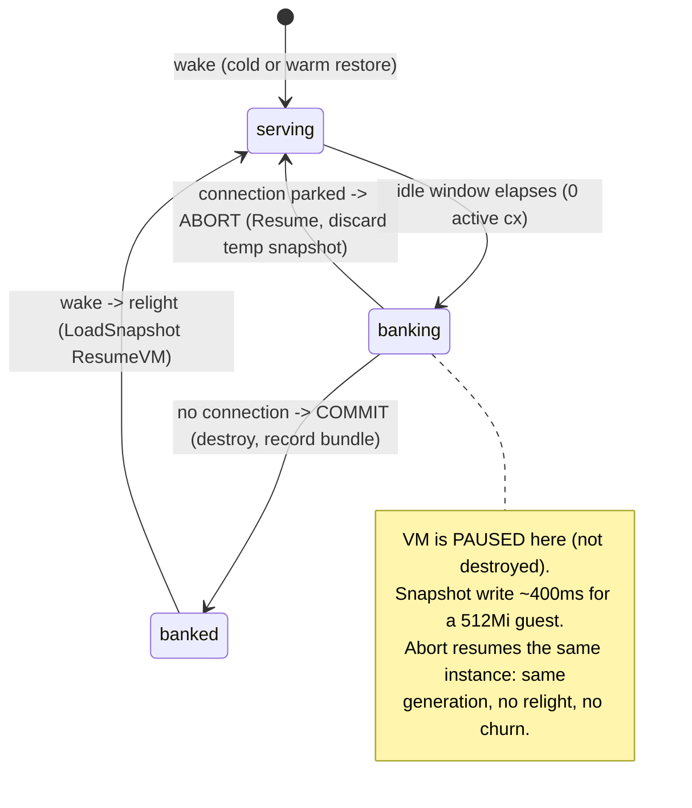

# ADR 008: Interruptible Bank for Scale-to-Zero Stateful Datastores

**Author:** Joe
**Status:** Accepted
**Created:** 2026-07-17

---

## Problem

The R4 stateful class scales a datastore to zero: when a workload goes idle its
microVM is banked (paused, snapshotted, destroyed) and the next inbound
connection wakes it. The bank is a single atomic operation on the node daemon,
`StopStateful(BANK)`, which does pause, then `CreateSnapshot`, then tear the VM
down. A relight (warm restore) is only possible when a completed bundle's stamped
generation still pairs with the volume's current generation.

That atomicity has a sharp edge for a latency-sensitive datastore. A connection
that arrives while a bank is in flight cannot get the live VM back (it is already
being destroyed) and there is no committed bundle yet to relight from, so the
wake falls through to a **cold boot**: for Postgres that means a fresh process
launch plus WAL recovery (and, on a first boot, `initdb`), landing well into the
hundreds of milliseconds to seconds. Worse, the cold boot bumps the volume
generation, which strands the bank that was still completing, so its bundle is
evicted and the *next* wake cold-boots too. Under an aggressive idle window (the
`demo-postgres` exhibit runs `idleBankSeconds: 1`) a human clicking at the wrong
moment reliably falls into this state, and `bundle_generation` never settles to a
resumable value: every wake is a cold boot.

For a demo this is merely unimpressive. For a real datastore backing
low-latency queries (the scratch-postgres tenants, Loom), a surprise
multi-hundred-millisecond cold boot on an ordinary query is a correctness-shaped
UX failure: the store is nominally "always available, scaled to zero," but a wake
that races an idle bank pays cold-boot latency with no signal to the caller.

We want a scale-to-zero datastore whose every steady-state wake is either **hot**
(the VM never actually went away) or a **warm restore** (relight from a clean
snapshot), and **never a cold boot**, without regressing the simpler workloads
(task, session, serving, composite, and stateful workloads that do not need this)
or expanding the frozen bank-relight invariant surface for all of them.

---

## Decision

Add a **per-workload, opt-in** interruptible bank mode to the stateful class.
It is **off by default**: an unset or false flag leaves the bank exactly as it is
today (atomic pause, snapshot, destroy), so every existing workload and the
existing bank-relight invariant are unchanged. A latency-sensitive datastore opts
in with a single boolean CR field, `spec.stateful.interruptibleBank: true`. A
boolean is chosen deliberately for a single alternative behavior; if future work
adds a third bank strategy this field is expected to be superseded by an enum
(`spec.stateful.bankMode: atomic | interruptible | ...`), and the code and CRD
should carry a comment to that effect so the migration is anticipated rather than
a surprise.

When the mode is on, the bank becomes **two-phase and abortable**:

1. **Start bank** (workload idle, zero active connections): pause the VM and
   write the snapshot to a temporary path. The VM is paused, not destroyed, so it
   is still resumable. The snapshot is not yet committed as the workload's bundle.
2. **Resolve.** After the snapshot write completes, the control plane decides:
   - If a connection has **parked** for this workload in the meantime: **abort**.
     Resume the paused VM, delete the temporary snapshot, and republish the
     endpoint. The parked connection splices to the now-hot VM. Same instance,
     same generation, no churn. This is the **hot** path.
   - If **no** connection is waiting: **commit**. Destroy the VM and record the
     temporary snapshot as the workload's bundle (stamped with the current, now
     frozen, volume generation). The next wake relights from it. This is the
     **warm-restore** path.

So an opted-in workload's wake is always hot or warm, never cold, in steady
state. (The genuine first boot with no snapshot, and an explicit operator
`DeleteVolume` / force-cold-boot, are still cold by definition.)

The commit-vs-abort decision is driven by a **two-phase `StopStateful`**
contract: a checkpoint call (pause and snapshot to a temporary path, leaving the
VM paused and resumable) followed by a resolve call that either commits (destroy,
record the bundle) or aborts (resume, delete the temporary snapshot). The control
plane owns the resolve because only it sees whether a connection has parked. The
two-phase split is preferred over a single blocking RPC that polls a
control-plane abort signal: it keeps the node daemon's role mechanical (do what
the resolve says) and the policy in the control plane.

To bound pathological flapping, the mode carries a **coarse bank-rate guard**: a
workload that keeps aborting without ever committing a bundle (wake, bank, abort,
wake, bank, abort ...) must not be able to thrash pause/resume indefinitely. The
guard is deliberately blunt for now (the intent is only to stop a workload
churning for tens of minutes, not to finely pace it); once a workload trips it,
the bank commits (destroy) on the next cycle instead of aborting, so it settles
into a banked bundle rather than spinning. The exact threshold is a tuning knob
to refine with real traffic, not a precise contract.

| Aspect                             | Today (atomic bank)                          | Decided (opt-in interruptible bank)                        |
| ---------------------------------- | -------------------------------------------- | ---------------------------------------------------------- |
| Bank operation                     | pause, snapshot, destroy (one shot)          | pause, snapshot, then commit-destroy OR abort-resume       |
| Wake racing an in-flight bank      | cold boot (and strands the bank)             | hot (VM resumed) or warm (relight from the committed bundle) |
| Steady-state cold boots            | possible under aggressive idle windows       | none (only first boot / explicit reset)                    |
| Aggressive idle window (e.g. 1s)   | degrades to always-cold-boot                 | safe: keep the aggressive sleep AND never cold-boot        |
| Applies to                         | all stateful workloads                       | only workloads that set the flag; others unchanged         |
| Invariant surface                  | one bank-relight FSM                         | second, gated FSM path scoped to opted-in workloads        |

---

## Architecture

The node driver already exposes every primitive this needs: `Pause`, `Resume`,
`CreateSnapshot`, and `LoadSnapshot(ResumeVM: true)`. The serving class already
uses pause, snapshot, resume (keeping a VM live across a snapshot) and already
recovers a paused VM with `Resume` when a snapshot fails. Only
`SnapshotStateful` hardcodes pause, snapshot, destroy. So this is an
orchestration change (a two-phase `StopStateful` contract plus control-plane
coordination), not new Firecracker plumbing.

Two coordination facts make the resolve step correct:

- **A parked connection is the abort signal.** The bank only begins after the
  endpoint is unpublished and the activator fallback is installed, so any
  connection that arrives during the snapshot parks at the activator and is
  visible to the control plane. The control plane, not the node, owns the
  commit-vs-abort decision because only it sees the parked connection.
- **The snapshot write is not interruptible mid-call.** `CreateSnapshot` is a
  blocking write (about 400ms for a 512Mi guest), so the abort resolves right
  after it returns, not during it. The racing connection waits out that pause
  and then hits the resumed VM. It is never rejected, only briefly queued.

### Correctness: which snapshots may be kept

The safety of relight rests on one rule, which this mode preserves rather than
weakens:

> **Only a snapshot taken immediately before teardown (with the volume frozen
> afterward) may be kept and relit from. Any snapshot whose VM resumes is
> discarded.**

This holds because a kept bundle is only ever recorded on the commit path, where
the VM is paused, snapshotted, then destroyed: the volume is frozen from the
snapshot instant onward, so the bundle's memory image matches the on-disk state
exactly. On the abort path the VM resumes and will write again, so its temporary
snapshot is deleted and never becomes a bundle. The existing generation-pairing
invariant already refuses to relight a bundle whose stamped generation does not
equal the volume's current generation, so even a hypothetical stale bundle could
not be used. The abort path does not re-attach the volume (it resumes the same
live attach), so it does not bump the generation and introduces no churn.

### No in-flight query is ever frozen

Standing decision 7 already forbids banking while any connection is active: the
bank only starts at zero active connections. So the pause never freezes a query
that is mid-flight. The only effect a caller can observe is that a *new*
connection arriving during the roughly 400ms snapshot waits for the resume or the
relight. Access is queued, never refused.

---

## Alternatives Considered

- **Wait-then-relight (no resume).** Keep the atomic destroy, but make a wake
  during `banking` block until the bank commits, then relight from the fresh
  bundle. Correct and control-plane-only, but it pays a full relight (teardown
  plus `LoadSnapshot`) for the racing caller and churns the generation, where the
  resume path just unpauses the same process. Rejected as the primary design;
  kept as a possible fallback if the resume path proves fragile.
- **Make interruptible bank the default for all stateful workloads.** Simplest
  surface (one code path), but it expands the frozen bank-relight invariant and
  the FSM for every workload, including those that neither need nor were verified
  against it. Rejected in favor of the opt-in flag, which contains the invariant
  delta and the complexity to the workloads that ask for it.
- **Never scale to zero (keep the datastore warm).** Trivially avoids cold boots
  but discards the entire scale-to-zero value proposition and the metering
  savings. Rejected: the point is a datastore that costs one volume file plus one
  bundle when idle.
- **Longer idle window as the only fix.** A larger `idleBankSeconds` (for example
  5s) lets banks complete in the quiet gap between deliberate clicks, which makes
  relight reliable for a narrated demo. It is a useful stopgap but does not
  eliminate the mistimed-wake cold boot and it softens the aggressive-sleep
  behavior. Kept as an interim tuning, not the decision.

---

## Security

Baseline per `docs/security.md`. No new trust boundary: the interruptible bank is
an internal lifecycle change on the node daemon and control plane, over the same
authenticated gRPC the atomic bank already uses. First-boot secrets
(`POSTGRES_PASSWORD` via `mmds_env`) are delivered only on FRESH or COLD wakes and
never on a resume or a relight, which this mode does not change: an abort resumes
an already-running VM (no re-injection) and a commit-then-relight restores memory
that already holds the initialized cluster. The temporary snapshot written on the
abort path lives on the same node-local NVMe as committed bundles and is deleted
on resume, so it does not widen data-at-rest exposure.

---

## Risks

| Risk                                                                 | Likelihood | Impact | Mitigation                                                                                                                                     |
| -------------------------------------------------------------------- | ---------- | ------ | --------------------------------------------------------------------------------------------------------------------------------------------- |
| Abort/resume path leaves a VM stranded paused (resume fails)         | Low        | Medium | The driver already tears down a VM whose `Resume` fails (dead-handle path); on failure fall back to the committed-destroy path so the next wake cold-boots (degraded, not wedged). |
| Two-phase bank widens a race the atomic bank did not have            | Medium     | High   | Model the new FSM edges in the TLA+ bank-relight spec (invariant scope already covers bank-relight); gate behind the opt-in flag so unproven paths never touch default workloads. |
| A committed snapshot is kept when it should have been discarded      | Low        | High   | Enforce the keep rule in one place: a bundle is recorded only on the commit path; the abort path deletes the temp snapshot before resume. Cover with the generation-pairing invariant and a BDD test that a resumed VM never yields a bundle. |
| Snapshot-write pause (about 400ms) perceived as unavailability       | Medium     | Low    | Only new connections during the pause are affected and they park (not reject); document the queued-not-refused behavior; keep the pause bounded by guest memory size. |
| Per-workload flag drift (enabled where the invariant was not vetted) | Low        | Medium | Default off; the watcher validates the flag is only honored for class `stateful`; the ADR names the intended consumers (demo-postgres, scratch-postgres). |

---

## Resolved in this ADR

1. **CR field:** a boolean `spec.stateful.interruptibleBank` (default false), with
   a code/CRD comment anticipating a future `bankMode` enum if a third strategy
   appears.
2. **Mechanism:** a two-phase `StopStateful` (checkpoint call, then a
   commit-or-resume resolve call), with the control plane owning the resolve.
3. **Flap guard:** a coarse bank-rate guard that forces a commit (destroy) once a
   workload aborts too many times without committing, so it settles rather than
   thrashing pause/resume for tens of minutes. Blunt now, tunable later.
4. **Forced roll:** the max-lifetime forced roll (decision 8) still commits
   (destroys) even with a connection waiting; the abort path never blocks a
   required roll.

## Open Questions

1. The exact flap-guard threshold and window, to be tuned against real traffic
   once the mode carries load.
2. Whether the checkpoint's temporary snapshot should be reused as the committed
   bundle when the resolve commits with no writes since the checkpoint (an
   optimization to avoid a second snapshot), or always re-snapshotted for
   simplicity. Leaning reuse, to be settled in the plan.

---

## References

| Resource                                                                 | Relevance                                                     |
| ------------------------------------------------------------------------ | ------------------------------------------------------------ |
| [ADR 001](001-embervm-beam-firecracker-workload-orchestrator.md)         | The R4 stateful class, bank-relight lifecycle, decision 7    |
| [ADR 003](003-control-plane-managed-snapshot-distribution.md)            | Snapshot bundle handling the bank produces                   |
| [ADR 006](006-tla-formal-specification-pilot.md)                         | The frozen bank-relight invariant set this mode extends      |
| `projects/embervm/noded/fcvm/driver/driver.go`                           | Pause/Resume/CreateSnapshot/LoadSnapshot primitives          |
| `projects/embervm/noded/server/stateful.go`                              | `StopStateful(BANK)` atomic pause-snapshot-destroy today     |
| `projects/embervm/control/lib/embervm/stateful_sweeper.ex`               | Idle detection and the decision-7 abort guard                |
| `projects/embervm/control/lib/embervm/stateful_state.ex`                 | Stateful FSM (banking, banked, relighting states)            |
