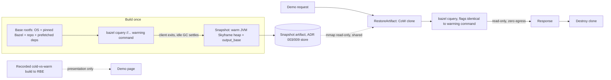

# ADR 010: Bazel Skyframe Snapshot as a Stateless Query Demo

**Author:** Joe McGinley
**Status:** Accepted
**Created:** 2026-07-18

---

## Problem

A Bazel build has three phases: **loading** (parse BUILD files and macros into a target graph), **analysis** (configure targets into an action graph), and **execution** (run the actions). Remote Build Execution (BuildBuddy RBE) attacks only the third: it parallelizes and caches *execution*, backed by the action cache and CAS. It does nothing for the first two, which together form the **Skyframe graph** and live in the JVM heap of a single, local, `output_base`-locked Bazel server.

The consequence is sharp and counter-intuitive: **on a cold Bazel server you pay full analysis even when every action is already a remote cache hit**, because you cannot look up an action key you have not computed yet. Analysis is the one cost RBE architecturally cannot remove. On a real monorepo it is minutes of dead local CPU before the first byte is sent to RBE.

There is a first-party answer to this, but not one most users can reach. Google's internal Blaze caches analysis results remotely ("Skycache"), and open-source Bazel carries the `--experimental_remote_analysis_cache` flag plus the Skyframe serialization framework, but there is **no public backend**: OSS analysis caching is under discussion with no timeline. So for any external or self-hosted Bazel user, warm-analysis reuse across process restarts is currently unavailable by the intended path.

This is an unusually good showcase for EmberVM specifically. A warm Skyframe graph is **volatile RAM state with no on-disk representation**: you cannot `docker cp` it, and Bazel's own serialization is the only other way to move it (and its backend is Blaze-only). Firecracker's full-memory snapshot can freeze and clone exactly that. We want a public, interactive demo on the `/ember` surface (memory `firecracker-demos-page`) that proves it: a visitor types a `bazel query` and gets a sub-second answer against an analysis graph that would take minutes to build cold.

---

## Decision

**Snapshot a warm Bazel server as an EmberVM base; serve each demo request from a disposable copy-on-write clone that runs a read-only query and is then reaped.** The workload is queries-only, so nothing a clone does needs to be persisted, and the lifecycle collapses to **request, response, reap**: relight a clone, serve one `bazel query`/`cquery`, discard the clone. No bank, no writeback, no session continuity. The full `build` hand-off to RBE, the "instant analysis then remote execution" story, is shown as a **recorded** cold-vs-warm comparison, not a live per-visitor action (see Security for why the interactive surface stays sealed).

This is a **read-only consumer of machinery that already exists**, not new substrate. The base is captured after a warming build; per-request clones are the same CoW relight R7 Distribution ([R7 design seed](../../plans/2026-07-18-embervm-r7-distribution-design-seed.md), memory `embervm-r7-design-seed`) uses to place workloads as copies rather than rebuilds; the artifact is one `kind` of the `ExportArtifact`/`RestoreArtifact` family ADR 009 generalized. Because the workload never mutates durable state, it needs none of the bank/relight continuity of R2 sessions or R4 stateful: it is the simplest possible tier.

| Aspect | Cold Bazel (status quo) | Decided (Skyframe snapshot) |
| ------ | ----------------------- | --------------------------- |
| Loading + analysis | Re-paid every cold server (Abseil 13.8s; monorepo: minutes) | Restored from the snapshot heap |
| Execution | RBE | RBE, unchanged (recorded in the demo) |
| What is snapshotted | nothing (heap is volatile) | the warm JVM Skyframe graph + `output_base` + pre-fetched `external/` |
| Per-request lifecycle | n/a | relight CoW clone, serve query, reap |
| Persisted state | n/a | none (queries only) |
| Concurrency model | one server, single-client lock | one clone per request, no shared server |

**Measured on the bounded example (Abseil `//absl/...`), warm *server* on macOS, 10 cores, warm toolchain. No Firecracker restore is involved in these figures:**

| Metric | Cold | Warm server (pre-snapshot) |
| ------ | ---- | -------------------------- |
| Loading + analysis | 13.8s (16.6s incl. fetch) | 0.31s |
| Interactive `query`/`cquery` | n/a | sub-0.3s |
| Retained analysis-cache heap | n/a | 73 MB (189 MB peak) |
| External deps (`repository_cache`) | 253 MB | baked into base |
| Base image over OS rootfs | n/a | ~0.5-0.7 GB |

End-to-end **relight + first-query** latency (the number a visitor actually experiences, which adds demand-paging of the JVM working set on top of the warm-server figure) is **unmeasured** and must be measured on a Linux guest before it is quoted; it is Open Question 5.

The proof-of-restore signal is Bazel's own output. A `cquery` (or curated `build`) invocation in a pristine clone, run with flags identical to the warming command, reports `Analyzed N targets (0 packages loaded, 0 targets configured)`: zero re-loading, zero re-configuration, pure Skyframe reuse from the restored heap. (Plain `bazel query` is loading-phase only and prints no `Analyzed` line, so the analysis-reuse proof runs through `cquery`.)

**Two tiers.** *Abseil* is the live interactive tier: a ~0.6 GB base and a ~200 MB heap relight fast and clone cheap, so visitors poke it directly. *Envoy* is the headline / scale-stress tier: minutes of cold analysis collapsing to seconds and a multi-GB warm heap proves the mechanism scales past a toy, measured on Linux and shown as a recorded stat rather than per-visitor interactive.

---

## Architecture

The base image carries everything analysis needs so the snapshot is self-contained: an OS rootfs, a pinned Bazel, the repository checkout, and a pre-populated `repository_cache` (the 253 MB of external deps baked in, so relight never fetches). The control plane warms it by running the analysis phase once and snapshotting after the warming client has exited:

Two Bazel-specific correctness conditions make or break the demo, both silent when violated:

1. **Snapshot after the warming client exits.** If the snapshot is cut while the warming `bazel` client is still connected, every clone restores with a held client lock and a half-open gRPC command stream, so the first real invocation blocks or errors. Cutting after the client exits also lets Bazel's post-command idle work run its explicit GC, which compacts the heap and improves CoW sharing across clones.
2. **Serving flags must equal warming flags.** Any configuration-affecting flag delta between the warming command and the serving command makes Bazel print `Build options have changed, discarding analysis cache` and silently re-analyze cold in every clone, defeating the entire demo while still appearing to work. The `0 packages loaded, 0 targets configured` line above is the detector: if the serving invocation ever loads packages, the flags drifted.

**No new node verbs.** Relight is `RestoreArtifact` + `Assign`; reap is `Destroy`. The base is an `ArtifactRef {kind: BASE}` (ADR 009). The demo edge is a thin translator from an HTTP request to relight-serve-reap, in the shape ADR 004's session adapter established.

**Horizontal scale is copy-on-write, and the queries-only property is what makes it free.** The snapshot's RAM file is `mmap`'d read-only and shared across all clones; a clone allocates private pages only for what it dirties. Because every clone is discarded, divergence never has to be reconciled: there is no merge, no writeback, no generation pairing. The one honest caveat is that a JVM degrades CoW sharing more than a C process would: GC walks and rewrites object headers, so even a read-mostly `bazel cquery` can dirty a meaningful fraction of the heap. Per-clone cost is therefore *working-set-touched plus GC churn*, not zero; sizing `-Xmx` so a short session never triggers a GC, or running a no-op collector (Epsilon) in the throwaway guest, keeps it near the working set.

**Restore-state caveats (standard for a snapshotted running process).** Every clone wakes with the guest wall clock frozen at snapshot time and with identical JVM PRNG state, ASLR layout, and kernel entropy. Skyframe validity is unaffected: file mtimes and digests were frozen consistently with the clock, and the server's idle-shutdown timer runs on elapsed guest time so seconds-lived clones never trip it. For a query-only, zero-egress guest the frozen clock and shared entropy have nil impact (there is no outbound TLS to invalidate and no security decision keyed on randomness). This is another reason the interactive surface stays zero-egress rather than calling RBE from the guest.

**The governor is memory, not traffic.** A concurrency cap of `N` simultaneous clones, sized by `node_free_RAM / per_clone_dirtied_RAM`, bounds peak memory regardless of request rate. Restore is demand-paged, so clone-on-demand with aggressive idle reaping is expected to beat a warm pool at demo traffic levels; the `N+1`-th concurrent visitor waits for a slot, which at low traffic effectively never happens. A generous per-visitor rate limit is sufficient because a wedged clone harms only itself and is reaped.

---

## Alternatives Considered

- **Bazel remote analysis caching / "Skycache" (`--experimental_remote_analysis_cache`).** Bazel's own path to the same goal: serialize the Skyframe frontier to a remote store and re-hydrate it. Not rejected as a technique, but it is Blaze-internal: OSS Bazel has the flag and the serialization framework but no public backend, so it is unavailable to this deployment. That unavailability is precisely why a VM-level snapshot is worth demonstrating; Skycache is the contrast, not the mechanism.
- **CRIU checkpoint of the warm JVM in a container.** The obvious non-Firecracker route to the same warm heap: checkpoint the running Bazel server process and restore it. Rejected for this surface: process-level checkpoint/restore is fragile across the socket, lock-file, and mount assumptions Bazel makes, and gives none of the hardware isolation an anonymous public guest needs. A whole-VM snapshot restores those invariants atomically and isolates the guest.
- **A container image with the `output_base` and `external/` baked in.** Carries the on-disk caches but not the warm server, since the analysis graph is live JVM heap with no on-disk form, so the first `bazel` invocation still re-analyzes. This is the negative result the demo dramatizes.
- **One long-lived warm Bazel server, visitors serialized through it.** The `output_base` lock prevents *concurrent* clients, not reuse, so serial multiplexing is possible and simpler. Rejected on isolation: one hostile or wedged query degrades every subsequent visitor, there is no per-visitor blast-radius containment, and serialization throttles throughput to one-at-a-time. VM-per-request gives each visitor a private server and lock.
- **Synthetic generated workspace instead of a real repo.** Rejected: measured 20k-200k trivial targets analyze in 7-10s because analysis is embarrassingly parallel and Starlark is fast; a synthetic graph cannot honestly be "minutes cold" without absurd target counts or fake sleeps. A real repo's cold minutes come legitimately from fetch, load, and cold cache.
- **Stateful sessions with persisted per-clone state (R2/R4 style).** Rejected as unnecessary: queries mutate nothing durable, so continuity, banking, and writeback are pure cost with no benefit here. The request-response-reap lifecycle is deliberately the floor of the workload ladder.
- **Live `bazel build` execution for visitor-chosen targets.** Rejected as an interactive surface: anonymous public users triggering arbitrary RBE execution is a compute-abuse vector, and it forces an RBE credential into a publicly-reachable guest. The RBE hand-off is recorded instead (see Security).

---

## Security

Baseline per `docs/security.md`. This is a public, anonymous surface, so the threat is abuse and code execution, and the queries-only, zero-egress, reap design is most of the mitigation:

- **The only visitor input is the query expression; the command and every flag are server-controlled.** The edge wraps the expression in a fixed template (`bazel cquery "<EXPR>" --output=label`, flags identical to the warming command), so a visitor cannot choose the verb, the target set as a `build`/`run`, or any flag. The flag ban is security-critical for a specific reason worth naming: `cquery --output=starlark --starlark:expr=<...>` executes attacker-supplied Starlark in the guest, so an output-format allowance would be a code-execution allowance. The expression is passed as a single exec argv element, never through a shell (so shell metacharacters cannot escape), and is validated against the query grammar so anything that is not a pure expression is rejected before it reaches Bazel.
- **Zero egress, credential held host-side if ever needed.** The interactive guest reaches neither the network nor another visitor's clone (ADR 001 isolation), so it carries no BuildBuddy credential and cannot be turned into an anonymous compute farm. The `build`-to-RBE contrast is a recorded artifact. If a live build tier is ever added, the RBE credential lives in a host-side proxy on the node and the guest gets an endpoint-scoped carve-out, never the key. Zero egress also makes any fetch-triggering query fail closed rather than reaching the internet.
- **Blast radius is one disposable clone.** No durable state means the worst a hostile input can do is wedge or exhaust its own throwaway VM, which is reaped on response or idle. There is nothing to corrupt and nothing to exfiltrate across requests.
- **Resource and response caps per request.** CPU-time and wall-clock limits on the query, plus the memory concurrency cap, bound denial-of-service through expensive query expressions (for example a pathological `deps(//...)`). Response size is bounded too: a large `deps` result can produce an enormous output, so the cap protects the HTTP path, not only guest CPU. All backed by reap.

---

## Risks

| Risk | Likelihood | Impact | Mitigation |
| ---- | ---------- | ------ | ---------- |
| JVM GC dirties CoW pages, eroding per-clone memory sharing | High | Medium | Size `-Xmx` so short sessions never GC; run Epsilon (no-op) GC in the throwaway guest; cap concurrency on measured per-clone dirtied RAM, not raw heap |
| Serving flags drift from warming flags, silently discarding the analysis cache | Medium | High | Pin the serving command to the warming command; assert `0 packages loaded, 0 targets configured` as a health check before serving traffic |
| Snapshot cut with the warming client still attached wedges every clone | Medium | High | Snapshot only after the warming client exits and idle GC settles |
| Attacker-supplied Starlark via an output-format flag | Low | High | Allow-list query/cquery expressions only; ban all flags, `--output=starlark` in particular; argv, never shell |
| Envoy snapshot (multi-GB heap) too heavy to relight per request | Medium | Low | Envoy is the recorded headline tier, not interactive; Abseil is the live surface |
| Quoted numbers are macOS warm-server, not the Linux Firecracker relight path | High | Low | Re-measure relight + first-query on a Linux node before quoting; current table is labelled pre-snapshot |
| Expensive query expression or huge response exhausts a clone or the HTTP path | Medium | Low | CPU/wall and response-size caps per request; reap on completion or timeout; blast radius is one clone |
| Bazel/toolchain version drift makes a stale snapshot un-restorable | Low | Low | The base image is the source of truth; the snapshot is derived and rebuilt on version bump |

---

## Open Questions

1. **GC strategy in the guest.** Epsilon/no-op (max CoW sharing, VM discarded before the heap fills) vs a tuned low-churn collector; needs the real per-clone dirtied-RAM measurement to choose.
2. **Warm pool vs clone-on-demand** at the expected (low) traffic, and the idle-reap TTL.
3. **Whether a live RBE build tier is worth the host-side-proxy complexity,** or whether the recorded cold-vs-warm build is a sufficient telling of the execution half.
4. **Envoy measurement on Linux:** real cold analysis time, warm heap size, and external-deps disk, to firm up the headline figures this ADR currently estimates.
5. **Relight + first-query latency and the snapshot-size ceiling:** at what warm-heap size does per-request restore stop being sub-second, and does Envoy cross it? This is the number a visitor feels, and it is unmeasured.

---

## References

| Resource | Relevance |
| -------- | --------- |
| [ADR 001 - EmberVM orchestrator](001-embervm-beam-firecracker-workload-orchestrator.md) | Zero-egress / no-cross-principal isolation and the capacity contract the demo clones inherit |
| [ADR 003 - Snapshot distribution](003-control-plane-managed-snapshot-distribution.md) | The snapshot-as-artifact store and Restore/Evict verbs this reuses |
| [ADR 009 - Continuity before tenancy](009-roadmap-extension-continuity-before-tenancy.md) | The generalized `ArtifactRef`/Export/Restore family; this workload is one `kind` |
| [R7 distribution design seed](../../plans/2026-07-18-embervm-r7-distribution-design-seed.md) | The copy-not-rebuild CoW relight the per-request clones use |
| [BazelCon 2025 recap (JetBrains)](https://blog.jetbrains.com/clion/2025/11/bazelcon-2025/) | Confirms Skycache/remote analysis caching is Blaze-internal and only under discussion for OSS |
