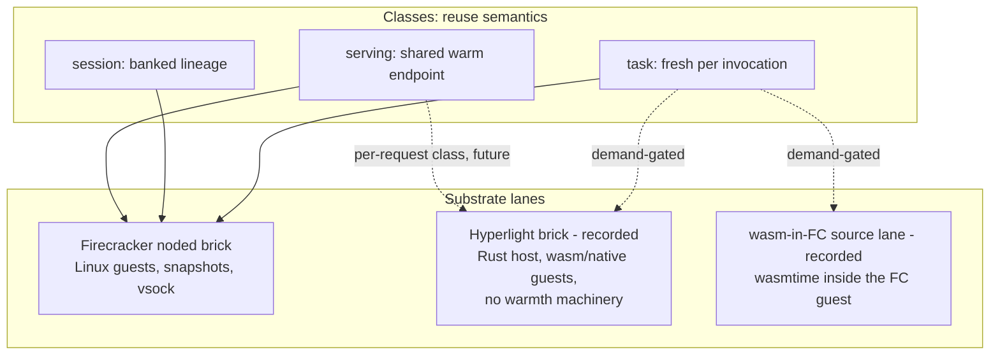

# ADR 013: Substrate Lanes, Brick Sizing, and the Capacity Tier Ladder

**Author:** Joe McGinley
**Status:** Accepted (amended 2026-07-19: section 7 tier ladder collapsed to bricks on both tiers)
**Created:** 2026-07-19
**Refines:** [001-embervm-beam-firecracker-workload-orchestrator](001-embervm-beam-firecracker-workload-orchestrator.md), [005-embervm-eks-scale-out-metal-pool-bricks](005-embervm-eks-scale-out-metal-pool-bricks.md), [012-fleet-colocation-cp-dynamic-sizing](012-fleet-colocation-cp-dynamic-sizing.md)

---

## Problem

A landscape review asked whether EmberVM is missing opportunities among the
adjacent isolation technologies: unikernel container runtimes
([urunc](https://github.com/urunc-dev/urunc), a CRI shim that boots
Unikraft/MirageOS/Mewz guests under QEMU or Firecracker), in-process wasm
runtimes (Wasmtime, WasmEdge, Spin), and embedded micro-VM libraries
([Hyperlight](https://github.com/hyperlight-dev/hyperlight), a CNCF sandbox
project creating hypervisor-isolated sandboxes in 1-2ms with microsecond warm
calls). The same conversation sharpened two scale-out questions that ADR 005
left as free parameters: what sets the size of a capacity brick, and how the
control plane's ownership of brick count composes with per-workload
provisioned-concurrency floors and forecasting.

A reconciliation is also owed. ADR 005 (EKS) demoted in-place resize and made
fixed-size bricks the capacity unit because a Pending pod is the only signal
a cluster autoscaler natively converts into a node. ADR 012 (homelab,
accepted the same week) chose the opposite mechanism for the colocated
four-node fleet: a CP-owned in-place resize loop that keeps each noded pod's
requests tracking committed guest capacity. Both are correct in their
environment; without a recorded rule for which tier applies where, the two
ADRs read as contradicting each other.

---

## Decision

### 1. Classes are reuse semantics; substrates are lanes

Workload classes (task, session, serving, stateful, composite) are defined by
**reuse and lifecycle semantics**, never by what boots the guest. New
execution technologies enter EmberVM as **substrate lanes under existing
classes** (a CRD field on the workload, a new brick type in the fleet), not
as new classes and not as runtime swaps. A substrate lane must uphold the
class invariants it serves: the no-cross-principal reuse rule, the wire
contract, metering on the dispatch path, and the hit/miss invariant.

This rule is what keeps the taxonomy stable as the landscape moves: the
question for any new runtime is "which class's semantics does it implement,
and at what cost structure", not "where does it fit in the architecture".

### 2. urunc is rejected as a component

urunc integrates unikernels into the kubelet/CRI/containerd pod lifecycle,
which is exactly the per-invocation path ADR 001 exists to bypass. Adopting
it would reintroduce pod-per-invocation dispatch and forfeit the primed-pool
and bank/relight machinery (the product). Unikernel guests themselves are
also not adopted: their headline win is fast cold boots, and EmberVM does not
pay cold-boot cost on the latency path (task dispatch is assignment-only from
the primed pool; sessions relight banked snapshots with warm application
state, which a fresh unikernel boot cannot replicate). Their cost would be
the entire workload catalog: the `image` contract is "bring an OCI image, no
SDK", and none of the current Linux-shaped workloads build as unikernels.

One thing is kept from the evaluation: urunc's OCI packaging convention for
VM guests (kernel and rootfs as image annotations) is worth revisiting if
EmberVM's guest-image packaging is ever formalized for external adopters.

### 3. Wasm is a demand-gated source lane, not a substrate

If a wasm workload appears, the first implementation is `source: wasm`
executed by a wasm runtime **inside the existing Firecracker guest** (the
runtime base gains wasmtime, the shim maps HTTP to a component call), which
buys WASI compatibility for near-zero architectural cost and keeps the VMM as
the isolation boundary. In-process wasm on the host is rejected outright: a
software sandbox is an isolation downgrade for a platform whose threat model
is hostile untrusted code. No wasm lane is built until a workload wants it.

### 4. Hyperlight is a recorded option: a task-class substrate, and possibly a per-request serving class

Hyperlight's semantics are task-class semantics with the cost structure
inverted: sandbox creation is so cheap (1-2ms, no guest kernel) that the
primed pool becomes unnecessary for that lane; you create instead of
pre-warming. Recorded, not built:

- **Task-class substrate lane.** A small Rust "hyperlight brick" daemon
  embedding the library, speaking the same gRPC contract as noded, shipped as
  another size-class Deployment. The dial-home registry (ADR 005 R0
  contracts) makes a heterogeneous brick type cheap: the control plane sees
  capacity of a different slot type with very large slot counts. The class
  invariants port cleanly and several get stronger: fresh-per-call satisfies
  no-reuse trivially, guests have no devices at all (host functions over
  shared memory, a stronger statement than vsock-only), and the entire
  warmth machinery (memory snapshots, CPU-vendor keying, bank/relight,
  fail-open warmth) simply does not apply to the lane.
- **Per-request serving isolation** is the one cell the current taxonomy
  cannot express: serving-shaped traffic where every request gets a fresh
  hardware boundary inside a warm endpoint process. If a workload ever needs
  it, it is a genuinely new class; Envoy routes to the hyperlight-host
  endpoint exactly as xDS does today, so the hit/miss invariant survives.

Both are gated on demand. Hyperlight is pre-1.0, the lane only runs wasm
components or hyperlight-native guests (Nanvix POSIX support is narrowing
that gap), and no current workload is shaped for it. The point of recording
it now is that the brick model makes it additive later, not a rework.

### 5. Brick sizing rule (refines ADR 005)

ADR 005 fixed the portfolio shape (2-3 T-shirt size-classes, every class
bounded by the smallest metal type's allocatable) and left sizes open. The
rule adopted:

- **A brick is roughly 4-8x the largest VM of its size-class.** The floor is
  set by the largest VM the class must host (a smaller brick cannot place
  it); the 4-8x multiple amortizes per-brick quantization waste (at 1-2x,
  worst-case stranded remainder approaches half the brick) while keeping the
  brick small relative to a node.
- **A handful of bricks per node, not dozens.** Per-brick fixed overhead (a
  daemon process, a dial-home stream, scratch namespace) is noise at a
  handful per node; at dozens it rebuilds the per-VM-pod problem ADR 005
  rejected and starts pressing max-pods ceilings.
- **Two classes to start**: `small` sized for dense task/sandbox packing,
  `large` sized to hold 1-2 serving/session VMs.

Smaller bricks are genuinely better for the scheduler (finer bin-packing on
shared nodes, finer autoscaling increments, smaller drain and disruption
blast radius), and the sizing rule is the floor under that preference, not a
rejection of it.

### 6. Per-brick headroom is a first-class ledger dimension

Aggregate free capacity is a lie for refill purposes: primed-pool refill and
VM placement each need a **single brick** with enough contiguous headroom, so
a class can be unable to prime while its aggregate free capacity looks
healthy (many nearly-full small bricks). The dispatcher's capacity ledger
tracks per-brick headroom, not per-node or per-class aggregates, and refill
placement selects a brick, not a node.

### 7. Bricks everywhere: one capacity unit, two Pending-brick consumers

(Amended 2026-07-19. The tier ladder this section originally recorded,
resize on fixed fleets and bricks on autoscaled ones, is collapsed. CP-owned
in-place resize is dropped entirely, on both tiers.)

**Fixed-size size-class bricks are the single capacity unit everywhere.** The
budget-agnostic daemon (reads its ceiling from its own cgroup; ADR 005)
remains the shared contract, now with a simpler consequence: a brick's slot
count per size-class is derived from its own cgroup budget, not configured,
so one binary serves every environment and `maxLiveVMs` is the brick's
cgroup-derived slot ceiling, never a control-plane knob.

The fleet capacity signal on both tiers is a **brick count vector per
size-class**, set by the single-writer EmberPool-style controller (ADR 005).
kube-scheduler places bricks; the control plane places VMs into brick slots
by selecting a brick with contiguous headroom (section 6). The only tier
difference is what consumes a Pending brick:

| Environment | Pending-brick consumer | Semantics |
| ----------- | ---------------------- | --------- |
| Autoscaled pool (EKS, ADR 005) | Karpenter | A Pending brick becomes a node |
| Fixed fleet (homelab, ADR 012) | Nobody | A Pending brick IS the fleet-full signal: refuse placement, page a human |

What this buys: no CP cross-node placement engine beyond find-a-brick-with-a-
free-slot, no resize loop, no pods/resize RBAC, no grow-eager/shrink-lazy
policy, and no second capacity code path to keep honest. What it costs is
stated plainly and accepted eyes-open: brick quantization waste on a
four-node fleet where continuous resize would have been finer-grained. The
single simplest mechanism is chosen over the finer one, and over a
bricks-plus-resize-refinement synthesis, deliberately.

Demand composition is unchanged and now applies on both tiers, restated as
the EmberPool controller's operating rule: **forecast as little as possible,
consume known load exactly**. Per-workload provisioned-concurrency floors are
arithmetic (they sum to a deterministic base per class); committed-future
load (cron firings, queued tasks with declared sizes) is read off the
submission surface and pre-provisioned by offline bin-pack; only the
stochastic residual is forecast, held as warm buffer in the smallest, most
fungible class. Floors differ in fungibility by class: task-class floors are
satisfied by the shared pristine pool (any primed VM serves any floor), while
session/serving floors are workload-bound banked instances the large-class
count must track one-for-one.

---

## Architecture

---

## Alternatives Considered

| Alternative | Rejected because |
| ----------- | ---------------- |
| Adopt urunc as the runtime layer | CRI/containerd pod-per-invocation is the path ADR 001 exists to bypass; forfeits primed pool and bank/relight |
| Unikernel guests under noded | Fast cold boot solves a problem the primed pool and banked snapshots already solved; catalog cost is total |
| In-process wasm runtime on the host | Software sandbox is an isolation downgrade for hostile untrusted code; wasm-in-FC gets the compatibility without losing the VMM boundary |
| Hyperlight as a new class now | Its semantics are task semantics; a new class adds taxonomy for a cost structure change, and no workload demands it yet |
| Per-workload Deployments + HPA as the capacity unit | Fragments the warm pool into workload-bound reservations, adds N actuators fighting the single-writer EmberPool controller, and HPA's CPU signal is wrong for VM-slot demand |
| All-small brick portfolio | A brick must hold the largest VM of its class; serving/session VMs exceed a small brick's budget |
| CP-owned in-place resize on the fixed fleet (this ADR's original section 7 ladder) | Superseded 2026-07-19: bricks on the homelab were originally rejected here as coarser than resize; that is inverted. Two capacity mechanisms for one platform is the real cost; resize adds a control loop, pods/resize RBAC, and a shrink-may-restart hazard to buy granularity a small fleet does not need. The Pending brick, unconsumed, is itself the fleet-full signal |

---

## Security

Baseline in [docs/security.md](../../security.md). Substrate lanes inherit
the no-cross-principal rule unchanged. The Hyperlight lane strengthens guest
isolation (no devices, no NIC, fresh hardware boundary per call) but moves
the boundary to the host-function surface: every host function exposed to a
hyperlight guest is attack surface in the brick daemon's process and must be
reviewed as such before the lane is built. Wasm-in-FC deliberately keeps the
VMM as the boundary so the wasm runtime's own sandbox is defense in depth,
not the load-bearing wall.

---

## Risks

| Risk | Likelihood | Impact | Mitigation |
| ---- | ---------- | ------ | ---------- |
| Hyperlight pre-1.0 API churn invalidates the recorded design | Medium | Low | Nothing is built; revisit the option against upstream state when demand appears |
| A Rust brick daemon adds a toolchain to the repo | Medium | Low | Gated on demand; the gRPC contract keeps it a leaf, not a dependency of noded |
| 4-8x sizing rule mis-fits the real VM size distribution | Medium | Medium | Sizes are values-level knobs on the budget-agnostic daemon; revisit with occupancy data from the ledger |
| Brick quantization strands capacity on the small fixed fleet | Medium | Medium | Sizes are values-level knobs on the budget-agnostic daemon; a Pending brick pages a human instead of silently overcommitting; revisit sizes with occupancy data from the per-brick ledger |
| Per-request serving class built speculatively | Low | Medium | Explicit demand gate recorded here; the class does not exist until a workload needs per-request hardware boundaries |

---

## Open Questions

1. What demand signal justifies the wasm lane: an internal workload, or an
   external adopter story for the open-sourceable artifact?
2. Does Hyperlight Nanvix's POSIX surface eventually widen the lane's catalog
   enough that "hyperlight for short CPU-bound tasks, Firecracker for
   everything else" becomes a default routing rather than an opt-in?
3. What is the measured per-brick overhead (daemon RSS, stream cost) on the
   real fleet, and does it move the "handful per node" ceiling?
4. Do serving/session floors on the large class justify a third size-class
   once real workloads exist, or does 2 classes hold?

---

## References

| Resource | Relevance |
| -------- | --------- |
| [ADR embervm/001](001-embervm-beam-firecracker-workload-orchestrator.md) | Class taxonomy, hit/miss invariant, isolation model the lanes must uphold |
| [ADR embervm/005](005-embervm-eks-scale-out-metal-pool-bricks.md) | Brick model, size-class portfolio, EmberPool controller, R0 contracts |
| [ADR embervm/012](012-fleet-colocation-cp-dynamic-sizing.md) | The resize tier on the fixed homelab fleet this ADR reconciles with |
| [urunc](https://github.com/urunc-dev/urunc) | Evaluated and rejected as a component; OCI guest packaging worth watching |
| [Hyperlight](https://github.com/hyperlight-dev/hyperlight) | The recorded task-class substrate option; CNCF sandbox, pre-1.0 |
| [Hyperlight Wasm](https://opensource.microsoft.com/blog/2024/11/07/introducing-hyperlight-virtual-machine-based-security-for-functions-at-scale/) | Wasm component guests and the per-request isolation cost structure |
| [Hyperlight Nanvix](https://opensource.microsoft.com/blog/2026/01/28/hyperlight-nanvix-posix-support-for-hyperlight-micro-vms/) | POSIX support narrowing the lane's catalog gap |
| [Mewz](https://github.com/mewz-project/mewz) | Wasm-in-a-unikernel datapoint: the ecosystem converging on hardware boundaries around wasm |
