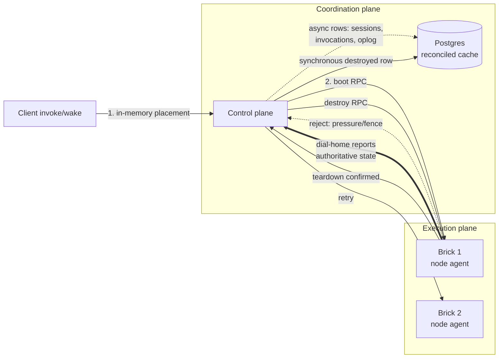

# ADR 014: Worker-Authoritative State and a Hot-Path Consistency Model

**Author:** Joe McGinley
**Status:** Draft
**Created:** 2026-07-20

---

## Problem

The embervm control plane currently treats its own Postgres tables as the source
of truth for instance runtime state, and it performs durable writes on the
creation and wake hot paths. Both choices have produced a recurring bug class
and avoidable latency:

- **State drift between CP tables and node reality** has caused most of our
  recent production incidents: the node-name alias misroute (CP consumers keyed
  on stale node identity, three 1Hz retry loops and a 503ing `/health`), orphan
  `group_networks` records, the dispatch-restart wedge that needed an explicit
  ADOPTION fix, the fleet-down NodeChannel keying bug (#3732), and the
  no-wake-after-node-agent-restart gotcha. Each fix repaired an instance of the
  drift; none removed the class.
- **Synchronous row writes on the invoke/session paths** (the R1 "row written
  last" ordering) put a Postgres round trip in front of every boot and wake,
  which is exactly the latency the platform is trying to showcase.
- **Placement assumes the CP capacity ledger is right.** When it is wrong
  (memory pressure on a brick, a Longhorn volume fence not yet released), the
  dispatch wedges rather than routing around the stale view.

Two external write-ups crystallised the pattern we should adopt. Modal's
million-sandbox architecture removes datastores from the creation path
entirely, makes each worker the source of truth for its own sandboxes with
asynchronous state publication, and treats placement as an in-memory decision
plus one RPC with cheap rejection and retry. The companion analysis of
Kubernetes' limits for this workload class frames the same split we already
have: a consistent, slow-moving coordination plane (Kubernetes, ArgoCD,
Longhorn, the CP deployment itself) and a throughput-first execution plane
(Firecracker instances on bricks). embervm will never need Modal's scale, but
the same principles remove our drift bug class and our hot-path latency at
homelab scale.

One requirement makes us deliberately diverge from the fully eventual model:
**guaranteed state destruction**. Security-scanning and multi-tenant workloads
require that when a workload ends, its state (microVM memory, scratch disk,
network identity) is verifiably gone. Consistency can be relaxed everywhere
except there.

---

## Decision

Adopt a worker-authoritative consistency model for instance runtime state, with
one carve-out: transitions that destroy state remain synchronous and
node-confirmed.

1. **The node agent is authoritative for instance runtime state.** What a node
   reports over its dial-home channel about the instances, taps, and volumes it
   holds is the truth. CP tables are a cache that reconciles toward node
   reports, never the other way around. As a design rule: the CP must not act
   on its own table when a fresh node report contradicts it, and reconcilers
   (sweepers, adoption, boot-image resolution) key off reported state.

2. **Durable writes come off the boot and wake hot paths.** Placement and boot
   proceed from the CP's in-memory view; session rows, invocation records, and
   oplog entries are written asynchronously after the instance is running. If
   an async write loses a race (CP restart between boot and write), the next
   node report resurfaces the instance and the reconciler adopts it. Two
   classes of write stay synchronous: metering and quota checks (fail-closed,
   per the existing metering design) and the destroyed transition (below).

3. **Placement is reject/retry, not ledger-perfect.** A brick that cannot
   honour a boot request (memory pressure, unfenced volume, tap exhaustion)
   rejects it cheaply and immediately; the dispatcher tries the next candidate
   brick. The CP's capacity view is advisory, refreshed from node reports, and
   is allowed to be briefly wrong. With multiple bricks per size class
   (ADR 013), a wrong guess costs one extra RPC instead of a wedge.

4. **Network plumbing is pre-provisioned at brick boot.** Taps and related
   netlink work happen when a brick starts, not when an instance boots.
   Instance creation attaches to pre-built network state. This removes
   serialized netlink work (the same `rtnl` contention Modal hit under bursts,
   and the subsystem behind our tap-leak wedge, #3745) from the instance boot
   path and shrinks the tap-lifecycle bug surface. Del-before-add idempotency
   is retained for repair paths.

5. **Destruction is the consistency carve-out.** An instance may only be
   recorded as destroyed after the owning node confirms teardown of the microVM
   and its scratch state. Worker authority strengthens this guarantee rather
   than weakening it: the only component that can truthfully assert "destroyed"
   is the node that performed the destruction. Reconciliation is fail-closed
   toward destruction in both directions: an instance the CP knows about that
   no node reports is terminalized only on an owner-resolved dial (the PR-B0b
   rule), and an instance a node reports that the CP does not recognise is an
   orphan to be destroyed, not adopted as-is.

6. **Isolated execution is a declared workload characteristic, not an
   inference.** Workloads carry an `isolated_execution: true` flag (name
   bikesheddable) that is a platform-enforced contract: the instance is
   single-use. It is booted fresh for this workload, never returned to a warm
   pool, never relit or resumed, never snapshotted (its memory and disk state
   must not outlive it in any form), and its slot, scratch volume, and network
   identity are released only after node-confirmed destruction. Security
   scanning and multi-tenant workloads set this flag; warm-pool reuse, bank
   relight (R2), and snapshot capture are only legal when it is unset. This
   turns "we must never reuse this state" from an operational convention into
   a checkable property: the CP can refuse any lifecycle transition (pool
   return, relight, snapshot) on a flagged instance, and reconcilers treat a
   flagged instance found in any state other than running or destroying as a
   defect to destroy.

   *Amended 2026-07-22: the flag mechanism is replaced by
   [ADR 015](015-isolated-high-throughput-lane-data-plane-placement.md).
   Isolation becomes structural to a dedicated lane (fresh VM per request,
   no reuse transitions exist) rather than an opt-in flag policed across
   lanes. The single-use contract and its checkable invariants stand
   unchanged.*

| Aspect | Today | Decided |
| ------ | ----- | ------- |
| Source of truth for instance state | CP Postgres tables | Node-agent dial-home reports; CP tables are a reconciled cache |
| Writes on boot/wake path | Synchronous row writes | Asynchronous, reconciler-repaired; metering and destruction stay synchronous |
| Placement | CP capacity ledger assumed correct | Advisory view, brick reject + dispatcher retry |
| Tap/netlink setup | At instance boot | At brick boot; instances attach |
| Destroyed transition | CP-recorded | Node-confirmed only; fail-closed reconciliation toward destruction |
| Single-use guarantee | Operational convention | `isolated_execution: true` workload flag; CP refuses pool return, relight, and snapshot on flagged instances |

### Formal specification follow-through (ADR 006)

This decision changes the semantics the TLA+ pilot models: `adoption.tla`
treats the CP's primed-pool inventory as authoritative and reconciles from
node reports on restart; under this model the CP view is a reconciled cache
at all times. Per ADR 006's own rule, specs are not updated while the
protocol churns, but every implementation plan executing this ADR MUST carry
an explicit TLA+ step so the requirement cannot be dropped:

1. Re-check `adoption.tla`'s assumptions against worker authority once the
   reconciler changes land (the vocabulary guard will force classification of
   any new verbs or op-log kinds, but the semantic shift of CP-as-cache needs
   a human pass over the spec's actions).
2. Write the bank/relight + generation-pairing spec (ADR 006 protocol 2)
   against these semantics, not the pre-014 ones. New invariants this ADR
   makes checkable: no instance is recorded destroyed before the owning node
   confirms teardown (decision 5), an `isolated_execution` instance never
   reaches pool return, relight, or snapshot (decision 6), no wake resumes a
   stale snapshot, and stored volume generations never regress.

---

## Architecture

Boot path: one in-memory decision, one RPC, no durable write in front of the
instance becoming interactive. Destroy path: RPC, node-side teardown, node
confirmation, then and only then the durable destroyed record.

---

## Alternatives Considered

- **Keep CP-as-truth and add more reconciliation sweeps.** Rejected: this is
  what we have been doing incident by incident; it repairs instances of drift
  while leaving the class in place, and each new sweeper is itself a consumer
  that can key off stale identity.
- **Strongly consistent ledger for everything, Kubernetes-style.** Rejected:
  it buys consistency we do not need (placement, session metadata) at the cost
  of hot-path latency, and our incident history shows the ledger drifts anyway.
- **Introduce a dedicated pub/sub store (Redis-style) for worker state.**
  Rejected: the dial-home NodeChannel substrate already provides the
  worker-to-CP state stream; new infrastructure adds surface without adding
  capability at four nodes.
- **Fully eventual model including teardown.** Rejected in one sentence:
  security-scanning and multi-tenant workloads require verifiable destruction,
  so the destroyed transition must be node-confirmed and synchronous.

## Security

Baseline per `docs/security.md`. This ADR strengthens the isolation story:
destruction becomes a node-confirmed, fail-closed guarantee rather than a
CP-recorded assumption, and unknown instances discovered on nodes are destroyed
rather than adopted. Metering and quota remain synchronous and fail-closed.
Relaxed consistency applies only to metadata (session rows, invocation records,
oplog timing), never to isolation boundaries or teardown. The
`isolated_execution` flag makes the no-reuse requirement machine-checkable:
tenancy separation stops depending on operators remembering which pools a
workload class may touch.

## Risks

| Risk | Likelihood | Impact | Mitigation |
| ---- | ---------- | ------ | ---------- |
| Async row write lost (CP restart between boot and write) leaves a running instance unbilled or unlisted | Medium | Low | Next dial-home report resurfaces it; reconciler adopts and backfills; metering stays synchronous so quota is never bypassed |
| Reject/retry loops under genuine fleet-wide pressure | Low | Medium | Bounded retry count, then a fast explicit failure to the caller; capacity view refresh on each rejection |
| Orphan-destruction rule kills a legitimate instance during a CP identity bug | Low | High | Destruction of unknowns only on owner-resolved dials (PR-B0b rule); grace window before destroy; oplog records every terminalization with the triggering report |
| Pre-provisioned taps consume node resources for idle capacity | High | Low | Tap pool sized to the brick's instance ceiling, which is already fixed per size class (ADR 013) |
| Node lies or crashes mid-teardown, destroyed never confirmed | Low | High | Instance stays in a destroying state, alarmed if persistent; brick replacement (pod delete) destroys all resident microVM state by construction |

## Open Questions

1. How far does worker authority extend to serving state (xDS sidecar routes,
   ADR on R3): does the relay also reconcile from node reports?
2. Should the async write queue be in-process (CP memory, lost on restart and
   repaired by reports) or go through the existing oplog seam (ADR 007)?
3. Does the tap pre-provisioning pool live in the node agent or in brick boot
   scripting, and how does it interact with serving tap del-before-add repair?
4. Should `isolated_execution` default to true (opt out into reuse) or false
   (opt in)? Defaulting true is safer for new workload classes but forfeits
   warm-start latency until the author opts out; existing lanes would need an
   explicit setting either way.
5. Does `isolated_execution` also forbid booting FROM a shared warm snapshot
   (provenance of the starting image), or only capture/reuse of state after
   boot? Booting from a pre-workload snapshot leaks nothing tenant-owned, so
   the current answer is capture-only, but scanning workloads that distrust
   shared base state may want both.

## References

| Resource | Relevance |
| -------- | --------- |
| [Modal: scaling to 1 million concurrent sandboxes](https://modal.com/blog/scaling-to-1-million-concurrent-sandboxes-in-seconds) | Worker-as-truth, async state publication, no durable writes on the creation path, rtnl contention fix |
| [Post-Kubernetes infrastructure for GenAI](https://axjns.dev/blog/post-kubernetes-genai) | Coordination-plane vs execution-plane split; throughput-first, weakly consistent, reject/retry scheduling |
| [ADR 001](001-embervm-beam-firecracker-workload-orchestrator.md) | Original CP/node-agent orchestrator design this model amends |
| [ADR 006](006-tla-formal-specification-pilot.md) | TLA+ pilot whose specs must follow this ADR's semantics; see the follow-through subsection above |
| [ADR 007](007-sharded-control-plane-pg-oplog-cells.md) | Oplog seam a candidate carrier for async writes |
| [ADR 011](011-distribution-longhorn-fencing-cp-rollouts.md), [ADR 012](012-fleet-colocation-cp-dynamic-sizing.md), [ADR 013](013-substrate-lanes-brick-sizing-capacity-tiers.md) | The fleet/brick topology that makes reject/retry cheap |
| Incidents: #3732 (NodeChannel keying fleet-down), #3745 (tap-leak wedge), node-name alias misroute | The drift bug class this decision removes |
