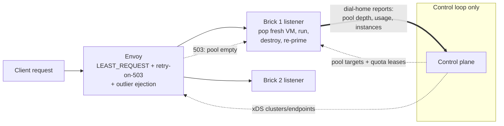

# ADR 015: Isolated High-Throughput Lane with Data-Plane Placement

**Author:** Joe McGinley
**Status:** Draft
**Created:** 2026-07-22
**Amends:** [ADR 014](014-worker-authoritative-state-hot-path-consistency.md) (replaces decision 6's `isolated_execution` flag mechanism; all other ADR 014 decisions stand and this lane builds on them)

---

## Problem

The target use case is high-throughput request serving where every request gets
total isolation: a fresh microVM per request, verifiably destroyed afterward,
nothing shared between requests. Neither existing lane provides both halves:

- **The task lane is isolated but control-plane-bound.** Every invoke passes
  through the CP router and the dispatcher GenServer (a single serialized
  process with a durable op-log append per lifecycle transition) before an
  Assign RPC reaches a brick. Each primed VM serves exactly one assignment and
  is destroyed after the response, so isolation holds, but the CP is the
  throughput ceiling and the latency floor on every request.
- **The serving lane is CP-free on the data path but shares state.** Envoy
  routes requests straight to brick taps from xDS-published endpoints; the CP
  only reconfigures. But the serving VM is long-lived and every request lands
  in the same guest: zero request isolation.

ADR 014 decision 6 approached isolation as an opt-in `isolated_execution`
workload flag with refusal gates on pool return, relight, and snapshot across
all lanes. Implementation planning showed that polices the wrong layer: a
workload wanting total isolation would live in the task lane, where those
reuse transitions do not exist, so the gates are dead code, and the flag does
nothing to remove the CP from the request path, which is the actual
requirement for the high-throughput case.

The balancing question comes with it. Today traffic-vs-capacity balancing is
CP-arbitrated for tasks (fair-share queue plus placement over dial-home
capacity facts) and nonexistent for serving (plain `ROUND_ROBIN` in the xDS
snapshot, no endpoint weights, no retry policy, no outlier ejection, no
capacity signal reaching the data plane). A CP-free isolated lane needs a
data-plane answer.

---

## Decision

Add a third lane: **isolated high-throughput serving**. It uses the serving
lane's transport with the task lane's semantics, and it makes per-request
placement a data-plane concern.

1. **Envoy routes requests directly to bricks; the CP is not on the request
   path.** Each lane workload gets an xDS cluster whose endpoints are
   per-brick listeners: the node agent exposes a request-facing port that
   fronts its local primed pool for that workload.

2. **The brick performs per-request VM assignment locally.** For each arriving
   request the node agent pops a fresh primed VM from its local pool, runs the
   request in it, destroys the VM after the response (node-confirmed, ADR 014
   decision 5), and re-primes in the background. Single-use is structural to
   the lane, not a policed property: there is no pool return, relight, bank,
   or snapshot capture in this lane at all. This replaces the
   `isolated_execution` flag; a workload opts into isolation by choosing the
   lane.

3. **Balancing is least-request plus cheap rejection, not a capacity ledger.**
   The lane's clusters use `LEAST_REQUEST` (in-flight count per brick tracks
   real capacity when each request holds a VM slot), and a brick whose pool is
   empty rejects instantly with a 503 before any VM work. Envoy retry policy
   (retry-on-503, bounded attempts, previous-hosts predicate) and outlier
   ejection shift traffic off drained or unhealthy bricks. This is ADR 014
   decision 3's reject/retry moved into the data plane.

4. **The CP becomes a pure control loop for this lane.** It sizes each brick's
   primed pool from observed demand (the existing PoolManager refill loop),
   publishes xDS configuration, and reconciles from dial-home reports
   (ADR 014 decision 1). Lifecycle rows for lane instances are written
   asynchronously from node reports (ADR 014 decision 2); there is nothing
   synchronous to write because the CP never sees the request.

5. **Metering must stay fail-closed without a CP hop.** The lane uses
   per-brick quota leases: the CP grants each brick a bounded budget of
   requests or CPU-time per principal-workload; the brick admits against its
   lease locally and rejects (429) when the lease is exhausted; lease renewal
   rides the existing dial-home cadence. A brick that cannot reach the CP
   stops admitting when its lease runs out, preserving the fail-closed
   property of ADR 014's metering carve-out at the cost of stranding at most
   one lease of budget per brick.

| Aspect | Today | Decided |
| ------ | ----- | ------- |
| Isolated + high-throughput | Not available (task lane isolated but CP-bound; serving lane CP-free but shared) | Third lane: Envoy to brick, fresh VM per request, destroyed after response |
| Per-request placement | CP dispatcher (tasks) or none (serving) | Brick-local pool pop; Envoy `LEAST_REQUEST` across bricks |
| Overload behaviour | Dispatcher queueing/denial | Brick 503 on empty pool, Envoy bounded retry + outlier ejection, then explicit failure |
| Isolation mechanism | ADR 014 decision 6 `isolated_execution` flag with cross-lane refusal gates | Structural to the lane; flag dropped |
| Metering | Synchronous CP admission | Per-brick quota leases, fail-closed on exhaustion |
| Serving xDS config | `ROUND_ROBIN`, no retry/outlier/weights | Lane clusters get least-request, retry policy, outlier ejection |

---

## Architecture

Request path: Envoy, one brick, one fresh VM. The CP appears only on the
dotted control edges: pool sizing, lease grants, xDS publication, and
reconciliation from reports.

---

## Alternatives Considered

- **Keep the ADR 014 decision 6 flag as specified.** Rejected: the refusal
  gates police lanes an isolated workload never occupies, and the flag leaves
  the CP on the request path, which is the actual bottleneck for the target
  use case.
- **Speed up the CP path instead (async writes only, ADR 014 decision 2).**
  Rejected: removes the durable write but keeps every request serialized
  through the router and dispatcher process; a data-plane proxy already
  exists and scales past a single GenServer.
- **EDS endpoint weights computed from reported free-slot counts.** Deferred:
  least-request plus instant rejection achieves capacity-proportional load
  without a feedback pipeline; weights can be added later if imbalance shows.
- **Async usage reporting instead of quota leases.** Rejected in one
  sentence: it makes metering fail-open, which ADR 014 explicitly carved out
  as non-negotiable.

## Security

Baseline per `docs/security.md`. Isolation strengthens: every request runs in
a fresh microVM booted from the per-workload base snapshot, and teardown is
node-confirmed and fail-closed (ADR 014 decision 5), so no request can
observe another's memory, scratch, or network identity. Boot provenance
follows ADR 014's capture-only answer: booting from the shared per-workload
base is permitted (it predates any request); capturing state from a lane
instance is structurally impossible. Quota leases keep metering fail-closed
with no CP round trip per request. The brick listener terminates untrusted
traffic on the node; it must enforce the same authentication posture as the
serving relay before any VM is consumed, so an unauthenticated flood cannot
drain pools.

## Risks

| Risk | Likelihood | Impact | Mitigation |
| ---- | ---------- | ------ | ---------- |
| Burst drains pools faster than re-prime, causing 503 storms | Medium | Medium | Least-request spreads load; Envoy bounded retry absorbs transient drain; PoolManager sizes pools from demand; sustained exhaustion surfaces as explicit fast failure, not queue collapse |
| Retry amplification under fleet-wide exhaustion | Low | Medium | Bounded attempts with previous-hosts predicate; outlier ejection stops hammering drained bricks; retry budget circuit breaker |
| Lease stranding (idle brick holds unused budget while another rejects) | Medium | Low | Short lease TTLs on the 30s dial-home cadence; CP rebalances grants from reported utilization |
| Per-request VM churn hits prime-rate or netlink limits | Medium | Medium | Tap pre-provisioning at brick boot (ADR 014 decision 4) removes netlink from the path; snapshot restore is the only per-request boot cost; pool depth absorbs jitter |
| Brick listener becomes an unauthenticated attack surface | Low | High | Same auth posture as the serving relay enforced before pool pop; reject before any VM or netlink work |

## Open Questions

1. Does the lane reuse the existing serving relay Envoy and xDS server, or a
   dedicated listener set? (Leaning reuse: same relay, new cluster class.)
2. Lease denomination: request count, CPU-milliseconds, or both? And is the
   grant per (principal, workload, brick) or per (workload, brick) with
   principal enforcement at the relay?
3. Protocol scope for the first cut: HTTP only, or TCP passthrough too
   (stateful-style L4)?
4. What demand signal sizes the pools: Envoy per-cluster request rate scraped
   by the CP, or brick-reported pop rate over dial-home?

## References

| Resource | Relevance |
| -------- | --------- |
| [Modal: scaling to 1 million concurrent sandboxes](https://modal.com/blog/scaling-to-1-million-concurrent-sandboxes-in-seconds) | Worker-local placement, creation off the coordination plane; this lane is that model at homelab scale |
| [ADR 014](014-worker-authoritative-state-hot-path-consistency.md) | Consistency foundation: worker authority, node-confirmed destruction, reject/retry, tap pre-provisioning; this ADR replaces its decision 6 mechanism |
| [ADR 013](013-substrate-lanes-brick-sizing-capacity-tiers.md) | Brick size classes and slot ceilings that bound pool depth per brick |
| [ADR 007](007-sharded-control-plane-pg-oplog-cells.md) | Op-log seam for the asynchronous lifecycle rows this lane relies on |
| `projects/embervm/xds/snapshot/desired.go` | Current serving xDS build (ROUND_ROBIN, no retry/outlier) this lane extends |

---

## Amendment (2026-07-26)

- **[ADR 020](020-admission-control-plane-token-routing-peer-redistribution.md) decision 6 inverts what the quota lease is for.** This ADR's decision 5 requires metering to "stay fail-closed without a CP hop," and has a brick stop admitting when its lease runs out. ADR 020 generalises the per-brick lease to every lane but makes it **fail-open**: metering allocates running costs inside an organisation rather than charging customers, so a brick that cannot renew keeps admitting and the unreconciled spend is written off. The mechanism this ADR chose is kept; the guarantee it was chosen to provide is withdrawn.
- **Cutting off a non-paying principal is no longer this lane's job.** ADR 020 makes it an admission action: the control plane suspends the principal and stops minting tokens, and the edge returns `402`. The lease is a reporting boundary, not an enforcement one, so "fail-closed on exhaustion" in the comparison table and in decision 5 should be read as superseded rather than as current intent.
