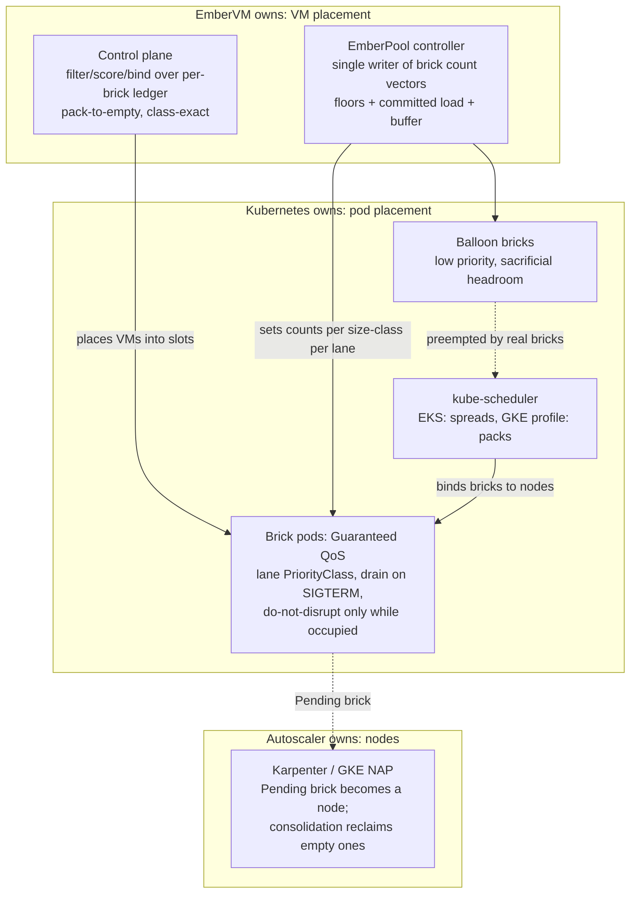

# ADR 016: Kubernetes Scheduling Integration Contract: Drive the Autoscaler, Own VM Placement

**Author:** Joe McGinley
**Status:** Draft
**Created:** 2026-07-22
**Refines:** [ADR 005](005-embervm-eks-scale-out-metal-pool-bricks.md), [ADR 012](012-fleet-colocation-cp-dynamic-sizing.md), [ADR 013](013-substrate-lanes-brick-sizing-capacity-tiers.md)

---

## Problem

EmberVM's capacity problem overlaps two mature systems: kube-scheduler
(placing pods on nodes) and Karpenter / GKE node auto-provisioning (turning
unschedulable demand into nodes). The control plane also bin-packs at its own
layer, placing VMs into brick slots. That overlap raises a question this ADR
answers once: should EmberVM **import** those projects' code, **rebuild**
their operational models internally, or **integrate** against their behavior,
and where exactly is the boundary between what ember owns and what Kubernetes
owns?

Two adjacent questions were sharpened in the same discussion and belong in the
same contract:

1. **How do workload classes get prioritized under load?** "Priority" in
   Kubernetes is three separate mechanisms (PriorityClass preemption, QoS
   eviction ordering, and nothing at all below pod granularity), and the unit
   ember cares about, a VM, is smaller than the unit Kubernetes arbitrates, a
   brick pod. Something has to project class priority across that gap.
2. **How is placement handled when workloads have differing resource
   requirements?** Heterogeneous VM demand meets fixed-size bricks
   (ADR 013), and the CP's VM-to-brick packing policy determines whether the
   layers underneath can ever reclaim capacity.

Prior ADRs decided fragments: pod-shaped capacity and the Pending-brick
scale-up signal (ADR 005), bricks as the single capacity unit on both tiers
(ADR 013 section 7), the per-brick headroom ledger (ADR 013 section 6). No
single record states the integration contract, the priority projection, or
the packing policy that ties them together.

---

## Decision

### 1. Three layers, three owners; the pod is the ABI

Neither import nor rebuild. EmberVM integrates with Kubernetes scheduling and
autoscaling through their public contract, the pod, and keeps exactly one
placement engine of its own.

| Layer | Owner | Ember's lever |
| ----- | ----- | ------------- |
| VM to brick slot | EmberVM control plane | Its own filter/score/bind pass over the per-brick headroom ledger (ADR 013 section 6) |
| Brick pod to node | kube-scheduler | Pod shape only: honest Guaranteed requests, attract-label, PriorityClass, affinity |
| Node provisioning and reclaim | Karpenter (EKS) / NAP (GKE) / nobody (homelab) | Brick count vectors from the single-writer EmberPool controller; a Pending brick is the scale-up signal (ADR 005) |

**No scheduler or autoscaler code is imported.** Karpenter is a controller,
not a library, and its packing is entangled with cloud instance catalogs; the
kube-scheduler framework is a Go plugin surface that managed control planes
(EKS, GKE) do not let us load anyway; the control plane is BEAM. **No node
provisioning machinery is rebuilt.** Any capacity mechanism whose full-cluster
state is not a Pending pod is invisible to the autoscaler and would have to
reinvent provisioning, which is the exact trap ADR 005's fat-daemon rejection
already recorded. What ember rebuilds internally is only the small model its
own layer needs: level-triggered reconcile and an explicit filter, score,
bind placement pass, in Elixir, over information no upstream scheduler has
(warmth, snapshot locality, generation, bank state, lane).

### 2. Encoded behavioral contracts, per environment

The integration is against documented, observable behavior, and the
differences between environments are recorded here as facts the design must
hold across, not discovered per incident:

- **EKS: initial placement spreads; consolidation is the bin-packer.** The
  managed kube-scheduler scores with `LeastAllocated` and cannot be
  reconfigured, so bricks spread at placement time and steady-state packing
  is delivered by Karpenter consolidation deleting and replacing underused
  nodes. Utilization on EKS therefore lives or dies on bricks being
  consolidation-compatible (next section).
- **GKE: the `optimize-utilization` autoscaling profile flips scoring to
  packing at placement time**, so consolidation churn is lower but the same
  compatibility rules apply to NAP scale-down.
- **Homelab: no Pending-brick consumer exists.** A Pending brick is the
  fleet-full page (ADR 013 section 7). Priority arbitration is permanent
  here, not transient, so the lane priority ladder below matters most on the
  smallest tier.

**EKS/Karpenter is the proven-first environment; GKE is demand-gated.**
ADR 005's metal NodePool stands: AWS exposes hardware virtualization only on
`.metal` instances, while GCE offers nested virtualization on general VMs, a
different performance and support posture to evaluate only if GKE demand
appears. The conformance drills below therefore target Karpenter semantics.

**The behavioral contracts are drilled with Karpenter's kwok provider,
path-scoped in CI.** A kind cluster running the real Karpenter controllers
against kwok fake nodes exercises provisioning, consolidation, disruption
taints, and budget semantics with no cloud spend, R6-gate style, and re-runs
on autoscaler version bumps (this is what makes "behavioral contracts, not
vendor code reading" an honest posture). The drill suite triggers only when
the modules encoding Karpenter-facing behavior change (placement score,
EmberPool controller, drain and node-lifecycle handling), never on general CP
changes; Bazel target granularity provides that gating for free, which makes
"Karpenter-facing policy lives in its own modules" a code-organization
requirement of this ADR, not a style preference.

**Consolidation compatibility is a lane admission requirement.** Any brick
type the fleet runs must: drain on SIGTERM within
`terminationGracePeriodSeconds` (bank or snapshot live sessions, finish or
refuse in-flight work); carry `karpenter.sh/do-not-disrupt` only while
occupied, removed the moment the brick empties; and run under NodePool
disruption budgets rather than blanket protection. A brick that cannot drain
does not get a lane; permanent do-not-disrupt is how a fleet silently loses
the utilization it was designed for.

### 3. Priority projection: three axes, and where each class's priority lives

Kubernetes offers two arbitration axes and ember adds the third. They answer
different questions and are configured independently:

| Axis | Question it answers | Ember's use |
| ---- | ------------------- | ----------- |
| PriorityClass + preemption | Who schedules first, and who is deleted to make room, when capacity is short | Ranks brick pools by lane; preemption deletes with a grace period, it does not drain |
| QoS class (requests vs limits) | Who survives node pressure and OOM | All bricks are Guaranteed (requests = limits); this protects running bricks and is never traded away |
| CP dispatch (queueing, floors, admission) | Which VM gets the slot | The only layer that sees individual workloads; class priority under load is primarily enforced here |

Because ADR 013 makes bricks homogeneous per lane and size class, **lane
priority projects cleanly onto brick PriorityClass**, and that projection is
the whole of ember's kube-level priority story:

- **Occupied-capable bricks run at default, non-preempting priority**
  (ADR 005's rule stands). A brick holding live VMs is never made cheap to
  kill as a QoS mechanism.
- **A lane may run below default priority only if its drain protocol is
  proven**: preemption is an unscheduled drain, so "which lanes are
  preemptible" is exactly "which lanes can checkpoint inside the grace
  period" (banked sessions) or lose nothing by dying between requests
  (the isolated lane's single-use VMs, ADR 015).
- **Burst headroom beyond provisioned floors is low-priority balloon
  bricks**: spare pre-warmed or pause-shaped pods that real bricks preempt
  instantly while the autoscaler backfills the node. This is the only
  legitimately sacrificial pod in the fleet.
- **Provisioned-concurrency floors are not a priority mechanism.** Floors
  are minimum per-lane brick counts held by the EmberPool controller
  (ADR 013 section 7); priority only decides who eats provisioning latency
  when demand exceeds the floor.
- **The lane-to-PriorityClass ladder is a CP-owned table, not chart
  values.** Workload registration is Helm-driven today but is headed toward
  Helm-or-API registration (deploying a lambda-shaped workload through an
  API call) with the definition living durably in the CP datastore
  (ADR 007). A per-lane scheduling attribute sourced from chart values
  would leave API-registered workloads with no home for it, so the ladder
  lives beside the workload and lane definitions in the CP, and the
  EmberPool controller (already the single writer of brick counts) stamps
  `priorityClassName` on the brick pods it reconciles. The cluster-scoped
  `PriorityClass` objects themselves stay chart-managed GitOps resources:
  the chart defines the rungs that exist, the CP table decides which rung
  each lane's bricks stand on. One bound on the future API path is recorded
  now: a registration call references an existing lane and rung, it never
  creates or raises one, so registering a workload cannot become a
  scheduling-privilege escalation surface. The full authorization story
  (which caller may register into which lane, with what floors and budgets)
  belongs to the future tenancy ADR (ADR 009's facade line).

### 4. Packing policy under heterogeneous demand: pack to empty, place by class

Differing VM resource requirements are absorbed by the size-class portfolio,
not by clever cross-class placement:

- **A VM places only into bricks of its size class.** Cross-class borrowing
  (a small VM parked in a large brick) is rejected: it strands the large
  class's contiguous headroom, which serving and session floors need
  one-for-one, to save small-class capacity that is cheaper to add.
- **The CP's score function bin-packs toward empty bricks.** Among bricks
  passing filters (class, lane, warmth, generation), placement prefers the
  fullest viable brick, so load concentrates and idle bricks drain to empty.
  An empty brick is the unit of reclaim: the EmberPool controller shrinks
  the count, the pod terminates, and only then can Karpenter or NAP
  consolidate the node. The CP's packing policy is therefore not a local
  optimization; it is what makes every layer below it reclaimable.
- **Exception: lanes that spread by design.** The isolated high-throughput
  lane balances per-request in the data plane (Envoy `LEAST_REQUEST` across
  per-brick listeners, ADR 015); its brick occupancy follows traffic, and
  the CP does not fight that with packing. Reclaim for that lane operates on
  pool-size reduction instead.
- **Per-brick contiguous headroom remains the ledger dimension**
  (ADR 013 section 6): refill and placement select a brick, never a node,
  and aggregate free capacity is never trusted.

### 5. Node lifecycle is a placement input; durability is a state guarantee, not node residency

Disruption policy is set by splitting workloads into two postures and making
node lifetime a fact the placement pass reads:

- **Preemptible-posture lanes** (task, isolated) lose nothing by dying
  between requests; their bricks are disruptable any time under normal
  budgets.
- **Durable-posture lanes** (session, stateful) carry a CP continuity
  guarantee of **up to 8 hours per session**. The guarantee is delivered by
  state durability, not node pinning: between requests the CP may bank a
  session and relight it on another brick or node freely, provided the
  banked state is HA-durable (Longhorn plus S3 backup, ADR 011). The 8h
  figure is both the promise to the workload and a **per-session cap the
  placement layer plans against**; nothing obliges the CP to hold a session
  on one node for that window.
- **The CP consumes node lifecycle signals as ledger facts.** Karpenter's
  disruption taint and events, node expiry horizons (`expireAfter`), and
  spot interruption notices all reduce to one placement input: **remaining
  node lifetime**. ADR 009's availability contract (spot semantics, a
  two-minute preemption bound) already set the floor this machinery must
  respect.
- **A terminating node is a placement target, not a blacklist entry.** Once
  a node carries a termination horizon, placement filters by fit instead of
  avoiding it: durable work may still land there when its expected residency
  fits inside the horizon (or its inter-request bank makes eviction free),
  and preemptible work is *preferentially* routed there in the run-up. Grace
  and drain windows are spent doing work, not idling; this is the same
  pack-to-empty utilization logic (section 4) applied on the time axis.
- **Disruption budgets are per-lane and schedule-gated** (Karpenter budgets
  take cron schedules natively): zero voluntary disruption for
  durable-posture bricks in declared peak windows, a bounded drain rate
  off-peak, unrestricted for preemptible-posture bricks. Per-lane
  `terminationGracePeriodSeconds` must exceed the measured worst-case drain
  (bank time for the largest VM of the class, plus margin), derived from
  existing bank/relight timings rather than guessed.
- **Verification splits by tool.** The kwok drills cover the observable
  Karpenter interplay; the drain/migration protocol itself (no session's
  guarantee left uncovered by a migration, no durable placement onto a node
  whose horizon cannot fit the commitment) is a candidate for a small TLA+
  spec in the ADR 006 pilot lineage, since it is exactly the kind of
  concurrency-critical, counterexample-prone protocol that pilot exists for.

### 6. Reserved options, deliberately not built

- **A custom or secondary scheduler** (or scheduler plugin, where a future
  self-managed cluster allows it) is reserved for the day pod-shape levers
  measurably fail to deliver placement quality. Config first.
- **Predictive scale-up** (a small Go sidecar embedding the
  cluster-autoscaler or Karpenter scheduling simulators to ask "would N more
  bricks fit") is reserved. Pending-brick-as-signal was chosen precisely so
  prediction is unnecessary; committed-future load is already pre-provisioned
  by offline bin-pack (ADR 013 section 7).

---

## Architecture

---

## Alternatives Considered

| Alternative | Rejected because |
| ----------- | ---------------- |
| Import Karpenter / kube-scheduler code as dependencies | Neither is a supported library; managed control planes forbid scheduler plugins; the CP is BEAM; the battle-tested part is their reconciliation machinery, which driving them provides for free |
| Rebuild node provisioning inside the CP | Autoscaler-invisible by construction and duplicates the hardest, least differentiated machinery; ADR 005 already rejected the shape once |
| Custom secondary scheduler for bricks now | Pod-shape levers have not been exhausted; a second scheduler adds an actuator and an upgrade surface for placement quality nobody has measured a need for |
| Low PriorityClass on occupied bricks as a QoS lever | Preemption deletes rather than drains, so this converts capacity pressure into mass VM death; ADR 005's non-preempting rule stands |
| Cross-class VM borrowing under pressure | Strands large-class contiguous headroom that session/serving floors need one-for-one; violates the class-exact ledger |
| Spread-scoring VM placement for resilience | Inverts reclaim: no brick ever empties, EmberPool cannot shrink, consolidation never fires; blast-radius concerns are already bounded by brick size (ADR 013 section 5) |

---

## Security

Baseline in [docs/security.md](../../security.md). Nothing here changes the
isolation model. Two notes: balloon bricks run no workload (pause-shaped or
empty pre-warmed daemons), so preempting them moves no tenant state; and
drain-on-SIGTERM banks a session under its existing principal keying, so
preemption and consolidation never become a cross-principal reuse path
(ADR 001's rule is unchanged).

---

## Risks

| Risk | Likelihood | Impact | Mitigation |
| ---- | ---------- | ------ | ---------- |
| `do-not-disrupt` left on an empty brick wedges consolidation | Medium | Medium | Annotation lifecycle owned by the brick daemon (set on first VM, cleared on last exit); fleet audit alarm on empty-and-protected bricks |
| EKS spread-then-consolidate churn migrates VMs more than expected | Medium | Medium | Consolidation budgets bound the rate; drain protocol makes each migration a bank/relight, not a loss; measure before tightening |
| Balloon bricks mis-sized: too small to absorb bursts or too large as idle spend | Medium | Low | Balloon size is a values-level knob per lane; floors carry the guaranteed part, balloons only the stochastic residual |
| Upstream behavior drifts (scheduler scoring, Karpenter consolidation rules) | Medium | Medium | Contracts here are behavioral; verify with conformance drills against a sandbox cluster (R6-gate style) on version bumps, not by reading vendor code |
| Pack-to-empty concentrates load and widens single-brick blast radius | Low | Medium | Brick sizing rule already bounds blast radius (ADR 013 section 5); score can cap per-brick occupancy per lane if incident data demands it |
| Node termination horizon is wrong or short (spot gives 2 minutes, not a plannable window) | Medium | Medium | ADR 009's two-minute preemption bound is already the availability floor; durable placement onto short-horizon nodes is allowed only when eviction is free (session banked between requests), otherwise only preemptible work fills them |
| kwok drills diverge from real EKS behavior (fake kubelet, no real capacity) | Medium | Medium | kwok validates Karpenter's controller logic, not node reality; a thin real-EKS smoke pass gates the first production cutover, kwok owns the regression surface after that |

---

## Open Questions

1. Concrete disruption budget percentages per lane (the shape is decided in
   section 5: per-lane, schedule-gated, zero for durable-posture bricks at
   peak); numbers come from kwok drill results and real occupancy data, not
   guesses.
2. Does the isolated lane eventually want a CP-side occupancy cap per brick
   (spread pressure) once real traffic data exists, or does data-plane
   `LEAST_REQUEST` suffice alone? Deliberately left open: adding the cap
   later is one filter in the CP score pass.
3. Does the 8h session guarantee become a per-workload registered value
   (bounded by a platform ceiling) once API registration exists, or stay a
   single platform constant?

---

## References

| Resource | Relevance |
| -------- | --------- |
| [ADR embervm/005](005-embervm-eks-scale-out-metal-pool-bricks.md) | Pod-shaped capacity, Pending-brick signal, EmberPool single writer, non-preempting rule this ADR extends |
| [ADR embervm/012](012-fleet-colocation-cp-dynamic-sizing.md) | The fixed homelab tier where priority arbitration is permanent |
| [ADR embervm/013](013-substrate-lanes-brick-sizing-capacity-tiers.md) | Size classes, per-brick headroom ledger, bricks-everywhere amendment this contract builds on |
| [ADR embervm/015](015-isolated-high-throughput-lane-data-plane-placement.md) | The lane whose data-plane balancing is the packing-policy exception |
| [ADR embervm/006](006-tla-formal-specification-pilot.md) | The TLA+ pilot lineage the drain/migration protocol spec would join |
| [ADR embervm/009](009-roadmap-extension-continuity-before-tenancy.md) | Spot availability contract (2-minute preemption bound); the tenancy line owning future registration authorization |
| [ADR embervm/011](011-distribution-longhorn-fencing-cp-rollouts.md) | HA-durable banked state (Longhorn + S3) that lets sessions migrate between requests |
| [Karpenter kwok provider](https://github.com/kubernetes-sigs/karpenter/tree/main/kwok) | Real Karpenter controllers against fake nodes; the no-cloud-spend drill substrate |
| [Karpenter disruption docs](https://karpenter.sh/docs/concepts/disruption/) | Consolidation, do-not-disrupt, and budget semantics the compatibility rules encode |
| [kube-scheduler NodeResourcesFit scoring](https://kubernetes.io/docs/reference/scheduling/config/#scheduling-plugins) | `LeastAllocated` default vs `MostAllocated` packing; why EKS spreads at placement |
| [GKE autoscaling profiles](https://cloud.google.com/kubernetes-engine/docs/concepts/cluster-autoscaler#autoscaling_profiles) | `optimize-utilization` as the GKE packing lever |
| [Cluster overprovisioning pattern](https://github.com/kubernetes/autoscaler/blob/master/cluster-autoscaler/FAQ.md#how-can-i-configure-overprovisioning-with-cluster-autoscaler) | The balloon-brick headroom mechanism |
