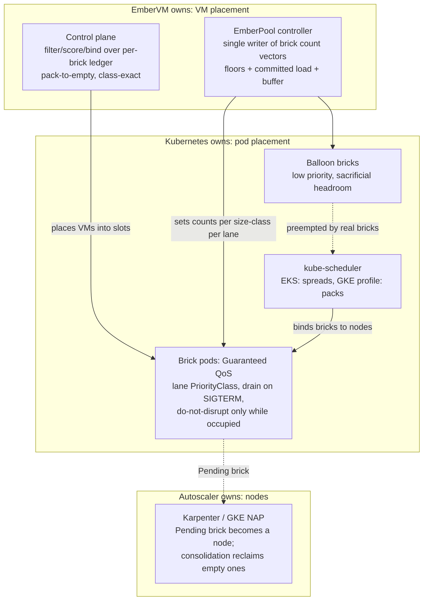

# ADR 016: Kubernetes Scheduling Integration Contract: Drive the Autoscaler, Own VM Placement

**Author:** Joe McGinley
**Status:** Draft
**Created:** 2026-07-22
**Refines:** [ADR 005](005-embervm-eks-scale-out-metal-pool-bricks.md), [ADR 012](012-fleet-colocation-cp-dynamic-sizing.md), [ADR 013](013-substrate-lanes-brick-sizing-capacity-tiers.md)

---

## Problem

EmberVM's capacity problem overlaps two mature systems: kube-scheduler
(placing pods on nodes) and Karpenter / GKE node auto-provisioning (turning
unschedulable demand into nodes). The control plane also bin-packs at its own
layer, placing VMs into brick slots. That overlap raises a question this ADR
answers once: should EmberVM **import** those projects' code, **rebuild**
their operational models internally, or **integrate** against their behavior,
and where exactly is the boundary between what ember owns and what Kubernetes
owns?

Two adjacent questions were sharpened in the same discussion and belong in the
same contract:

1. **How do workload classes get prioritized under load?** "Priority" in
   Kubernetes is three separate mechanisms (PriorityClass preemption, QoS
   eviction ordering, and nothing at all below pod granularity), and the unit
   ember cares about, a VM, is smaller than the unit Kubernetes arbitrates, a
   brick pod. Something has to project class priority across that gap.
2. **How is placement handled when workloads have differing resource
   requirements?** Heterogeneous VM demand meets fixed-size bricks
   (ADR 013), and the CP's VM-to-brick packing policy determines whether the
   layers underneath can ever reclaim capacity.

Prior ADRs decided fragments: pod-shaped capacity and the Pending-brick
scale-up signal (ADR 005), bricks as the single capacity unit on both tiers
(ADR 013 section 7), the per-brick headroom ledger (ADR 013 section 6). No
single record states the integration contract, the priority projection, or
the packing policy that ties them together.

---

## Decision

### 1. Three layers, three owners; the pod is the ABI

Neither import nor rebuild. EmberVM integrates with Kubernetes scheduling and
autoscaling through their public contract, the pod, and keeps exactly one
placement engine of its own.

| Layer | Owner | Ember's lever |
| ----- | ----- | ------------- |
| VM to brick slot | EmberVM control plane | Its own filter/score/bind pass over the per-brick headroom ledger (ADR 013 section 6) |
| Brick pod to node | kube-scheduler | Pod shape only: honest Guaranteed requests, attract-label, PriorityClass, affinity |
| Node provisioning and reclaim | Karpenter (EKS) / NAP (GKE) / nobody (homelab) | Brick count vectors from the single-writer EmberPool controller; a Pending brick is the scale-up signal (ADR 005) |

**No scheduler or autoscaler code is imported.** Karpenter is a controller,
not a library, and its packing is entangled with cloud instance catalogs; the
kube-scheduler framework is a Go plugin surface that managed control planes
(EKS, GKE) do not let us load anyway; the control plane is BEAM. **No node
provisioning machinery is rebuilt.** Any capacity mechanism whose full-cluster
state is not a Pending pod is invisible to the autoscaler and would have to
reinvent provisioning, which is the exact trap ADR 005's fat-daemon rejection
already recorded. What ember rebuilds internally is only the small model its
own layer needs: level-triggered reconcile and an explicit filter, score,
bind placement pass, in Elixir, over information no upstream scheduler has
(warmth, snapshot locality, generation, bank state, lane).

### 2. Encoded behavioral contracts, per environment

The integration is against documented, observable behavior, and the
differences between environments are recorded here as facts the design must
hold across, not discovered per incident:

- **EKS: initial placement spreads; consolidation is the bin-packer.** The
  managed kube-scheduler scores with `LeastAllocated` and cannot be
  reconfigured, so bricks spread at placement time and steady-state packing
  is delivered by Karpenter consolidation deleting and replacing underused
  nodes. Utilization on EKS therefore lives or dies on bricks being
  consolidation-compatible (next section).
- **GKE: the `optimize-utilization` autoscaling profile flips scoring to
  packing at placement time**, so consolidation churn is lower but the same
  compatibility rules apply to NAP scale-down.
- **Homelab: no Pending-brick consumer exists.** A Pending brick is the
  fleet-full page (ADR 013 section 7). Priority arbitration is permanent
  here, not transient, so the lane priority ladder below matters most on the
  smallest tier.

**EKS/Karpenter is the proven-first environment; GKE is demand-gated.**
ADR 005's metal NodePool remains the working EKS path, but its premise is
softened rather than absolute: EC2 now supports nested virtualization on
virtual instances (the 7i/8i Intel families, KVM as the L1 hypervisor,
opt-in per instance via the `NestedVirtualization` CPU option), which would
be a large cost lever versus metal. It is recorded as watched, not
deployable, because the k8s provisioning paths have not caught up: EKS
managed nodegroups silently ignore the CPU option
(containers-roadmap #2784, open), Karpenter's EC2NodeClass exposure of CPU
options must be confirmed at implementation time, AWS itself steers
latency-sensitive virtualization workloads to metal, and L2 boot/snapshot
latency under nested Nitro extensions is unmeasured for Firecracker's
profile. Adopting it is a NodePool swap plus a benchmark, not a redesign,
which is exactly what the pod-ABI contract buys. On GKE, Firecracker runs
on Standard nodes with nested virtualization enabled (Autopilot is
excluded: it blocks the privileged pods and host access bricks need);
demand-gated as before. The conformance drills below target Karpenter
semantics either way.

**The behavioral contracts are drilled with Karpenter's kwok provider,
path-scoped in CI.** A kind cluster running the real Karpenter controllers
against kwok fake nodes exercises provisioning, consolidation, disruption
taints, and budget semantics with no cloud spend, R6-gate style, and re-runs
on autoscaler version bumps (this is what makes "behavioral contracts, not
vendor code reading" an honest posture). The drill suite triggers only when
the modules encoding Karpenter-facing behavior change (placement score,
EmberPool controller, drain and node-lifecycle handling), never on general CP
changes; Bazel target granularity provides that gating for free, which makes
"Karpenter-facing policy lives in its own modules" a code-organization
requirement of this ADR, not a style preference.

**Consolidation compatibility is a lane admission requirement.** Any brick
type the fleet runs must: drain on SIGTERM within
`terminationGracePeriodSeconds` (bank or snapshot live sessions, finish or
refuse in-flight work); carry `karpenter.sh/do-not-disrupt` only while
occupied, removed the moment the brick empties; and run under NodePool
disruption budgets rather than blanket protection. A brick that cannot drain
does not get a lane; permanent do-not-disrupt is how a fleet silently loses
the utilization it was designed for.

### 3. Priority projection: three axes, and where each class's priority lives

Kubernetes offers two arbitration axes and ember adds the third. They answer
different questions and are configured independently:

| Axis | Question it answers | Ember's use |
| ---- | ------------------- | ----------- |
| PriorityClass + preemption | Who schedules first, and who is deleted to make room, when capacity is short | Ranks brick pools by lane; preemption deletes with a grace period, it does not drain |
| QoS class (requests vs limits) | Who survives node pressure and OOM | All bricks are Guaranteed (requests = limits); this protects running bricks and is never traded away |
| CP dispatch (queueing, floors, admission) | Which VM gets the slot | The only layer that sees individual workloads; class priority under load is primarily enforced here |

Because ADR 013 makes bricks homogeneous per lane and size class, **lane
priority projects cleanly onto brick PriorityClass**, and that projection is
the whole of ember's kube-level priority story:

- **Occupied-capable bricks run at default, non-preempting priority**
  (ADR 005's rule stands). A brick holding live VMs is never made cheap to
  kill as a QoS mechanism.
- **A lane may run below default priority only if its drain protocol is
  proven**: preemption is an unscheduled drain, so "which lanes are
  preemptible" is exactly "which lanes can checkpoint inside the grace
  period" (banked sessions) or lose nothing by dying between requests
  (the isolated lane's single-use VMs, ADR 015).
- **Burst headroom beyond provisioned floors is low-priority balloon
  bricks**: spare pre-warmed or pause-shaped pods that real bricks preempt
  instantly while the autoscaler backfills the node. This is the only
  legitimately sacrificial pod in the fleet.
- **Provisioned-concurrency floors are not a priority mechanism.** Floors
  are minimum per-lane brick counts held by the EmberPool controller
  (ADR 013 section 7); priority only decides who eats provisioning latency
  when demand exceeds the floor.
- **The lane-to-PriorityClass ladder is a CP-owned table, not chart
  values.** Workload registration is Helm-driven today but is headed toward
  Helm-or-API registration (deploying a lambda-shaped workload through an
  API call) with the definition living durably in the CP datastore
  (ADR 007). A per-lane scheduling attribute sourced from chart values
  would leave API-registered workloads with no home for it, so the ladder
  lives beside the workload and lane definitions in the CP, and the
  EmberPool controller (already the single writer of brick counts) stamps
  `priorityClassName` on the brick pods it reconciles. The cluster-scoped
  `PriorityClass` objects themselves stay chart-managed GitOps resources:
  the chart defines the rungs that exist, the CP table decides which rung
  each lane's bricks stand on. One bound on the future API path is recorded
  now: a registration call references an existing lane and rung, it never
  creates or raises one, so registering a workload cannot become a
  scheduling-privilege escalation surface. The full authorization story
  (which caller may register into which lane, with what floors and budgets)
  belongs to the future tenancy ADR (ADR 009's facade line).

### 4. Packing policy under heterogeneous demand: pack to empty, place by class

Differing VM resource requirements are absorbed by the size-class portfolio,
not by clever cross-class placement:

- **A VM places only into bricks of its size class.** Cross-class borrowing
  (a small VM parked in a large brick) is rejected: it strands the large
  class's contiguous headroom, which serving and session floors need
  one-for-one, to save small-class capacity that is cheaper to add.
- **The CP's score function bin-packs toward empty bricks.** Among bricks
  passing filters (class, lane, warmth, generation), placement prefers the
  fullest viable brick, so load concentrates and idle bricks drain to empty.
  An empty brick is the unit of reclaim: the EmberPool controller shrinks
  the count, the pod terminates, and only then can Karpenter or NAP
  consolidate the node. The CP's packing policy is therefore not a local
  optimization; it is what makes every layer below it reclaimable.
- **Exception: lanes that spread by design.** The isolated high-throughput
  lane balances per-request in the data plane (Envoy `LEAST_REQUEST` across
  per-brick listeners, ADR 015); its brick occupancy follows traffic, and
  the CP does not fight that with packing. Reclaim for that lane operates on
  pool-size reduction instead.
- **Per-brick contiguous headroom remains the ledger dimension**
  (ADR 013 section 6): refill and placement select a brick, never a node,
  and aggregate free capacity is never trusted.
- **Security never drives colocation.** Affinity rules that group
  "similar" workloads onto shared bricks or nodes to simplify network
  policy are rejected: they couple placement freedom to the security
  model, fragment capacity back toward the per-workload-pool shape
  ADR 013 rejected, and still leave the pod as the policy unit when the
  actual tenant is the VM. Per-workload network and secret boundaries are
  enforced at the VM boundary instead (per-VM tap firewall rules and the
  egress path; see Security), so brick pods stay interchangeable capacity
  carrying one uniform coarse network policy, and the packing score keeps
  full freedom. The only placement-shaped isolation that exists is the
  lane (ADR 015), which is a semantics choice, not a network-policy
  workaround.

### 5. Node lifecycle is a placement input; durability is a state guarantee, not node residency

Disruption policy is set by splitting workloads into two postures and making
node lifetime a fact the placement pass reads:

- **Preemptible-posture lanes** (task, isolated) lose nothing by dying
  between requests; their bricks are disruptable any time under normal
  budgets.
- **Durable-posture lanes** (session, stateful) carry a CP continuity
  guarantee of **up to 8 hours per session**. The guarantee is delivered by
  state durability, not node pinning: between requests the CP may bank a
  session and relight it on another brick or node freely, provided the
  banked state is HA-durable (Longhorn plus S3 backup, ADR 011). The 8h
  figure is both the promise to the workload and a **per-session cap the
  placement layer plans against**; nothing obliges the CP to hold a session
  on one node for that window.
- **The CP consumes node lifecycle signals as ledger facts.** Karpenter's
  disruption taint and events, node expiry horizons (`expireAfter`), and
  spot interruption notices all reduce to one placement input: **remaining
  node lifetime**. ADR 009's availability contract (spot semantics, a
  two-minute preemption bound) already set the floor this machinery must
  respect.
- **A terminating node is a placement target, not a blacklist entry.** Once
  a node carries a termination horizon, placement filters by fit instead of
  avoiding it: durable work may still land there when its expected residency
  fits inside the horizon (or its inter-request bank makes eviction free),
  and preemptible work is *preferentially* routed there in the run-up. Grace
  and drain windows are spent doing work, not idling; this is the same
  pack-to-empty utilization logic (section 4) applied on the time axis.
- **Disruption budgets are per-lane and schedule-gated** (Karpenter budgets
  take cron schedules natively): zero voluntary disruption for
  durable-posture bricks in declared peak windows, a bounded drain rate
  off-peak, unrestricted for preemptible-posture bricks. Per-lane
  `terminationGracePeriodSeconds` must exceed the measured worst-case drain
  (bank time for the largest VM of the class, plus margin), derived from
  existing bank/relight timings rather than guessed.
- **Users express posture, never mechanics.** Following Kubernetes' own
  pattern (intent through bounded primitives, platform owns the raw knobs),
  a workload owner chooses from a small enum: posture (preemptible or
  durable), lane, and for durable work a session duration at or under the
  platform ceiling. Everything downstream is platform-derived from that
  choice: the PriorityClass rung, the disruption budget, the grace period,
  the do-not-disrupt lifecycle. No workload can set a raw budget percentage,
  a priority value, or a grace period, which is what makes the hierarchy
  misconfiguration-resistant: the worst a wrong choice can do is give one
  workload a stricter posture than it needed, never wedge fleet-wide node
  recycling or outrank the interactive lane.
- **The session contract is two-tier: an 8h live ceiling and a 7-day
  resume window, bounded by different things.** The 8h ceiling applies to
  a *continuously live* session (sized for long-running coding sessions)
  because a live session is what consumes placement: a slot held, a node
  horizon to fit, disruption budgets to respect. A workload registers its
  expected live duration at or below the ceiling and may never raise it
  (the same non-escalation rule as the priority rungs); shorter declared
  durations are placement information that keeps draining nodes utilized.
  A *banked* session is different in kind: its snapshot lives in S3
  (ADR 009/011), off-node and HA-durable, holding no slot and invisible to
  node lifecycle, so its bound is storage retention, not placement. Banked
  sessions are resumable for **7 days from last bank**; a relight within
  the window starts a fresh live window. One consequence recorded
  explicitly: an unexpired bank is a **GC root**. Warmth and base GC (the
  generation-invariant S3 sweeps) must either pin the artifacts an
  unexpired bank's relight needs, or relight must tolerate re-fetching and
  rebuilding them (bases are digest-pinned OCI, so rebuildable; the first
  resume after a long idle may pay a cold base restore, which is
  accepted).
- **A third tier: the durable workspace, 30 days from last use, files
  only.** A session's working set (git repo, sqlite, dotfiles; on the
  order of 10MB, cap enforced) outlives its memory snapshot as a
  compressed (zstd), content-addressed file archive in S3. Resume from
  this tier is **current base + file hydration** (the zip-hydration VSOCK
  path pointed at a workspace): in-memory state is gone, but a coding
  session does not need it to continue. What makes this tier the cheapest
  *and* the most robust is what it lacks: a workspace is not
  CPU-vendor-pinned, not base-generation-pinned, and pins nothing against
  warmth or base GC, so it survives base digest churn, kernel upgrades,
  and vendor migration that would invalidate a memory snapshot. The
  workspace is captured **eagerly at every bank** (a few MB next to the
  memory image), so bank expiry at 7 days degrades to this tier by pure
  artifact expiry, no extraction step, and bank GC stays trivially safe;
  content-addressing makes successive captures near-free since a
  session's git objects barely change between banks. Retention is
  **latest-only per session lineage**: each capture supersedes the
  previous manifest, unreferenced chunks fall out of the content store,
  and the CP owns the whole lifecycle (capture, upload, hydrate, expiry)
  through node verbs, the ADR 003 pattern of nodes exposing verbs and the
  CP deciding.
- **Resume is one interface with four verbs, and the CP picks the
  cheapest unexpired artifact.** The workload lifecycle contract is: boot
  cold; run from a base snapshot restore; continue from a warm (memory)
  snapshot restore; continue from base + workspace hydration. Warm within
  7d beats hydration within 30d beats cold; every tier below the top is a
  graceful degradation of the same session lineage, not a different
  product surface.
- **Verification splits by tool.** The kwok drills cover the observable
  Karpenter interplay; the drain/migration protocol itself (no session's
  guarantee left uncovered by a migration, no durable placement onto a node
  whose horizon cannot fit the commitment) is a candidate for a small TLA+
  spec in the ADR 006 pilot lineage, since it is exactly the kind of
  concurrency-critical, counterexample-prone protocol that pilot exists for.

### 6. Reserved options, deliberately not built

- **A custom or secondary scheduler** (or scheduler plugin, where a future
  self-managed cluster allows it) is reserved for the day pod-shape levers
  measurably fail to deliver placement quality. Config first.
- **Predictive scale-up** (a small Go sidecar embedding the
  cluster-autoscaler or Karpenter scheduling simulators to ask "would N more
  bricks fit") is reserved. Pending-brick-as-signal was chosen precisely so
  prediction is unnecessary; committed-future load is already pre-provisioned
  by offline bin-pack (ADR 013 section 7).

---

## Architecture

---

## Alternatives Considered

| Alternative | Rejected because |
| ----------- | ---------------- |
| Import Karpenter / kube-scheduler code as dependencies | Neither is a supported library; managed control planes forbid scheduler plugins; the CP is BEAM; the battle-tested part is their reconciliation machinery, which driving them provides for free |
| Rebuild node provisioning inside the CP | Autoscaler-invisible by construction and duplicates the hardest, least differentiated machinery; ADR 005 already rejected the shape once |
| Custom secondary scheduler for bricks now | Pod-shape levers have not been exhausted; a second scheduler adds an actuator and an upgrade surface for placement quality nobody has measured a need for |
| Low PriorityClass on occupied bricks as a QoS lever | Preemption deletes rather than drains, so this converts capacity pressure into mass VM death; ADR 005's non-preempting rule stands |
| Cross-class VM borrowing under pressure | Strands large-class contiguous headroom that session/serving floors need one-for-one; violates the class-exact ledger |
| Spread-scoring VM placement for resilience | Inverts reclaim: no brick ever empties, EmberPool cannot shrink, consolidation never fires; blast-radius concerns are already bounded by brick size (ADR 013 section 5) |

---

## Security

Baseline in [docs/security.md](../../security.md). Nothing here changes the
isolation model. Notes:

- Balloon bricks run no workload (pause-shaped or empty pre-warmed
  daemons), so preempting them moves no tenant state; and drain-on-SIGTERM
  banks a session under its existing principal keying, so preemption and
  consolidation never become a cross-principal reuse path (ADR 001's rule
  is unchanged).
- **Snapshot tiers hold different secret exposure.** A banked memory
  snapshot contains whatever was resident in guest RAM, so credentials
  follow the established pattern: guests hold placeholders with real
  secrets swapped at the egress hop (ADR agents/023) and dynamic
  per-workload tokens delivered via MMDS (ADR agents/046), injected fresh
  at boot and relight. A 7-day-old memory snapshot then contains only
  placeholders and expired short-lived tokens, and the 30-day workspace
  tier contains no credentials at all (files only; credential material is
  excluded from the workspace manifest by construction).
- **Network policy granularity follows the same pod-vs-VM split as
  priority.** Brick pods carry one uniform coarse CiliumNetworkPolicy
  (CP, object store, egress proxy; deny otherwise); per-workload
  allow-lists are data the CP pushes to the VM boundary (per-VM tap
  firewall rules, per-secret egress allowlists), because the pod is the
  wrong unit for per-tenant policy in a multi-VM brick.
- **The credential model bounds what a compromised brick is worth.**
  noded is the TCB for its guests (it owns their memory), so robustness
  is blast radius and persistence, not pretending the brick is untrusted:
  (1) placeholders are **random nonces minted per light/relight**
  (MMDS-delivered), honored by the egress proxy only from that VM's tap
  and unmapped at bank/destroy, so a placeholder is worthless exfiltrated,
  replayed, or found in a stale snapshot, and doubles as the per-session
  audit ID; (2) the brick holds credentials as **live-session leases
  only**: acquired at light, memory-only (never disk, env, MMDS, or any
  snapshot tier), TTL-renewed on use rather than repulled per request,
  dropped at bank/destroy, centrally revocable, so a compromised brick
  yields only the sessions currently live on it; (3) **bricks never hold
  root credentials**: the CP-side broker exchanges long-lived secrets for
  short-lived downscoped derivations (installation tokens, STS sessions)
  before they reach a brick, so even a full noded compromise leaks
  material that expires in minutes and is scoped to the same paths the
  egress allowlist names. Leases are sealed to the brick's dial-home
  identity, and the swap cache lives in a separate minimal process from
  noded's large attack surface (the agents/023 sidecar shape). Mechanics
  belong to the agents/023 and agents/046 lines; this ADR fixes the
  contract those mechanics must satisfy.
- **Fixed secrets that cannot be scoped or derived are handled by
  routing, not by exception.** Secrets fall into three classes: derivable
  (provider issues short-lived scoped material; broker derives, brick
  leases), fixed-but-API-rotatable (brick may lease; the platform imposes
  the lifetime the provider will not, via scheduled rotation, making the
  cadence the blast-radius knob), and fixed-with-manual-rotation, which
  is **never distributed to bricks in any form**: the brick's egress
  proxy forwards the placeholder request to a central swap tier (the
  agents/023 sidecar grown into a shared service) that holds the key and
  injects it upstream. The cost is one intra-cluster hop on a call
  already crossing the internet; the gain is that a brick compromise
  yields exactly nothing for this class. The invariant restated: **what
  reaches a brick is always time-bounded within our control; anything we
  cannot time-bound does not reach a brick.** Per-secret path allowlists
  apply to all three classes, which is scoping-by-proxy even where the
  provider offers none. A workload requiring a fixed API key does not
  contradict this: the *upstream* sees its fixed key on every request,
  attached at exactly one hop; the guest only ever sends the placeholder.
  The pattern's honest boundary is where injection-in-transit cannot
  work, and each case degrades one rung, no further than the operation
  requires: request-signing schemes (SigV4, HMAC) are re-signed at the
  swap point with the guest SDK signing against a discarded dummy key;
  protocols the proxy cannot speak (SMTP, database auth) fall back to a
  brick lease under class-2 discipline; genuinely local use (in-guest
  decryption or signing) is converted to a broker call where possible (a
  signing oracle: the operation travels to the key, not the key to the
  guest) and is otherwise a recorded per-workload exception whose memory
  snapshots carry the exposure caveat alone. Two non-solutions and one
  rule are recorded to prevent re-derivation: **encrypting a fixed key
  and distributing it with a TTL does not reclassify it** (a credential's
  lifetime is enforced by its validator, not its courier; the plaintext
  is exposed at use time and stays valid upstream regardless of our
  wrapper's expiry). The central swap tier is what actually "makes
  everything rotatable": every credential that moves (nonces, leases,
  brick mTLS identity) is platform-issued and revocable at will, and the
  un-boundable key never moves. And **internal services must never mint
  fixed long-lived keys**: for validators we own, credentials are
  derivable by design (scoped, short-TTL), so class 3 remains only the
  external-provider residue it has to be.
- **The central swap tier is not a hot path; scope and placement are
  fixed here.** It sits on class-3 secret-injecting egress only: ingress
  and serving traffic, internal calls (platform creds, brick-local
  injection), class-1/2 external calls (brick-local lease swap), and
  non-secret egress never transit it. The policy layer that IS on every
  guest egress is the brick-local proxy, which scales with the fleet by
  construction. The central tier is a stateless in-cluster Deployment
  behind a Service (TLS, allowlist match, header rewrite, in-memory key
  cache from the secret operator; no disk), horizontally scaled, reached
  by bricks over mTLS with their dial-home identity, and its calls are
  internet-bound by definition, so the intra-cluster hop is noise
  against upstream RTT. High-frequency workloads do not change this:
  stateless rewrite proxying is orders of magnitude cheaper than the
  internet call it fronts, connections are pooled on both sides, and the
  binding constraint arrives earlier anyway, at the **provider's per-key
  rate limit**. That constraint is the tier's second job: a class-3 key
  is one shared fixed key for the whole fleet, so brick-local swapping
  would mean fifty uncoordinated callers spending one quota (429 storms,
  retry amplification, provider bans); the central tier is the only
  component that sees the key's global consumption and therefore owns
  the token bucket, per-workload fairness, coalescing, and backoff for
  it. If class-3 volume still runs hot after that, it is a
  provider-selection smell with two fixes before any architecture
  change: re-check the provider for a rotation API (promote to class 2),
  or record a measured per-key exception leasing brick-side under
  aggressive manual-rotation cadence.

---

## Risks

| Risk | Likelihood | Impact | Mitigation |
| ---- | ---------- | ------ | ---------- |
| `do-not-disrupt` left on an empty brick wedges consolidation | Medium | Medium | Annotation lifecycle owned by the brick daemon (set on first VM, cleared on last exit); fleet audit alarm on empty-and-protected bricks |
| EKS spread-then-consolidate churn migrates VMs more than expected | Medium | Medium | Consolidation budgets bound the rate; drain protocol makes each migration a bank/relight, not a loss; measure before tightening |
| Balloon bricks mis-sized: too small to absorb bursts or too large as idle spend | Medium | Low | Balloon size is a values-level knob per lane; floors carry the guaranteed part, balloons only the stochastic residual |
| Upstream behavior drifts (scheduler scoring, Karpenter consolidation rules) | Medium | Medium | Contracts here are behavioral; verify with conformance drills against a sandbox cluster (R6-gate style) on version bumps, not by reading vendor code |
| Pack-to-empty concentrates load and widens single-brick blast radius | Low | Medium | Brick sizing rule already bounds blast radius (ADR 013 section 5); score can cap per-brick occupancy per lane if incident data demands it |
| Node termination horizon is wrong or short (spot gives 2 minutes, not a plannable window) | Medium | Medium | ADR 009's two-minute preemption bound is already the availability floor; durable placement onto short-horizon nodes is allowed only when eviction is free (session banked between requests), otherwise only preemptible work fills them |
| kwok drills diverge from real EKS behavior (fake kubelet, no real capacity) | Medium | Medium | kwok validates Karpenter's controller logic, not node reality; a thin real-EKS smoke pass gates the first production cutover, kwok owns the regression surface after that |

---

## Open Questions

1. The platform-side disruption budget constants per posture (users never
   set these; section 5): initial values come from kwok drill results and
   real occupancy data, not guesses.
2. Does the isolated lane (ADR 015) eventually want a CP-side occupancy cap
   per brick (spread pressure) once real traffic data exists, or does
   data-plane `LEAST_REQUEST` suffice alone? Deliberately left open: adding
   the cap later is one filter in the CP score pass.
3. The workspace manifest: which guest paths constitute the durable
   workspace (declared per workload vs a platform convention like the guest
   home directory), how the size cap is enforced at capture time, and
   whether the cap is a registered value under a platform ceiling like
   session duration.

---

## References

| Resource | Relevance |
| -------- | --------- |
| [ADR embervm/005](005-embervm-eks-scale-out-metal-pool-bricks.md) | Pod-shaped capacity, Pending-brick signal, EmberPool single writer, non-preempting rule this ADR extends |
| [ADR embervm/012](012-fleet-colocation-cp-dynamic-sizing.md) | The fixed homelab tier where priority arbitration is permanent |
| [ADR embervm/013](013-substrate-lanes-brick-sizing-capacity-tiers.md) | Size classes, per-brick headroom ledger, bricks-everywhere amendment this contract builds on |
| [ADR embervm/015](015-isolated-high-throughput-lane-data-plane-placement.md) | The lane whose data-plane balancing is the packing-policy exception |
| [ADR embervm/006](006-tla-formal-specification-pilot.md) | The TLA+ pilot lineage the drain/migration protocol spec would join |
| [ADR embervm/009](009-roadmap-extension-continuity-before-tenancy.md) | Spot availability contract (2-minute preemption bound); the tenancy line owning future registration authorization |
| [ADR embervm/011](011-distribution-longhorn-fencing-cp-rollouts.md) | HA-durable banked state (Longhorn + S3) that lets sessions migrate between requests |
| [Karpenter kwok provider](https://github.com/kubernetes-sigs/karpenter/tree/main/kwok) | Real Karpenter controllers against fake nodes; the no-cloud-spend drill substrate |
| [EC2 nested virtualization](https://docs.aws.amazon.com/AWSEC2/latest/UserGuide/amazon-ec2-nested-virtualization.html) | KVM on virtual 7i/8i instances; the watched cost lever against the metal NodePool |
| [containers-roadmap #2784](https://github.com/aws/containers-roadmap/issues/2784) | EKS managed nodegroups ignore the nested-virt CPU option; the gate on deploying that lever |
| [Karpenter disruption docs](https://karpenter.sh/docs/concepts/disruption/) | Consolidation, do-not-disrupt, and budget semantics the compatibility rules encode |
| [kube-scheduler NodeResourcesFit scoring](https://kubernetes.io/docs/reference/scheduling/config/#scheduling-plugins) | `LeastAllocated` default vs `MostAllocated` packing; why EKS spreads at placement |
| [GKE autoscaling profiles](https://cloud.google.com/kubernetes-engine/docs/concepts/cluster-autoscaler#autoscaling_profiles) | `optimize-utilization` as the GKE packing lever |
| [Cluster overprovisioning pattern](https://github.com/kubernetes/autoscaler/blob/master/cluster-autoscaler/FAQ.md#how-can-i-configure-overprovisioning-with-cluster-autoscaler) | The balloon-brick headroom mechanism |
