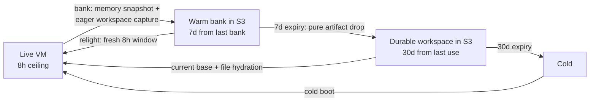
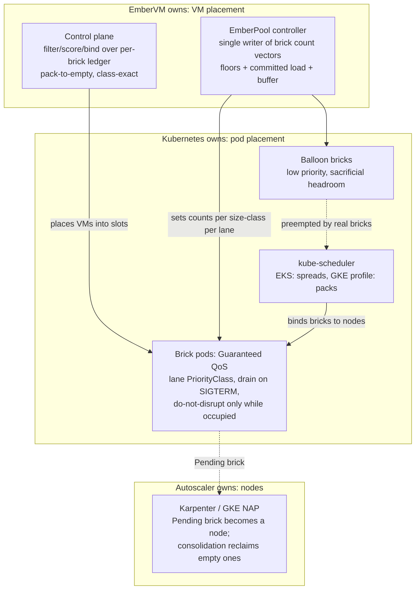
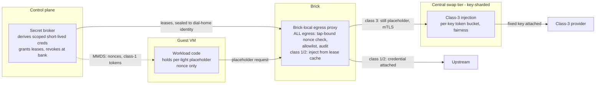

# ADR 016: Kubernetes Scheduling Integration Contract: Drive the Autoscaler, Own VM Placement

**Author:** Joe McGinley
**Status:** Accepted
**Created:** 2026-07-22
**Refines:** [ADR 005](005-embervm-eks-scale-out-metal-pool-bricks.md), [ADR 012](012-fleet-colocation-cp-dynamic-sizing.md), [ADR 013](013-substrate-lanes-brick-sizing-capacity-tiers.md)

---

## Problem

EmberVM's capacity problem overlaps two mature systems: kube-scheduler
(placing pods on nodes) and Karpenter / GKE node auto-provisioning (turning
unschedulable demand into nodes). The control plane also bin-packs at its own
layer, placing VMs into brick slots. That overlap raises a question this ADR
answers once: should EmberVM **import** those projects' code, **rebuild**
their operational models internally, or **integrate** against their behavior,
and where exactly is the boundary between what ember owns and what Kubernetes
owns?

Underneath every sub-question here is one structural mismatch: **Kubernetes
arbitrates pods, and ember's tenant is smaller than a pod.** A brick pod
holds many workloads' VMs, so every per-workload concern (priority under
load, placement of heterogeneous demand, disruption tolerance, network and
credential boundaries) must be projected across that granularity gap: the
pod layer kept uniform so the scheduler and autoscaler stay free to pack,
and the per-workload enforcement done by ember at the VM boundary.

Prior ADRs decided fragments: pod-shaped capacity and the Pending-brick
scale-up signal (ADR 005), bricks as the single capacity unit on both tiers
(ADR 013 section 7), the per-brick headroom ledger (ADR 013 section 6). No
single record states the integration contract, the priority projection, the
packing policy, the disruption and durability model, or the credential
boundary that ties them together. That is this ADR.

---

## Decision

### 1. Three layers, three owners; the pod is the ABI

Neither import nor rebuild. EmberVM integrates with Kubernetes scheduling and
autoscaling through their public contract, the pod, and keeps exactly one
placement engine of its own.

| Layer | Owner | Ember's lever |
| ----- | ----- | ------------- |
| VM to brick slot | EmberVM control plane | Its own filter/score/bind pass over the per-brick headroom ledger (ADR 013 section 6) |
| Brick pod to node | kube-scheduler | Pod shape only: honest Guaranteed requests, attract-label, PriorityClass, affinity |
| Node provisioning and reclaim | Karpenter (EKS) / NAP (GKE) / nobody (homelab) | Brick count vectors from the single-writer EmberPool controller; a Pending brick is the scale-up signal (ADR 005) |

**No scheduler or autoscaler code is imported.** Karpenter is a controller,
not a library, and its packing is entangled with cloud instance catalogs; the
kube-scheduler framework is a Go plugin surface that managed control planes
(EKS, GKE) do not let us load anyway; the control plane is BEAM. **No node
provisioning machinery is rebuilt.** Any capacity mechanism whose full-cluster
state is not a Pending pod is invisible to the autoscaler and would have to
reinvent provisioning, the exact trap ADR 005's fat-daemon rejection already
recorded. What ember rebuilds internally is only the small model its own
layer needs: level-triggered reconcile and an explicit filter, score, bind
placement pass, in Elixir, over information no upstream scheduler has
(warmth, snapshot locality, generation, bank state, lane).

### 2. Behavioral contracts per environment, drilled with kwok

The integration is against documented, observable behavior. The environment
differences are recorded as facts the design must hold across, not
discovered per incident:

- **EKS: initial placement spreads; consolidation is the bin-packer.** The
  managed kube-scheduler scores with `LeastAllocated` and cannot be
  reconfigured, so bricks spread at placement time and steady-state packing
  is delivered by Karpenter consolidation deleting and replacing underused
  nodes. Utilization on EKS lives or dies on bricks being
  consolidation-compatible (below).
- **GKE: the `optimize-utilization` autoscaling profile packs at placement
  time**, so consolidation churn is lower; the same compatibility rules
  apply to NAP scale-down. Firecracker requires Standard nodes with nested
  virtualization (Autopilot blocks the privileged pods bricks need).
- **Homelab: no Pending-brick consumer exists.** A Pending brick is the
  fleet-full page (ADR 013 section 7). Priority arbitration is permanent
  here, not transient, so the lane ladder matters most on the smallest tier.

**EKS/Karpenter is proven first; GKE is demand-gated.** ADR 005's metal
NodePool remains the working EKS path. One premise is softened: EC2 now
supports nested virtualization on virtual 7i/8i instances (KVM as L1,
opt-in `NestedVirtualization` CPU option), a large cost lever versus metal,
recorded as **watched, not deployable**: EKS managed nodegroups silently
ignore the CPU option (containers-roadmap #2784), Karpenter's EC2NodeClass
exposure needs confirming, and L2 boot/snapshot latency under nested Nitro
is unmeasured for Firecracker's profile. Adopting it later is a NodePool
swap plus a benchmark, not a redesign, which is what the pod-ABI contract
buys.

**The contracts are drilled with Karpenter's kwok provider, path-scoped in
CI.** A kind cluster running the real Karpenter controllers against kwok
fake nodes exercises provisioning, consolidation, disruption taints, and
budget semantics with no cloud spend, and re-runs on autoscaler version
bumps; this is what makes "behavioral contracts, not vendor code reading"
an honest posture. The drill suite triggers only when the Karpenter-facing
modules change (placement score, EmberPool controller, drain and
node-lifecycle handling), never on general CP changes. Bazel target
granularity provides that gating for free, which makes "Karpenter-facing
policy lives in its own modules" a code-organization requirement of this
ADR.

**Consolidation compatibility is a lane admission requirement.** Any brick
type the fleet runs must: drain on SIGTERM within
`terminationGracePeriodSeconds` (bank or snapshot live sessions, finish or
refuse in-flight work); carry `karpenter.sh/do-not-disrupt` only while
occupied, removed the moment the brick empties; and run under NodePool
disruption budgets rather than blanket protection. A brick that cannot
drain does not get a lane; permanent do-not-disrupt is how a fleet silently
loses the utilization it was designed for.

### 3. Priority projection: three axes

Kubernetes offers two arbitration axes and ember adds the third:

| Axis | Question it answers | Ember's use |
| ---- | ------------------- | ----------- |
| PriorityClass + preemption | Who schedules first, and who is deleted to make room, when capacity is short | Ranks brick pools by lane; preemption deletes with a grace period, it does not drain |
| QoS class (requests vs limits) | Who survives node pressure and OOM | All bricks are Guaranteed (requests = limits); never traded away |
| CP dispatch (queueing, floors, admission) | Which VM gets the slot | The only layer that sees individual workloads; class priority under load is primarily enforced here |

Because ADR 013 makes bricks homogeneous per lane and size class, lane
priority projects cleanly onto brick PriorityClass:

- **Occupied-capable bricks run at default, non-preempting priority**
  (ADR 005's rule stands). A brick holding live VMs is never made cheap to
  kill as a QoS mechanism.
- **A lane may run below default priority only if its drain protocol is
  proven.** Preemption is an unscheduled drain, so "which lanes are
  preemptible" is exactly "which lanes can checkpoint inside the grace
  period" (banked sessions) or lose nothing by dying between requests (the
  isolated lane's single-use VMs, ADR 015).
- **Burst headroom beyond provisioned floors is low-priority balloon
  bricks**: spare pre-warmed or pause-shaped pods that real bricks preempt
  instantly while the autoscaler backfills. The only legitimately
  sacrificial pods in the fleet. Floors themselves are not a priority
  mechanism: they are minimum per-lane brick counts held by the EmberPool
  controller; priority only decides who eats provisioning latency beyond
  the floor.
- **The lane-to-PriorityClass ladder is a CP-owned table, not chart
  values.** Workload registration is Helm-driven today but headed toward
  Helm-or-API registration with definitions living durably in the CP
  datastore (ADR 007); a per-lane scheduling attribute in chart values
  would leave API-registered workloads with no home for it. The EmberPool
  controller stamps `priorityClassName` on the brick pods it reconciles.
  The cluster-scoped `PriorityClass` objects stay chart-managed GitOps
  resources: the chart defines the rungs that exist, the CP table decides
  which rung each lane stands on. Non-escalation bound recorded now: a
  registration call references an existing lane and rung, never creates or
  raises one. The full authorization story belongs to the future tenancy
  ADR (ADR 009's facade line).

### 4. Packing policy under heterogeneous demand: pack to empty, place by class

Differing VM resource requirements are absorbed by the size-class portfolio,
not by clever cross-class placement:

- **A VM places only into bricks of its size class.** Cross-class borrowing
  is rejected: it strands the large class's contiguous headroom, which
  serving and session floors need one-for-one, to save small-class capacity
  that is cheaper to add.
- **The CP's score function bin-packs toward empty bricks.** Among bricks
  passing filters (class, lane, warmth, generation), placement prefers the
  fullest viable brick, so load concentrates and idle bricks drain to
  empty. An empty brick is the unit of reclaim: EmberPool shrinks the
  count, the pod terminates, and only then can the autoscaler consolidate
  the node. The packing policy is not a local optimization; it is what
  makes every layer below it reclaimable.
- **Exception: lanes that spread by design.** The isolated high-throughput
  lane balances per-request in the data plane (Envoy `LEAST_REQUEST`
  across per-brick listeners, ADR 015); the CP does not fight that with
  packing. Reclaim there operates on pool-size reduction.
- **Per-brick contiguous headroom remains the ledger dimension**
  (ADR 013 section 6): refill and placement select a brick, never a node;
  aggregate free capacity is never trusted.
- **Security never drives colocation.** Grouping "similar" workloads onto
  shared bricks or nodes to simplify network policy is rejected: it
  couples placement freedom to the security model, fragments capacity
  back toward the per-workload-pool shape ADR 013 rejected, and still
  leaves the pod as the policy unit when the tenant is the VM.
  Per-workload boundaries are enforced at the VM boundary instead (see
  Security), so brick pods stay interchangeable capacity under one
  uniform coarse policy. The only placement-shaped isolation is the lane,
  a semantics choice, not a network-policy workaround.

### 5. Node lifecycle is a placement input; users express posture, not mechanics

Disruption policy splits workloads into two postures and makes node
lifetime a fact the placement pass reads:

- **Preemptible posture** (task, isolated lanes): nothing is lost by dying
  between requests; bricks are disruptable any time under normal budgets.
- **Durable posture** (session, stateful lanes): a CP continuity guarantee
  delivered by state durability, not node pinning; between requests the CP
  may bank a session and relight it anywhere, because banked state is
  HA-durable (Longhorn plus S3, ADR 011).
- **Node lifecycle signals become one ledger fact: remaining node
  lifetime.** Karpenter's disruption taint, node expiry horizons
  (`expireAfter`), and spot interruption notices all reduce to it. ADR
  009's availability contract (spot semantics, two-minute preemption
  bound) is the floor this machinery must respect.
- **A terminating node is a placement target, not a blacklist entry.**
  Placement filters by fit against the horizon: durable work still lands
  there when its declared duration fits (or its inter-request bank makes
  eviction free), and preemptible work is preferentially routed there in
  the run-up. Grace and drain windows are spent doing work, not idling:
  pack-to-empty applied on the time axis.
- **Disruption budgets are per-lane and schedule-gated** (Karpenter
  budgets take cron schedules natively): zero voluntary disruption for
  durable bricks in declared peak windows, a bounded drain rate off-peak,
  unrestricted for preemptible bricks. Per-lane
  `terminationGracePeriodSeconds` must exceed the measured worst-case
  drain (bank time for the largest VM of the class, plus margin), derived
  from existing bank/relight timings, not guessed.
- **Users express posture, never mechanics.** Following Kubernetes' own
  pattern (intent through bounded primitives, platform owns raw knobs), a
  workload owner chooses only: posture, lane, and for durable work a
  session duration under the platform ceiling. The PriorityClass rung,
  disruption budget, grace period, and do-not-disrupt lifecycle are all
  platform-derived from that choice and non-escalatable. The worst a
  misconfiguration can do is give one workload a stricter posture than it
  needed; it can never wedge fleet-wide node recycling or outrank the
  interactive lane.
- **Verification splits by tool.** kwok drills cover the observable
  Karpenter interplay; the drain/migration protocol itself (no session
  guarantee left uncovered by a migration, no durable placement past a
  horizon that cannot fit it) is a candidate for a small TLA+ spec in the
  ADR 006 pilot lineage.

### 6. The session durability ladder and the four-verb resume interface

The session contract is three tiers bounded by different things, behind one
resume interface:

| Tier | Window | Artifact | Bounded by | Pinning |
| ---- | ------ | -------- | ---------- | ------- |
| Live | 8h continuous (platform ceiling) | running VM | placement: a slot held, a node horizon, budgets | node-resident |
| Warm bank | 7 days from last bank | memory snapshot in S3 | storage retention; unexpired banks are GC roots | CPU-vendor and base-generation pinned |
| Durable workspace | 30 days from last use | zstd, content-addressed file set (order 10MB, cap enforced) | storage retention only | none |

- **The 8h ceiling applies to continuously live sessions** (sized for
  long-running coding sessions), because a live session is what consumes
  placement. A workload registers its expected live duration at or below
  the ceiling and may never raise it (the same non-escalation rule as
  priority rungs); shorter declared durations are placement information
  that keeps draining nodes utilized. A relight starts a fresh live
  window, so a lineage can span weeks of ≤8h runs.
- **An unexpired bank is a GC root.** The generation-invariant warmth and
  base sweeps must pin what an unexpired bank's relight needs, or relight
  must tolerate re-fetching and rebuilding it (bases are digest-pinned
  OCI, so rebuildable; a cold base restore on first resume after long
  idle is accepted).
- **The workspace tier is the cheapest and most robust because of what it
  lacks**: not vendor-pinned, not generation-pinned, pins nothing against
  GC, so it survives base digest churn, kernel upgrades, and vendor
  migration that invalidate memory snapshots. Resume is current base plus
  file hydration (the zip-hydration VSOCK path pointed at a workspace);
  in-memory state is gone, and a coding session does not need it. The
  workspace is captured **eagerly at every bank** (a few MB beside the
  memory image), so the 7d-to-30d transition is pure artifact expiry with
  no extraction step; content-addressing makes successive captures
  near-free. Retention is **latest-only per session lineage**; the CP
  owns the whole lifecycle through node verbs (the ADR 003 pattern).
- **Resume is one interface with four verbs**: boot cold; run from a base
  snapshot restore; continue from a warm (memory) snapshot restore;
  continue from base plus workspace hydration. The CP picks the cheapest
  unexpired artifact; every tier below the top is graceful degradation of
  the same lineage, not a different product surface.

### 7. Reserved options, deliberately not built

- **A custom or secondary scheduler** (or plugin, where a self-managed
  cluster would allow it) is reserved for the day pod-shape levers
  measurably fail to deliver placement quality. Config first.
- **Predictive scale-up** (a Go sidecar embedding the cluster-autoscaler
  or Karpenter scheduling simulators) is reserved. Pending-brick-as-signal
  was chosen precisely so prediction is unnecessary; committed-future load
  is already pre-provisioned by offline bin-pack (ADR 013 section 7).

---

## Architecture

---

## Security

Baseline in [docs/security.md](../../security.md). Nothing here changes the
isolation model: balloon bricks run no workload, so preempting them moves
no tenant state, and drain-on-SIGTERM banks a session under its existing
principal keying, so preemption and consolidation never become a
cross-principal reuse path (ADR 001's rule is unchanged). The rest of this
section is the credential and network boundary contract; mechanics belong
to the agents/023 (egress secret proxy) and agents/046 (MMDS) lines, this
ADR fixes what they must satisfy.

### The invariant

**Material may sit where it can be stolen only if the platform can kill its
validity on demand; material whose validity the platform cannot kill does
not move, the request moves to it.** Two corollaries do most of the work:
a credential's lifetime is enforced by its *validator*, never by its
courier (no wrapper, TTL label, or memory hygiene changes what an upstream
accepts); and noded is the TCB for its guests (it owns their memory), so
brick-level robustness means bounding blast radius and persistence, not
pretending the brick is untrusted.

### Secret classes

| Class | Definition | Furthest it travels | Lifetime lever |
| ----- | ---------- | ------------------- | -------------- |
| 1: derivable | The validator issues short-lived scoped material, or we are the validator | Brick lease; guest RAM for trusted lanes (see injection modes) | Expiry plus platform revocation |
| 2: fixed, API-rotatable | Provider key is fixed but rotatable on demand | Brick lease only; placeholder-swapped for anything that banks | Scheduled platform rotation (cadence is the blast-radius knob) |
| 3: fixed, manual rotation | No provider lever exists | Never leaves the central swap tier | None; therefore it does not move |

**Internal services must never mint fixed long-lived keys**: for validators
we own, credentials are derivable by design, so class 3 remains only the
external-provider residue it has to be. Per-secret path allowlists apply to
all classes, which is scoping-by-proxy even where the provider offers none.

### Topology: policy at the brick, injection where the class demands

- **Placeholders are random nonces minted per light/relight**
  (MMDS-delivered), honored only from that VM's tap and unmapped at
  bank/destroy: worthless exfiltrated, replayed, or found in a stale
  snapshot, and doubling as the per-session audit ID.
- **The brick-local proxy is on every guest egress** (it alone knows which
  VM is talking) and holds credentials as **live-session leases only**:
  acquired at light, memory-only, TTL-renewed on use rather than repulled
  per request, dropped at bank/destroy, centrally revocable, sealed to the
  brick's dial-home identity. A compromised brick yields only the sessions
  currently live on it, and never a root: the broker exchanges long-lived
  secrets for short-lived downscoped derivations before anything reaches a
  brick. The swap cache lives in a separate minimal process from noded's
  large attack surface.
- **The central swap tier sits on class-3 egress only.** Ingress and
  serving traffic, internal calls, class-1/2 external calls, and
  non-secret egress never transit it. It is a stateless in-cluster
  Deployment (TLS, allowlist match, header rewrite, in-memory key cache),
  horizontally scaled, bricks-only over mTLS. It is not a hot path:
  rewrite proxying is orders of magnitude cheaper than the internet call
  it fronts, and the binding constraint arrives earlier at the
  **provider's per-key rate limit**, which is the tier's second job: a
  class-3 key is one shared key fleet-wide, so the central tier is the
  only component that can own its token bucket, per-workload fairness,
  coalescing, and backoff (uncoordinated brick-local spending of one
  quota means 429 storms and provider bans). When it grows, it **shards
  by secret key** (both jobs are per-key: local token bucket state, and
  per-replica blast radius since each replica loads only the keys it
  owns). Tenant sharding is rejected: class-3 tenants share one key by
  premise; tenant isolation lives at the VM boundary, tenant fairness is
  weighted-bucket policy inside the key owner, and BYO-key tenancy
  collapses into key sharding.
- **Where injection-in-transit cannot work, degrade one rung, no further
  than the operation requires**: request-signing schemes (SigV4, HMAC)
  are re-signed at the swap point (guest SDK signs against a discarded
  dummy key); protocols the proxy cannot speak (SMTP, database auth) fall
  back to a brick lease under class-2 discipline; genuinely local key use
  becomes a broker call where possible (a signing oracle: the operation
  travels to the key) and is otherwise a recorded per-workload exception.
- **Network policy has the same granularity split as everything else**:
  brick pods carry one uniform coarse CiliumNetworkPolicy (CP, object
  store, egress proxy, deny otherwise); per-workload allowlists are data
  the CP pushes to the VM boundary (per-VM tap rules, per-secret egress
  allowlists).

### Injection modes by workload posture

| Posture | Mechanism |
| ------- | --------- |
| Untrusted, any lifecycle | Full ladder, mandatory: placeholders, tap binding, deny-by-default allowlists, class 3 never descends. Live mid-session exfiltration is the threat, and only placeholders with tap binding stop it; these lanes are also the low-traffic case, so the overhead lands where it is cheapest |
| Trusted, banked | Direct MMDS-injected tokens permitted for **class 1 only**, iff the CP revokes them at bank and delivers fresh ones at relight: expiry and revocation do the wiping (the banked image holds only dead credentials by construction). Class 2 stays behind placeholders even when trusted: its rotation is scheduled and fleet-shared, not per-session |
| Trusted, non-persistent | Direct short-lived class-1 tokens; nothing to revoke. Task-class primed VMs are credential-free by ordering (the primed image is captured before assignment-time injection); fresh-per-request and unbanked serving VMs end in destruction |

Scrubbing guest RAM before snapshot is **rejected as a load-bearing
mechanism**: injected tokens are copied into SDK buffers, TLS state, and
freed pages no wipe reliably reaches. This is also SnapStart's model
(short-lived plus refresh-after-restore, not wiping). The two gates
compose: trust decides whether a workload may hold live credentials at
all; class decides whether those credentials may survive into persistence.
Only class 1 can open the second gate.

### Prior art

Lambda and Cloud Run distribute *identity* (short-lived auto-rotated
role/service-account credentials per sandbox; the metadata server is the
MMDS analog) and derive everything else on demand. Fixed third-party keys
descend into sandbox memory there only because their isolation unit is a
per-tenant, never-shared microVM and their sandboxes do not persist; where
AWS does persist memory snapshots (Lambda SnapStart), its guidance matches
the banked rule above. EmberVM's brick lease model matches the Lambda
worker host's exposure profile; the placeholder discipline is stricter than
FaaS defaults because ember snapshots outlive execution; the central swap
tier has no cloud analog because clouds outsource fixed keys to the
tenant's own sandbox, a position unavailable to a platform running
untrusted code whose state persists.

---

## Alternatives Considered

| Alternative | Rejected because |
| ----------- | ---------------- |
| Import Karpenter / kube-scheduler code as dependencies | Neither is a supported library; managed control planes forbid scheduler plugins; the CP is BEAM; the battle-tested part is their reconciliation machinery, which driving them provides for free |
| Rebuild node provisioning inside the CP | Autoscaler-invisible by construction and duplicates the hardest, least differentiated machinery; ADR 005 already rejected the shape once |
| Custom secondary scheduler for bricks now | Pod-shape levers have not been exhausted; a second scheduler adds an actuator and an upgrade surface for placement quality nobody has measured a need for |
| Low PriorityClass on occupied bricks as a QoS lever | Preemption deletes rather than drains, converting capacity pressure into mass VM death; ADR 005's non-preempting rule stands |
| Cross-class VM borrowing under pressure | Strands large-class contiguous headroom that session/serving floors need one-for-one; violates the class-exact ledger |
| Spread-scoring VM placement for resilience | Inverts reclaim: no brick ever empties, EmberPool cannot shrink, consolidation never fires; blast radius is already bounded by brick size (ADR 013 section 5) |
| Security-driven colocation affinity | Couples placement freedom to the security model, fragments capacity, and still leaves the pod as the policy unit when the tenant is the VM |
| Encrypting fixed keys and distributing with a TTL | Bounds who reads the ciphertext, not how long the plaintext works upstream; the plaintext is exposed at use time and the validator never expires it |
| Wiping guest RAM before snapshot as the credential control | Cannot reach the copies (SDK buffers, TLS state, freed pages); revocation at the validator is atomic where scrubbing is best-effort |
| Tenant/customer-sharded swap proxies | Class-3 tenants share one key by premise, so tenant shards split the quota spender; tenant isolation already lives at the VM boundary |

---

## Risks

| Risk | Likelihood | Impact | Mitigation |
| ---- | ---------- | ------ | ---------- |
| `do-not-disrupt` left on an empty brick wedges consolidation | Medium | Medium | Annotation lifecycle owned by the brick daemon (set on first VM, cleared on last exit); fleet audit alarm on empty-and-protected bricks |
| EKS spread-then-consolidate churn migrates VMs more than expected | Medium | Medium | Consolidation budgets bound the rate; drain protocol makes each migration a bank/relight, not a loss; measure before tightening |
| Balloon bricks mis-sized: too small to absorb bursts or too large as idle spend | Medium | Low | Balloon size is a values-level knob per lane; floors carry the guaranteed part, balloons only the stochastic residual |
| Upstream behavior drifts (scheduler scoring, Karpenter consolidation rules) | Medium | Medium | Contracts here are behavioral; kwok conformance drills re-run on version bumps, not vendor code reading |
| Pack-to-empty concentrates load and widens single-brick blast radius | Low | Medium | Brick sizing rule already bounds blast radius (ADR 013 section 5); score can cap per-brick occupancy per lane if incident data demands it |
| Node termination horizon is wrong or short (spot gives 2 minutes, not a plannable window) | Medium | Medium | ADR 009's two-minute preemption bound is the availability floor; durable placement onto short-horizon nodes only when eviction is free (banked between requests), otherwise preemptible work fills them |
| kwok drills diverge from real EKS behavior (fake kubelet, no real capacity) | Medium | Medium | kwok validates Karpenter's controller logic, not node reality; a thin real-EKS smoke pass gates the first production cutover, kwok owns the regression surface after |

---

## Open Questions

1. The platform-side disruption budget constants per posture (users never
   set these; section 5): initial values come from kwok drill results and
   real occupancy data, not guesses.
2. Does the isolated lane (ADR 015) eventually want a CP-side occupancy cap
   per brick (spread pressure) once real traffic data exists, or does
   data-plane `LEAST_REQUEST` suffice alone? Deliberately open: adding the
   cap later is one filter in the CP score pass.
3. The workspace manifest: which guest paths constitute the durable
   workspace (declared per workload vs a platform convention like the guest
   home directory), how the size cap is enforced at capture time, and
   whether the cap is a registered value under a platform ceiling like
   session duration.

---

## References

| Resource | Relevance |
| -------- | --------- |
| [ADR embervm/005](005-embervm-eks-scale-out-metal-pool-bricks.md) | Pod-shaped capacity, Pending-brick signal, EmberPool single writer, non-preempting rule this ADR extends |
| [ADR embervm/012](012-fleet-colocation-cp-dynamic-sizing.md) | The fixed homelab tier where priority arbitration is permanent |
| [ADR embervm/013](013-substrate-lanes-brick-sizing-capacity-tiers.md) | Size classes, per-brick headroom ledger, bricks-everywhere amendment this contract builds on |
| [ADR embervm/015](015-isolated-high-throughput-lane-data-plane-placement.md) | The lane whose data-plane balancing is the packing-policy exception |
| [ADR embervm/006](006-tla-formal-specification-pilot.md) | The TLA+ pilot lineage the drain/migration protocol spec would join |
| [ADR embervm/009](009-roadmap-extension-continuity-before-tenancy.md) | Spot availability contract (2-minute preemption bound); the tenancy line owning future registration authorization |
| [ADR embervm/011](011-distribution-longhorn-fencing-cp-rollouts.md) | HA-durable banked state (Longhorn + S3) that lets sessions migrate between requests |
| [ADR agents/023](../agents/023-egress-secret-proxy.md) | Egress placeholder-swap mechanics this contract constrains |
| [ADR agents/046](../agents/046-mmds-dynamic-workload-env.md) | MMDS delivery for nonces and dynamic per-workload tokens |
| [Karpenter kwok provider](https://github.com/kubernetes-sigs/karpenter/tree/main/kwok) | Real Karpenter controllers against fake nodes; the no-cloud-spend drill substrate |
| [EC2 nested virtualization](https://docs.aws.amazon.com/AWSEC2/latest/UserGuide/amazon-ec2-nested-virtualization.html) | KVM on virtual 7i/8i instances; the watched cost lever against the metal NodePool |
| [containers-roadmap #2784](https://github.com/aws/containers-roadmap/issues/2784) | EKS managed nodegroups ignore the nested-virt CPU option; the gate on deploying that lever |
| [Lambda SnapStart security](https://docs.aws.amazon.com/lambda/latest/dg/snapstart-uniqueness.html) | AWS's own persisted-snapshot credential guidance; prior art for the revoke-at-bank rule |
| [Lambda execution role / Secrets extension](https://docs.aws.amazon.com/secretsmanager/latest/userguide/retrieving-secrets_lambda.html) | The identity-plus-derive FaaS pattern; fixed keys reside only in the owning tenant's sandbox |
| [Karpenter disruption docs](https://karpenter.sh/docs/concepts/disruption/) | Consolidation, do-not-disrupt, and budget semantics the compatibility rules encode |
| [kube-scheduler NodeResourcesFit scoring](https://kubernetes.io/docs/reference/scheduling/config/#scheduling-plugins) | `LeastAllocated` default vs `MostAllocated` packing; why EKS spreads at placement |
| [GKE autoscaling profiles](https://cloud.google.com/kubernetes-engine/docs/concepts/cluster-autoscaler#autoscaling_profiles) | `optimize-utilization` as the GKE packing lever |
| [Cluster overprovisioning pattern](https://github.com/kubernetes/autoscaler/blob/master/cluster-autoscaler/FAQ.md#how-can-i-configure-overprovisioning-with-cluster-autoscaler) | The balloon-brick headroom mechanism |

---

## Amendment (2026-07-26)

Two parts of this ADR are superseded in part:

- **The CP-owned VM-to-brick filter/score/bind loop** is superseded by [ADR 020](020-admission-control-plane-token-routing-peer-redistribution.md), which moves assignment to forecast cadence rather than per-arrival computation and states the objective as >90% active brick utilization, with this ADR's pack-to-empty retained as the mechanism.
- **Decision 5's durable posture**, which rests banked-state durability on "Longhorn plus S3, ADR 011", is amended by [ADR 025](025-local-disk-authoritative-s3-archive-interval.md): Longhorn is withdrawn for stateful volumes, local disk is authoritative, and node rotation is handled by planned drain with an 8h continuity floor. Note that this ADR's 8h is a *ceiling* on continuous session life while ADR 025's is a *floor* on stateful uptime; they share a number and mean opposite things.

## Amendment (2026-07-26, second)

**Decision 6's session durability ladder is amended by [ADR 027](027-snapshot-modes-workload-property.md) on four points**: capture decouples from bank and may happen at close (which makes a filesystem-persistence mode with no memory snapshot reachable); retention becomes a declared `latest + N` rather than latest-only per lineage; a principal-scoped shared keyspace (`shared/<principal>/<sha256>`) is admitted as a named exception to workload-namespacing; and the workspace size ceiling relaxes from a hard platform cap to a declared soft budget, answering this ADR's open question 3.
