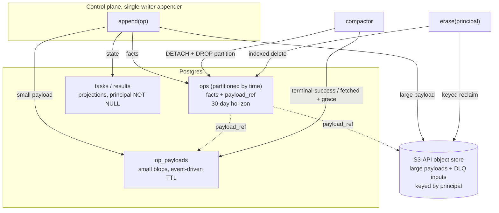

# ADR 019: Op-Log Data Structure, Payload Separation, and Principal-Scoped Erasure

**Author:** jomcgi
**Status:** Draft
**Created:** 2026-07-25
**Builds on:** [002 - Op-Log Retention and Compaction Policy](002-op-log-retention-and-compaction.md) (the retention mechanism this restructures), [007 - Sharded Control Plane, Batched Postgres Op-Log Tier and Cell Architecture](007-sharded-control-plane-pg-oplog-cells.md) (the datastore decision this affirms), [001 - EmberVM, a BEAM Orchestrator for Firecracker Workloads](001-embervm-beam-firecracker-workload-orchestrator.md) (the durable-result contract and the no-cross-principal isolation rule)

---

## Problem

ADR 002 bounded the op-log's growth with a retention policy: result TTLs enforced at read, projections swept hourly, and the ops journal prefix-compacted past a 30-day horizon behind a durable `compacted_through_seq` marker. That policy is correct and remains in force. What it does not address is the **shape** of the data it is retaining, and three structural properties of that shape are now load-bearing.

Reading the live schema (`projects/embervm/control/lib/embervm/op_log/postgres.ex`):

1. **Payloads are inline with facts.** `ops` carries `payload_blob BYTEA NOT NULL` in the same row as `seq`, `ts`, `tenant`, `principal`, `task_id`, and `kind`. There is no way to drop a payload without dropping the op, so the journal's audit and replay value is coupled to the bytes that make it expensive. ADR 002 already identified this as the dominant cost: "the journal, which carries request payloads, dominates."

2. **Compaction is row deletion on the hottest table.** `ops` is a single unpartitioned table keyed `seq BIGSERIAL PRIMARY KEY`, and compaction deletes rows in batches below the marker. On an append-heavy table that is the classic dead-tuple and autovacuum pressure case: the reclaim work scales with what is deleted, and it competes with the append path it is meant to protect.

3. **Principal linkage is optional and unindexed on the journal.** `tasks.principal` is `TEXT NOT NULL`, so the projections are sound. But `ops.principal` is nullable, and the only index on `ops` is `ops_task_id_idx ON ops(task_id)`. Deleting everything belonging to one principal is therefore a sequential scan over the largest table, against a column that is not guaranteed to be populated.

Point 3 is the one that turned this from tuning into a decision. EmberVM is headed for workloads that process personal data, which makes **erasure on demand a functional requirement** rather than a retention nicety. ADR 002's horizon is time-driven: it answers "what is older than 30 days," not "what belongs to this principal" and not "what is no longer needed." Storage-layer encryption does not close the gap either, because a managed Postgres instance is encrypted under one key for the whole instance, so there is no per-principal crypto-shred available to a shared table.

The related question is whether Postgres is still the right store given those operations. ADR 007 already decided the durable tier (batched group-commit Postgres through the op-log seam, CNPG in the homelab, managed Postgres on EKS, SQLite as the zero-dependency single-node default). This ADR revisits that decision against the access pattern rather than assuming it, and affirms it.

---

## Decision

Five decisions.

**1. Separate payloads from facts in the journal.** `ops.payload_blob` becomes `payload_ref`, and the bytes move to a payload store with its own lifecycle: a side table for small payloads, the S3-API object store (ADR 009's configurable backend) for large ones. The journal keeps facts (`seq`, `ts`, `tenant`, `principal`, `workload`, `task_id`, `kind`) for its full 30-day horizon, because facts are what audit, replay, and metering actually consume. A payload reference that resolves to nothing is a valid state, meaning "this op happened and its payload has been reclaimed," which is exactly the semantics erasure needs.

**2. Range-partition `ops` by time.** Compaction stops being a batched `DELETE` and becomes `DETACH PARTITION` plus `DROP TABLE`: constant time, no dead tuples, no vacuum storm, and no competition with the append path. The `compacted_through_seq` marker semantics from ADR 002 are preserved exactly, with one added constraint: a partition may only be dropped when every op in it sits below the marker, so a live task never loses its trail. Partitioning is also the seam that keeps this compatible with ADR 007's cells, since `cell_id` composes with a time-range key without reshaping either.

**3. Payload lifecycle is event-driven, not horizon-driven.** A request payload is dropped when its task reaches terminal-success, because nothing reads it again: retry is only possible while non-terminal, and the durable contract in ADR 001 is about *results*, not inputs. A request payload is retained only for a dead-letter entry, where it is the thing that makes replay possible. A result payload is deleted on fetch plus a short grace window (at-least-once callers re-fetch), with the existing per-row `expires_at` from `resultTtlSeconds` as the backstop for results nobody collects. This drops the typical payload lifetime from days to seconds without weakening any promise the API makes.

**4. Principal linkage is enforced at write time.** `principal` becomes `NOT NULL` on every payload-bearing table including `ops`, with a supporting index on `ops(principal)`. Erasure for a principal becomes an indexed delete over facts plus a keyed reclaim over the payload store, rather than a full scan against a column that might be null. This is the schema-level expression of ADR 001's existing isolation rule that no VM and no snapshot lineage ever crosses a principal.

**5. Postgres stays, and the seam stays the migration path.** The access pattern is a monotonic append, point reads by `task_id`, ordered range scans by `seq` for replay, and bulk prefix reclaim. Partitioned Postgres serves all four well, and the three defects above are properties of the schema rather than of the engine. Managed Postgres (Aurora, Cloud SQL, AlloyDB) is a drop-in for the homelab CNPG deployment with no code change, because `Embervm.OpLog` already dispatches through a backend module (`postgres.ex` and `sqlite.ex` behind `op_log_mod`). That seam, not a rewrite, is how a different engine would ever arrive.

| Aspect | Today | Decided |
| ------ | ----- | ------- |
| Payload storage | `payload_blob BYTEA` inline in `ops` | `payload_ref` to a side table or object store |
| Journal reclaim | batched row `DELETE` below marker | `DETACH` + `DROP` of whole partitions |
| Request payload lifetime | journal horizon (30 days) | dropped at terminal-success; kept only for DLQ |
| Result payload lifetime | `expires_at`, default 24h | deleted on fetch + grace; `expires_at` as backstop |
| `ops.principal` | nullable, unindexed | `NOT NULL`, indexed |
| Erasure by principal | full table scan, linkage not guaranteed | indexed delete + keyed payload reclaim |
| Datastore | Postgres (ADR 007) | Postgres (affirmed), managed via the existing seam |

---

## Architecture

The journal splits into a fact log and a payload store with independent lifecycles. Facts are cheap, ordered, and long-lived; payloads are expensive, unordered, and short-lived.

Reclaim runs on three independent triggers rather than one horizon. Partitions drop when wholly below the compaction marker. Payloads drop on task lifecycle events (terminal-success for requests, fetch-plus-grace for results). Erasure runs on demand for a principal and is the only path that ignores both of the others. Because a dangling `payload_ref` is a legal state, none of the three needs to coordinate with the others.

---

## Alternatives Considered

- **Shorten ADR 002's horizon instead of restructuring.** Rejected: time-driven retention cannot answer an on-demand erasure request, and the effective retention is `max(TTL, backup_retention)` anyway, so backups outlive any horizon short enough to be useful.
- **Keep payloads inline and encrypt per principal.** Rejected: managed Postgres encrypts per instance, not per row, so there is no key to destroy for one principal. Crypto-shredding works for the object store and is retained there; it does not work inside a shared table.
- **Redis (or another in-memory store) with native TTL for payloads.** Rejected: results already carry a per-row `expires_at`, so this buys a TTL primitive the schema has. It costs ADR 001's durability contract ("durable tasks are only half true if the answer evaporates"), risks `maxmemory` eviction dropping live results under pressure, and adds a second stateful system to a design that deliberately chose one. Its persistence files land on disk regardless, so it does not simplify the at-rest story either.
- **DynamoDB.** Rejected as the journal store: native per-item TTL and point reads by `task_id` fit `tasks` and `results` well, but a monotonic `seq` is a single hot partition, and ordered replay is precisely what ADR 002's marker and ADR 007's cell appender depend on.
- **Spanner.** Rejected on cost-to-benefit: ordered keys, strong consistency, and row deletion policies genuinely fit the shape, but with a single-writer appender per cell the system is not write-bound, so it buys horizontal write scale that the architecture cannot currently use.
- **A real log for the journal (Kafka, Kinesis, Pub/Sub) with Postgres projections.** Deferred, not rejected on merit: this is the textbook split for a log-plus-projections design, and the journal genuinely is a log. It costs a second stateful system against ADR 001's single-store choice, and partitioned Postgres captures most of the reclaim benefit at a fraction of the operational surface. Revisit if journal throughput, not journal size, becomes the constraint.
- **Partition by principal rather than by time.** Rejected: it makes erasure trivial but compaction and ordered replay awkward, and it creates unbounded partition count as principals grow. Time partitioning plus a principal index serves both operations without either pathology.

---

## Security

Baseline: `docs/security.md`. Security-relevant properties of this decision:

- **Erasure becomes a supported operation** rather than an emergent property of retention. A principal's facts are removed by an indexed delete, and their payloads by a keyed reclaim in the object store where per-principal keys make deletion effective through backups and replicas.
- **Data minimization by construction.** Request payloads for successful tasks are never retained past the moment they stop being readable by anything, which is the strongest available answer to "why do you still hold this."
- **Principal linkage is a schema invariant**, not a convention. A `NOT NULL` principal on every payload-bearing table means an erasure request cannot silently miss a table, which is the failure mode that makes deletion guarantees hollow.
- **Dangling payload references are deliberate.** Retaining the fact that an operation occurred while its payload is gone preserves the audit trail across an erasure, so deletion does not create a hole that looks like tampering.
- The journal remains the recent audit record per ADR 002, with long-horizon audit delegated to the observability pipeline. Whether that pipeline currently receives payloads is an open question below and is a prerequisite for the erasure guarantee to hold end to end.

---

## Risks

| Risk | Likelihood | Impact | Mitigation |
| ---- | ---------- | ------ | ---------- |
| Partition migration on a live table is disruptive (the existing `ops` is unpartitioned and cannot be converted in place) | High | Medium | Migrate behind the backend seam: create the partitioned table, dual-write, backfill below the marker, cut over, drop the old table. The compaction marker gives a natural low-water mark for the backfill boundary |
| Payload separation adds a second write per op, so an append can now partially fail | Medium | Medium | Write the payload first and the fact second, so a crash leaves an orphan payload (reclaimable) rather than a fact whose payload never existed; orphans are swept by the same compactor |
| DLQ entries retain real inputs indefinitely, becoming the longest-lived copy of the most sensitive data | Medium | High | DLQ payloads go to the object store under a per-principal key with an explicit retention window, so they are both bounded and shreddable |
| `principal NOT NULL` breaks existing writers that do not populate it on `ops` | High | Low | Backfill from `tasks.principal` via `task_id` before applying the constraint; the projections already carry it `NOT NULL` |
| Erasure leaves data in observability spans, backups, or PITR windows outside the op-log | Medium | High | Object-store payloads are per-principal keyed and shreddable; spans need the open question below resolved; backup retention is bounded and documented rather than assumed away |
| Partition granularity chosen badly (too coarse retains too long, too fine multiplies planning cost) | Medium | Low | Start daily against a 30-day horizon (30 live partitions), measure, adjust; granularity is a values change, not a schema change |

---

## Open Questions

1. ~~Does the append emission carry payloads into SigNoz?~~ **Checked, and the answer is favourable.** `OpLog.append/2` is a plain `GenServer.call` with no telemetry or log emission of the op payload, and no payload-carrying emission appears on the append path in the Postgres backend. So spans are not a fourth copy and the erasure guarantee holds end to end. Worth a regression test pinning it, since the property is easy to break by adding a debug log.
2. **Partition granularity and whether `cell_id` belongs in the partition key.** Daily is the proposed start. Composite partitioning by `(cell_id, time)` may be right once more than one cell exists (ADR 007), but may also be premature.
3. **DLQ retention window.** How long a dead-letter entry keeps its input before replay is abandoned, and whether that window is per-workload or global.
4. **Small-payload threshold.** Where the boundary sits between the Postgres side table and the object store, and whether it should track the existing 1 MiB result cap.

---

## References

| Resource | Relevance |
| -------- | --------- |
| [ADR 002 - Op-Log Retention and Compaction Policy](002-op-log-retention-and-compaction.md) | The retention mechanism this restructures; the `compacted_through_seq` marker and the finding that the payload-carrying journal dominates storage |
| [ADR 007 - Sharded Control Plane, Batched Postgres Op-Log Tier](007-sharded-control-plane-pg-oplog-cells.md) | The datastore decision this affirms, and the `cell_id` seam partitioning must stay compatible with |
| [ADR 001 - EmberVM, a BEAM Orchestrator for Firecracker Workloads](001-embervm-beam-firecracker-workload-orchestrator.md) | The durable-result contract, the facts-not-payloads rule, and the no-cross-principal isolation rule this makes a schema invariant |
| [ADR 009 - Roadmap Extension, Continuity Before Tenancy](009-roadmap-extension-continuity-before-tenancy.md) | The configurable S3-API object store the payload tier uses |
| `projects/embervm/control/lib/embervm/op_log/postgres.ex` | The live schema: `ops.payload_blob`, `ops_task_id_idx`, the nullable `ops.principal` |
| `projects/embervm/control/lib/embervm/op_log/compactor.ex` | The sweep loop whose reclaim path this changes from `DELETE` to partition drop |
| `docs/security.md` | Security baseline |
