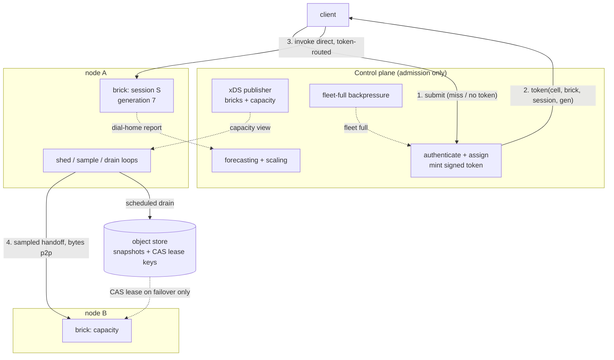

# ADR 020: Admission-Only Control Plane, Token Routing, and Peer Redistribution

**Author:** jomcgi
**Status:** Draft
**Created:** 2026-07-25
**Supersedes in part:** [016 - Kubernetes Scheduling Integration Contract](016-kubernetes-scheduling-integration-contract.md) (the CP-owned VM-to-brick filter/score/bind loop)
**Builds on:** [001](001-embervm-beam-firecracker-workload-orchestrator.md) (hit/miss invariant, per-session endpoint tokens, facts-not-payloads), [011](011-distribution-longhorn-fencing-cp-rollouts.md) (attach exclusivity, generation blessing), [014](014-worker-authoritative-state-hot-path-consistency.md) (worker-authoritative state, advisory placement), [015](015-isolated-high-throughput-lane-data-plane-placement.md) (data-plane placement, per-brick quota leases)

---

## Problem

EmberVM's control plane is on more paths than its own invariants intend. ADR 001 keeps it off the steady-state hit path, and ADR 014 moved durable writes off boot and wake, but three couplings remain, and each of them becomes a wall somewhere between 10k and 1M managed sandboxes:

1. **Metering is a synchronous durable write per dispatch.** ADR 014 carved this out explicitly when it moved other writes off the hot path. That is an O(sandboxes) database write, which is the first wall the Modal scaling work ADR 007 already cites names by that description.
2. **Placement is a central filter/score/bind loop.** ADR 016 gives the CP VM-to-brick placement over a per-brick ledger. A centralized scheduler doing per-placement scoring is the kube-scheduler throughput problem, and ADR 015 already had to route around it for one lane.
3. **Redistribution under memory pressure has no shed path at all.** `noded/server/pressure.go` implements the refuse half (an O(1) `admitOrReject` returning `RESOURCE_EXHAUSTED` with `pressure:mem`), which stops things getting worse. Nothing sheds live VMs to reclaim memory, so a node under pressure has no way back.

Underneath all three is one unresolved question: **how does a request reach the brick that holds its session's state?** A session is mutable state with an owner, so this is not the stateless load-balancing problem the serving lane solves. It resembles the KV-cache routing problem in LLM serving (route to the worker holding the state, or pay to reconstruct it), with one difference that looks fatal: a prefix cache is recomputable and unowned, whereas routing a session to the wrong brick risks two live VMs diverging.

That difference turns out to be the crux, and resolving it is what lets everything else decentralize.

---

## Decision

Six decisions.

**1. The control plane is an admission controller, not a scheduler.** Its request-path job is: authenticate the caller, assign an endpoint, return. Everything after that is data plane. The CP's standing responsibilities reduce to forecasting and scaling, publishing xDS, and fleet-level backpressure. It is not on the request path, the pressure path, or the recovery path.

**2. Tokens route sessions; xDS advertises capacity.** ADR 001 already specifies "short-lived per-session endpoint tokens" gating who may reach a session. We make the token carry the routing decision: a signed, short-lived token over `(cell, brick, session, generation, expiry)`. The client holds its own routing information, so the hit path needs no directory lookup and no global state. xDS continues to advertise **bricks** (thousands) and now also **capacity**, never sessions (millions). This split is what keeps xDS at fleet cardinality instead of sandbox cardinality, which is the difference between the design working at 1M and not.

**3. Ownership is arbitrated by the storage layer, not by the control plane.** ADR 011 makes the CP the sole issuer of generation blessing. We narrow that to the case that actually needs an arbiter:

- **Handoff (owner-initiated)** needs no arbitration at all. The owner stops, snapshots, transfers, and the receiver starts. Relinquishing *is* the serialization, and a stopped owner cannot hand off twice. This is the common case under pressure, and it reports after the fact.
- **Failover onto a Longhorn volume** is already fenced by attach exclusivity (ADR 011). Storage arbitrates.
- **Failover from an object-store memory snapshot** is the only unfenced case: two nodes can both `GET` the same artifact and boot it. This is closed with a compare-and-swap lease key in the object store (put-if-absent), keeping arbitration in the storage layer and out of the CP.

Generation stays in the token, but as a **staleness check** rather than a permission: it is what makes a stale route detectably stale instead of silently wrong.

**4. Redistribution is peer-to-peer, sampled rather than broadcast.** A node under pressure picks two or three candidates from the xDS capacity view and asks them directly; the best answer wins. Power-of-two-choices, not broadcast: pressure is correlated, so a broadcast protocol produces its worst message storm exactly when the fleet is most degraded. Candidates decrement capacity at **accept**, not at transfer completion, under a short reservation TTL, so two pressured nodes cannot cascade the same target. Bytes move peer-to-peer; the CP learns about it from the existing dial-home report.

**5. Pressure response is three loops at three timescales, and only the slowest talks to the CP.**

| Loop | Trigger | Actor | Budget | Nature |
| ---- | ------- | ----- | ------ | ------ |
| Shed | memory below floor | node, autonomously | must beat the OOM killer | safety |
| Redistribute | sustained pressure | node to node, sampled | seconds | correction |
| Drain to object store | **scheduled low watermark** | node, background | minutes | prevention |

The node sheds locally without asking. If shedding required a CP round trip, the CP would be on the availability path for out-of-memory, which is precisely the coupling ADR 001's hit/miss invariant exists to avoid.

The drain loop is scheduled rather than pressure-triggered for a specific reason. `/var/lib/embervm/scratch` is capped at 35 GiB per node so a warmth leak cannot starve root and etcd. That cap is correct and it creates a wedge: under sustained memory pressure the node banks until scratch fills, at which point **banking itself fails** and there is no relief valve left. A reactive drain arrives exactly when there is no room to write the thing being drained, so the object-store evacuation must run ahead of need, on a low watermark, not on a signal.

**6. Metering comes off the hot path via generalized quota leases.** ADR 015 already introduced per-brick quota leases renewed on the dial-home cadence for the isolated lane. That becomes the mechanism for every lane: the hot path debits a local lease, the durable write is amortized into the report. Enforcement stays fail-closed, but the unit becomes the lease grant rather than the request, so a principal at quota zero is stopped at grant. The accepted cost is bounded overspend within one lease on a crash, which is the trade every platform at this scale makes.

| Aspect | Today | Decided |
| ------ | ----- | ------- |
| CP on request path | admission + placement + metering write | admission only |
| Session routing | CP resolves placement | signed token carries `(cell, brick, session, generation)` |
| xDS cardinality | endpoints | bricks + capacity, never sessions |
| Ownership arbiter | CP-issued generation blessing | storage layer (attach exclusivity / object-store CAS) |
| Redistribution | not implemented | peer-to-peer, sampled, capacity from xDS |
| Memory pressure | refuse new boots (`pressure:mem`) | refuse **and** shed, node-local |
| Object-store drain | on demand | scheduled, ahead of the scratch cap |
| Metering | synchronous durable write per dispatch | local lease debit, amortized report |

---

## Architecture

The hot path is step 3 alone: client to brick, no control plane. Steps 1 and 2 happen on a token miss (first request, expiry, redistribution, brick loss), which is ADR 001's hit/miss invariant applied to routing rather than to invocation.

For the durable posture (ADR 016's preemptible versus durable split), a session resolves to a **copy set** rather than a single brick, and the assignment picks among copies. Choosing among N bricks that each hold a copy is a pure locality-versus-load decision with no correctness stake, which is where the KV-cache routing analogy holds exactly. The preemptible posture resolves to a single candidate and skips the copy-set machinery entirely, so replication cost is paid only by workloads that asked for it.

---

## Alternatives Considered

- **Keep CP-owned filter/score/bind placement (ADR 016 as written).** Rejected at scale: a central scheduler scoring every placement is a throughput ceiling, and ADR 015 already had to route around it for the isolated lane. Retained conceptually for capacity *planning*, which is a slow loop.
- **Session endpoints in xDS.** Rejected: 1M session-scoped resources is a config-cardinality problem no amount of delta xDS makes comfortable. Tokens move the routing state to the client, where it costs nothing.
- **A global session directory consulted on every request.** Rejected: reintroduces a hot-path lookup and a scaling bottleneck to solve a problem the token already solves. The directory survives only for the miss path.
- **CP-issued generation blessing before every ownership change.** Rejected as over-broad: it puts a control-plane RPC on the common handoff path, where the owner's relinquish already serializes, and on the Longhorn failover path, where attach exclusivity already fences. Narrowed to the one genuinely unfenced case, and even there a storage-layer CAS is preferred over a CP call because it works during a CP outage.
- **Broadcast-based capacity discovery.** Rejected: O(N) per pressure event, and pressure is correlated, so the storm peaks when the fleet is least able to absorb it. Sampling from an xDS capacity view is constant-message and reuses machinery that exists.
- **Pressure-triggered object-store drain.** Rejected: it fires when scratch is already full, which is when writing the drained artifact is least possible. Scheduled low-watermark drain instead.
- **Node asks the CP before shedding.** Rejected: puts the CP on the OOM path.
- **Active-active session replication (two live VMs).** Rejected: requires lockstep or deterministic replay, which Firecracker does not provide. HA here means primary plus passive copies, and that is what the copy set models.

---

## Security

Baseline: `docs/security.md`. Security-relevant properties:

- **The token is a bearer credential for a session's compute.** It must be signed by the CP, short-lived, and scoped to one session; revocation is by expiry, not by a revocation list, so the expiry window is the security parameter. This extends ADR 001's existing per-session endpoint tokens rather than introducing a new credential class.
- **Generation in the token prevents stale-copy execution.** With a copy set, copies can be stale relative to one another, so generation is what stops a relight of an older copy silently losing committed work. It is a correctness control with a security consequence: without it, a replayed old token could route work onto superseded state.
- **Ownership arbitration moves to the storage layer**, which is a smaller and better-tested trust surface than a control-plane RPC, and it keeps working during a CP outage. ADR 011's quarantine of unblessed artifacts is retained as the fail-closed default.
- **Peer-to-peer handoff means nodes accept bytes from other nodes.** The transfer channel needs mutual authentication between nodes; a node must not accept a snapshot from an unauthenticated peer, or snapshot injection becomes a guest-escape-equivalent primitive.
- **Eviction is a cross-tenant surface.** ADR 001 has per-tenant fair queues for admission; shedding needs the same property or a noisy principal evicts another's sessions by being greedy. Eviction fairness is a tenancy control, not just a performance one.
- The isolation rule from ADR 001 (no VM and no snapshot lineage crosses a principal) is unchanged and constrains which bricks may appear in a copy set.

---

## Risks

| Risk | Likelihood | Impact | Mitigation |
| ---- | ---------- | ------ | ---------- |
| Bounded divergence: a partitioned node keeps executing a session recovered elsewhere | Medium | Medium | Token routing means the partitioned node receives no new requests, so divergence is bounded to work in flight at partition time; the object-store CAS prevents the recovery itself from racing. Candidate for the ADR 006 TLA+ pilot, which already models the bank/relight lineage |
| Node holds transferred bytes it is not yet the owner of | Medium | High | Unblessed or unleased copies are not routable (ADR 011 quarantine, retained); ownership transfers only on relinquish or CAS |
| Shed storm followed by relight stampede on the same IO | Medium | Medium | Rate-limit relight admission; the existing `embervm-group-fresh-boot` alert is the detection signal |
| Sampled placement repeatedly picks a saturating target | Medium | Low | Capacity decremented at accept under a reservation TTL, not at transfer completion |
| Quota lease grants overspend on crash | High | Low | Lease size is the overspend bound; size it against the metering granularity the billing contract promises |
| Eviction policy (LRU by `idleBankSeconds`) evicts a session about to be used | Medium | Medium | Cost-aware objective (`cost(bank) + P(wake) x cost(relight)`) rather than pure recency; same calculus as cache eviction under memory pressure |
| Token expiry window too long (stale routing) or too short (admission load) | Medium | Medium | Tune against redistribution rate; a token is cheap to re-mint because admission holds no durable write |
| Scheduled drain competes with foreground IO | Medium | Low | Low watermark plus a bandwidth cap; the whole point is that it runs when there is slack |

---

## Open Questions

1. **Token expiry window**, and whether redistribution should actively invalidate tokens or rely on the brick rejecting a stale generation. Passive rejection is simpler and needs no revocation channel.
2. **Copy-set sizing for the durable posture.** Three copies at ~100 MB dirty per session is ~300 TB at 1M sessions plus pre-warm bandwidth, so the replication factor is a cost decision, not a default.
3. **Whether the miss-path directory lives in the op-log or is derived from dial-home reports.** ADR 014 made reports authoritative for runtime state, which argues for derived; durability across a full CP restart argues for the op-log.
4. **Cell assignment for a new session**: hash-based (`hash(session_id) -> cell`, rendezvous or bounded-load so a cell change reshuffles minimally) versus explicit assignment recorded at admission.
5. **Node-to-node transfer authentication**, and whether it reuses the existing dial-home identity or needs its own.
6. **Eviction fairness mechanism**: per-principal quotas on shed victims, or a fair-share victim selector.

---

## References

| Resource | Relevance |
| -------- | --------- |
| [ADR 001](001-embervm-beam-firecracker-workload-orchestrator.md) | Hit/miss invariant, per-session endpoint tokens, facts-not-payloads, per-tenant fair queues, the isolation rule |
| [ADR 011](011-distribution-longhorn-fencing-cp-rollouts.md) | Attach exclusivity as physical fence, generation blessing and quarantine, "placement is a copy, never a rebuild" |
| [ADR 014](014-worker-authoritative-state-hot-path-consistency.md) | Worker-authoritative state, advisory reject/retry placement, the metering carve-out this closes |
| [ADR 015](015-isolated-high-throughput-lane-data-plane-placement.md) | Data-plane placement precedent, per-brick quota leases generalized here |
| [ADR 016](016-kubernetes-scheduling-integration-contract.md) | The CP-owned placement loop partially superseded; preemptible vs durable postures the copy set follows |
| [ADR 007](007-sharded-control-plane-pg-oplog-cells.md) | Cells as the bounding unit; the Modal reference naming O(sandboxes) DB writes as the first wall |
| [ADR 009](009-roadmap-extension-continuity-before-tenancy.md) | R6 continuity and the object-store resume window that creates the unfenced failover case |
| `projects/embervm/noded/server/pressure.go` | The existing refuse-half predicate this adds a shed half to |
| `docs/runbooks/embervm-node-scratch-setup.md` | The 35 GiB scratch cap that makes the drain loop scheduled rather than reactive |
| `docs/security.md` | Security baseline |
