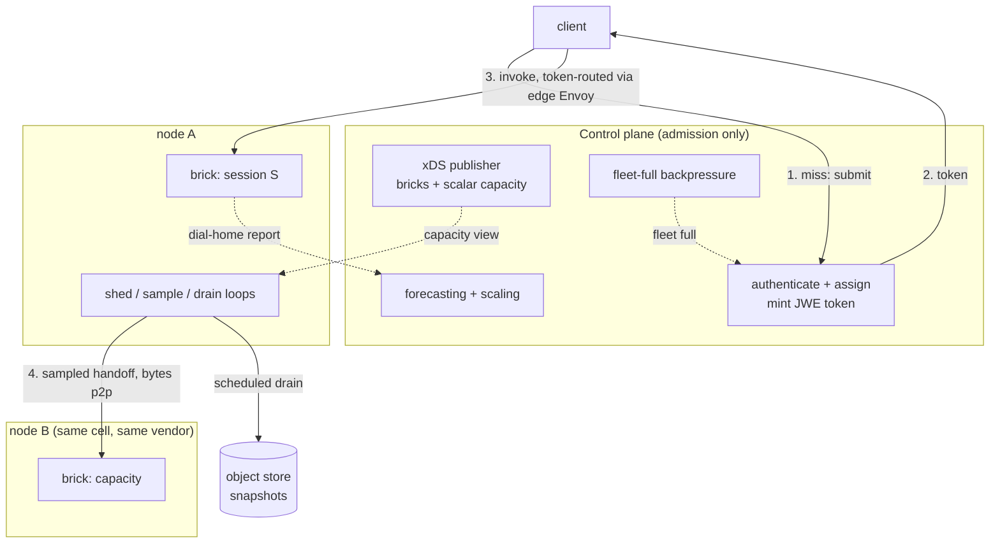

# ADR 020: Admission-Only Control Plane, Token Routing, and Peer Redistribution

**Author:** jomcgi
**Status:** Draft
**Supersedes in part:** [016 - Kubernetes Scheduling Integration Contract](016-kubernetes-scheduling-integration-contract.md) (the CP-owned VM-to-brick filter/score/bind loop)
**Created:** 2026-07-25
**Builds on:** [001](001-embervm-beam-firecracker-workload-orchestrator.md) (hit/miss invariant, per-session endpoint tokens, facts-not-payloads), [011](011-distribution-longhorn-fencing-cp-rollouts.md) (attach exclusivity, generation blessing, vendor pinning), [014](014-worker-authoritative-state-hot-path-consistency.md) (worker-authoritative state, advisory placement), [015](015-isolated-high-throughput-lane-data-plane-placement.md) (data-plane placement, per-brick quota leases), [017](017-checkpoint-abort-quarantine-auto-heal.md) and [018](018-node-local-activator-brick-authoritative-lifecycle.md) (the grant/adjudicator model that already rewrote generation blessing), [021](021-workload-resource-model-memory-pivot.md) (the scalar capacity this publishes)

---

## Problem

EmberVM's control plane is on more paths than its own invariants intend. ADR 001 keeps it off the steady-state hit path, and ADR 014 moved durable writes off boot and wake, but three couplings remain, and each becomes a wall somewhere between 10k and 1M managed sandboxes:

1. **Metering is a synchronous durable write per dispatch.** ADR 014 carved this out explicitly when it moved other writes off the hot path. ADR 007's group commit already amortises the fsync, so this is a per-dispatch *round trip* rather than a per-dispatch fsync, but it is still O(sandboxes) work the control plane must witness.
2. **Placement is a central filter/score/bind loop.** ADR 016 gives the CP VM-to-brick placement over a per-brick ledger. A centralised scheduler scoring every placement is the kube-scheduler throughput problem, and ADR 015 already had to route around it for one lane.
3. **There is no pressure-triggered, node-local shed path.** `noded/server/pressure.go` implements the refuse half (an O(1) `admitOrReject` returning `RESOURCE_EXHAUSTED` with `pressure:mem` or `pressure:taps`), which stops things getting worse. Memory *is* reclaimed today by CP-side idle-bank sweeps and by ADR 009's R6 force-bank drain, and disk by `EvictArtifact`; what is missing is a node deciding for itself, at pressure, without a control-plane round trip.

Underneath all three is one unresolved question: **how does a request reach the brick that holds its session's state?** A session is mutable state with an owner, so this is not the stateless load-balancing problem the serving lane solves. It resembles KV-cache routing in LLM serving (route to the worker holding the state, or pay to reconstruct it) with one apparently fatal difference: a prefix cache is recomputable and unowned, whereas routing a session to the wrong brick risks two live VMs diverging.

---

## Decision

Six decisions. **Decision 3 is withdrawn** to [ADR 023](023-class-scoped-ownership-arbitration.md); see the notice on it.

**1. The control plane is an admission controller, not a per-dispatch scheduler, and assignment is precomputed rather than resolved per miss.** The CP forecasts demand, assigns workloads to bricks ahead of time, and scales the brick pool; bricks then handle arrivals locally (ADR 018's node-local activator already does this half). So **CP work scales with the rate of assignment change**, which is forecast cadence, not with miss rate. Its request-path job on a tokenless arrival is a cheap lookup of a precomputed assignment plus a signature, never a placement computation. Its standing responsibilities reduce to forecasting and scaling, publishing xDS, and fleet-level backpressure. Note the precise claim: the CP still owns assignment, so it remains a placement engine. What changes is *when* it computes: at forecast cadence rather than per arrival, with the decision advisory (ADR 014) rather than authoritative because the brick's `admitOrReject` arbitrates. A tokenless arrival costs a lookup and a signature, not a placement.

**1b. The redistribution and placement objective is high active brick utilization, provisionally >90%.** Forecasting exists to achieve it: colocating workloads with complementary traffic patterns onto the same brick, informed by predicted demand. This is compatible with ADR 016's pack-to-empty rather than in tension with it, because packing for utilization is exactly what empties other bricks and lets the pool shrink. Utilization is the objective, pack-to-empty is the mechanism.

**The 90% figure is a target chosen by analogy, not derived, and this states it rather than hiding it** (the same treatment ADR 021 gives its pivot). It drives forecast cadence and pool sizing, so it should be validated against measured wake-burst headroom before it is relied on. What would move it: memory is the fail-closed incompressible dimension (ADR 021), so utilization above ~90% leaves under a tenth of a brick free for the wake bursts a scale-to-zero fleet generates, which raises shed-ladder frequency. If shed events become common at 90%, the number is too high.

**2. Tokens route sessions; xDS advertises capacity.** ADR 001 already specifies "short-lived per-session endpoint tokens" gating who may reach a session. The token carries the routing decision over `(cell, brick, session, generation, expiry)`, and it is **encrypted, not merely signed** (JWE rather than JWS). AWS Lambda MicroVMs uses "a dedicated URL and JWE-based authentication" for the same job, and the reason is sound: a signed-only token exposes internal topology to the client, handing an attacker the brick namespace for free. Encryption costs nothing extra at the edge, which already holds the key. The client holds its own routing information, so the hit path needs no directory lookup. xDS continues to advertise **bricks** (thousands) and now also **capacity**, never sessions (millions), keeping config at fleet cardinality rather than sandbox cardinality. Per ADR 021 that capacity is a scalar, so the comparison in decision 4 is unambiguous.

Because the token names the brick, **xDS never carries the workload-to-brick mapping** and stays at O(bricks) regardless of workload count. Cardinality only becomes a question on the *tokenless* path, and only if it must be answered without the CP; note that forecast-driven placement rules out deriving the target by hashing, since assignment is deliberate. The mapping therefore lives in three small places rather than one large one: the CP holds the authoritative table it computed, each brick knows only its own assignments, and an arrival a brick does not recognise falls back to the CP. No global map exists anywhere.

Sampling, capacity, and copy sets are **cell-scoped** (ADR 007) and **vendor-scoped** (ADR 011 pins sessions to a CPU vendor). The generation field's meaning is settled by [ADR 023](023-class-scoped-ownership-arbitration.md): for sessions it is a staleness signal carried in the token, not a grant-backed exclusion primitive.

**3. (WITHDRAWN, superseded by [ADR 023](023-class-scoped-ownership-arbitration.md)) Ownership arbitration.** This ADR originally decided that ownership moves from CP-issued generation blessing to the storage layer: owner-initiated handoff self-serialising on relinquish, Longhorn failover fenced by attach exclusivity, and object-store failover closed by a put-if-absent CAS. **Two independent reviews found that unsound.** ADR 023 withdraws rather than replaces it: the question was asked at the wrong granularity. Under ADR 025 stateful needs no arbitration at all, while the session and composite classes each lack a fence in different ways. The five failure modes are retained below as the record of why:

- *Handoff has no commit point.* Relinquish is a local state change plus a transfer plus a remote start, and each gap is a hole: receiver accepts then dies before boot; a lost ack plus retry against a second sampled peer; the old owner relighting its own local banked copy, which is the platform's normal behaviour.
- *The premise misreads ADR 011.* ADR 011 says the CP arbitrates and the fence enforces, "deciding is not enforcing." Attach exclusivity is preemptive last-writer-wins, designed to fence a loser *after* a serialised election. Without the election, any node that merely suspects the owner is dead can attach and sever a healthy workload.
- *The copy set creates a second unfenced case.* Two copy-set bricks can relight from **local disk** with no object-store GET and therefore no CAS, so "object-store failover is the only unfenced case" is false under this ADR's own design.
- *The CAS has no liveness or fencing story.* A holder that dies holding the key wedges the session; a TTL reopens the race; and nothing revalidates the lease after boot, so a slow winner that lost it keeps executing.
- *It is written against a superseded invariant.* ADR 011's 2026-07-23 amendment and ADR 018 already delegate generation advancement to the anchor brick under a renewable grant, with the CP as sole **adjudicator** (forward-only watermark, quarantine on any advancement no grant covers). Under that standing rule, a handoff that "reports after the fact" would be quarantined on sight, so the common-case pressure path fails closed.

Ownership is settled in [ADR 023](023-class-scoped-ownership-arbitration.md), which makes arbitration class-scoped: stateful keeps its existing fence (with file-tier moves forbidden until it has a real one), and the session and composite classes accept bounded divergence with a durable relinquish record as the handoff commit point. Decisions 2, 4 and 5 take their staleness semantics from there, and decision 5's claim below is corrected by it.

**4. Redistribution is peer-to-peer, sampled rather than broadcast.** A node under pressure picks two or three candidates from the xDS capacity view and asks them directly. Power-of-two-choices, not broadcast: pressure is correlated, so a broadcast protocol produces its worst message storm exactly when the fleet is most degraded. Candidates decrement capacity at **accept** under a short reservation TTL, and an inbound acceptance runs the same `admitOrReject` predicate, so two pressured nodes cannot swap sheds in a livelock. Bytes move peer-to-peer; the CP learns from the existing dial-home report.

Candidates must be filtered by cell and by CPU vendor. On the current fleet (one AMD warm node) a pressured node-4 has no valid session peer, so this decision is a scale-out mechanism, not a homelab one.

**5. Pressure response is three loops at three timescales.** Shed and drain are node-autonomous and need no control-plane round trip; the CP learns of them from the existing dial-home report, after the fact. **Redistribution is the exception**, corrected by [ADR 023](023-class-scoped-ownership-arbitration.md): a handoff advances a generation, and ADR 018 quarantines any advancement no live grant covers, so the grant claim is one small control-plane call. Bytes still move peer-to-peer; only the claim is central.

| Loop | Trigger | Actor | Budget | Nature |
| ---- | ------- | ----- | ------ | ------ |
| Shed | memory below floor | node, autonomously | must beat the OOM killer | safety |
| Redistribute | sustained pressure | node to node, sampled | seconds | correction |
| Drain to object store | low watermark, background | node | minutes | prevention |

The node sheds without asking, because requiring a CP round trip would put the control plane on the availability path for out-of-memory.

**The shed ladder is ordered by cost, and only its first two rungs beat an OOM killer.** Writing multi-GiB of dirty pages to disk takes seconds that a memory emergency does not have, so shed-by-banking is a correction, not a safety response:

1. **Destroy preemptible-posture VMs** (ADR 016: nothing is lost by dying between requests). Frees memory immediately, no write.
2. **Evict already-exported artifacts** (`EvictArtifact`, guarded by ADR 009's export reconcile). Frees scratch immediately, no write.
3. **Bank durable sessions.** Frees memory, consumes scratch.
4. **Refuse** (`admitOrReject`).

Scratch needs its own admission predicate. `pressure.go` has `pressure:mem` and `pressure:taps` but nothing for disk, and redistribution consumes scratch on **both** ends, so a `pressure:scratch` reason is required before decision 4 can be safe.

The drain runs on a low watermark rather than on a pressure signal, because `/var/lib/embervm/scratch` is capped (35 GiB on the masters' loop file; node-4 has a dedicated NVMe) so a reactive drain fires exactly when there is no room to write what it is draining. This makes the wedge rarer, **not impossible**: sustained bank inflow can still outrun drain bandwidth, which is why rungs 1 and 2 above must precede banking.

**6. Metering comes off the hot path, and it is fail-open by design.** ADR 015's per-brick leases, renewed on the dial-home cadence, become the mechanism for every lane: the hot path debits a local lease and the durable write is amortised into the report. Per ADR 021 the unit is GB-seconds of allocated memory, derivable from lifecycle transitions.

**The lease is a counter, not a gate.** This ADR previously said enforcement stays fail-closed for every lane, which contradicted ADR 018 Fork B (fail-open, reconcile-time) and the `meteringFailOpen: true` that ships today on two workloads. That contradiction is resolved in Fork B's favour, and the reason is what metering is *for*: **allocating running costs within an organisation, not charging customers.** There is no adversary trying to steal compute from itself, so an unverifiable quota is an accounting inconvenience rather than a loss, and refusing to run a workload to protect an internal showback number is the wrong trade. A control-plane outage must never stop work, which is the whole thesis of ADR 018's node-local activator.

So: a brick out of contact keeps running and keeps counting, without bound. Unreconciled spend is reconciled on reconnect or written off, and the exposure shrinks on its own as the control plane becomes highly available. This also promotes `meteringFailOpen` from an allowlisted exception to the default, retiring the flag rather than extending it.

**Cutting off a non-paying principal is an admission action, not a metering one.** If credits run out, the control plane suspends the principal and simply stops minting tokens for it. Nothing new is required, because suspension is the *absence* of a grant:

- new arrivals get no token and receive `402 Payment Required` at the edge
- live sessions run until their token lapses or their brick's silence timeout fires, then stop
- banked workloads never relight, because waking needs a token the control plane declines to issue

On a scale-to-zero fleet that is mostly self-enforcing, and it is deliberately graceful: a credit cutoff is a business event, not an emergency, so paced by token expiry is the right speed. It also inherits the fail-open property, since a suspended principal keeps running through a control-plane outage until their tokens lapse, which is acceptable for the same reason unbounded metering is.

**Abuse is the other speed.** A principal actively harming the fleet must not wait for token expiry, and does not: concurrency caps, fair queues and the node-side pressure predicate act immediately and independently. Two cutoff speeds for two different problems, mirroring the metering-versus-enforcement split above.

**Containment is a separate mechanism and is unchanged.** ADR 001's "resource abuse is a security concern" is served by per-workload concurrency caps, per-tenant fair queues, admission control, and the node-side pressure predicate. None of those depend on metering posture, so making metering fail-open costs no containment. That distinction is the thing to keep: enforcement stops a runaway, metering counts what happened, and only the first needs to fail closed.

| Aspect | Today | Decided |
| ------ | ----- | ------- |
| CP on request path | admission + placement + metering round trip | admission only, at miss rate |
| Session routing | CP resolves placement | encrypted (JWE) token carries `(cell, brick, session, generation)` |
| xDS cardinality | endpoints | bricks + scalar capacity, never sessions |
| Ownership arbiter | ADR 018 grant + CP adjudication | class-scoped, [ADR 023](023-class-scoped-ownership-arbitration.md) |
| Redistribution | not implemented | peer-to-peer, sampled, cell- and vendor-scoped |
| Memory pressure | refuse new boots | refuse **and** shed, node-local, ordered ladder |
| Scratch pressure | no predicate | `pressure:scratch` + scheduled drain |
| Metering | per-dispatch durable round trip, fail-closed | local lease debit, amortised report, **fail-open** |

---

## Architecture

The hot path is step 3 alone. Steps 1 and 2 happen on a token miss (first request, expiry, redistribution, brick loss), which is ADR 001's hit/miss invariant applied to routing rather than to invocation.

Step 3 still traverses the **edge Envoy**, not a raw client-to-brick socket: ADR 001's data plane provides health-based ejection, the two-tier layout, and per-request observability, and none of that is given up here. Envoy is where the token is decrypted and verified, so a client cannot name an arbitrary brick and probe it.

For the durable posture (ADR 016's preemptible versus durable split), a session resolves to a **copy set** rather than a single brick. Choosing among copies is a locality-versus-load decision only once decision 3 establishes which copies are current; until then, treating the choice as correctness-free is unsafe.

---

## Alternatives Considered

- **Keep CP-owned filter/score/bind placement at dispatch rate (ADR 016 as written).** Rejected at scale: a central scheduler scoring every placement is a throughput ceiling, and ADR 015 already routed around it for the isolated lane. Retained for capacity *planning*, a slow loop.
- **Session endpoints in xDS.** Rejected: a million session-scoped resources is a config-cardinality problem no amount of delta xDS makes comfortable.
- **A global session directory consulted on every request.** Rejected: reintroduces a hot-path lookup to solve what the token solves. Retained for the miss path only.
- **Broadcast-based capacity discovery.** Rejected: O(N) per pressure event, and pressure is correlated, so the storm peaks when the fleet is least able to absorb it.
- **Pressure-triggered object-store drain.** Rejected: fires when scratch is already full. Scheduled low-watermark drain instead, behind the shed ladder.
- **Node asks the CP before shedding.** Rejected: puts the CP on the OOM path.
- **Active-active session replication (two live VMs).** Rejected: requires lockstep or deterministic replay, which Firecracker does not provide. HA here is primary plus passive copies.

---

## Security

Baseline: `docs/security.md`.

- **The token is a bearer credential for a session's compute**, encrypted and signed by the CP, short-lived, scoped to one session, verified at the edge. Revocation is by expiry, and because the divergence bound moved to the brick (ADR 023 3b) the expiry window is a convenience parameter rather than a correctness one. Signing-key distribution and rotation are unresolved (Open Questions).
- **The brick silence timeout is the correctness parameter**, not token TTL (ADR 023 decision 3b).
- **Peer handoff means nodes accept snapshots from other nodes**, so the transfer channel needs mutual authentication; an unauthenticated snapshot accept would be a guest-escape-equivalent primitive.
- **Eviction is a cross-tenant surface.** ADR 001 has per-tenant fair queues for admission; the shed ladder needs the same property or a greedy principal evicts another's sessions.
- ADR 001's isolation rule (no VM or snapshot lineage crosses a principal) is unchanged and constrains copy-set membership, as does ADR 011's vendor pinning.

---

## Risks

| Risk | Likelihood | Impact | Mitigation |
| ---- | ---------- | ------ | ---------- |
| A brick partitioned from the control plane keeps serving stale state to clients that still hold valid tokens | Medium | Medium | Bounded by the brick silence timeout ([ADR 023](023-class-scoped-ownership-arbitration.md) decision 3b), sized in ADR 018's grant-expiry range so a CP roll never trips it |
| Redistribution scoring is spread, defeating ADR 016's pack-to-empty and therefore consolidation and EmberPool shrink | Medium | High | Unresolved: the redistribution objective must be stated against 016's reclaim chain, not left as "best answer wins" |
| Shed storm followed by relight stampede on the same IO | Medium | Medium | Rate-limit relight admission; `embervm-group-fresh-boot` is the detection signal |
| Sustained bank inflow outruns drain bandwidth and fills scratch | Medium | High | Ladder rungs 1-2 free space without writing; `pressure:scratch` refuses before the wedge |
| Vendor pinning leaves a pressured node with no valid peer | High (today) | Medium | Documented: decision 4 is a scale-out mechanism; on a single-vendor-warm fleet the shed ladder is the only relief |
| Quota lease grants overspend on crash | High | Low | Lease size is the bound; size against the billing granularity promised |

---

## Open Questions

1. ~~All of decision 3.~~ Answered by [ADR 023](023-class-scoped-ownership-arbitration.md), which withdraws rather than replaces it. Remaining there: whether grants are extended to the session class, and the file-tier stateful fence.
2. ~~Token TTL versus admission as the availability floor.~~ **Dissolved by [ADR 023](023-class-scoped-ownership-arbitration.md) decision 3b**: the divergence bound is the brick silence timeout, not token expiry, so TTL may match session life and there is no availability floor to trade against. Remaining: the numeric silence timeout.
3. ~~The redistribution objective.~~ **Decided: high active brick utilization** (provisionally >90%, see decision 1b) via forecast-driven colocation (decision 1b), with pack-to-empty as the mechanism that makes it reclaimable.
4. **Signing-key distribution, rotation, and verification point** for a bearer credential with no revocation list.
5. **Miss-path directory staleness.** Between handoff and dial-home, admission can re-mint a token for the stale brick in a loop; needs a forward hint from the old brick or activator-style parking.
6. ~~Copy-set sizing.~~ Copy sets are deferred entirely (see [ADR 023](023-class-scoped-ownership-arbitration.md)).
7. ~~Metering reconciliation between fail-closed leases and ADR 018 Fork B.~~ **Resolved in Fork B's favour** (decision 6): metering is internal cost allocation, so it fails open and unreconciled spend is written off. Remaining: whether ADR 007's rejection of "no store in the creation critical path" needs an explicit amendment note, since this reverses it for the metering write specifically.

---

## References

| Resource | Relevance |
| -------- | --------- |
| [ADR 001](001-embervm-beam-firecracker-workload-orchestrator.md) | Hit/miss invariant, per-session endpoint tokens, the Envoy data plane, per-tenant fair queues, the isolation rule |
| [ADR 011](011-distribution-longhorn-fencing-cp-rollouts.md) | Attach exclusivity as fence, "deciding is not enforcing", vendor pinning, and the 2026-07-23 amendment on grants |
| [ADR 017](017-checkpoint-abort-quarantine-auto-heal.md) / [ADR 018](018-node-local-activator-brick-authoritative-lifecycle.md) | The grant/adjudicator model and the quarantine rule decision 3 must extend rather than rewrite |
| [ADR 014](014-worker-authoritative-state-hot-path-consistency.md) | Worker-authoritative state, advisory reject/retry, the metering carve-out |
| [ADR 015](015-isolated-high-throughput-lane-data-plane-placement.md) | Data-plane placement precedent; the quota leases generalised here |
| [ADR 016](016-kubernetes-scheduling-integration-contract.md) | The placement loop partially superseded; pack-to-empty; the preemptible/durable postures |
| [ADR 007](007-sharded-control-plane-pg-oplog-cells.md) | Cells as the scoping unit; group commit; the creation-critical-path rejection decision 6 reverses |
| [ADR 009](009-roadmap-extension-continuity-before-tenancy.md) | The object-store seam and the R6 force-bank drain |
| [ADR 021](021-workload-resource-model-memory-pivot.md) | Scalar capacity and the GB-seconds unit the leases carry |
| `projects/embervm/noded/server/pressure.go` | `admitOrReject`, `pressure:mem`, `pressure:taps`; the missing `pressure:scratch` |
| `docs/runbooks/embervm-node-scratch-setup.md` | The scratch cap behind the drain loop |
| `docs/security.md` | Security baseline |
