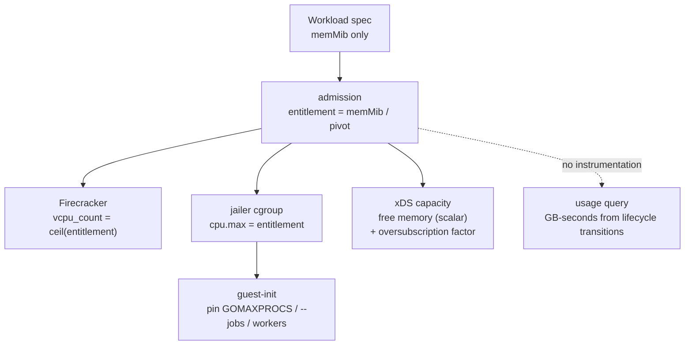

# ADR 021: Workload Resource Model, Memory as the Billing Dial, and Derived CPU

**Author:** jomcgi
**Status:** Draft
**Created:** 2026-07-25
**Builds on:** [013 - Substrate Lanes, Brick Sizing, and the Capacity Tier Ladder](013-substrate-lanes-brick-sizing-capacity-tiers.md) (the brick sizing rule this feeds), [020 - Admission-Only Control Plane](020-admission-control-plane-token-routing-peer-redistribution.md) (the capacity view this makes a scalar), [001 - EmberVM](001-embervm-beam-firecracker-workload-orchestrator.md) (the metering contract this simplifies)

---

## Problem

A workload today declares `resources.vcpus` and `resources.memMib` independently. Two dimensions, both integers, both hand-set. That has three consequences that only became visible while designing ADR 020.

**Capacity is a vector, so comparing it is ambiguous.** ADR 020's peer sampling asks two or three candidates for capacity and takes "the best answer." With independent CPU and memory that comparison needs a scoring function and can pick wrong; a brick with spare CPU and no memory is not comparable to one with the reverse. The same applies to the capacity resource ADR 020 publishes over xDS.

**Integer vCPU hides real demand.** Every workload in the chart declares `vcpus: 1` or `2`, not because those are the measured needs but because the field is an integer and 1 is the obvious default. The declared CPU-to-memory ratios span 512 to 2048 MiB per vCPU, and most of that spread is granularity, not intent.

**Metering needs a unit.** ADR 001 makes usage a first-class contract (`/v1/usage`, per-task billing on success and failure). ADR 020 moves metering off the hot path onto quota leases. Neither settles what is actually being counted, and the answer determines whether metering is a subsystem or a query.

Underneath all three: CPU and memory are not the same kind of resource, and the schema treats them as if they were.

---

## Decision

Five decisions.

**1. Memory is the dial. CPU is derived.** A workload configures `memMib` only. CPU entitlement is `memMib / pivot` vCPUs, computed at admission. The rationale is that **memory is incompressible and CPU is compressible**: exceeding a memory reservation is an OOM kill, while exceeding a CPU share is throttling. Only the incompressible resource has to be reserved, so only it needs to be declared. This is the same model AWS Lambda uses, adopted for the reason rather than the convention.

**2. Capacity is therefore a scalar, and that is the point.** Because memory is the only reserved dimension, a brick's free capacity is one number. ADR 020's sampling comparison becomes unambiguous, the xDS capacity resource becomes a single value per brick, and bin packing becomes one-dimensional, which removes the stranded-resource failure where a brick has spare CPU it can never sell.

**3. Bill on allocation times duration, which makes metering a query rather than a subsystem.** The unit is GB-seconds of allocated memory. Allocation is known at admission from the workload spec; duration is derivable from lifecycle transitions the control plane already receives. So usage needs no node instrumentation, no usage event stream, no cumulative counters, and no at-least-once reconciliation. Billing the *incompressible* resource is what buys this: metering consumption would require all of that machinery, and metering allocation requires none of it. The scheduling dimension and the billing dimension become the same number.

**4. Fractional CPU is delivered as a cgroup quota, not as vCPU count.** Firecracker's `vcpu_count` is an integer, so a guest is booted with `ceil(entitlement)` vCPUs and constrained to its real entitlement by `cpu.max` on the Firecracker process under the jailer. Only the memory number is load-bearing for placement and billing.

Because the guest sees the integer core count rather than the quota, guest-init must pin CPU-derived concurrency from the entitlement rather than let runtimes read `nproc`. This is not hypothetical for this fleet: Bazel sizes `--jobs`, Postgres sizes worker processes, and Go sets `GOMAXPROCS` from visible cores, and all three run as ember guests today.

**5. Oversubscription is derived and published, not configured.** A node's CPU oversubscription factor is `hardware_ratio / pivot`, where `hardware_ratio` is that node's MiB per physical core. It is computed, exposed alongside capacity in ADR 020's xDS view, and used as a placement input so burst-sensitive work can prefer low-oversubscription nodes. It is deliberately **not** a per-pool tunable: heterogeneous hardware is absorbed by CPU compressibility rather than by configuring a second ratio, which keeps the pivot global and therefore keeps billing predictable and workloads portable between node classes.

| Aspect | Today | Decided |
| ------ | ----- | ------- |
| Workload declares | `vcpus` + `memMib`, independent integers | `memMib` only |
| CPU entitlement | declared | derived, `memMib / pivot` |
| CPU delivery | `vcpu_count` | `ceil()` vCPUs + cgroup `cpu.max` |
| Capacity | 2-vector | scalar (memory) |
| Billing unit | undefined | GB-seconds of allocation |
| Metering mechanism | per-dispatch durable write | a query over lifecycle transitions |
| Hardware heterogeneity | implicit | derived oversubscription factor, published |

### Constants

The pivot, floor, and ceiling are policy, not physics, and they get opposite treatment because of decision 1's asymmetry: **measure the floor, guess the pivot.** A floor set too low is an OOM at boot, unrecoverable and untunable because the workload never runs. A pivot set wrong is throttling, which is observable and adjustable live.

| Constant | Provisional value | Basis |
| -------- | ----------------- | ----- |
| Floor | to be measured | what a warm base restore actually needs; expected 192-256 MiB, since ember guests carry their own kernel and a real userland (ADR 001 rejected kernel-less runtimes for exactly this reason), unlike a 128 MiB Lambda guest |
| Pivot | **1,024 MiB per vCPU** | preserves current declarations; see below |
| Ceiling | to be set from the Bazel tier | ADR 010's headline tier and agents/032's 3-8 GiB warm heap push past a Lambda-style 10 GiB ceiling |

**The pivot is provisional and derived from guesses, which the ADR states rather than hides.** It was chosen to track existing declarations, and those declarations are hand-set defaults, not measurements. Measured utilization replaces it, and because CPU is compressible that replacement is cheap.

Applied to the current chart:

| Workload | Class | MiB | Declared vCPU | Derived @1,024 |
| -------- | ----- | --- | ------------- | -------------- |
| sandbox | task | 512 | 1 | 0.50 |
| demo-postgres | stateful | 512 | 1 | 0.50 |
| scratch-postgres | stateful | 512 | 1 | 0.50 |
| hot-image-demo | serving | 768 | 1 | 0.75 |
| semgrep | task | 1536 | 1 | 1.50 |
| scratch-k8s | composite | 2048 | 2 | 2.00 |
| sandbox-session | session | 2048 | 1 | 2.00 |
| bazel-query | task | 3072 | 2 | 3.00 |

A Lambda-style 1,769 pivot was rejected: it cuts the small-memory workloads hard (sandbox and both Postgres instances drop to 0.29 vCPU) because ember runs a whole datastore or interpreter per VM rather than a short handler.

**The ratio applies per VM, not per workload.** A composite such as `scratch-k8s` sizes each member independently.

---

## Architecture

Hardware heterogeneity surfaces as the derived factor rather than as configuration. On the current fleet:

| Node class | Cores | Memory | MiB/core | Oversub @1,024 |
| ---------- | ----- | ------ | -------- | -------------- |
| node-1/2/3 | 11 | 12.3 GiB | 1,145 | 1.1x |
| node-4 | 16 | 61.9 GiB | 3,962 | 3.9x |

The two classes are 3.5x apart, and the model absorbs that without a second ratio. The asymmetry lands the safe way round: node-4 runs the higher oversubscription **and** holds roughly five times as many VMs, so the statistical multiplexing that makes oversubscription safe scales with the risk it is covering. It also explains the fleet's natural specialisation, since node-4 is r-family-shaped (banked sessions) and the masters are c-family-shaped (semgrep, small task VMs).

The same arithmetic makes cloud instance selection legible: at a 1,024 pivot, a c-family shape (2 GiB/vCPU) implies 2x oversubscription, m-family 4x, r-family 8x. **Instance family choice is the oversubscription decision**, and it should be made against the fleet's idle fraction.

---

## Alternatives Considered

- **Keep independent `vcpus` and `memMib`.** Rejected: it makes capacity a vector, which is what forces a scoring function into ADR 020's sampling comparison and strands resources during packing.
- **Copy Lambda's constants (128 MiB floor, ~1,769 pivot, 10,240 MiB ceiling).** Rejected on all three. The floor assumes a minimised guest ember deliberately does not have; the pivot is tuned for short handlers and starves ember's small-memory datastores; the ceiling is below what the Bazel tier already needs. The *shape* is adopted, the numbers are derived.
- **Several instance families (compute / balanced / memory optimised).** Rejected for now: three ratios reintroduce vector packing immediately, giving back the scalar-capacity property that motivated the change. Named exceptions plus a future custom-configuration path are cheaper than a general case built up front.
- **Per-pool configurable pivot to match each node class's hardware ratio.** Rejected: CPU compressibility already absorbs a 3.5x hardware spread as oversubscription, so configuring a second ratio buys nothing while costing predictable billing and cross-class workload portability.
- **Bill on consumption (actual CPU used, actual memory touched).** Rejected: requires node instrumentation, a usage event stream with idempotency, and reconciliation for lost events, all to price a resource the platform reserved anyway. Allocation billing needs none of it.
- **Metering by node-posted usage events.** Rejected as the source of truth for the same reason, and because ADR 001 chose per-operation metering explicitly so that "a crash cannot lose usage"; an event stream reintroduces that window. Events remain available later as a precision refinement if consumption billing is ever wanted.

---

## Security

Baseline: `docs/security.md`.

- **Resource abuse is a security concern** (ADR 001), and this ADR does not change the containment mechanisms: per-workload concurrency caps, per-tenant fair queues, admission control, and the node-side pressure predicate. Quota *enforcement* in the billing sense is deferred; containment is not, and the two should not be conflated.
- **Memory is the fail-closed dimension.** Because it is incompressible, admission must refuse rather than oversubscribe it, which the existing `pressure:mem` predicate already does. CPU oversubscription is safe precisely because its failure mode is throttling.
- **The floor is a safety constant, not a pricing one.** Setting it below what a guest needs to boot produces OOM at restore, which for the session class means a banked session that cannot be relit, so the floor should be validated against the largest base a guest may restore from, not the smallest.
- A workload cannot self-select its oversubscription factor: it is derived from node hardware, so it is not a lever a principal can pull to obtain more CPU than paid for.

---

## Risks

| Risk | Likelihood | Impact | Mitigation |
| ---- | ---------- | ------ | ---------- |
| Provisional pivot is wrong for real utilization | High | Low | CPU is compressible, so the failure is throttling; replace from measured data once guests report cgroup stats |
| Guests over-thread against `nproc` and throttle themselves | **High** | Medium | Decision 4: guest-init pins `GOMAXPROCS`, Bazel `--jobs`, Postgres workers from entitlement. Bazel, Postgres and Go guests all exist today, so this is a live bug the moment fractional CPU ships |
| CPU-heavy, memory-light workloads overpay (semgrep is the known case) | Medium | Medium | Documented as the expected cost of a single dial; motivates the custom-configuration extension rather than three families |
| Ceiling chosen without checking brick implications | Medium | High | ADR 013 sizes a brick at 4-8x the largest VM of its class, so a 16 GiB ceiling implies 64-128 GiB bricks and constrains instance selection; choose the two together |
| High oversubscription on node-4 degrades a burst-sensitive workload | Medium | Medium | Publish the derived factor as a placement input (decision 5) so burst-sensitive work prefers the masters |
| Migrating existing workloads changes their effective CPU | High | Low | The table above shows every current workload at or above its declared vCPU under a 1,024 pivot, so the migration is non-regressive |

---

## Open Questions

1. **The measured floor.** What a warm base restore actually needs, per runtime, and whether the floor is global or per-guest-image.
2. **The measured pivot.** Requires cgroup utilization from guests; until then 1,024 stands as a status-quo-preserving guess.
3. **The ceiling, jointly with brick sizing.** ADR 013's multiplier makes this an instance-selection decision, not just a workload-limit one.
4. **Whether `vcpus` stays in the CRD as an override** for the known-bad fits (semgrep, and any future CPU-bound task), or whether the custom-configuration path is a separate mechanism entirely.
5. **Rounding rule for `vcpu_count`.** `ceil()` is proposed; whether a sub-1.0 entitlement should present 1 vCPU or whether some workloads want more presented cores than entitlement for parallelism is unresolved.

---

## References

| Resource | Relevance |
| -------- | --------- |
| [ADR 001](001-embervm-beam-firecracker-workload-orchestrator.md) | The metering contract, the resource-abuse-is-security framing, and the real-userland commitment that sets the floor |
| [ADR 013](013-substrate-lanes-brick-sizing-capacity-tiers.md) | Brick sizing at 4-8x the largest VM of its class, which the ceiling multiplies into |
| [ADR 020](020-admission-control-plane-token-routing-peer-redistribution.md) | The capacity view this makes a scalar and the quota leases this gives a unit |
| [ADR 010](010-bazel-skyframe-snapshot-query-demo.md) | The multi-GB Bazel tier that sets the ceiling above Lambda's |
| [agents/032](../agents/032-warm-bazel-worker-mcp.md) | The 3-8 GiB warm heap estimate |
| `projects/embervm/chart/values.yaml` | The current `vcpus` / `memMib` declarations tabulated above |
| `docs/security.md` | Security baseline |
