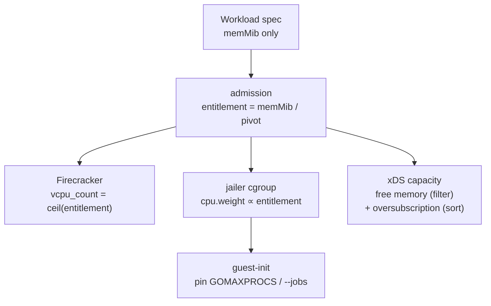

# ADR 021: Workload Resource Model, Memory as the Billing Dial, and Derived CPU

**Author:** jomcgi
**Status:** Draft
**Created:** 2026-07-25
**Builds on:** [013 - Substrate Lanes, Brick Sizing, and the Capacity Tier Ladder](013-substrate-lanes-brick-sizing-capacity-tiers.md) (the brick sizing rule this feeds), [020 - Admission-Only Control Plane](020-admission-control-plane-token-routing-peer-redistribution.md) (the capacity view this makes a scalar), [001 - EmberVM](001-embervm-beam-firecracker-workload-orchestrator.md) (the metering contract), [018 - Node-Local Activator](018-node-local-activator-brick-authoritative-lifecycle.md) (the reconcile-time metering this does not yet resolve)

---

## Problem

A workload today declares `resources.vcpus` and `resources.memMib` independently. Two dimensions, both integers, both hand-set. That has three consequences that only became visible while designing ADR 020.

**Capacity is a vector, so comparing it is ambiguous.** ADR 020's peer sampling asks two or three candidates for capacity and takes the best answer. With independent CPU and memory that comparison needs a scoring function and can pick wrong; a brick with spare CPU and no memory is not comparable to one with the reverse.

**Integer vCPU hides real demand.** Every workload in the chart declares `vcpus: 1` or `2`, not because those are measured needs but because the field is an integer and 1 is the obvious default.

**There is no stated unit for resource accounting.** ADR 001 makes usage a first-class contract; ADR 020 moves metering onto quota leases. Neither settles what is counted.

Underneath all three: CPU and memory are not the same kind of resource, and the schema treats them as if they were.

---

## Decision

Five decisions.

**1. Memory is the dial. CPU is derived.** A workload configures `memMib` only. CPU entitlement is `memMib / pivot` vCPUs, computed at admission. The rationale is that **memory is incompressible and CPU is compressible**: exceeding a memory reservation is an OOM kill, while exceeding a CPU share is throttling. Only the incompressible resource has to be reserved, so only it needs to be declared.

**2. Capacity is therefore a scalar.** Because memory is the only reserved dimension, a brick's free capacity is one number. ADR 020's sampling comparison becomes unambiguous, the xDS capacity resource becomes a single value per brick, and bin packing becomes one-dimensional, removing the stranded-resource failure where a brick has spare CPU it can never sell.

**3. The accounting unit is GB-seconds of allocated memory. Billing itself is deferred.** Allocation is known at admission; duration comes from lifecycle transitions. That makes the unit cheap to compute and means no node instrumentation is needed for it.

It does **not** yet make it a clean query, and this ADR does not claim otherwise. ADR 018 makes gap-time wakes unmetered with late adoption backfill and best-effort reconciliation, and `chart/values.yaml` already ships `nodeLocalWake: true` with `meteringFailOpen: true` for `scratch-postgres` and `scratch-k8s`. So lifecycle transitions today are a reconciled at-least-once stream, not a synchronously witnessed one, and a node crash can leave an interval with no closing transition. Since nothing is billed today, this ADR fixes the **unit** and defers the **guarantee**; ADR 020's open question 7 owns the reconciliation, and storage dimensions (banked snapshot bytes, `volumeSizeGiB`, unattributed warmth-pool VMs) are explicitly out of scope until billing exists.

**4. CPU is delivered as a proportional weight, not a quota.** Firecracker's `vcpu_count` is an integer, so a guest is booted with `ceil(entitlement)` vCPUs and its share is set by `cpu.weight` on the Firecracker process under the jailer, proportional to entitlement.

Weight rather than `cpu.max` because under decision 5 the sum of entitlements deliberately exceeds hardware, so a quota cannot guarantee its number anyway, and a hard ceiling would idle cores while VMs sit frozen. **Burst is bounded rather than unlimited**: AWS Lambda MicroVMs offers "up to 4x your configured baseline resources during peak periods," and a bounded multiple is more predictable for the user and easier to price than open-ended proportional share. A cap of a small multiple over entitlement is the shape to adopt; the multiple itself is provisional like the pivot. Weight degrades to proportional share under contention and lets a workload burst into idle capacity.

The trade-off `cpu.max` would buy is a defensible ceiling for billing, which is deferred with decision 3. When it arrives it brings period tuning and `cpu.max.burst` with it, because CFS period throttling freezes every vCPU thread for the remainder of each period: in a multi-vCPU guest that is lock-holder preemption (a frozen vCPU holding a spinlock makes its peers spin, burning the next period), plus RCU-stall and softlockup warnings the guest kernel raises because it cannot see the throttle. Average throughput is unaffected; tail latency and multi-vCPU guests are not. Weight has none of these properties, which is a second reason to prefer it now.

Because the guest sees the presented core count rather than its share, guest-init must pin CPU-derived concurrency from the entitlement. Bazel (`--jobs=auto`) and Go (`GOMAXPROCS`, which cannot see a host-side cgroup from inside a guest) both do this and both run as ember guests; no guest-init pins either today, so this is new work.

**5. Oversubscription is derived and published, not configured.** A node's CPU oversubscription factor is `hardware_ratio / pivot`, where `hardware_ratio` is that node's MiB per **allocatable vCPU thread** (the unit the scheduler actually hands out). It is computed, exposed alongside capacity in ADR 020's xDS view, and used as a secondary placement input.

Heterogeneous hardware is absorbed by CPU compressibility rather than by configuring a second ratio, which keeps the pivot global and therefore keeps billing predictable and workloads portable between node classes.

Because this is a second comparison dimension, it needs a tie-break rule or it weakens the scalar-capacity property decision 2 just established: **memory capacity is the filter, oversubscription is the sort.** A candidate must have room; among candidates that do, prefer lower oversubscription for burst-sensitive postures and ignore it otherwise. Sampling therefore still compares one number for admissibility.

| Aspect | Today | Decided |
| ------ | ----- | ------- |
| Workload declares | `vcpus` + `memMib`, independent integers | `memMib` only |
| CPU entitlement | declared | derived, `memMib / pivot` |
| CPU delivery | `vcpu_count` | `ceil()` vCPUs + jailer `cpu.weight` |
| Capacity | 2-vector | scalar (memory), with oversubscription as sort key |
| Accounting unit | undefined | GB-seconds of allocation (billing deferred) |
| Hardware heterogeneity | implicit | derived oversubscription factor, published |

### Constants

The pivot, floor, and ceiling are policy, not physics, and they get opposite treatment because of decision 1's asymmetry: **measure the floor, guess the pivot.** A floor set too low is an OOM at boot, unrecoverable and untunable because the workload never runs. A pivot set wrong costs proportional share, which is observable and adjustable live.

| Constant | Provisional value | Basis |
| -------- | ----------------- | ----- |
| Floor | to be measured | what a warm base restore needs; expected 192-256 MiB, since ember guests carry their own kernel and a real userland (ADR 001 rejected kernel-less runtimes for exactly this reason), unlike a 128 MiB Lambda guest |
| Pivot | **1,024 MiB per vCPU** | tracks current declarations; see below |
| Ceiling | to be set from the Bazel tier | ADR 010's headline tier and agents/032's 3-8 GiB warm heap push past a Lambda-style 10 GiB ceiling |

**The pivot is provisional and derived from guesses, which this states rather than hides.** It was chosen to track existing declarations, and those are hand-set defaults, not measurements.

Applied to the current chart. `scratch-k8s` is a composite whose members override the workload-level values, so its members are listed rather than its default:

| Workload / member | Class | MiB | Declared vCPU | Derived @1,024 |
| ----------------- | ----- | --- | ------------- | -------------- |
| sandbox | task | 512 | 1 | **0.50** |
| demo-postgres | stateful | 512 | 1 | **0.50** |
| scratch-postgres | stateful | 512 | 1 | **0.50** |
| hot-image-demo | serving | 768 | 1 | **0.75** |
| semgrep | task | 1536 | 1 | 1.50 |
| sandbox-session | session | 2048 | 1 | 2.00 |
| scratch-k8s / agent | composite | 3072 | 1 | 3.00 |
| bazel-query | task | 3072 | 2 | 3.00 |
| scratch-k8s / server | composite | 4096 | 2 | 4.00 |

**Four of nine receive less CPU than declared** (bold). They keep one presented core, so nothing loses parallelism, but their proportional share falls. That is the intended direction (those are small-memory workloads whose `vcpus: 1` was a default, not a measurement) and it is a real change, not a no-op.

A Lambda-style 1,769 pivot was rejected: it cuts those same four harder still (0.29 vCPU for the 512 MiB workloads) because ember runs a whole datastore or interpreter per VM rather than a short handler.

**The ratio applies per VM, not per workload.**

---

## Architecture

Hardware heterogeneity surfaces as the derived factor rather than as configuration. On the current fleet, per allocatable vCPU thread:

| Node class | Allocatable threads | Allocatable memory | MiB/thread | Oversub @1,024 |
| ---------- | ------------------- | ------------------ | ---------- | -------------- |
| node-1/2/3 | 11 | 12.3 GiB | 1,145 | 1.1x |
| node-4 | 16 | 61.9 GiB | 3,962 | 3.9x |

**Threads, not physical cores, deliberately.** The scheduler allocates threads and that is what the capacity view reports. The caveat: node-4's 16 threads are 8 physical cores with SMT, so measured against physical cores its ratio is ~7,930 MiB and its oversubscription ~7.7x. SMT siblings are not independent cores, so real contention on node-4 sits between the two figures. That matters when choosing the pivot from measured utilization and is recorded as an open question rather than resolved by picking a flattering denominator.

The two classes are ~3.5x apart and the model absorbs that without a second ratio. The asymmetry lands the safe way round: node-4 runs the higher oversubscription **and** holds roughly five times as many VMs, so the statistical multiplexing that makes oversubscription safe scales with the risk it covers. It also explains the fleet's natural specialisation, node-4 being r-family-shaped (banked sessions) and the masters c-family-shaped (semgrep, small task VMs).

The same arithmetic makes cloud instance selection legible: at a 1,024 pivot, c-family (2 GiB/vCPU) implies 2x oversubscription, m-family 4x, r-family 8x. **Instance family choice is the oversubscription decision.**

---

## Migration

`vcpus` is a **required** CRD field (`chart/crds/workload-crd.yaml`), set in all 8 chart templates and 7 `crd/samples/*.yaml`, carried in six messages in `proto/embervm/node/v1/node.proto`, read at three sites in `control/lib/embervm/workload_watcher.ex`, and consumed by the fcvm driver. noded has **no CPU cgroup code today**, only memory-headroom reads in `pressure.go`.

So this cannot ship as a schema edit. Ordering, which the implementation issues must follow:

1. noded gains `cpu.weight` enforcement and guest-init pinning, driven by an entitlement field that the control plane computes and sends. No behaviour change while the CP still sends declared values.
2. The CP computes entitlement from `memMib` and sends that instead, with `vcpus` still accepted and honoured as an override.
3. `vcpus` becomes optional in the CRD and defaulted from the pivot. The proto field is retained, not reserved, since it carries the derived value.
4. Templates and samples drop `vcpus` where the derived value is acceptable, keeping it only for deliberate exceptions.

Step 1 must precede step 2 or workloads get an entitlement nothing enforces.

---

## Alternatives Considered

- **Keep independent `vcpus` and `memMib`.** Rejected: makes capacity a vector, which forces a scoring function into ADR 020's sampling comparison and strands resources during packing.
- **`cpu.max` quota instead of `cpu.weight`.** Rejected for now: cannot honour its number under deliberate oversubscription, idles cores that a bursting guest could use, and brings CFS period throttling with its lock-holder preemption and guest-visible stall warnings. Revisit when billing needs a defensible ceiling.
- **Copy Lambda's constants (128 MiB floor, ~1,769 pivot, 10,240 MiB ceiling).** Rejected on all three: the floor assumes a minimised guest ember deliberately does not have, the pivot starves ember's small-memory datastores, and the ceiling is below what the Bazel tier already needs. The shape is adopted, the numbers derived.
- **Several instance families (compute / balanced / memory optimised).** Rejected for now: three ratios reintroduce vector packing, giving back the property that motivated the change.
- **Per-pool configurable pivot matching each node class's hardware ratio.** Rejected: CPU compressibility already absorbs a 3.5x spread as oversubscription, so a second ratio buys nothing while costing predictable accounting and cross-class portability.
- **Bill on consumption.** Rejected: requires node instrumentation, an idempotent event stream, and reconciliation, to price a resource the platform reserved anyway.

---

## Security

Baseline: `docs/security.md`.

- **Resource abuse is a security concern** (ADR 001), and this ADR does not change containment: per-workload concurrency caps, per-tenant fair queues, admission control, and the node-side pressure predicate. Quota *enforcement* in the billing sense is deferred; containment is not, and the two should not be conflated.
- **Memory is the fail-closed dimension.** Being incompressible, admission must refuse rather than oversubscribe it, which `pressure:mem` already does. CPU oversubscription is safe because its failure mode is a smaller share.
- **The floor is a safety constant.** Below what a guest needs to boot, restore OOMs, which for the session class means a banked session that cannot be relit; validate it against the largest base a guest may restore from.
- A workload cannot self-select its oversubscription factor: it is derived from node hardware, not a lever a principal can pull.

---

## Risks

| Risk | Likelihood | Impact | Mitigation |
| ---- | ---------- | ------ | ---------- |
| Provisional pivot is wrong for real utilization | High | Low | Failure is a smaller proportional share, not a stall; replace from measured data once guests report cgroup stats |
| Four current workloads lose proportional CPU on migration (see table) | **High** | Medium | Presented cores are unchanged so nothing loses parallelism; the affected four are small-memory workloads whose `vcpus: 1` was a default. Verify under load before step 2 of the migration, and use the `vcpus` override for any that regress |
| Guests over-thread against visible cores and waste their share | High | Medium | Decision 4: guest-init pins `GOMAXPROCS` and Bazel `--jobs` from entitlement. Neither is pinned today |
| CPU-heavy, memory-light workloads underserved by a single dial | Medium | Medium | The known shape is a small-memory CPU-bound task; none exists today (semgrep at 1,536 MiB *gains* CPU at this pivot), so this motivates the `vcpus` override rather than three families |
| Ceiling chosen without checking brick implications | Medium | High | ADR 013 sizes a brick at 4-8x the largest VM of its class, so a 16 GiB ceiling implies 64-128 GiB bricks; choose the two together |
| SMT makes node-4's real contention worse than the thread-based figure | Medium | Medium | Recorded as an open question; measure before setting the pivot from utilization |
| Migration lands out of order and workloads get an unenforced entitlement | Medium | High | Ordering is stated in Migration; step 1 gates step 2 |

---

## Open Questions

1. **The measured floor**, per runtime, and whether it is global or per-guest-image.
2. **The measured pivot**, which needs cgroup utilization from guests, and whether it is set against threads or SMT-adjusted cores.
3. **The ceiling, jointly with brick sizing**, since ADR 013's multiplier makes it an instance-selection decision.
4. **Whether `vcpus` survives as a permanent override** past migration step 4, or whether custom configuration is a separate mechanism.
5. **Rounding rule for `vcpu_count`.** `ceil()` is proposed; whether some workloads want more presented cores than entitlement for parallelism is unresolved, and it interacts with the `cpu.max` discussion if that ever lands.
6. **When billing arrives**, the reconciliation owed by ADR 020 open question 7, plus whether storage dimensions are billed or exempt.

---

## References

| Resource | Relevance |
| -------- | --------- |
| [ADR 001](001-embervm-beam-firecracker-workload-orchestrator.md) | The metering contract, resource-abuse-is-security, and the real-userland commitment that sets the floor |
| [ADR 013](013-substrate-lanes-brick-sizing-capacity-tiers.md) | Brick sizing at 4-8x the largest VM of its class, which the ceiling multiplies into |
| [ADR 018](018-node-local-activator-brick-authoritative-lifecycle.md) | `nodeLocalWake` / `meteringFailOpen` and reconcile-time accounting, why decision 3 defers the guarantee |
| [ADR 020](020-admission-control-plane-token-routing-peer-redistribution.md) | The capacity view this makes a scalar; open question 7 owns metering reconciliation |
| [ADR 010](010-bazel-skyframe-snapshot-query-demo.md) | The multi-GB Bazel tier that sets the ceiling above Lambda's |
| [agents/032](../agents/032-warm-bazel-worker-mcp.md) | The 3-8 GiB warm heap estimate |
| `projects/embervm/chart/values.yaml`, `chart/templates/workload-scratch-k8s.yaml` | The declarations tabulated above, including the composite member overrides |
| `projects/embervm/noded/server/pressure.go` | Memory-headroom reads; no CPU cgroup code today |
| `docs/security.md` | Security baseline |
