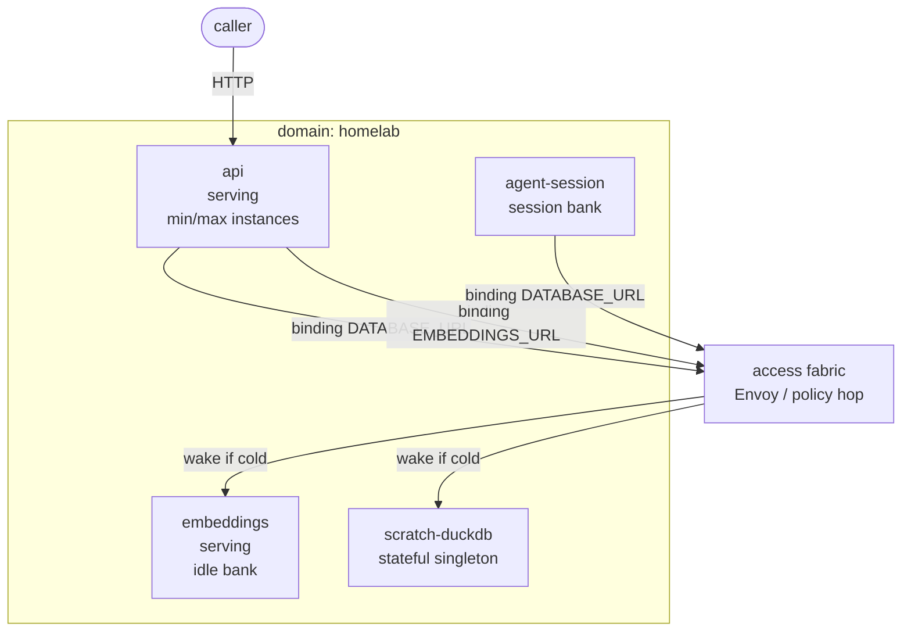

# ADR 022: Domain-Scoped Service Composition and a Mediated Access Fabric

**Author:** jomcgi
**Status:** Draft
**Created:** 2026-07-25
**Builds on:** [001 - EmberVM](001-embervm-beam-firecracker-workload-orchestrator.md) (workload classes, no-cross-principal isolation, hit/miss data plane), [009 - Continuity Before Tenancy](009-roadmap-extension-continuity-before-tenancy.md) (R6 Facade deferred; hard multi-tenancy not near-term), [023 - Egress Secret Proxy](../agents/023-egress-secret-proxy.md) (brokered egress and destination allowlists), [004 - agent-sandbox compatibility](004-agent-sandbox-interface-compatibility.md) (session as external sandbox surface)
**Related:** [020 - Admission-Only Control Plane](020-admission-control-plane-token-routing-peer-redistribution.md) (hit path stays off the control plane), AWS Lambda MicroVMs (convergent prior art for session suspend/resume, not for durable multi-VM apps)

---

## Problem

EmberVM can already run several workload classes (task, session, serving, stateful, composite), but it does not yet say how a **multi-component application** is composed: an API that talks to a scale-to-zero DuckDB or Postgres, an embeddings service that banks when idle, an agent session that holds a DSN. Two tempting shapes fight each other.

**Composite groups (R5)** couple members on a private L2/L3 network with atomic bank/relight of a bundle set. That fits multi-node scratch k8s and other multi-kernel demos. It is the wrong default for app graphs: joint lifecycle, clock-resync, set integrity, and host networking tax every change; the shipped scratch-k8s shape is warmth-only (no durable member volumes); reliability is not yet boring enough that multi-node envs are a product anyone depends on.

**A flat guest mesh** (every opted-in VM can dial every other tap IP) would bypass the mediated data plane that owns wake-on-miss, endpoint publication, metering, and abuse controls. Taps are node-local; cold targets have no listener; task-class VMs have no NIC by design; zero-egress is the default isolation posture. Building a true L3 mesh reimplements the hard parts of Envoy and the activator on the wrong side of the Firecracker boundary.

At the same time the only live customer is one operator, but **domain-shaped boundaries** are cheap to name now and expensive to retrofit when a multi-customer deployment appears. Hard multi-tenancy (ADR 009's R6 Facade) stays deferred; the composition model still needs a boundary object that can become enforcement later.

A third pressure: horizontal scale is not one knob. Serving and task fleets already grow by adding VMs. Stateful is a singleton by construction (one volume, generation pairing). Postgres read replicas are a real later recipe (duplicate state, stream from primary, separate ro endpoint) but are special-case machinery for small value today and must not drive the simplification agenda.

---

## Decision

Seven decisions. Together they are the default way multi-component apps sit on EmberVM, and they deliberately **simplify** rather than add a sixth workload class.

### 1. Compose services, not groups

An application is a set of **independent Workloads** in one **domain**, wired by **bindings** (logical names that become env / MMDS injects such as `DATABASE_URL` and `EMBEDDINGS_URL`). Each component keeps its own class, idle bank, floor, and cap.

Composite remains available for multi-kernel private-network demos. It is **not** the composition model for App + DB + embeddings. Investing in composite reliability is deprioritized until singleton lanes are boring and a real multi-node consumer appears.

| Aspect | Composite group (R5) | Service composition (this ADR) |
| ------ | -------------------- | ------------------------------ |
| Coupling | Shared subnet + joint bank set | Name + endpoint + credentials |
| Lifecycle | All-or-none relight | Independent wake / bank |
| Networking | Guest L2/L3 | Mediated platform path |
| Failure | Partial set → full fresh boot | One component cold does not invalidate others |
| Fit | scratch-k8s, multi-node labs | App graphs, agent tools |

### 2. Domain is the boundary seam (soft now, hard later)

Every Workload and every binding carries a **domain** (namespace-shaped ownership). v1 may run a single domain (for example `homelab`), but the field is required so names, secrets, and access are never global-by-default.

| Rule | v1 (one operator) | Multi-customer later |
| ---- | ----------------- | -------------------- |
| Lineage | Snapshots and volumes stay in-domain | Same, enforced |
| Bindings | Default same-domain only | Cross-domain only via explicit grant |
| Names | Unique within domain | `acme/duckdb` vs `contoso/duckdb` |
| Quotas | Optional per-domain caps | Chargeback boundary |

Hard multi-tenancy, virtual control planes, and per-tenant op-log cells remain ADR 009 Recorded. Domains do not implement them; they keep the product from assuming a flat global name space.

### 3. Access is a mediated fabric, not a flat VM mesh

Inter-workload traffic **opts in** and always re-enters the platform data plane:

```text
guest A (opt-in access)
  → local hop (vsock egress or host route to node proxy/Envoy)
  → policy (domain, binding, rate limit)
  → auth (token / secret swap / password as appropriate)
  → resolve logical name → wake if cold → guest B
```

Defaults stay **zero-egress** and **deny-by-default** for destinations not named in bindings. Task-class VMs remain vsock-only: they are not mesh clients; callers outside the guest (monolith, session, serving) hold DSNs when a task needs a datastore.

A flat tap mesh is rejected: it bypasses wake, auth, metering, and cross-node placement, and fights the node-local serving bridge design.

This is compatible with ADR 020's admission-only control plane: the **hit** path stays Envoy-to-endpoint; the fabric is the **policy and name resolution** on peer dials, not a return of the CP to every byte.

### 4. Inject logical endpoints; never guest tap IPs

Bindings project stable names into the caller:

- HTTP serving: internal vhost / service path (already the serving model)
- Stateful L4: cluster listen port / logical DSN host (already the scratch-postgres consumer shape)

Injection rides MMDS / env (and later secret-proxy placeholders where the credential must not enter the guest). Chart-level hand wiring (today's monolith scratch-postgres DSN) is the transitional form of the same idea; productize bindings when a second in-guest consumer needs them.

### 5. Independent wake is the density model; floor is min availability

Each component banks and wakes on **its own** policy:

- Floor / `minInstances` ≥ 1: always-on where the product needs it
- Floor 0 + idle bank: scale to zero until dialed
- Cap / `maxInstances`: horizontal bound for classes that allow N live VMs

Waking the API does not force-wake every dependency. Only the code paths that dial a binding pay that wake. That is intentional: a health check that skips the DB should not drag Postgres up.

### 6. Horizontal scale is class-specific

| Class | Horizontal shape | Status |
| ----- | ---------------- | ------ |
| Serving / task | More VMs under demand (floor/cap, Envoy multi-endpoint or dispatch width) | Existing product |
| Session | Many principal-scoped instances, not clones of one process image for HPA | Existing product |
| Stateful | **Singleton** writer + volume | Existing product; keep |
| Composite | Fixed member set, not HPA | Existing; non-priority for apps |
| Stateful RO pool (e.g. Postgres replicas) | Separate volumes, stream from primary, **rw** and **ro** logical names | **Recorded, deferred** |

Postgres read-replica autoscaling (seed volume, join primary, publish only on ro, scale down with slot cleanup) is a valid later recipe and a special case of "duplicate state and attach to primary." It is **not** `maxInstances` on a stateful Workload. Value is small while the single-customer stack is still being simplified; do not build it in the near path. DuckDB/SQLite remain singleton or file-local unless an engine-specific strategy appears later.

### 7. Near-term simplification priority

Until singleton reliability is boring, investment order is:

1. Stateful singleton correctness and operability (Postgres scratch, then DuckDB-shaped file engines)
2. Model-in-guest embeddings (or similar) as bankable **serving**, not a new class
3. Domain field + same-domain bindings + DSN/URL inject (composition without groups)
4. Floor/cap used deliberately for min avail vs density
5. Access-fabric allowlist for opted-in guest dials (mediated path only)

Explicitly out of the critical path: composite app envs, flat guest mesh, SPIFFE mesh, hard tenancy, and Postgres RO HPA.

Lambda MicroVMs remain convergent prior art for the **session** class (suspend/resume, idle policy, per-sandbox URL), not a replacement for R4 volume durability. Durable data stays "volume owns truth, snapshot owns warmth."

---

## Architecture



**Binding (conceptual):**

```yaml
# Illustrative; CRD shape is implementation detail for Issues, not this ADR.
spec:
  domain: homelab
  class: serving
  bindings:
    - name: DB
      workloadRef: scratch-duckdb
      inject:
        DATABASE_URL: fromEndpoint
    - name: EMBED
      workloadRef: embeddings
      inject:
        EMBEDDINGS_URL: fromEndpoint
  access:
    out: [DB, EMBED]   # opt-in destinations; default deny
```

**Scale interactions (honest):**

- API `maxInstances` grows under load; DB stays one writer.
- Embeddings scales on its own floor/cap.
- A future RO pool would add a second logical name (`DATABASE_RO_URL`) and N replica endpoints; primary remains singleton for writes.

---

## Alternatives Considered

- **Composite groups as the app composition model.** Rejected for app graphs: joint lifecycle and private nets are the wrong coupling; keep composite for multi-kernel demos only.
- **Flat guest L3 mesh.** Rejected: bypasses wake/auth/metering; node-local taps; fights zero-egress and task no-NIC.
- **Hard multi-tenancy now.** Rejected per ADR 009; domains are the cheap seam without building the facade.
- **Stateful `maxInstances` for horizontal data.** Rejected: volume + generation pairing assumes one writer; RO scale is a replica recipe, not N clones of one volume.
- **Build Postgres RO autoscaling now.** Recorded and deferred: real design, small value while simplifying the singleton and composition stack.
- **Put SQLite only inside the app guest.** Accepted as a valid placement when one app owns the file; shared scratch still wants a stateful singleton + DSN.
- **Lambda MicroVMs as the stateful shape.** Rejected as a durability model: snapshot-as-state fits session; R4 keeps volume-as-truth for datastores.

---

## Security

Baseline per `docs/security.md` and ADR 001's isolation rule: no VM or snapshot lineage crosses a principal. Domains refine ownership of names and bindings; they do not weaken lineage isolation.

- Default zero-egress and deny-by-default peer dial remain the posture; opt-in access is an explicit allowlist of platform endpoints, not open internet.
- Credentials: prefer not putting long-lived secrets in guest memory when the egress-proxy pattern can swap them (HTTP first; opaque DB protocols may still need password-in-guest until a stronger proxy exists). Endpoint tokens and short-lived service credentials are preferred for HTTP peers.
- Cross-domain access is deny-by-default; grants are explicit and auditable (op-log).
- Task-class no-NIC is preserved; untrusted one-shot code does not gain mesh membership by accident.

---

## Risks

| Risk | Likelihood | Impact | Mitigation |
| ---- | ---------- | ------ | ---------- |
| Domain field stays optional and global names calcify | Medium | High | Require domain on new workloads and bindings; migrate chart CRs early while only one domain exists |
| Access fabric becomes a second control plane on the hit path | Medium | High | Keep policy at bind time and on the Envoy/proxy hop; CP stays admission-only for steady state (ADR 020) |
| App graphs accidentally reintroduce composite | Low | Medium | Document composition as bindings; leave composite samples labeled demo-only |
| RO-replica demand arrives before singleton reliability | Low | Medium | This ADR records the recipe; Issues track it separately; do not block simplification |
| Password-in-guest for DB DSNs weakens 023's secret model | Medium | Medium | Accept for v1 scratch; extend secret-swap / rotated secrets when a hostile guest is in scope |
| Health checks or readiness probe the DB and thrash wake | Medium | Low | Document that probes should not dial every binding; optional "don't wake" probe paths later |

---

## Open Questions

1. Exact CRD / API shape for `domain`, `bindings`, and `access.out` (Workload fields vs a thin Stack object that only wires names).
2. Whether guest dial uses vsock egress (023-shaped) for all classes with a NIC, or a host route into node Envoy for platform destinations only.
3. Auth primitive for HTTP peers in v1 (internal JWT, mTLS, or shared secret) before SPIFFE.
4. When to require `domain` on existing chart workloads vs grandfather empty as `homelab`.

---

## References

| Resource | Relevance |
| -------- | --------- |
| [ADR 001](001-embervm-beam-firecracker-workload-orchestrator.md) | Classes, isolation, R4 singleton, R5 composite, serving multi-instance |
| [ADR 009](009-roadmap-extension-continuity-before-tenancy.md) | Continuity before tenancy; facade deferred |
| [ADR 020](020-admission-control-plane-token-routing-peer-redistribution.md) | Keep CP off the steady-state request path |
| [agents/023](../agents/023-egress-secret-proxy.md) | Brokered egress, allowlists, placeholder secrets |
| [AWS Lambda MicroVMs](https://aws.amazon.com/lambda/lambda-microvms/) | Session-shaped suspend/resume prior art |
| Scratch-postgres consumer (monolith chart) | Existing DSN composition without groups |
