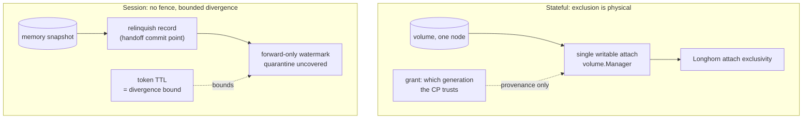

# ADR 023: Class-Scoped Ownership Arbitration

**Author:** jomcgi
**Status:** Draft
**Created:** 2026-07-26
**Resolves:** [020 - Admission-Only Control Plane](020-admission-control-plane-token-routing-peer-redistribution.md) decision 3, recorded there as UNDER REVISION
**Extends:** [018 - Node-Local Activator](018-node-local-activator-brick-authoritative-lifecycle.md) (the grant-as-provenance model), [011 - Distribution, Longhorn Fencing, CP-Sequenced Rollouts](011-distribution-longhorn-fencing-cp-rollouts.md) (the physical fence)

---

## Problem

ADR 020 asked how a request reaches the brick holding its session's state, and answered with a single ownership mechanism spanning every stateful thing on the platform: handoff self-serialising on relinquish, Longhorn failover fenced by attach exclusivity, object-store failover closed by a put-if-absent CAS. Two independent reviews found that unsound, and ADR 020 records the five failure modes.

Re-reading ADR 018 shows why it was unsound, and it is not the reason ADR 020 gives. **The question was asked at the wrong granularity.** ADR 018 states the model plainly:

> The grant/lease is PROVENANCE (which incarnation the control plane will trust), never the exclusion mechanism.

and rejects precisely the direction ADR 020 took:

> **A distributed fencing LEASE as the safety primitive.** Rejected as a mis-frame: the physical attach fence already excludes a second writer, so a lease protocol would re-solve a solved problem.

For a **stateful** workload, exclusion is already four-layered and physical: a volume exists on exactly one node and the CP returns `:volume_node_gone` rather than re-placing; `noded`'s `volume.Manager` permits exactly one writable attach per volume (`noded/volume/volume.go:137-154`) and refuses a second live VM with `FAILED_PRECONDITION`; Longhorn attach exclusivity invalidates a zombie's access; and the grant bounds which generation the CP will trust. Two writers cannot coexist regardless of grant width.

So ADR 020's decision 3 was inventing arbitration for a class that already has it. But the argument in ADR 018 is explicitly about *a stateful volume*, and that is the gap: **the session class has no volume, therefore no attach, therefore no physical fence at all.** A session's state is a memory snapshot on scratch or in the object store, and nothing prevents two nodes relighting the same artifact.

One question, two classes, two different answers. Asking it once produced a mechanism that was redundant for one and unsound for the other.

---

## Decision

Four decisions.

**1. Ownership arbitration is class-scoped. There is no single mechanism.** The correct question is not "who owns this workload" but "what does this class lose if two incarnations run," and the answer differs enough that a shared mechanism is a mis-fit for both.

| Class | State | Exclusion | Two incarnations cost |
| ----- | ----- | --------- | --------------------- |
| Stateful | volume | **physical fence** (ADR 011/018), already built | prevented, not mitigated |
| Session | memory snapshot | **none exists** | divergence from a common ancestor |
| Serving / task | none durable | n/a | nothing |

**2. Stateful ownership is unchanged. ADR 020 decision 3 is withdrawn, not replaced.** The physical fence plus ADR 018's grant-as-provenance is the mechanism. No CAS, no lease protocol, no new arbitration primitive. The object-store compare-and-swap ADR 020 proposed is dropped entirely: it would re-solve exclusion that the attach already provides, and it carried a liveness hole (a holder dying with the key wedges the workload) that the physical fence does not have.

**3. Session ownership accepts bounded, detectable divergence rather than preventing it.** This is a real weakening relative to stateful, and it is stated rather than hidden:

- **Handoff (owner-initiated)** writes a durable relinquish record before transferring, so the former owner cannot relight its own local copy. This is the commit point ADR 020's version lacked, and it is a record in the existing op-log stream, not a new protocol.
- **Failover (owner absent)** is best-effort. A claimant relights from the last banked artifact and advances the generation; ADR 018's forward-only watermark adjudicates, and any advancement no live grant covers is quarantined on sight, which is today's behaviour unchanged.
- **Divergence is bounded by token TTL**, not by in-flight work: a node partitioned from the control plane is not partitioned from clients, and a pre-partition token matches the old copy's generation, so the brick cannot self-detect staleness. Every client holding an unexpired token keeps reaching the old copy until it expires.

This is acceptable for the session class specifically, because a session is a sandbox rather than a book of record. Losing seconds of in-flight sandbox work to a partition is a different failure from corrupting a database volume, and the classes should not pay the same price for the same guarantee.

**4. Redistribution (ADR 020 decision 4) is unblocked but scoped, and it is not control-plane-free.**

- **Session redistribution** is the handoff path in decision 3: relinquish record, transfer, claim. Bytes move peer-to-peer; the grant claim is one small control-plane call. ADR 020's decision 5 claim that none of the three pressure loops needs a control-plane round trip is **wrong for redistribution** and is corrected here: shed and drain are node-autonomous, redistribution is control-plane-light.
- **Stateful redistribution** is a volume move, which ADR 011 already governs (CP arbitrates placement, attach re-fences). It is not a peer-to-peer operation and must not be modelled as one.

| Aspect | ADR 020 decision 3 as written | Decided here |
| ------ | ----------------------------- | ------------ |
| Mechanism | one, spanning all classes | class-scoped |
| Stateful | storage-arbitrated CAS + attach | physical fence, unchanged (withdraw) |
| Session | same mechanism as stateful | bounded divergence, relinquish record |
| Object-store CAS | the arbitration primitive | dropped |
| Divergence bound | "work in flight at partition" | token TTL |
| Redistribution | no CP round trip | CP-light: bytes p2p, grant claim central |

---

## Architecture

The asymmetry is the decision. Stateful buys prevention with a fence it already has; session buys detection and a bound, because no fence exists for a snapshot and inventing one would be the lease protocol ADR 018 rejected.

---

## Alternatives Considered

- **A single mechanism spanning both classes (ADR 020 decision 3).** Withdrawn: redundant for stateful, unsound for session, and the source of all five failure modes ADR 020 records.
- **Object-store put-if-absent CAS as the session fence.** Rejected: no liveness story (a holder that dies with the key wedges the session forever), nothing revalidates after boot, it does not cover local-disk relight from a copy set, and SeaweedFS conditional-put support was never verified. It is also the lease-as-safety-primitive frame ADR 018 rejected.
- **Give sessions a volume so they inherit the physical fence.** Rejected on cost: it would make every session a Longhorn volume, defeating the bank-and-relight model that makes the class cheap, and ADR 016's session contract is explicitly snapshot-and-workspace tiered rather than volume-anchored.
- **Prevent session divergence with consensus among nodes.** Rejected: strictly worse than one control-plane call, and the control plane is already the adjudicator.
- **Accept ADR 020's "no CP round trip" for redistribution.** Rejected: a handoff advances a generation, and an advancement no grant covers is quarantined by ADR 018's standing rule, so a report-after-the-fact handoff fails closed every time.

---

## Security

Baseline: `docs/security.md`.

- **The weakening is scoped and named.** Session divergence is a real reduction against stateful's guarantee. It is confined to a class whose state is a sandbox, and it is bounded by a parameter (token TTL) rather than being open-ended.
- **Token TTL is a correctness parameter.** Shortening it tightens the divergence bound and raises admission load; the trade is real and belongs to whoever sets it, not to a default.
- **Fail-closed is unchanged.** ADR 018's rule stands: any advancement no live grant covers is quarantined. This ADR adds a relinquish record; it does not add an exception to quarantine.
- **The relinquish record must be durable before the transfer starts.** If it is written after, a crash mid-transfer leaves the old owner able to relight, which is the hole this closes.

---

## Risks

| Risk | Likelihood | Impact | Mitigation |
| ---- | ---------- | ------ | ---------- |
| Session divergence during a client-visible partition | Medium | Medium | Bounded by token TTL; accepted for the class; do not extend the pattern to stateful |
| Relinquish record written after transfer begins | Medium | High | Ordering is the decision: durable record first, exactly ADR 018's op-log-before-dispatch discipline |
| Redistribution's grant claim becomes a bottleneck | Low | Medium | Redistribution is rare relative to dispatch; if it is not, that is a signal to fix placement rather than to remove adjudication |
| Someone applies the session model to stateful for symmetry | Medium | High | The asymmetry is the decision; the table above is the guard |
| Copy sets reintroduce an unfenced local relight | Medium | Medium | Copy sets are deferred (ADR 020 review); if revived, each copy needs the same relinquish discipline |

---

## Open Questions

1. **Token TTL as a number**, given it is simultaneously the divergence bound and the driver of admission load (roughly live sessions divided by TTL).
2. **Whether brick-side token renewal** (a brick countersigning an extension for a session it demonstrably holds) is safe under bounded divergence, or whether it widens the window.
3. **Whether the relinquish record needs its own op kind** or extends ADR 018's `wake_grant` consume, and how ADR 002 compaction treats it (an unconsumed relinquish must survive like an unconsumed grant).
4. **Serving-class redistribution**, which this ADR treats as costless because nothing durable is lost, but which still moves a live endpoint.

---

## References

| Resource | Relevance |
| -------- | --------- |
| [ADR 018](018-node-local-activator-brick-authoritative-lifecycle.md) | Grant-as-provenance, the four-layer physical fence argument, the rejection of lease-as-safety-primitive, forward-only watermark and quarantine |
| [ADR 011](011-distribution-longhorn-fencing-cp-rollouts.md) | Attach exclusivity; "the CP arbitrates, the fence enforces" |
| [ADR 020](020-admission-control-plane-token-routing-peer-redistribution.md) | Decision 3 this withdraws; decisions 4 and 5 this corrects |
| [ADR 016](016-kubernetes-scheduling-integration-contract.md) | The tiered session contract that keeps sessions off volumes |
| `projects/embervm/noded/volume/volume.go` | Single writable attach per volume, the node-local half of the fence |
| `docs/security.md` | Security baseline |
