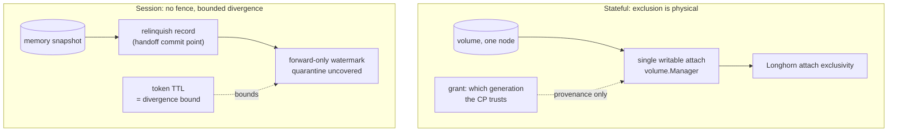

# ADR 023: Class-Scoped Ownership Arbitration

**Author:** jomcgi
**Status:** Draft
**Created:** 2026-07-26
**Resolves:** [020 - Admission-Only Control Plane](020-admission-control-plane-token-routing-peer-redistribution.md) decision 3, recorded there as UNDER REVISION
**Extends:** [018 - Node-Local Activator](018-node-local-activator-brick-authoritative-lifecycle.md) (the grant-as-provenance model), [011 - Distribution, Longhorn Fencing, CP-Sequenced Rollouts](011-distribution-longhorn-fencing-cp-rollouts.md) (the physical fence)

---

## Problem

ADR 020 asked how a request reaches the brick holding its session's state, and answered with a single ownership mechanism spanning every stateful thing on the platform: handoff self-serialising on relinquish, Longhorn failover fenced by attach exclusivity, object-store failover closed by a put-if-absent CAS. Two independent reviews found that unsound, and ADR 020 records the five failure modes.

Re-reading ADR 018 shows why it was unsound, and it is not the reason ADR 020 gives. **The question was asked at the wrong granularity.** ADR 018 states the model plainly:

> The grant/lease is PROVENANCE (which incarnation the control plane will trust), never the exclusion mechanism.

and rejects precisely the direction ADR 020 took:

> **A distributed fencing LEASE as the safety primitive.** Rejected as a mis-frame: the physical attach fence already excludes a second writer, so a lease protocol would re-solve a solved problem.

For a **stateful** workload, exclusion is layered, but the layers are **tier-dependent** and only one of them is genuinely physical:

| Layer | Longhorn-native tier | File tier (`vol.img` on node NVMe) |
| ----- | -------------------- | ---------------------------------- |
| Spatial (one node) | CP refuses to re-place (`:volume_node_gone`) | same, and this is a **policy** fence bought with unavailability, not physics |
| Node-local single attach | `volume.Manager` in-process mutex (`noded/volume/volume.go:137-154`) | same; note it does **not** survive a daemon restart and is rebuilt by live-VM adoption |
| Attach exclusivity | **yes**, Longhorn invalidates a zombie's access | **absent** |
| Grant | provenance only, never exclusion | same |

So the true physical fence exists on the Longhorn tier. On the file tier, exclusion rests on the control plane declining to place a second writer, which is a strong policy but not a law of physics, and `volume.Manager`'s guarantee is an in-process lock rather than a device-level one.

ADR 020's decision 3 was therefore inventing arbitration for a case that has it (Longhorn) while missing that the file tier's protection is different in kind. And the argument in ADR 018 is explicitly about *a stateful volume*, which leaves two classes uncovered entirely: **session** state is a memory snapshot with no volume, no attach and no fence, and **composite** banks and relights as one lineage whose shipped shape is warmth-only with no member volumes at all, while ADR 018 Fork A already ships node-local composite relight with no volume, no attach and no grant gate. Composite is the *least*-fenced class in the system and it is on the node-local wake path today.

One question, four classes, three different answers. Asking it once produced a mechanism that was redundant for one, unsound for another, and silent about the two least protected.

---

## Decision

Four decisions.

**1. Ownership arbitration is class-scoped. There is no single mechanism.** The correct question is not "who owns this workload" but "what does this class lose if two incarnations run," and the answer differs enough that a shared mechanism is a mis-fit for both.

| Class | State | Exclusion | Two incarnations cost |
| ----- | ----- | --------- | --------------------- |
| Stateful, Longhorn tier | volume | **physical fence** (attach exclusivity), already built | prevented |
| Stateful, file tier | `vol.img` on node NVMe | **policy fence**: CP declines to re-place; node-local mutex | prevented while the CP holds the line; see decision 2 |
| Composite | group lineage, warmth-only, no member volumes | **none** | divergence of a whole bundle set |
| Session | memory snapshot | **none** | divergence from a common ancestor |
| Serving / task | none durable | n/a | nothing |

**2. Stateful ownership is unchanged, and file-tier moves are forbidden until it has a real fence. ADR 020 decision 3 is withdrawn, not replaced.** The existing fence plus ADR 018's grant-as-provenance is the mechanism. No CAS, no lease protocol, no new arbitration primitive. The object-store compare-and-swap ADR 020 proposed is dropped entirely: it would re-solve exclusion the attach already provides on the Longhorn tier, and it carried a liveness hole (a holder dying with the key wedges the workload) the physical fence does not have.

The tier distinction is load-bearing, because ADR 011 says "a placement move is a copy, never a rebuild." A copy-move of a **file-tier** volume leaves the source `vol.img` live on the origin node, and each node's `volume.Manager` permits one attach *independently of the other*, so nothing prevents two writers on two files each believing it is the workload's volume. Therefore: **placement moves, failover, and restore-elsewhere are permitted on the Longhorn tier only.** A file-tier volume stays on its node, and its unavailability when that node is gone is the accepted cost until it is either migrated to Longhorn or given a device-level fence. This is a constraint on future work, not a change to what runs today.

**3. Session and composite ownership accept bounded, detectable divergence rather than preventing it.** This is a real weakening relative to stateful, and it is stated rather than hidden:

- **Handoff (owner-initiated)** writes a durable relinquish record before transferring, so the former owner cannot relight its own copy. This is the commit point ADR 020's version lacked.

  **The record must be durable in two places, and the second is not optional.** A control-plane op-log entry binds a former owner only while session relight is CP-driven. ADR 018's declared direction is brick-authoritative lifecycle, and a node-local wake does not consult the op-log, so the record must *also* be a node-local tombstone beside the bank artifact the moment session wake goes brick-local. ADR 020's own risk table identified the local tombstone as the fix precisely because a token cannot be recalled; dropping it would let the commit point erode on the roadmap ADR 018 already committed to.

- **Failover (owner absent) is best-effort, and sessions have no grant machinery today.** This must be said plainly rather than borrowed: `wake_grant`, the forward-only watermark, and quarantine-on-uncovered-advancement are **stateful-volume** mechanisms. Sessions carry a control-plane generation but no grants at all, and `session_manager.ex` records that sessions "carry no volume/generation, so no pairing guard applies here." So the honest statement is: a claimant relights from the last banked artifact, the control plane's session generation advances, and **detection of a stale second incarnation rests on the generation in the token, not on quarantine.** Extending grants to sessions is possible new work, not existing behaviour, and this ADR does not assume it.

- **Divergence is bounded by token TTL**, not by in-flight work: a node partitioned from the control plane is not partitioned from clients, and a pre-partition token matches the old copy's generation, so the brick cannot self-detect staleness. Every client holding an unexpired token keeps reaching the old copy until it expires.

- **Composite is governed as one unit.** The relinquish record covers the whole bundle set, and a partial handoff is a failed handoff: no member may be claimed elsewhere unless the record covers the group. Composite is the least-fenced class and is already on the node-local relight path, so it inherits the session rules rather than being left undecided.

This is acceptable for these classes specifically, because a session is a sandbox rather than a book of record and a composite group is a warmth construct with no member volumes. Losing seconds of in-flight sandbox work to a partition is a different failure from corrupting a database volume, and the classes should not pay the same price for the same guarantee.

**4. Redistribution (ADR 020 decision 4) is unblocked but scoped, and it is not control-plane-free.**

- **Session redistribution** is the handoff path in decision 3: relinquish record, transfer, claim. Bytes move peer-to-peer; the grant claim is one small control-plane call. ADR 020's decision 5 claim that none of the three pressure loops needs a control-plane round trip is **wrong for redistribution** and is corrected here: shed and drain are node-autonomous, redistribution is control-plane-light.
- **Stateful redistribution** is a volume move, which ADR 011 already governs (CP arbitrates placement, attach re-fences) and which decision 2 restricts to the **Longhorn tier**. It is not a peer-to-peer operation and must not be modelled as one. File-tier volumes do not redistribute.

| Aspect | ADR 020 decision 3 as written | Decided here |
| ------ | ----------------------------- | ------------ |
| Mechanism | one, spanning all classes | class-scoped |
| Stateful | storage-arbitrated CAS + attach | physical fence, unchanged (withdraw) |
| Session | same mechanism as stateful | bounded divergence, relinquish record |
| Object-store CAS | the arbitration primitive | dropped |
| Divergence bound | "work in flight at partition" | token TTL |
| Redistribution | no CP round trip | CP-light: bytes p2p, grant claim central |

---

## Architecture

The asymmetry is the decision. Stateful buys prevention with a fence it already has; session buys detection and a bound, because no fence exists for a snapshot and inventing one would be the lease protocol ADR 018 rejected.

---

## Alternatives Considered

- **A single mechanism spanning both classes (ADR 020 decision 3).** Withdrawn: redundant for stateful, unsound for session, and the source of all five failure modes ADR 020 records.
- **Object-store put-if-absent CAS as the session fence.** Rejected: no liveness story (a holder that dies with the key wedges the session forever), nothing revalidates after boot, it does not cover local-disk relight from a copy set, and SeaweedFS conditional-put support was never verified. It is also the lease-as-safety-primitive frame ADR 018 rejected.
- **Give sessions a volume so they inherit the physical fence.** Rejected on cost: it would make every session a Longhorn volume, defeating the bank-and-relight model that makes the class cheap, and ADR 016's session contract is explicitly snapshot-and-workspace tiered rather than volume-anchored.
- **Prevent session divergence with consensus among nodes.** Rejected: strictly worse than one control-plane call, and the control plane is already the adjudicator.
- **Accept ADR 020's "no CP round trip" for redistribution.** Rejected: a handoff advances a generation, and an advancement no grant covers is quarantined by ADR 018's standing rule, so a report-after-the-fact handoff fails closed every time.

---

## Security

Baseline: `docs/security.md`.

- **The weakening is scoped and named.** Session divergence is a real reduction against stateful's guarantee. It is confined to a class whose state is a sandbox, and it is bounded by a parameter (token TTL) rather than being open-ended.
- **Token TTL is a correctness parameter.** Shortening it tightens the divergence bound and raises admission load; the trade is real and belongs to whoever sets it, not to a default.
- **Fail-closed is unchanged.** ADR 018's rule stands: any advancement no live grant covers is quarantined. This ADR adds a relinquish record; it does not add an exception to quarantine.
- **The relinquish record must be durable before the transfer starts.** If it is written after, a crash mid-transfer leaves the old owner able to relight, which is the hole this closes.

---

## Risks

| Risk | Likelihood | Impact | Mitigation |
| ---- | ---------- | ------ | ---------- |
| Session divergence during a client-visible partition | Medium | Medium | Bounded by token TTL; accepted for the class; do not extend the pattern to stateful |
| Relinquish record written after transfer begins | Medium | High | Ordering is the decision: durable record first, exactly ADR 018's op-log-before-dispatch discipline |
| Redistribution's grant claim becomes a bottleneck | Low | Medium | Redistribution is rare relative to dispatch; if it is not, that is a signal to fix placement rather than to remove adjudication |
| Someone applies the session model to stateful for symmetry | Medium | High | The asymmetry is the decision; the table above is the guard |
| Copy sets reintroduce an unfenced local relight | Medium | Medium | Copy sets are deferred (ADR 020 review); if revived, each copy needs the same relinquish discipline |

---

## Open Questions

1. **Token TTL as a number**, given it is simultaneously the divergence bound and the driver of admission load (roughly live sessions divided by TTL).
2. **Whether brick-side token renewal** (a brick countersigning an extension for a session it demonstrably holds) is safe under bounded divergence, or whether it widens the window.
3. **Whether the relinquish record needs its own op kind** or extends ADR 018's `wake_grant` consume, and how ADR 002 compaction treats it (an unconsumed relinquish must survive like an unconsumed grant).
4. **Serving-class redistribution**, which this ADR treats as costless because nothing durable is lost, but which still moves a live endpoint.

---

## References

| Resource | Relevance |
| -------- | --------- |
| [ADR 018](018-node-local-activator-brick-authoritative-lifecycle.md) | Grant-as-provenance, the four-layer physical fence argument, the rejection of lease-as-safety-primitive, forward-only watermark and quarantine |
| [ADR 011](011-distribution-longhorn-fencing-cp-rollouts.md) | Attach exclusivity; "the CP arbitrates, the fence enforces" |
| [ADR 020](020-admission-control-plane-token-routing-peer-redistribution.md) | Decision 3 this withdraws; decisions 4 and 5 this corrects |
| [ADR 016](016-kubernetes-scheduling-integration-contract.md) | The tiered session contract that keeps sessions off volumes |
| `projects/embervm/noded/volume/volume.go` | Single writable attach per volume, the node-local half of the fence |
| `docs/security.md` | Security baseline |
