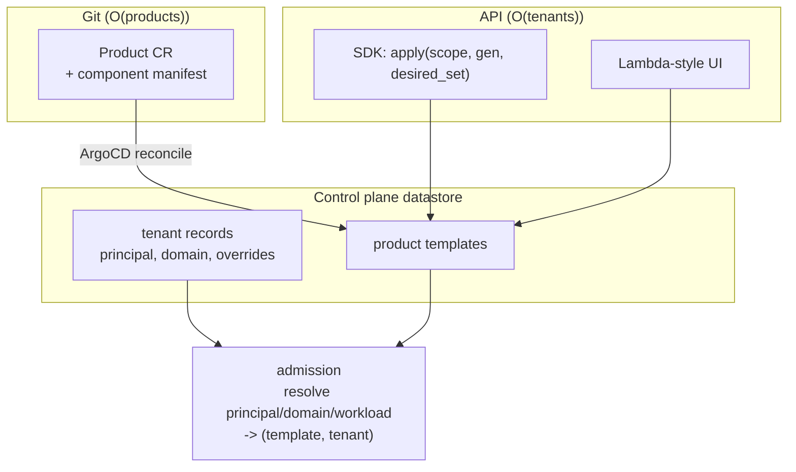

# ADR 024: Identity Hierarchy, Template Composition, and Registration Without Per-Workload CRs

**Author:** jomcgi
**Status:** Draft
**Created:** 2026-07-26
**Supersedes in part:** [022 - Domain-Scoped Service Composition](022-domain-composition-access-fabric.md) (its `domain` boundary and per-workload CR assumption)
**Builds on:** [001 - EmberVM](001-embervm-beam-firecracker-workload-orchestrator.md) (the principal isolation rule), [019](019-op-log-data-structure-payload-separation.md) (principal as the erasure key), [021](021-workload-resource-model-memory-pivot.md) (the single resource dial)

---

## Problem

ADR 022 introduced `domain` as a required boundary without saying whether a domain may span principals. That single omission propagates: same-domain-by-default bindings could cross the one boundary ADR 001 actually enforces, and a domain spanning cells breaks the scoping ADR 020 depends on.

Underneath it is a harder problem ADR 022 does not reach. Its composition model assumes a Workload definition per component per tenant. At the stated target of **100k+ workload definitions**, that assumption fails in three places at once:

1. **etcd.** `WorkloadWatcher` is a Kubernetes informer, and its own documentation says an error triggers "a fresh LIST." etcd compaction routinely invalidates a stale `resourceVersion`, so at 100k CRs a full relist stops being a boot cost and becomes a recurring hazard.
2. **The authoring surface.** Every workload today is a hand-written ~100-line template inside the platform's own Helm chart. That model dies around 10^2 workloads, two orders of magnitude before etcd does, and it means every application change is a platform release.
3. **The definition count itself.** Materialising `products x tenants` definitions is `O(100k)` rows of near-identical config whose only difference is which tenant owns it.

The three are usually treated as one "scale" problem. They are not: the first is a storage-backend choice, the second is a UX failure, and the third is a modelling error.

---

## Decision

Seven decisions.

### 1. The identity hierarchy, with domain contained in exactly one principal

```
Account        deploying customer     billing / grouping, NO isolation semantics
  └─ Product   grouping               naming, NO isolation semantics
      └─ Principal   consuming tenant  ISOLATION BOUNDARY (ADR 001)
          └─ Domain      env or grouping within one principal
              └─ Workload
```

**A domain is contained in exactly one principal.** ADR 022 left this open, and closing it dissolves both of the review findings against that ADR: same-domain-by-default becomes necessarily same-principal, so a binding cannot implicitly cross the isolation boundary, and a domain is cell-confined by construction wherever principal maps to cell.

The rule that generates this: **the isolation unit is whatever must not leak.** ADR 001 defines a principal as "the identity a workload runs as (a tenant, user, or service account)" and pins the no-crossing rule to it. If two consuming customers' data must never mix, they are principals, whatever the product UI calls them.

Domain is complementary rather than redundant, and the reason is worth stating: **ADR 001's isolation rule gives you nothing inside a principal.** Everything one principal owns is mutually reachable as far as the platform is concerned. Domain is the only sub-principal boundary available, which is what makes prod-versus-staging separation expressible at all.

Everything above Principal is grouping and billing with no isolation meaning. This corrects ADR 022's chargeback-at-domain, which belongs at Account.

**Only `principal` and `domain` ship now.** Account and Product are recorded as the shape above so they can be added without moving the isolation level, which is the expensive part to change later.

### 2. Platform workloads live in a reserved platform principal

The Workload CRD carries no `principal` or `tenant` field today: definitions are principal-agnostic, instances are principal-scoped, and that split is load-bearing. One `sandbox-session` definition serves many principals, each with isolated lineage, which is what makes the session class a multi-tenant sandbox surface at all.

Decision 1 makes every workload carry a domain inside a principal, which would leave shared definitions homeless. They are not exempted; they are **owned by a reserved `platform` principal** and made instantiable by others through an explicit broad grant. The hierarchy stays uniform, nothing is principal-agnostic, and "many principals instantiate this" becomes an ordinary wildcard grant rather than a special case.

This also fixes ADR 022's `access.in: workloadRef: {name: agent-session}`, which as written grants access to **every** principal's session instance. ACL entries name `(workload, principal)` for platform definitions and bare `(workload)` for owned ones.

### 3. Stamp only state-owning components

| Component | Per tenant? | Why |
| --------- | ----------- | --- |
| Stateful (a tenant's DB and volume) | **yes** | owns that tenant's data and its lineage |
| Serving / API (stateless per request) | no | one workload, tenant identified per request, instances already principal-scoped |
| Platform (sandbox-session, semgrep) | no | shared definition under the platform principal |

A three-component product at 33k tenants is ~33k workloads, not ~100k. Only the state-owning component multiplies.

### 4. Templates, not stamps

Do not materialise `products x tenants` definitions. Store **one product template** plus **N tenant records** (principal, domain, sparse overrides), and resolve `principal/domain/workload` to `(template, tenant)` **at admission**, which already performs a miss-path lookup. One join, no new path.

The definition store becomes `O(products + tenants)` rather than `O(products x tenants)`, and onboarding a tenant is one row rather than a fan-out. Per-tenant variation is sparse override rows: a tenant taking defaults stores nothing.

### 5. GitOps without per-workload CRs

**GitOps is not CRs.** Git-as-truth, diff-and-converge, and drift detection need a declarative document and a reconciler; they do not need etcd objects. ArgoCD's use of CRs is an implementation choice, not the value it provides.

- **One CR per product**, carrying a manifest of its component definitions. ArgoCD keeps sync state, health, drift detection, and rollback-by-revert. etcd holds `O(products)`, so the informer relist hazard disappears.
- The control plane expands the manifest into CP-datastore definitions, where the `O(tenants)` volume lives.
- **The line: Git owns product shape, the API owns tenant population.** Tenants are runtime data created by signup and were never GitOps material; trying to make them so is exactly what forces etcd to scale with customer count.

### 6. Registration is a desired-set reconcile, and class is inferred

**The SDK submits a complete desired set for a scope, never individual registrations.** Per-item self-registration has no deletion story: nothing distinguishes "removed from code" from "not deployed yet," so removals never happen and orphans accumulate. `apply(scope, generation, desired_set)` is idempotent, monotonic in generation, and converges by diff. Borrow migrations' **version**, not their forward-only once-only semantics; infrastructure wants reconciliation.

Registration authority is scoped to the identity the caller presents, or any workload can define any other.

**One write path, two front doors.** A Lambda-style UI calls the same API the manifest reconciler calls. Build the API first and make Git a client of it, or two sources of truth must later be reconciled against each other.

**Class is inferred from the source shape**, not asked: a handler with no listener is a task, something binding a port is serving, something declaring a volume is stateful. Combined with ADR 021's single resource dial, a developer deploying a function answers no infrastructure questions. Classes become progressive disclosure rather than a required first decision.

Do not import Lambda's *constraints* along with its UX. Its simplicity is downstream of no persistent local state, a hard duration cap, and no addressable instances; ember's session and stateful classes exist to break all three, and ADR 010's warm Bazel heap is structurally impossible on Lambda.

### 7. A guest asserts a ServiceAccount identity; it never holds a cluster credential

A live Kubernetes ServiceAccount token is **not** projected into a guest. The guest is the adversary the microVM boundary exists for, a token in guest memory banks with the snapshot (agents/023's founding argument), and a cluster credential routes around the brokered egress path that is ember's default posture. ADR 001's justification for looser handling on session and serving ("tenant-trusted code") is already weakened by model-authored code landing on the session class, so it cannot carry this.

Instead, two halves:

- **Identity:** an **audience-scoped** projected token (audience `embervm`), valid only against ember's own API. A guest can prove "I am SA X" while holding nothing usable against the Kubernetes API. This reuses Kubernetes RBAC as the source of who-is-who without granting any cluster access.
- **Capability:** the platform holds the real credential and acts on the guest's behalf for named operations, treating the Kubernetes API as another `ServiceRef` target under ADR 022's fabric and agents/023's broker pattern.

This keeps ADR 022's three legs symmetric in *policy* while deliberately asymmetric in *credential holding*: a Service→VM caller is a trusted pod presenting a real ServiceAccount, and a VM→Service guest presents an assertion while the platform presents the credential. One side is trusted and the other is not, and the design should say so rather than treat them alike.

---

## Architecture



etcd holds product shape. The control-plane datastore holds tenant population. Neither grows with the other.

---

## Alternatives Considered

- **Domain as a tenancy boundary (ADR 022 as written).** Rejected: consuming customers inside one principal get no lineage isolation from each other, which is the guarantee they would be paying for.
- **Namespacing every definition by principal.** Rejected: 1,000 principals needing the same ~20 platform workloads is 20,000 near-identical definitions, and it destroys the shared-definition property that makes the session class multi-tenant.
- **Exempting platform workloads from the hierarchy.** Rejected: a required field with an exception is not a required field. A reserved platform principal costs one row and keeps the model uniform.
- **Per-workload CRs with a bigger etcd.** Rejected: the authoring surface fails two orders of magnitude before etcd does, so raising the etcd ceiling buys nothing.
- **Per-workload ClusterIP Services to escape the 10-port stateful ceiling.** Rejected: it reintroduces `O(definitions)` etcd objects plus Cilium programming, the exact wall decision 5 evicts. Name-based L4 (SNI or PROXY-protocol on a few entry ports) is the only remedy consistent with this ADR.
- **Per-item SDK self-registration.** Rejected: no deletion story.
- **Projecting a live Kubernetes ServiceAccount token into a guest.** Rejected; see decision 7 for what replaces it.

---

## Security

Baseline: `docs/security.md`.

- **Principal remains the isolation boundary** and is unchanged by anything above it. Account and Product carry no isolation meaning by construction, so adding them later cannot weaken ADR 001's rule.
- **Erasure follows principal** (ADR 019 makes it the key and `NOT NULL` everywhere). Customer offboarding arrives at Account, so Account-to-principal mapping must exist before ADR 019 moves to Accepted, or offboarding has no defined scope.
- **The platform principal is a privileged identity.** Its broad instantiation grant is the widest grant in the system and should be the most reviewed; it must not become a general-purpose escape hatch for cross-principal access.
- **Registration authority is scoped to the caller's identity**, or the desired-set API becomes a way to define workloads in another principal.
- **Audience-scoped tokens grant identity, not capability.** The distinction is the security decision: assertion of who you are, with no cluster access attached.

---

## Risks

| Risk | Likelihood | Impact | Mitigation |
| ---- | ---------- | ------ | ---------- |
| Hierarchy surfaces in v1 UX and developers answer five identity questions before hello-world | **High** | High | Only `principal` and `domain` ship; both default in a single-tenant deployment; class inference (decision 6) lands before the hierarchy is user-visible |
| Templates make per-tenant debugging harder (no concrete object to inspect) | Medium | Medium | Resolution is deterministic; expose a read API that renders the effective definition for a tenant |
| Stateful per-tenant definitions are needed anyway for volume and generation state | Medium | Low | Then deriving *that* definition buys less; the stateless components still benefit |
| Product CR manifest outgrows the annotation ceiling | Medium | Medium | The 256 KiB `last-applied-configuration` cap already broke the migrations ConfigMap; reference a build artifact if a product's manifest approaches it |
| Two front doors diverge (UI writes state the manifest reconciler then reverts) | Medium | High | One write path is the decision: build the API first, Git and UI are both clients |
| Platform principal becomes a dumping ground | Medium | Medium | Membership is reviewed in Git; a workload in the platform principal is a platform commitment |

---

## Open Questions

1. ~~What `tenant` currently means.~~ **Checked: it is a deployment-level constant, not a per-customer identity.** It defaults to `"homelab"` (`drain_coordinator.ex:56`) and is stamped onto every op from that config. So it already occupies the **Account** slot in decision 1's hierarchy and should be renamed or documented as such rather than repurposed.
2. **Manifest inline in the product CR versus a referenced build artifact.**
3. **Whether the stateful component genuinely needs a stored per-tenant definition**, given its volume and generation are per-tenant durable state regardless.
4. **When `domain` becomes required on existing chart workloads**, versus grandfathering empty as a default.
5. **Migration ordering against ADR 021**, whose CRD steps invest in a per-workload surface this ADR demotes. Adding fields to a CRD that will be hollowed out is churn worth sequencing away.
6. **The name-based L4 mechanism** for the 10-port stateful ceiling (SNI versus PROXY protocol), which this ADR constrains but does not choose.

---

## References

| Resource | Relevance |
| -------- | --------- |
| [ADR 001](001-embervm-beam-firecracker-workload-orchestrator.md) | The principal definition and isolation rule this anchors on |
| [ADR 022](022-domain-composition-access-fabric.md) | The composition model and `domain` boundary this corrects |
| [ADR 019](019-op-log-data-structure-payload-separation.md) | Principal as the erasure key, which Account-level offboarding must map onto |
| [ADR 021](021-workload-resource-model-memory-pivot.md) | The single resource dial that makes class inference sufficient |
| [ADR 020](020-admission-control-plane-token-routing-peer-redistribution.md) | The miss-path lookup that template resolution rides |
| [agents/023](../agents/023-egress-secret-proxy.md) | The broker pattern the audience-scoped token decision follows |
| `projects/embervm/control/lib/embervm/workload_watcher.ex` | The informer whose relist behaviour motivates decision 5 |
| `projects/embervm/chart/values.yaml` | `statefulTcpPortRange` (10 ports) and the per-workload template surface |
| `docs/security.md` | Security baseline |
