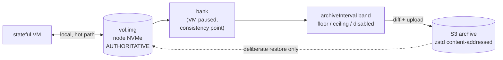

# ADR 025: Local Disk Is Authoritative, S3 Is an Archive, Durability Is an Interval

**Author:** jomcgi
**Status:** Draft
**Created:** 2026-07-26
**Supersedes in part:** [011 - Distribution via Longhorn Volumes](011-distribution-longhorn-fencing-cp-rollouts.md) (the decision to move stateful volumes onto Longhorn RWO node-attach)
**Builds on:** [001](001-embervm-beam-firecracker-workload-orchestrator.md) (volume owns truth, snapshot owns warmth), [008](008-interruptible-bank-stateful-datastores.md) (the abortable bank), [016](016-kubernetes-scheduling-integration-contract.md) (zstd content-addressed session workspaces, the mechanism this reuses), [021](021-workload-resource-model-memory-pivot.md) (one user-facing knob whose units are what the user cares about)

---

## Problem

ADR 011 decided stateful volumes move onto Longhorn RWO node-attach, retiring the custom `vol.img` export. The code has not followed: `noded/volume/volume.go` still says "a stateful workload owns exactly one raw, sparse volume file on node NVMe." So the platform has two storage shapes, and every piece of reasoning about ownership has had to carry both.

That split has been expensive out of proportion to its value. It introduced a per-tier fence argument in [ADR 023](023-class-scoped-ownership-arbitration.md), a fourth placement owner that [ADR 016](016-kubernetes-scheduling-integration-contract.md)'s three-layer contract does not name, and a CSI mount that puts the `noded` pod, a fungible supervisor, into the durability chain.

Re-reading ADR 011's own argument shows the requirement is narrower than the solution:

> R6's custom volume export does not scale. Shipping **whole vol.img files** per changed generation has write amplification that grows with volume size. Every incremental alternative we could build by hand (dm-thin plus thin_delta, content-hash manifests, filesystem send streams) reimplements what Longhorn, already deployed in this cluster, ships as a product: **replication, snapshots, and incremental S3 backup**.

Quoted in full, because the last three words matter: ADR 011 rejected content-hash manifests as reimplementing incremental backup, which is exactly what this ADR now builds. That is a real reversal and it is argued below on cost, not waved away as a misreading.

What this ADR *does* observe is that every alternative ADR 011 weighed is a block-layer mechanism. The question was framed as "how do we ship volume diffs" and answered only at that layer, so the trade between block-level replication and application-cadence archiving was never priced.

**Three ADR 011 properties are given up, and they are named here rather than discovered later:** bounded-seconds automatic failover ("node death stops being an outage"), "a placement move is a copy, never a rebuild" (a move becomes a restore), and ADR 009's R7 premise that cold nodes can wake a stateful workload behind a portable volume.

Two facts make a smaller answer available:

1. **Relight is local on the overwhelming majority of wakes.** A stateful workload banks and relights on the node that already holds its data; S3 is touched only on rotation, failover, or cold start after GC. This is unconditionally true on the current fixed fleet. On a Karpenter-recycled fleet nodes rotate routinely, so it holds only because rotation is *planned* and handled by decision 6's drain rather than by a hot-path storage tier. Remote storage is a backup either way.
2. **Bank is already a consistency point.** The bank pauses the VM, so the volume is quiescent by construction. There is no need to invent a mechanism for taking a consistent point-in-time image; the platform takes one every time a workload goes idle.

---

## Decision

Six decisions.

**1. Local disk is the volume and it is authoritative.** A stateful workload owns a raw sparse file on node NVMe, which is what `volume.go` already implements. Relight reads it locally, needs no network, and needs no arbitration, because there is one node, one copy, and one writer. ADR 011's move to Longhorn RWO is withdrawn.

**2. S3 is an archive, not a hot tier, and it is what makes long resume windows possible.** It is written by content-addressed diff and read only on deliberate restore; nothing on the relight path consults it.

That asymmetry is a product property worth stating. Warm, node-local state is bounded by the 8h continuity window in decision 6. The archive is not: it is what lets a workload be restored days later, matching ADR 016's tiered session contract (8h live with instant relight, a 7-day S3 memory-snapshot resume, a 30-day content-addressed workspace). AWS Lambda MicroVMs "preserves full memory and disk state for up to 8 hours" and that is the whole offer, so **"instant for 8h, restorable for 30 days" is strictly more than the model being copied**, and the extra windows exist precisely because the archive is decoupled from the node.

**3. The archive is written at bank COMMIT, stamped with the committed generation, and serialized against the next `Attach`.** ADR 008's bank is two-phase, so "at bank" is not precise enough to be safe: a diff started at *checkpoint* is torn if the bank aborts and the VM resumes writing at the next generation. Commit alone is also insufficient, because after commit the volume detaches and the next wake may re-attach while a multi-GiB upload is still reading. So the chunk-read pass takes the same exclusion as a writable attach, and a wake that arrives during it either waits or the archive yields, which is a wake-latency cost this ADR accepts and ADR 011's "hot path untouched" invariant does not otherwise permit. A timer-driven diff of a live image is torn across blocks and restores to a corrupt database. The diff is **zstd content-addressed chunks**, which is exactly what ADR 016's 30-day session workspace tier already specifies. This shares zstd, chunk-addressing and S3 plumbing with ADR 016's session workspaces. It is **not** free: see the read-amplification risk below, since a block image is not a file set.

| Class | Trigger | Mechanism | Restore |
| ----- | ------- | --------- | ------- |
| Session workspace | bank | zstd content-addressed chunks to S3 | hydrate |
| Stateful volume | bank | same | same |

**4. `archiveInterval` is a band, and it is the user-facing durability control.** Because every bank is independently consistent, archive cadence can sample banks freely: skipping one costs recency, never correctness. So cadence is an independent knob with no coupling to the consistency mechanism.

| Setting | Effect | For |
| ------- | ------ | --- |
| **Floor** (archive at most every N) | skip intermediate banks | sub-second bankers that would otherwise upload continuously |
| **Ceiling** (archive at least every N, forcing a bank) | create a consistency point | workloads that never idle, so never bank |
| **Disabled** | never archive | workloads with nothing worth preserving |

The floor alone does not rescue a sustained-write workload, because a floor never *creates* a bank; the ceiling is what makes always-on a supported shape rather than an excluded one, at the honest cost of a periodic pause. ADR 008's bank is abortable, so a forced bank under load must be allowed to complete rather than yield, or the archive never advances.

**The user-facing scalar IS the ceiling.** `archiveInterval: 15m` means "I accept losing up to 15 minutes if a node dies," and that semantic holds only for a ceiling: a floor-only workload that stops banking has unbounded, silent loss. The floor is therefore platform-derived rate limiting, not a user knob, and the default is a ceiling rather than absent, because silent no-archive is the dangerous direction. That is a durability question a developer can answer, unlike "Longhorn or local disk," which asks them to reason about storage mechanisms to express the same intent. Following ADR 021's pattern: one knob whose units are the thing the user cares about, with the mechanism derived and platform-side.

**Disabled means node loss is total loss**, stated rather than implied. It is correct for the Postgres demo, which truncates hourly and has nothing to preserve, and it is a setting someone will copy, so its semantic belongs in the schema documentation.

**5. Failover is deliberate, and its data loss is exactly the configured interval.** `stateful_manager.ex` already returns `:volume_node_gone` rather than re-placing onto a node that does not hold the volume. That is non-automatic failover, and for a path where "dead" and "partitioned" are indistinguishable it is the correct choice, not a gap. Restoring elsewhere is an operator action; the two-writer window therefore never opens implicitly.

**6. Node rotation is handled by planned drain, under a continuity contract, scheduled by forecast.** Nodes rotate: EKS consolidation, `expireAfter`, spot notices, and ordinary homelab rebuilds. ADR 016 decision 5 currently rests the stateful lane's durable posture on "state durability, not node pinning... because banked state is HA-durable (Longhorn plus S3)"; this ADR makes state node-local, so that clause is amended by what follows rather than left contradicted.

Drain has two modes with very different costs, and choosing between them is the whole design:

| Mode | When | Sequence | Cost |
| ---- | ---- | -------- | ---- |
| **Idle drain** | workload banked, nothing running | archive already current, copy to new node, repoint anchor, next wake lands there | **RPO 0, zero disruption** |
| **Live drain** | workload running at drain time | final bank, full archive, restore on target, cutover, resume | RPO 0, disruption proportional to volume size |

Both are RPO 0 **only when there is adequate lead time**, because a planned drain always takes a final archive and that archive reads all allocated bytes. A spot notice is two minutes (ADR 009's preemption bound), which is not enough to bank, archive and restore a multi-GiB volume, and forecasting cannot conjure an idle window inside it. **So stateful workloads are excluded from spot capacity**, which narrows ADR 009's two-minute preemption contract for this class rather than meeting it; on any rotation with a two-minute horizon, loss reverts to `archiveInterval` like involuntary node loss. RPO 0 is a property of lead time, not of planning. **The configured `archiveInterval` bounds loss only for *involuntary* node loss**, which is the genuinely unplanned case.

**The continuity contract is a floor, and ADR 016's 8h is a ceiling.** They share a number and mean opposite things: 016 caps how long a session may live continuously, while this guarantees a stateful workload *at least* that much uninterrupted uptime before it may be moved. The 8h figure is chosen for symmetry and is **asserted, not derived**; it should be validated against observed rotation cadence before it is promised to anyone. That is a promise a developer can plan against, and it makes rotation a stated property rather than an incident.

**Forecasting picks the mode.** ADR 016 already makes remaining node lifetime a ledger fact, and ADR 020 already puts forecasting on the control plane. Combining them: for each stateful workload on an expiring node, find its next predicted idle window before expiry and drain into it. Idle drain is free, so the objective is to convert as many rotations as possible into the top row. Falling back to live drain when no idle window is predicted is the honest degradation, not a failure.

| Aspect | ADR 011 as decided | Decided here |
| ------ | ------------------ | ------------ |
| Volume | Longhorn RWO node-attach | raw sparse file on node NVMe (unchanged from today) |
| Remote copy | synchronous replica | asynchronous content-addressed archive |
| Durability control | StorageClass tier | `archiveInterval` band, in units of acceptable loss |
| RPO | ~0, fixed, always paid for | configurable per workload, including none |
| Fence | attach exclusivity | not needed while one node holds one copy; see the partition caveat in Risks |
| Node rotation | volume moves, bounded-seconds failover | planned drain (idle or live), 8h continuity contract, forecast-scheduled |
| Pod in durability chain | yes, via CSI mount | no |
| Placement owners | four (CP, kube-scheduler, Karpenter, Longhorn) | three |

---

## Architecture

The hot path is the top edge alone. Everything below it runs at bank cadence or slower, and the dashed edge runs only on operator action.

---

## Alternatives Considered

- **Longhorn RWO node-attach (ADR 011 as decided).** Withdrawn: its replication buys a fixed RPO≈0 that cannot be opted out of and is paid for by every workload, while bringing CSI, a fourth placement owner, the pod into the durability chain, and a second ownership model. The interval band buys the same property for workloads that want it and nothing for those that do not.
- **Timer-driven diff of a live volume.** Rejected: torn across blocks, restores to a corrupt database. Bank is the consistency point.
- **Copy-on-write snapshots so a busy VM can be archived without pausing.** Deferred, not rejected. It is the only pause-free, engine-agnostic answer, and it is what to build if the ceiling's periodic pause proves unacceptable. It changes the block path, so it is not a small change.
- **Application-level continuous archiving (Postgres WAL shipping).** Deferred: genuinely better RPO with no pause, and the standard model for the engine, but engine-specific. Worth revisiting per-engine once more than one datastore is offered.
- **Whole-file `vol.img` export per generation.** Rejected for the reason ADR 011 gives: write amplification proportional to volume size.
- **dm-thin, btrfs/ZFS send, RWX shared block.** Rejected as in ADR 011; those judgements stand.

---

## Security

Baseline: `docs/security.md`.

- **The archive is a copy of tenant data at rest.** It inherits ADR 019's principal-scoped erasure: archived chunks are keyed by principal so deletion reaches them, and a dedup store must not let one principal's chunk be referenced by another's manifest.
- **Content-addressed dedup across principals is forbidden** for that reason. Dedup is within a principal only, accepting the storage cost, because cross-principal chunk sharing would make one tenant's deletion a reference-counting problem in another's data.
- **`archiveInterval: disabled` is a data-loss posture**, not a performance setting, and should be visible in review rather than buried in values.
- Deliberate failover means restore is an authenticated operator action, which is a smaller surface than automatic re-placement.

---

## Risks

| Risk | Likelihood | Impact | Mitigation |
| ---- | ---------- | ------ | ---------- |
| **After a deliberate failover during a partition there is no fence at all.** An operator cannot distinguish dead from partitioned any better than the CP can, and unlike attach exclusivity nothing invalidates the old node, which keeps acking writes that are later silently discarded | Low | **High** | Bounded by [ADR 023](023-class-scoped-ownership-arbitration.md) decision 3b, which stops a partitioned brick serving **everything** it holds, stateful included, after the silence timeout. Restore-elsewhere must not be offered as routine tooling, and the runbook must state that acked writes on the old node are lost |
| **Archive read amplification is proportional to volume size, not to change.** ADR 016's tier is a ~10MB file set; a stateful volume is one opaque multi-GiB image whose filesystem the host never parses and for which nothing tracks dirty blocks, so every archive reads all allocated bytes to find changed chunks, on the same NVMe as the hot path | High | Medium | Shared zstd and S3 plumbing is genuinely reused; the chunking pass is not. Size it before build; dirty-block tracking via a CoW layer is the escape hatch |
| Chunk store GC is harder than expected (dedup forbids naive delete) | **High** | Medium | Refcount or mark-and-sweep; the cost is shared with ADR 016's session workspaces rather than new, and should be sized before build |
| Someone copies the demo's `disabled` into a workload that matters | High | High | Semantic stated in schema docs; consider requiring an explicit acknowledgement rather than a bare default |
| Forced bank under sustained load keeps aborting (ADR 008) so the archive never advances | Medium | High | A ceiling-forced bank must be non-abortable; otherwise the ceiling is decorative |
| First archive of a large volume is a full upload | High | Low | Expected; schedule the first one off peak |
| Restore time from S3 exceeds tolerable downtime for a large dataset | Medium | Medium | Accepted for the 1% path; if it becomes intolerable that is the signal to revisit CoW or replication |
| Withdrawing ADR 011 orphans its snapshot and backup plumbing | Medium | Low | Longhorn stays deployed for other cluster uses; only the stateful-volume decision is withdrawn |

---

## Open Questions

1. **Chunk store GC design**, shared with ADR 016's workspace tier: refcounting versus mark-and-sweep, and who runs it.
2. **Default `archiveInterval`** for a workload that sets nothing. A safe default is a ceiling, since silent no-archive is the dangerous direction.
3. **Whether the ceiling's forced bank is per-workload or fleet-wide policy**, given it injects latency.
4. **Restore granularity**: whole volume only, or point-in-time selection among archived generations.
5. **Whether any current or planned workload needs a block device without an application-level archiving path**, which is the case that would argue for CoW sooner.

---

## References

| Resource | Relevance |
| -------- | --------- |
| [ADR 011](011-distribution-longhorn-fencing-cp-rollouts.md) | The Longhorn storage decision this withdraws, and the write-amplification argument this answers differently |
| [ADR 016](016-kubernetes-scheduling-integration-contract.md) | The zstd content-addressed workspace tier whose mechanism this reuses |
| [ADR 008](008-interruptible-bank-stateful-datastores.md) | The abortable bank, which a ceiling-forced bank must override |
| [ADR 023](023-class-scoped-ownership-arbitration.md) | Ownership arbitration, whose stateful half this simplifies |
| [ADR 019](019-op-log-data-structure-payload-separation.md) | Principal-scoped erasure the archive must honour |
| `projects/embervm/noded/volume/volume.go` | The volume model this keeps, and the generation ledger as a coherence check |
| `projects/embervm/control/lib/embervm/stateful_manager.ex` | `:volume_node_gone`, deliberate failover as it already behaves |
| `docs/security.md` | Security baseline |

---

## Amendment (2026-07-26)

**Decision 3's table is amended by [ADR 027](027-snapshot-modes-workload-property.md)**: for the `memory: false, filesystem: true` persistence quadrant, the session workspace's archive trigger moves from bank to close (explicit close, destroy, or planned drain), since a workload that declares no memory snapshot never banks. The stateful volume row and the shared zstd content-addressed mechanism are unchanged, and ADR 027 inherits this ADR's cross-principal dedup prohibition for its shared keyspace.
