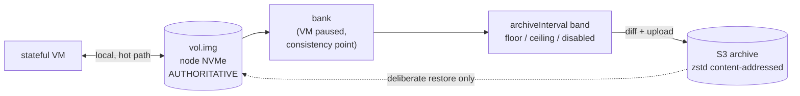

# ADR 025: Local Disk Is Authoritative, S3 Is an Archive, Durability Is an Interval

**Author:** jomcgi
**Status:** Draft
**Created:** 2026-07-26
**Supersedes in part:** [011 - Distribution via Longhorn Volumes](011-distribution-longhorn-fencing-cp-rollouts.md) (the decision to move stateful volumes onto Longhorn RWO node-attach)
**Builds on:** [001](001-embervm-beam-firecracker-workload-orchestrator.md) (volume owns truth, snapshot owns warmth), [008](008-interruptible-bank-stateful-datastores.md) (the abortable bank), [016](016-kubernetes-scheduling-integration-contract.md) (zstd content-addressed session workspaces, the mechanism this reuses), [021](021-workload-resource-model-memory-pivot.md) (one user-facing knob whose units are what the user cares about)

---

## Problem

ADR 011 decided stateful volumes move onto Longhorn RWO node-attach, retiring the custom `vol.img` export. The code has not followed: `noded/volume/volume.go` still says "a stateful workload owns exactly one raw, sparse volume file on node NVMe." So the platform has two storage shapes, and every piece of reasoning about ownership has had to carry both.

That split has been expensive out of proportion to its value. It introduced a per-tier fence argument in [ADR 023](023-class-scoped-ownership-arbitration.md), a fourth placement owner that [ADR 016](016-kubernetes-scheduling-integration-contract.md)'s three-layer contract does not name, and a CSI mount that puts the `noded` pod, a fungible supervisor, into the durability chain.

Re-reading ADR 011's own argument shows the requirement is narrower than the solution:

> R6's custom volume export does not scale. Shipping **whole vol.img files** per changed generation has write amplification that grows with volume size. Every incremental alternative we could build by hand (dm-thin plus thin_delta, content-hash manifests, filesystem send streams) reimplements what Longhorn ships as a product.

The need is **incremental backup without hand-building a diff pipeline**. Replication, mobility, and attach exclusivity arrived as features of the chosen product, not as stated requirements. And every rejected alternative in that ADR is a block-layer mechanism; the question was framed as "how do we ship volume diffs" and only answered at that layer.

Two facts make a smaller answer available:

1. **Relight is local ~99% of the time.** A stateful workload banks and relights on the node that already holds its data. S3 or any remote tier is touched only on failover, deliberate move, or cold start after GC. So remote storage is a *backup*, not a storage tier on the hot path.
2. **Bank is already a consistency point.** The bank pauses the VM, so the volume is quiescent by construction. There is no need to invent a mechanism for taking a consistent point-in-time image; the platform takes one every time a workload goes idle.

---

## Decision

Five decisions.

**1. Local disk is the volume and it is authoritative.** A stateful workload owns a raw sparse file on node NVMe, which is what `volume.go` already implements. Relight reads it locally, needs no network, and needs no arbitration, because there is one node, one copy, and one writer. ADR 011's move to Longhorn RWO is withdrawn.

**2. S3 is an archive, not a tier.** It is written by content-addressed diff and read only on deliberate restore. Nothing on the relight path consults it.

**3. The archive is written at bank, using the mechanism ADR 016 already chose.** Bank pauses the VM, so it is a genuine point-in-time; a timer-driven diff of a live image would be torn across blocks and restore to a corrupt database. The diff is **zstd content-addressed chunks**, which is exactly what ADR 016's 30-day session workspace tier already specifies. This is one durability mechanism serving two classes, not new machinery:

| Class | Trigger | Mechanism | Restore |
| ----- | ------- | --------- | ------- |
| Session workspace | bank | zstd content-addressed chunks to S3 | hydrate |
| Stateful volume | bank | same | same |

This also answers ADR 011's objection on its own terms. It rejected "content-hash manifests" as reimplementing Longhorn, but that judgement was about replacing *replication*. As a backup mechanism, content-addressed chunking is well-trodden, and ember already committed to it for sessions.

**4. `archiveInterval` is a band, and it is the user-facing durability control.** Because every bank is independently consistent, archive cadence can sample banks freely: skipping one costs recency, never correctness. So cadence is an independent knob with no coupling to the consistency mechanism.

| Setting | Effect | For |
| ------- | ------ | --- |
| **Floor** (archive at most every N) | skip intermediate banks | sub-second bankers that would otherwise upload continuously |
| **Ceiling** (archive at least every N, forcing a bank) | create a consistency point | workloads that never idle, so never bank |
| **Disabled** | never archive | workloads with nothing worth preserving |

The floor alone does not rescue a sustained-write workload, because a floor never *creates* a bank; the ceiling is what makes always-on a supported shape rather than an excluded one, at the honest cost of a periodic pause. ADR 008's bank is abortable, so a forced bank under load must be allowed to complete rather than yield, or the archive never advances.

**`archiveInterval: 15m` means "I accept losing up to 15 minutes if a node dies."** That is a durability question a developer can answer, unlike "Longhorn or local disk," which asks them to reason about storage mechanisms to express the same intent. Following ADR 021's pattern: one knob whose units are the thing the user cares about, with the mechanism derived and platform-side.

**Disabled means node loss is total loss**, stated rather than implied. It is correct for the Postgres demo, which truncates hourly and has nothing to preserve, and it is a setting someone will copy, so its semantic belongs in the schema documentation.

**5. Failover is deliberate, and its data loss is exactly the configured interval.** `stateful_manager.ex` already returns `:volume_node_gone` rather than re-placing onto a node that does not hold the volume. That is non-automatic failover, and for a path where "dead" and "partitioned" are indistinguishable it is the correct choice, not a gap. Restoring elsewhere is an operator action; the two-writer window therefore never opens implicitly.

| Aspect | ADR 011 as decided | Decided here |
| ------ | ------------------ | ------------ |
| Volume | Longhorn RWO node-attach | raw sparse file on node NVMe (unchanged from today) |
| Remote copy | synchronous replica | asynchronous content-addressed archive |
| Durability control | StorageClass tier | `archiveInterval` band, in units of acceptable loss |
| RPO | ~0, fixed, always paid for | configurable per workload, including none |
| Fence | attach exclusivity | not needed: one node, one copy, deliberate failover |
| Pod in durability chain | yes, via CSI mount | no |
| Placement owners | four (CP, kube-scheduler, Karpenter, Longhorn) | three |

---

## Architecture

The hot path is the top edge alone. Everything below it runs at bank cadence or slower, and the dashed edge runs only on operator action.

---

## Alternatives Considered

- **Longhorn RWO node-attach (ADR 011 as decided).** Withdrawn: its replication buys a fixed RPO≈0 that cannot be opted out of and is paid for by every workload, while bringing CSI, a fourth placement owner, the pod into the durability chain, and a second ownership model. The interval band buys the same property for workloads that want it and nothing for those that do not.
- **Timer-driven diff of a live volume.** Rejected: torn across blocks, restores to a corrupt database. Bank is the consistency point.
- **Copy-on-write snapshots so a busy VM can be archived without pausing.** Deferred, not rejected. It is the only pause-free, engine-agnostic answer, and it is what to build if the ceiling's periodic pause proves unacceptable. It changes the block path, so it is not a small change.
- **Application-level continuous archiving (Postgres WAL shipping).** Deferred: genuinely better RPO with no pause, and the standard model for the engine, but engine-specific. Worth revisiting per-engine once more than one datastore is offered.
- **Whole-file `vol.img` export per generation.** Rejected for the reason ADR 011 gives: write amplification proportional to volume size.
- **dm-thin, btrfs/ZFS send, RWX shared block.** Rejected as in ADR 011; those judgements stand.

---

## Security

Baseline: `docs/security.md`.

- **The archive is a copy of tenant data at rest.** It inherits ADR 019's principal-scoped erasure: archived chunks are keyed by principal so deletion reaches them, and a dedup store must not let one principal's chunk be referenced by another's manifest.
- **Content-addressed dedup across principals is forbidden** for that reason. Dedup is within a principal only, accepting the storage cost, because cross-principal chunk sharing would make one tenant's deletion a reference-counting problem in another's data.
- **`archiveInterval: disabled` is a data-loss posture**, not a performance setting, and should be visible in review rather than buried in values.
- Deliberate failover means restore is an authenticated operator action, which is a smaller surface than automatic re-placement.

---

## Risks

| Risk | Likelihood | Impact | Mitigation |
| ---- | ---------- | ------ | ---------- |
| Chunk store GC is harder than expected (dedup forbids naive delete) | **High** | Medium | Refcount or mark-and-sweep; the cost is shared with ADR 016's session workspaces rather than new, and should be sized before build |
| Someone copies the demo's `disabled` into a workload that matters | High | High | Semantic stated in schema docs; consider requiring an explicit acknowledgement rather than a bare default |
| Forced bank under sustained load keeps aborting (ADR 008) so the archive never advances | Medium | High | A ceiling-forced bank must be non-abortable; otherwise the ceiling is decorative |
| First archive of a large volume is a full upload | High | Low | Expected; schedule the first one off peak |
| Restore time from S3 exceeds tolerable downtime for a large dataset | Medium | Medium | Accepted for the 1% path; if it becomes intolerable that is the signal to revisit CoW or replication |
| Withdrawing ADR 011 orphans its snapshot and backup plumbing | Medium | Low | Longhorn stays deployed for other cluster uses; only the stateful-volume decision is withdrawn |

---

## Open Questions

1. **Chunk store GC design**, shared with ADR 016's workspace tier: refcounting versus mark-and-sweep, and who runs it.
2. **Default `archiveInterval`** for a workload that sets nothing. A safe default is a ceiling, since silent no-archive is the dangerous direction.
3. **Whether the ceiling's forced bank is per-workload or fleet-wide policy**, given it injects latency.
4. **Restore granularity**: whole volume only, or point-in-time selection among archived generations.
5. **Whether any current or planned workload needs a block device without an application-level archiving path**, which is the case that would argue for CoW sooner.

---

## References

| Resource | Relevance |
| -------- | --------- |
| [ADR 011](011-distribution-longhorn-fencing-cp-rollouts.md) | The Longhorn storage decision this withdraws, and the write-amplification argument this answers differently |
| [ADR 016](016-kubernetes-scheduling-integration-contract.md) | The zstd content-addressed workspace tier whose mechanism this reuses |
| [ADR 008](008-interruptible-bank-stateful-datastores.md) | The abortable bank, which a ceiling-forced bank must override |
| [ADR 023](023-class-scoped-ownership-arbitration.md) | Ownership arbitration, whose stateful half this simplifies |
| [ADR 019](019-op-log-data-structure-payload-separation.md) | Principal-scoped erasure the archive must honour |
| `projects/embervm/noded/volume/volume.go` | The volume model this keeps, and the generation ledger as a coherence check |
| `projects/embervm/control/lib/embervm/stateful_manager.ex` | `:volume_node_gone`, deliberate failover as it already behaves |
| `docs/security.md` | Security baseline |
