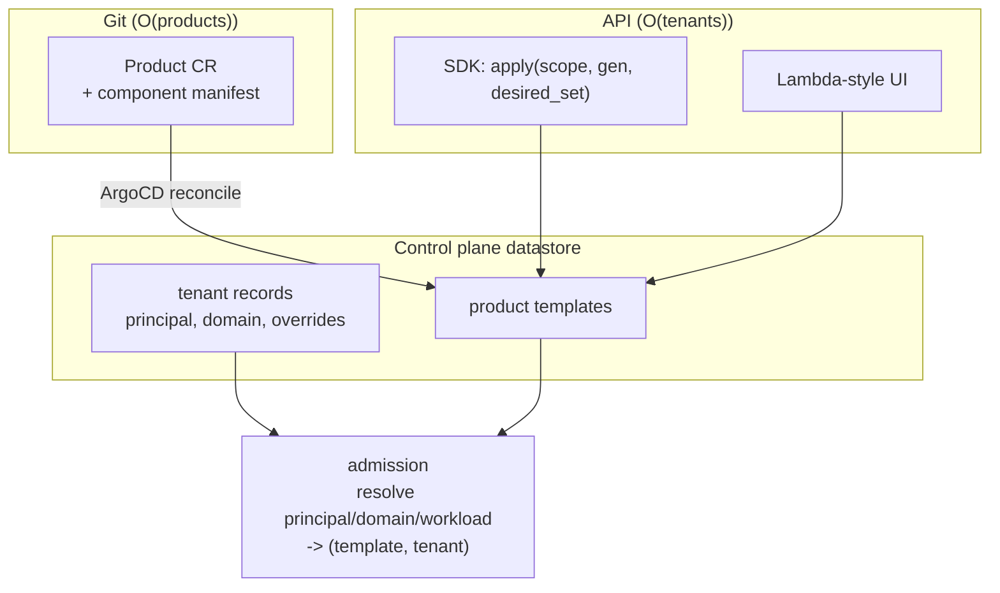

# ADR 026: Template Composition, GitOps Without Per-Workload CRs, and Registration

**Author:** jomcgi
**Status:** Draft
**Created:** 2026-07-26
**Split from:** [024 - Identity Hierarchy and Guest Identity Assertion](024-identity-hierarchy-templates-and-registration.md), which carried both identity and authoring; this takes the authoring half
**Supersedes in part:** [022 - Domain-Scoped Service Composition](022-domain-composition-access-fabric.md) (its per-workload CR assumption)
**Builds on:** [024 - Identity Hierarchy and Guest Identity Assertion](024-identity-hierarchy-templates-and-registration.md) (the identity hierarchy these definitions are named within), [021](021-workload-resource-model-memory-pivot.md) (the single resource dial that makes class inference sufficient), [020](020-admission-control-plane-token-routing-peer-redistribution.md) (the miss-path lookup template resolution rides)

---

## Problem

ADR 022's composition model assumes a Workload definition per component per tenant. At the platform's stated target of **100k+ workload definitions** (an owner-set goal for the EKS-era fleet, not a measured demand) that fails in three places at once, and they are usually conflated as one "scale" problem when they are not:

1. **etcd.** `WorkloadWatcher` is a Kubernetes informer, and its own documentation says an error triggers "a fresh LIST." etcd compaction routinely invalidates a stale `resourceVersion`, so at 100k CRs a full relist stops being a boot cost and becomes a recurring hazard. This is a storage-backend choice.
2. **The authoring surface.** Every workload today is a hand-written ~100-line template inside the platform's own Helm chart, so every application change is a platform release. That model dies around 10^2 workloads, two orders of magnitude before etcd does. This is a UX failure.
3. **The definition count itself.** Materialising `products x tenants` definitions is `O(100k)` rows of near-identical config whose only difference is which tenant owns them. This is a modelling error.

[ADR 024](024-identity-hierarchy-templates-and-registration.md) settles who owns a definition and what it is called. This settles how definitions get in.

---

## Decision

Four decisions.

### 1. Stamp only state-owning components

| Component | Per tenant? | Why |
| --------- | ----------- | --- |
| Stateful (a tenant's DB and volume) | **yes** | owns that tenant's data and its lineage |
| Serving / API (stateless per request) | no | one workload, tenant identified per request, instances already principal-scoped |
| Platform (sandbox-session, semgrep) | no | shared definition under the platform principal |

A three-component product at 33k tenants is ~33k workloads, not ~100k. Only the state-owning component multiplies.

### 2. Templates, not stamps

Do not materialise `products x tenants` definitions. Store **one product template** plus **N tenant records** (principal, domain, sparse overrides), and resolve `principal/domain/workload` to `(template, tenant)` **at admission**, which already performs a miss-path lookup. One join, no new path.

**Vocabulary, against [ADR 024](024-identity-hierarchy-templates-and-registration.md)'s hierarchy.** A "tenant record" here is an **enrollment**: one principal's occupancy of one product. It is not the Account level (billing), and it is not the live `tenant` field in the op-log, which 024 identifies as Account-shaped. Read "tenant" in this ADR as "enrolled principal" throughout.

The definition store becomes `O(products + tenants)` rather than `O(products x tenants)`, and onboarding a tenant is one row rather than a fan-out. Per-tenant variation is sparse override rows: a tenant taking defaults stores nothing.

### 3. GitOps without per-workload CRs

**GitOps is not CRs.** Git-as-truth, diff-and-converge, and drift detection need a declarative document and a reconciler; they do not need etcd objects. ArgoCD's use of CRs is an implementation choice, not the value it provides.

- **One CR per product**, carrying a manifest of its component definitions. ArgoCD keeps sync state, health, drift detection, and rollback-by-revert. etcd holds `O(products)`, so the informer relist hazard disappears.
- The control plane expands the manifest into CP-datastore definitions, where the `O(tenants)` volume lives.
- **The line: Git owns product shape, the API owns tenant population.** Tenants are runtime data created by signup and were never GitOps material; trying to make them so is exactly what forces etcd to scale with customer count.

### 4. Registration is a desired-set reconcile, and class is inferred

**The SDK submits a complete desired set for a scope, never individual registrations.** Per-item self-registration has no deletion story: nothing distinguishes "removed from code" from "not deployed yet," so removals never happen and orphans accumulate. `apply(scope, generation, desired_set)` is idempotent, monotonic in generation, and converges by diff. Borrow migrations' **version**, not their forward-only once-only semantics; infrastructure wants reconciliation.

Registration authority is scoped to the identity the caller presents, or any workload can define any other.

**One write path, two front doors.** A Lambda-style UI calls the same API the manifest reconciler calls. Build the API first and make Git a client of it, or two sources of truth must later be reconciled against each other.

**Class is inferred from the source shape**, not asked: a handler with no listener is a task, something binding a port is serving, something declaring a volume is stateful. Combined with ADR 021's single resource dial, a developer deploying a function answers no infrastructure questions. Classes become progressive disclosure rather than a required first decision.

**Ember's resume window is tiered, and that is a differentiator worth stating rather than an implementation detail.** AWS Lambda MicroVMs "preserves full memory and disk state for up to 8 hours," and that is the whole offer. ADR 016's session contract is three tiers: 8h live with instant relight, a 7-day S3 memory-snapshot resume, and a 30-day content-addressed workspace. Only the first is warm and node-local; S3 is what makes the longer windows possible at all. So the honest framing is "instant for 8h, restorable for 30 days," which is strictly more than the model being copied.

Note also that AWS unifies memory and disk state under one primitive and one number, while ember splits session and stateful into classes with different durability models. Theirs is simpler UX for the Lambda-shaped case, which is exactly the case class inference serves; the divergence should be deliberate rather than accidental.

Do not import Lambda's *constraints* along with its UX. Its simplicity is downstream of no persistent local state, a hard duration cap, and no addressable instances; ember's session and stateful classes exist to break all three, and ADR 010's warm Bazel heap is structurally impossible on Lambda.

---

## Architecture

etcd holds product shape. The control-plane datastore holds tenant population. Neither grows with the other.

---

## Alternatives Considered

- **Per-workload CRs with a bigger etcd.** Rejected: the authoring surface fails two orders of magnitude before etcd does, so raising the etcd ceiling buys nothing.
- **Per-workload ClusterIP Services to escape the 10-port stateful ceiling.** Rejected: it reintroduces `O(definitions)` etcd objects plus Cilium programming, the exact wall decision 3 evicts. Name-based L4 (SNI or PROXY-protocol on a few entry ports) is the only remedy consistent with this ADR.
- **Per-item SDK self-registration.** Rejected: no deletion story. Nothing distinguishes "removed from code" from "not deployed yet," so removals never happen and orphans accumulate.
- **Stamping every component per tenant.** Rejected by decision 1: only state-owning components multiply, so a three-component product at 33k tenants is ~33k workloads rather than ~100k.

---

## Security

Baseline: `docs/security.md`.

- **Registration authority is scoped to the caller's identity**, or the desired-set API becomes a way to define workloads inside another principal. This is the single most security-relevant property here, and it depends on ADR 024's hierarchy being in place first.
- **Templates do not weaken isolation.** Resolution is per-tenant and the resulting definition carries that tenant's principal, so ADR 001's no-crossing rule is unaffected by the definition being derived rather than stored.
- **A product manifest is a privileged document**: it defines what a whole product's components are, so its review path is the security boundary for everyone deploying under it.

---

## Risks

| Risk | Likelihood | Impact | Mitigation |
| ---- | ---------- | ------ | ---------- |
| Templates make per-tenant debugging harder, since there is no concrete object to inspect | **High** | Medium | Expose a read API that renders the effective definition for a tenant; resolution is deterministic, so this is a view rather than a reconstruction. |
| Product CR manifest outgrows the annotation ceiling | Medium | Medium | The 256 KiB `last-applied-configuration` cap already broke the migrations ConfigMap; reference a build artifact if a manifest approaches it |
| Two front doors diverge, with the UI writing state the manifest reconciler then reverts | Medium | High | One write path is the decision: build the API first, Git and UI are both clients |
| Stateful per-tenant definitions are needed anyway for volume and generation state | Medium | Low | Then deriving *that* definition buys less; the stateless components still benefit |
| Class inference guesses wrong and a developer cannot tell why | Medium | Medium | Inference must be inspectable and overridable; a silent wrong guess is worse than a required field |

---

## Open Questions

1. **Manifest inline in the product CR versus a referenced build artifact.**
2. **Whether the stateful component genuinely needs a stored per-tenant definition**, given its volume and generation are per-tenant durable state regardless.
3. **Migration ordering against ADR 021**, whose CRD steps invest in a per-workload surface this ADR demotes. Adding fields to a CRD that will be hollowed out is churn worth sequencing away.
4. **The name-based L4 mechanism** for the 10-port `statefulTcpPortRange` ceiling (SNI versus PROXY protocol), which this ADR constrains but does not choose.
5. **Whether the effective-definition read API is a decision rather than a mitigation.**

---

## References

| Resource | Relevance |
| -------- | --------- |
| [ADR 024](024-identity-hierarchy-templates-and-registration.md) | The identity hierarchy definitions are named within |
| [ADR 022](022-domain-composition-access-fabric.md) | The composition model and per-workload CR assumption this corrects |
| [ADR 021](021-workload-resource-model-memory-pivot.md) | The single resource dial that makes class inference sufficient |
| [ADR 016](016-kubernetes-scheduling-integration-contract.md) | The tiered session contract behind the resume-window comparison |
| [ADR 010](010-bazel-skyframe-snapshot-query-demo.md) | The warm Bazel heap that is structurally impossible on Lambda |
| `projects/embervm/control/lib/embervm/workload_watcher.ex` | The informer whose relist behaviour motivates decision 3 |
| `projects/embervm/chart/values.yaml` | The per-workload template surface this retires |
| `docs/security.md` | Security baseline |
