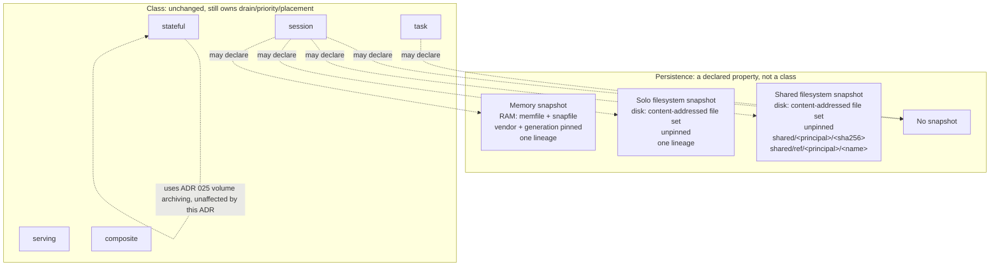

# ADR 027: Snapshot Modes as a Workload Property: Memory, Solo Filesystem, Shared Filesystem, None

**Author:** Joe McGinley
**Status:** Draft
**Created:** 2026-07-26
**Amends:** [ADR 016](016-kubernetes-scheduling-integration-contract.md) decision 6 (the session durability ladder: capture cadence, retention, the workload-namespacing keyspace, and the workspace size ceiling); [ADR 025](025-local-disk-authoritative-s3-archive-interval.md) decision 3's table (the session workspace's archive trigger moves from bank to close for the `memory: false, filesystem: true` quadrant)
**Builds on:** [ADR 025](025-local-disk-authoritative-s3-archive-interval.md) (zstd content-addressed archiving, the mechanism this reuses)

---

## Problem

Ember's workload classes (task, session, serving, stateful, composite) each bundle a persistence decision into the class itself: task never persists, session persists RAM via memory snapshot, stateful owns a local volume. That coupling has started to strand a real shape of demand: a workload that wants disk-backed resume with **no** memory snapshot, or wants a filesystem artifact **shared** across workloads rather than owned by one lineage. Today those requests have no class to land in; the honest answer is "add a class," which is exactly the explosion ADR 013 rejected for size and lane dimensions and should not be re-litigated per persistence shape either.

The shapes latent in this repo's decisions and code are not four independent modes; they are the cross product of two orthogonal booleans, and the honest encoding is the flags rather than an enum:

```
persistence:
  memory: true | false
  filesystem:
    enabled: true | false
    scope: solo | shared
    retention: latest + N          # solo scope only; see decision 3 for shared
```

| memory | filesystem | Is |
| ------ | ---------- | -- |
| off | off | task class today |
| on | on | session class today (ADR 016 captures the workspace eagerly at every bank) |
| off | on | the new mode: application-level resume, no memfile |
| on | off | memory-only, no durable workspace |

**`scope` is an attribute of the filesystem artifact, not a third persistence mode.** This is the same pinning derivation that explains why the space is a 2x2 rather than a 2x3: ADR 016 ties the memory tier to CPU vendor and base generation, and separately observes that the workspace tier "pins nothing against GC, so it survives base digest churn, kernel upgrades, and vendor migration." A vendor- and generation-pinned artifact cannot be handed to an arbitrary consumer without smuggling placement constraints into a supposedly opaque blob; an unpinned one can. Shareability therefore only ever appears on the filesystem row, and it appears as an attribute of that row (`scope: shared`), never as a memory-snapshot variant and never as an independent third flag.

Reframing persistence as two orthogonal declared flags, rather than a class property, lets a consumer pick durability and shareability independently of workload shape, and lets Ember add the two missing quadrants (`off/on` and, within `on`, `shared`) without adding new classes.

---

## Decision

**Persistence becomes two orthogonal declared flags (`memory`, `filesystem`, the latter carrying `scope` and `retention`), decoupled from class.** A workload declares the quadrant it wants; class continues to determine drain behavior and priority posture for every class this ADR does not touch. Whether class still needs to carry network topology and placement as independent axes once persistence is factored out, specifically whether task and session remain distinct classes at all, is not settled here; see the open question below, which is left genuinely open rather than resolved in this ADR's favor.

This requires four specific amendments to ADR 016 decision 6, each argued on what the decision already concedes rather than asserted fresh.

### 1. Capture decouples from bank; it may happen at close instead

ADR 016 states the workspace is "captured eagerly at every bank" as a piggyback on the memory-snapshot cadence. That coupling is only free when a memory snapshot is already being taken; it is not a requirement of the filesystem tier itself, and ADR 016 already names the case where the coupling is unnecessary: "in-memory state is gone, and a coding session does not need it," because the application owns its own resume (goose `--resume`, a build cache, a WAL replay). For that workload the memory snapshot is pure overhead, capturing state nothing will ever restore from.

**Capture moves to session close/destroy**, with the memory-snapshot leg becoming optional rather than mandatory. This is what makes "solo filesystem snapshot, no memory snapshot" reachable as a mode: a workload declares it wants the workspace tier and not the bank tier, and pays for exactly one capture per lineage lifetime instead of one per bank. **"Close" means three concrete triggers**, stated so the term is not left to mean whatever the reader assumes: explicit close (the workload's own protocol signals it is done), destroy (the platform tears the workload down), and planned drain (ADR 025 decision 6's node-rotation drain). All three give the guest a bounded window to act; none is the instantaneous loss of an unplanned node death, which is the case captured state cannot help with regardless of cadence.

**Capture at close needs guest cooperation inside a bounded window, and that window is `terminationGracePeriodSeconds`,** the same grace period ADR 016 decision 2 already requires every consolidation-compatible brick type to drain within. A workload that declares a large amendment-4 budget is declaring a capture (pack, hash, export) that must complete inside that same window; a budget sized for storage convenience but not checked against the grace period can make close itself fail to finish, which is a real interaction between the two amendments and is recorded here rather than left implicit.

**The cost that does not disappear, and is worse than "loses one turn" for this ADR's own stated non-graph beneficiaries:** for a graph-orchestrator consumer a close happens after every node execution, so involuntary loss (a crash, an unplanned node death, anything that is not one of the three triggers above) costs at most one turn. But a build cache, a scraper, or a WAL-replay app, the workloads this ADR names as the generic case for filesystem-without-memory persistence, may run for hours between closes, so for them involuntary loss is **unbounded in time**, not interval-bounded, exactly the shape ADR 025 already solved once for stateful volumes with its `archiveInterval` ceiling ("workloads that never idle, so never bank" force a periodic consistency point at the cost of a periodic pause). This ADR cites ADR 025's declared-scalar discipline for `N` (amendment 2) and the size budget (amendment 4) but, left uncorrected, would omit it exactly where the shape matches best. **Close-only capture is recorded as the deliberate v1 posture, not the complete answer:** it is the shape the goosecracker reference implementation exercises on the guest side (a bounded, guest-cooperated export at a known point), and it ships the reachable mode without inventing a second capture path. An optional forced-capture ceiling, mirroring `archiveInterval`'s ceiling for long-lived lineages that never close on their own, is named as follow-on work rather than designed here (see Open Questions).

### 2. Retention becomes `latest + N`, not latest-only

ADR 016 specifies "retention is latest-only per session lineage." A consumer that wants retry isolation or replay (rerun node 3 of a graph against the same starting artifact after node 4 failed) needs more than one retained ref; latest-only means the retry input is already gone by the time the retry is attempted.

**Retention becomes a bounded, declared count `N` per lineage, with a default, rather than a fixed 1.** ADR 016's own argument for why this is cheap survives unchanged: "content-addressing makes successive captures near-free," a property of the storage mechanism, not of how many generations are kept. So this is a retention-policy change, not a mechanism change. It is not free at the margin: `N` retained immutable refs is `N`x the steady-state storage and `N`x the GC bookkeeping (each generation needs its own liveness check rather than one "is this the latest" test), and `N` is exactly the knob ADR 025's `archiveInterval` pattern argues for: a bounded, user-facing scalar rather than an unbounded "keep everything," because unbounded retention is the same silent-cost failure mode ADR 025 named for `archiveInterval: disabled` in the opposite direction.

### 3. A shared, workload-independent keyspace, admitted deliberately against a stated invariant

Every artifact key in `noded/server/store.go` is namespaced by workload today, and that is not an accident: `artifactPrefix`'s doc comment states the isolation property directly, that a key composes as `<kind>/<vendor>/<workload>/<ref>` and returns empty rather than an ambiguous key when the workload is unresolved. A shared filesystem snapshot needs a ref that is addressable by many workloads, which means either puncturing that invariant or building a second store. Building a second store to avoid amending one function's contract is the wrong side of that trade; the invariant is amended, named here rather than left as quiet drift.

**The shared mode keys as `shared/<principal>/<sha256>`, scoped within a principal by default, not a bare `shared/blob/<sha256>` open across the whole store.** An earlier draft of this decision used the bare form and was wrong: ADR 025's security section is explicit that "archived chunks are keyed by principal so deletion reaches them, and a dedup store must not let one principal's chunk be referenced by another's manifest," and states plainly that "content-addressed dedup across principals is forbidden," because "cross-principal chunk sharing would make one tenant's deletion a reference-counting problem in another's data." ADR 019 decision 4 encodes the same rule as a schema invariant, tracing it to ADR 001's standing isolation rule that "no VM and no snapshot lineage ever crosses a principal." A bare digest key with no principal segment is exactly the cross-principal dedup surface those ADRs forbid: any principal that learns the digest can read another principal's blob, and one principal's erasure becomes an unbounded reference-counting problem across every other principal's manifests. That is a direct conflict with an ADR this record claims to build on, not a stylistic gap, so the principal segment is adopted as the default here, not reserved as an optional escape hatch.

**Within a principal, the digest is still the capability.** Ember does one cheap check, that the caller's principal matches the key's principal segment, and requires no further understanding of what the consumer is doing with the blob; knowing the digest remains sufficient authorization for any workload sharing that principal. Cross-principal sharing is not offered by this mechanism at all: a consumer that genuinely needs a handoff across principals needs an explicit, audited export step outside the shared keyspace, which this ADR does not design. This is a smaller exception than it first reads: VOLUME artifacts already opt out of only the *vendor* segment for portability (`artifactVendorSegment` carves that exception for one kind, keeping `volume/<workload>`), while the shared keyspace drops the *vendor and workload* segments and substitutes a *principal* segment; it is a bigger departure from `artifactPrefix`'s workload-namespaced default than the VOLUME precedent it echoes, and is stated as such rather than implied to be the same size of exception.

Alongside the blob, an optional small mutable pointer object, `shared/ref/<principal>/<name>`, containing a digest, gives "pull the latest X" semantics within a principal without making the blob itself mutable. The split matters operationally: concurrent producers race on a compare-and-swap over a few bytes (the pointer), never on last-writer-wins clobbering of a multi-megabyte blob.

The weakness that survives principal-scoping is named rather than discovered later: **digest-as-capability has no revocation within a principal.** Once a consumer holding that principal's credentials learns a digest, Ember cannot un-know it, and a digest that leaks into logs, traces, or metrics is a live capability leak with no cleanup mechanism short of deleting the blob for every holder in that principal. Principal scoping is a real mitigation, not a full fix: it bounds the blast radius to one principal's own workloads rather than leaving it platform-wide, which is the difference between a leak inside a tenant's own boundary and a leak across tenants. With the principal segment adopted here as the default, there is no further escape hatch held in reserve; the remaining risk is recorded in Security and Risks rather than deferred to a later variant.

### 4. The workspace size ceiling relaxes from a hard platform cap to a declared soft budget

ADR 016 sizes the workspace tier at "order 10MB, cap enforced." Nowhere does ADR 016 state that figure is derived from capture frequency; that reading is this ADR's own inference, and ADR 016's text partly cuts against it, since it separately notes "content-addressing makes successive captures near-free," which undercuts a frequency-based justification for the number rather than supporting one. The honest and stronger basis for revisiting the cap is that **ADR 016 already left it open**: open question 3 asks explicitly "whether the cap is a registered value under a platform ceiling like session duration," which is precisely the shape this amendment adopts. This amendment answers that open question rather than re-deriving the number from a frequency argument ADR 016 never made.

**What justifies moving off a hard number at all:** capture and hydrate latency sit on the critical path in both directions, packing and hashing at close, unpacking at start, and for a consumer chaining workloads that is dead time between one workload finishing and the next starting on every handoff. Content-addressed chunking softens repeat cost (successive captures are near-free once the store has seen the chunks), but a first capture or a mostly-changed multi-gigabyte artifact is real seconds per traversal, not a rounding error, so the bound stays worth having; it just does not need to stay fixed at one number for every declared quadrant.

**So the hard platform ceiling is replaced by a per-workload declared soft budget**, whose stated purpose is bounding latency, not bounding storage cost. A workload that has a reason to need a larger artifact declares a larger budget; the default stays small enough that an accidental capture of something unintentionally huge is caught as a declared-budget violation rather than silently paid for on every handoff. This is the same discipline this ADR already applies to `latest + N` and ADR 025 applies to `archiveInterval`: a bounded, declared, user-facing scalar with a sensible default, never unbounded by omission.

**The budget must be cadence-aware, or it reopens the exact write-amplification cost a hard cap was originally holding down.** The `on/on` quadrant (memory-snapshot-plus-workspace, session class today) still captures the filesystem artifact at every bank, unchanged by this amendment; if the same larger budget were the default there too, a workload that banks often would pay a large per-bank capture cost that amendment 1's decoupling does nothing to prevent, because amendment 1 only changes cadence for the `filesystem: true, memory: false` quadrant. So the default budget is smaller for quadrants that still capture on the bank cadence (`on/on`, and `on/on` with `scope: shared`, whose filesystem leg also rides the bank cadence and inherits the same smaller default) than for quadrants that capture once at close (`off/on`, in either scope); a workload can still declare a larger budget on the bank-cadence quadrants, it is simply not the default, and doing so is a declared, reviewable choice to accept per-bank cost rather than an accident of raising one global number.

This amendment and the shared-keyspace amendment reinforce rather than compose independently: a 10MB ceiling makes cache-class seeding, build caches, package trees, anything running to hundreds of MB, impossible in practice, so relaxing the bound is what makes `scope: shared` artifacts useful for more than small state handoff between pipeline stages. Without this amendment, decision 3's shared keyspace would be correct in shape and useless in the size range that motivates sharing in the first place.

### Summary of the quadrants as declared flags

| `memory` | `filesystem.enabled` | `filesystem.scope` | Capture point | Retention | Keyspace | Pinning |
| -------- | --------------------- | ------------------- | -------------- | --------- | -------- | ------- |
| off | off | n/a | never | n/a | n/a | n/a |
| on | on | solo | every bank | latest-only (memory), latest + N (filesystem) | workload-namespaced | memory: CPU-vendor, base-generation; filesystem: none |
| off | on | solo | close/destroy | latest + N | workload-namespaced | none |
| off | on | shared | close/destroy | see note below (not `latest + N`) | `shared/<principal>/<sha256>`, `shared/ref/<principal>/<name>` | none |
| on | on | shared | every bank | memory: latest-only; filesystem: see note below | memory: workload-namespaced; filesystem: `shared/<principal>/<sha256>`, `shared/ref/<principal>/<name>` | memory: CPU-vendor, base-generation; filesystem: none |
| on | off | n/a | every bank | latest-only | workload-namespaced | CPU-vendor, base-generation |

**`scope: shared` is offered whenever `filesystem.enabled` is true, independent of `memory`.** An earlier draft of this table excluded `memory: on` plus `scope: shared` on the grounds that the pinning argument forecloses it; that was wrong, and conflated the two artifacts. The pinning derivation rules out sharing the *memory* artifact (vendor- and generation-pinned, so unsafe to hand to another workload's placement); it says nothing about the *filesystem* artifact a memory-banking workload also happens to produce. An interactive session that stays warm via memory banking while also publishing a shared filesystem artifact (a build cache, a warmed dependency tree) for other workloads to read is coherent, is plausibly the first thing a non-graph consumer of this ADR wants, and is offered as the fifth row above rather than excluded on a premise that does not actually apply to it. `scope` genuinely is an attribute of the filesystem artifact alone, exactly as stated; the fix is applying that consistently rather than smuggling the memory artifact's constraint back in through the combination.

**Retention for `scope: shared` is not `latest + N`,** and the table says so rather than reusing the per-lineage knob past where it means anything. `latest + N` is defined per session lineage, and a shared blob has no lineage: it may be referenced by many workloads' `shared/ref/<principal>/<name>` pointers simultaneously, with no single owner whose "latest" the count is relative to. What retention means for the shared tier, and how it is garbage collected at all given that digest-as-capability gives Ember no signal for who still holds a reference, is not resolved here; it is recorded as an open question below rather than papered over with a knob borrowed from a different data shape.

---

## Storage semantics against ADR 025: a different point in the space, not a contradiction

ADR 025 governs stateful volumes: local NVMe is authoritative, S3 is a content-addressed archive read only on deliberate restore, and both session workspace and stateful volume already share one archiving mechanism (ADR 025's own table lists them side by side: same trigger, same zstd content-addressed mechanism, same restore path). That unification continues to hold here rather than being disturbed by it.

The apparent tension, "isn't a filesystem-snapshot-only workload violating local-is-authoritative by having no local copy at all," dissolves once the premise is stated: **ADR 025's local-authoritative claim is about a workload that has a local persistent volume to be authoritative over.** A session-class workload with no writable disk (see the implementation gap below) has none; for it, the artifact in S3 (or the shared blob store) is the only copy that has ever existed, so there is no local claim for it to conflict with. Both mechanisms are the same tool applied to different objects: one to a volume that already lives on NVMe, one to a scratch drive whose entire purpose is to be captured once and then discarded.

---

## Implementation gap: what is decided here versus what exists

A code sweep establishes the gap between decided and built honestly, rather than assuming the mechanism already exists because ADR 016 already named it:

- **`/shim/hydrate` exists but is build-time only, zip-only, and unpacks to `/tmp/ember-app`** (`noded/vsockhttp/transport.go:217-266`, `runtimes/python/shim.py`). ADR 016 already names "the zip-hydration VSOCK path pointed at a workspace" as the intended restore mechanism; the gap is making it reachable at session *start* rather than only at build.
- **There is no capture path at all.** No `/shim/dehydrate`, no guest-to-host bulk stream. What Ember exports today is opaque block and memory images through `enumerateArtifactFiles` (`noded/server/store.go:345`), which walks a bundle directory of snapfile/memfile/sidecars; it has nothing to walk for a workspace that was never captured because none was ever asked for.
- **Session-class VMs have no writable disk to capture from.** Rootfs is read-only (`noded/cmd/main.go:400`, `RootfsReadOnly: true`), and the volume drive is stateful-only: the driver's own comment on the third-drive attach reads "Empty for every task/session/serving boot, so their drive set is unaffected" (`noded/fcvm/driver/driver.go:918`). A session's writable space today is tmpfs, i.e. RAM, which is exactly why a session capture without a memory snapshot has nothing durable to read from.

**Recommended capture mechanism** (offered as the cheapest shape, not mandated in detail here): give task/session class a **writable scratch drive**, the guest packs its declared file set onto it, and the host reads, hashes, and exports through the existing artifact path. This reuses `PutDrive` with `IsReadOnly: false` exactly as the stateful volume attach already does (`noded/fcvm/driver/driver.go`), and reuses guest-init's existing mkfs-if-blank-plus-mount behavior rather than inventing a new vsock bulk protocol. It is also the safe combination by construction: the driver carries a comment warning of a block-device snapshot-backing-dependency bug class for drives on snapshotted boots, and a workload with no memory snapshot never takes that boot path, so the no-memory-snapshot mode sidesteps that bug class entirely rather than needing to be tested against it.

---

## Reference implementation: what it actually proves, and what it does not

`projects/firecracker/goosecracker/guest-init/internal/handler/handler.go` implements the application-level-resume shape this ADR wants for Ember, and it is real evidence, but its scope needs to be stated precisely rather than generously. It optionally hydrates a prior `sessions.db` supplied on the *request body* (the `SessionDb` field), runs `goose run --resume`, and exports the updated database back in the *response body* (`AgentResult.SessionDb`), which the calling *orchestrator*, not the platform, persists between turns. So this is guest-application-level resume with zero platform storage involvement: the guest never talks to a store, and neither does noded.

**What that proves, and it is worth having**: file-based resume (no VM snapshot needed) works for a real interactive agent workload, and the goosecracker spike went further than goose's own docs claim, showing the database is fully portable across a wiped environment. That validates the resume *mechanism* this ADR's application-level workloads would use once hydrated. It is not new validation, either: agents/ADR 026 already proved the same file-based resume claim independently in its own spike; goosecracker's handler is a second, real-world exercise of an already-proven mechanism, not a first proof.

**What it does not prove, and this ADR should not claim it does**: every piece of the implementation gap section above (the scratch-drive capture, the capture path itself, start-time hydration, the shared store, the manifest allowlist, GC) is Ember-platform surface that goosecracker's request/response round-trip never touches, because goosecracker has no platform-side store to touch. The earlier framing, "a migration of a proven pattern into the platform, not a novel build," overstated this. The accurate claim: **the guest-side resume semantics are proven by a real, independent workload; the entire Ember-side capture-and-store surface this ADR proposes is new and unvalidated.**

---

## Guest-side shim tooling: offer the contract, do not hand-roll it per workload

`handler.go` is direct motivating evidence for a second gap, not just a mechanism to copy: goosecracker hand-rolled its own hydrate, export, and `goose run --resume` wiring, at the application layer, because Ember offered it nothing to build on. The next workload that wants filesystem persistence would hand-roll the same thing again, one layer down in a different language, with its own bugs. Ember already ships per-runtime guest-inits and a shim (`runtimes/python/shim.py`), and already has a host-to-guest cold-boot config channel (`ember.env.<KEY>=<base64url(value)>` kernel boot-arg tokens, rendered by `noded/fcvm/driver/driver.go`'s `mmdsEnvBootArgs`), so there is an established place to put a contract along the lines of: your prior filesystem state is hydrated at `$EMBER_WORKSPACE` before your handler runs, and on close you pack a declared manifest of paths back into an artifact.

Two constraints, stated because getting either wrong reopens a problem this ADR otherwise closes:

- **The shim contract must be offered, not mandated.** Requiring every guest to speak it constrains which images can run on Ember at all, which is a strictly worse position than today's opaque-image contract (ADR 001: "listen on the declared port, answer a health path. No SDK, no framework"). `shim.py` already has the precedent for this shape: a `bootstrap` executable in the archive root lets an image exec past the Python shim entirely and own serving the contract itself (`_find_bootstrap`, `exec_bootstrap`). The filesystem-persistence contract is the same kind of opt-in convenience, not a new mandatory surface.
- **The manifest must be an allowlist, not a denylist.** A workload declares which paths participate in the artifact; anything undeclared never leaves the guest, by construction rather than by best-effort exclusion. The security reason to prefer this over "capture everything except X" is direct: a denylist means a credential path a workload forgot to exclude is silently captured into an artifact that outlives the VM, and a snapshot at rest is a leak amplifier compared to the live credential it copied, since the artifact persists and gets replicated/archived long after the credential's original validity window. An allowlist makes "did this artifact capture a secret" a question answerable by reading the manifest, not by auditing the filesystem after the fact.

---

## Reserved, deliberately not decided: artifact-affinity placement

"Place this workload where its filesystem artifact is already warm (same node, no S3 round-trip)" is the natural placement companion to shared snapshots, and it is genuinely attractive: it turns a shared-artifact handoff between pipeline stages into a local read instead of a fetch. It is reserved rather than decided here, following ADR 016's own "Reserved options, deliberately not built" convention (section 7): artifact-affinity is a CP placement concern with its own tradeoff against pack-to-empty bin-packing (ADR 016 decision 4: placement already prefers the fullest viable brick; affinity pulls in the opposite direction, toward wherever the data sits), and deciding that tradeoff here would pull a full placement-policy question into a persistence-property ADR. Recorded so it is a known next design, not a reinvention, the day a consumer's latency profile actually needs it.

---

## Boundary rule: Ember does not know about git, and must not learn

The git mirror lives at `projects/firecracker/git-mirror/` (agents/ADR 041), reached by the *guest* over allowlisted egress, and that ADR states the boundary explicitly: the substrate "boots an opaque rootfs... never learning there is a git mirror," with the consuming layer owning provisioning. Ember's contract stops at content-addressed filesystem artifacts; it must not grow an opinion about what is inside one.

There is a terminology hazard already live across the two systems and worth naming so it does not erode the boundary by accident: **Ember hydrates an artifact; the agent layer clones a repo.** Both are currently called "hydration" in their respective codebases, but they are different verbs at different layers, and keeping them textually distinct in Ember's own docs and code is what keeps the boundary from quietly blurring into "Ember understands repos."

One consequence of this split is worth stating because it bounds the size problem rather than creating one: because the repo itself arrives from the mirror at hydrate time, sub-second even for large repos per the mirror's own numbers, the Ember-owned filesystem artifact carries only session state and outputs, not the repo. That keeps a solo session-state artifact at the small end of amendment 4's declared budget range by default, rather than the artifact silently becoming a repo-sized object that needs the larger budget cache-class shared artifacts now can declare, the day someone forgets the split exists.

---

## Motivating consumer (context only)

The requirement surfaced from a deterministic graph agent orchestrator whose nodes are CLI coding agents in isolated Ember sandboxes, passing content-addressed state refs between nodes; retry-with-replay is exactly the `latest + N` case, and cross-node state sharing is exactly the shared-filesystem case. That orchestrator is a *client* of Ember and appears here only as motivation; nothing about its design belongs in Ember's contract. The generic value stands without it: any workload with an application-level resume path wants filesystem-without-memory persistence, and any multi-consumer pipeline wants a shared, content-addressed handoff.

---

## Architecture



---

## Alternatives Considered

| Alternative | Rejected because |
| ----------- | ----------------- |
| A new workload class per persistence shape (e.g. "scratch-session", "shared-artifact") | Repeats the class-explosion pattern ADR 013 already rejected for size and lane dimensions; persistence is orthogonal to everything class already governs (drain, priority, placement, and network topology for serving) and does not need its own class |
| Six modes (a shared variant of memory snapshot too) | Rejected on the pinning argument: a CPU-vendor and base-generation pinned artifact cannot be handed to an arbitrary consumer without smuggling placement constraints into what is supposed to be an opaque blob |
| Keep capture strictly coupled to bank, offer only the memory-snapshot-plus-workspace pairing ADR 016 already decided | Leaves the no-memory-snapshot mode unreachable, which is the mode the motivating consumer actually needs; the coupling was a piggyback convenience, not a requirement of the filesystem tier |
| A second store for shared artifacts, keeping the workload-namespace invariant untouched | Avoids amending one documented invariant by building and maintaining an entire parallel storage path; worse trade than naming the amendment |
| A bare cross-principal `shared/blob/<sha256>` keyspace, principal-scoping reserved as a later escape hatch | Rejected on review: directly conflicts with ADR 025's security section ("content-addressed dedup across principals is forbidden") and ADR 019 decision 4's schema-level encoding of ADR 001's no-cross-principal isolation rule; not a namespace convenience question but a standing platform invariant this ADR would otherwise have broken |
| Unbounded retention ("keep everything") instead of `latest + N` | Same silent-cost failure mode ADR 025 named for `archiveInterval: disabled`, just in the storage-growth direction instead of the data-loss direction |
| VM snapshot-resume as the mechanism for the no-memory-snapshot case | Contradiction in terms: a workload that wants no memory snapshot by definition cannot use one as its resume path; the goosecracker precedent already shows file-based resume is sufficient and cheaper |
| Keep the hard 10MB ceiling and let cache-class consumers work around it (multiple small artifacts, external storage) | ADR 016 itself already left the cap open (open question 3: "whether the cap is a registered value under a platform ceiling like session duration"); working around a number the source ADR already flagged as provisional, instead of answering the question it asked, is the worse trade |
| Remove the size bound entirely rather than relax it to a declared budget | Would drop the one thing that catches an accidental huge capture before it becomes silent per-handoff latency; a declared soft budget keeps the same discipline this ADR already applies to `latest + N` and ADR 025 applies to `archiveInterval` |

---

## Security

Baseline: [docs/security.md](../../security.md). Nothing here changes credential handling or the egress model; the relevant addition is the keyspace amendment.

- **The shared keyspace is principal-scoped by default, per ADR 025's and ADR 019's cross-principal dedup prohibition.** `shared/<principal>/<sha256>` never crosses a principal boundary; a bare cross-principal digest keyspace was considered and rejected as a direct conflict with ADR 025's security section ("content-addressed dedup across principals is forbidden") and ADR 019 decision 4's schema-level encoding of ADR 001's no-cross-principal isolation rule.
- **Digest-as-capability has no revocation within a principal.** Once a consumer holding that principal's credentials learns a digest, Ember cannot un-know it, and a leaked digest (logs, traces, metrics) is a live read capability with no cleanup short of deleting the blob for every current holder in that principal. Principal scoping bounds this to a blast radius of one principal's own workloads rather than the whole platform, which is a real mitigation, not a full fix; it is a stated, accepted residual weakness, not an oversight.
- **`shared/` prefix non-enumerability is an invariant this mechanism depends on.** Digest-as-capability's authorization model assumes a caller cannot discover a digest by listing the store; if the underlying store ever exposes prefix enumeration on `shared/*`, the capability model degrades to "anyone who can list the store can read everything in their principal's shared tier," which is a materially weaker guarantee than intended and should be checked before this ships.
- **The workload-namespacing isolation invariant is deliberately punctured for exactly the shared-blob and shared-ref keys, replaced by principal-scoping**, and nowhere else. `artifactPrefix` continues to refuse an ambiguous key for every other kind; the shared prefixes are the only ones that opt out of workload-namespacing, and they do so by substituting principal-namespacing rather than by dropping isolation altogether. This is a bigger departure from `artifactPrefix`'s default than the existing VOLUME exception, which drops only the vendor segment and keeps `volume/<workload>`; stated as such rather than presented as the same size of exception.
- **Compare-and-swap on the pointer object, never last-writer-wins on the blob**, is what keeps concurrent producers from corrupting the "latest" semantics of `shared/ref/<principal>/<name>`.

---

## Risks

| Risk | Likelihood | Impact | Mitigation |
| ---- | ---------- | ------ | ---------- |
| A leaked shared-blob digest is read by an unintended consumer within the same principal, with no revocation | Medium | Medium | Principal scoping already bounds the blast radius to one principal's own workloads; keep digests out of logs/traces where avoidable within that boundary |
| `shared/` prefix enumeration turns out to be possible, collapsing digest-as-capability to "anyone who can list can read" | Low | High | Verify non-enumerability of the store's `shared/*` prefix before this ships; the capability model is unsound without it |
| Shared blobs have no lineage-based GC and digest-as-capability gives Ember no liveness signal for holders, so cleanup is unsolved | Medium | Medium | Recorded as an open question rather than resolved; a TTL, refcount via `shared/ref` pointers, or explicit principal-scoped delete API are the candidates, sized before build |
| `latest + N` grows storage and GC bookkeeping linearly in N per lineage | Medium | Low | N is a bounded, declared value with a default, following the same discipline as ADR 025's `archiveInterval`; size before rollout rather than defaulting to unbounded |
| Capture-at-close loses the whole in-flight turn on a crash; for a long-lived lineage (a build cache, a scraper, hours between closes) that loss is unbounded in time, not interval-bounded, unlike capture-at-bank | Medium | High | Named as the explicit trade for workloads that choose no-memory-snapshot; a workload with a long-lived lineage that cannot accept unbounded loss should keep declaring the memory-snapshot property, until and unless the forced-capture ceiling raised in open question 8 is adopted |
| The scratch-drive capture mechanism is new code on a path the driver already warns about (block-device snapshot-backing-dependency bug class) | Low | Medium | The no-memory-snapshot mode never boots from a snapshot, so it structurally avoids that bug class; the memory-snapshot-plus-workspace pairing must still be tested against it |
| Hydration/clone terminology collision (Ember vs the agent layer) erodes the "Ember does not know about git" boundary over time | Low | Medium | Named explicitly here; keep the two verbs textually distinct in Ember's own docs and code review |
| Shared-namespace exception becomes precedent creep for other workload-namespace bypasses | Low | Medium | Scoped explicitly to `shared/<principal>/*` and `shared/ref/<principal>/*`; any further exception needs its own ADR-level justification, not a quiet extension of this one |
| A workload declares a large size budget and pays unnoticed per-traversal capture/hydrate latency on every handoff | Medium | Medium | The budget is declared and visible rather than implicit, so the cost is a reviewable choice, not a silent one; per-turn accounting should record artifact size so the latency cost is attributable to the workload that chose it, not discovered later as generic slowness |

---

## Open Questions

1. **Does the task class collapse into `memory: false, filesystem: false` on the session class's chassis, once persistence is orthogonal?** Raised, not decided. An earlier draft of this question cited network topology as the strongest evidence against collapse; that citation was wrong and is corrected here, because the corrected evidence points the other way and should not be papered over.
   - *For collapse*: if persistence is genuinely orthogonal to class, and task and session differed only in what they persist, then one class plus flags would be a real simplification, removing a class rather than adding the two new quadrants elsewhere.
   - **Corrected evidence, and it is weaker than claimed, not stronger**: task and session are **both vsock-only with no NIC.** `noded/fcvm/driver/driver.go` is explicit that "Task/session claims leave nic nil and never reach this, so their boot path is byte-unchanged (vsock-only, no NIC)"; a tap device and Envoy routing are attached only for the *serving* class ("Serving class (R3): attach the tap NIC pre-Start"). Task and session are identical on this axis, which removes what looked like the strongest plank against collapse. The placement citation was also wrong in its own right: "first-fit task placement" is ADR 007's **problem finding** (section on review findings, not a decision), and the ADR's actual decided direction replaces it with utilization-ranked candidate ordering, keeping rendezvous hashing only "for warmth-keyed classes." Whether task counts as warmth-keyed under that decided direction, and what ADR 016 decision 4 and ADR 020 have since restated about packing, needs a fresh check against current code rather than the citation this ADR originally used; it is not re-litigated here. What survives unretracted is the CRD schema evidence: task carries `invocation.timeoutSeconds`, retry policy, and a dead-letter queue (`crd/samples/workload-echo.yaml:27-38`) that session does not; session carries `idleBankSeconds`, `maxLifetimeSeconds`, and `bankedTtlSeconds` (`crd/samples/workload-session.yaml:33-38`) that task does not, plus ADR 016 decision 6's 8h continuous-session ceiling, which has no task-class analog because a task VM is single-use.
   - **Provisional conclusion, revised and weaker than before**: corrected, task and session look *more* alike than this ADR originally claimed, not less, which strengthens rather than weakens the case for collapse. The CRD-field difference is real but is the kind of evidence that could be either a load-bearing distinction or accumulated schema cruft that itself deserves unification, and this ADR cannot tell which from the outside. This question is left more open than the earlier draft implied, not resolved toward "keep both classes."
   - **Why the question is diagnostic, not incidental**: if persistence were truly orthogonal to class, some existing class distinction ought to become redundant under the new factorization, and task-versus-session is the candidate closest to only differing on persistence. Given the corrected evidence, the honest state is that this ADR has not ruled collapse out; confirming it either way needs a fresh look at current placement code and an assessment of whether the surviving CRD fields are load-bearing, which is out of scope here and belongs to whoever picks this question up.
2. Default `N` for `latest + N` retention, and whether it is per-workload-declared under a platform ceiling (the same non-escalation shape ADR 016 uses for session duration) or a single platform-wide default.
3. Default size budget for the workspace tier under amendment 4 (the old 10MB ceiling is a reasonable starting default, not a re-derived value), and whether declaring a larger budget needs a platform-wide ceiling of its own to bound worst-case handoff latency, the same non-escalation shape as session duration and retention `N`.
4. Whether the scratch-drive capture mechanism should be built as part of this ADR's follow-on work or deferred until a consumer with the no-memory-snapshot requirement is actually scheduled; this ADR states the shape, not the build order.
5. **GC and retention semantics for `scope: shared` artifacts are structurally unsolved, not just undecided.** `latest + N` is defined per lineage, and a shared blob has no lineage or owner; digest-as-capability gives Ember no liveness signal for who still holds a reference, which makes garbage collection of a shared blob exactly the revocation this ADR says it cannot perform, done accidentally rather than deliberately. Candidates: a TTL, a refcount keyed off live `shared/ref/<principal>/<name>` pointers, or an explicit principal-scoped delete API; none is designed here. This shares its chunk-store GC substrate with ADR 025's open question on the same topic for the workspace tier, but the ownership problem is new to the shared case specifically.
6. Whether a further-scoped variant (a per-workload ACL or an explicit revocation list layered on `shared/<principal>/<sha256>`) is ever needed once a real consumer exercises the within-principal digest-as-capability model, versus principal-scoping alone proving sufficient in practice.
7. Whether `shared/` prefix non-enumerability is actually guaranteed by the current store implementation, or needs an explicit check/test before this ships, given the capability model depends on it (see Security).
8. Whether an optional forced-capture ceiling (mirroring ADR 025's `archiveInterval` ceiling) should be added for `filesystem: true` workloads with long-lived lineages that never trigger one of amendment 1's three close triggers on their own, or whether close-only capture is an acceptable permanent v1 posture for the workloads this ADR actually targets.
9. Whether the guest shim's filesystem-persistence contract should ship a reference implementation per runtime (Python first, matching `shim.py`'s existing role) or a language-agnostic spec that each runtime's shim implements independently.

---

## References

| Resource | Relevance |
| -------- | --------- |
| [ADR embervm/016](016-kubernetes-scheduling-integration-contract.md) | The session durability ladder (decision 6) this ADR amends: capture cadence, retention, and the vendor/generation pinning distinction between the memory and workspace tiers; open question 3 this ADR's size-budget amendment answers |
| [ADR embervm/025](025-local-disk-authoritative-s3-archive-interval.md) | The zstd content-addressed archiving mechanism this reuses, the `archiveInterval` pattern this ADR's `N` retention knob and size budget follow, and the security section (cross-principal dedup forbidden) that decides the shared keyspace's default shape |
| [ADR embervm/019](019-op-log-data-structure-payload-separation.md) | Decision 4, the schema-level encoding of the no-cross-principal isolation rule this ADR's shared keyspace must respect |
| [ADR embervm/001](001-embervm-beam-firecracker-workload-orchestrator.md) | The standing "no VM or snapshot lineage ever crosses a principal" isolation rule ADR 019 and ADR 025 both trace to; task class as vsock-only with no NIC (shared with session, corrected in the open question); the opaque-image contract ("no SDK, no framework") the shim contract must not override |
| [ADR embervm/013](013-substrate-lanes-brick-sizing-capacity-tiers.md) | The class-explosion rejection this ADR extends to the persistence dimension |
| [ADR agents/041](../agents/041-hot-git-mirror-agent-workspaces.md) | States the "opaque rootfs, never learning there is a git mirror" boundary this ADR reasserts for Ember |
| [ADR agents/026](../agents/026-fast-microvm-starts-and-stateful-artifact-iteration.md) | The goosecracker file-based session resume this ADR's mechanism follows; proved the same file-based resume claim independently before goosecracker's own handler exercised it |
| `projects/embervm/noded/server/store.go:120-145` | `artifactPrefix` / `artifactVendorSegment`, the workload-namespacing invariant this ADR amends; the VOLUME precedent (vendor-only exception) the shared keyspace's vendor-plus-workload exception is a bigger departure than |
| `projects/embervm/noded/server/store.go:338-350` | `enumerateArtifactFiles`, the export path a workspace capture has nothing to walk today because none is ever taken |
| `projects/embervm/noded/vsockhttp/transport.go:217-266` | `/shim/hydrate`, the existing build-time-only, zip-only restore path this ADR's session-start hydration reuses |
| `projects/embervm/noded/cmd/main.go:395-405` | `RootfsReadOnly: true`, why a session VM has no writable disk today |
| `projects/embervm/noded/fcvm/driver/driver.go:360-370, 910-930` | `bootArgsFor` and the third-drive/tap-NIC attach comments: task and session both leave `nic` nil (vsock-only, no NIC); only the serving class attaches a tap |
| `projects/firecracker/goosecracker/guest-init/internal/handler/handler.go:45-79` | The reference implementation, scoped precisely: proves guest-application file-based resume; the request/response `SessionDb` round-trip means the orchestrator, not the platform, persists state, so it does not de-risk this ADR's platform-side capture/store surface |
| ADR embervm/001, R1 zip lane | `runtimes/python/shim.py`'s `bootstrap` escape hatch, the opt-in precedent the guest shim contract follows |
| `projects/embervm/runtimes/python/shim.py` | The existing per-runtime guest shim; `_find_bootstrap`/`exec_bootstrap` as the offered-not-mandated precedent |
| `projects/embervm/noded/fcvm/driver/driver.go:441-490` | `mmdsEnvBootArgs`, the existing cold-boot-only `ember.env.<KEY>=` host-to-guest channel the shim contract sits beside |
| [ADR embervm/007](007-sharded-control-plane-pg-oplog-cells.md) | First-fit task placement as a problem finding, not a decision; the decided direction (utilization-ranked ordering, rendezvous retained for warmth-keyed classes) that corrects this ADR's earlier placement citation |
| `projects/embervm/crd/samples/workload-echo.yaml`, `workload-session.yaml` | Task-only (retry, dead-letter) versus session-only (`idleBankSeconds`, `maxLifetimeSeconds`, `bankedTtlSeconds`) CRD fields, evidence for the task/session open question |
| `docs/security.md` | Security baseline |
