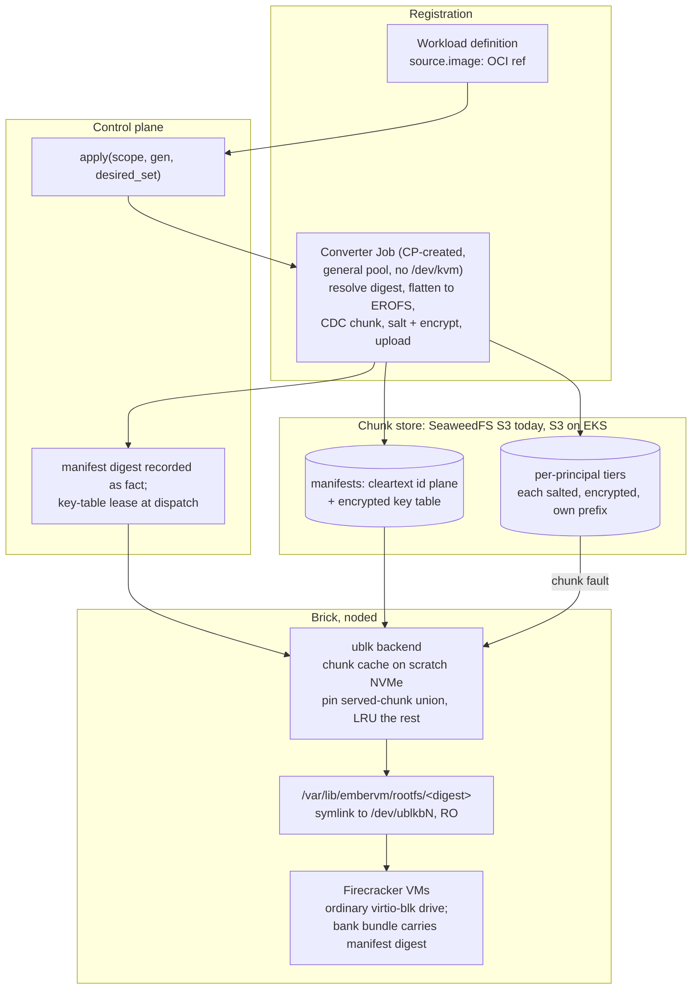

# ADR 028: Demand-Loaded Rootfs: OCI Registration, Content-Addressed Chunk Store, ublk Presentation

**Author:** jomcgi
**Status:** Draft
**Created:** 2026-07-31
**Supersedes in part:** [005 - EmberVM scale-out on EKS](005-embervm-eks-scale-out-metal-pool-bricks.md) (decision 3's Pattern A guest-base pipeline, and the initContainer bake that shipped in its place)
**Amends:** the invariant-4 premise recorded in `projects/embervm/ARCHITECTURE.md` section 5, scoped to the rootfs plane only (the chunk store becomes a runtime dependency for code paths a restored guest never exercised before banking; volumes and memory snapshots are untouched). The amendment lands with the mechanism, not with this draft.
**Builds on:** [025](025-local-disk-authoritative-s3-archive-interval.md) (content-addressed archiving discipline, principal-scoped erasure, the cross-principal dedup prohibition), [026](026-template-composition-gitops-registration.md) (the `apply(scope, generation, desired_set)` reconcile conversion hooks into), [027](027-snapshot-modes-workload-property.md) (the `shared/<principal>` keyspace precedent and the read-only-rootfs facts), [019](019-op-log-data-structure-payload-separation.md) (principal-scoped erasure as a schema invariant), [020](020-admission-control-plane-token-routing-peer-redistribution.md) (the admission surface registration extends)

---

## Problem

The guest base rootfs is built on the node, per image, at pod start.
`_noded-pod.tpl` ranges over `Values.workloads` and emits one initContainer
per image, each running `crane export | tar -x | mkfs.ext4` at 4 to 5
minutes on a cache miss. Kubernetes runs initContainers serially, so six
images cost 24 to 30 minutes of bake before a brick is Ready, before it
dials home, before it advertises any capacity. Three failure shapes follow:

1. **Node readiness is O(images).** Every added image adds 4 to 5 minutes
   to every future node's readiness. On an autoscaled metal pool this lands
   at the worst moment: under ADR 005 a Pending brick is the Karpenter
   signal, so a fresh node by definition serves overflow demand, and every
   bake minute must be bought back as standing warm-buffer capacity.
2. **The pod template embeds the image set.** Any image change rolls every
   brick in the fleet under bare RollingUpdate (the ADR 011 rollout gap;
   the tag-churn incident was this bug's shadow). Third-party images make
   the image set change at someone else's cadence.
3. **Per-node storage is catalogue-sized.** Every node holds every baked
   image whether or not any VM on that node ever uses it.

This is also drift from an Accepted decision. ADR 005 decision 3 decided
"a build-time, digest-pinned OCI image built with the existing apko +
Bazel pipeline, retiring the runtime BaseBuilder... Pattern A: the image
payload is a `rootfs.ext4` blob, unpacked by the default overlayfs
snapshotter, extracted once into a shared read-only content-addressed
cache on scratch". What shipped is the runtime BaseBuilder shape relocated
into an initContainer, not eliminated. This ADR names that drift and
supersedes both the decided Pattern A and the shipped substitute, because
neither survives third-party images: Pattern A assumes the platform's own
Bazel pipeline builds every guest image, and tenancy breaks that premise.

The design goal, stated as the destination rather than a ladder of interim
rungs: **performant on the homelab, tolerant of cold load and boot from
the network.** A network-served cold path is an accepted property of the
design, not a compromise to be engineered away later.

Prior art is Brooker et al., "On-demand Container Loading in AWS Lambda"
(USENIX ATC 2023): flatten OCI layers to one filesystem image, chunk,
convergent-encrypt, demand-load into Firecracker. This ADR takes its
manifest plane separation, its salt-in-key-derivation, and its
deterministic-flattening requirement, and deliberately does not take its
AZ cache fleet, erasure coding, compression, write-overlay bitmap, or
cross-customer dedup, each rejected below with reasons.

---

## Decision

Eight decisions.

**1. The public interface is an OCI image ref, resolved to an immutable
digest at every accepted reconcile, and conversion is in-Ember.** A
workload definition carries an image ref. The CRD's `image.ref` is an
unconstrained string (`chart/crds/workload-crd.yaml`), so mutable tags are
permitted today, and triggering conversion on "the ref changed" is not
sound against a tag that moves while the ref string stays the same: a
mutable ref is not a deterministic reconstruction source. When ADR 026's
`apply(scope, generation, desired_set)` reconcile registers or updates a
workload, Ember resolves and records the immutable per-architecture OCI
digest at that reconcile and keys conversion on that digest plus a
converter format version, not on the ref string. A moved tag under an
unchanged ref is detected because resolution picks up the new digest.
Conversion output is content-addressed, so an unchanged digest is a no-op
and rebuilds are idempotent. This generalizes past Bazel-built apko images
to arbitrary registered images; the apko pipeline becomes one producer
among many rather than the pipeline. A ref that resolves for only one
architecture constrains that workload's placement to that architecture
rather than being rejected. Whether mutable tags are rejected outright at
admission or carry an explicit refresh policy is Open Question 9.

**2. The candidate internal representation, gated on Phase 0, is a
flattened EROFS image cut into content-defined chunks, described by a
per-arch manifest with a cleartext chunk-id plane and an encrypted key
table.** OCI layers are applied in order into a single EROFS filesystem
image. EROFS is attractive because it is read-only by design (matching a
rootfs that is already `RootfsReadOnly: true`) and already enabled in the
Kata guest kernel (`CONFIG_EROFS_FS=y`), so no kernel work is needed. But
two claims for it need to survive measurement, not assertion, before it
is frozen:

`SOURCE_DATE_EPOCH` pins one source of nondeterminism, timestamps, but
does not by itself prove byte-identical `mkfs.erofs` output: tool version,
UUID handling, traversal order, xattr encoding, and ownership can all
still vary run to run or version to version. And "an insertion churns
O(1) chunks" is too generous stated this way: content-defined chunking
does recover byte-range boundaries after an inserted file, but EROFS
inode numbering, directory entries, metadata block offsets, and xattr
tables can churn more broadly than the data extents themselves, so the
metadata plane's shift-resistance is not automatically inherited from the
chunker.

So EROFS plus content-defined chunking (FastCDC-class, target size
settled by the sizing spike) is the candidate representation, not a
settled one: it is gated on Phase 0's reproducibility check and
one-package-rebuild result, with the exact `mkfs.erofs` version and every
determinism-relevant flag pinned once those results land, and a fallback
representation retained until they do. Chunking is content-defined rather
than fixed-offset for a reason that does hold regardless of the
reproducibility question: under fixed-offset chunking one inserted file
shifts every downstream block and churns the whole tail of the image,
which is why the paper needed a custom deterministic ext4 allocator;
content-defined boundaries follow the data instead, so the determinism bar
for the data plane drops from "block-stable layout" to "reproducible
layout". The manifest maps byte ranges to chunk ids. Following the
paper's plane separation, the chunk-id list is cleartext and bound as
additional authenticated data while only the key table is encrypted, so
garbage collection can enumerate chunk references without holding any key
that can read them. Chunk universes and manifests are per-arch. Chunks
are not compressed: `CONFIG_EROFS_FS_ZIP` makes compressed EROFS
available in the guest kernel, but compression before encryption is a
plaintext-size side channel, every principal's chunks being encrypted
under decision 3, and the bandwidth benefit is marginal on both LAN
SeaweedFS and same-region S3.

**3. The chunk store is single-tier, one keyspace per principal, and
invariant 3 stands unamended.** Every principal, including the platform's
own first-party images, encrypts its chunks under its own salt: key =
H(salt_principal, plaintext), AES-CTR, chunk named by the ciphertext hash,
stored under that principal's prefix. No chunk is ever referenced across a
principal boundary, in either direction. The per-principal salt makes
invariant 3 hold cryptographically rather than by policy: identical
content in two principals produces different keys, different ciphertexts,
and different names, so no chunk is ever shared between manifests that
belong to different principals, and ADR 019's erasure stays an indexed
prefix delete of exactly one principal's keyspace. The salt field exists
in the key derivation from day one regardless of tier count, so a future
dedup-scope change is a salt-policy change, never a format change.

An earlier draft of this decision kept a second, unencrypted "platform"
tier that first-party images deduped against across principals. That is
content-addressed dedup across principals, which invariant 3 forbids in
plain text ("Content-addressed dedup across principals is forbidden," ADR
025). The draft defended itself against the invariant's rationale, that
erasure stays a prefix delete, rather than against the rule itself, and a
platform tier's own chunk deletion would in any case have been a
cross-principal reference-counting problem the moment a platform image
retired: exactly the failure mode ADR 025 and ADR 027 name. Dropping the
tier is what makes the heading claim "invariant 3 stands unamended" true
rather than asserted.

What this gives up: a base layer common to several principals is now
stored once per principal rather than once globally, so an image common
to ten tenants costs ten copies of its unchanged chunks instead of one.
That is judged an acceptable cost, because dedup at this layer is a
cache-warmth optimisation, not an economic necessity at this scale, and
Phase 0's cross-image commonality measurement sizes what is being
forgone rather than assuming it away.

**4. Presentation is ublk, a chosen direction with two parts gated on
Phase 0 validation: one read-only block device per in-use manifest, at a
stable digest-named path.** A noded-owned backend serves each manifest as
a host block device via ublk (io_uring userspace block). Firecracker
attaches an ordinary drive, so the snapshot and restore path is
byte-identical to today: no new device model, no restore-time protocol.
That is a designed property, not an availability accident, and it is what
makes this compatible with bank/relight without touching the driver.
vhost-user-blk is rejected because Firecracker v1.12.1 (the Kata 3.32.0
bundle) cannot snapshot a microVM with vhost-user devices configured
(`docs/api_requests/block-vhost-user.md`: "At the moment, snapshotting is
not supported for microVMs that have vhost-user devices configured"). This
is stronger than "every class except task": task's own warm-start path
also restores from a base snapshot, so vhost-user-blk would break the task
warm path too, not spare it. Bank/relight is how every class works, so
this is disqualifying rather than a caveat; revisit if Firecracker ships
vhost-user snapshot support.

The drive path handed to Firecracker is meant to be a stable symlink,
`/var/lib/embervm/rootfs/<manifest-digest>`, pointing at whichever
`/dev/ublkbN` currently serves that manifest, so the path recorded inside
a snapshot would be content-named and noded could satisfy it after any
restart by re-pointing the symlink. That mechanism is asserted, not
validated, and it is gated on a Phase 0 experiment: whether Firecracker
serializes the supplied symlink spelling into the snapshot, or resolves it
first and serializes the concrete `/dev/ublkbN` path instead. The verified
fact that motivates the experiment is that restore (`loadInto` in
`noded/fcvm/driver/driver.go`) launches a fresh Firecracker process and
calls `LoadSnapshot` without ever reissuing `PutDrive`, so drive
configuration on restore comes from whatever the snapshot embedded, not
from a fresh call noded controls. Re-pointing the symlink also does
nothing for a VM that is already running with an open fd to a ublk device
that has failed: that instance needs its own recovery path regardless of
what the symlink points at next.

Kernel version is necessary but not sufficient for ublk availability.
io_uring userspace block needs `CONFIG_BLK_DEV_UBLK`, a usable
`/dev/ublk-control`, the right capabilities, io_uring support, and
compatibility with the Firecracker jailer's namespace and path handling,
none of which follow from the kernel number alone. The four homelab nodes
are verified at kernel 6.8; the EKS AMI is not verified for any of these
requirements. One device is shared read-only by every VM on the brick
using that image, exactly as the baked file is today.

**5. Cache policy: pin what a manifest served, LRU-evict the rest, collect
garbage aggressively; and the invariant-4 premise is amended for the
rootfs plane.** The pin set is computed per (brick, manifest), not per
instance: decision 4 gives one shared read-only device per manifest per
brick, the Linux block layer hands the ublk backend sector requests with
no originating-VM attribution and may merge adjacent ones, and a repeat
read from a second instance is absorbed by host page cache before it ever
reaches the backend. Per-instance pinning is therefore not computable from
where the backend sits. The backend instead records the union of chunks
it has served for a given manifest on that brick, which is free to
compute and is the same granularity this decision's own GC-root list
already implies. Chunks in a manifest's served-chunk union for a live or banked
instance are pinned; everything else is LRU under real disk pressure, and
GC is deliberately aggressive because a cold load from the network is
fast by design. The coarser granularity pins slightly more than strict
per-instance tracking would, which is the safe direction.

What makes the weaker rule safe, and where it stops holding, needs both
halves stated. The premise is sound and was checked against the code: a
Firecracker memory snapshot captures guest RAM including resident page
cache, there is no balloon device and no `drop_caches` call anywhere in
noded or the runtimes, and restore is `LoadSnapshot` against a File memory
backend, so nothing invalidates that cache between bank and relight. But
the conclusion that a restored VM "touches the block device only for code
paths it had not exercised before banking" does not follow from that
premise alone, for two reasons. First, Linux may reclaim clean
page-cache pages under memory pressure before the bank runs, so a path the
guest read earlier can still be absent from the snapshot. Second, the pin
set does not travel with the instance: it lives on the brick that served
those chunks, so a cross-brick relight, the group and stateful classes'
normal case, lands on a brick where nothing for that instance is pinned or
cached, and exposure there is everything outside guest RAM, not merely the
paths unexercised before banking.

Decision 5 is sound today for a narrower reason than "the snapshot has the
working set": it depends on bank never reclaiming guest memory first. The
natural future optimisation for the 7-day S3 snapshot tier, shrinking
memfiles by balloon inflate or a guest-side `drop_caches` before banking,
would gut this premise outright: the restored guest would fault its whole
working set from the network on relight, not just the cold tail. This is
recorded as an explicit constraint: **bank must not be preceded by guest
memory reclaim without revisiting this premise.**

What narrows the cross-brick exposure without changing the pin
architecture: the bank bundle records the served-chunk-id list for the
instance being banked, alongside the manifest digest. It is a subset of
the manifest's cleartext chunk-id plane, so it is small and needs no keys.
Any brick can then prefetch that read set on relight regardless of which
brick pinned it originally, which is what makes the cross-brick case
tolerable rather than a full cold load. Retrofitting this later leaves
every bundle banked before the change unable to prefetch on relight, which
is why it belongs in the format freeze (item 3 of the implementation
issue) rather than added after bundles exist in the wild.

Full local hydration is not rejected here, it is unquantified. The prior
argument, "it puts per-node storage back at catalogue size", compares a
targeted bank precondition against eager hydration of the entire
catalogue, which is not the actual choice: hydrating only the manifests
in use by live or banked instances is the active set, a small fraction of
the catalogue on any real node. Whether that active-set hydration is
worth doing for banked or availability-sensitive workloads is Open
Question 7, settled by Phase 0's measurement of what that active set
actually is, not decided by this ADR.

The residual is stated rather than buried: **the chunk store becomes a
runtime dependency for genuinely-new code paths on a running restored
guest**, which cannot happen today, where a baked rootfs is complete on
local NVMe. A store outage no longer only slows warmth; a live request
that faults an uncached chunk blocks until the store answers. This is the
same trade every network-backed block device makes, and it is confined to
the rootfs plane: stateful volumes stay local-authoritative (ADR 025) and
memory snapshots stay fail-open-to-cold-boot. Invariant 4's enforcement
arm is unchanged; its premise ("warmth artifacts are never
correctness-critical") is narrowed for rootfs reads only, and
ARCHITECTURE.md section 5 is updated when the mechanism lands, not on this
draft, so the document keeps describing what is true now.

Provenance strengthens at the same time: the manifest digest is recorded
in every bank bundle and verified at relight. A mismatch discards warmth
and cold-boots (fail open on warmth, fail closed on provenance), which
upgrades today's unverifiable "never overwrite another rootfs-*.ext4"
convention into a checkable invariant. Rootfs and chunk GC liveness
becomes explicit digest references (workload registry entries, READY
bases, bank bundles), replacing liveness-by-directory-pointer, and the
paper's expired-state discipline is imported: a retired GC root passes
through an expired window in which any access raises an alarm and halts
further deletion.

**6. A Kubernetes Job is the conversion worker primitive, never the
control plane and never noded; its reconcile design is not decided
here.** Streaming multi-GB image payloads through the BEAM violates
invariant 2 (facts through the control plane, payloads never) and would
block it. noded is the wrong host too: conversion is CPU- and I/O-heavy
work that would contend with microVM capacity on exactly the nodes sized
for VMs, and it needs no `/dev/kvm`, so on EKS it belongs on the cheap
general pool rather than the metal pool, which is a real cost argument.
That reasoning settles what runs the work, not how it is driven. At the
level this ADR decides: the control plane creates the Job at
registration and watches it, the Job moves the payload node-to-store, and
the control plane records the resulting manifest digest as a fact.

The dependency this decision hangs on should be stated honestly rather
than assumed away: it hooks onto ADR 026's `apply(scope, generation,
desired_set)` reconcile, which is Draft and does not exist in the code.
The live registration path today is `WorkloadWatcher` plus `BaseBuilder`,
and `BaseBuilder` currently owns workload `Ready` conditions. So decision
6 is written against a reconcile ADR 026 has not yet shipped, and ADR
026's implementation is a prerequisite for this one, not a parallel
concern.

The controller state machine around the Job is deliberately left open,
not settled by implication: deterministic Job identity, restart adoption,
stale-completion rejection after a ref update lands mid-conversion,
deletion while a conversion is running, retry exhaustion, result
retrieval and validation, TTL cleanup, and who owns the `Ready` condition
once conversion sits between registration and readiness. These are Open
Question 8, not a settled design this decision quietly assumes.

**7. Registration is a new admission surface and is capped.** An OCI
interface means anyone with registration authority can submit a 40 GB
image. Under ADR 020's admission posture: a platform ceiling on image
size, a conversion timeout, and per-principal conversion concurrency and
queue limits, all declared scalars in user-facing units. Without them the
converter is a denial-of-service target. This surface does not exist
today and ships with the converter, not after it.

**8. Key custody: control-plane wrap keys as brick leases now, KMS at
EKS, no format change.** Each principal's manifest key tables are wrapped
under a per-principal key. Before EKS those wrap keys are held by the
control plane and released to bricks at dispatch as memory-only leases
sealed to the brick's dial-home identity, the same class-2 credential
shape section 9 of ARCHITECTURE.md already defines; a key table is a
small lifecycle-rate fact, consistent with invariant 2. The stated
limitation is that control-plane compromise reads all tenant images. At
EKS, custody swaps to per-principal KMS keys with zero format change,
which is the property that matters.

---

## Storage semantics against ADR 025: derived data, not durable state

ADR 025's "local disk is authoritative" is scoped to stateful volumes:
durable, single-writer tenant data whose only truth is the bytes on that
node. A rootfs is the opposite shape: derived data whose origin of truth
is a registry ref and a deterministic conversion. Losing every cached
chunk on a node loses nothing; the store rebuilds the node's working set
on demand and the converter rebuilds the store from the registry. So the
chunk store being authoritative for the rootfs plane sits alongside ADR
025 rather than contradicting it, and "local is authoritative" must not
be read as a global rule: it is a property of volumes, not of the
platform.

---

## Cutover and rollback across snapshot lineages

This is a gap this ADR needs to name, not a wording issue. Restore
(`loadInto` in `noded/fcvm/driver/driver.go`) launches a fresh Firecracker
process and calls `LoadSnapshot` against a snapfile and memfile without
ever reissuing `PutDrive`: drive configuration is embedded in the
snapshot itself, not supplied fresh by noded at restore time. Existing
bank bundles embed absolute ext4 rootfs paths under the current design;
newly banked bundles under this ADR would depend on ublk and EROFS
instead. Those are two different rootfs presentation mechanisms, and a
snapshot only knows how to be restored by the one it was banked under.

The consequence is that **cutover is per snapshot lineage, not per
image.** Retiring either backend, the ext4 bake or ublk-over-EROFS, breaks
restore in one direction for whichever bundles were banked under it. A
per-image soak covers only newly created snapshots of that image; it does
not cover banked sessions, currently serving instances, stateful
instances, group members, or exported bundles that were banked before the
cutover and may not be touched again for a while. The 7-day bank horizon
and the 30-day workspace horizon (ADR 025) mean an old-lineage bundle can
outlive any per-image cutover window entirely, so "we soaked the image"
does not imply "every bundle referencing that image can restore."

What this requires, without inventing the mechanism here: a versioned
bank-bundle format that records which rootfs presentation mechanism it
was banked under, dual restore support retained in noded until every
old-format reference has expired, a per-workload feature gate rather than
a single fleet-wide flip, a lineage inventory so "have all old references
expired" is an answerable question rather than a guess, and an explicit
rollback matrix stating what each direction of rollback requires and what
it cannot recover. The mechanism is left to the implementation issue; the
requirement is that none of it can be skipped by treating this as an
ordinary per-image image swap.

---

## Architecture

---

## Alternatives Considered

| Alternative | Rejected because |
| ----------- | ---------------- |
| vhost-user-blk presentation | Firecracker v1.12.1 cannot snapshot a microVM with vhost-user devices, and bank/relight is how every class works, task's own warm start included; disqualifying, not a caveat. Revisit if FC ships vhost-user snapshot support |
| FUSE file presented as the drive | The paper's own stated regret: four scheduler hops per miss, jitter under load; adopting the paper as written adopts the regret |
| Fixed-offset 512 KiB chunks over deterministic ext4 (the paper's shape) | Requires a custom serial allocator to make similar inputs block-stable; content-defined chunking gets shift-resistance from the chunker instead, and stock EROFS clears the remaining (reproducibility) bar, pending Phase 0's confirmation |
| Full local hydration, hydration-complete as a bank precondition | Not rejected, unquantified: the catalogue-size argument compares against eager hydration of the whole catalogue, not the active set of manifests in use by live or banked instances; Phase 0 must measure that active set (Open Question 7) |
| Whole-image lazy blob fetch (ADR 005 Pattern A, repaired) | Simpler, but no cross-image sharing of base chunks, eviction granularity is a whole image, and the 5 to 30 s first fetch lands on fresh nodes at spike time; it also keeps the platform-builds-everything premise tenancy breaks |
| Middle cache tier and erasure coding | No cache fleet to stripe at 10 to 50 nodes; on EKS, S3 same-region reads are free bandwidth while a cross-AZ peer cache pays per GB both ways, so a peer cache loses on cost and only wins latency intra-AZ; erasure coding has no substrate without a fleet |
| Cross-principal dedup, including a shared platform tier for first-party images (amending invariant 3) | Invariant 3 forbids content-addressed dedup across principals in plain text, not just by its erasure-stays-a-prefix-delete rationale; a shared tier's own GC would itself be a cross-principal reference-counting problem on retirement. Rejected outright, not just among tenants; each principal, platform included, pays its own storage cost for common base layers, sized by Phase 0's cross-image commonality measurement |
| Chunk or EROFS compression | Compression before encryption is a plaintext-size side channel; every principal's chunks are encrypted under decision 3, so there is no plaintext tier for the exemption to apply to; benefit marginal at LAN and same-region bandwidth regardless |
| Write-overlay bitmap (the paper's CoW path) | The rootfs is already read-only with tmpfs scratch, and ADR 027's capture drive is a separate device; there is nothing for an overlay to do |
| Conversion inside the control plane | Multi-GB payloads through the BEAM violate invariant 2 and block the coordinator |
| Conversion on noded | Contends with microVM capacity on the nodes sized for VMs, and needs no `/dev/kvm`; on EKS it would occupy metal for work the general pool does cheaper |
| Native OCI ImageVolume (KEP-4639) | Already rejected in ADR 005: needs a containerd and control-plane feature gate EKS does not expose |
| Keep the initContainer bake | O(images) serial node readiness, fleet-wide brick rolls on any image change, catalogue-sized per-node storage; fails at tens of images, before tenancy scale |

---

## Security

Baseline: [docs/security.md](../../security.md).

- **Every principal's image content is that principal's code at rest,
  including the platform's own.** Every tier is encrypted with
  per-principal salted convergent encryption; the SeaweedFS S3 gateway is
  anonymous by standing decision, so ciphertext-plus-external-keys is the
  access control for that store, and it remains defense in depth once EKS
  IAM exists.
- **The per-principal salt kills the confirmation-of-file attack across
  principals**: an observer cannot test whether another principal's image
  contains a known file, because the same plaintext yields a different
  chunk name per principal. Within a principal it reveals only what the
  principal already knows.
- **Erasure stays an indexed prefix delete** (ADR 019): no chunk is ever
  referenced outside the principal that owns it, so deleting a principal's
  keyspace prefix is complete by construction; there is no shared tier
  whose own garbage collection would need cross-principal reference
  counting.
- **On-read chunk integrity verification is required, and its absence is
  load-bearing.** The SeaweedFS S3 gateway's anonymity covers writes as
  well as reads (`noded/config/config.go`), so without verification any
  in-cluster pod can overwrite the object at a chunk's key, and that
  content is arbitrary code injected into every guest whose manifest
  references that chunk id. The backend must verify every fetched chunk
  against its id and fail closed on a mismatch, which degrades the attack
  from code injection to an availability failure. This is consistent with
  existing practice: `noded/server/store.go` already restores artifacts
  "verifying every file's checksum" and treats a checksum match as the
  authority for what is trustworthy on disk. The honest limit:
  verification makes poisoning safe, not deletion, since anonymous write
  also permits removing the object outright; IAM at EKS is the actual fix
  for the write-access problem, not a mitigation layered on top of it.
- **Conversion isolation, because the converter parses tenant-controlled
  input.** OCI layers carry attacker-chosen paths, hardlinks, symlinks,
  xattrs, sparse files, and device nodes, and a compressed-size ceiling
  plus a timeout (decision 7) cover neither an inode bomb, an expansion
  ratio attack, nor an extraction-escape bug in the unpacker itself. The
  extractor runs rootless or in its own sandbox, with limits on expanded
  byte count, file count, layer count, xattr size, and sparse extents, and
  registry pull credentials scoped to the converter Job rather than held
  more broadly.
- **Pre-EKS custody limitation, stated**: the control plane holds the
  wrap keys, so control-plane compromise reads all tenant images. Leases
  to bricks are memory-only and sealed to dial-home identity (the class-2
  shape). KMS custody at EKS removes the central readable keyring with no
  format change.
- **The converter is the one component with registry egress.** Guests
  never pull images; the converter Job pulls the registered ref under the
  admission caps of decision 7, with per-principal pull credentials
  scoped to that Job (Open Question 4 covers their storage shape).
- **GC deletes tenant data at rest**, the uniquely risky operation; the
  expired-window alarm from decision 5 exists so an incomplete-liveness
  bug halts deletion instead of completing it.

---

## Risks

| Risk | Likelihood | Impact | Mitigation |
| ---- | ---------- | ------ | ---------- |
| Store outage blocks a running restored guest's first touch of an unexercised code path (new failure semantics on the rootfs plane) | Medium | **High** | An alarmed backend metric is observation, not mitigation, and a shared per-manifest device correlates the stall across every VM using that image: a guest blocked on a root block read enters uninterruptible D state, where hung-task warnings do not recover it and signals do not complete it, and cold boot from the same unavailable store is not a fail-open path either. Required: bounded block-request and network deadlines, circuit breaking, a defined EIO behaviour, a VM watchdog and reap policy, queue isolation, and thundering-herd admission control on store recovery |
| GC or LRU evicts a chunk the pin set should have held (bookkeeping bug class; the rootfs GC already leaked once by pointer-liveness) | Medium | High | Liveness is explicit digest references, not directory pointers; expired-window alarm halts deletion on any access; cold boot is the recovery |
| Converter abused as a DoS target (40 GB image, tar bombs, slow registries) | High | Medium | Decision 7's caps ship with the converter: size ceiling, timeout, per-principal concurrency and queue depth; extractor isolation and expansion limits per the Security section |
| Dedup ratio and boot working set are unknown for this image population | High | Medium | The sizing spike measures both before parameters freeze; the design's latency case does not depend on dedup being good |
| SeaweedFS chunk-GET tail latency at 512 KiB under concurrency is unmeasured | Medium | Medium | Spike measures it; levers are chunk size and read-ahead, never a cache tier |
| The ublk symlink mechanism is unvalidated: whether Firecracker serializes the symlink spelling or a resolved `/dev/ublkbN` path into the snapshot is unknown, and a repointed symlink does nothing for a VM already running against a failed device | Medium | High | Gated on the Phase 0 symlink experiment before ublk is frozen as the presentation mechanism; a running VM against a failed device needs its own recovery path regardless of the symlink outcome |
| ublk device state does not survive a noded restart | High | Low | Devices are re-created from the persisted registry on start and the digest-named symlink re-pointed before any restore; the registry-survives-restart pattern already exists |
| Conversion queue backs up registration (a slow registry stalls the reconcile) | Medium | Low | Conversion is async off the reconcile; the workload stays unready with a stated reason until its manifest fact lands |
| Guest boots regress on EROFS (behavioural difference from ext4) | Low | Medium | Same guest kernel, RO mount either way; soak per image during cutover, cold boot on the old path remains available until retirement |
| A snapshot lineage bank bundle embeds a rootfs presentation mechanism (path-based today, ublk-and-EROFS-dependent tomorrow) that the fleet stops supporting before the bundle expires | Medium | High | Versioned bank-bundle format with dual restore support retained until old-format references expire; per-workload feature gate rather than a fleet flip; a lineage inventory to answer whether old references have expired; see "Cutover and rollback across snapshot lineages" |

---

## Open Questions

1. **CDC parameters**: target chunk size and cut policy, settled by the
   sizing spike rather than imported from the paper's 512 KiB legacy.
2. **Pin-set persistence at manifest granularity**: whether the
   per-(brick, manifest) served-chunk union is persisted with the registry
   across noded restarts or rebuilt lazily from bank bundles on first
   touch.
3. **Salt rotation**: the field exists from day one; whether rotation
   machinery (time, popularity, placement) is ever worth building at this
   blast radius, or the principal dimension alone is the permanent answer.
4. **Private-registry credentials** for tenant OCI refs: per-principal
   pull secrets at conversion time, their storage shape, and their
   admission review.
5. **Eager warming for serving and stateful classes**: whether
   long-running classes should prefetch their manifest's full chunk set in
   the background as a posture choice, given task and session need not.
6. **Whether EROFS compression is worth adopting for any principal**,
   now that every tier is encrypted and there is no plaintext tier for the
   side-channel exemption to apply to.
7. **Whether full hydration is required for banked or availability-
   sensitive classes**: rejected only as an eager catalogue-wide default,
   not as a targeted policy; Phase 0 must measure the active banked-
   manifest set (the manifests used by live or banked instances, not the
   whole catalogue) before this is settled.
8. **The converter's reconcile state machine**: deterministic Job
   identity, restart adoption, stale-completion rejection after a ref
   update, deletion while running, retry exhaustion, result retrieval and
   validation, TTL cleanup, and Ready-condition ownership. Decision 6 picks
   the Job as the worker primitive and deliberately leaves all of this
   open; it depends on ADR 026's `apply` reconcile, which is Draft and not
   yet implemented.
9. **Whether mutable tags are rejected outright at admission or carry an
   explicit refresh policy**, now that decision 1 resolves to a digest at
   every reconcile.

---

## References

| Resource | Relevance |
| -------- | --------- |
| Brooker et al., "On-demand Container Loading in AWS Lambda", USENIX ATC 2023 ([arXiv 2305.13162](https://arxiv.org/abs/2305.13162)) | The manifest plane separation, salt-in-key-derivation, deterministic flattening requirement, and expired-window GC discipline this adopts; the cache fleet, erasure coding, compression, and write overlay it deliberately does not |
| [ADR 005](005-embervm-eks-scale-out-metal-pool-bricks.md) | Decision 3 (Pattern A) this supersedes; the Pending-brick Karpenter contract that makes node readiness the binding constraint |
| [ADR 025](025-local-disk-authoritative-s3-archive-interval.md) | The local-authoritative scope this ADR bounds to volumes; principal-scoped erasure; the cross-principal dedup prohibition the single-tier store enforces cryptographically |
| [ADR 026](026-template-composition-gitops-registration.md) | The `apply` reconcile conversion triggers from; Draft and not yet implemented, a prerequisite for decision 6 |
| [ADR 027](027-snapshot-modes-workload-property.md) | The `shared/<principal>` keyspace precedent; the read-only rootfs and separate capture-drive facts that eliminate the write overlay |
| [ADR 019](019-op-log-data-structure-payload-separation.md) | Erasure as an indexed principal-scoped delete, which the per-principal store keeps true |
| [ADR 020](020-admission-control-plane-token-routing-peer-redistribution.md) | The admission posture decision 7's caps extend |
| `projects/embervm/ARCHITECTURE.md` | Invariants 2, 3, and 4; the class-2 credential lease shape decision 8 reuses; the invariant-4 premise amendment lands with the mechanism |
| `projects/embervm/chart/crds/workload-crd.yaml` | `image.ref` is an unconstrained string, so mutable tags are permitted today; the basis for decision 1's digest-resolution requirement |
| `projects/embervm/chart/templates/_noded-pod.tpl` | The per-image initContainer range this retires |
| `projects/embervm/chart/templates/noded-rootfs-builder-configmap.yaml` | The runtime bake script this retires |
| `projects/embervm/noded/server/rootfs_gc.go` | The pointer-liveness GC replaced by explicit digest references |
| `projects/embervm/noded/fcvm/driver/driver.go` | `loadInto` restores via `LoadSnapshot` without ever reissuing `PutDrive`, so drive configuration comes from the snapshot itself; the basis for decision 4's symlink validation gate and the cutover section |
| `projects/embervm/noded/config/config.go` | The SeaweedFS S3 gateway's anonymity is a standing decision covering writes as well as reads; the basis for the Security section's on-read verification requirement |
| `projects/embervm/noded/server/store.go` | `RestoreArtifact`'s existing per-file checksum verification, the precedent the Security section's chunk-integrity requirement follows |
| `projects/embervm/proto/embervm/node/v1/node.proto` | `BankResponse` carries only `snapshot_ref` and `size_bytes` today; motivates decision 5's served-chunk-id addition to the bank bundle |
| `projects/embervm/control/lib/embervm/session_manager.ex` | `base_digest/1` is currently a placeholder equal to the image ref, one of several competing rootfs identities the format freeze (implementation issue item 3) must settle |
| `projects/embervm/control/lib/embervm/base_builder.ex` | Owns workload `Ready` conditions today; the open Ready-ownership question in decision 6 |
| Firecracker v1.12.1 `docs/api_requests/block-vhost-user.md` | "At the moment, snapshotting is not supported for microVMs that have vhost-user devices configured": the fact that decides ublk over vhost-user-blk |
| ublk (`Documentation/block/ublk.rst`) | The presentation mechanism; availability depends on `CONFIG_BLK_DEV_UBLK`, `/dev/ublk-control`, capabilities, and jailer compatibility, not kernel version alone |
| [docs/security.md](../../security.md) | Security baseline |
