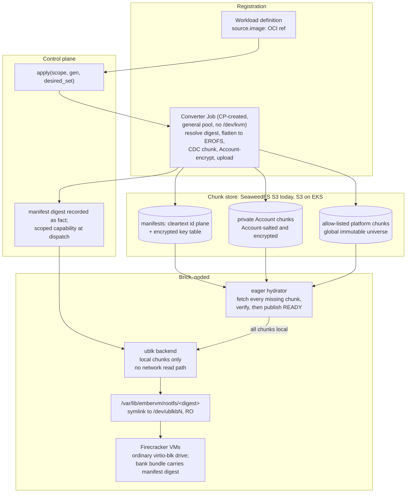

# ADR 028: Eager-Local Rootfs: OCI Registration, Account Chunk Store, ublk Presentation

**Author:** jomcgi
**Status:** Accepted
**Created:** 2026-07-31
**Updated:** 2026-08-14
**Supersedes in part:** [005 - EmberVM scale-out on EKS](005-embervm-eks-scale-out-metal-pool-bricks.md) (decision 3's Pattern A guest-base pipeline, and the initContainer bake that shipped in its place)
**Amends:** `projects/embervm/ARCHITECTURE.md` invariant 3, scoped to immutable derived rootfs chunks only. Mutable VM state and snapshot lineage remain principal-scoped and never deduplicate across principals. Immutable private rootfs chunks may deduplicate within one Account, with mount authorization still checked per principal. Explicitly published platform chunks may deduplicate globally.
**Builds on:** [025](025-local-disk-authoritative-s3-archive-interval.md) (content-addressed archiving discipline for mutable state), [026](026-template-composition-gitops-registration.md) (the `apply(scope, generation, desired_set)` reconcile conversion hooks into), [027](027-snapshot-modes-workload-property.md) (the read-only-rootfs facts), [019](019-op-log-data-structure-payload-separation.md) (principal-scoped erasure), [020](020-admission-control-plane-token-routing-peer-redistribution.md) (the admission surface registration extends), and [033](033-substrate-threat-model-conformance-encryption-at-rest.md) (random per-artifact encryption for mutable state and shared immutable platform bases)

---

## Problem

The guest base rootfs is built on the node, per image, at pod start.
`_noded-pod.tpl` ranges over `Values.workloads` and emits one initContainer
per image, each running `crane export | tar -x | mkfs.ext4` at 4 to 5
minutes on a cache miss. Kubernetes runs initContainers serially, so six
images cost 24 to 30 minutes of bake before a brick is Ready, before it
dials home, before it advertises any capacity. Three failure shapes follow:

1. **Node readiness is O(images).** Every added image adds 4 to 5 minutes
   to every future node's readiness. On an autoscaled metal pool this lands
   at the worst moment: under ADR 005 a Pending brick is the Karpenter
   signal, so a fresh node by definition serves overflow demand, and every
   bake minute must be bought back as standing warm-buffer capacity.
2. **The pod template embeds the image set.** Any image change rolls every
   brick in the fleet under bare RollingUpdate (the ADR 011 rollout gap;
   the tag-churn incident was this bug's shadow). Third-party images make
   the image set change at someone else's cadence.
3. **Per-node storage is catalogue-sized.** Every node holds every baked
   image whether or not any VM on that node ever uses it.

This is also drift from an Accepted decision. ADR 005 decision 3 decided
"a build-time, digest-pinned OCI image built with the existing apko +
Bazel pipeline, retiring the runtime BaseBuilder... Pattern A: the image
payload is a `rootfs.ext4` blob, unpacked by the default overlayfs
snapshotter, extracted once into a shared read-only content-addressed
cache on scratch". What shipped is the runtime BaseBuilder shape relocated
into an initContainer, not eliminated. This ADR names that drift and
supersedes both the decided Pattern A and the shipped substitute, because
neither survives third-party images: Pattern A assumes the platform's own
Bazel pipeline builds every guest image, and tenancy breaks that premise.

The design goal, stated as the destination rather than a ladder of interim
rungs: **performant on the homelab, minimal physical footprint for the active
image set, and no network dependency after a rootfs is declared ready.** A
brick hydrates every chunk of an active manifest before it advertises that
rootfs as ready. The object store is a preparation dependency, never a live
guest block-read dependency.

Prior art is Brooker et al., "On-demand Container Loading in AWS Lambda"
(USENIX ATC 2023): flatten OCI layers to one filesystem image, chunk,
convergent-encrypt, and demand-load into Firecracker. Lambda deduplicates
convergently encrypted chunks while a per-customer KMS key protects only the
manifest's chunk-key table. Its varying salt is an operational blast-radius
control, not the customer authorization boundary. This ADR takes the manifest
plane separation and deterministic flattening, changes the private dedup scope
to Account, and deliberately does not take network demand loading, its AZ cache
fleet, erasure coding, compression, or write-overlay bitmap.

---

## Decision

Eight decisions.

**1. The public interface is an OCI image ref, resolved to an immutable
digest at every accepted reconcile, and conversion is in-Ember.** A
workload definition carries an image ref. The CRD's `image.ref` is an
unconstrained string (`chart/crds/workload-crd.yaml`), so mutable tags are
permitted today, and triggering conversion on "the ref changed" is not
sound against a tag that moves while the ref string stays the same: a
mutable ref is not a deterministic reconstruction source. When ADR 026's
`apply(scope, generation, desired_set)` reconcile registers or updates a
workload, Ember resolves and records the immutable per-architecture OCI
digest at that reconcile and keys conversion on that digest plus a
converter format version, not on the ref string. A moved tag under an
unchanged ref is detected because resolution picks up the new digest.
Conversion output is content-addressed, so an unchanged digest is a no-op
and rebuilds are idempotent. This generalizes past Bazel-built apko images
to arbitrary registered images; the apko pipeline becomes one producer
among many rather than the pipeline. A ref that resolves for only one
architecture constrains that workload's placement to that architecture
rather than being rejected. Whether mutable tags are rejected outright at
admission or carry an explicit refresh policy is Open Question 9.

**2. The candidate internal representation, gated on Phase 0, is a
flattened EROFS image cut into content-defined chunks, described by a
per-arch manifest with a cleartext chunk-id plane and an encrypted key
table.** OCI layers are applied in order into a single EROFS filesystem
image. EROFS is attractive because it is read-only by design (matching a
rootfs that is already `RootfsReadOnly: true`) and already enabled in the
Kata guest kernel (`CONFIG_EROFS_FS=y`), so no kernel work is needed. But
two claims for it need to survive measurement, not assertion, before it
is frozen:

`SOURCE_DATE_EPOCH` pins one source of nondeterminism, timestamps, but
does not by itself prove byte-identical `mkfs.erofs` output: tool version,
UUID handling, traversal order, xattr encoding, and ownership can all
still vary run to run or version to version. And "an insertion churns
O(1) chunks" is too generous stated this way: content-defined chunking
does recover byte-range boundaries after an inserted file, but EROFS
inode numbering, directory entries, metadata block offsets, and xattr
tables can churn more broadly than the data extents themselves, so the
metadata plane's shift-resistance is not automatically inherited from the
chunker.

So EROFS plus content-defined chunking (FastCDC-class, target size
settled by the sizing spike) is the candidate representation, not a
settled one: it is gated on Phase 0's reproducibility check and
one-package-rebuild result, with the exact `mkfs.erofs` version and every
determinism-relevant flag pinned once those results land, and a fallback
representation retained until they do. Chunking is content-defined rather
than fixed-offset for a reason that does hold regardless of the
reproducibility question: under fixed-offset chunking one inserted file
shifts every downstream block and churns the whole tail of the image,
which is why the paper needed a custom deterministic ext4 allocator;
content-defined boundaries follow the data instead, so the determinism bar
for the data plane drops from "block-stable layout" to "reproducible
layout". The manifest maps byte ranges to chunk ids. Following the
paper's plane separation, the chunk-id list is cleartext and bound as
additional authenticated data while only the key table is encrypted, so
garbage collection can enumerate chunk references without holding any key
that can read them. Chunk universes and manifests are per-arch. Chunks
are not compressed: `CONFIG_EROFS_FS_ZIP` makes compressed EROFS
available in the guest kernel, but compression before encryption is a
plaintext-size side channel, every private Account's chunks being encrypted
under decision 3, and the bandwidth benefit is marginal on both LAN
SeaweedFS and same-region S3.

**3. Immutable rootfs chunks deduplicate within an Account, while mutable
state remains principal-scoped.** Account is the storage and encryption domain
for private image chunks. The current `tenant` deployment constant occupies
that Account slot. Conversion derives deterministic chunk ciphertext under an
Account-scoped secret salt, names the chunk by its ciphertext hash, and stores
it under `rootfs/account/<account>/<epoch>/<ciphertext-hash>`. Identical content
in two principals in the same Account produces one stored chunk. Identical
content in different Accounts produces different keys, ciphertext, and names.

Authorization remains narrower than encryption scope. A manifest is owned by
an Account and workload, while a dispatch capability names the principal that
may mount it. A brick receives neither the Account salt nor the Account KEK. It
receives only an authenticated key table and a bounded capability scoped to
`(account, principal, manifest digest, workload, brick, expiry)`. Sharing
physical ciphertext therefore grants no principal the authority to select or
mount another principal's image.

An optional `rootfs/platform/<epoch>/<ciphertext-hash>` universe holds chunks
from explicitly published platform roots. A private conversion may reference a
platform chunk only when its plaintext digest and boundary match a chunk in an
allow-listed platform manifest. This is a provenance check, not a heuristic
"common bytes" promotion. Platform chunks may be convergently encrypted under a
platform key or stored plaintext when their publication contract already makes
them public. Phase 0 measures whether this second universe earns its GC and
operational cost before it is built.

This amends invariant 3 only for immutable, reconstructable rootfs content.
Memory snapshots, session workspaces, stateful volumes, and every other mutable
artifact retain ADR 025 and ADR 033's rule: unique per-artifact data key,
principal KEK, and no cross-principal deduplication. Principal erasure deletes
its manifests and wrapped key material; Account erasure is an indexed deletion
of the Account chunk prefix. Physical chunks shared by another principal in the
same Account are Account-owned derived content, not residual principal state.

**4. Presentation is ublk, a chosen direction with two parts gated on
Phase 0 validation: one read-only block device per in-use manifest, at a
stable digest-named path.** A noded-owned backend serves each manifest as
a host block device via ublk (io_uring userspace block). Firecracker
attaches an ordinary drive, so the snapshot and restore path is
byte-identical to today: no new device model, no restore-time protocol.
That is a designed property, not an availability accident, and it is what
makes this compatible with bank/relight without touching the driver.
vhost-user-blk is rejected because Firecracker v1.12.1 (the Kata 3.32.0
bundle) cannot snapshot a microVM with vhost-user devices configured
(`docs/api_requests/block-vhost-user.md`: "At the moment, snapshotting is
not supported for microVMs that have vhost-user devices configured"). This
is stronger than "every class except task": task's own warm-start path
also restores from a base snapshot, so vhost-user-blk would break the task
warm path too, not spare it. Bank/relight is how every class works, so
this is disqualifying rather than a caveat; revisit if Firecracker ships
vhost-user snapshot support.

The drive path handed to Firecracker is meant to be a stable symlink,
`/var/lib/embervm/rootfs/<manifest-digest>`, pointing at whichever
`/dev/ublkbN` currently serves that manifest, so the path recorded inside
a snapshot would be content-named and noded could satisfy it after any
restart by re-pointing the symlink. That mechanism is asserted, not
validated, and it is gated on a Phase 0 experiment: whether Firecracker
serializes the supplied symlink spelling into the snapshot, or resolves it
first and serializes the concrete `/dev/ublkbN` path instead. The verified
fact that motivates the experiment is that restore (`loadInto` in
`noded/fcvm/driver/driver.go`) launches a fresh Firecracker process and
calls `LoadSnapshot` without ever reissuing `PutDrive`, so drive
configuration on restore comes from whatever the snapshot embedded, not
from a fresh call noded controls. Re-pointing the symlink also does
nothing for a VM that is already running with an open fd to a ublk device
that has failed: that instance needs its own recovery path regardless of
what the symlink points at next.

Kernel version is necessary but not sufficient for ublk availability.
io_uring userspace block needs `CONFIG_BLK_DEV_UBLK`, a usable
`/dev/ublk-control`, the right capabilities, io_uring support, and
compatibility with the Firecracker jailer's namespace and path handling,
none of which follow from the kernel number alone. The four homelab nodes
are verified at kernel 6.8; the EKS AMI is not verified for any of these
requirements. One device is shared read-only by every VM on the brick
using that image, exactly as the baked file is today.

**5. A rootfs is fully hydrated and verified before READY; ublk never performs
a network read for a live guest.** The local cache stores encrypted chunks once
per dedup domain. Hydrating a manifest fetches only chunks not already present,
verifies every ciphertext name and manifest authentication tag, then atomically
publishes the manifest as locally ready. Only after that transition may noded
create its read-only ublk device, advertise the base, or restore a bundle that
references the manifest.

The complete chunk set of every locally READY manifest is pinned while any of
these roots exists: a synced workload registry entry placed on the brick, a
READY warm base, a live VM, or a bank bundle restorable on that brick. Chunks
with no root enter LRU eligibility under actual disk pressure. GC follows the
paper's generational discipline: a retired root enters an expired alarm window
before deletion, and any access during that window halts the sweep. Liveness is
explicit digest references, never a directory pointer or a sampled read set.

Full hydration does not recreate the current catalogue-sized footprint. The
brick hydrates the active manifest set, not every registered image, and stores
each account or platform chunk once even when many fully hydrated manifests
reference it. ublk exposes distinct virtual block devices over that shared local
chunk set without materializing one complete EROFS file per image. Host page
cache and the backend's decrypted-chunk cache are optimizations only; correctness
depends solely on the pinned encrypted chunks on NVMe.

The availability contract therefore remains the existing one. An object-store
outage prevents a new or evicted manifest from becoming READY, while existing
local execution, bank, and relight continue without network I/O. There is no
block-read path that can leave a guest in uninterruptible sleep waiting for S3,
no served-chunk union to persist, and no bank-time read-set sidecar. Future
memory reclaim before bank does not change rootfs availability because the
complete manifest remains local.

Provenance strengthens at the same time: the manifest digest is recorded in
every bank bundle and verified at relight. A mismatch discards warmth and
cold-boots (fail open on warmth, fail closed on provenance), which upgrades
today's unverifiable "never overwrite another rootfs-*.ext4" convention into a
checkable invariant. The versioned bundle and ext4 rootfs-digest foundation for
this has already shipped under issue #4182; chunk-backed bundles add the
presentation version and manifest digest without changing that fail-closed rule.

**6. A Kubernetes Job is the conversion worker primitive, never the
control plane and never noded; its reconcile design is not decided
here.** Streaming multi-GB image payloads through the BEAM violates
invariant 2 (facts through the control plane, payloads never) and would
block it. noded is the wrong host too: conversion is CPU- and I/O-heavy
work that would contend with microVM capacity on exactly the nodes sized
for VMs, and it needs no `/dev/kvm`, so on EKS it belongs on the cheap
general pool rather than the metal pool, which is a real cost argument.
That reasoning settles what runs the work, not how it is driven. At the
level this ADR decides: the control plane creates the Job at
registration and watches it, the Job moves the payload node-to-store, and
the control plane records the resulting manifest digest as a fact.

The dependency this decision hangs on should be stated honestly rather
than assumed away: it hooks onto ADR 026's `apply(scope, generation,
desired_set)` reconcile, which is Draft and does not exist in the code.
The live registration path today is `WorkloadWatcher` plus `BaseBuilder`,
and `BaseBuilder` currently owns workload `Ready` conditions. So decision
6 is written against a reconcile ADR 026 has not yet shipped, and ADR
026's implementation is a prerequisite for this one, not a parallel
concern.

The controller state machine around the Job is deliberately left open,
not settled by implication: deterministic Job identity, restart adoption,
stale-completion rejection after a ref update lands mid-conversion,
deletion while a conversion is running, retry exhaustion, result
retrieval and validation, TTL cleanup, and who owns the `Ready` condition
once conversion sits between registration and readiness. These are Open
Question 8, not a settled design this decision quietly assumes.

**7. Registration is a new admission surface and is capped.** An OCI
interface means anyone with registration authority can submit a 40 GB
image. Under ADR 020's admission posture: a platform ceiling on image
size, a conversion timeout, and per-principal conversion concurrency and
queue limits, all declared scalars in user-facing units. Without them the
converter is a denial-of-service target. This surface does not exist
today and ships with the converter, not after it.

**8. Key custody: Account convergence secrets stay in the converter and key
service; bricks receive manifest capabilities.** Each private manifest key
table is wrapped under an Account-scoped KEK. The secret salt that derives
deterministic chunk keys is available only to the converter and key service. A
brick receives neither secret. At placement it receives the decrypted key table
through a short-lived capability scoped to `(account, principal, manifest
digest, workload, brick, expiry)`, the same class-2 credential shape section 9
of ARCHITECTURE.md already defines. The key table is a small lifecycle-rate
fact, consistent with invariant 2.

Before EKS, the control plane holds the Account KEKs and salt material, and
seals bounded manifest capabilities to the brick's dial-home identity. The
stated limitation is that control-plane compromise reads all private images in
every Account. At EKS, custody swaps to per-Account KMS keys with zero manifest
format change. Mutable artifact encryption remains per principal under ADR 033
and is not widened to Account scope by this decision.

---

## Storage semantics against ADR 025: derived data, not durable state

ADR 025's "local disk is authoritative" is scoped to stateful volumes:
durable, single-writer tenant data whose only truth is the bytes on that
node. A rootfs is the opposite shape: derived data whose origin of truth
is a registry ref and a deterministic conversion. Losing every cached
chunk on a node loses nothing; hydration rebuilds the node's active set
before READY and the converter rebuilds the store from the registry. So the
chunk store being authoritative for the rootfs plane sits alongside ADR
025 rather than contradicting it, and "local is authoritative" must not
be read as a global rule: it is a property of volumes, not of the
platform.

---

## Cutover and rollback across snapshot lineages

This is a gap this ADR needs to name, not a wording issue. Restore
(`loadInto` in `noded/fcvm/driver/driver.go`) launches a fresh Firecracker
process and calls `LoadSnapshot` against a snapfile and memfile without
ever reissuing `PutDrive`: drive configuration is embedded in the
snapshot itself, not supplied fresh by noded at restore time. Existing
bank bundles embed absolute ext4 rootfs paths under the current design;
newly banked bundles under this ADR would depend on ublk and EROFS
instead. Those are two different rootfs presentation mechanisms, and a
snapshot only knows how to be restored by the one it was banked under.

The consequence is that **cutover is per snapshot lineage, not per
image.** Retiring either backend, the ext4 bake or ublk-over-EROFS, breaks
restore in one direction for whichever bundles were banked under it. A
per-image soak covers only newly created snapshots of that image; it does
not cover banked sessions, currently serving instances, stateful
instances, group members, or exported bundles that were banked before the
cutover and may not be touched again for a while. The 7-day bank horizon
and the 30-day workspace horizon (ADR 025) mean an old-lineage bundle can
outlive any per-image cutover window entirely, so "we soaked the image"
does not imply "every bundle referencing that image can restore."

What this requires, without inventing the mechanism here: a versioned
bank-bundle format that records which rootfs presentation mechanism it
was banked under, dual restore support retained in noded until every
old-format reference has expired, a per-workload feature gate rather than
a single fleet-wide flip, a lineage inventory so "have all old references
expired" is an answerable question rather than a guess, and an explicit
rollback matrix stating what each direction of rollback requires and what
it cannot recover. The mechanism is left to the implementation issue; the
requirement is that none of it can be skipped by treating this as an
ordinary per-image image swap.

---

## Architecture

---

## Alternatives Considered

| Alternative | Rejected because |
| ----------- | ---------------- |
| vhost-user-blk presentation | Firecracker v1.12.1 cannot snapshot a microVM with vhost-user devices, and bank/relight is how every class works, task's own warm start included; disqualifying, not a caveat. Revisit if FC ships vhost-user snapshot support |
| FUSE file presented as the drive | The paper's own stated regret: four scheduler hops per miss, jitter under load; adopting the paper as written adopts the regret |
| Fixed-offset 512 KiB chunks over deterministic ext4 (the paper's shape) | Requires a custom serial allocator to make similar inputs block-stable; content-defined chunking gets shift-resistance from the chunker instead, and stock EROFS clears the remaining (reproducibility) bar, pending Phase 0's confirmation |
| Network demand loading after rootfs READY | Makes the object store correctness-critical for a running guest: a cold block fault during an outage can leave the guest in uninterruptible sleep, and cold boot from the same store is not a fail-open path. Eager hydration keeps the existing local-execution availability contract |
| Materialize one fully hydrated EROFS file per active image | Avoids network demand loading but loses local cross-image sharing. Hydrating chunks and presenting them through ublk makes the active set fully local without reconstructing one complete file per manifest |
| Whole-image lazy blob fetch (ADR 005 Pattern A, repaired) | Simpler, but no cross-image sharing of base chunks and eviction granularity is a whole image; it also keeps the platform-builds-everything premise tenancy breaks |
| Middle cache tier and erasure coding | No cache fleet to stripe at 10 to 50 nodes; on EKS, S3 same-region reads are free bandwidth while a cross-AZ peer cache pays per GB both ways, so a peer cache loses on cost and only wins latency intra-AZ; erasure coding has no substrate without a fleet |
| Global deduplication of private chunks, matching Lambda exactly | Makes equality and GC global, conflicts with Account erasure, and exceeds the sharing required here. Private chunks deduplicate within an Account; only allow-listed published platform chunks may cross Accounts |
| Per-principal private chunk universes | Preserves the blanket invariant but duplicates the same immutable apko base for every principal in one Account. Mutable state still needs that boundary; immutable derived rootfs chunks do not |
| Chunk or EROFS compression | Compression before encryption is a plaintext-size side channel; every private Account's chunks are encrypted under decision 3, so there is no private plaintext tier for the exemption to apply to; benefit marginal at LAN and same-region bandwidth regardless |
| Write-overlay bitmap (the paper's CoW path) | The rootfs is already read-only with tmpfs scratch, and ADR 027's capture drive is a separate device; there is nothing for an overlay to do |
| Conversion inside the control plane | Multi-GB payloads through the BEAM violate invariant 2 and block the coordinator |
| Conversion on noded | Contends with microVM capacity on the nodes sized for VMs, and needs no `/dev/kvm`; on EKS it would occupy metal for work the general pool does cheaper |
| Native OCI ImageVolume (KEP-4639) | Already rejected in ADR 005: needs a containerd and control-plane feature gate EKS does not expose |
| Keep the initContainer bake | O(images) serial node readiness, fleet-wide brick rolls on any image change, catalogue-sized per-node storage; fails at tens of images, before tenancy scale |

---

## Security

Baseline: [docs/security.md](../../security.md).

- **Private image content is encrypted at Account scope.** Every private chunk
  uses Account-salted convergent encryption; the SeaweedFS S3 gateway is
  anonymous by standing decision, so ciphertext plus external keys is the
  confidentiality boundary for that store, and remains defense in depth once
  EKS IAM exists. Equality is revealed within one Account by design and hidden
  across Accounts because the same plaintext produces different ciphertext and
  names.
- **Sharing ciphertext does not grant mount authority.** The Account salt and
  KEK never reach a brick. A brick gets only one authenticated manifest key
  table under a capability naming the account, principal, manifest, workload,
  brick, and expiry. An object-store read by itself cannot select or decrypt an
  arbitrary private rootfs.
- **Erasure follows ownership.** Principal erasure removes the principal's
  manifests, grants, and wrapped key material. Shared physical chunks are
  Account-owned derived content and remain only while another Account manifest
  roots them. Account erasure is an indexed prefix delete. Mutable principal
  artifacts never enter this keyspace and retain principal-prefix deletion.
- **The platform universe is publication-only.** A converter can reference it
  only through an allow-listed platform manifest and an exact plaintext digest
  plus boundary match. Tenant-controlled popularity can never promote a private
  chunk into the global universe.
- **On-read chunk integrity verification is required, and its absence is
  load-bearing.** The SeaweedFS S3 gateway's anonymity covers writes as
  well as reads (`noded/config/config.go`), so without verification any
  in-cluster pod can overwrite the object at a chunk's key, and that
  content is arbitrary code injected into every guest whose manifest
  references that chunk id. The backend must verify every fetched chunk
  against its id and fail closed on a mismatch, which degrades the attack
  from code injection to an availability failure. This is consistent with
  existing practice: `noded/server/store.go` already restores artifacts
  "verifying every file's checksum" and treats a checksum match as the
  authority for what is trustworthy on disk. The honest limit:
  verification makes poisoning safe, not deletion, since anonymous write
  also permits removing the object outright; IAM at EKS is the actual fix
  for the write-access problem, not a mitigation layered on top of it.
- **Conversion isolation, because the converter parses tenant-controlled
  input.** OCI layers carry attacker-chosen paths, hardlinks, symlinks,
  xattrs, sparse files, and device nodes, and a compressed-size ceiling
  plus a timeout (decision 7) cover neither an inode bomb, an expansion
  ratio attack, nor an extraction-escape bug in the unpacker itself. The
  extractor runs rootless or in its own sandbox, with limits on expanded
  byte count, file count, layer count, xattr size, and sparse extents, and
  registry pull credentials scoped to the converter Job rather than held
  more broadly.
- **Pre-EKS custody limitation, stated**: the control plane holds Account wrap
  keys and convergence salts, so control-plane compromise reads all private
  images. Capabilities to bricks are bounded and sealed to dial-home identity
  (the class-2 shape). KMS custody at EKS removes the central readable keyring
  with no format change.
- **The converter is the one component with registry egress.** Guests
  never pull images; the converter Job pulls the registered ref under the
  admission caps of decision 7, with per-principal pull credentials
  scoped to that Job (Open Question 4 covers their storage shape).
- **GC deletes tenant data at rest**, the uniquely risky operation; the
  expired-window alarm from decision 5 exists so an incomplete-liveness
  bug halts deletion instead of completing it.

---

## Risks

| Risk | Likelihood | Impact | Mitigation |
| ---- | ---------- | ------ | ---------- |
| Store outage prevents a missing manifest from becoming READY | Medium | Medium | Hydration is a bounded preparation operation with explicit Unavailable status and retry; already READY manifests continue locally, and dispatch never reaches a partially hydrated device |
| GC or LRU evicts a chunk a READY manifest roots (bookkeeping bug class; the rootfs GC already leaked once by pointer-liveness) | Medium | High | Liveness is the complete manifest chunk set rooted by registry, base, VM, and bank references; atomic READY publish; expired-window alarm halts deletion on any access |
| Converter abused as a DoS target (40 GB image, tar bombs, slow registries) | High | Medium | Decision 7's caps ship with the converter: size ceiling, timeout, per-principal concurrency and queue depth; extractor isolation and expansion limits per the Security section |
| Dedup ratio and active-set footprint are unknown for this image population | High | Medium | The sizing spike measures chunk reuse before parameters freeze; active manifests and complete chunk sets are measured from brick inventory before cache sizing freezes |
| SeaweedFS chunk-GET tail latency at 512 KiB under concurrent hydration is unmeasured | Medium | Medium | Spike measures preparation throughput; bounded hydration concurrency and admission prevent a fresh brick from stampeding the store |
| The ublk symlink mechanism is unvalidated: whether Firecracker serializes the symlink spelling or a resolved `/dev/ublkbN` path into the snapshot is unknown, and a repointed symlink does nothing for a VM already running against a failed device | Medium | High | Gated on the Phase 0 symlink experiment before ublk is frozen as the presentation mechanism; a running VM against a failed device needs its own recovery path regardless of the symlink outcome |
| ublk device state does not survive a noded restart | High | Low | Devices are re-created from the persisted registry on start and the digest-named symlink re-pointed before any restore; the registry-survives-restart pattern already exists |
| Conversion queue backs up registration (a slow registry stalls the reconcile) | Medium | Low | Conversion is async off the reconcile; the workload stays unready with a stated reason until its manifest fact lands |
| Guest boots regress on EROFS (behavioural difference from ext4) | Low | Medium | Same guest kernel, RO mount either way; soak per image during cutover, cold boot on the old path remains available until retirement |
| A snapshot lineage bank bundle embeds a rootfs presentation mechanism (path-based today, ublk-and-EROFS-dependent tomorrow) that the fleet stops supporting before the bundle expires | Medium | High | Versioned bank-bundle format with dual restore support retained until old-format references expire; per-workload feature gate rather than a fleet flip; a lineage inventory to answer whether old references have expired; see "Cutover and rollback across snapshot lineages" |

---

## Open Questions

1. **CDC parameters**: target chunk size and cut policy, settled by the
   sizing spike rather than imported from the paper's 512 KiB legacy.
2. **Platform universe**: whether measured cross-Account reuse justifies its
   separate provenance and GC machinery. The private Account universe does not
   depend on it and ships first if the measurement is weak.
3. **Account salt rotation**: the epoch field exists from day one; whether
   rotation machinery by time or blast radius is worth building, and how long
   old epochs remain readable during manifest migration.
4. **Private-registry credentials** for tenant OCI refs: per-principal
   pull secrets at conversion time, their storage shape, and their
   admission review.
5. **Hydration concurrency and admission**: the per-brick and fleet-wide bounds
   that fill a fresh active set quickly without turning a node replacement into
   a SeaweedFS request storm.
6. **Whether EROFS compression is worth adopting for any Account**,
   now that every tier is encrypted and there is no plaintext tier for the
   side-channel exemption to apply to.
7. **Offline capability continuity**: whether an active manifest capability is
   reissued only after dial-home or sealed locally to the brick identity for at
   most the brick-silence timeout, so a noded restart during a control-plane gap
   can still relight already authorized local state.
8. **The converter's reconcile state machine**: deterministic Job
   identity, restart adoption, stale-completion rejection after a ref
   update, deletion while running, retry exhaustion, result retrieval and
   validation, TTL cleanup, and Ready-condition ownership. Decision 6 picks
   the Job as the worker primitive and deliberately leaves all of this
   open; it depends on ADR 026's `apply` reconcile, which is Draft and not
   yet implemented.
9. **Whether mutable tags are rejected outright at admission or carry an
   explicit refresh policy**, now that decision 1 resolves to a digest at
   every reconcile.

---

## References

| Resource | Relevance |
| -------- | --------- |
| Brooker et al., "On-demand Container Loading in AWS Lambda", USENIX ATC 2023 ([paper](https://www.usenix.org/system/files/atc23-brooker.pdf)) | The deterministic flattening, convergent chunk encryption, per-customer encrypted key table, manifest plane separation, and expired-window GC discipline this adapts; the network demand loading, cache fleet, erasure coding, compression, and write overlay it deliberately does not |
| [ADR 005](005-embervm-eks-scale-out-metal-pool-bricks.md) | Decision 3 (Pattern A) this supersedes; the Pending-brick Karpenter contract that makes node readiness the binding constraint |
| [ADR 025](025-local-disk-authoritative-s3-archive-interval.md) | Principal-scoped encryption and dedup rules for mutable archives, which this ADR leaves unchanged while separating immutable rootfs chunks from that artifact class |
| [ADR 026](026-template-composition-gitops-registration.md) | The `apply` reconcile conversion triggers from; Draft and not yet implemented, a prerequisite for decision 6 |
| [ADR 027](027-snapshot-modes-workload-property.md) | The read-only rootfs and separate capture-drive facts that eliminate the write overlay; its mutable shared-blob keyspace remains principal-scoped |
| [ADR 019](019-op-log-data-structure-payload-separation.md) | Principal-scoped erasure for mutable state; private rootfs chunk ownership moves to Account while principal manifests and key material remain directly erasable |
| [ADR 020](020-admission-control-plane-token-routing-peer-redistribution.md) | The admission posture decision 7's caps extend |
| `projects/embervm/ARCHITECTURE.md` | Invariants 2, 3, and 4; this ADR narrows invariant 3 for immutable rootfs chunks and preserves invariant 4 by requiring local hydration before READY |
| `projects/embervm/chart/crds/workload-crd.yaml` | `image.ref` is an unconstrained string, so mutable tags are permitted today; the basis for decision 1's digest-resolution requirement |
| `projects/embervm/chart/templates/_noded-pod.tpl` | The per-image initContainer range this retires |
| `projects/embervm/chart/templates/noded-rootfs-builder-configmap.yaml` | The runtime bake script this retires |
| `projects/embervm/noded/server/rootfs_gc.go` | The pointer-liveness GC replaced by explicit digest references |
| `projects/embervm/noded/fcvm/driver/driver.go` | `loadInto` restores via `LoadSnapshot` without ever reissuing `PutDrive`, so drive configuration comes from the snapshot itself; the basis for decision 4's symlink validation gate and the cutover section |
| `projects/embervm/noded/config/config.go` | The SeaweedFS S3 gateway's anonymity is a standing decision covering writes as well as reads; the basis for the Security section's on-read verification requirement |
| `projects/embervm/noded/server/store.go` | `RestoreArtifact`'s existing per-file checksum verification, the precedent the Security section's chunk-integrity requirement follows |
| `projects/embervm/rootfs/measure_chunks.py` | Phase 0 harness comparing per-image, principal, Account, and global chunk footprints over candidate flattened images; measurement only, not the production chunker |
| `projects/embervm/proto/embervm/node/v1/node.proto` | `BankResponse.rootfs_digest` and versioned bundle provenance already shipped under issue #4182; the chunk format extends that identity with a presentation version and manifest digest |
| `projects/embervm/control/lib/embervm/session_manager.ex` | `base_digest/1` is currently a placeholder equal to the image ref, one of several competing rootfs identities the format freeze (implementation issue item 3) must settle |
| `projects/embervm/control/lib/embervm/base_builder.ex` | Owns workload `Ready` conditions today; the open Ready-ownership question in decision 6 |
| Firecracker v1.12.1 `docs/api_requests/block-vhost-user.md` | "At the moment, snapshotting is not supported for microVMs that have vhost-user devices configured": the fact that decides ublk over vhost-user-blk |
| ublk (`Documentation/block/ublk.rst`) | The presentation mechanism; availability depends on `CONFIG_BLK_DEV_UBLK`, `/dev/ublk-control`, capabilities, and jailer compatibility, not kernel version alone |
| [docs/security.md](../../security.md) | Security baseline |
