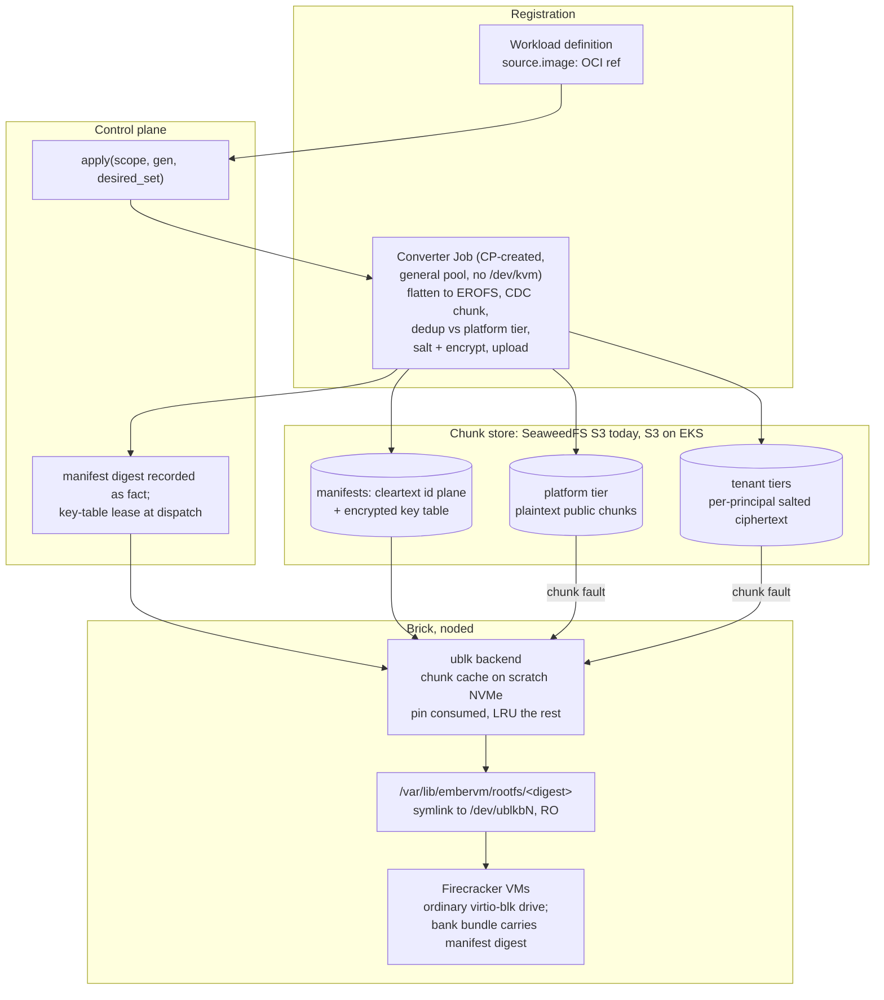

# ADR 028: Demand-Loaded Rootfs: OCI Registration, Content-Addressed Chunk Store, ublk Presentation

**Author:** jomcgi
**Status:** Draft
**Created:** 2026-07-31
**Supersedes in part:** [005 - EmberVM scale-out on EKS](005-embervm-eks-scale-out-metal-pool-bricks.md) (decision 3's Pattern A guest-base pipeline, and the initContainer bake that shipped in its place)
**Amends:** the invariant-4 premise recorded in `projects/embervm/ARCHITECTURE.md` section 5, scoped to the rootfs plane only (the chunk store becomes a runtime dependency for code paths a restored guest never exercised before banking; volumes and memory snapshots are untouched). The amendment lands with the mechanism, not with this draft.
**Builds on:** [025](025-local-disk-authoritative-s3-archive-interval.md) (content-addressed archiving discipline, principal-scoped erasure, the cross-principal dedup prohibition), [026](026-template-composition-gitops-registration.md) (the `apply(scope, generation, desired_set)` reconcile conversion hooks into), [027](027-snapshot-modes-workload-property.md) (the `shared/<principal>` keyspace precedent and the read-only-rootfs facts), [019](019-op-log-data-structure-payload-separation.md) (principal-scoped erasure as a schema invariant), [020](020-admission-control-plane-token-routing-peer-redistribution.md) (the admission surface registration extends)

---

## Problem

The guest base rootfs is built on the node, per image, at pod start.
`_noded-pod.tpl` ranges over `Values.workloads` and emits one initContainer
per image, each running `crane export | tar -x | mkfs.ext4` at 4 to 5
minutes on a cache miss. Kubernetes runs initContainers serially, so six
images cost 24 to 30 minutes of bake before a brick is Ready, before it
dials home, before it advertises any capacity. Three failure shapes follow:

1. **Node readiness is O(images).** Every added image adds 4 to 5 minutes
   to every future node's readiness. On an autoscaled metal pool this lands
   at the worst moment: under ADR 005 a Pending brick is the Karpenter
   signal, so a fresh node by definition serves overflow demand, and every
   bake minute must be bought back as standing warm-buffer capacity.
2. **The pod template embeds the image set.** Any image change rolls every
   brick in the fleet under bare RollingUpdate (the ADR 011 rollout gap;
   the tag-churn incident was this bug's shadow). Third-party images make
   the image set change at someone else's cadence.
3. **Per-node storage is catalogue-sized.** Every node holds every baked
   image whether or not any VM on that node ever uses it.

This is also drift from an Accepted decision. ADR 005 decision 3 decided
"a build-time, digest-pinned OCI image built with the existing apko +
Bazel pipeline, retiring the runtime BaseBuilder... Pattern A: the image
payload is a `rootfs.ext4` blob, unpacked by the default overlayfs
snapshotter, extracted once into a shared read-only content-addressed
cache on scratch". What shipped is the runtime BaseBuilder shape relocated
into an initContainer, not eliminated. This ADR names that drift and
supersedes both the decided Pattern A and the shipped substitute, because
neither survives third-party images: Pattern A assumes the platform's own
Bazel pipeline builds every guest image, and tenancy breaks that premise.

The design goal, stated as the destination rather than a ladder of interim
rungs: **performant on the homelab, tolerant of cold load and boot from
the network.** A network-served cold path is an accepted property of the
design, not a compromise to be engineered away later.

Prior art is Brooker et al., "On-demand Container Loading in AWS Lambda"
(USENIX ATC 2023): flatten OCI layers to one filesystem image, chunk,
convergent-encrypt, demand-load into Firecracker. This ADR takes its
manifest plane separation, its salt-in-key-derivation, and its
deterministic-flattening requirement, and deliberately does not take its
AZ cache fleet, erasure coding, compression, write-overlay bitmap, or
cross-customer dedup, each rejected below with reasons.

---

## Decision

Eight decisions.

**1. The public interface is an OCI image ref, and conversion is
in-Ember.** A workload definition carries an image ref. When ADR 026's
`apply(scope, generation, desired_set)` reconcile registers or updates a
workload whose ref changed, Ember converts the image into its internal
representation. Conversion output is content-addressed, so an unchanged
image is a no-op and rebuilds are idempotent. This generalizes past
Bazel-built apko images to arbitrary registered images; the apko pipeline
becomes one producer among many rather than the pipeline. A ref that
resolves for only one architecture constrains that workload's placement to
that architecture rather than being rejected.

**2. The internal representation is a flattened EROFS image cut into
content-defined chunks, described by a per-arch manifest with a cleartext
chunk-id plane and an encrypted key table.** OCI layers are applied in
order into a single EROFS filesystem image. EROFS is chosen because it is
reproducible out of the box, read-only by design (matching a rootfs that
is already `RootfsReadOnly: true`), and already enabled in the Kata guest
kernel (`CONFIG_EROFS_FS=y`), so no kernel work is needed. Chunking is
content-defined (FastCDC-class, target size settled by the sizing spike)
rather than fixed-offset: under fixed-offset chunking one inserted file
shifts every downstream block and churns the whole tail of the image,
which is why the paper needed a custom deterministic ext4 allocator;
content-defined boundaries follow the data, so an insertion churns O(1)
chunks and the determinism bar drops from "block-stable layout" to
"reproducible layout", which stock EROFS clears. The manifest maps byte
ranges to chunk ids. Following the paper's plane separation, the chunk-id
list is cleartext and bound as additional authenticated data while only
the key table is encrypted, so garbage collection can enumerate chunk
references without holding any key that can read them. Chunk universes
and manifests are per-arch. Chunks are not compressed: the guest kernel's
`CONFIG_EROFS_FS_ZIP` makes compressed EROFS available, but compression
before encryption is a plaintext-size side channel on the tenant tier and
the bandwidth benefit is marginal on both LAN SeaweedFS and same-region S3.

**3. The chunk store is two-tier, and invariant 3 stands unamended.**

| Tier | Owner | Encryption | Erasure |
| ---- | ----- | ---------- | ------- |
| Platform | `platform` principal | none (public first-party bases) | platform release action, never triggered by tenant deletion |
| Tenant | one principal each | convergent, key = H(salt_principal, plaintext), AES-CTR, chunk named by ciphertext hash | prefix delete of the principal's keyspace |

At conversion time each chunk is first checked, pre-salt on its plaintext
hash, against the platform tier; on a hit the manifest references the
platform chunk and no tenant copy exists. Everything else is encrypted
under the tenant's salt and stored in that principal's keyspace. The
per-principal salt makes invariant 3 hold cryptographically rather than by
policy: identical content in two principals produces different keys,
different ciphertexts, and different names, so no tenant chunk is ever
referenced by another tenant's manifest and ADR 019's erasure stays an
indexed prefix delete. Cross-principal dedup among tenants is not built;
the commonality that matters (the paper's own argument is common base
layers) is captured by the platform tier, whose chunks tenants reference
without copying. Referencing a platform chunk reveals only that a tenant's
image uses a public base file. The salt field exists in the key derivation
from day one, so any future dedup-scope change is a salt-policy change,
never a format change.

**4. Presentation is ublk: one read-only block device per in-use
manifest, at a stable digest-named path.** A noded-owned backend serves
each manifest as a host block device via ublk (io_uring userspace block,
kernel 6.0+; all four homelab nodes run 6.8, EKS AL2023 is 6.1+).
Firecracker attaches an ordinary drive, so the snapshot and restore path
is byte-identical to today: no new device model, no restore-time protocol.
That is a designed property, not an availability accident, and it is what
makes this compatible with bank/relight without touching the driver.
vhost-user-blk is rejected because Firecracker v1.12.1 (the Kata 3.32.0
bundle) cannot snapshot a microVM with vhost-user devices configured
(`docs/api_requests/block-vhost-user.md`: "At the moment, snapshotting is
not supported for microVMs that have vhost-user devices configured").
Bank/relight is how every class except task works, so this is
disqualifying rather than a caveat; revisit if Firecracker ships vhost-user
snapshot support. The drive path handed to Firecracker is a stable
symlink, `/var/lib/embervm/rootfs/<manifest-digest>`, pointing at
whichever `/dev/ublkbN` currently serves that manifest, so the path
recorded inside a snapshot is content-named and noded can satisfy it after
any restart by re-pointing the symlink. One device is shared read-only by
every VM on the brick using that image, exactly as the baked file is today.

**5. Cache policy: pin what an instance consumed, LRU-evict the rest,
collect garbage aggressively; and the invariant-4 premise is amended for
the rootfs plane.** The backend records which chunks it served to each
instance, so the pin set is free to compute. Chunks consumed by a live or
banked instance are pinned; everything else is LRU under real disk
pressure, and GC is deliberately aggressive because a cold load from the
network is fast by design. Full local hydration is rejected: it puts
per-node storage back at catalogue size, which undoes one of the three
reasons to build this.

What makes the weaker rule safe: a memory snapshot already contains the
guest's page cache. Relight reads the snapshot, not the rootfs, so a
restored VM resumes with its hot file data in memory and touches the block
device only for code paths it had not exercised before banking. The store
dependency at relight is therefore the cold tail by construction, not the
working set, and the pin set covers even that tail for chunks the instance
ever read.

The residual is stated rather than buried: **the chunk store becomes a
runtime dependency for genuinely-new code paths on a running restored
guest**, which cannot happen today, where a baked rootfs is complete on
local NVMe. A store outage no longer only slows warmth; a live request
that faults an uncached chunk blocks until the store answers. This is the
same trade every network-backed block device makes, and it is confined to
the rootfs plane: stateful volumes stay local-authoritative (ADR 025) and
memory snapshots stay fail-open-to-cold-boot. Invariant 4's enforcement
arm is unchanged; its premise ("warmth artifacts are never
correctness-critical") is narrowed for rootfs reads only, and
ARCHITECTURE.md section 5 is updated when the mechanism lands, not on this
draft, so the document keeps describing what is true now.

Provenance strengthens at the same time: the manifest digest is recorded
in every bank bundle and verified at relight. A mismatch discards warmth
and cold-boots (fail open on warmth, fail closed on provenance), which
upgrades today's unverifiable "never overwrite another rootfs-*.ext4"
convention into a checkable invariant. Rootfs and chunk GC liveness
becomes explicit digest references (workload registry entries, READY
bases, bank bundles), replacing liveness-by-directory-pointer, and the
paper's expired-state discipline is imported: a retired GC root passes
through an expired window in which any access raises an alarm and halts
further deletion.

**6. Conversion runs as a Job the control plane creates and watches,
never inside the control plane and not on noded.** Streaming multi-GB
image payloads through the BEAM violates invariant 2 (facts through the
control plane, payloads never) and would block it. noded is the wrong
host too: conversion is CPU- and I/O-heavy work that would contend with
microVM capacity on exactly the nodes sized for VMs, and it needs no
`/dev/kvm`, so on EKS it belongs on the cheap general pool rather than
the metal pool, which is a real cost argument. The control plane creates
the Job on registration, watches it, and records the resulting manifest
digest as a fact; the Job moves the payload node-to-store.

**7. Registration is a new admission surface and is capped.** An OCI
interface means anyone with registration authority can submit a 40 GB
image. Under ADR 020's admission posture: a platform ceiling on image
size, a conversion timeout, and per-principal conversion concurrency and
queue limits, all declared scalars in user-facing units. Without them the
converter is a denial-of-service target. This surface does not exist
today and ships with the converter, not after it.

**8. Key custody: control-plane wrap keys as brick leases now, KMS at
EKS, no format change.** Each principal's manifest key tables are wrapped
under a per-principal key. Before EKS those wrap keys are held by the
control plane and released to bricks at dispatch as memory-only leases
sealed to the brick's dial-home identity, the same class-2 credential
shape section 9 of ARCHITECTURE.md already defines; a key table is a
small lifecycle-rate fact, consistent with invariant 2. The stated
limitation is that control-plane compromise reads all tenant images. At
EKS, custody swaps to per-principal KMS keys with zero format change,
which is the property that matters. First-party platform-tier content is
plaintext by design throughout.

---

## Storage semantics against ADR 025: derived data, not durable state

ADR 025's "local disk is authoritative" is scoped to stateful volumes:
durable, single-writer tenant data whose only truth is the bytes on that
node. A rootfs is the opposite shape: derived data whose origin of truth
is a registry ref and a deterministic conversion. Losing every cached
chunk on a node loses nothing; the store rebuilds the node's working set
on demand and the converter rebuilds the store from the registry. So the
chunk store being authoritative for the rootfs plane sits alongside ADR
025 rather than contradicting it, and "local is authoritative" must not
be read as a global rule: it is a property of volumes, not of the
platform.

---

## Architecture

---

## Alternatives Considered

| Alternative | Rejected because |
| ----------- | ---------------- |
| vhost-user-blk presentation | Firecracker v1.12.1 cannot snapshot a microVM with vhost-user devices, and bank/relight is every class except task; disqualifying, not a caveat. Revisit if FC ships vhost-user snapshot support |
| FUSE file presented as the drive | The paper's own stated regret: four scheduler hops per miss, jitter under load; adopting the paper as written adopts the regret |
| Fixed-offset 512 KiB chunks over deterministic ext4 (the paper's shape) | Requires a custom serial allocator to make similar inputs block-stable; content-defined chunking gets shift-resistance from the chunker instead, and stock EROFS clears the remaining (reproducibility) bar |
| Full local hydration, hydration-complete as a bank precondition | Per-node storage returns to catalogue size, undoing a main reason to build this; the memory-snapshot page-cache argument plus consumed-chunk pinning makes the weaker rule safe |
| Whole-image lazy blob fetch (ADR 005 Pattern A, repaired) | Simpler, but no cross-image sharing of base chunks, eviction granularity is a whole image, and the 5 to 30 s first fetch lands on fresh nodes at spike time; it also keeps the platform-builds-everything premise tenancy breaks |
| Middle cache tier and erasure coding | No cache fleet to stripe at 10 to 50 nodes; on EKS, S3 same-region reads are free bandwidth while a cross-AZ peer cache pays per GB both ways, so a peer cache loses on cost and only wins latency intra-AZ; erasure coding has no substrate without a fleet |
| Cross-principal dedup among tenants (amending invariant 3) | The economics do not exist at this scale, erasure stops being a prefix delete, and chunk GC is already an open question in ADRs 025/027; the platform tier captures the base-layer commonality with zero cross-tenant coupling |
| Chunk or EROFS compression | Compression before encryption is a plaintext-size side channel on the tenant tier; benefit marginal at LAN and same-region bandwidth; `CONFIG_EROFS_FS_ZIP` remains available if the plaintext platform tier ever wants it |
| Write-overlay bitmap (the paper's CoW path) | The rootfs is already read-only with tmpfs scratch, and ADR 027's capture drive is a separate device; there is nothing for an overlay to do |
| Conversion inside the control plane | Multi-GB payloads through the BEAM violate invariant 2 and block the coordinator |
| Conversion on noded | Contends with microVM capacity on the nodes sized for VMs, and needs no `/dev/kvm`; on EKS it would occupy metal for work the general pool does cheaper |
| Native OCI ImageVolume (KEP-4639) | Already rejected in ADR 005: needs a containerd and control-plane feature gate EKS does not expose |
| Keep the initContainer bake | O(images) serial node readiness, fleet-wide brick rolls on any image change, catalogue-sized per-node storage; fails at tens of images, before tenancy scale |

---

## Security

Baseline: [docs/security.md](../../security.md).

- **Tenant image content is tenant code at rest.** The tenant tier is
  encrypted with per-principal salted convergent encryption; the
  SeaweedFS S3 gateway is anonymous by standing decision, so
  ciphertext-plus-external-keys is the access control for that store, and
  it remains defense in depth once EKS IAM exists.
- **The per-principal salt kills the confirmation-of-file attack across
  principals**: an observer cannot test whether another tenant's image
  contains a known file, because the same plaintext yields a different
  chunk name per principal. Within a principal it reveals only what the
  principal already knows. Referencing a platform chunk reveals only use
  of a public base file.
- **Erasure stays an indexed prefix delete** (ADR 019): no tenant chunk
  is ever referenced outside its principal, and platform chunks are never
  deleted on tenant erasure. Platform-tier GC enumerates references
  through the cleartext chunk-id plane without holding tenant keys.
- **Pre-EKS custody limitation, stated**: the control plane holds the
  wrap keys, so control-plane compromise reads all tenant images. Leases
  to bricks are memory-only and sealed to dial-home identity (the class-2
  shape). KMS custody at EKS removes the central readable keyring with no
  format change.
- **The converter is the one component with registry egress.** Guests
  never pull images; the converter Job pulls the registered ref under the
  admission caps of decision 7, with per-principal pull credentials
  scoped to that Job (open question 5 covers their storage shape).
- **GC deletes tenant data at rest**, the uniquely risky operation; the
  expired-window alarm from decision 5 exists so an incomplete-liveness
  bug halts deletion instead of completing it.

---

## Risks

| Risk | Likelihood | Impact | Mitigation |
| ---- | ---------- | ------ | ---------- |
| Store outage blocks a running restored guest's first touch of an unexercised code path (new failure semantics on the rootfs plane) | Medium | **High** | Pin set covers everything the instance ever read, so exposure is genuinely-new paths only; alarmed backend metric for fault latency; cold boot from network stays fast by design; residual accepted and named in the invariant-4 amendment |
| GC or LRU evicts a chunk the pin set should have held (bookkeeping bug class; the rootfs GC already leaked once by pointer-liveness) | Medium | High | Liveness is explicit digest references, not directory pointers; expired-window alarm halts deletion on any access; cold boot is the recovery |
| Converter abused as a DoS target (40 GB image, tar bombs, slow registries) | High | Medium | Decision 7's caps ship with the converter: size ceiling, timeout, per-principal concurrency and queue depth |
| Dedup ratio and boot working set are unknown for this image population | High | Medium | The sizing spike measures both before parameters freeze; the design's latency case does not depend on dedup being good |
| SeaweedFS chunk-GET tail latency at 512 KiB under concurrency is unmeasured | Medium | Medium | Spike measures it; levers are chunk size and read-ahead, never a cache tier |
| ublk device state does not survive a noded restart | High | Low | Devices are re-created from the persisted registry on start and the digest-named symlink re-pointed before any restore; the registry-survives-restart pattern already exists |
| Conversion queue backs up registration (a slow registry stalls the reconcile) | Medium | Low | Conversion is async off the reconcile; the workload stays unready with a stated reason until its manifest fact lands |
| Guest boots regress on EROFS (behavioural difference from ext4) | Low | Medium | Same guest kernel, RO mount either way; soak per image during cutover, cold boot on the old path remains available until retirement |

---

## Open Questions

1. **CDC parameters**: target chunk size and cut policy, settled by the
   sizing spike rather than imported from the paper's 512 KiB legacy.
2. **Pin-set persistence**: whether consumed-chunk pins are persisted
   with the registry across noded restarts or rebuilt lazily from bank
   bundles on first touch.
3. **Platform-tier GC cadence** against the 7-day bank pin horizon and
   the 30-day workspace tier, and who runs the root rotation.
4. **Salt rotation**: the field exists from day one; whether rotation
   machinery (time, popularity, placement) is ever worth building at this
   blast radius, or the principal dimension alone is the permanent answer.
5. **Private-registry credentials** for tenant OCI refs: per-principal
   pull secrets at conversion time, their storage shape, and their
   admission review.
6. **Eager warming for serving and stateful classes**: whether
   long-running classes should prefetch their manifest's full chunk set in
   the background as a posture choice, given task and session need not.
7. **Whether the platform tier adopts EROFS compression** once it is
   plaintext-only and the side-channel argument does not apply.

---

## References

| Resource | Relevance |
| -------- | --------- |
| Brooker et al., "On-demand Container Loading in AWS Lambda", USENIX ATC 2023 ([arXiv 2305.13162](https://arxiv.org/abs/2305.13162)) | The manifest plane separation, salt-in-key-derivation, deterministic flattening requirement, and expired-window GC discipline this adopts; the cache fleet, erasure coding, compression, and write overlay it deliberately does not |
| [ADR 005](005-embervm-eks-scale-out-metal-pool-bricks.md) | Decision 3 (Pattern A) this supersedes; the Pending-brick Karpenter contract that makes node readiness the binding constraint |
| [ADR 025](025-local-disk-authoritative-s3-archive-interval.md) | The local-authoritative scope this ADR bounds to volumes; principal-scoped erasure; the cross-principal dedup prohibition the two-tier store preserves |
| [ADR 026](026-template-composition-gitops-registration.md) | The `apply` reconcile conversion triggers from |
| [ADR 027](027-snapshot-modes-workload-property.md) | The `shared/<principal>` keyspace precedent; the read-only rootfs and separate capture-drive facts that eliminate the write overlay |
| [ADR 019](019-op-log-data-structure-payload-separation.md) | Erasure as an indexed principal-scoped delete, which the tenant tier keeps true |
| [ADR 020](020-admission-control-plane-token-routing-peer-redistribution.md) | The admission posture decision 7's caps extend |
| `projects/embervm/ARCHITECTURE.md` | Invariants 2, 3, and 4; the class-2 credential lease shape decision 8 reuses; the invariant-4 premise amendment lands with the mechanism |
| `projects/embervm/chart/templates/_noded-pod.tpl` | The per-image initContainer range this retires |
| `projects/embervm/chart/templates/noded-rootfs-builder-configmap.yaml` | The runtime bake script this retires |
| `projects/embervm/noded/server/rootfs_gc.go` | The pointer-liveness GC replaced by explicit digest references |
| Firecracker v1.12.1 `docs/api_requests/block-vhost-user.md` | "At the moment, snapshotting is not supported for microVMs that have vhost-user devices configured": the fact that decides ublk over vhost-user-blk |
| ublk (`Documentation/block/ublk.rst`, kernel 6.0+) | The presentation mechanism; homelab nodes run 6.8, EKS AL2023 is 6.1+ |
| [docs/security.md](../../security.md) | Security baseline |
