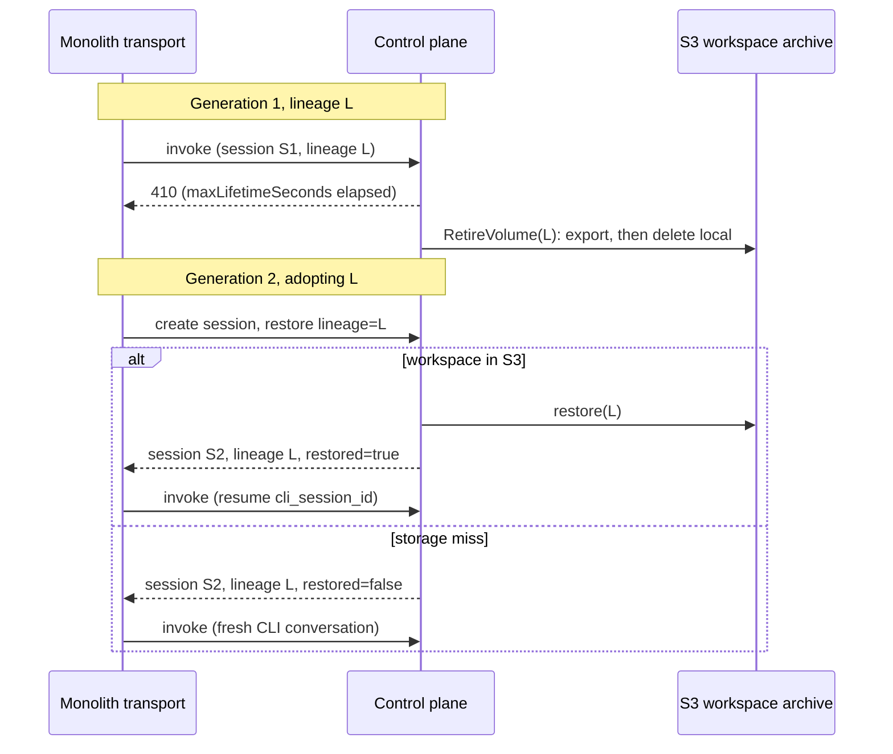

# ADR 030: Lineage Decoupled from Session Generation, Restored by Adoption Across the 6h Boundary

**Author:** Joe McGinley
**Status:** Accepted
**Created:** 2026-08-04
**Amends:** [ADR 027](027-snapshot-modes-workload-property.md)'s `memory: false, filesystem: true` quadrant description, which conflated the durable workspace identity with the live session row
**Builds on:** [ADR 025](025-local-disk-authoritative-s3-archive-interval.md) (local-disk-authoritative, S3-archive-on-retire, the mechanism the retirement/adoption handshake reuses), [ADR 027](027-snapshot-modes-workload-property.md) (the quadrant this ADR's workload rides, and the close-triggered capture this ADR's retirement handshake depends on)

---

## Problem

claude-runtime sessions run in the ADR 027 `memory: false, filesystem: true` quadrant: no memory snapshot, a per-lineage durable workspace that is captured to S3 on close and read back on deliberate restore. A session rides its birth base image for `maxLifetimeSeconds` (6h today, `session.max_lifetime_seconds` in `session_manager.ex:761`), then the next `invoke` 410s. That bound exists so a session cannot run a stale or broken shim indefinitely once a newer base has published; it is a version-convergence bound, not a claim about how long the workspace itself is good for. ADR 027's own workspace design says the opposite about the data: the S3 archive is unpinned and content-addressed, so it "survives base digest churn, kernel upgrades, and vendor migration."

The monolith does not treat those two lifetimes as different today. `EmberVmShimTransport.deliver` (`projects/monolith/agent_sessions/transport.py:349-362`) catches a 403/410 on invoke, and its only response is `create_session()`, a brand-new control-plane session with no continuity argument, followed by a retry with `cli_session_id=None`. Every 6h boundary therefore throws away the CLI's own conversation store even though ADR 027 kept the workspace it lived in durably in S3. The user-visible effect is a session that forgets everything it was doing, on a clock that has nothing to do with how much the user has said or how large the workspace is.

The conflation that let this go unnoticed is in the control plane's own session identity. `register_and_start` (`session_manager.ex:750-761`) sets `session_id: lineage_id` for every persistence-enabled create; today session and lineage are the same value, minted once, for the whole life of the object. That equivalence is soft rather than structural: every volume verb the control plane already sends (`ArchiveVolumeRequest`, `RetireVolumeRequest`, `DeleteVolumeRequest`, `WakeInstance.dial_for_session_volume`) threads a parameter literally named `lineage_id`, not `session_id`, because the volume layer was already keyed on the durable identity, not the live row. Nothing forces the two to move together; nothing has yet asked them to move apart. This ADR asks them to.

## Decision

**Lineage is decoupled from session generation.** The lineage id is the durable identity of a workspace; a session is one generation riding it, bounded by `maxLifetimeSeconds`; `session_id == lineage_id` holds only for an un-adopted create, the first generation of a lineage. A second generation gets its own `session_id` and inherits the prior lineage's workspace by **adoption**, not by copying and not by reusing the old session row. This is stated as an amendment to ADR 027's quadrant description, which described the workspace as durable but did not yet say what happens to it once its session expires; the workspace was already lineage-scoped in the code (see the `lineage_id`-named volume verbs above), this ADR just names that scoping as the durable identity and gives it a lifecycle independent of the session generation riding it.

**`maxLifetimeSeconds` (6h) is reaffirmed, not extended.** It stays a hard version-convergence bound: a session must not keep running a base it was born on forever, because doing so is exactly the failure mode `values.yaml`'s own documented cost of the base retention sweep already names, "every publish leaks another 4 GiB per brick until the GC is fixed" (#4286), since the sweep only reclaims bases with no live registry entry. A session pinned to a stale base for longer keeps that base's entry live for longer, which is the wrong direction for a bug already tracked as a leak. Raising the ceiling to buy continuity would fight the bound's own purpose and make #4286 worse, not fix the loss. Continuity is provided a different way: **adoption**, a new session generation on the current base, inheriting the prior generation's workspace instead of starting blank. The two problems, "don't run a stale shim forever" and "don't lose the user's conversation at the boundary," are solved by two different mechanisms rather than by one knob asked to do both.

*Naming note: "adoption" here is a new use of a word `session_manager.ex` already uses for a different mechanism, the boot-time reconcile that rebinds an orphaned durable-but-processless session row to its live VM from `NodeStatus` (`session_manager.ex:1974` onward, the `adopt_one`/`adopt_live` family). The two are unrelated: process adoption rebinds a row to a process within the same generation; workspace adoption starts a new generation and hands it a prior generation's storage. Both terms are kept because each is the natural word for what it does; readers of `session_manager.ex` should not conflate the two mechanisms because they share a name.*

| Aspect | Today | Decided |
| ------ | ----- | ------- |
| `session_id` vs `lineage_id` | Always equal; one mint, one row, one lifetime | Equal only on an un-adopted create; an adopted session gets a new `session_id` on the prior `lineage_id` |
| What ends at `maxLifetimeSeconds` | The session AND, in effect, the workspace's reachability (nothing resumes it) | Only the session generation; the lineage's workspace persists and is reachable by the next generation |
| Monolith behavior on 410 | Create a fresh session, `cli_session_id=None`, blank workspace | Catch the 410, create-with-restore naming the prior lineage, resume the CLI conversation against the restored workspace |
| Continuity mechanism | None (extending the lifetime was the only lever available) | Adoption: a new generation on the current base, workspace inherited |
| Storage-miss behavior | N/A (workspace was never reused) | Degrade to a blank workspace, `restored: false`; never point CLI resume at a missing rollout |

### Adoption rules

1. **Principal-scoped, never cross-principal.** Inherits [ADR 025](025-local-disk-authoritative-s3-archive-interval.md)'s and [ADR 019](019-op-log-data-structure-payload-separation.md)'s standing prohibition, itself traced to [ADR 001](001-embervm-beam-firecracker-workload-orchestrator.md): no VM and no snapshot lineage ever crosses a principal. A lineage's workspace is adoptable only by a session created under the same principal that owned the prior generation.
2. **Terminal-predecessor-only.** A lineage is adoptable only when its latest session is terminal (expired, closed, or destroyed). A lineage whose latest session is still live, parked, or banked has nothing to adopt into; the live generation already owns the workspace.
3. **Exclusive: at most one live heir per lineage.** A lineage can be adopted into exactly one new generation at a time. This is what keeps "the workspace is retired or it is attached, never both, never neither" (see the no-loss invariant below) a property of one adopter racing the retirement worker, rather than a property that also has to hold across N simultaneous adopters racing each other.
4. **Restore-before-prime-before-invoke.** The workspace is attached and, if it was archived, restored from S3 before the CLI spawns its first turn on the new generation. A session that starts serving invokes before its workspace is in place would let the first turn write into an empty directory that the restore then either clobbers or races; ordering removes that class of bug rather than handling it.

### The retirement/adoption handshake and the no-loss invariant

Retirement already runs at session close under [ADR 025](025-local-disk-authoritative-s3-archive-interval.md) decision 3 (as amended by ADR 027 for this quadrant: capture moves from bank to close): `retire_session_volume` sends `RetireVolumeRequest` (`session_manager.ex:3239-3267`), which exports the workspace to S3 and deletes the local copy only **after** the durable export lands, mirroring the same commit-before-delete ordering ADR 025 decision 3 requires for the stateful volume archive. Adoption adds two things to that handshake, both needed because a second generation can now show up asking for a workspace retirement was already in flight for:

- **An adopting prime clears any pending retirement intent for that lineage.** If a generation expires and its workspace retirement has been scheduled but has not yet run, an adopter that shows up first must cancel it rather than race it; adopting a workspace that is mid-export and then also being locally deleted underneath the adopter is exactly the corruption this handshake exists to prevent.
- **The SESSION_WORKSPACE export worker refuses to read a lineage that is currently attached.** An attached lineage means a live generation (the adopter) already has it; exporting from underneath a live attach would read a workspace that is actively being written, the same torn-read hazard ADR 025 decision 3 already rejected for volumes ("a diff started at checkpoint is torn if the bank aborts and the VM resumes writing at the next generation"), applied here to the adoption boundary instead of the bank boundary.

**The invariant, stated explicitly:** at every instant, either the local volume exists (an adopter attaches it directly, no S3 round trip) or the S3 export completed before the local copy was deleted (an adopter restores from S3). There is no window where both are gone. That invariant is exactly why lineage reuse has no capture/restore race to design around: the two states are the only two states, retirement can only move from the first to the second (never skip the S3 commit), and exclusivity (adoption rule 3) means only one process is ever on either side of that transition for a given lineage at a time.

### Restore trigger: monolith-side, on the expiry 410

The monolith transport catches the 410 it already catches today (`transport.py:351-362`) and, instead of creating a bare new session, creates a session **with restore**: a create body naming the prior lineage id. This keeps the control-plane lifecycle honest in the sense ADR 016's session model already assumes: an expired session is terminal, a new generation is a new row with its own `session_id`, and the generation boundary is explicit to the caller rather than papered over. The monolith is the right place for this because it already owns the retry decision and already holds the prior `ember_session_id`/`cli_session_id` pair it needs to know what to ask for; putting the trigger here, rather than having the control plane resurrect expired sessions on its own, keeps "a new generation is a new row" true without a special case.

**On a storage miss** (the S3 export for that lineage is gone, corrupted, or was never written), the create-with-restore degrades to a blank workspace and reports `restored: false`. The monolith reads that flag and starts a fresh CLI conversation rather than passing the old `cli_session_id` to `codex exec resume` (or the CLI's equivalent resume flag) against a rollout that does not exist. A resume call pointed at a missing rollout is not a graceful failure, it is a crash or a confusing error surfaced to the end user; degrading up front, at the one place that already knows whether the restore succeeded, avoids ever making that call.

### Retention is unaffected by generation turnover

The S3 workspace key is per-lineage, not per-session-generation (this was already true; adoption does not change it), so `latest + N` retention (ADR 027 amendment 2) and its GC keep meaning exactly what they meant before this ADR: N is counted per lineage, and a generation boundary inside that lineage's life is invisible to the retention policy. Nothing about adoption changes what gets kept or for how long, only who gets to read it next.

---

## Architecture

---

## Alternatives Considered

| Alternative | Rejected because |
| ----------- | ----------------- |
| Copy the workspace into a brand-new lineage on every generation turnover | Needs a new proto/RPC surface no existing verb offers; moves a full workspace's bytes (potentially GBs) at every 6h boundary rather than a cheap attach or a bounded S3 restore; reintroduces exactly the capture/restore race the reuse-the-lineage design avoids by construction, since now two lineages briefly both hold copies of the same data mid-copy |
| Control-plane auto-resurrection of an expired session (extend the existing row past 410 rather than issue a new generation) | Blurs token and identity semantics: a session token is minted per generation, and silently reviving an expired row means a caller could keep using a token whose generation boundary it never crossed; hides the generation boundary from the very layer, the monolith, that needs to know a rollover happened so it can decide whether to resume or start fresh |
| Raise `maxLifetimeSeconds` past 6h to buy continuity without a restore mechanism | Fights the bound's own purpose (a session must not keep running a stale base indefinitely) and worsens the already-tracked #4286 base leak, since a longer-lived session keeps its birth base's registry entry live for longer, which is exactly what the sweep fails to reclaim |
| Fail the create outright on an S3 storage miss during restore | Turns a transient or partial storage failure into a permanently bricked agent session with no self-heal path; degrading to a blank workspace lets the session continue, at the cost of lost history, which is a strictly better failure mode than an unrecoverable create failure |

---

## Security

Baseline: [docs/security.md](../../security.md). No new trust boundary; adoption is bounded by the same principal-isolation rule that already governs every other volume and snapshot lineage operation (ADR 001, ADR 019, ADR 025). Two things worth stating rather than leaving implicit:

- **Adoption is not an authorization mechanism.** Knowing a lineage id is not sufficient to adopt it; the adopting create must run under the same principal that owned the prior generation, checked the same way every other principal-scoped operation on this lineage already is. Adoption adds no new capability surface beyond what retiring and restoring a workspace already required.
- **Exclusivity (adoption rule 3) is also a security property, not just a correctness one.** Without it, two concurrent adopters under the same principal could both attach the same lineage, and whichever one wins the local-attach race would silently discard the other's writes with no signal to either caller. Restricting to one live heir per lineage removes that ambiguity by construction.

---

## Risks

| Risk | Likelihood | Impact | Mitigation |
| ---- | ---------- | ------ | ---------- |
| A retirement export and an adopting prime race on the same lineage despite exclusivity, if the "clear pending retirement intent" step has a gap | Low | High | The no-loss invariant is the design target precisely to close this; the export worker's own refusal to read an attached lineage is the second, independent check, not just the adopter's cancel |
| The monolith's create-with-restore call and a slow S3 restore add latency to the first invoke of a new generation, worse than today's blank-workspace create | Medium | Low | Bounded by the same workspace size budget ADR 027 amendment 4 already caps; a restore is reading a ~10MB-class artifact by default, not an unbounded one |
| A storage miss degrades silently enough that a user sees "the agent forgot everything" with no visible signal it was a restore failure rather than expected turnover | Medium | Medium | `restored: false` is a first-class field in the create-with-restore response specifically so the monolith (and, via it, product surfaces) can distinguish "fresh by policy" from "fresh because restore failed"; surfacing that distinction to the user is follow-on product work, not solved by this ADR alone |
| The double-failure path (session expires AND the prior generation's own retirement or restore fails) is under-specified at the monolith's data layer, since `AgentSession` today models one `ember_session_id`/`cli_session_id` pair, not a lineage with a generation history | Medium | Medium | Named explicitly as a follow-on: a monolith schema slice to track lineage across generations is required to survive this path cleanly rather than papering over it in application logic |

---

## Open Questions

1. Whether `restored: false` should be surfaced to the end user directly (a visible "this session lost its history" notice) or handled silently with the CLI simply starting fresh; this is a product decision downstream of this ADR, not resolved here.
2. Whether adoption should ever be offered explicitly (a caller names a lineage to adopt on create, independent of the 410 path) versus staying purely reactive to the monolith's own expiry handling, the only entry point this ADR designs.
3. Whether the per-principal wake/relight rate limiting that already governs parked-session rejoin ([ADR 029](029-parked-sessions-disk-bucket-not-cap.md)) should also bound adoption rate, given an adopting create is, like rejoin, a caller asking to resume prior state rather than starting genuinely fresh work.

---

## References

| Resource | Relevance |
| -------- | --------- |
| [ADR embervm/027](027-snapshot-modes-workload-property.md) | The `memory: false, filesystem: true` quadrant this ADR's workload runs, and the close-triggered capture (amendment 1) the retirement handshake depends on; this ADR amends its quadrant description to decouple lineage from session generation |
| [ADR embervm/025](025-local-disk-authoritative-s3-archive-interval.md) | Local-disk-authoritative, commit-before-delete archiving, and the cross-principal dedup prohibition this ADR's adoption scoping inherits |
| [ADR embervm/019](019-op-log-data-structure-payload-separation.md) | Decision 4, the schema-level encoding of the no-cross-principal isolation rule adoption is scoped by |
| [ADR embervm/001](001-embervm-beam-firecracker-workload-orchestrator.md) | The standing no-cross-principal isolation rule ADR 019 and ADR 025 both trace to |
| [ADR embervm/029](029-parked-sessions-disk-bucket-not-cap.md) | The parked/wake-rate-limit precedent cited in open question 3 |
| GitHub #4306 | The tracking issue this ADR's design decision was made for |
| GitHub #4309, #4307 | Related tracked slices of the same design (control-plane and monolith sides respectively) |
| GitHub #4286 | The base-retention-sweep leak this ADR's reaffirmation of `maxLifetimeSeconds` avoids making worse |
| `projects/embervm/control/lib/embervm/session_manager.ex:750-761` | `register_and_start`, where `session_id: lineage_id` is set today, the equivalence this ADR narrows to un-adopted creates only |
| `projects/embervm/control/lib/embervm/session_manager.ex:3239-3267` | `retire_session_volume`, the existing `RetireVolumeRequest` handshake this ADR's adoption logic extends with pending-intent cancellation |
| `projects/embervm/control/lib/embervm/session_manager.ex:1974` onward | The existing, unrelated use of "adoption" for boot-time process rebinding; disambiguated from this ADR's workspace adoption in the Decision section |
| `projects/monolith/agent_sessions/transport.py:349-362` | `EmberVmShimTransport.deliver`'s existing 403/410 handling, the exact place the create-with-restore call replaces a bare `create_session()` |
| `projects/embervm/deploy/values.yaml:335-354` | The documented #4286 base-leak cost this ADR's reaffirmed `maxLifetimeSeconds` avoids compounding |
| `docs/security.md` | Security baseline |
