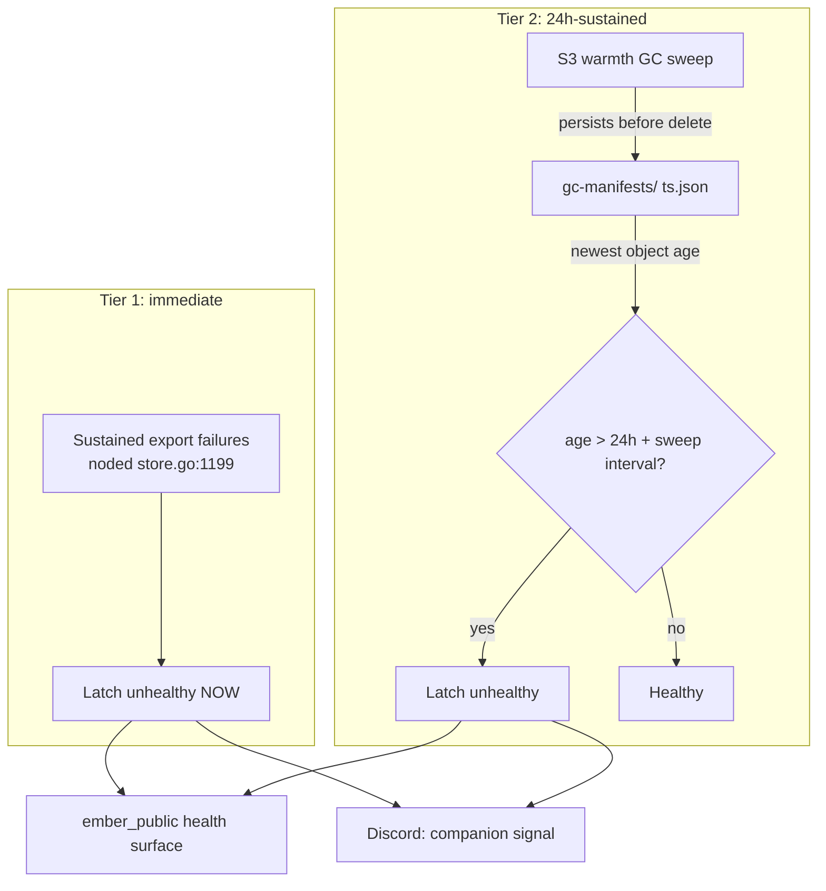

# ADR 031: Health Signals Classified by Time-to-Impact, Both Tiers Latch the Health Surface

**Author:** Joe McGinley
**Status:** Accepted
**Created:** 2026-08-04
**Relates to:** [ADR platform/007](../platform/007-seaweedfs-bucket-provisioning-cosi.md) (the earlier, unrelated instance of the same blind spot: "nothing alerts on object-storage growth"), [ADR embervm/025](025-local-disk-authoritative-s3-archive-interval.md) (the local-disk-authoritative, S3-archive-on-close design whose export failures are Tier 1's first member)

---

## Problem

During incident #4317 (2026-08-04), the SeaweedFS `embervm` collection ran out
of writable volumes and every artifact export 500'd for hours, across every
artifact kind noded exports: `store: PUT "session-workspace/claude-runtime/s-.../workspace.img": unexpected status 500`,
and the same for BASE, VOLUME, and STATEFUL exports. Durability was broken
fleet-wide. Throughout that window, the public ember health composite
(`ember_public/health.py`) stayed green, because its four synthetic probes
exercise only the session create/send path (they write and read the
`ember_synthetic_probe` latch on a 5-minute CronWorkflow cadence, checked
stale past `EMBER_SYNTHETIC_STALENESS_S = 750.0`), never the artifact
durability path. A session that parks during a sustained export-failure
window and later rejoins rehydrates blank: ADR 025's local-disk-authoritative
design means the local copy survives until retirement runs, but retirement's
own export-then-delete ordering means a workspace that crosses a retire or
adopt boundary during the outage can lose its only durable copy. That is
user-visible data loss, and the health signal that exists today would not
have shown it: create and send kept working the entire time.

Separately, and unrelated in mechanism, the S3 warmth GC
(`control/lib/embervm/s3_warmth_gc.ex`) had been silently aborting every
sweep for 11 days before #4317 surfaced it. The GC persists an audit
manifest to `gc-manifests/<ts>.json` *before* any delete, on every sweep
including dry runs (`s3_warmth_gc.ex:757-776`), on an hourly cadence
(`@sweep_interval_ms`, `s3_warmth_gc.ex:85`). An aborted sweep, for any
reason, produces no manifest for that cycle, so the newest object under
`gc-manifests/` stops advancing the moment sweeps start failing, regardless
of which check aborted them. Nothing consumed that absence as a signal.
[ADR platform/007](../platform/007-seaweedfs-bucket-provisioning-cosi.md)
had already named this exact class of gap, from a different incident, the
34 GB Iceberg lakehouse orphan: "nothing alerts on object-storage growth."
The GC stall is the same blind spot recurring against a second, unrelated
mechanism.

Two failures, no signal, for two different reasons: the fast one because the
existing probes were never designed to cover the durability path at all; the
slow one because a maintenance-debt signal with no consumer degrades
silently no matter how loudly it would have alerted, if anything had been
listening.

## Decision

EmberVM health signals are classified by **time-to-impact** into two tiers.
Both tiers end in the health surface, not alert-only, because #4317 is
direct proof that an alert-only signal for slow-burn debt goes unread: the
GC aborted for 11 days and nothing surfaced it until the outage it was
supposed to help prevent capacity for had already started.

**Tier 1, platform-impact now, marks ember unhealthy immediately.** First
member: sustained artifact export failures (noded's "async export failed"
retries, `store.go:1199`, and the underlying store PUT errors). The reason
this cannot wait is that the harm is not prospective: a session parking
during a sustained export-failure window rehydrates blank on its next wake,
which is data loss to a real user, happening now, even while create/send
(the surface the existing probes check) continues to serve normally.

**Tier 2, longer-horizon maintenance debt with days of runway, marks ember
unhealthy only after sustained >24h.** First member: the S3 warmth GC
failing to complete a sweep, measured as the age of the newest
`gc-manifests/` object exceeding 24 hours plus the sweep interval. This
measurement survives CP restarts, because it reads a durable S3 object
rather than an in-memory streak counter, and it covers every abort reason
by construction: whatever caused a sweep to abort (the fleet-freshness gate,
the empty-store guard, a list failure), no manifest lands for that cycle
either way, so the signal does not need to enumerate abort causes to catch
all of them.

| Aspect | Tier 1 | Tier 2 |
| ------ | ------ | ------ |
| First member | Sustained artifact export failures | S3 warmth GC failing to complete a sweep |
| Trigger | Immediate on a sustained failure streak | Only after >24h sustained |
| Measurement | Export failure streak (noded/CP-aggregated) | Age of newest `gc-manifests/` object |
| What is actually at risk | A user's data or turn, right now | Maintenance debt with weeks of runway before it becomes an outage |
| Survives CP restart | Implementation detail, tracked in #4338 | Yes, by construction (S3 object, not in-process state) |

### Why the asymmetry

Latching health drives paging and the operator's first reflexes toward
serving-tier actuators: rollback, restart, "is my change live." Firing that
reflex instantly for a signal whose actual runway is measured in weeks (the
GC backlog does not become an outage overnight; #4317 took 11 silent days
of stalled sweeps plus whatever capacity was already being consumed before
it became symptomatic) produces a false "ember is down" and trains
operators to either distrust the health surface or reach for the wrong
fix. But demoting that same signal to alert-only is not an acceptable
alternative either, because #4317 is the second time this repo has watched
exactly that happen: ADR platform/007 named the pattern once already, for a
different mechanism, and the GC stall repeated it rather than being caught
by the lesson.

The 24-hour threshold is deliberately generous relative to the tier's own
runway. It only needs to be short enough that a stalled GC surfaces before
its backlog becomes dangerous, not so short that it flaps on a single
missed or fleet-freshness-gated sweep, both of which are expected, routine
occurrences under the GC's own design and not themselves outages.

Discord alerts continue to accompany both tiers; they are not removed. What
changes is their role: they are a companion signal, not the system of
record. The health surface is.

## Architecture

## Alternatives Considered

| Alternative | Rejected because |
| ----------- | ----------------- |
| Latch health immediately on any single GC sweep abort, no grace window | The GC's own abort conditions (the fleet-freshness gate, the `allowEmptyKinds` guard) are expected to trip occasionally in normal operation; an instant latch would page on routine caution, not on an outage, and would teach operators to ignore ember's health status |
| One uniform tier for every signal, either all-immediate or all-delayed | All-immediate makes the GC's routine caution page like a live outage; all-delayed leaves #4317's failure mode, data loss in progress right now, invisible for up to a day |
| Keep the slow tier alert-only, put only the fast tier in the health surface | This is the status quo that produced #4317's 11-day silent stall, and repeats the exact blind spot ADR platform/007 already named once for a different mechanism |
| Extend the existing synthetic probes to exercise durability directly, rather than a separate export-failure latch | A real candidate, not rejected outright: a durability probe (plant a marker, force export, restore, verify) costs a full session slot and workspace export per run, so it needs a slow cadence and disciplined cleanup against the workload cap (ADR 029's parked-session accounting). Left as an implementation choice for #4338 rather than decided here |

## Consequences

The synthetic probe family needs either a durability leg added to its
existing create/send cadence, or a separate export-failure-streak latch
alongside it; which shape it takes is implementation, tracked in #4338, not
decided by this ADR. Detectors for both tiers land `suspend: true` and flip
on only after live verification, per the standing rule that a
health-affecting detector never proven against real traffic is worse than
no detector. The >24h/`gc-manifests` measurement is a floor set by how
slowly the underlying debt actually becomes dangerous, not a tuned alarm
threshold to be second-guessed against the timeline of a single incident.

## Security

Baseline: [docs/security.md](../../security.md). No new trust boundary.
This classifies operational signals that already exist, artifact export
failures noded already logs, GC manifest objects the CP already writes,
into a health posture; it adds no new read or write surface.

## Risks

| Risk | Likelihood | Impact | Mitigation |
| ---- | ---------- | ------ | ---------- |
| Tier 1's streak threshold is implemented too tight and flaps on transient network blips rather than a sustained outage | Medium | Medium | Exact streak length is implementation and tuning, tracked in #4338; this ADR fixes the classification (immediate, data-loss-driven), not the count |
| Tier 2's >24h threshold proves too generous if a future incident's real runway is shorter than the weeks assumed here | Low | Medium | Revisit the threshold if a GC-stall incident's measured runway-to-outage comes in meaningfully under what this ADR assumes |
| The `gc-manifests/` age measurement drifts out of sync with reality if the sweep interval changes without the threshold following it | Low | Low | The threshold is stated as "24h plus the sweep interval," not a bare absolute, specifically so it tracks the interval rather than needing a manual update alongside it |

## Open Questions

1. Whether Tier 1 is implemented as an extension of the existing synthetic
   probes or as a separate noded/CP-side export-failure-streak latch;
   tracked in #4338, not decided here.
2. Whether the health surface should distinguish "durability unhealthy"
   from "GC-stall unhealthy" to a human reading it, or whether one combined
   component covering both tiers is sufficient.
3. Exact streak-length and staleness-window tuning for both tiers, deferred
   to implementation and live verification per the standing rule.

## References

| Resource | Relevance |
| -------- | --------- |
| GitHub #4317 | The closed incident: SeaweedFS `embervm` collection exhausted, every artifact export 500'd for hours, root cause and impact |
| GitHub #4338 | Tracking issue for the implementation this ADR's decision requires; related #4334, #4336, #4337 |
| [ADR platform/007](../platform/007-seaweedfs-bucket-provisioning-cosi.md) | The earlier, unrelated instance of the same blind spot ("nothing alerts on object-storage growth"), from the 34 GB Iceberg orphan |
| [ADR embervm/025](025-local-disk-authoritative-s3-archive-interval.md) | Local-disk-authoritative, S3-archive-on-close design whose export failures are Tier 1's first member |
| [ADR embervm/029](029-parked-sessions-disk-bucket-not-cap.md) | The workload-cap accounting a durability synthetic probe would compete against, cited in Alternatives |
| `projects/monolith/ember_public/health.py` | The existing synthetic-probe-backed health composite this decision extends |
| `projects/monolith/ember_public/synthetic.py`, `synthetic_models.py` | The `ember_synthetic_probe` latch table the existing create/send probes write to |
| `projects/embervm/noded/server/store.go:1199` | The `"noded: async export failed (will retry on reconcile)"` log line, Tier 1's first member |
| `projects/embervm/control/lib/embervm/s3_warmth_gc.ex:757-776` | `persist_manifest/5`, the `gc-manifests/<ts>.json` audit manifest written before any delete, Tier 2's measurement source |
| `projects/embervm/control/lib/embervm/s3_warmth_gc.ex:85` | `@sweep_interval_ms`, the hourly sweep cadence Tier 2's threshold is stated relative to |
| `docs/security.md` | Security baseline |
