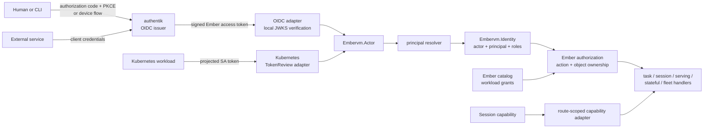

# ADR 032: Federated Identity Adapters and authentik Homelab SSO

**Author:** Joe McGinley
**Status:** Draft
**Created:** 2026-08-07
**Builds on:** [001 - EmberVM](001-embervm-beam-firecracker-workload-orchestrator.md) (principal isolation), [019](019-op-log-data-structure-payload-separation.md) (principal-scoped erasure), [024](024-identity-hierarchy-templates-and-registration.md) (principal and domain hierarchy, guest identity assertion)
**Relates to:** [agents/011](../agents/011-cloudflare-managed-oauth.md) (the existing MCP-specific OAuth edge), [agents/048](../agents/048-codex-oauth-token-broker.md) (provider credential brokerage, which is not caller identity)

---

## Problem

Ember authenticates every ordinary `/v1` management request by sending its
bearer token to the Kubernetes TokenReview API and comparing the returned
ServiceAccount username with a static allow-list. The resulting username is
assigned directly as `principal`.

That is a good identity proof for trusted pods, but it has become three different
concepts hidden behind one string:

1. the **actor** whose credential made the request;
2. the **principal** whose isolation boundary owns the resulting task, session,
   usage, and artifacts;
3. permission to perform every management operation in Ember.

The first two happen to be equal for a Kubernetes ServiceAccount today. The third
is implicit: once an account passes the allow-list it can reach almost the entire
management surface. `GET /v1/tasks/:id`, task results, dead letters, workload
session listings, session destruction, node inventory, serving rolls, and
stateful destructive verbs do not consistently compare the caller with the
resource owner. `GET /v1/usage` is the exception: it is self-scoped unless the
caller is in a second static admin list.

This is safe only while the allow-list is a tiny set of mutually trusted platform
ServiceAccounts. It is not safe for multiple human users, automation identities,
or principals that must not see one another. Adding browser login before closing
the authorization gap would turn SSO into a larger set of mutually omnipotent
callers.

The homelab also lacks one identity plane against which to exercise the patterns
Ember is intended to support in larger deployments: browser SSO, MFA, OIDC
discovery, authorization code with PKCE, device authorization, machine identity,
groups, roles, scopes, signing-key rotation, deprovisioning, and identity-provider
failure. Cloudflare Managed OAuth solves the narrower remote MCP connector problem
at the edge, but it does not give in-cluster applications a self-hosted identity
authority, and making it Ember's native identity would couple the core API to one
edge vendor.

Finally, ADR 024 already defines `principal` as the isolation boundary and says
that the deployment-level `tenant = homelab` field occupies the future Account
slot. A new authentication design must preserve that meaning. It must not rename
an OIDC user to "tenant", nor treat an email address as the durable principal key.

## Decision

Seven decisions.

### 1. Self-host authentik as the homelab identity plane

authentik is the first OIDC issuer for Ember and the shared SSO authority for
homelab applications. The first Ember OAuth2/OIDC provider supports:

- authorization code with PKCE for browser clients;
- device authorization for a CLI without a local callback listener;
- client credentials for explicitly provisioned service identities;
- asymmetrically signed JWT access tokens with a dedicated Ember audience;
- custom scope mappings and application entitlements for Ember claims.

authentik is an implementation of the issuer contract, not part of Ember's domain
model. An Ember deployment may instead trust Okta, Entra ID, another conforming
OIDC issuer, or no human issuer at all. No authentik URL, group name, or API call is
compiled into Ember.

The deployment uses the official pinned authentik Helm chart, a separately managed
CloudNativePG database rather than the chart's demonstration PostgreSQL, secrets
from the 1Password Operator, the cluster's Gateway API and Cloudflare Tunnel path,
and normal database backup and restore drills. A local authentik break-glass
administrator credential is kept in 1Password. The existing Kubernetes
ServiceAccount operator path remains independent, so an authentik outage cannot
lock an operator out of Ember.

This ADR does not move the MCP gateway from Cloudflare Managed OAuth. MCP protected
resource discovery and dynamic client registration are a separate compatibility
contract and remain governed by agents/011 until tested independently.

### 2. Authentication adapters return one provider-neutral actor

Ember introduces an authentication-adapter behaviour with this result shape:

```elixir
%Embervm.Actor{
  id: "oidc:<issuer-id>:<subject>",
  issuer: "https://auth.jomcgi.dev/application/o/ember/",
  subject: "<stable issuer subject>",
  kind: :human,
  display: %{username: "joe", email: "..."},
  scopes: MapSet.new(["ember.invoke", "ember.manage"]),
  entitlements: MapSet.new(["principal/joe/member"]),
  claims_version: 1,
  auth_method: :oidc
}
```

`id` is derived from the validated `(issuer, subject)` pair. Email, username, and
display name are mutable metadata and are never ownership keys. `kind` is one of
`:human`, `:service`, or `:kubernetes`; it is useful for policy and audit but does
not grant authority by itself.

The first adapters are:

| Adapter | Credential | Purpose |
| ------- | ---------- | ------- |
| OIDC | authentik JWT access token | humans, CLI sessions, external service identities |
| Kubernetes | projected ServiceAccount token through TokenReview | existing in-cluster callers and break-glass operation |
| Session capability | Ember-generated opaque session token | invoke and inspect exactly one session |
| Node | projected noded ServiceAccount token | node registration only, unchanged and never admitted as a user token |

The session and node adapters remain route-restricted. They are not general ways
to acquire an `Embervm.Actor` with management rights.

The current Kubernetes allow-list becomes a transitional actor-to-entitlement
mapping. It no longer means "authenticated therefore administrator." This keeps
existing callers working while making their authority explicit.

### 3. Actor and principal are separate, and requests select a principal explicitly

Authentication proves an actor. Authorization resolves the principal that actor
may act within. The request context is:

```elixir
%Embervm.Identity{
  actor: %Embervm.Actor{},
  principal: "joe",
  account: "homelab",
  roles: MapSet.new([:member]),
  workload_grants: MapSet.new([])
}
```

This preserves ADR 024's hierarchy:

```text
Account: homelab
  Principal: isolation and ownership boundary
    Domain
      Workload
```

An authentik actor receives membership or an administrative role in one or more
principals through application entitlements. Ember's own catalog remains the
authority for workload grants inside those principals. The identity provider says
who may act in a principal; Ember says what resources exist there and owns the
object-level decision.

During the first milestone every ordinary actor has exactly one principal. Ember
selects it without a new client input, preserving the current API. When actors may
belong to more than one principal, a principal-scoped request supplies
`X-Ember-Principal`. Ember accepts it only when the validated actor has membership
in that principal. A missing selection with multiple eligible principals is an
ambiguous request and fails closed. An operator identity with no selected principal
may call fleet operations but gains no implicit access to principal data.

Usage, quota, scheduling fairness, lineage, artifacts, and erasure continue to key
on **principal**, not actor. Audit records gain `actor_id` alongside `principal`, so
two actors sharing a principal remain attributable without splitting the
isolation or billing boundary. The deployment-level `tenant = homelab` column is
not populated from an OIDC claim and is renamed to Account when ADR 024's hierarchy
ships in schema.

### 4. OIDC access tokens are verified locally and strictly

The OIDC adapter validates access tokens inside Ember. There is no authentik proxy,
outpost, or introspection call on each request. Validation requires all of:

- a configured exact issuer;
- a configured Ember API audience;
- an allowed asymmetric signing algorithm;
- a signature from the issuer's cached JWKS;
- valid expiry and not-before claims when present;
- the versioned Ember claim contract;
- scopes sufficient to enter the requested API surface.

An unverified token payload may select a configured adapter, but no value from it
is trusted before signature and claim validation completes. Unknown issuers,
unknown algorithms, missing audiences, expired tokens, and unknown claim versions
fail closed. An unknown signing-key id causes one bounded JWKS refresh and then
fails closed. The last verified key set remains usable during a temporary issuer
outage so already issued tokens continue until their own expiry.

Local verification means user disablement, entitlement removal, and ordinary token
revocation take effect no later than the configured access-token lifetime. Ember
may later add a small emergency actor deny-list, but per-request introspection is
not introduced to obtain instant revocation. New login, device authorization, and
refresh do depend on authentik and fail while it is unavailable; existing
Kubernetes callers do not.

Only access tokens with the Ember audience authenticate the Ember API. ID tokens,
authentik API tokens, browser cookies, Cloudflare identity headers, and arbitrary
forwarded-user headers do not.

### 5. Ember owns authorization at action and object granularity

Authentication adapters end at `Embervm.Actor`. A provider-neutral policy layer
authorizes `(identity, action, resource)`. The first action classes are:

| Action class | Minimum authority | Object rule |
| ------------ | ----------------- | ----------- |
| Submit or create session | principal member plus workload grant | resource is created under selected principal |
| Read task, result, or session | member | resource principal must equal selected principal |
| Destroy own session | member | resource principal must equal selected principal |
| List workload sessions or dead letters | principal admin | workload must belong to selected principal |
| Read usage | member | self-selected principal only |
| Read all usage in a principal | principal admin | selected principal only |
| Serving, stateful, or group management | operator initially; principal admin after owned-instance modelling lands | instance principal must equal selected principal |
| Node inventory and fleet operations | operator | no principal-data read implied |
| Destructive stateful volume verb | operator initially; later principal admin plus explicit destructive action | instance principal must equal selected principal |

The precise action vocabulary lives in Ember and is tested as an authorization
matrix. OAuth scopes are an outer bound on what a token was issued to do; roles and
object ownership narrow it further. Possessing `ember.manage` never bypasses a
principal comparison.

A foreign object identifier returns the same not-found response as an absent
object unless the route is an operator audit surface. This avoids confirming that
another principal's task or session exists.

Serving, stateful, and composite are singleton workload-scoped classes today and
some lifecycle records use synthesized system principals. A platform-owned shared
definition from ADR 024 is not evidence that the selected principal owns its live
instance. Those management routes therefore remain operator-only until their
catalog and stores carry an unambiguous owning principal and the authorization
matrix has cross-principal tests. Broad permission to instantiate a platform
workload never grants permission to manage another principal's instance.

Anonymous serving traffic remains workload-scoped as it is today. A private
serving application that needs end-user SSO terminates that application-specific
authentication at its own edge or guest. It does not turn anonymous serving hits
into Ember management actors.

### 6. The authentik claim contract is small and versioned

The Ember access token uses standard claims for issuer, subject, audience, expiry,
and scope. One namespaced custom claim carries a version and coarse principal
memberships:

```json
{
  "iss": "https://auth.jomcgi.dev/application/o/ember/",
  "sub": "<stable-subject>",
  "aud": ["ember-api"],
  "scope": "openid profile ember.invoke ember.manage",
  "https://embervm.dev/claims": {
    "version": 1,
    "kind": "human",
    "principals": {
      "joe": ["member"]
    },
    "platform_roles": []
  }
}
```

The custom claim does not enumerate tasks, sessions, artifacts, or large workload
ACLs. Those are Ember data and would make token size scale with the resource fleet.
authentik groups and application entitlements compile into the small claim through
a scope mapping. A claim-contract change increments `version`; Ember supports an
explicit bounded set of versions during migration rather than guessing from
missing fields.

OIDC scopes are intentionally coarse:

- `ember.invoke`: submit tasks and invoke or create sessions when grants allow;
- `ember.manage`: reach management routes, still subject to roles and ownership;
- `offline_access`: request refresh tokens where the client needs them.

Principal administrator and platform operator are roles, not magic scope names.
authentik application policy controls which actors may receive the scopes and
entitlements, while Ember remains the final enforcement point.

### 7. Ship multiple principals in one Account before hard multi-tenancy

The first rollout is multiple isolated principals inside the existing `homelab`
Account. It closes object ownership and exercises human plus workload identity
without reviving ADR 009's deferred virtual-control-plane facade or claiming a
hosted multi-tenant product.

The sequence is:

1. introduce `Actor`, `Identity`, adapters, action names, and policy tests while
   keeping Kubernetes callers working;
2. add `actor_id` audit attribution and principal ownership checks to every route;
3. deploy authentik and the Ember OIDC provider, then admit one human principal;
4. exercise browser PKCE, CLI device flow, service identity, JWKS rotation,
   deprovisioning, issuer outage, and Kubernetes break-glass drills;
5. add more principals only after the cross-principal negative test matrix passes;
6. optionally exchange projected Kubernetes ServiceAccount JWTs for authentik
   access tokens after the direct TokenReview path is proven as a stable fallback.

The optional exchange uses authentik's federated OIDC source support. It is not the
initial path because making every workload obtain a second token would turn an
identity-plane outage into an in-cluster admission outage before that dependency
has earned its place.

Hard multi-Account tenancy, per-principal virtual control planes, and external
customer onboarding remain demand-gated under ADR 009. This ADR supplies the
identity and authorization foundation they would require; it does not revive them.

## Architecture



authentik is on token issuance and refresh paths. It is not on Ember's request hot
path. Ember's catalog and stores remain the resource authority.

## Consequences

What becomes possible:

- one homelab SSO plane across Ember and other applications;
- human, service, Kubernetes, node, and capability identities with explicit
  boundaries rather than one bearer-token category;
- realistic OIDC, MFA, PKCE, device-flow, claim-mapping, signing-key rotation, and
  deprovisioning drills without a commercial Okta deployment;
- a stable adapter seam for Okta, Entra ID, SPIFFE, or another issuer later;
- principal ownership, actor attribution, and role checks that remain correct no
  matter which adapter authenticated the caller.

What costs more:

- authentik server and worker operation plus a durable PostgreSQL database;
- an authorization matrix across every existing route, including migrations for
  actor attribution and workload ownership where the model is currently implicit;
- key rotation, token-lifetime, break-glass, backup, restore, and issuer-outage
  drills as part of operating the identity plane.

What stays true:

- principal remains ADR 001 and ADR 024's isolation boundary;
- `homelab` remains the single deployment Account during the first rollout;
- Kubernetes TokenReview remains available for in-cluster and break-glass callers;
- session capability tokens stay narrower than management identity;
- authentik does not hold Ember resource state and Ember does not call authentik
  to authorize individual objects.

## Alternatives Considered

- **Keep Kubernetes TokenReview as the only authentication system.** Rejected for
  human access: it has no browser SSO, device flow, MFA, human lifecycle, or useful
  separation between a cluster identity and an application actor. Kept as a
  workload adapter and break-glass path.
- **Use Cloudflare Access as Ember's only issuer.** Rejected for the core contract:
  it makes an in-cluster resource server depend on the external edge and one vendor.
  Kept for the MCP-specific flow it already serves.
- **Put an authentik Proxy Provider or outpost in front of Ember and trust identity
  headers.** Rejected: it adds a request-path hop, makes header provenance another
  network boundary, and still leaves object authorization inside Ember. Direct JWT
  validation gives Ember the signed claims it actually needs.
- **Introspect every access token.** Rejected: it puts the identity provider and a
  network round trip on every request, recreating the availability and throughput
  hazard the current TokenReview cache was built to avoid. Local verification makes
  token expiry the explicit revocation bound.
- **Make every Kubernetes workload exchange its SA token through authentik on day
  one.** Deferred: authentik supports the flow, but it adds a token-service
  dependency to callers that already have a sound cluster-native identity proof.
- **Use email or authentik username as principal.** Rejected: both are mutable and
  issuer-local display identifiers. Actor identity is `(issuer, subject)`, while
  principal is an Ember isolation object.
- **Outsource object authorization to authentik groups alone.** Rejected: authentik
  cannot safely decide whether a task id, session id, lineage, or workload belongs
  to the selected principal without becoming a replica of Ember's stores. It
  supplies memberships and coarse entitlements; Ember supplies resource facts.
- **Adopt OPA, Cedar, or another policy engine now.** Deferred: the first policy is
  a small action and ownership matrix whose hard part is correctly resolving Ember
  resources, not evaluating a policy language. The provider-neutral
  `(identity, action, resource)` seam preserves that option if policy later becomes
  independently deployable or substantially more complex.

## Security

Baseline: [docs/security.md](../../security.md).

- **Authentication is not authorization.** No adapter's success result grants a
  route by itself. Every protected handler names an action and supplies the
  resource facts needed for ownership checks.
- **Actor and principal are both logged.** Principal answers whose data and quota;
  actor answers who performed the operation. Neither substitutes for the other.
- **OIDC trust is explicit.** Exact issuer, audience, algorithm, signature, time,
  and claim-version checks fail closed. Display claims never enter ownership keys.
- **The browser never supplies trusted identity headers.** Only signed access
  tokens with the Ember audience enter the OIDC adapter.
- **Foreign ids do not become an enumeration oracle.** Principal-scoped reads and
  mutations use not-found semantics for objects owned elsewhere.
- **authentik is a high-value system.** Its signing keys, database, administrator
  account, application configuration, and recovery path receive the same backup,
  secret-management, network-policy, and audit posture as other control-plane
  components.
- **Break-glass does not mean bypass.** The Kubernetes operator actor bypasses an
  authentik outage, not Ember authorization. It receives the explicit operator
  role and its use is audited.
- **Guest credentials remain governed by ADR 024.** This ADR authenticates callers
  to the Ember API. It does not project authentik refresh tokens, Kubernetes API
  credentials, or other reusable control-plane credentials into a guest snapshot.

## Risks

| Risk | Likelihood | Impact | Mitigation |
| ---- | ---------- | ------ | ---------- |
| SSO is enabled before object ownership checks are complete | Medium | High | Keep the OIDC adapter disabled in deploy values until the full cross-principal negative matrix passes |
| A mutable display claim is accidentally persisted as an owner | Medium | High | `Actor.id` construction accepts only validated issuer and subject; schema and tests reject email as principal derivation |
| authentik outage prevents new login and refresh | Medium | Medium | Local JWT verification keeps existing tokens valid to expiry; Kubernetes operator path remains independent; health and outage drill required |
| JWT signing-key rotation rejects valid tokens or accepts a retired key too long | Medium | High | Cached JWKS, one bounded unknown-key refresh, overlapping key rotation drill, and expiry-bounded acceptance |
| Large group or entitlement sets bloat access tokens | Medium | Medium | Custom claim carries only coarse principal memberships and platform roles; workload ACLs remain in Ember |
| Static Kubernetes mappings drift from authentik roles during migration | Medium | Medium | One shared Ember action vocabulary and authorization tests drive both mappings; remove each static mapping after its caller migrates |
| Local JWT validation delays emergency revocation until expiry | Low | High | Keep access tokens short-lived enough for the deployment's revocation objective; add an emergency actor deny-list if drills show the bound is insufficient |
| authentik becomes "free Okta" in expectations and accumulates unsupported governance promises | Medium | Medium | Scope the decision to protocols and homelab operations; commercial governance, support, and lifecycle features are not claimed |

## Open Questions

1. The first human principal naming scheme and whether principal ids are opaque or
   human-readable. They must be immutable even if display names change.
2. Whether multi-principal selection remains `X-Ember-Principal` or moves into a
   future account/principal path prefix when the public API gets a versioned
   redesign. The authorization semantics do not depend on the transport choice.
3. The exact access-token and refresh-token lifetimes, to be derived from the
   revocation drill and expected CLI session duration rather than copied from a
   vendor default.
4. Whether principal administrators may destroy another actor's session inside the
   same principal, or whether that remains operator-only until a support use case
   exists.
5. Whether a future policy-engine adapter is useful once domain bindings and
   product templates from ADR 024 and ADR 026 become real policy inputs.

## References

| Resource | Relevance |
| -------- | --------- |
| [ADR 001](001-embervm-beam-firecracker-workload-orchestrator.md) | Principal isolation invariant this preserves |
| [ADR 019](019-op-log-data-structure-payload-separation.md) | Principal-scoped erasure and schema direction |
| [ADR 024](024-identity-hierarchy-templates-and-registration.md) | Account, principal, domain, workload hierarchy and guest identity assertion |
| [ADR 009](009-roadmap-extension-continuity-before-tenancy.md) | Hard multi-tenancy and virtual control planes remain demand-gated |
| [authentik OAuth2/OIDC provider](https://docs.goauthentik.io/add-secure-apps/providers/oauth2/) | Supported flows, scopes, issuer, discovery, and JWKS contract |
| [authentik machine-to-machine authentication](https://docs.goauthentik.io/add-secure-apps/providers/oauth2/machine_to_machine/) | Service identities and optional Kubernetes SA JWT exchange |
| [authentik application management](https://docs.goauthentik.io/add-secure-apps/applications/manage_apps/) | Application bindings and entitlements used to compile coarse Ember claims |
| [authentik Kubernetes installation](https://docs.goauthentik.io/install-config/install/kubernetes/) | Official Helm deployment and external PostgreSQL recommendation |
| [authentik architecture](https://docs.goauthentik.io/core/architecture/) | Server, worker, and PostgreSQL operational components |
| `projects/embervm/control/lib/embervm/auth.ex` | Current TokenReview cache and ServiceAccount allow-list |
| `projects/embervm/control/lib/embervm/router.ex` | Current principal assignment, single `homelab` tenant, session capabilities, and authorization gaps |
| `projects/embervm/chart/values.yaml` | Current allowed ServiceAccounts, principal quotas, and usage admins |
| `docs/security.md` | Security baseline |
