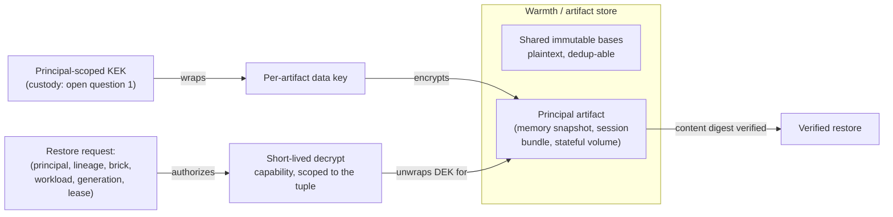

# ADR 033: Substrate Threat-Model Conformance and Per-Principal Encryption at Rest

**Author:** jomcgi
**Status:** Accepted
**Created:** 2026-08-11
**Relates to:** [ADR embervm/001](001-embervm-beam-firecracker-workload-orchestrator.md)
(the no-cross-principal isolation invariant this decision extends to
confidentiality), [ADR embervm/003](003-control-plane-managed-snapshot-distribution.md)
(the snapshot distribution model the wrap/unwrap step sits inside),
[ADR embervm/027](027-snapshot-modes-workload-property.md) and
[ADR embervm/030](030-lineage-decoupled-from-session-generation.md) (the
artifact kinds this decision covers), [ADR agents/047](../agents/047-per-principal-egress-credential-broker.md)
and [ADR agents/055](../agents/055-tool-mediated-github-access.md) (Draft,
the adjacent authorization-direction decisions this ADR explicitly does not
re-decide)

---

## Problem

EmberVM's runtime isolation is strong and shipped: Firecracker per guest,
task and session guests have no NIC and reach the control plane only over
vsock, no VM or snapshot lineage ever crosses a principal, brokered egress
injects credentials only at the sidecar hop for destinations named in a
secret's `egressTo`, revocation is enforced at the validator rather than by
trying to scrub RAM, and admission and quotas fail closed. None of that
holds once an artifact is at rest. The warmth and artifact store relies on
storage ACLs alone: anyone who can read the bucket, a compromised brick or
an insider with object-store access, can read any principal's memory
snapshot, and a memory snapshot is the full process state of that
principal's workload.

We did not have to invent a name for this class of exposure. The
agent-substrate project (Google-adjacent, K8s actor-multiplexing, attacking
the same problem from the density side: warm shared worker pods, gVisor,
around 30x oversubscription) publishes a threat model at
`https://github.com/agent-substrate/substrate/blob/main/docs/threat-model.md`
enumerating 43 threats across external network, internal clients, actors,
nodes, and insiders. Nearly all of its own mitigations are aspirational; the
project's own status text says it is not production-ready. That does not
make the enumeration less useful to us. Read against it, the at-rest gap
maps onto eight of its named threats directly: 23 (snapshot theft across
actors), 24 (snapshot corruption or substitution), 25 (a corrupt snapshot
restored), 32 (self-written snapshot escalation), 36 (a compromised node
downloads every principal's snapshots), 37 (a node reaches another node's
storage), 39 (insider snapshot access), and 40 (insider database or disk
access). EmberVM's vendor-mismatch stamps and base keys give integrity
against accidents (a wrong CPU vendor, a stale base digest), not against an
adversary who can write to the store.

## Decision

Three parts, decided together because the second and third only make sense
inside the frame the first establishes.

### 1. Adopt the agent-substrate threat model as EmberVM's external conformance frame

EmberVM evaluates itself against agent-substrate's 43-threat enumeration.
The living conformance mapping is not this ADR; it lives in
`projects/embervm/ARCHITECTURE.md`, section "Threat model," because current
state belongs in ARCHITECTURE.md and this ADR records only why the frame
was adopted and what was decided as a result.

Three reasons this is worth adopting a competitor's frame rather than
writing our own enumeration:

- It is independent validation criteria we did not write, so it cannot be
  quietly shaped to flatter decisions we had already made.
- Most of EmberVM's differentiation is exactly the rows that project marks
  planned or aspirational, while EmberVM already has them shipped as
  invariants (no-NIC guests, brokered egress, validator-enforced
  revocation, no-cross-principal lineage). Conformance scoring makes that
  differentiation legible instead of asserted.
- The rows where EmberVM is behind, at-rest confidentiality chief among
  them, become an explicit, numbered roadmap item instead of a blind spot
  nobody had named.

### 2. Per-principal envelope encryption of data at rest

All mutable principal state in the warmth and artifact store, memory
snapshots, session bundles, and stateful volume archives, gets a unique
data key per artifact, wrapped by a principal-scoped key-encrypting key
(KEK). Shared immutable platform bases (OS, runtimes, the agent harness)
stay plaintext and dedup-able; they carry no principal-specific state to
protect and their whole value is being cheaply shared across principals.

Mutable principal state never dedups across principals today, for lineage
reasons: ARCHITECTURE.md section 5, invariant 3 already forbids it
("content-addressed dedup across principals is forbidden... erasure would
become a cross-tenant reference-counting problem"). This decision extends
the same boundary to confidentiality rather than opening a new one: if two
principals' artifacts were never allowed to share a content-addressed
chunk, they should not be readable through a shared key either.

Guests and bricks never hold store credentials or KEKs. This is not a new
contract, it extends the two that already exist: "facts through the
control plane, payloads never" (invariant 2) and the standing rule that a
guest holds no credential material.

### 3. Verified, tuple-authorized restore

Snapshot manifests carry content digests, and a restore refuses an
unverified artifact; this closes threats 24 and 25 directly (a corrupted
or substituted snapshot cannot pass an integrity check it never touched).

Restore authorization is a tuple check, not a storage-ACL check:
`(principal, artifact lineage, target brick, workload, generation, lease
expiry)`. The brick receives a short-lived decryption capability scoped to
exactly that tuple. Object-store permission alone never authorizes a
restore; holding a bucket credential is necessary but not sufficient,
because the capability that actually unwraps the data key is issued
per-restore against the full tuple, not held statically by whatever
process can reach the bucket.

## Explicitly NOT re-decided here

Three adjacent questions sit near this one and are deliberately left where
they already are, so the conformance mapping has one rationale anchor per
row instead of this ADR quietly re-litigating decisions that belong
elsewhere:

- Per-principal grants at the egress credential broker: that is
  [ADR agents/047](../agents/047-per-principal-egress-credential-broker.md)
  (Draft), the spec for broker authorization.
- Request-scoped GitHub access via tool mediation, instead of host-keyed
  injection: [ADR agents/055](../agents/055-tool-mediated-github-access.md)
  (Draft).
- The cross-principal dedup prohibition itself: ARCHITECTURE.md invariant
  3, decided in [ADR embervm/001](001-embervm-beam-firecracker-workload-orchestrator.md).
  This ADR extends it to confidentiality; it does not reopen it.

## Architecture

## Alternatives Considered

| Alternative | Rejected because |
| ----------- | ----------------- |
| Write EmberVM's own threat-model enumeration from scratch | Loses the independent-validation property: a self-authored list can be shaped, consciously or not, to match decisions already made, and duplicates effort agent-substrate already did for the same problem space |
| Adopt a generic cloud threat model (NIST, a cloud provider's shared-responsibility matrix) instead | Not shaped for the actor-multiplexing, warm-shared-worker-pod problem EmberVM and agent-substrate both attack; would not map onto threats like snapshot theft across actors or self-written snapshot escalation with anywhere near the same precision |
| Leave data at rest protected by storage ACLs only (status quo) | Directly matches threats 23, 24, 25, 32, 36, 37, 39, 40 in agent-substrate's own enumeration; a compromised brick or an insider with bucket access reads any principal's full process state today |
| A single platform-wide KEK rather than one KEK per principal | Makes every principal's data readable by anyone who can reach the one key; defeats the purpose of scoping encryption to the isolation boundary the rest of EmberVM already enforces |
| Encrypt shared immutable bases too, not just mutable principal state | Bases carry no principal-specific state and their entire value is being cheaply deduped and shared; encrypting them buys no confidentiality and breaks the dedup property for no benefit |
| Storage-ACL restore authorization (bucket read implies restore allowed) | The exact gap this decision closes: an object-store credential is not a statement about which principal, lineage, brick, workload, generation, or lease is authorized right now, so it authorizes strictly more than intended |
| RAM scrubbing as the decryption-capability revocation mechanism | Already rejected elsewhere in EmberVM's design for the same reason it would fail here: revocation is enforced at the validator, not by attempting to erase key material from memory after the fact |

## Security

Baseline: [docs/security.md](../../security.md). This decision is itself a
security boundary extension, not a deviation from one: it takes an
existing isolation invariant (no cross-principal lineage) and applies it to
confidentiality at rest, which the store did not previously enforce.

- Guests and bricks hold no store credentials and no KEKs, matching the
  existing "no credential material on the guest" and "facts through the
  control plane, payloads never" contracts.
- The decrypt capability issued to a brick is short-lived and scoped to
  one restore tuple; it is not a standing credential a brick retains
  between restores.
- KEK custody (which system holds and rotates the principal-scoped keys)
  is an open question, listed below, not decided here.

## Risks

| Risk | Likelihood | Impact | Mitigation |
| ---- | ---------- | ------ | ---------- |
| KEK custody on a single-operator deployment concentrates key material somewhere that itself becomes a target | Medium | High | Open question below: 1Password Operator custody versus a key-sharded swap tier like the class-3 credential path in the ADR 016 security contract; not resolved here |
| Decryption on the wake path adds latency the 2.5ms load-to-resume figure did not account for | Medium | Medium | Must be re-measured with decryption in line before this ships; if it breaks the budget, decrypt-on-download before the wake preserves the warm path at the cost of node-local plaintext on scratch, a narrower exposure than the shared store, and is an acceptable fallback shape |
| Artifacts already key per CPU vendor; encryption multiplies key count per (principal, vendor) pair | High | Low | Accepted cost; key management overhead scales with tenancy and hardware diversity, not with data volume |
| Key loss equals data loss for banked state, by design | Low | Medium | This is the intended boundary, not a defect; cold boot is always the fallback per invariant 4 (fail open on warmth), so key loss degrades to a slower cold start rather than an outage |

## Open Questions

1. KEK custody: 1Password Operator versus a key-sharded swap tier
   mirroring the class-3 credential path in the ADR 016 security contract.
2. Whether the wake-path decrypt cost, once measured, forces
   decrypt-on-download (node-local plaintext on scratch) rather than
   decrypt-in-line, and if so, how that narrower exposure is documented
   against the store-wide exposure it replaces.
3. Whether the shared warmth/artifact store's `shared/<principal>/<sha256>`
   keyspace (ADR embervm/027 decision 3) needs its own KEK-wrapping story,
   given it is already principal-scoped but was designed before this
   decision.

The implementation work this decision implies is tracked in GitHub issue
#4691, not in this ADR.

## References

| Resource | Relevance |
| -------- | --------- |
| [Substrate threat model](https://github.com/agent-substrate/substrate/blob/main/docs/threat-model.md) | The 43-threat enumeration EmberVM now conforms against |
| agent-substrate repository status and roadmap | Context: its own mitigations are largely aspirational, no GA milestone, which is why adopting its threat model is not the same as adopting its code |
| `projects/embervm/ARCHITECTURE.md`, sections 5 (invariants) and 9 (identity, tenancy, security), and the new "Threat model" section | The living conformance mapping; current state belongs there, not here |
| [ADR embervm/001](001-embervm-beam-firecracker-workload-orchestrator.md) | Invariant 3, no VM or snapshot lineage ever crosses a principal; the isolation rule this decision extends to confidentiality |
| [ADR embervm/003](003-control-plane-managed-snapshot-distribution.md) | Control-plane-managed snapshot distribution, the mechanism the wrap and unwrap step sits inside |
| [ADR embervm/027](027-snapshot-modes-workload-property.md) | Snapshot modes as a workload property, including the `shared/<principal>/<sha256>` keyspace open question 3 above concerns |
| [ADR embervm/030](030-lineage-decoupled-from-session-generation.md) | Lineage decoupled from session generation, one of the artifact kinds this decision covers |
| [ADR agents/047](../agents/047-per-principal-egress-credential-broker.md) | Draft, per-principal grants at the egress credential broker; explicitly not re-decided here |
| [ADR agents/055](../agents/055-tool-mediated-github-access.md) | Draft, request-scoped GitHub access via tool mediation; explicitly not re-decided here |
| [ADR agents/014](../agents/014-ax-substrate-agent-runtime.md) (Deprecated) and [ADR agents/015](../agents/015-temporal-orchestration-substrate.md) (superseding it) | Prior art for tracking an external project's design without adopting its code, the same posture this ADR takes toward agent-substrate |
| GitHub issue #4691 | The outstanding implementation work this decision implies |
| [docs/security.md](../../security.md) | Security baseline |
