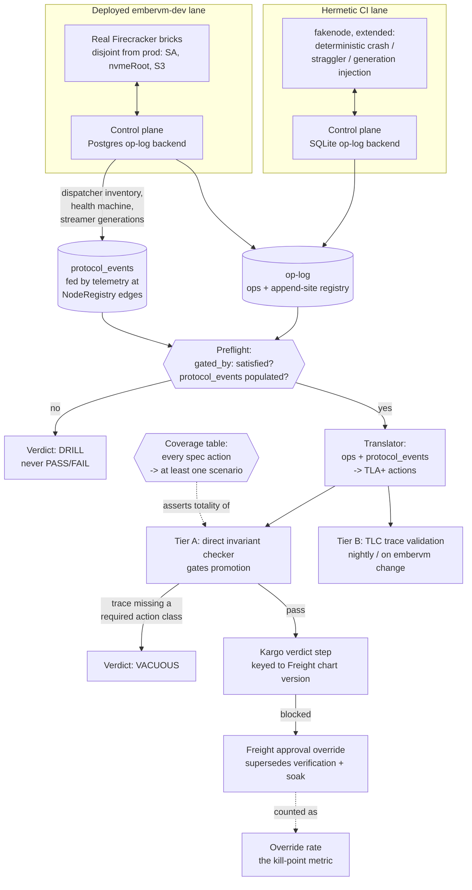

# ADR 034: Conformance Harness: Synthetic Actions, Fault Injection and Trace Validation

**Author:** Joe McGinley
**Status:** Accepted
**Created:** 2026-08-12
**Extends:** [ADR embervm/006](006-tla-formal-specification-pilot.md) (the TLA+ pilot; layer 2, trace validation, was a stated pilot success criterion and was never built)
**Relates to:** [ADR embervm/007](007-sharded-control-plane-pg-oplog-cells.md) (the op-log appender shape the trace source depends on), [ADR embervm/014](014-worker-authoritative-state-hot-path-consistency.md) (worker authority and node-confirmed destruction, the protocol this harness must observe honestly)

---

## Problem

ADR 006 specified three conformance layers to keep the TLA+ specs honest against the code: vocabulary sync (deterministic), trace validation (semantic), and a scheduled review skill (judgment). Layer 1 shipped and runs in CI. Layer 2 was named a pilot success criterion, not a follow-up, and was never built. That gap was not academic: it let two real defects sit in the deployed system while layer 1 stayed green.

**#4756.** `:primed` and `:vm_destroyed` sat in the closed `@kinds` enum with no append site. `:assigned` and `:started` carried `%{epoch: task.attempt}` and no `vm_id`. `adoption.tla`'s `NoDoubleAssign`, `NoResurrection`, `NoReapLive`, and `PrincipalIsolation` were unobservable from the op-log: the spec named invariants over data the running system never wrote.

**#4758.** `EMBERVM_NODE_CONFIRMED_DESTROY` and `EMBERVM_ASYNC_LIFECYCLE_WRITES` (ADR 014 decisions 5 and 2) default off and are rendered nowhere in `chart/` or `deploy/`, confirmed against the live pod. `session_state.ex`'s `:destroying` state is therefore unreachable in the deployed configuration, and `adoption.tla`'s `NoDestroyBeforeConfirm` and `DestroyIntentPrecedesRecord` model an ordering production has never run.

**Layer 1 passed on both**, because it checks the enum against the spec text and never against append sites or deployed gates. A kind can be a member of the modeled set, spelled correctly, and never emitted; a gate can be named in the spec's prose and never armed. Neither is a vocabulary mismatch, so neither trips the guard that exists.

During the #4756 fix, a naive append-site guard was written three times before the shape that shipped:

- A bare `:atom` grep anywhere in `lib/` was **vacuous**. `:primed` matched a metrics counter key in `base_builder.ex` and a prose comment. `lib/embervm/op_log.ex`, where the `@kinds` enum itself is defined, sits beside `lib/embervm/op_log/` rather than inside it, so every kind's own enum literal counted as its own "match," and the check was green before any emission existed.
- A `kind: :atom` literal grep was **too strict**. Only `:primed` is built as a literal at its call site; every other kind is threaded as a variable across a module boundary (`%Op{kind: op_kind}` in `task_store.ex`, `SessionStore.transition(..., :session_banked, ...)` in `session_manager.ex`), so the literal-grep check failed eight kinds that are genuinely emitted.

The design that shipped is a **declared registry**: `op_kind_sites` in `vocabulary.exs` names the appending module per modeled op kind, and a test asserts the registry's keys exactly partition the modeled set. This is the reusable lesson, worth recording past the immediate fix: whether a kind is emitted is a dataflow question, and a lexical test cannot answer a dataflow question. The manifest exists to ask a human to assert what a grep structurally cannot infer.

Two further gaps bound what layer 2 can honestly check, and shape its architecture:

- **Per-principal isolation is not checkable from the log.** The dispatcher has no concept of tenant, and `Scheduler.Request` has none either; priming is workload-scoped (`PrimeRequest` carries `workload`, no principal). `PrincipalIsolation` cannot be verified against production traffic as specified; it must be weakened to a structural form checkable from what is actually logged, or left TLC-only.
- **The volatile control-plane state some invariants depend on is unlogged by design and should stay that way.** `PrincipalIsolation`, `AdoptIdempotent`, and `NoResurrection` reason over dispatcher inventory, the `NodeRegistry` health machine, and streamer generations, none of which belong in the durable book-of-record: they are reconstructible cache, not fact. ADR 006's open question 2 asked whether the trace source should be the op-log or OTEL spans. The answer decided here is neither, on its own: a separate `protocol_events` table, fed by telemetry emitted at `NodeRegistry` edges, carries exactly this volatile-but-checkable state. OTEL itself stays out of the gate path: it is sampled, asynchronous, and lossy by design, which is fine for observability and wrong for a pass/fail gate, though the same telemetry emission can feed both.

This ADR decides how layer 2 actually gets delivered, and widens its scope beyond the original pilot: tests plus live validation for all three specs now in the pilot (`adoption.tla`, `bank_relight.tla`, `quota.tla`), with deliberate fault injection rather than passive observation of whatever traffic happens to arrive.

---

## Decision

### Two lanes

| Lane | What it exercises | What it proves |
| ---- | ------------------ | --------------- |
| **Hermetic CI** | A stateful fake noded extended from `projects/embervm/proto/embervm/node/v1/fakenode/main.go`, the control plane on its SQLite op-log backend, deterministic crash / straggler / generation injection | Where the translator and checker get built; exact interleavings are forced, not hoped for, and every run is reproducible |
| **Deployed `embervm-dev`** | Real Firecracker, real Postgres, Recreate deploy semantics, the gates armed for real | What the hermetic lane cannot claim: that the modeled protocol survives the actual deploy mechanics (a pod restart is a `Recreate`, not a hot code swap; a node really dial-homes; a snapshot really lands in S3) |

Sequenced hermetic first. The hermetic lane is where the event-to-action translator and the invariant checker are proven correct against interleavings the harness itself controls; only once that machinery is trusted does the deployed lane's much noisier, much slower traffic become worth checking against it.

### Two check tiers

| Tier | Mechanism | Strengths | Cost |
| ---- | --------- | --------- | ---- |
| **A: direct invariant checker** | A checker evaluates each named TLA+ invariant directly over the ops plus `protocol_events` stream, no TLC involved | Fast, small counterexamples, cheap enough to gate a promotion | Only as complete as the invariants it was told to check; a forbidden step no invariant names passes silently |
| **B: TLC trace validation** | The op-log/`protocol_events` trace, translated to actions, run through the existing `//bazel/tla` toolchain in trace-checking mode | Depth: catches a forbidden step no named invariant covers, because TLC checks the trace against the whole model, not a checklist | Slower; not gate-grade at every promotion |

Tier A gates promotions; tier B runs nightly or on embervm change, where its cost is affordable and its depth catches what tier A structurally cannot.

### Anti-vacuity is a first-class requirement

A trace with no interesting behavior in it conforms to every spec: no double-assign occurred because nothing was assigned, no stale relight happened because nothing relit. A harness that does not know this reports success for doing nothing, which is worse than reporting nothing, because it looks like coverage.

Every scenario carries a **required-action manifest**. A run whose trace is missing a required action class returns verdict **VACUOUS**, a distinct outcome from PASS and FAIL, and the run fails. A **suite-level coverage table** maps every observable spec action to at least one scenario that is asserted, in CI, to actually exercise it (totality, not just presence in a config file). This mirrors the layer-1 lesson at a different layer: a declared manifest is what makes "did this actually get exercised" a question CI can answer, where a lexical scan of trace length cannot.

### The harness must refuse to over-claim

Chaos run against an uninstrumented deploy has real operational value: MTTR practice, adoption re-attach drills, runbook validation. It has zero verification value, because there is nothing recording whether the modeled protocol held. Conflating the two in a report is how a team convinces itself a spec was checked when only an outage was rehearsed.

The checker's preflight probes the target instance for the instrumented payloads (`protocol_events` populated, the gate-metadata below satisfied) before it runs anything. Against a pre-instrumentation instance it returns verdict **DRILL**, never PASS or FAIL, and the report says so in those words.

### Honesty extensions to layer 1

Two additions to the vocabulary manifest close the exact gaps #4756 and #4758 found:

- **The append-site registry** (shipped, `op_kind_sites` in `vocabulary.exs`): every modeled kind names the module that appends it, asserted to exactly partition the modeled set. This is the mechanical fix for #4756's class of drift.
- **`gated_by:` metadata**: a modeled kind whose emission is conditional on a feature gate (`EMBERVM_NODE_CONFIRMED_DESTROY`, `EMBERVM_ASYNC_LIFECYCLE_WRITES`) names that gate in the manifest, and the harness preflight asserts the target instance arms every gate a modeled kind it expects to observe depends on. This is the mechanical fix for #4758's class: a spec cannot silently model an ordering the deployed configuration never runs, because the preflight will report DRILL or a named gate failure instead of quietly checking nothing.

### Gate posture: strict, with fix-forward as the accepted cost

Bias the specs strict. A too-strict spec blocks a good deploy: that failure is loud, attributable to a named invariant, and self-correcting, because someone has to look at it before anything ships. A too-weak spec passes everything: that failure is silent, and indistinguishable from a spec that is actually working, until the bug it should have caught reaches production anyway. Fix forward is the accepted response to a false positive; the strict bias is the deliberate trade of some blocked-good-deploy noise for never landing in the silent-pass failure mode instead.

Prod promotion posture follows the same reasoning from the other direction: it starts **manual** (`autoPromotionEnabled: false`), so a wrong spec costs one judgement call at approval time rather than an unreviewed deploy. It moves to an automated verdict step, keyed to the exact Freight chart version being promoted, once the manual phase has demonstrated the specs are not routinely wrong.

### The override is load-bearing, not a nicety

EmberVM's own deploys are gated by this conformance check, which creates a real possibility: a bad spec blocks an EmberVM promotion, and the fix to the bad spec is itself an EmberVM change that also needs to deploy. Freight approval, which per the Kargo Stage CRD supersedes both upstream verification and soak time, is the only way out of that loop. It must be tested as part of this work, not merely documented as present: an untested override is a promise, and the loop above is exactly the scenario where discovering it does not work costs the most.

### The kill-point metric is the override rate

A gate overridden occasionally is doing its job: something legitimately needed a human call, and got one. A gate overridden routinely has been reclassified as noise by everyone who touches it, and is worse than no gate at all, because it still reads red or green in every dashboard while nobody is actually acting on it. Kargo already records every approval against its Freight, so counting overrides per gate is close to free. This mirrors ADR 006's own exit-judgment discipline (state explicitly when to stop trusting an experiment): state explicitly, here, when to stop trusting the gate. An override rate that climbs is the signal to revisit the spec, the gate's strictness, or both, before the team stops reading it at all.

### Cells are not a prerequisite (#4753)

Discovery is dial-home: a brick registers with exactly one control plane, and this makes disjoint brick sets between `embervm-dev` and production structural rather than something the cell architecture in ADR 007 needs to exist first. What the deployed dev lane does require:

- The dev brick carries only the dev control plane's dial-home address.
- The dev brick uses a distinct `ServiceAccount` from production's.
- The dev brick's `nvmeRoot` and S3 bucket values are disjoint from production's.

**Brick overlap is a separate, harder failure mode this decision explicitly guards against**, not a niceness. noded streams its full primed set to whatever control plane it registers with, and adoption is additive by design (ADR 014's worker-authority reconciliation converges the cache toward whatever the node reports). If a brick were shared, both control planes would adopt the same VMs and both would dispatch onto them: a cross-CP double-assign by construction, requiring no attacker. #4707's identity-hijack surface (a brick able to re-register another's `(node, pod_uid)`) then compounds this on top of, not instead of, the overlap risk; the two are separate hazards and this decision closes the structural one (disjoint bricks) without claiming to close the identity one.

---

## Architecture

Hermetic proves the machinery; deployed proves the machinery survives real deploy mechanics. Both feed the same translator and the same checker, so a spec bug found hermetically and a spec bug found live are the same kind of finding, not two different pipelines that happen to share a name.

---

## Alternatives Considered

- **Detector-only, with no gate.** Rejected: a detector that only ever reports is exactly the shape layer 1 already has, and layer 1's blind spots (#4756, #4758) are what motivated this ADR. A finding nobody is forced to act on before a deploy proceeds is a finding that eventually gets ignored, which is the same failure mode the override-rate kill-point exists to catch one level up.
- **Hermetic-only, with no deployed lane.** Rejected: the hermetic lane runs against a fake node and SQLite, and #4758 is precisely a defect that only exists at the gap between spec and *deployed* configuration (a gate that is present in code, false by default, and never rendered into the chart). A hermetic-only harness would have passed on #4758's exact shape, the same way layer 1 did.
- **Ephemeral per-run instances.** Rejected as the default: spinning up a fresh `embervm-dev` per run buys isolation at the cost of losing the thing the deployed lane is for, namely proving the protocol survives real deploy mechanics (Recreate semantics, real dial-home, real S3 timing) under conditions that persist across runs the way production conditions do. A long-lived dev lane with disjoint bricks (decided above) gets the isolation without losing that.
- **Argo Rollouts AnalysisTemplates now.** Rejected for now: AnalysisTemplates gate on metric queries against a running Rollout, which is a good fit once the verdict step exists as a metric this harness emits, but adopting the Rollouts controller itself is a separate, larger decision this ADR is not making. The Kargo verdict step (decided above) is the nearer-term integration point; AnalysisTemplates remain a plausible future carrier for the same verdict, not a competing decision today.
- **wal2json logical decoding as the trace source.** Rejected. The single-writer `AsyncWriter`/`Postgres` GenServer plus `BIGSERIAL` (`op_log/postgres.ex`) already guarantees commit order without needing a second ordering mechanism, so logical decoding would buy nothing tier A or B does not already have from reading `seq` directly. More importantly, embervm's op-log database (`embervm_oplog`) lives on the **same monolith-pg CNPG cluster** that serves monolith's production traffic, not a dedicated cluster; an unconsumed logical replication slot pins WAL retention for that whole shared cluster, not just embervm's database, which makes an abandoned or lagging harness slot a production risk to an unrelated service. `wal_level` is already `logical` on that cluster, so this was never a configuration gap, only a blast-radius one, which is the part that makes the rejection worth recording rather than assumed.

---

## Security

Baseline per `docs/security.md`; nothing in this decision loosens an existing boundary.

- The hermetic lane runs entirely inside CI against a fake node and a scratch SQLite file; it touches no production credential or data path.
- The deployed `embervm-dev` lane's disjoint `ServiceAccount`, `nvmeRoot`, and S3 bucket values (decided above) are a security boundary, not only a data-hygiene one: without them, dev fault injection (crash, straggler, generation-mismatch scenarios) would be injected against production-adjacent state, or worse, dev and production bricks would double-adopt each other's VMs per the brick-overlap hazard above.
- `protocol_events` is populated from telemetry already emitted at `NodeRegistry` edges; this decision adds a durable sink for existing signal, not a new instrumentation surface with its own credential or exposure story.
- Fault injection against `embervm-dev` is chaos with a blast radius: it must never be able to reach production bricks, which the disjoint-brick requirement above is the mechanism for, not merely a naming convention.

---

## Risks

| Risk | Likelihood | Impact | Mitigation |
| ---- | ---------- | ------ | ---------- |
| Spec drift resumes once layer 2 ships, the same way layer 1 alone was not enough | Medium | The exact failure mode this ADR exists to close reopens | Layer 1's registry plus `gated_by:` metadata, tier A/B together, and the coverage-totality assertion are three independent checks, not one; a drift has to slip all three |
| Translator (ops + `protocol_events` to TLA+ actions) becomes its own maintenance burden as specs evolve | Medium | Tier B quietly falls behind the specs it validates | Table-driven off the same `op_kind_sites` registry layer 1 already asserts on; one translator shared across all three specs, not one per spec |
| TLC runtime blows up from loose existential padding needed to cover unobserved volatile variables in `protocol_events` | Medium | Tier B too slow to run even nightly, or gets silently skipped | Keep `protocol_events` scoped to exactly the volatile state the checked invariants need (dispatcher inventory, health machine, streamer generations), not a general telemetry dump; bound before building, not after the first timeout |
| Alarm fatigue from false positives under the strict-bias posture | Medium | Gate gets routinely overridden, which is precisely the override-rate kill-point condition | The kill-point metric itself is the mitigation: a climbing override rate is the designed signal to loosen a specific invariant or fix a specific spec, not to abandon the gate |
| Deployed-lane fault injection has a larger blast radius than intended and disrupts live agent sessions | Low, if brick isolation holds; High impact if it does not | User-facing sessions affected by a conformance drill | Disjoint bricks, SA, and storage per the cells-not-a-prerequisite decision above; the DRILL-vs-PASS/FAIL distinction keeps chaos-only runs from being mistaken for a low-risk, already-proven check |
| Node scratch pressure (#4290) from an added fault-injection workload competing with real bricks for the same scratch budget | Medium | Injected crash scenarios themselves fail with `ENOSPC` rather than exercising the intended interleaving, and the failure is misread as a spec finding | Budget the deployed lane's scratch footprint against the existing brick-scratch ceiling explicitly; a scenario that fails on scratch exhaustion is a lane-capacity bug, not a conformance finding, and the harness should be able to tell the two apart |

---

## Open Questions

1. **Dev op-log DB placement**: a new database on the shared `monolith-pg` CNPG cluster (matching how embervm's production `embervm_oplog` database is placed today) versus a new database on `monolith-dev-pg`. The wal2json rejection above already establishes that anything touching this cluster's WAL is a shared-blast-radius decision; this question is the same shape one level down, for where the *dev lane's* op-log data lives, not how it is read.
2. **Acceptability of a noded "mute status" debug lever** as added attack or failure surface, if the deployed lane's fault-injection scenarios need a way to silence a brick's status stream on demand rather than only killing it outright.
3. **Whether OTEL spans, already flowing from `NodeRegistry` edges to SigNoz, can shrink `protocol_events`' scope** rather than duplicating the same emission into two sinks, given OTEL is explicitly ruled out as the gate-grade source (sampled, async, lossy) but nothing rules it out as a way to narrow what the durable sink needs to carry.

---

## Amendment 2026-08-23

The deployed-dev scenario runner is an in-cluster Deployment in the EmberVM chart. This placement lets it exercise the same service identity and routing that promotion will rely on. Session guests have no NIC by design (#4628), and dev has no egress lane, so model-unreachable is the expected proof that relight reached the guest. The Deployment rolls on every chart version because `CHART_VERSION` is stamped into its environment and every verdict. A Kargo HTTP step on the dev Stage reads `/verdict` before promoting the Freight. Vacuous scenarios fail the gate rather than allowing an unexercised path to pass. Phase 1 is implemented in [#5224](https://github.com/jomcgi/homelab/issues/5224).

## References

| Resource | Relevance |
| -------- | --------- |
| [ADR embervm/006](006-tla-formal-specification-pilot.md) | The three-layer conformance design this ADR extends; layer 2 was its stated pilot success criterion |
| [ADR embervm/007](007-sharded-control-plane-pg-oplog-cells.md) | The single-writer, group-committed Postgres op-log appender whose ordering guarantee is why wal2json was rejected as the trace source |
| [ADR embervm/014](014-worker-authoritative-state-hot-path-consistency.md) | Worker authority, async lifecycle writes, and node-confirmed destruction, decisions 2 and 5, the exact protocol #4758 found unreachable in the deployed configuration |
| [`projects/embervm/specs/README.md`](../../../projects/embervm/specs/README.md) | Current scope of the three TLA+ specs (`adoption.tla`, `bank_relight.tla`, `quota.tla`), their invariants, and their negative-mode configs; states layer 2 as "a separate follow-up and deliberately not built here" |
| `projects/embervm/specs/vocabulary.exs`, `op_kind_sites` | The declared append-site registry (shipped) this ADR's `gated_by:` extension builds on |
| `projects/embervm/proto/embervm/node/v1/fakenode/main.go` | The in-memory `NodeService` server the hermetic lane's stateful fake noded extends |
| `projects/embervm/control/lib/embervm/op_log/postgres.ex` | The single-writer GenServer plus `BIGSERIAL` sequence, the commit-order guarantee cited in the wal2json rejection |
| `projects/embervm/deploy/values.yaml` | Confirms embervm's `embervm_oplog` database is placed on the shared `monolith-pg` CNPG cluster, the fact behind the wal2json blast-radius rejection and open question 1 |
| `projects/platform/kargo/templates/monolith-promotion.yaml` | The Kargo Stage shape (`requiredSoakTime`, Freight approval superseding it, `argocd-update` plus `argocd-wait`) this ADR's verdict-step and override decisions extend to embervm |
| GitHub issues #4756, #4758, #4753, #4707, #4290 | The verified findings motivating this decision and the risks it names; outstanding implementation work belongs in new issues filed against this ADR, not in this document |
