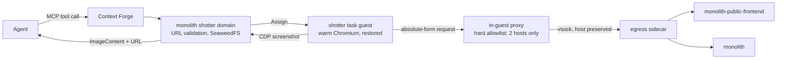

# ADR 035: Website Snapshotter, a Task-Class Guest for Agent Screenshots

**Author:** Joe McGinley
**Status:** Draft
**Created:** 2026-08-16
**Relates to:** [ADR embervm/001](001-embervm-beam-firecracker-workload-orchestrator.md)
(task class, the workload shape this reuses), [ADR embervm/010](010-bazel-skyframe-snapshot-query-demo.md)
(the warm-snapshot-as-task-base pattern this repeats for a browser instead of
a JVM), [ADR agents/023](../agents/023-egress-secret-proxy.md) (the
split-horizon egress guardrail and credential-injection sidecar this decision
sits behind), [ADR tooling/010](../tooling/010-hermetic-visual-regression.md)
(Deprecated, prior art: a Playwright capture harness for PR regression
testing, a different problem this decision does not revive)

---

## Problem

Agents make and review frontend changes against the public and private
tiers (`jomcgi.dev`, `private.jomcgi.dev`), a hydrating SvelteKit app with
token-driven CSS (see `.impeccable.md`). An agent can grep the built bundle,
read the source, and run the BDD specs, but none of that shows what a page
actually renders as. The gap is between the deployed page and every proxy an
agent has for it today: source, tests, and inference. A rendering harness
already existed once, `projects/monolith/frontend/visual/`, but it answered a
different question (did this PR change any pixel from committed baselines)
and ran as a per-PR Bazel test action; it was deleted for costing roughly
176 GB per week of BuildBuddy cache while BuildBuddy was asking the repo to
cut volume (`b671019ed`). ADR tooling/010 was kept at Deprecated rather than
removed, explicitly in case the capability was rebuilt. Nothing since has
given an agent a way to see a live page.

## Decision

Add a task-class EmberVM workload, `shotter`, that runs headless Chromium and
renders one URL to a PNG on request, exposed to agents as a monolith MCP
tool. Tracking issue: #4994.

### 1. Task-class guest, not a long-lived pod

Task guests restore a post-warm snapshot at 2.5ms load-to-resume
(`projects/embervm/ARCHITECTURE.md:850`). The base snapshot is cut once
`/shim/ready` first returns 200 (`projects/embervm/noded/server/server.go:844`),
and a guest only flips readiness after its `Warm` hook runs
(`projects/firecracker/sandbox/guest-init/cmd/main.go:51-59`). A browser
launched during `Warm` is therefore resident in every restored clone.
`projects/embervm/runtimes/bazel` already proves the pattern, snapshotting a
live warm JVM (Bazel's analysis graph) as a task-class base rather than a
browser; its README documents the same two failure modes any warm-snapshot
base has to close (snapshotting before the server is actually warm, and flag
or state drift between the warming run and a served request), and `shotter`
closes them the same way: readiness gates on the resident thing being ready,
not on the process merely having started.

A long-lived pod would have to choose between paying Chromium's launch cost
per shot, or keeping one browser resident and sharing its state across
requests from different callers. The snapshot restores a fresh browser
process per screenshot at restore cost, not launch cost, so that tradeoff
does not have to be made.

### 2. Chromium via CDP, not Playwright

Lighter renderers, wkhtmltoimage on QtWebKit, WeasyPrint, satori, either do
not run the app's JS or support only a CSS subset. Against a hydrating
SvelteKit app that would produce a plausible but wrong image, which is worse
than no image when the entire point is fidelity to what is deployed.
Playwright is rejected for a narrower reason: it is a Node driver over the
Chrome DevTools Protocol, and driving CDP directly from the existing Go
guest-init keeps a Node runtime out of the rootfs. Guest bases already
compete for the masters' 35GiB scratch budget; a second language runtime in
one more base is a cost this decision does not need to pay.

### 3. Public hostnames mapped internally, never dialled through Cloudflare

`private.jomcgi.dev` sits behind Cloudflare Access. A credential-less browser
going out through the CDN would faithfully screenshot the Access login wall,
and the capture would look successful: every private-tier shot would be a
silent lie about what it captured. Mapping internally also keeps a Cloudflare
Access service token out of a page renderer entirely.

| Requested host | Dialled |
| --------------- | ------- |
| `jomcgi.dev` | `monolith-public-frontend.monolith-public.svc.cluster.local:3000` |
| `private.jomcgi.dev` | `monolith.monolith.svc.cluster.local:3000` |

The egress sidecar has no host-rewriting capability
(`projects/firecracker/substrate/egress-proxy/cmd/swap.go` never touches the
URL, by design, so a credential cannot end up in a logged request line), so
the mapping has to live in the guest's own proxy. That proxy builds the vsock
preamble from the absolute-form request line and replays the request head
verbatim, so `Host: jomcgi.dev` survives to the origin and host-keyed routes
such as `/agents` keep resolving correctly.

### 4. The in-guest allowlist is the primary control, not monolith-side validation

Egress policy in this repo is per-sidecar, not per-workload: `egress.workloads`
only gates whether a workload gets a forwarder at all
(`projects/embervm/chart/values.yaml`, `egress:` block). A workload granted
egress inherits the whole pod-local policy, `external: allow` plus credential
injection toward `api.github.com` and `api.anthropic.com`
(`projects/firecracker/substrate/egress-proxy/cmd/swap.go`, `injectRequest`).
A rendered page that issues a subresource request to `https://api.github.com/user`
would have a real token attached by the sidecar, because the sidecar cannot
tell a browser's incidental subresource fetch from a deliberate one.

Relying on monolith-side URL validation of the top-level request alone was
considered and rejected: the top-level URL being one of the two safe hosts
says nothing about what the page it returns is allowed to fetch next, and a
rendered page is exactly the kind of content an agent does not fully control.
The decision is that the in-guest proxy is the only path from browser to
vsock, and it hard-allowlists the two mapped internal destinations, refusing
to write a preamble for anything else, before the request ever reaches the
sidecar. Monolith-side validation of the requested URL stays as a second,
independent layer, not the control this decision relies on.

The accepted cost: `egress.internal.allowlist` is global to the sidecar, so
adding the two frontend entries widens reachable destinations for every
other egress-enabled workload today (the claude runtime), and for `pi` if it
is later granted egress. This is accepted because both entries are read-only
frontend HTTP endpoints already reachable by anything with a network
interface inside the cluster; widening reach to them is not widening reach
to anything a compromised guest could not already dial in-cluster by other
means. It is recorded as an open question below rather than treated as
settled forever, because it is a real precedent for every future addition to
the same shared list.

### 5. Return shape: a real image block, not base64 in a dict

The MCP tool returns a FastMCP `ImageContent` block plus a SeaweedFS-backed
URL. Every monolith MCP tool today returns a `dict`, and `run_python` already
hands back base64 under `content_b64`
(`projects/monolith/sandbox/mcp.py:70-76`); this is a new return pattern for
the repo. The reason is that base64 sitting inside a JSON dict is not
reliably rendered as an image by a model, which would defeat the point of a
screenshot tool. Because Context Forge caps tool execution at 60 seconds
(`TOOL_TIMEOUT`), every timeout in the path has to nest strictly inside the
one above it: Context Forge, then the monolith client's read timeout, then
the workload's `timeoutSeconds`, then the guest handler's own cap, then the
CDP navigate timeout. A timeout anywhere in that chain has to surface as a
real tool error, not a severed connection Context Forge reports generically.

## Architecture

## Alternatives Considered

| Alternative | Rejected because |
| ------------ | ----------------- |
| Session-class warm browser guest | Banking and relighting a live browser adds machinery for latency the post-warm task snapshot already delivers without it |
| Plain Kubernetes Deployment with a CiliumNetworkPolicy | Simpler network story and no per-guest task cap, but no microVM isolation, browser state shared across unrelated callers' shots, and slower per shot than a snapshot restore |
| Route out through Cloudflare like a normal browser | Screenshots the Access login wall for every private-tier page and reports it as a successful capture |
| Reuse the deleted `projects/monolith/frontend/visual/` Playwright harness as-is | Its per-PR Bazel test action shape cost ~176GB/week of BuildBuddy cache for a different problem (regression testing, not runtime introspection); its apko Wolfi package list is reused (resolved from the APKINDEX by each `.so` chromium needs, including the `libudev` Playwright's own apt list omits), the harness design is not |
| Monolith-side URL validation as the only egress control | Validates the top-level request, not what the returned page's subresources fetch; a compromised or merely complex page can request anything the sidecar's blanket policy would otherwise inject credentials toward |

## Security

Baseline: [docs/security.md](../../security.md). The load-bearing decision in
this ADR is section 4 above: a hard, in-guest allowlist ahead of the shared
egress sidecar's credentialed, `external: allow` policy, because the sidecar
has no concept of which workload or which subrequest it is serving.
Monolith-side validation of the top-level URL is a second, independent
layer, kept because defense here is cheap and the two layers fail
differently. Guests still hold no credential material of their own; nothing
about this workload changes that.

## Risks

| Risk | Likelihood | Impact | Mitigation |
| ---- | ---------- | ------ | ---------- |
| A page under one of the two mapped hosts embeds a redirect or subresource to an unmapped destination | Medium | Low, contained by the allowlist | The in-guest proxy allowlists exact destinations, not the requested top-level host alone, so a redirect target outside the two mapped services is refused the same as any other unmapped host |
| `egress.internal.allowlist` is global, so the two new entries widen reach for other egress-enabled workloads | High (certain) | Low, both entries are already in-cluster-reachable read-only endpoints | Accepted per section 4; revisit if a future egress-enabled workload's threat model differs from claude's |
| Chromium under a Firecracker guest hits sandboxing or `/dev/shm` friction the way it did in the deleted RBE harness | Medium | Medium, would block T1 | ADR tooling/010 already recorded the RBE-sandbox variant of this exact problem and its resolution path; the guest-boot variant is new and untested |
| A rendered page is slow or hangs, pushing past the CDP navigate timeout | Medium | Low | Timeout nesting in section 5 makes a hang surface as a bounded tool error rather than an indefinite hold on a guest |

## Open Questions

1. Whether `egress.internal.allowlist` should become scoped per egress-enabled
   workload rather than global to the sidecar, once a second workload with a
   materially different threat model than claude's needs an entry. This
   decision accepts the shared-list cost for two read-only frontend
   endpoints; it does not resolve the shape for whatever needs an entry next.
2. Whether the CDP navigate timeout should scale with page complexity (a
   dashboard versus a static page) or stay fixed; no data exists yet on
   real render times under a restored guest to decide this.

The implementation work this decision implies is tracked in GitHub issue
[#4994](https://github.com/jomcgi/homelab/issues/4994), not in this ADR.

## References

| Resource | Relevance |
| -------- | --------- |
| GitHub issue [#4994](https://github.com/jomcgi/homelab/issues/4994) | Outstanding implementation work: guest image, in-guest proxy, CDP handler, chart wiring, monolith domain and MCP tool |
| [ADR embervm/001](001-embervm-beam-firecracker-workload-orchestrator.md) | Task class, the workload shape this reuses |
| [ADR embervm/010](010-bazel-skyframe-snapshot-query-demo.md) | The warm-snapshot-as-task-base pattern this repeats for a browser |
| [ADR agents/023](../agents/023-egress-secret-proxy.md) | Split-horizon egress guardrail and the credential-injection sidecar this decision's in-guest allowlist sits ahead of |
| [ADR tooling/010](../tooling/010-hermetic-visual-regression.md) (Deprecated) | Prior art: a Playwright regression harness for a different problem, kept for its apko package-resolution method |
| `projects/embervm/ARCHITECTURE.md` | Current state of task-class guests, warm-snapshot timing, and the threat model this decision's egress control sits inside |
| `projects/embervm/runtimes/bazel/README.md` | The two warm-snapshot failure modes (cold snapshot, warm/serve flag drift) and how the existing demo closes them |
| `projects/firecracker/substrate/egress-proxy/cmd/swap.go` | The sidecar's credential-injection behaviour and its "never touch the URL" guarantee, both cited in section 3 and 4 |
| `projects/monolith/sandbox/mcp.py` | The `content_b64` pattern this decision's `ImageContent` return diverges from, and why |
| [docs/security.md](../../security.md) | Security baseline |
