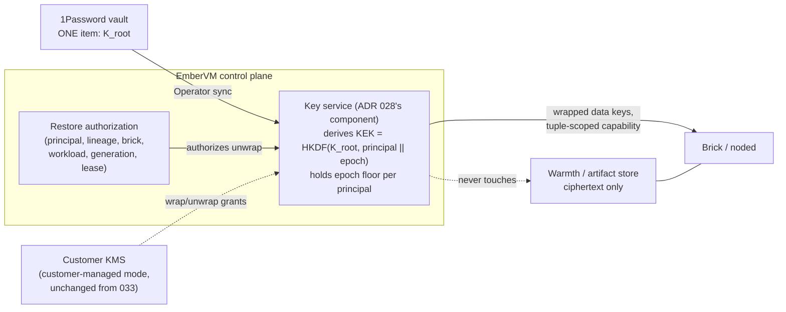

# ADR 036: Platform-Managed KEK Custody: Derived Per-Principal Keys in the Control-Plane Key Service

**Author:** jomcgi
**Status:** Accepted
**Created:** 2026-08-15
**Amends:** [ADR embervm/033](033-substrate-threat-model-conformance-encryption-at-rest.md),
resolving its open question 1 (which platform system holds the
platform-managed KEKs). Everything else in 033 stands: the two custody
modes, the envelope construction, tuple-authorized restore, and the
customer-managed mode are unchanged.
**Relates to:** [ADR embervm/028](028-demand-loaded-rootfs-oci-chunk-store.md)
(decision 8 already places Account chunk-key custody in the control plane's
key service pre-EKS; this ADR keeps both planes under one custodian),
[ADR embervm/016](016-kubernetes-scheduling-integration-contract.md) (the
secret-class taxonomy this decision is judged against), and GitHub issue
#4940 (the monolith principal model, whose boundary rules this decision
respects rather than re-decides)

---

## Problem

ADR 033 decided per-principal envelope encryption for mutable state at
rest: a unique data key per artifact, wrapped by a principal-scoped KEK,
with platform-managed and customer-managed custody modes. It left open
question 1 unresolved: for the platform-managed mode, which platform
system holds the KEKs, naming two candidates (the 1Password Operator, or
a key-sharded swap tier mirroring the class-3 credential path in ADR
016's security contract). The customer-managed mode has no platform
custody question by construction, so this ADR is about the default mode
only.

Three inputs have sharpened since 033 was accepted:

1. **The operator constraint is now explicit: secret count must not grow
   with principal count.** The 1Password vault behind the Operator is a
   personal vault. The repo declares 33 `OnePasswordItem` resources
   today, every one backed by a hand-managed vault item. Per-principal
   KEKs stored there would add an item per principal, multiplied again by
   rotation epochs, on a machine cadence a personal vault is not built
   for. Any custody answer whose vault footprint is O(principals) is
   disqualified on operational grounds, not merely disfavoured.

2. **ADR 028 decision 8 already decided custody for the sibling plane.**
   Account convergence salts and Account-scoped KEKs for the immutable
   rootfs chunk store live in the converter and key service: control-plane
   custody before EKS, with a stated limitation (control-plane compromise
   reads all private images), swapping to per-Account KMS keys at EKS
   with zero format change. Leaving the mutable plane's custody open
   while the immutable plane's is decided invites two custodians with two
   compromise stories for one deployment.

3. **Issue #4940 settled the identity boundary rules this must respect.**
   authentik is the sole issuer of standing identity; credential release
   belongs to per-domain brokers in the owning domain; the monolith is
   deliberately not a central policy engine. A KEK custodian is a
   credential-release mechanism for EmberVM's restore path, so those
   rules constrain where it may live.

## Decision

Three parts.

### 1. Platform-managed KEKs are derived, not stored

The platform-managed principal KEK is
`HKDF(K_root, principal_id || epoch)`: derived on demand from a single
root secret, never persisted per principal. 1Password holds exactly one
item (the root) regardless of principal count, which satisfies the
operator constraint by construction rather than by discipline. The
custodian's durable state is the root plus small per-principal facts (the
current epoch and the minimum accepted epoch), which are lifecycle-rate
facts under the existing op-log discipline, not a keyring that must be
stored, backed up, replicated, and erased.

What derivation buys over a stored per-principal keyring, honestly
scoped: it removes the key *storage* problem (no per-principal secret
material exists at rest anywhere), and it removes the vault-scaling
problem. It does not improve the compromise bound: an attacker who reads
the root can derive every platform-managed KEK, exactly as an attacker
who reads a stored keyring holds every KEK. The bound is the same one ADR
028 already accepted pre-EKS for the immutable plane, and both planes
exit it together at the KMS swap (below).

Rotation and revocation semantics, since derivation changes their
mechanics but not their shape:

- **Principal KEK rotation is an epoch bump plus lazy rewrap**, the same
  lazy rewrap 033 already decided for the envelope. Wrapped data keys
  record the `(principal, epoch)` they were wrapped under, so unwrap
  needs only the root and the recorded epoch.
- **Revocation is the epoch floor, not key deletion.** A derived key
  cannot be deleted; old epochs remain derivable from the root forever.
  A compromised principal KEK is retired by rewrapping that principal's
  data keys under the new epoch and then raising the custodian's
  minimum-accepted epoch, after which the custodian refuses to derive
  below the floor. Revocation completes when the floor rises, and the
  floor is the fact that must be durable.
- **Root rotation is the rare, expensive event**: a new root generation
  in 1Password (item count stays O(1), two items only during the
  transition), followed by lazy fleet-wide rewrap. It is the response to
  suspected custodian compromise, not a scheduled routine.
- **Root loss makes every platform-managed banked artifact
  unrestorable**, which degrades to fleet-wide cold boot per invariant 4
  (fail open on warmth), never to an outage. A single precious,
  human-recovered secret is the shape a personal 1Password vault is
  actually good at; many machine-paced secrets are the shape it is bad
  at. This decision moves the vault's job from the second shape to the
  first.

### 2. The custodian is the EmberVM control plane's key service

The component ADR 028 decision 8 already names (the key service holding
Account convergence secrets) extends to hold the root and derive
principal KEKs for the mutable plane. One custodian for both planes, in
the domain that owns the restore path. Not the monolith, not tokenbroker,
not a new standalone service, and not authentik (all four argued below).

This placement follows the lines already drawn. The control plane already
issues the tuple-scoped decrypt capability (033 decision 3), and
capability issuance is exactly the point where a KEK is consumed, so
authorization and custody sit in one component with no new trust
relationship. The control plane already calls the customer's KMS for
wrap/unwrap in the customer-managed mode, so the platform-managed mode
becomes the same call shape against a local derivation instead of a
remote KMS. And noded dials the EmberVM control plane today; no new
cross-service dependency appears on the hydration path.

The blast-radius consequence, stated honestly: the control plane does not
see guest memory today, and KEK custody is a real expansion of what its
compromise yields. The mitigation is separation of keys from ciphertext:
the control plane never touches the object store (invariant 2, facts
through the control plane, payloads never), so disclosure requires
compromising both the custodian and the store. Bricks and guests still
never hold a KEK; a brick sees only the short-lived capability scoped to
one restore tuple. This is the same limitation ADR 028 states for the
immutable plane, accepted for the same reason: on a single-operator
deployment the marginal isolation of a separate custody process does not
pay for a standing service on the wake path, and the real fix (external
KMS custody) is already on the ladder.

### 3. The oracle property is kept; the tier is not

The one thing worth keeping from the swap-tier option is its shape:
key material never leaves the custodian, the wrap/unwrap operation
travels to the key. That holds here: the root and every derived KEK exist
only inside the key service, and everything that leaves it is a wrapped
data key or a tuple-scoped capability. What is rejected is the *separate
key-sharded tier*, because ADR 016's own taxonomy classifies the KEK as
class 1 (we are the validator; the material is derivable and rotatable by
us), and the class-3 tier's defining jobs, per-key token buckets against
an external provider's rate limit and per-replica blast radius for
fleet-shared fixed keys, have no analogue for platform-internal derivable
keys. ADR 016 says internal validators must never mint fixed long-lived
keys precisely so that class 3 stays external-provider residue; building
a class-3 mirror for an internal key would invert that rule.

Revisit triggers: the EKS / tenancy milestone (custody swaps to external
KMS keys with no format change, per 028's ladder; the key service becomes
a KMS client and the root retires), the control plane splitting into
cells (ADR 007's sharding would force the key service's placement to be
re-argued), or a second operator whose duties require key custody to be
separable from control-plane admin.

## Architecture

Keys and ciphertext live in different components; neither alone discloses
principal state.

## Alternatives Considered

| Alternative | Rejected because |
| ----------- | ----------------- |
| 1Password Operator holding per-principal KEK items (033's first named candidate) | Vault footprint is O(principals x epochs) against a hard operator constraint that secret count must not grow with principal count; the vault is human-paced and the repo's rotation reality is that a rotated item propagates to no running consumer without restart wiring. 1Password keeps exactly the role it is good at: durable custody of the one root |
| Key-sharded swap tier mirroring ADR 016's class-3 path (033's second named candidate) | Class mismatch: the KEK is class 1 under 016's own taxonomy (we are the validator, the material is derivable and rotatable), and the tier's defining jobs (per-key token buckets against provider rate limits, per-replica blast radius for fleet-shared fixed external keys) have no analogue. The oracle property the tier embodies is kept without the tier |
| authentik as the key store | Two verified disqualifiers: authentik workload configuration is declared in blueprints, which are GitOps files in this repository, so per-principal key material would land in git or arrive by ad hoc API writes outside the blueprint contract; and authentik's key primitive is `CertificateKeyPair`, used in this repo solely as an OIDC `signing_key`, with no wrap/unwrap or data-key API, so custody would be a generic secret field bolted onto an IdP. It also inverts #4940's boundary (authentik issues standing identity; per-domain brokers release credentials) and puts the IdP on the restore path, where an authentik outage becomes fleet-wide cold boot and an IdP compromise widens from impersonation to at-rest data disclosure |
| Stored per-principal KEK keyring in the control plane (envelope without derivation) | Identical compromise bound (keyring read = every KEK, root read = every KEK) but adds a durable keyring to persist, back up, and erase per principal, plus the vault or database that holds it. Derivation concedes nothing on the bound and deletes the storage problem. The one thing storage does better, true key deletion on revocation, is matched by the epoch floor |
| Extend tokenbroker | Right shape (holds coarse material, hands out short-lived derivations, in-tree EmberVM service), wrong trust domain: it refreshes external provider OAuth grants for the egress path and persists state in Kubernetes Secrets. Merging puts external OAuth material and the platform's root key in one process, and its Secret store would put key material at rest in etcd, which derivation exists to avoid |
| A new standalone key-custody service | Cleanest process isolation (control-plane compromise would not reach the root), but a standing service, an mTLS trust relationship, and a wake-path availability dependency on a single-operator deployment, while ADR 028 already accepted control-plane custody for the sibling plane, so the split would harden one plane and not the other. The genuine isolation fix is the external-KMS swap already on 028's ladder; a homegrown interim tier buys little of it. Named as a revisit trigger rather than adopted |
| A broker in the monolith | Places the monolith on EmberVM's hydration data path (noded dials the EmberVM control plane today, not the monolith), a new cross-service dependency for every warm restore; #4940's own rule puts per-domain credential release in the owning domain, and the restore path is EmberVM's |

## Security

Baseline: [docs/security.md](../../security.md). This decision narrows an
open question inside a security boundary 033 already drew; it introduces
one deviation worth naming and accepting:

- **Control-plane compromise now yields key material for the mutable
  plane** (previously it did not see guest memory in any form). Bounded
  by keys-and-ciphertext separation: the control plane never reads or
  writes the object store (invariant 2), so disclosure of banked state
  requires both the custodian and the store. This matches the limitation
  ADR 028 states and accepts for the immutable plane pre-EKS, and both
  exit it together when custody swaps to external KMS.
- Guests and bricks never hold a KEK or the root; a brick receives only
  the tuple-scoped, short-lived capability of 033 decision 3. Unchanged.
- The customer-managed mode is untouched: key material never enters the
  platform, every unwrap lands in the customer's KMS audit log, and
  revocation is the customer's unilateral act. A principal switching
  modes rewraps its data keys from the derived KEK to its KMS key (or
  back); artifacts are not re-encrypted, which is the point of the
  envelope.
- The root reaches the key service via the 1Password Operator like any
  other platform secret; it is held in memory for derivation and is never
  written to the control plane's datastore or logs.

## Risks

| Risk | Likelihood | Impact | Mitigation |
| ---- | ---------- | ------ | ---------- |
| The root is one secret whose leak derives every platform-managed KEK | Low | High | Same bound as any custodian compromise under a stored keyring, so this is concentration made legible rather than new exposure; root rotation (new generation, lazy fleet-wide rewrap) is the response path; customer-managed mode lets any principal opt out of platform custody entirely; the EKS KMS swap retires the root |
| Root loss makes all platform-managed banked state unrestorable | Low | Medium | Invariant 4: cold boot, never an outage; 1Password holding one precious, human-recovered secret is the vault used for what it is good at |
| Epoch-floor state is lost or corrupted | Low | Medium | Unwrap does not depend on it: wrapped data keys record their `(principal, epoch)` and derivation needs only root plus recorded epoch, so restores keep working. A lost floor fails open on revocation (old epochs accepted again) until the fact is restored from the op-log, which is the audit record for the floor-raise it recorded |
| Derivation becomes an attractive nuisance: other domains ask the key service to derive their secrets too, and it drifts toward a central KMS | Medium | Medium | The service's contract is scoped to EmberVM's two at-rest planes; #4940's per-domain-broker rule is the standing argument against widening, and a widening request is the signal to revisit, not extend |
| The key service on the wake path adds a derivation and capability round-trip to restore latency | Low | Low | HKDF is microseconds and the capability issuance call already exists in 033 decision 3; 033's open question 2 (measured wake-path decrypt cost) covers the expensive part and is unchanged by this decision |

## Open Questions

1. HKDF parameterization: hash choice, domain-separation labels, and
   whether the CPU-vendor axis (033's risk table notes artifacts key per
   vendor) folds into the derivation info string or stays at the
   data-key layer. Implementation detail, tracked in the issue, not a
   custody question.
2. 033's open questions 2 (wake-path decrypt cost) and 3 (the
   `shared/<principal>/<sha256>` keyspace) remain open and are
   deliberately not touched here.

## References

| Resource | Relevance |
| -------- | --------- |
| [ADR embervm/033](033-substrate-threat-model-conformance-encryption-at-rest.md) | The parent decision; this ADR resolves its open question 1 and changes nothing else |
| [ADR embervm/028](028-demand-loaded-rootfs-oci-chunk-store.md) | Decision 8: the key service, control-plane custody pre-EKS with the same stated limitation, and the KMS swap ladder this decision joins |
| [ADR embervm/016](016-kubernetes-scheduling-integration-contract.md) | The secret-class taxonomy (classes 1 to 3) under which the KEK is class 1, and the swap-tier design whose oracle property is kept and whose tier is not |
| GitHub issue #4940 | The principal-model boundary rules: authentik issues standing identity, per-domain brokers release credentials, the monolith is not a policy engine |
| GitHub issue #4691 | The outstanding implementation tracking for ADR 033, which the custody work joins |
| `projects/embervm/tokenbroker/` | The evaluated-and-rejected extension target; precedent for the hold-coarse-release-short-lived shape |
| `projects/platform/authentik/blueprints/` | The GitOps blueprint files that disqualify authentik as a key store: configuration declared there lands in this repository |
| [docs/security.md](../../security.md) | Security baseline |
