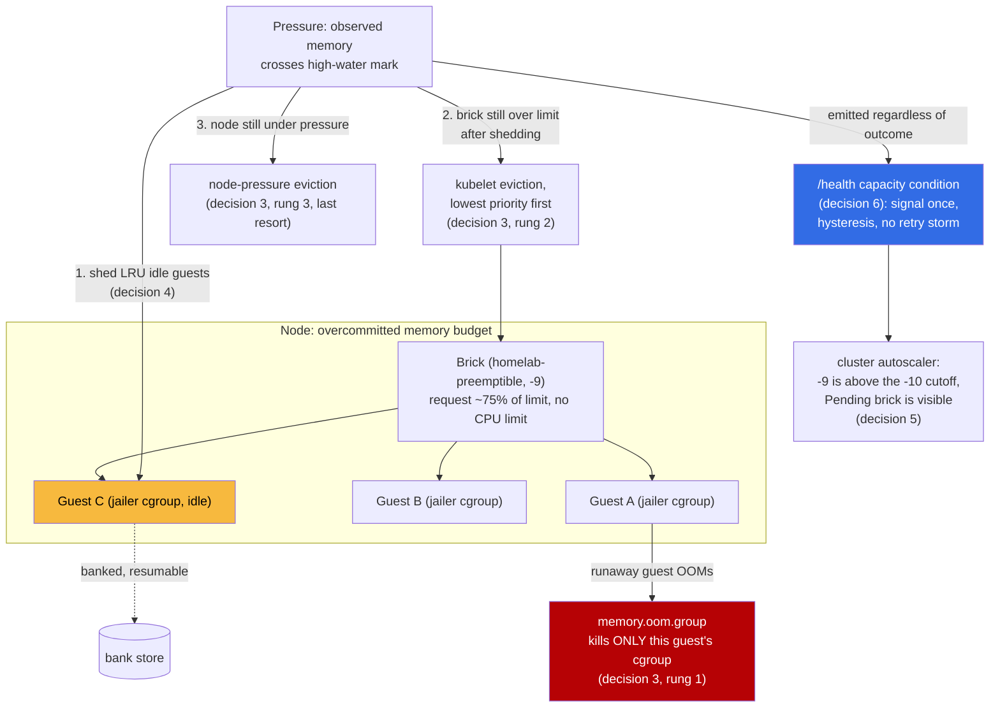

# ADR 039: Fair-Share Brick Resources, Blast-Radius Containment, and Capacity as a Signal

**Author:** Joe McGinley
**Status:** Accepted
**Created:** 2026-09-01
**Relates to:** [ADR embervm/013](013-substrate-lanes-brick-sizing-capacity-tiers.md) (bricks as the single capacity unit), [ADR embervm/016](016-kubernetes-scheduling-integration-contract.md) (PriorityClass projection this extends), [ADR embervm/021](021-workload-resource-model-memory-pivot.md) (Draft; already argues CPU should be a jailer weight, not a quota, at the guest layer), [ADR platform/010](../platform/010-memory-oversubscription-burstable-priorityclass.md) (the designated-victim pattern this applies to bricks)

---

## Problem

The night of 2026-08-31 into 2026-09-01 produced a cluster of GKE incidents
that all trace back to the same two facts: brick resource requests were
sized as if guest memory were fully resident, and capacity shortfalls had no
signal path other than a human reading logs.

- **CPU was reserved at guest-boot cost, not guest-residency cost.** Live
  bricks were observed idling at 8-16 millicores against 1-2 core requests
  per size class, while the node reported itself CPU-bound on paper and
  refused to place an incoming 8gi brick. The CPU was never in use; the
  *request* was the scarce resource.
- **Memory was reserved at limit, not at residency.** Firecracker guest RAM
  is demand-faulted, so a brick's actual resident set is the sum of pages
  its guests have touched, not the sum of their configured ceilings. The
  same 2026-09-01 measurement found bricks resident at 10-35 MiB against
  multi-gigabyte requests.
- **A brick that didn't fit no configured class denied one workload at a
  time instead of signaling.** semgrep guests (1536 MiB) hung across every
  scan until the 4gi class was enabled by hand (#5503); claude-runtime
  sessions (4096 MiB) were denied `:no_capacity` until the 8gi class was
  enabled by hand (#5504). Both required a human reading denial logs and
  editing `values-gke.yaml` (#5505).
- **Autoscaler-invisible shed order.** `homelab-disposable` (-1000) sits
  below the cluster autoscaler's expendable-pods cutoff (-10), so a Pending
  8gi brick sat 34 minutes on a full node with pool headroom while the
  autoscaler logged nothing, not even a `noScaleUp` reason. The priority
  class chosen for "cheapest thing to kill" also made bricks invisible to
  the mechanism that would have relieved the pressure by adding a node.
- **Priority-blind displacement.** Under contention, a 4gi brick landing
  displaced three unrelated 2gi bricks and killed their warm bazel and
  pages guests, flipping a previously green exhibit red for a synthetic
  test round with no notion of which lane mattered more (#5505).
- **Retry storms were the default failure mode for unsatisfiable demand.**
  The wake-cancellation storm and the 1/s checkpoint-retry loop (#5499,
  fixed in #5510 and #5514) both spent CPU and log volume churning against
  capacity that was not coming back on its own, instead of surfacing a
  capacity condition once.

None of these are independent bugs. They are one problem: the brick's
declared resource shape did not reflect its real behavior, and the system's
only response to a shape mismatch was to retry quietly or wait for a human.
This ADR decides the resource model, the failure-blast-radius ladder, and
the priority and signaling mechanics that replace both.

---

## Decision

### 1. CPU is fair-share, not reserved

Brick CPU requests become CFS scheduling weights, not a reservation sized
for peak. Bricks carry **no CPU limit**: a brick can burst into any
unclaimed node CPU, and its request only guarantees a floor under
contention. Requests were halved or better across the size portfolio (1gi
and 2gi: 1 core to 500m; 4gi and 8gi: 2 cores to 1 core; 16gi unchanged at 2
cores), dropping the worst-case fleet commitment from 12 CPU to 5 (PR
#5519).

This is not a new principle invented here: [ADR embervm/021](021-workload-resource-model-memory-pivot.md)
already decided that a guest's fractional CPU entitlement should ship as a
jailer `cpu.weight` rather than a `cpu.max` quota, for the same reason
(deliberate oversubscription cannot honor a hard ceiling anyway, and a
quota idles cores a bursting neighbor could use). This decision applies the
identical shape one layer up, at the brick pod's own Kubernetes resource
stanza, closing the gap between "we already believe this about guest CPU"
and "we still reserved brick CPU as if it were true".

### 2. Memory commitment tracks residency, not nameplate

Brick memory **requests** move to roughly 75% of **limit** across every
size class (1gi through 16gi), a scoped exception to the repo's
`request == limit` memory convention. The **limit** is untouched: it still
sets `usable_mib`, the guest-admission ceiling noded enforces, so no
guest's addressable capacity changes. Only the scheduling commitment moves,
from "reserve the full ceiling up front" to "reserve what demand-faulted
Firecracker guests actually tend to touch, with the difference available
as burst headroom" (PR #5519).

This is the same shape ADR platform/010 already established for
`inference` (reserve steady-state via requests, allow peaks via limits),
applied to a workload whose "steady state" is structurally lower than its
peak because of how Firecracker allocates guest memory, not because of a
measured usage curve. The QoS class for every brick was already Burstable
(no CPU limit is sufficient for that), so this decision does not change the
QoS class; it changes how far under the ceiling the request sits, and
therefore how much schedulable headroom the fleet frees.

### 3. Overcommit blast radius is a ladder: guest, then brick, then node

Requests below limits mean overcommit can happen, and something has to
absorb it. The order, cheapest and narrowest first:

1. **Guest**, via the Firecracker jailer's per-VM cgroup with
   `memory.oom.group` (#5520). Today noded execs firecracker directly as
   root inside a privileged brick pod with no per-VM chroot, uid/gid drop,
   cgroup, or PID namespace (found during the 2026-08-24 threat-model
   evaluation, #5255). A VMM escape today lands in a root process holding
   `/dev/kvm`, the store credential, and the noded bearer token; a
   coincident memory peak across guests today has no per-guest fence at
   all, so one runaway guest can OOM the whole brick and every neighbor it
   is hosting. The jailer closes both gaps at once: it is the accepted-risk
   line item in the threat model becoming a decided direction, not a
   separate security initiative bolted on afterward.
2. **Brick**, via kubelet eviction of the lowest-priority pods, only once
   guest-level containment has already failed to hold the brick within its
   limit. Bricks are the intended target here by construction (decision 5):
   they run a shed-first priority class, and their guests are banked and
   resumable, so evicting a brick is not the same class of loss as evicting
   `homelab-critical`.
3. **Node**, the last resort, unchanged from today's kubelet node-pressure
   behavior.

The order matters because each rung is strictly cheaper to lose than the
one above it: a guest is resumable state, a brick is a handful of
guests, a node is many bricks. Decision 4 exists specifically to keep
pressure resolving at rung 1 so rung 2 stays rare and rung 3 stays
theoretical.

### 4. Pressure sheds before eviction

A brick tracks its own observed memory (the same observed-capacity model
the control plane already reports) against high-water and low-water
fractions of its limit. Crossing the high-water mark triggers LRU shedding
of idle guests, using the bank paths sessions and stateful workloads
already have, until the brick drops back below the low-water mark (#5521).
Hysteresis between the two marks is deliberate: a single threshold thrashes
under a brick sitting near the line, banking and re-priming the same guest
repeatedly.

Two invariants bound the mechanism: a guest mid-invoke is never banked, and
existing bank backoffs (#5510) are respected rather than raced. The
pressure state itself is emitted as a capacity signal per decision 6, not
absorbed silently, so a brick that sheds its way through several guests and
is still climbing is visible before it reaches rung 2 of the ladder.

### 5. Priority classes are both shed order and scale-up eligibility

`homelab-preemptible` (-9) is a new PriorityClass, applied to the GKE
embervm bricks in place of `homelab-disposable` (-1000) (PR #5518, merged
2026-09-01). It preserves every disposability property of `-disposable`
(`preemptionPolicy: Never`, first-evicted, first-consolidated) while
sitting one step above the cluster autoscaler's expendable-pods cutoff of
-10, so a Pending brick at this priority is visible to scale-up instead of
invisible to it. `-1000` remains correct for the agent microVMs ADR
platform/010 introduced it for, workloads that never need to summon a
node; the split is that bricks are disposable in placement while being
load-bearing in aggregate, and the priority value has to say both things at
once.

This narrows a gap ADR embervm/016 already flagged: that ADR rejected
"low PriorityClass on occupied bricks as a QoS lever" because scheduler
preemption *deletes* rather than *drains*, so a below-default brick can
still be preempted outright by a normal-priority pod that cannot otherwise
schedule, taking every live guest it holds with it in one step, the exact
mass-VM-death failure mode ADR 016 was protecting against. This ADR accepts
that exposure rather than resolving it: decisions 3 and 4 shrink how much a
preempted brick has left to lose (jailer-isolated, already shed toward its
low-water mark), but they do not eliminate the case where a burst of
higher-priority scheduling pressure arrives faster than the autoscaler can
add a node. That residual is recorded as a risk below, not closed here.

### 6. Unsatisfiable demand is a signaled capacity condition, not a retry loop

When demand cannot be satisfied (no class fits the guest, or the class
ceiling and node-pool headroom are both exhausted), the response is one
signal, not a denial retried at request frequency: mark the affected class
unhealthy on `/health` and the relevant Workload status condition, shed by
priority per decisions 3-5, and hold with hysteresis rather than flapping
the health state on every retry. Queue depth and pressure state (decision
4) are themselves first-class capacity signals feeding this, not
side-channel debugging data.

The anti-pattern this replaces is concrete: the 10-second auto-wake storm
and the 1-per-second checkpoint-retry loop from #5499, fixed in #5510
(model the stateful lifecycle in TLA+ and bound its wedges) and #5514
(concurrent wakes join the in-flight start instead of cancelling it). Both
were the system discovering the same unsatisfiable condition over and over
at full frequency instead of once. Signal loudly, churn minimally.

### 7. Deferred to future work

Three related lines of work were discussed alongside this decision and are
explicitly not decided here:

- **Control-plane-driven brick class provisioning** (#5505): opening a
  brick class from zero on sustained denial, rather than requiring a
  values edit. This composes with decisions 5 and 6 (the signal this ADR
  establishes is exactly the input such a controller would consume) but is
  a separate control loop with its own scale-down and pathological-sizing
  guardrails to design.
- **In-place pod resize for dynamic brick sizing** (raised in #5505,
  growing a brick's live resource envelope via `pods/resize` instead of
  opening or closing classes): [ADR embervm/013](013-substrate-lanes-brick-sizing-capacity-tiers.md#7-bricks-everywhere-one-capacity-unit-two-pending-brick-consumers)
  already retired CP-owned in-place resize as a capacity mechanism in favor
  of fixed-size bricks everywhere, deliberately, and that decision stands.
  Nothing here reopens it.
- **The scratch-prep boot-order race** (#5517): a Spot preemption can start
  brick pods before the scratch-prep DaemonSet has finished provisioning
  the node's scratch volume, so bricks adopt bases from a path that
  scratch-prep then formats out from under them. This recurred twice in
  four hours on 2026-09-01 in an amplified form (every rootfs-build init
  container racing the unmounted path). It is a real defect and a priority
  fix, but it is an ordering bug orthogonal to the resource and signaling
  model this ADR decides, not a consequence of it.

---

## Architecture

---

## Alternatives Considered

| Alternative | Rejected because |
| ----------- | ----------------- |
| Keep `request == limit` for brick memory (status quo) | Reserves nameplate ceiling regardless of demand-faulted residency; the exact waste ADR platform/010 already named for `inference`, now shown to apply to bricks too |
| Keep bricks on `homelab-disposable` (-1000) | Below the autoscaler's -10 expendable cutoff; this is the mechanism that produced the 34-minute silent Pending brick |
| Give occupied bricks default priority to avoid the ADR 016 preemption exposure | Reintroduces the autoscaler-invisibility problem decision 5 exists to fix; the preemption exposure is instead narrowed by decisions 3 and 4 rather than avoided by staying invisible |
| CP-owned in-place resize instead of fixed-size bricks with fair-share requests | Already rejected in ADR embervm/013 section 7, deliberately, for both tiers; reopening it here was considered and set aside as future work (decision 7) |
| Retry unsatisfiable demand at request frequency until it resolves (status quo) | This is the exact anti-pattern behind the #5499 wake-cancellation storm and 1/s checkpoint retries; it burns CPU and log volume against capacity that is not coming back on its own |
| A hard `cpu.max` quota sized to the class's peak, instead of a weight | ADR embervm/021 already rejected this shape for guest CPU on the same grounds (idles cores a bursting neighbor could use, adds CFS-throttling stalls); no reason to choose it for the brick pod one layer up |

---

## Security

Baseline in `docs/security.md`. Decision 3's jailer adoption is itself a
security decision: it is the remedy for issue #5255 (Firecracker runs
without the jailer; noded execs it directly as root inside a privileged
pod, so a VMM escape today lands in a root process holding `/dev/kvm`, the
store credential, and the noded bearer token). Landing the jailer closes
that gap and gives `memory.oom.group` a real per-guest boundary to enforce;
until #5520 ships, the accepted-risk posture in `ARCHITECTURE.md` section
10 stands unchanged. The co-residency CPU side-channel between tenant
guests sharing a brick, named but left unmapped in #5255, is not addressed
by this ADR and remains open.

Decision 5's priority change has no new attack surface (PriorityClasses are
scheduling metadata), but it does change the failure-injection ordering an
attacker or a runaway workload could exploit: a resource-exhaustion attempt
against a shared node now has a defined, previously-decided victim
(bricks, ADR platform/010's pattern) rather than an unspecified kubelet
ranking outcome.

---

## Risks

| Risk | Likelihood | Impact | Mitigation |
| ---- | ---------- | ------ | ---------- |
| A burst of higher-priority scheduling demand arrives faster than the cluster autoscaler adds a node, preempting a fully loaded, unshed brick (the ADR 016 mass-VM-death case, reopened by decision 5) | Low | High | Decisions 3 and 4 minimize what a preempted brick has left to lose; not eliminated, tracked here as the residual cost of choosing autoscaler visibility over strict non-preemption |
| The 75% memory-request fraction is a single measurement, not a distribution; a workload mix with less idle memory than 2026-09-01's could make the fraction too aggressive | Medium | Medium | Values-level knob on the budget-agnostic daemon (ADR embervm/013 section 5); revisit with occupancy data from the per-brick observed-capacity ledger already in place for decision 4 |
| The jailer (#5520) is deferred implementation, not yet shipped; decisions 1-2 and 5 land ahead of the containment they assume at rung 1 of the blast-radius ladder | Medium | Medium | Rungs 2 and 3 (existing kubelet and node eviction) still function without the jailer; the gap is a wider blast radius per incident until #5520 ships, not an unhandled case |
| High/low-water hysteresis thresholds (#5521) are unset in this ADR; picking them wrong either thrashes (too close) or shed too late (too far) | Medium | Low | Left as an implementation parameter tuned against live pressure telemetry, not a gate on accepting the mechanism |
| Priority-driven shedding races a genuinely bursting workload that looks idle only because it has not yet resumed | Low | Medium | Decision 4's explicit invariant: never bank a guest mid-invoke; LRU by last-active time, not by a point-in-time memory snapshot |

---

## Open Questions

1. What high-water and low-water fractions does #5521 land on, and do they
   need to differ by size class given the 4-8x sizing spread in ADR
   embervm/013?
2. Does the jailer's per-VM cgroup (#5520) change the 75% memory-request
   fraction once guest OOMs are contained per-guest rather than
   per-brick, or are the two independent?
3. If #5505's control-plane-driven class provisioning ships, does it read
   the decision-6 health signal directly, or does it need its own
   denial-join query as originally proposed?
4. Does `homelab-preemptible`'s residual mass-VM-death exposure (risk row
   1) need a stronger answer than "shed first, minimize the loss", such as
   a `PodDisruptionBudget` once GKE's cluster autoscaler is the primary
   consumer of the Pending-brick signal rather than a rarely-exercised path?

---

## References

| Resource | Relevance |
| -------- | --------- |
| GitHub issue [#5505](https://github.com/jomcgi-org/homelab/issues/5505) | The design thread: capacity-as-signal, priority shedding, in-place resize (deferred), autoscaler visibility |
| GitHub issue [#5517](https://github.com/jomcgi-org/homelab/issues/5517) | Scratch-prep boot-order race; deferred future work (decision 7) |
| GitHub PR [#5519](https://github.com/jomcgi-org/homelab/pull/5519) | Burstable brick memory requests and fair-share CPU requests; decisions 1-2 evidence and values |
| GitHub issue [#5520](https://github.com/jomcgi-org/homelab/issues/5520) | Firecracker jailer adoption with per-VM cgroup memory limits; decision 3 |
| GitHub issue [#5521](https://github.com/jomcgi-org/homelab/issues/5521) | Pressure-driven banking keeping resident memory inside the node budget; decision 4 |
| GitHub PR [#5518](https://github.com/jomcgi-org/homelab/pull/5518) | `homelab-preemptible` priority class, merged 2026-09-01; decision 5 |
| GitHub issue [#5255](https://github.com/jomcgi-org/homelab/issues/5255) | The standing threat-model gap (Firecracker runs without the jailer) that decision 3 closes |
| GitHub issues [#5499](https://github.com/jomcgi-org/homelab/issues/5499), [#5510](https://github.com/jomcgi-org/homelab/pull/5510), [#5514](https://github.com/jomcgi-org/homelab/pull/5514) | The wake-cancellation storm and 1/s checkpoint-retry anti-patterns decision 6 replaces |
| GitHub PRs [#5503](https://github.com/jomcgi-org/homelab/pull/5503), [#5504](https://github.com/jomcgi-org/homelab/pull/5504) | The manual class-enable incidents (semgrep 1536 MiB, claude-runtime 4096 MiB) motivating decision 6 |
| [ADR embervm/013](013-substrate-lanes-brick-sizing-capacity-tiers.md) | Bricks as the single capacity unit; in-place resize retired for both tiers, deliberately (decision 7 does not reopen this) |
| [ADR embervm/016](016-kubernetes-scheduling-integration-contract.md) | The PriorityClass projection this ADR extends, and the mass-VM-death concern decision 5 reopens and only partially answers |
| [ADR embervm/021](021-workload-resource-model-memory-pivot.md) | Draft; already decided guest CPU should be a jailer weight, not a quota, the same shape decision 1 applies to the brick pod layer |
| [ADR platform/010](../platform/010-memory-oversubscription-burstable-priorityclass.md) | The designated-victim, request-below-peak pattern this ADR applies to bricks |
