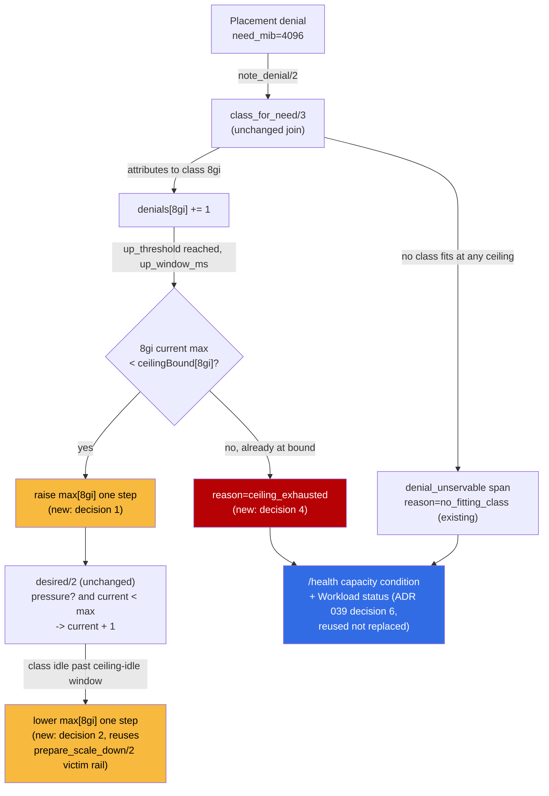

# ADR 042: Brick Class Ceilings Move on Denial Pressure, Not Values Edits

**Author:** Claude (Fable)
**Status:** Accepted
**Created:** 2026-09-05
**Builds on:** [ADR embervm/039](039-capacity-fair-share-blast-radius-signal.md) (Accepted; names this exact problem as deferred future work in decision 7, and this ADR's decision 4 answers its open question 3), [ADR embervm/013](013-substrate-lanes-brick-sizing-capacity-tiers.md) (section 7: bricks everywhere, in-place resize dropped, a decision this ADR does not reopen), [ADR embervm/016](016-kubernetes-scheduling-integration-contract.md) (the mass-VM-death preemption exposure ADR 039 decision 5 reopened and this ADR inherits unchanged), [ADR platform/016](../platform/016-gke-hub-two-pool-shape.md) (the single Spot `ember-bricks` node this ADR's cost argument is measured against)

---

## Problem

`Embervm.BrickController` already moves a brick class's replica count on
demand: `note_denial/2` attributes each placement-capacity denial to the
smallest configured class whose `usable_mib` covers the workload's need
(`class_for_need/3`), and the pure decision function `desired/2` steps that
class's live replica count up under `denial_pressure`, including from zero,
with hysteresis against flapping (`brick_controller.ex:307-323`). That
mechanism is not what failed on 2026-09-01.

What failed is the ceiling the mechanism is allowed to move within.
`class_max/1` reads the values-declared `maxReplicas[class]`, and any class
the operator has not explicitly given headroom reads `max(desired, min)`,
which is 0 when both are unset or explicitly zeroed. Two incidents landed on
that exact wall the same night: the `semgrep` task guest (1536 MiB) hung
every scan behind `floor_satisfied: false` until a human read the denial
logs and raised `4gi`'s ceiling from 0 by hand
([#5503](https://github.com/jomcgi-org/homelab/pull/5503)); `claude-runtime`
sessions (4096 MiB, the Sol/Luna/Terra codex lane) were denied
`:no_capacity` outright, because `4gi`'s usable 3840 MiB falls 256 MiB short
and `8gi` was ceilinged at 0, until a human raised it the same way
([#5504](https://github.com/jomcgi-org/homelab/pull/5504)). Both fixes were
a `values-gke.yaml` edit and a PR. `Embervm.BrickController`'s own
moduledoc already states the resulting policy as fact, not as a gap: "the
controller could scale COUNTS within a class ... but could not open a
class, so a human read the denial logs and edited values-gke.yaml"
([#5505](https://github.com/jomcgi-org/homelab/issues/5505)).

ADR embervm/039 (Accepted, 2026-09-01) decided the resource shape and the
signaling discipline this incident also exposed: fair-share CPU, memory
requests at residency rather than nameplate, an overcommit ladder that sheds
guests before evicting bricks, `homelab-preemptible` (-9) making a Pending
brick visible to the cluster autoscaler, and unsatisfiable demand as a
signaled capacity condition rather than a retry loop. That ADR explicitly
named "control-plane-driven brick class provisioning" as deferred future
work, not decided: "a separate control loop with its own scale-down and
pathological-sizing guardrails to design" (decision 7). This ADR is that
design.

The shape of the fleet this lands on, as of 2026-09-05: one Spot
`n2-standard-8` node (`ember-bricks` pool, autoscaling 1 to 3, about $70/mo
at 91% off list; ADR platform/016) running `2gi:1`, `4gi:1`, `8gi:1` desired
replicas with `16gi:0` explicitly zeroed to block deep-merge leakage of the
chart's default warm floor. Every base rebuild or Spot preemption reshuffles
which classes fit whatever RAM the current node has free, so a ceiling that
was right last week is not a durable fact about the fleet, it is a snapshot
of what one human happened to notice.

---

## Decision

The controller's existing denial-attribution and hysteresis machinery is
extended to move a class's *ceiling*, not only its replica count. No new
decision function: `desired/2` and `class_for_need/3` are reused unchanged.

**1. A class's ceiling grows on the same denial-pressure signal that today
grows its count, bounded by a new, explicit, operator-set outer bound.** A
new values field, `bricks.autoscale.ceilingBound`, names the highest
`maxReplicas` the controller may ever compute for a class; a class absent
from `ceilingBound` reads 0, preserving today's explicit-zeros contract
exactly (`16gi:0` on the hub stays 0 unless an operator opts it in). When
`class_for_need/3` attributes sustained denial pressure to a class whose
current `max` is below its `ceilingBound`, the controller raises that
class's operative `max` by one step (mirroring the existing `+1` replica
step, same `up_threshold`/`up_window_ms`/`up_cooldown_ms` hysteresis), which
then simply unblocks `desired/2`'s already-existing `pressure? -> current +
1` branch to act on the next tick. Ceiling and count move on the same clock,
one step apart, so opening a class from fully-closed still takes two ticks
(raise the ceiling, then raise the count) rather than one, which is the
cheap price of reusing rather than special-casing the decision function.

**2. Scale-to-zero is symmetric and reuses the existing drain-aware
victim.** Once a class's count has drained to 0 under the existing
`idle_drain` path and stayed there for a further, longer "ceiling-idle"
window (distinct from `down_idle_ms`, because collapsing headroom is a
bigger move than dropping one replica and should be slower to trigger), the
controller lowers the class's operative ceiling back toward its bootstrap
floor. This calls the exact same `prepare_scale_down/2` /
`pick_victim/2` path the count autoscaler already uses (refuse-to-strand on
unexported warmth, negative pod-deletion-cost to direct the victim); there
is no separate scale-down mechanism to keep honest.

**3. Ownership shift: `maxReplicas` becomes a bootstrap floor, `ceilingBound`
is the new durable ceiling.** Replica counts are already controller-owned:
ArgoCD's fleet-wide `ignoreDifferences` on `/spec/replicas` made the
controller the sole writer, and [#5498](https://github.com/jomcgi-org/homelab/pull/5498)
fixed the bug where selfHeal reverted its scale-ups anyway. This decision
extends the identical ownership one level up. After this ships,
`maxReplicas` in git is read only at first render (the value a freshly
`bricks.enabled=true` class starts at); the number an operator sees in
`values-gke.yaml` a week later is not necessarily what the fleet is running.
`ceilingBound` is the new git-declared invariant: the outer bound the
controller may never cross, checked every tick, same as `min`/`max` are
checked every tick today. The controller keeps no state outside the K8s API
objects it reads and writes, so a control-plane restart resets the
*computed* ceiling to whatever `maxReplicas` says in the rendered
config[^1] and lets denial pressure reopen it within one `up_window_ms`
(60s default) of resumed load; this is accepted as normal
restart-recovery behavior, not a gap, because it costs at most a handful of
denied requests at exactly the frequency the class was already denying
before the CP restart.

**4. The alarm surface is decision 6's `/health` capacity signal, extended
with a reason code, not a second alerting path.** This directly answers
ADR embervm/039's open question 3 ("does it read the decision-6 health
signal directly, or does it need its own denial-join query"): both. The
denial-join (`class_for_need/3`, which class fits this specific `need_mib`)
stays its own query, because that granularity is what the ceiling decision
needs and the coarse `/health` composite does not carry it. But the
*outcome* of a denial that no `ceilingBound` can ever satisfy (a workload
whose `need_mib` fits no configured class at any ceiling, or a class stuck
at its `ceilingBound` and still denying) is signaled once through the same
capacity-condition mechanism decision 6 established, with a reason code
(`no_fitting_class` vs. `ceiling_exhausted`) distinguishing "nothing sized
for this exists" from "sized for this, but the operator's cap is in the
way," rather than looping the denial at request frequency. Concretely: the
existing `embervm.brick.denial_unservable` trace span plus a warning log
already fire for the first case; this decision adds the second, and both
feed the same `/health` composite and `Workload` status-condition write
path `WorkloadWatcher` already uses (`write_status/5`), rather than a new
endpoint. `/v1/nodes`' existing denial and fleet-full introspection is the
read surface until decision 6's dedicated `/health` capacity condition
lands; this decision does not gate on that endpoint existing first.

**5. Guardrail against pathological sizing.** A 15 GiB ask cannot conjure a
16gi fleet on Spot for two independent reasons, both already load-bearing
elsewhere: `ceilingBound` is an explicit per-class opt-in (a class absent
from it, like `16gi` on the hub today, stays at 0 forever regardless of how
much pressure `class_for_need/3` attributes to it, exactly the
explicit-zeros contract `values-gke.yaml` already documents for a different
reason); and even a class that IS opted in is still bounded by the
`ember-bricks` pool's own node ceiling (autoscaling 1 to 3), so a
pathological demand spike degrades to Pending bricks rather than an
unbounded fleet, and a Pending brick is now autoscaler-visible under
`homelab-preemptible` (ADR 039 decision 5) instead of silently wedged the
way the pre-039 34-minute Pending 8gi was.

No floor-1 for any class beyond the one `16gi` already carries (recorded
policy, 2026-07-20, for the scratch-k8s composite group). See the cost
argument in "What Was Rejected" below.

| Aspect | Today | Decided |
| ------ | ----- | ------- |
| Replica count within an open ceiling | Denial-driven, `Embervm.BrickController`, already shipped | Unchanged |
| A class's ceiling (`maxReplicas`) | Static, values-declared, human-edited on incident (#5503, #5504) | Denial-driven, same hysteresis, bounded by a new `ceilingBound` outer bound |
| `maxReplicas` in git | The ceiling | A bootstrap floor read at first render only |
| Unsatisfiable-forever demand | No distinct signal from a transient denial | `ceiling_exhausted` reason code on the existing decision-6 capacity condition |
| Pathological sizing (e.g. 15 GiB ask) | Would need a human to notice and cap by hand | Capped structurally by `ceilingBound` opt-in and the node pool's own max |

---

## Architecture

---

## What Was Rejected

| Alternative | Rejected because |
| ----------- | ----------------- |
| In-place pod resize (`pods/resize`) instead of ceiling provisioning, raised in [#5505](https://github.com/jomcgi-org/homelab/issues/5505)'s own follow-up comment | Already reconsidered and set aside once, in ADR 039's own alternatives table, which found it re-litigates ADR embervm/013 section 7's explicit, twice-made decision ("bricks everywhere ... CP-owned in-place resize is dropped entirely, on both tiers ... The single simplest mechanism is chosen ... deliberately") and would additionally require noded to stop trusting its boot-time `usable_mib` env and watch live cgroup `memory.max` instead, a runtime admission-model change this ADR's scope does not include. Growing a live brick in place would avoid the exact warm-guest displacement ADR 039's problem statement names (a 4gi landing killed three unrelated 2gi bricks' warm guests), which is the honest cost of choosing class provisioning instead; see "What Would Make Us Revisit" |
| A denial-join query folded entirely into decision 6's `/health` signal, dropping `class_for_need/3` | The `/health` composite is deliberately coarse (one condition per class or fewer); the ceiling decision needs to know *which* class is missing and by how much, which only the existing per-workload join carries. Answers ADR 039's open question 3 by keeping both, not replacing one with the other |
| Human-in-the-loop, alert-only (page on denial, no auto-provisioning) | This is today's behavior. #5503 and #5504 are the incident record of what it costs: a human has to be awake, read denial logs, and land a PR before capacity exists |
| Let node-pool autoscale alone absorb it (never raise ceilings, only add nodes running the classes already open) | The actual failures were "no configured class fits this workload size," not "not enough nodes for the classes that exist." More `2gi` bricks do not fit a 1536 MiB `semgrep` guest or a 4096 MiB `claude-runtime` session; only a wider ceiling does |
| A fixed floor-1 for every class (near-zero class-open latency everywhere) | Defeats the point of demand-driven provisioning under ADR 039's residency-based sizing, and likely does not fit: `1gi`+`2gi`+`4gi`+`8gi`+`16gi` floors together would request 22.5 GiB, leaving little of the single Spot node's ~32 GiB for the horizontal `2gi` scaling real session load actually needs |

---

## Design Questions Answered

**1. Class-open latency vs. cost: is a floor-1 worth it?** No, beyond the
one `16gi` floor already recorded (2026-07-20, for the scratch-k8s
composite). Two latency regimes exist and neither argues for a standing
floor on `4gi`/`8gi`:

- *Current node has free RAM* (the common case on a single, headroom-sized
  Spot node): no node-pool step, just a new brick pod scheduling and a
  rootfs bake, on the order of the chart's measured 160-240s per-brick
  cold-bake figure (`chart/values.yaml`'s `progressDeadlineSeconds`
  rationale).
- *Current node is full*: node-pool scale-up (GKE `ember-bricks` autoscale)
  plus that same boot-and-bake cost, bounded by the chart's own
  `progressDeadlineSeconds` (1200 to 3600s depending on how many guest base
  digests moved) as the outer detector, not the expected case.

Against that, the standing cost of one always-warm `8gi` floor is a
meaningful fraction of the entire fleet: at ADR 039's 75%-of-limit request
sizing, an `8gi` brick requests 6 GiB out of the single Spot node's roughly
32 GiB total, permanently reserved for a class the incident record shows
gets hit once every few days, not continuously. Recommendation: pay the
few-minutes latency on the rare cold open rather than the standing RAM tax;
revisit if the ceiling-open path itself starts flapping (see Risks) or a
genuinely latency-sensitive workload class appears that `16gi`'s existing
floor-1 precedent would also apply to.

**2. The ownership shift (composing with [#5498](https://github.com/jomcgi-org/homelab/pull/5498)).**
Answered in decision 3 above: replicas were already controller-owned past
first render; this extends the same shift to ceilings, with `maxReplicas`
demoted to a bootstrap floor and `ceilingBound` as the new git-declared
outer invariant.

**3. Guardrail against pathological sizing.** Answered in decision 5 above:
`ceilingBound` opt-in plus the node pool's own ceiling, with
`ceiling_exhausted` and `no_fitting_class` as the two alarm reason codes
riding decision 6's existing signal path rather than a new one.

---

## What This Forecloses

- **Reading `maxReplicas` in git as current fact stops being safe**, the
  same shift #5498 already made for `desiredReplicas`. Any runbook or
  `ARCHITECTURE.md` text that explains brick ceilings needs the same
  "controller-owned after first create" caveat this ADR adds, checked via
  `/v1/nodes` or the eventual `/health` capacity condition rather than
  `git show`.
- **It does not resolve the ADR 016 / ADR 039 mass-VM-death preemption
  exposure** (ADR 039's open question 4). A newly-opened class's bricks
  still run under `homelab-preemptible` and inherit that residual risk
  unchanged; opening more classes means more places that risk can land, not
  fewer.
- **It does not reopen in-place resize.** A workload whose memory need
  varies continuously within a session, rather than clustering at a few
  known sizes, still gets "round up to the next class," same as today.

---

## Security

Baseline `docs/security.md`. No new attack surface: `ceilingBound` is a
values-declared operator input read the same way `minReplicas`/`maxReplicas`
already are, and the controller's K8s RBAC (`deployments/scale` get+patch,
already granted, ADR 013 PR-3a) is unchanged, since the ceiling adjustment
still lands as a `/scale` PATCH like any other autoscale step. A
mis-set `ceilingBound` (too high) widens how much of the single Spot node's
RAM one class can eventually claim, which composes with, but does not
worsen, the existing `homelab-preemptible` shed-first posture ADR 039
already accepted for that exposure.

---

## Risks

| Risk | Likelihood | Impact | Mitigation |
| ---- | ---------- | ------ | ---------- |
| Ceiling flaps open/closed under bursty demand near the idle-timeout boundary | Medium | Low-Medium | Reuses `desired/2`'s existing up/down cooldowns plus a ceiling-idle window deliberately longer than the replica-level `down_idle_ms` |
| A demand spike (e.g., a cold node reboot) opens every configured class at once | Low | Medium | Each class's ceiling growth is independently rate-limited by `up_threshold`/`up_window_ms`, exactly as replica steps are today; the node pool's own 3-node ceiling bounds how much can actually schedule regardless of how many classes ask |
| Spot stockout while a class is opening (the zone's documented preemption rate, ADR platform/016) | Medium | Medium | Signaled once via the decision-6 capacity condition rather than retried at request frequency; this is the general Spot-tier risk ADR platform/016 already accepted, not new here |
| An idle class's ceiling never comes back down, pinning RAM other classes need on the single Spot node | Low | Medium | Symmetric scale-to-zero (decision 2) reuses the drain-aware victim rail; a stuck victim (unexported warmth) skips the step and logs, same refuse-to-strand behavior the count autoscaler already has |
| Opening a class still displaces unrelated warm bricks on a full node (the exact ADR 039 problem statement this ADR does not eliminate) | Medium | Medium | Unchanged from today: the shed-first priority and drain-aware victim selection (ADR 039 decisions 3-5) bound the damage; if this proves insufficient in practice, that is the trigger to reopen in-place resize (see below) |

---

## What Would Make Us Revisit

- **The ceiling-open path flaps or repeatedly displaces warm guests** in
  ways the hysteresis does not damp, the exact failure mode in-place resize
  (rejected above) would have avoided by growing a brick without touching
  its neighbors.
- **A workload size shows continuous rather than clustered demand** (needs
  anywhere from 3 to 15 GiB within one session, say), which ceiling
  provisioning cannot serve cheaply by rounding to a fixed class.
- **A `budget_usd`-style enforcement mechanism extends beyond swarm run
  spend to node-level capacity.** [#4784](https://github.com/jomcgi-org/homelab/issues/4784)
  closed 2026-09-05, landing enforcement for swarm's paid-implementer
  budgets specifically; if a comparable priced ceiling is ever pointed at
  standing infrastructure like brick RAM, the no-floor-1 recommendation
  above should be re-argued from that price, not from the rough Spot-node
  RAM fraction used here.
- **The `ember-bricks` pool routinely runs more than one node**, weakening
  the "one floor eats a fifth of the whole fleet" argument against a
  floor-1, since a second or third node would dilute that fraction.

---

## References

| Resource | Relevance |
| -------- | --------- |
| GitHub issue [#5505](https://github.com/jomcgi-org/homelab/issues/5505) | The problem this ADR records the decision for; tracks remaining implementation work |
| GitHub PR [#5503](https://github.com/jomcgi-org/homelab/pull/5503) | The `4gi` manual class-enable incident (semgrep, 1536 MiB) |
| GitHub PR [#5504](https://github.com/jomcgi-org/homelab/pull/5504) | The `8gi` manual class-enable incident (claude-runtime, 4096 MiB) |
| GitHub PR [#5498](https://github.com/jomcgi-org/homelab/pull/5498) | Fixed selfHeal reverting controller-owned replica counts; the ownership precedent decision 3 extends |
| GitHub issue [#5459](https://github.com/jomcgi-org/homelab/issues/5459) | Round-2 GKE gate and clean-store deploy; the fuller session-class design this ADR's classes serve |
| [ADR embervm/039](039-capacity-fair-share-blast-radius-signal.md) | Accepted; the resource shape, shed-first priority, and capacity-signal discipline this decision composes with, and whose decision 7 named this exact problem as deferred |
| [ADR embervm/013](013-substrate-lanes-brick-sizing-capacity-tiers.md) | Section 7: bricks everywhere, in-place resize dropped deliberately on both tiers; the decision this ADR does not reopen |
| [ADR embervm/016](016-kubernetes-scheduling-integration-contract.md) | The mass-VM-death preemption exposure ADR 039 decision 5 reopened; unchanged and inherited here |
| [ADR platform/016](../platform/016-gke-hub-two-pool-shape.md) | The single Spot `ember-bricks` node this ADR's RAM-fraction cost argument is measured against |
| `projects/embervm/control/lib/embervm/brick_controller.ex` | `note_denial/2`, `class_for_need/3`, `desired/2`, `prepare_scale_down/2`: every mechanism this decision reuses rather than replaces |
| `projects/embervm/chart/values.yaml:1596-1609` | The existing `bricks.autoscale.minReplicas`/`maxReplicas` shape `ceilingBound` is added alongside |
| `projects/embervm/deploy/values-gke.yaml:64-89` | The hub's current class shape (`2gi:1`, `4gi:1`, `8gi:1`, `16gi:0`) this decision's cost argument cites |
| `projects/platform/priority-classes/templates/priorityclasses.yaml` | `homelab-preemptible` (-9), the priority class that makes a newly-opened class's Pending bricks autoscaler-visible |

[^1]: The controller's `classes` state comes from `Application.get_env(:embervm, :brick_classes, [])`, itself rendered from values at chart-template time into `EMBERVM_BRICK_CLASSES`; nothing in this ADR adds a second, longer-lived store for the computed ceiling.
