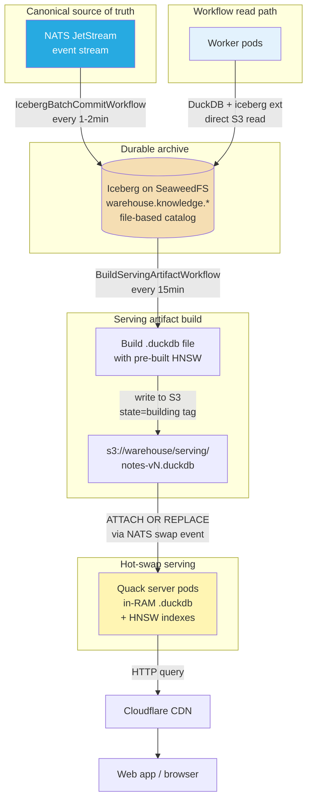
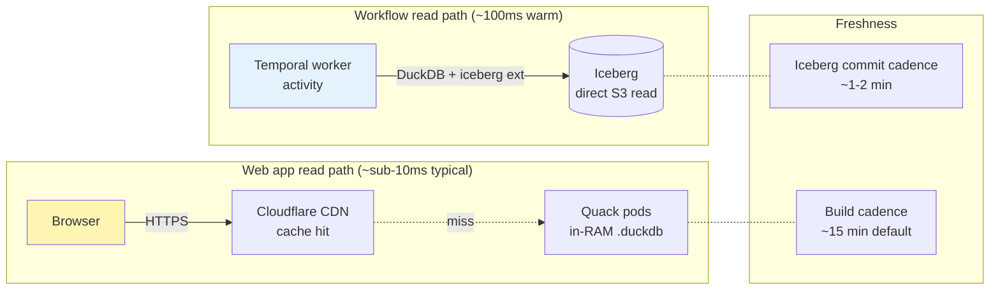
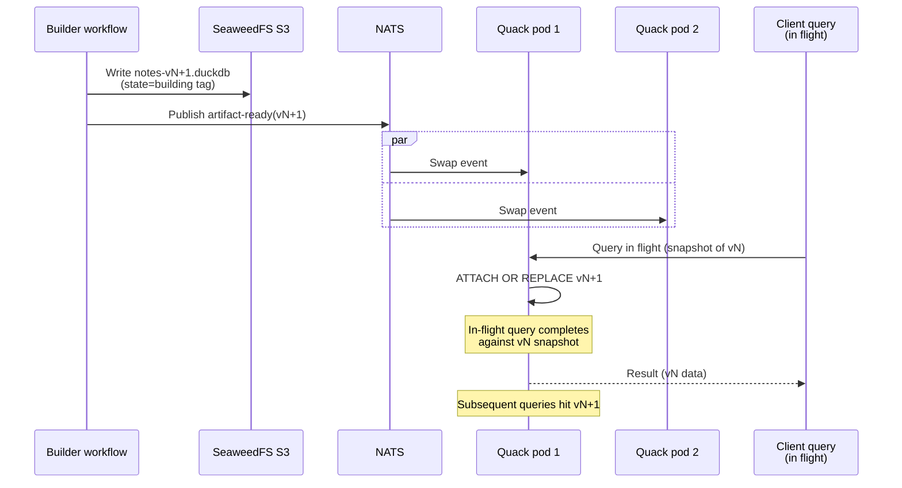
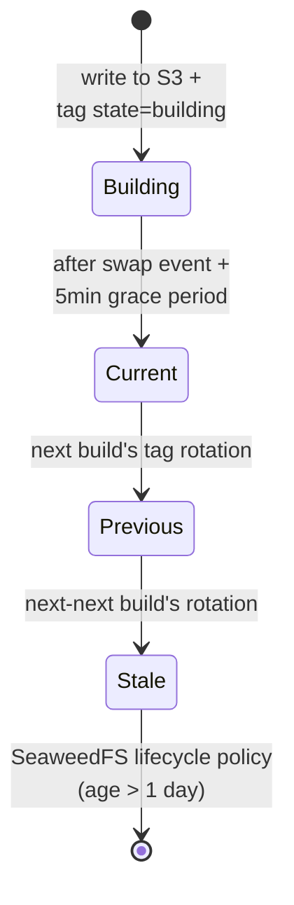

# ADR 004: Iceberg-on-SeaweedFS Lakehouse with Hot-Swap Quack Serving

**Author:** jomcgi
**Status:** Superseded
**Created:** 2026-05-30
**Superseded:** 2026-06-14 (lakehouse + Temporal stack decommissioned in PR #2596; the event-sourced serving substrate moved to `loom`)
**Partially evolves:** 001 — Obsidian Vault Migration into Monolith for the notes/KG storage domain
**Depends on:** agents/015 — Temporal, agents/016 — NATS, agents/017 — Event Schema

---

## Superseded (2026-06-14)

This ADR is no longer the destination architecture. The Iceberg/Temporal/Quack lakehouse stack it proposed was decommissioned on 2026-06-14 (`projects/lakehouse` and the `temporal` / `warehouse-bucket` platform apps removed in PR #2596); the event-sourced data platform work continues under `loom` instead.

For the **notes / knowledge-graph storage domain** specifically, the durable body-of-record is now CNPG Postgres (`knowledge.notes.content`) per ADR 006, which is the accepted destination rather than the interim it was originally framed as. The "Eventual (ADR 004)" column in ADR 006's comparison table is withdrawn along with this ADR.

The problem analysis and tier rationale below are retained for historical context.

---

## Problem

ADR 001 consolidated note storage into a CNPG Postgres cluster with pgvector. That migration solved standalone-vault scaling problems but left a single Postgres instance carrying four distinct concerns:

1. **Durable note content** (append-mostly, historical, large over time)
2. **Vector indexes** (re-derivable from content + embedding model)
3. **Operational state** (scheduler jobs, locks, queue rows — small, transactional, hot)
4. **Derived/aggregate read models** (search candidates, materialized views)

Coupling these means:

- **Backup granularity is wrong.** PITR for the whole cluster, even though only operational state truly needs it. Bulk of bytes (notes + vectors) is re-derivable.
- **Storage and compute scale together.** Adding a query replica pays for a full vector index copy.
- **History is second-class.** Note revisions, ingest events, job-run logs compete for hot storage.
- **"What did we know on date X?"** requires PITR-restore-and-query — not ergonomic.
- **Workflow execution model (ADRs 015/016/017)** is event-sourced; the storage layer should match — events as source of truth, derived views rebuildable.

The knowledge graph is also implicitly coupled to Obsidian's markdown+frontmatter format, constraining the data model to what one editor can express.

---

## Proposal

Adopt a lakehouse architecture with three storage tiers, each sized to its actual job:

1. **Apache Iceberg on SeaweedFS** as the **durable archive** for the canonical event stream (mirrored from NATS).
2. **NATS JetStream** as the **canonical source of truth** for events (per ADR 016).
3. **DuckDB + VSS (via Quack remote protocol)** as the **stateless serving layer** for note retrieval + vector search, with **hot-swap from S3** for zero-downtime updates.
4. **Operational Postgres** (existing CNPG cluster, kept small) for **only** Temporal's state DB. Application state lives in events + Iceberg, queried directly by workflows.

**Obsidian is decoupled**: the KG schema is defined by Iceberg tables, not markdown conventions. Obsidian becomes one optional UI projection if maintained, not the storage format.



| Aspect                      | ADR 001 (today)                         | Proposed                                                                                           |
| --------------------------- | --------------------------------------- | -------------------------------------------------------------------------------------------------- |
| **Source of truth**         | CNPG Postgres (pgvector + notes tables) | NATS event stream (durable archive in Iceberg on SeaweedFS)                                        |
| **Vector search**           | pgvector HNSW in primary PG             | DuckDB+VSS HNSW in per-artifact `.duckdb` file, served via Quack                                   |
| **History**                 | Implicit (latest row only)              | First-class (every event recorded; tombstones for deletion)                                        |
| **Operational state**       | Mixed with derived data in primary PG   | Isolated to Temporal's state DB (per ADR 015) |
| **Application read models** | Postgres tables                         | None — workflows query Iceberg directly via DuckDB; web app queries Quack                          |
| **Live workflow queries**   | Postgres point queries (~5ms)           | DuckDB + iceberg extension on S3 (~100ms warm)                                                     |
| **Web app queries**         | Postgres + Quack OCI artifact           | Quack in-RAM + Cloudflare CDN (~sub-10ms typical)                                                  |
| **Writers**                 | Monolith writes to PG                   | Workflows publish events to NATS; Iceberg writer batches NATS → Iceberg                            |
| **Backup granularity**      | One cluster, PITR for everything        | rclone the warehouse (immutable files) + nightly Temporal PG dump                                  |
| **Serving rebuild**         | N/A (PG _is_ the serving layer)         | Cron-driven build → S3 → hot-swap via ATTACH OR REPLACE                                            |
| **Serving freshness**       | Live                                    | 15min (build cadence; runtime-tunable knob if hot-swap proves stable)                              |
| **Portability**             | Requires Postgres replication           | Iceberg portable to any S3-compatible store / engine                                               |
| **"What did we know?"**     | PITR restore + side-by-side query       | `SELECT ... FOR TIMESTAMP AS OF '...'` on Iceberg                                                  |

---

## Architecture

### Write path (event → archive → serving)

```mermaid
sequenceDiagram
    participant P as Producer<br/>(workflow / monolith)
    participant N as NATS<br/>events.knowledge.*
    participant IB as IcebergBatchCommitWorkflow<br/>(every 1-2min)
    participant I as Iceberg<br/>(SeaweedFS)
    participant SB as BuildServingArtifactWorkflow<br/>(every 15min)
    participant S as SeaweedFS S3<br/>serving/notes-vN.duckdb
    participant Q as Quack pods

    P->>N: Publish event<br/>(per ADR 017 schema)
    Note over N: At-least-once delivery<br/>+ Nats-Msg-Id dedup

    IB->>N: Drain subjects
    N-->>IB: Batch of events
    IB->>I: Commit Iceberg snapshot
    IB->>N: Ack batch

    SB->>I: Read latest snapshot via DuckDB
    SB->>SB: Build .duckdb file<br/>with HNSW indexes
    SB->>S: Write notes-vN.duckdb<br/>tag: state=building
    SB->>N: Publish events.serving.artifact-ready

    Note over N: Hot-swap trigger
    N->>Q: Deliver swap event
    Q->>Q: ATTACH OR REPLACE<br/>'s3://.../notes-vN.duckdb'
    Note over Q: In-flight queries<br/>complete on old artifact;<br/>new queries see new
```

### Read paths (two tiers for different consumers)



Two paths, two latency budgets, two freshness windows — each consumer gets the right tradeoff. Workflows accept ~100ms latency for 1-2min freshness; web app gets sub-10ms typical for 15min freshness.

### Hot-swap mechanism (verified zero-downtime)



**Verified behavior (DuckDB 1.5.3)**: ATTACH OR REPLACE during in-flight queries completes in ~2ms (non-blocking), in-flight queries complete against their starting snapshot (no mixed data, no errors), and subsequent queries see the new artifact. Multiple rapid sequential swaps don't disrupt in-flight queries. The serving layer is genuinely zero-downtime for swap events.

### Serving artifact lifecycle



Tag rotation happens in `BuildServingArtifactWorkflow` after a 5-minute grace period (allowing in-flight queries against the old "current" to complete). SeaweedFS lifecycle deletes `state=stale` objects after 1 day. The build workflow also performs explicit "keep last N=24" cleanup as belt-and-suspenders against tag-rotation failures.

The `state=building` initial tag is deliberate: it prevents immediate lifecycle deletion of an artifact whose workflow crashed before tag rotation completed.

### Build cadence is a runtime knob

Initial deployment uses 15-minute cadence for `BuildServingArtifactWorkflow`. With hot-swap verified zero-downtime, the cadence can be tightened (5min, 2min, or per-Iceberg-commit) if operational data supports it (HNSW build duration < cadence interval; no observed query disruption). No infrastructure changes required to retune.

### What's NOT in this architecture

- **OCI registry (zot or otherwise) for serving data artifacts.** The OCI distribution pattern from an earlier draft of this ADR has been dropped: hot-swap from S3 eliminates the need for image-pull + chart-bump rollout. Container images (Quack server, monolith, worker pods) continue to use whatever registry — GHCR by default — but the serving data artifact is just an S3 object.
- **PG read models / projection tables.** No `gaps_current_state` or similar materialized tables in Postgres. Workflows query Iceberg via DuckDB directly; web app queries Quack. This keeps Postgres scoped to Temporal's state only.
- **LSM-style multi-layer artifacts.** The serving artifact is a single `.duckdb` file per build, rewritten whole. If KG grows large enough that this becomes expensive (probably GBs of embeddings), the LSM pattern can be implemented as `base.duckdb` + `active-N.duckdb` with Quack ATTACHing both and UNIONing query results. Defer until measured need.
- **Live state projections via PG.** Workflows that need entity current state query Iceberg directly (1-2min stale). The "I need sub-second fresh data" requirement is rare; when it appears, the answer is "read latest NATS events for that entity," not "maintain a third copy of state in PG."

### What does NOT change from ADR 001

- **CNPG cluster** continues to operate, but only as Temporal's state DB. The pgvector extension and notes/embedding tables come out as part of the cutover.
- **Existing notes content** migrates by re-publishing as `created` events into NATS, batching into Iceberg, building first serving artifact. One-shot backfill workflow.
- **Voyage embeddings** persisted into Iceberg as part of `created` events; survives serving rebuilds (no re-embedding cost on serving rebuild).
- **Obsidian Sync** — if retained, becomes a NATS consumer that maintains markdown files on a filesystem. Optional and isolated; non-load-bearing for the KG.

---

## Backup & Restore

The file-based Iceberg catalog choice makes this trivial. Two cron lines cover the entire backup story:

```bash
# Hourly: warehouse sync (mostly no-op — Iceberg data files are immutable)
rclone sync seaweedfs:/warehouse mega:/backups/warehouse --transfers 8

# Daily: Temporal PG dump (small)
pg_dump temporal | age -r $BACKUP_KEY | rclone rcat mega:/backups/temporal-$(date +%F).age
```

Why this works:

- **Iceberg data files are immutable** — once written, never modified. rclone checksums skip them on subsequent runs.
- **Iceberg metadata files are immutable too** — every commit writes a new `vN.metadata.json`. A mid-commit clone might miss the newest commit, but the previous metadata file points at a complete, valid snapshot. No half-state possible.
- **No external catalog service** — file-based catalog keeps the "which version is current" pointer inside the warehouse. Clone the bucket, have everything.
- **Temporal PG dump is small** — workflow state + history. Manageable.

**NATS as event-stream backup**: with infinite retention on NATS JetStream (recommended), the entire event history is replayable from NATS. Iceberg becomes an optimized columnar projection; if Iceberg is lost, rebuild from NATS replay.

**Restore**: rclone copy warehouse back; restore Temporal PG dump; point services at restored bucket. Iceberg picks up latest valid snapshot automatically.

**One operational rule**: snapshot expiry / GC for Iceberg should run outside the backup window to avoid the clone briefly capturing a manifest referencing a deleted data file. Cron offsets, no other mitigation needed.

---

## Security

- **SeaweedFS** is internal-only. No Cloudflare exposure. S3 credentials managed via 1Password Operator.
- **Quack server** binds to cluster-internal Service only. Authentication tokens via 1Password Operator; per-client tokens issued by the monolith for the web app's read path.
- **Iceberg warehouse contents** include raw note content + embeddings. Stays internal to the cluster.
- **Mega offsite backup** carries the entire knowledge base. Backups `age`-encrypted at rest with key stored independently (e.g., printed offline, or 1Password vault not dependent on cluster availability for recovery).
- **Per-pod S3 credentials** scoped: gap-drain-worker has read-only on warehouse; iceberg-builder-worker has write on `warehouse/...`; Quack pods have read-only on `warehouse/serving/`.
- **Hot-swap authorization**: the swap SQL (`ATTACH OR REPLACE`) is sent via Quack's regular query path with a privileged auth token; not all clients can issue it. Token scoped to the IcebergBatchCommitWorkflow's worker pool.

---

## Risks

| Risk                                                                             | Likelihood | Impact | Mitigation                                                                                                                                                   |
| -------------------------------------------------------------------------------- | ---------- | ------ | ------------------------------------------------------------------------------------------------------------------------------------------------------------ |
| HNSW build dominates BuildServingArtifactWorkflow runtime as corpus grows        | Medium     | Low    | Per-partition indexes already bound build size; cadence is a runtime knob; switch to incremental HNSW maintenance or LSM-style multi-file artifact if needed |
| Stale vector hits from un-tombstoned old embeddings                              | High       | Low    | Current-version filter table inside artifact; hash-join filter on every query (O(K))                                                                         |
| ATTACH OR REPLACE semantics regress in future DuckDB version                     | Low        | Medium | Pin DuckDB version in Quack image; verification test (used to validate 1.5.3) is re-runnable on upgrades                                                     |
| Quack admin reload via SQL leverages implementation detail (not first-class API) | Medium     | Low    | Worth a small upstream contribution to make `/admin/reload` first-class; works with current Quack via privileged SQL auth                                    |
| Tag rotation race during rapid sequential builds                                 | Low        | Low    | Build cadence (15min) much longer than rotation time; if cadence tightened, add a per-workflow lock                                                          |
| SeaweedFS lifecycle daemon paused / misbehaves                                   | Low        | Low    | Belt-and-suspenders: explicit "keep last N=24" cleanup in build workflow catches anything lifecycle misses                                                   |
| Right-to-be-forgotten requires up to 30 days for physical purge                  | Low        | Medium | Documented in security runbook; ad-hoc compaction tool available for urgent purges                                                                           |
| SeaweedFS rack-aware replication mis-configured per bucket                       | Medium     | High   | Replication mode set explicitly at warehouse bucket creation; integration test asserts effective replication factor                                          |
| Embedding model swap requires full re-embedding                                  | Low        | High   | Embedding model ID stored per event; swap is additive event-stream operation, not destructive; can run in shadow before cutover                              |
| Mega quota / availability failure causes silent backup gap                       | Low        | High   | rclone exit code monitored via SigNoz; alert on consecutive failures; backup duration tracked as a metric                                                    |
| Cross-pod inconsistency during swap propagation                                  | Low        | Low    | Each Quack pod independently applies swap; brief window of inconsistency between pods bounded by swap event propagation (sub-second); web app tolerates      |

---

## Open Questions

1. **PyIceberg vs go-iceberg vs duckdb-iceberg** for the writer activities. Default to PyIceberg (monolith already has Python; matches Temporal Python SDK choice). Revisit if performance bottlenecks the writer.
2. **NATS retention**: infinite (with file backend) makes NATS the canonical replay source; bounded retention forces a "combine Iceberg historical + NATS recent" rebuild pattern. For homelab scale, infinite is simpler.
3. **Compaction cadence**: monthly proposed for Iceberg base layer rewrites. If note volume turns out to be ≪100/day, quarterly might be enough.
4. **DuckDB-VSS vs LanceDB**: DuckDB-VSS chosen for ecosystem (Iceberg native, Quack support, broad tooling). LanceDB remains escape hatch if VSS hits index-size or recall limits.
5. **Embedding storage format inside Iceberg**: `array<float>` works but Iceberg doesn't compress float arrays well. Consider int8 quantization at rest with on-the-fly dequant at HNSW build, if storage becomes an issue.
6. **Build cadence tightening trigger** — what operational signal indicates "hot-swap is stable enough to reduce cadence"? Probably: no observed query disruption + HNSW build < cadence/2 for 30+ days.

---

## References

| Resource                                                                                               | Relevance                                                           |
| ------------------------------------------------------------------------------------------------------ | ------------------------------------------------------------------- |
| 001 — Obsidian Vault Migration into Monolith               | The architecture this ADR partially evolves for the notes/KG domain |
| [Apache Iceberg spec](https://iceberg.apache.org/spec/)                                                | Table format, snapshot semantics, time-travel queries               |
| [Iceberg file-based catalog](https://iceberg.apache.org/docs/latest/configuration/#catalog-properties) | Simpler catalog choice — no external service to operate             |
| [SeaweedFS replication modes](https://github.com/seaweedfs/seaweedfs/wiki/Replication)                 | Per-bucket redundancy configuration                                 |
| [DuckDB VSS extension](https://duckdb.org/docs/extensions/vss)                                         | HNSW index inside DuckDB; the serving primitive                     |
| [DuckDB Quack remote protocol](https://duckdb.org/2026/05/12/quack-remote-protocol)                    | Client-server protocol enabling shared DuckDB pods                  |
| [DuckDB ATTACH statement](https://duckdb.org/docs/current/sql/statements/attach.html)                  | The hot-swap primitive (`ATTACH OR REPLACE` from S3)                |
| [DuckDB S3/httpfs extension](https://duckdb.org/docs/current/core_extensions/httpfs/s3api.html)        | Direct S3 read; configuration for SeaweedFS endpoint                |
| [PyIceberg](https://py.iceberg.apache.org/)                                                            | Candidate writer library for workflow activities                    |
| [rclone Mega backend](https://rclone.org/mega/)                                                        | Offsite backup transport                                            |
| [Voyage AI embeddings](https://docs.voyageai.com/)                                                     | Embedding provider; cost driver for re-embedding decisions          |
| agents/015 — Temporal                             | Orchestration substrate that runs the Iceberg/build workflows       |
| agents/016 — NATS                                      | Event substrate that feeds the Iceberg writer                       |
| agents/017 — Domain Event Schema                               | Event envelope schema written to Iceberg                            |
