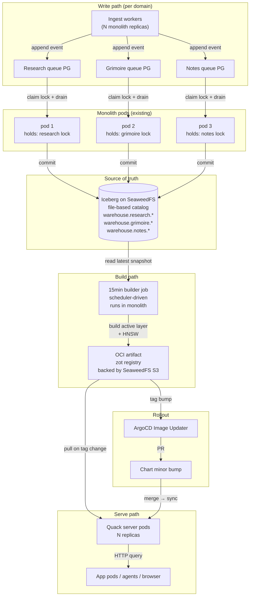
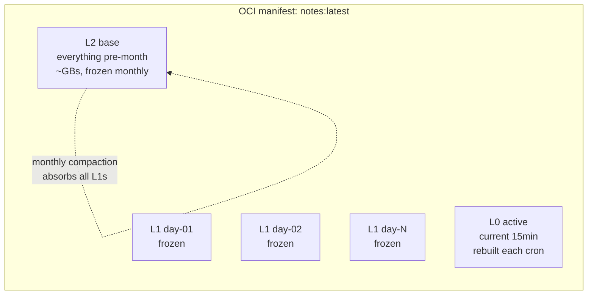

# ADR 004: Iceberg-on-SeaweedFS as Source of Truth, DuckDB+VSS as Serving Layer

**Author:** jomcgi
**Status:** Draft
**Created:** 2026-05-24
**Supersedes:** Partially evolves [ADR 001 — Migrate Obsidian Vault into Monolith with TigerFS](001-obsidian-vault-monolith-migration.md)

---

## Problem

ADR 001 consolidated note storage and vector search into a single CNPG Postgres cluster with pgvector. That migration solved the standalone-vault scaling problems but left a single Postgres instance carrying four distinct concerns:

1. **Durable note content** (append-mostly, historical, large over time)
2. **Vector index** (re-derivable from content + embedding model)
3. **Operational state** (scheduler jobs, locks, queue rows — small, transactional, hot)
4. **Derived/aggregate read models** (search candidates, materialized views)

Coupling these means:

- **Backup/restore granularity is wrong.** PITR for the whole cluster, even though only operational state truly needs it. The bulk of bytes (notes + vectors) is re-derivable.
- **Storage and compute scale together.** Adding a query replica pays for a full copy of the vector index in PG.
- **Portability is poor.** Moving any subset to cloud compute (e.g. running an analytical job on a beefy ephemeral box) requires `pg_dump`/replication, not just pointing at object storage.
- **History is a second-class citizen.** Note revisions, ingest events, job-run logs all want to live forever but compete for the same hot storage.
- **The "what did we know on date X" question is hard.** Reconstructing past state requires either dedicated history tables or PITR-restore-and-query — neither is ergonomic for routine use.

The user's mental model is already event-sourced: most state changes flow through a queue (scheduler-backed) and are not low-latency. The current architecture doesn't take advantage of that.

---

## Proposal

Adopt a lakehouse-first architecture with three storage tiers, each sized to its actual job:

1. **Apache Iceberg on SeaweedFS** as the **single source of truth** for all append-only domains. Per-domain Iceberg **namespaces** (`warehouse.research.*`, `warehouse.grimoire.*`, `warehouse.notes.*`) so heavy work in one domain doesn't compete with another. Append-only by convention — mutations become supersession events, deletes become tombstones. Uses Iceberg's **file-based catalog** (no separate catalog service): the warehouse is internally self-describing, every backup is naturally point-in-time consistent.
2. **Operational Postgres** (the existing CNPG cluster, kept small) for **only** the things that must be transactional and live: scheduler jobs, locks, agent routine state, queue rows. PITR-backed, low row count.
3. **DuckDB with the VSS extension, exposed via the Quack remote protocol**, as the **derived serving layer** for note retrieval + vector search. Stateless from a durability standpoint — every byte is rebuildable from Iceberg.

**Writers live in the existing monolith**, not in dedicated writer pods. Each monolith replica runs a background loop per domain that claims a Postgres lock (`iceberg-writer-${domain}`, 30s TTL) and drains that domain's queue into Iceberg. Different replicas naturally hold different domain locks — sharding happens organically. If a writer pod dies, the lock TTL expires and another monolith pod takes over within ~30s; the queue absorbs the gap. This reuses the lock infrastructure already in production (`monolith-agent-acquire-lock`, etc.).

The serving-layer artifact (a `.duckdb` file with pre-built HNSW indexes) is produced by a scheduler job, published as an **OCI artifact** to an in-cluster registry (zot, backed by SeaweedFS S3), and consumed by Quack server pods like any other container image — with ArgoCD Image Updater driving rollouts as version-controlled commits.

| Aspect                   | Today (ADR 001)                              | Proposed                                                                |
| ------------------------ | -------------------------------------------- | ----------------------------------------------------------------------- |
| **Source of truth**      | CNPG Postgres (pgvector + notes tables)      | Iceberg on SeaweedFS with file-based catalog                            |
| **Vector search**        | pgvector HNSW in primary PG                  | DuckDB+VSS HNSW in a per-partition file, served via Quack               |
| **History**              | Implicit (latest row only)                   | First-class (every revision is an event)                                |
| **Operational state**    | Mixed with derived data in primary PG        | Isolated to a small operational PG (PITR-backed)                        |
| **Writers**              | Monolith writes to PG                        | Monolith claims per-domain PG lock, writes to Iceberg                   |
| **Per-domain isolation** | None (one PG schema)                         | Per-domain queues + writer locks + Iceberg namespaces                   |
| **Backup granularity**   | One cluster, PITR for everything             | rclone the warehouse (immutable files) + nightly pg_dump of ops PG      |
| **Serving rebuild**      | N/A (PG _is_ the serving layer)              | Cron-driven OCI artifact build, ArgoCD-driven rollout                   |
| **Horizontal scaling**   | Add PG read replicas (full vector copy)      | Add Quack server replicas (each pulls the OCI artifact)                 |
| **Portability**          | Requires Postgres replication                | Iceberg is portable to any S3-compatible store / engine                 |
| **Embedding cost**       | Re-embedding on rebuild = full Voyage bill   | Embeddings persisted in Iceberg; rebuild = re-index only                |
| **"What did we know?"**  | PITR restore + side-by-side query            | `SELECT ... FOR TIMESTAMP AS OF '...'` on Iceberg snapshot              |

---

## Complexity Trade-off

This proposal is **not a net complexity reduction**. It is better-organized complexity at the cost of more total moving parts. Honest accounting:

| Component                    | Today | Proposed                                        |
| ---------------------------- | ----- | ----------------------------------------------- |
| Stateful services            | 1 (CNPG) | 3 (CNPG, SeaweedFS, zot)                     |
| Scheduler jobs added         | 0     | 3 (15min build, daily roll, monthly compaction) |
| New container images         | 0     | 1 (Quack server — builder reuses monolith)      |
| New write disciplines        | 0     | 2 (supersession events, tombstones)             |
| Backup targets               | 1     | 2 (Iceberg warehouse, ops PG dump)              |
| Things that can fail at 3am  | ~3    | ~7                                              |

What we get in exchange: history as first-class, portability to cloud object storage, decoupled storage/compute scaling, ergonomic time-travel queries, and a backup story where the bulk of bytes are immutable files that incremental sync handles trivially.

The trade is worth it if those properties matter. If they don't, **ADR 001 as-is is the simpler answer** and this ADR should be rejected in favor of "no change."

---

## Architecture

### Storage Topology



### Writer Model: PG Lock + TTL

Each monolith replica runs N background loops (one per domain). Each loop:

```
forever:
  acquired = pg.try_acquire_advisory_lock(f"iceberg-writer-{domain}", ttl=30s)
  if acquired:
    while still_lock_holder:
      events = drain(domain_queue, batch_size=100)
      if events:
        iceberg.commit(domain_namespace, events)
      refresh_lock_lease(extend_by=20s)
      sleep(short)
  else:
    sleep(5s)
```

Different replicas naturally end up holding different domain locks. The result is **sharded writes (one writer per domain) with HA (TTL failover)** without dedicated writer pods, dedicated Helm charts, or new deployment infrastructure. Failure mode: writer pod dies → lock expires in ≤30s → next monolith pod claims it → backlog drains.

Resource trade-off: a heavy backfill in domain X runs inside a monolith pod, sharing CPU/memory with that pod's other work. Mitigation if it ever matters: throttle batch size, or label some monolith replicas as "background-eligible" via node selectors. At personal scale this hasn't been a problem with other heavy monolith workloads, so we accept the risk.

### LSM-Style Leveled Compaction

The OCI artifact is **layered by time bracket** so small frequent updates only touch the active layer, and dedup at the registry handles the rest:

| Level         | Contents                                                | Cadence                                | OCI behavior                       |
| ------------- | ------------------------------------------------------- | -------------------------------------- | ---------------------------------- |
| **L0 active** | Current 15-minute bracket                               | Rebuilt every 15min                    | Re-pushed every cron               |
| **L1 daily**  | Each closed day of current month                        | Frozen at day-end                      | Pushed once, never re-pushed       |
| **L2 base**   | Everything before current month, compacted (latest-only) | Rewritten monthly (1st of month, 3am) | New blob monthly, old blob GC'd    |



Query-time fan-out:

- Start of month: 1 base + 1 active = **2 partitions**
- End of month: 1 base + ~30 daily + 1 active ≈ **32 partitions**
- After monthly compaction: back to **2**

Each partition has its own HNSW index. Vector search runs top-K against each partition in parallel and merges by distance — standard segment-search pattern (Lucene, FAISS).

**Combined-artifact v1, per-domain artifacts later if cadence diverges.** The builder produces one OCI image containing all domains. If grimoire turns out to be near-immutable while research churns, splitting them into separate OCI artifacts becomes worth the configuration cost — defer until measured.

### Supersession & Tombstones

Mutations never rewrite old partitions. They become events in the active layer:

```
2023-03-15  partition L1: { note_id=123, version=1, content="...", embedding=[...] }
2026-05-24  partition L0: { note_id=123, version=4, content="(edited)", embedding=[...], supersedes=3 }
2026-05-25  partition L0: { note_id=123, deleted=true }   ← tombstone
```

Query layer maintains a `current_version(note_id) → (latest_version, latest_partition, tombstoned)` lookup table inside each rebuilt artifact. Vector search candidates are hash-joined against it to drop stale and tombstoned hits. The filter cost is O(K) where K is the candidate count, negligible.

Hard delete (right-to-be-forgotten): wait for next monthly compaction (which applies tombstones in the base rewrite), or trigger an ad-hoc compaction. Within a month, the data is logically gone (tombstoned) but physically present.

### Consistency Across Pod Rollouts

Each Quack server replica loads the OCI artifact independently. During a rollout, two pods may briefly serve different artifact versions. **Default consistency is eventual**: clients tolerate "note I referenced is now tombstoned/missing" the same way they already tolerate concurrent deletes.

The serving layer surfaces enough metadata for clients to disambiguate when needed:

- Every response carries `artifact_version` (the OCI tag the responding pod loaded).
- Every record carries `note_id`, `version`, `tombstoned`, `superseded_by` — so "this changed since you last saw it" is queryable, not silent.

If we ever observe real bugs from cross-rollout straddling, we can layer in version pinning (clients send `min-artifact-version`, pods serve from `ATTACH`ed previous version during a grace window). Not in scope for v1.

### Git-Driven Promotion

Every artifact promotion is a Git commit, matching how the rest of the homelab operates:

```
Iceberg event lands
  → 15min cron: builder rebuilds active layer + pushes oci://zot.cluster/notes:v2026.05.24-1530
  → ArgoCD Image Updater detects new tag
  → chart-version-bot PRs a chart minor bump + updated image tag in values.yaml
  → CI green → merge → ArgoCD syncs → Quack server pods roll
```

**Coalescing knob:** chart bumps should not fire every 15min (would spam PRs and churn the serving layer). The Image Updater config sets a minimum interval (e.g. 1h) between chart bumps; the OCI artifact still updates every 15min, but pods only roll hourly. Clients pulling slightly stale data within that window is acceptable per the consistency model.

---

## Backup & Restore

The file-based catalog choice makes this trivial. Two cron lines cover the entire backup story:

```bash
# Hourly: warehouse sync (mostly no-op — Iceberg data files are immutable)
rclone sync seaweedfs:/warehouse mega:/backups/warehouse --transfers 8

# Daily: operational PG dump (small)
pg_dump operational_pg | age -r $BACKUP_KEY | rclone rcat mega:/backups/pg-$(date +%F).age
```

Why this works:

- **Iceberg data files are immutable** — once written, never modified. rclone checksums skip them on subsequent runs. Hourly syncs ship only new commit files (typically tens of KB).
- **Metadata files are immutable too** — every commit writes a new `vN.metadata.json`. A mid-commit clone might miss the newest commit, but the previous metadata file still points at a complete, valid snapshot. You can't end up in a half-state.
- **No external catalog to coordinate with** — Nessie/Polaris/REST catalogs put the "which version is current" pointer outside the warehouse, requiring snapshot coordination. The file-based catalog keeps that pointer inside the warehouse. Clone the bucket, you have everything.
- **Operational PG dump is small** — scheduler tables, locks, queue rows. Single-digit MB compressed.

**One small operational rule:** snapshot expiry / GC for Iceberg should run outside the backup window. If it runs concurrently, a clone could briefly capture a manifest referencing a now-deleted data file. Solved with cron offsets, no other mitigation needed.

**Restore:** rclone copy the warehouse back, restore the PG dump, point services at the restored bucket. Iceberg picks up the latest valid snapshot automatically.

**Offsite redundancy:** Mega is the offsite copy; SeaweedFS rack-aware replication handles in-cluster redundancy. Both layers must fail to lose data.

---

## Implementation

### Phase 1: Foundation — SeaweedFS + Iceberg warehouse

- [ ] Deploy SeaweedFS to the cluster with `010` rack-aware replication for the warehouse bucket
- [ ] Create the warehouse skeleton (file-based catalog) with namespaces for `research`, `grimoire`, `notes`
- [ ] Define table schemas for `note_events`, `ingest_events`, `job_runs` (with `note_id`, `version`, `content`, `embedding`, `model_id`, `supersedes`, `tombstoned` columns)
- [ ] Write a thin Iceberg writer library in the monolith using PyIceberg (or Go equivalent)
- [ ] Document the event schemas alongside other monolith schemas

### Phase 2: Writer integration in monolith

- [ ] Add per-domain queue tables to operational PG (or one table with a `domain` column + workers filtering)
- [ ] Add per-domain background loops in monolith that claim PG advisory locks (`iceberg-writer-${domain}`, 30s TTL) and drain queues into Iceberg
- [ ] Dual-write at the ingest path: continue writing to PG, also enqueue an event for the appropriate domain
- [ ] One-shot backfill job: read all existing notes from PG, enqueue `created` + `current_version` events per note + embedding
- [ ] Validate row counts and sample queries match between PG and Iceberg

### Phase 3: Builder + zot

- [ ] Deploy zot in-cluster, backed by SeaweedFS S3
- [ ] Register `rebuild-notes-duckdb` as a scheduler routine job (15min cadence), running in the monolith
- [ ] Builder job: read all Iceberg namespaces' active-period events → build `notes-active.duckdb` with per-partition HNSW per table → upload as OCI layer → push tag bump
- [ ] Daily roll job (00:05 UTC): seal previous day's active layer into a frozen L1 layer
- [ ] Monthly compaction job (1st of month, 03:00 UTC): merge L2 base + all L1 layers + apply tombstones → new L2 base

### Phase 4: Quack serving

- [ ] Build a Quack-server container image (DuckDB + VSS extension + Quack server binary)
- [ ] Helm chart in `projects/notes_serving/chart/` with HPA targeting CPU + custom metric on query latency
- [ ] ArgoCD Application + Image Updater config in `projects/notes_serving/deploy/`
- [ ] Update monolith's `notes` module to query via Quack HTTP instead of pgvector (feature-flagged)

### Phase 5: Cutover

- [ ] Run both serving paths in parallel for one week; compare result sets on a sample of queries
- [ ] Flip the feature flag → all reads go through Quack
- [ ] Stop dual-writing (Iceberg becomes the only write target)
- [ ] Drop the `notes` and embedding tables from primary PG
- [ ] Shrink the CNPG cluster to operational-PG dimensions (storage, replicas, memory)

### Phase 6: Backup automation

- [ ] Configure rclone with Mega remote; secret managed via 1Password Operator
- [ ] Hourly CronJob: `rclone sync seaweedfs:/warehouse mega:/backups/warehouse`
- [ ] Daily CronJob: `pg_dump` operational PG → age-encrypt → rclone to Mega
- [ ] Restore runbook with a tested recovery procedure documented in `docs/observability.md`-style location
- [ ] Schedule Iceberg snapshot expiry to run outside the backup window

### Phase 7: Cleanup & docs

- [ ] Update `docs/services.md` and `docs/observability.md` to describe the new topology
- [ ] Add runbooks for: failed monthly compaction, OCI registry full, Quack server OOM, builder job stuck, restore from Mega
- [ ] Add SigNoz dashboards for builder duration, artifact size growth, query fan-out distribution, per-domain queue depth, writer-lock contention

---

## Security

Baseline per `docs/security.md`. New surface area:

- **SeaweedFS** is internal-only (no Cloudflare exposure). S3 credentials managed via 1Password Operator.
- **zot registry** is internal-only. Mutual auth between builder job and registry via service-account tokens; pull credentials for Quack server pods via 1Password Operator.
- **Quack server** binds to cluster-internal Service only. Authentication tokens via 1Password Operator; per-client tokens issued by the monolith.
- **OCI artifact contents** include raw note content + embeddings. The decision to use in-cluster zot (not GHCR) is deliberate: the knowledge base never leaves the cluster network. If we ever publish to a public/cloud registry, content must be encrypted at rest with a key not stored alongside.
- **Mega offsite backup** carries the entire knowledge base. Backups must be `age`-encrypted at rest with a key stored independently (e.g. printed and held offline, 1Password vault that does not depend on the cluster being up to recover).

---

## Risks

| Risk                                                          | Likelihood | Impact | Mitigation                                                                                                                                  |
| ------------------------------------------------------------- | ---------- | ------ | ------------------------------------------------------------------------------------------------------------------------------------------- |
| Monthly compaction grows to multi-hour rebuild                | Medium     | Medium | Compaction runs in off-peak window; idempotent so failures retry; alert on duration regression                                              |
| Quack server pod = single point of failure for query path     | Medium     | Medium | Run ≥2 replicas behind a Service; each loads the artifact independently; HPA on query latency                                               |
| HNSW build dominates builder runtime as corpus grows          | Medium     | Low    | Per-partition indexes already bound build size; switch to incremental HNSW maintenance only if full rebuild crosses ~5min                   |
| Stale vector hits from un-tombstoned old embeddings           | High       | Low    | Current-version filter table inside artifact; hash-join filter on every query (O(K))                                                        |
| OCI layer count exceeds practical limits in long months       | Low        | Low    | Max ~32 layers/month (base + 30 daily + active); well under registry/client limits                                                          |
| Cross-rollout straddling causes silent inconsistency          | Low        | Low    | Every response carries `artifact_version`; client tolerates "now-tombstoned"; pin-by-version is a known escape hatch if needed              |
| Heavy backfill in monolith pod starves user-facing traffic    | Medium     | Medium | Throttle writer batch size; label some monolith replicas as background-eligible if isolation becomes necessary                              |
| Backfill events lost if writer pod dies mid-batch             | Low        | Low    | Queue is at-least-once; events are idempotent (unique IDs); lock TTL expiry lets next pod resume within ~30s                                |
| Right-to-be-forgotten requires up to 30 days for physical purge | Low      | Medium | Documented in security runbook; ad-hoc compaction tool available for urgent purges                                                          |
| SeaweedFS rack-aware replication mis-configured per bucket    | Medium     | High   | Replication mode set explicitly at warehouse bucket creation; integration test asserts effective replication factor                         |
| Embedding model swap requires full re-embedding bill          | Low        | High   | Embedding model ID stored per event; swap is an additive event-stream operation, not a destructive one; can run in shadow before cutover    |
| Mega quota / availability failure causes silent backup gap    | Low        | High   | rclone exit code monitored via SigNoz; alert on consecutive failures; backup duration tracked as a metric                                   |

---

## Open Questions

1. **PyIceberg vs go-iceberg vs duckdb-iceberg for the writer library.** Default to PyIceberg (most mature, monolith already has Python). Revisit if Python performance bottlenecks the writer.
2. **Compaction cadence.** Monthly is the proposal. If note volume turns out to be ≪100/day, quarterly might be enough (fewer rewrites, smaller registry footprint). Defer the call until we have ingest stats.
3. **DuckDB-VSS vs LanceDB.** DuckDB-VSS chosen for ecosystem (Iceberg native, Quack support, broad tooling). LanceDB remains the escape hatch if VSS hits real index-size or recall limits. Document trigger conditions.
4. **Coalescing window for chart bumps.** 1h proposed but unvalidated. Should be tuned once we observe real cron rhythm and PR noise tolerance.
5. **Embedding storage format inside Iceberg.** `array<float>` works but Iceberg doesn't compress float arrays well. Consider quantization (int8) at rest with on-the-fly dequant at HNSW build, if storage becomes an issue.
6. **Combined vs per-domain OCI artifacts.** Combined for v1; if grimoire's cadence diverges sharply from research/notes, splitting buys OCI dedup wins. Defer to measurement.
7. **Workflow orchestration.** Heavy multi-step workflows (large backfills, re-embedding campaigns) might eventually want Argo Workflows or similar. Deferred to a separate ADR; the existing PG scheduler suffices for v1 (single-step jobs, lock-TTL refresh for long-running ones).
8. **Unified agent + job platform.** The homelab has two orchestration surfaces today (monolith scheduler + agent orchestrator). Worth a separate ADR to consolidate. Out of scope here.

---

## References

| Resource                                                                                                              | Relevance                                                                |
| --------------------------------------------------------------------------------------------------------------------- | ------------------------------------------------------------------------ |
| [ADR 001 — Obsidian Vault into Monolith with TigerFS](001-obsidian-vault-monolith-migration.md)                       | The architecture this ADR partially supersedes for the notes domain      |
| [Apache Iceberg spec](https://iceberg.apache.org/spec/)                                                               | Table format, snapshot semantics, time-travel queries                    |
| [Iceberg file-based (Hadoop) catalog](https://iceberg.apache.org/docs/latest/configuration/#catalog-properties)       | The simpler catalog choice — no external service to operate              |
| [SeaweedFS replication modes](https://github.com/seaweedfs/seaweedfs/wiki/Replication)                                | Per-bucket redundancy configuration                                      |
| [DuckDB VSS extension](https://duckdb.org/docs/extensions/vss)                                                        | HNSW index inside DuckDB; the serving primitive                          |
| [DuckDB Quack remote protocol announcement (2026-05-12)](https://duckdb.org/2026/05/12/quack-remote-protocol)         | Client-server protocol enabling shared DuckDB pods                       |
| [zot — OCI-native container image registry](https://zotregistry.dev/)                                                 | In-cluster OCI registry backed by S3                                     |
| [PyIceberg](https://py.iceberg.apache.org/)                                                                           | Candidate writer library for the monolith integration                    |
| [rclone Mega backend](https://rclone.org/mega/)                                                                       | Offsite backup transport                                                 |
| [Voyage AI embeddings](https://docs.voyageai.com/)                                                                    | Embedding provider; cost driver for re-embedding decisions               |
| `docs/observability.md`                                                                                               | Where new SigNoz dashboards and runbooks will live                       |
| `docs/security.md`                                                                                                    | Baseline security posture; deviations documented above                   |
