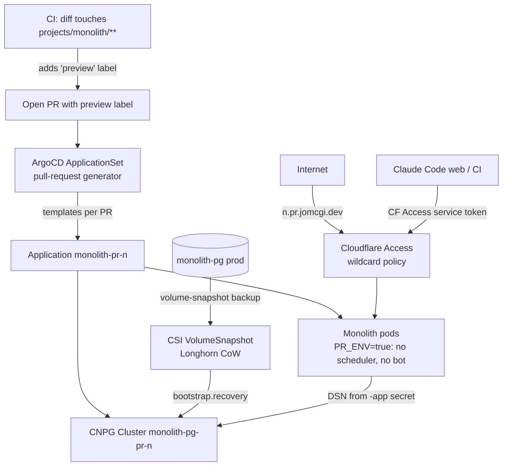

# ADR 005: Per-PR Preview Environments for the Monolith

**Author:** Joe McGinley
**Status:** Draft
**Created:** 2026-06-12
**Relates to:** ADR 001: Obsidian Vault Monolith Migration, [Networking ADR 002: Path-Based Ingress Tiers](../networking/002-path-based-ingress-tiers.md)

---

## Problem

Testing a monolith change today means merging to `main` and watching it roll out, or running pieces locally without the real cluster, database, ingress, and CNPG-managed secrets around them. There is no way to exercise a branch end to end, against realistic data, before it lands. We want a preview environment per open PR so a change can be clicked through at a stable URL before merge.

Three properties make this non-trivial for the monolith specifically:

1. **Postgres.** A useful preview needs realistic data, but we will not copy the whole database per PR, and we must never let a preview's writes touch prod data.
2. **Side effects.** The monolith runs a Postgres-backed scheduler loop (gardener, changelog poller, vault git-push, ships maintenance) and a Discord bot. A second live instance sharing the same Discord token and doing the same scheduled work would double-reply in channels and duplicate expensive jobs.
3. **Exposure.** The app's routes assume absolute paths (`/_app/*`, `/api/*`) and the public/private split is by hostname today. Previews must be reachable (by the developer and by Claude Code on the web) without exposing them publicly.

---

## Decision

Ship ephemeral, label-gated preview environments driven by an **ArgoCD ApplicationSet pull-request generator**. For each opted-in open PR, ArgoCD templates one monolith Application that deploys the already-built PR image alongside a copy-on-write clone of the production database, muted of all scheduled and external side effects, behind a wildcard subdomain protected by Cloudflare Access.

### 1. Postgres: copy-on-write clone, not a logical copy

We clone production Postgres per preview at the **storage layer**, where copy-on-write already lives:

- Production `monolith-pg` (CNPG) gains a **volume-snapshot backup** configuration. CNPG takes consistent online snapshots through the CSI `VolumeSnapshot` API, which Longhorn implements as block-level copy-on-write.
- Each preview templates a small CNPG `Cluster` (`monolith-pg-pr-<n>`) that bootstraps via `bootstrap.recovery` from that snapshot. Longhorn provisions the clone copy-on-write: zero blocks copied up front, full prod data present, and every write in the preview is copy-on-write into private blocks, so prod is never mutated.

This is the literal "separate the read path from the write path" idea, resolved at the block layer: unchanged blocks are physically shared with prod (reads), changed blocks are private to the preview (writes). It is also genuinely zero-copy: no data is duplicated until a preview writes.

The cost is not disk, Longhorn handles that, it is that **two Postgres engines cannot mount the same data directory**, so each clone runs its own Postgres pod (512Mi request / 1Gi limit). On a single node that pod budget is the real constraint, so previews are **capped at 3 concurrent** and each clone runs `instances: 1`.

A clone is a **point-in-time fork** taken when the preview is created, not live prod data. That staleness is the correct trade for an isolated preview.

### 2. Side effects: one `PR_ENV` flag mutes the scheduler and the bot

Rather than gate side effects piecemeal (the current model, where several scheduled jobs run unconditionally), add a single `PR_ENV=true` value that, at startup:

- **does not start the scheduler loop** (`shared/scheduler.py`), which is the origin of all periodic work, and
- **does not start the Discord bot** (`app/main.py`), which is the origin of all outbound chat.

Killing those two startup points removes every duplicate job and every double Discord reply in one move: a preview has no bot connection and no scheduler tick. The preview's own cloned database keeps its scheduler/lock tables isolated as belt-and-suspenders, but the loop simply never runs.

### 3. Exposure: wildcard subdomain behind Cloudflare Access

Previews are served at **`<n>.pr.jomcgi.dev`** (wildcard DNS + wildcard origin cert), one clean origin per PR. A subdomain avoids the path-rewriting that `pr.jomcgi.dev/<n>/...` would force on an app full of absolute asset and API paths.

The entire `*.pr.jomcgi.dev` wildcard sits behind a single **Cloudflare Access** policy (trusted tier), so previews are never publicly indexed and carry real cloned data safely. Each preview exposes the full (private-tier) route set, since the developer behind Access wants to exercise everything; we do not replicate the public/private hostname split per PR.

Claude Code on the web and CI reach previews through a **Cloudflare Access service token** (`CF-Access-Client-Id` / `CF-Access-Client-Secret`) added to the wildcard policy and provided as a secret, which is the supported machine-access path rather than an IP bypass.

### 4. Orchestration: ApplicationSet PR generator, label-gated

An ArgoCD `ApplicationSet` with the GitHub **pull-request generator** enumerates open PRs and templates one Application each, auto-deleting when the PR closes (lifecycle handled for us). The generated Application is parameterised by PR number, branch, and head SHA, and overrides Helm values for `PR_ENV=true`, the hostname, the per-PR CNPG clone, and minimal replicas/resources.

Because this is a monorepo, the generator cannot filter by changed path, so previews are **opt-in by the `preview` label**: the generator only templates labelled PRs. CI adds the `preview` label automatically when a PR's diff touches `projects/monolith/**`, so monolith PRs get previews without manual action while the label still bounds the count and gives an explicit opt-out. Previews run in the shared `monolith` namespace, so each preview's CNPG clone exposes its own `-app` DSN secret to its pod with no cross-namespace secret syncing.

---

## Architecture

---

## Implementation

See GitHub Issues for implementation tracking. High-level phases:

- [ ] **Phase 1: Mute side effects.** Add `PR_ENV` plumbing; gate the scheduler loop and Discord bot startup on it. (Pure app change, independently testable.)
- [ ] **Phase 2: CoW Postgres.** Add volume-snapshot backup config to `monolith-pg`; parameterise the chart to optionally template a per-PR CNPG clone bootstrapped from a snapshot.
- [ ] **Phase 3: Ingress.** Wildcard DNS + origin cert for `*.pr.jomcgi.dev`; per-PR HTTPRoute; Cloudflare Access policy over the wildcard; mint and wire the service token.
- [ ] **Phase 4: Orchestration.** ApplicationSet PR generator scoped by the `preview` label, with the value overrides above and a concurrency cap of 3.
- [ ] **Phase 5: CI labelling.** Add a CI step that applies the `preview` label when a PR diff touches `projects/monolith/**`.

---

## Security

- **Previews are not public.** The whole `*.pr.jomcgi.dev` wildcard is behind one Cloudflare Access policy. Cloned prod data only ever reaches an authenticated session or the service token, never the open internet.
- **No prod data mutation.** Copy-on-write isolation means a preview physically cannot write back to production blocks. The snapshot is read-once at bootstrap.
- **No duplicated outbound actions.** `PR_ENV=true` means a preview holds no Discord connection and runs no scheduler, so it cannot post, push to the vault git remote, or fire any scheduled job.
- **Service token scope.** The Cloudflare Access service token is limited to the `*.pr.jomcgi.dev` wildcard policy and carries no other access. It is stored as a secret, not committed.
- Follows the baseline in `docs/security.md`. The new surface is the preview wildcard, mitigated by mandatory Access on it.

---

## Risks

| Risk                                                              | Likelihood | Impact | Mitigation                                                                                              |
| ----------------------------------------------------------------- | ---------- | ------ | ------------------------------------------------------------------------------------------------------ |
| Per-PR Postgres pods exhaust single-node memory                   | Medium     | High   | Hard cap of 3 concurrent previews; `instances: 1` per clone; label-gated opt-in bounds the count       |
| A preview still emits a side effect (missed code path)            | Low        | High   | Gate at the two startup points (scheduler loop, bot), not per job; cloned DB also isolates lock tables |
| Snapshot taken from a busy prod volume is inconsistent            | Low        | Medium | Use CNPG's native volume-snapshot backup, which fences/checkpoints for a consistent online snapshot     |
| Cloned prod data exposed if Access misconfigured                  | Low        | High   | Single wildcard Access policy applied before any preview route exists; CI check that the policy is live |
| Stale preview clusters linger after PR close                      | Low        | Medium | ApplicationSet PR generator deletes the Application (and its CNPG clone) on PR close                    |
| Service token leaks                                               | Low        | Medium | Token scoped only to the preview wildcard; rotate via Cloudflare; stored as a secret                   |

---

## Open Questions

1. **Snapshot freshness.** Bootstrap each preview from an on-demand snapshot at PR-open (freshest, slightly slower create) versus the latest periodic backup snapshot (faster create, staler). Leaning on-demand at create time.
2. **Frontend base URL.** Confirm the SvelteKit build needs no per-preview base path given the subdomain origin (expected, since paths stay absolute). Verify against `private.jomcgi.dev` behaviour.
3. **Migrations on a clone.** A clone already carries prod's applied migrations, so the Atlas init job should be a no-op on the clone, but a PR that adds a migration must apply the new one. Confirm the Atlas init job runs forward-only against the clone cleanly.

---

## References

| Resource                                                                                                          | Relevance                                              |
| ---------------------------------------------------------------------------------------------------------------- | ------------------------------------------------------ |
| [CNPG: Recovery from a Volume Snapshot](https://cloudnative-pg.io/documentation/current/recovery/)               | `bootstrap.recovery` from a CSI VolumeSnapshot         |
| [CNPG: Backup with Volume Snapshots](https://cloudnative-pg.io/documentation/current/backup_volumesnapshot/)     | Consistent online snapshot backups on the prod cluster |
| [Longhorn CSI Snapshot Support](https://longhorn.io/docs/latest/snapshots-and-backups/csi-snapshot-support/)     | Block-level copy-on-write snapshots and clones         |
| [ArgoCD ApplicationSet Pull Request Generator](https://argo-cd.readthedocs.io/en/stable/operator-manual/applicationset/Generators-Pull-Request/) | Per-PR Application templating and label filtering      |
| [Cloudflare Access Service Tokens](https://developers.cloudflare.com/cloudflare-one/identity/service-tokens/)    | Machine access through an Access policy                |
| [Networking ADR 002: Path-Based Ingress Tiers](../networking/002-path-based-ingress-tiers.md)                    | Existing hostname/tier ingress model previews build on |
