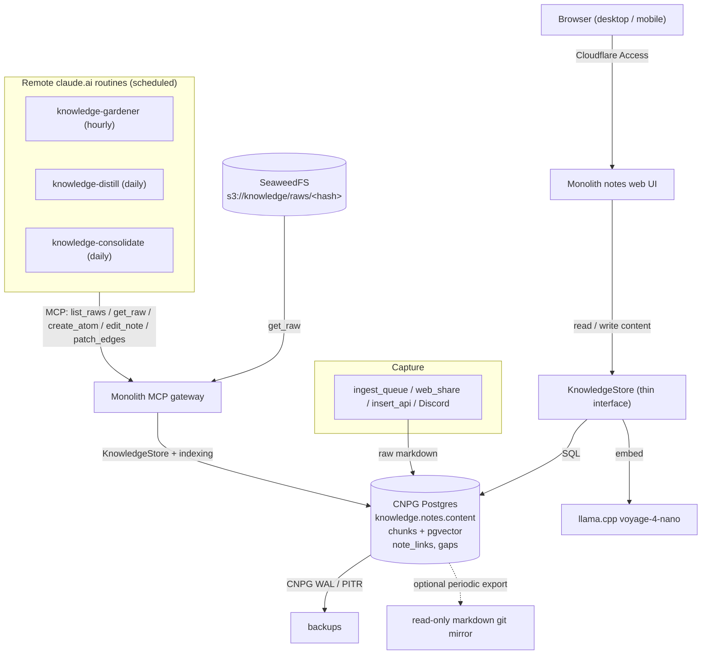

# ADR 006: Decommission Obsidian, Postgres as the Body of Record

**Author:** jomcgi
**Status:** Accepted
**Created:** 2026-06-12
**Accepted:** 2026-06-14
**Supersedes:** [001 — Obsidian Vault Migration into Monolith](001-obsidian-vault-monolith-migration.md)
**Supersedes (KG storage domain):** [004 — Iceberg-on-SeaweedFS Lakehouse](../../../projects/platform/ARCHITECTURE.md) (lakehouse withdrawn 2026-06-14, PR #2596)

---

## Update (2026-06-14): destination, not interim

This ADR was originally written as an interim ahead of the [ADR 004](../../../projects/platform/ARCHITECTURE.md) lakehouse. That lakehouse stack was decommissioned on 2026-06-14 (PR #2596; `projects/lakehouse` and the `temporal` / `warehouse-bucket` apps removed) and the event-sourced platform work moved to `loom`. CNPG Postgres (`knowledge.notes.content`) is therefore the **accepted destination** for note bodies, not a waypoint.

Two original constraints are dropped as a consequence:

- **Shape-compatibility with the lakehouse `note_events`/`gap_events` tables**: those tables no longer exist, so the Postgres schema is free to evolve on its own terms.
- **The "Eventual (ADR 004)" column** in the comparison table below is withdrawn.

The thin `KnowledgeStore` interface is retained, but on its own merits (testability, a clean read-path seam), not as a lakehouse hedge. The rest of this ADR stands as the accepted decision; the text below is lightly updated for the new framing.

---

## Problem

Obsidian is the last third-party editor the knowledge graph depends on. Concretely it costs us three things:

1. **A paid Obsidian Sync subscription** plus the `headless-sync` sidecar, which exists only to keep the in-cluster `/vault` POSIX filesystem mirrored to Obsidian cloud so Joe can edit on mobile/desktop.
2. **A filesystem-shaped data model.** The gardener runs a Claude Code subprocess that reads and writes `/vault/_processed/*.md` with Read/Write/Edit tools, and `knowledge.notes` stores only a `content_hash`. Processed note bodies (atoms, facts, active notes) therefore live **only on the vault disk**, not in Postgres. The emptyDir `/vault` plus the RWO history behind it is the reason the deployment is pinned single-replica with a `Recreate`-style strategy.
3. **A data egress to a third party.** Every note Joe writes flows through Obsidian's sync servers.

[ADR 004](../../../projects/platform/ARCHITECTURE.md) originally committed to decoupling Obsidian as part of an event-sourced lakehouse (Iceberg `note_events`/`gap_events`, Temporal workflows, Quack serving). That lakehouse was decommissioned on 2026-06-14 (PR #2596) before its serving cutover completed, so it is no longer the end-state. We want the subscription, the sidecar, and the third-party egress gone, with CNPG Postgres as the durable body-of-record.

---

## Decision

Make **Postgres the source of truth for note bodies** and **a monolith-served notes web app the editing surface**, then retire Obsidian. Specifically:

1. **Body in Postgres.** Add an authoritative `content` column to `knowledge.notes`. `get_note` stops reading the filesystem; the web app and MCP tools read and write `content` directly. One-shot backfill of existing `_processed/` bodies from disk (raws are already in `knowledge.raw_inputs`).
2. **Notes web UI.** A markdown read/write surface in the monolith (list, search, edit, wikilink and graph navigation reusing the existing search API and `layout_x/y`), reachable through Cloudflare Access exactly as the `homelab` CLI is today. This replaces the Obsidian app for both desktop and mobile (browser).
3. **Gardener as remote Claude routines over MCP, not an in-pod subprocess.** The gardener stops being a `claude` subprocess running inside the monolith pod against `/vault` files. It becomes a set of scheduled **claude.ai routines** (free under the Claude Max sub) that operate entirely through the monolith **MCP** surface and carry their guardrails in **Skills**. Three separate routines, each its own cadence and Skill: **knowledge-gardener** (hourly: decompose raws into atoms), **knowledge-distill** (daily: learnings from completed tasks), **knowledge-consolidate** (daily: task rollups). They use new knowledge MCP tools (`list_raws_needing_decomposition`, `get_raw`, `create_atom`, `patch_edges`, `record_provenance`) alongside the existing `search_knowledge` / `edit_note` / `list_tasks`, plus the agent `acquire_lock` / `notify` tools. Atom/fact/active schemas are enforced **server-side at the MCP tool boundary** (`create_atom` rejects a malformed atom), so guardrails hold even if a prompt slips, strictly stronger than the old prompt-only gardener. (Evolution: originally a per-run tmpdir [2026-06-13], then an in-pod `knowledge` Typer CLI [2026-06-14, shipped as 4a-i]; superseded 2026-06-16 because a _remote_ routine reaches the cluster only over the network, so MCP, not an in-pod CLI, is the correct interface. The CLI's validated `create-atom`/index logic moves into the MCP tools; `knowledge/cli.py` is retired.)
4. **Raws as ground truth in object storage.** The immutable, content-addressed raw captures live in SeaweedFS at `s3://knowledge/raws/<content_hash>.md` (a `raws/` prefix under the per-domain `knowledge` bucket; exported + byte-verified 2026-06-16). `raw_inputs` keeps metadata plus the content-hash key; the gardener reads a raw via the `get_raw` MCP tool. This keeps the hot Postgres lean (raws are the bulk of the bytes and are never query targets), mirroring the `chat.blobs` BYTEA -> SeaweedFS migration. Bucket provisioning is left ad-hoc for now (the pinned seaweedfs chart 4.0.0 ties `createBuckets` to the filer-embedded s3 we don't run, and COSI per [ADR 007](../../../projects/platform/ARCHITECTURE.md) is not worth a driver deploy for a retain-forever bucket; revisit `s3.createBuckets` at the next chart upgrade). Dropping the now-redundant `raw_inputs.content` column is sequenced last (Phase 4d) once `get_raw` reads from S3.
5. **Retire Obsidian plumbing.** Remove the `headless-sync` sidecar and the durable `/vault` volume, cancel the Obsidian Sync subscription, and switch the deploy to `RollingUpdate`. Capture paths that previously relied on Obsidian mobile (quick capture) move to the already-built `ingest_queue`, `web_share`, `insert_api`, and Discord-mirror paths, plus a capture box in the web UI.
6. **Backup.** Replace the git-push `knowledge.vault-backup` job with CNPG WAL/PITR (already configured) plus an optional periodic markdown export to a read-only git mirror, preserving a human-readable audit trail.

Postgres is the **destination** for note bodies, not an interim (the lakehouse this ADR originally preceded was withdrawn on 2026-06-14). Web-app data access still sits behind the thin `KnowledgeStore` interface, kept for testability and a clean read-path seam rather than as a hedge toward a future serving layer.

| Aspect                  | Today (Obsidian)                                     | Decided (Postgres, destination)                                   |
| ----------------------- | ---------------------------------------------------- | ----------------------------------------------------------------- |
| **Editing surface**     | Obsidian app + paid Sync                             | Monolith notes web UI (Cloudflare Access)                         |
| **Note body of record** | `/vault/_processed/*.md` on disk                     | `knowledge.notes.content` in Postgres                             |
| **Raw ground truth**    | `/vault/_raw/*.md` + `raw_inputs.content` (Postgres) | `s3://knowledge/raws/<content_hash>.md` (SeaweedFS)               |
| **Search**              | pgvector on `chunks`                                 | pgvector on `chunks` (unchanged)                                  |
| **Gardener**            | in-pod `claude` subprocess against durable `/vault`  | remote claude.ai routines over MCP (gardener/distill/consolidate) |
| **Sync sidecar**        | `headless-sync` (Obsidian Sync)                      | none                                                              |
| **Vault volume**        | durable emptyDir/PVC, single replica                 | none; `RollingUpdate`, N replicas                                 |
| **Backup**              | git push of `/vault`                                 | CNPG WAL + optional markdown git export                           |
| **Third-party egress**  | Obsidian cloud                                       | none                                                              |

---

## Architecture

The only components that change are the ones Obsidian touched: the editing surface (new web UI), the body-of-record (now `knowledge.notes.content`), the raw ground truth (now `s3://knowledge/raws`), and the gardener (now remote claude.ai routines over MCP, no in-pod subprocess or filesystem). Chunking, embedding, pgvector search, edges, gaps, graph layout, and the scheduler are unchanged.

---

## Alternatives Considered

- **Finish the lakehouse cutover first (ADR 004).** Rejected, and now moot: the lakehouse stack was decommissioned on 2026-06-14 (PR #2596) without ever completing its serving cutover. Postgres is the destination, not a stop on the way to a lakehouse.
- **TigerFS, keep Obsidian Sync (ADR 001).** Rejected: it preserves the Obsidian subscription, the sidecar, and the third-party egress, which is exactly what we want gone. This ADR supersedes 001.
- **DuckDB/lakehouse as the body-of-record now.** Rejected: introduces a full event-sourced stack ahead of need just to store note text. The lakehouse that would have provided it has since been withdrawn.
- **Swap Obsidian for another markdown app on a Postgres-backed sync.** Rejected: trades one third-party editor dependency for another instead of removing it.
- **MCP + CLI only, no GUI.** Rejected: too thin for daily note-taking and mobile capture.
- **Keep Obsidian.** Rejected: ongoing subscription, single-replica constraint, and disk-only note bodies.

---

## Security

Baseline per `docs/security.md`. Deviations and notes:

- **Web UI exposure** is via Cloudflare Access only, the same auth path as the `homelab` CLI and existing monolith routes. No new direct internet exposure.
- **Removing the `headless-sync` sidecar removes a third-party data egress**; note bodies stay inside cluster Postgres.
- `runAsNonRoot`, `DROP ALL`, uid 65532, and 1Password-managed secrets are unchanged. Dropping the durable vault volume removes the RWO constraint that forced single-replica.

---

## Risks

| Risk                                                 | Likelihood | Impact | Mitigation                                                                                                                                                                                         |
| ---------------------------------------------------- | ---------- | ------ | -------------------------------------------------------------------------------------------------------------------------------------------------------------------------------------------------- |
| Web UI is real net-new work                          | High       | Medium | Reuse the existing `/private/notes` graph + search API; ship editor + capture incrementally (plan Phase 5)                                                                                         |
| Gardener atom writes are malformed or lose data      | Medium     | High   | The `create-atom`/`edit` CLI validates the schema and goes through the shared `knowledge.indexing` upsert (atomic, committed); raws stay immutable in object storage so any atom can be re-derived |
| Loss of Obsidian mobile capture ergonomics           | Medium     | Medium | Web UI capture box plus existing `ingest_queue`/`web_share`/Discord paths; validate before cutting Sync                                                                                            |
| Processed-note body backfill from disk is incomplete | Low        | High   | One-shot reconcile diffs `content_hash` against disk; run before removing the vault volume                                                                                                         |
| pgvector load grows on the shared CNPG cluster       | Low        | Medium | Unchanged from today; monitor via SigNoz, bump CNPG resources if needed                                                                                                                            |

---

## Open Questions

1. Does the v1 web UI need full wikilink graph navigation, or can graph view ship after the editor and search?
2. Markdown git-export cadence (and whether CNPG WAL alone is sufficient, making the export optional).

---

## References

| Resource                                                                                  | Relevance                                                      |
| ----------------------------------------------------------------------------------------- | -------------------------------------------------------------- |
| [001 — Obsidian Vault Migration into Monolith](001-obsidian-vault-monolith-migration.md)  | Superseded: it kept Obsidian Sync via TigerFS                  |
| [004 — Iceberg-on-SeaweedFS Lakehouse](../../../projects/platform/ARCHITECTURE.md)                 | Superseded (KG storage domain); lakehouse withdrawn 2026-06-14 |
| [007 — SeaweedFS bucket provisioning via COSI](../../../projects/platform/ARCHITECTURE.md) | How the `knowledge-raws` bucket is provisioned (Phase 4b)      |
| `projects/monolith/knowledge/`                                                            | Gardener, store, router, MCP tools, and the `knowledge` CLI    |
| `projects/monolith/chart/migrations/20260408000000_knowledge_schema.sql`                  | `knowledge.notes` schema gaining a `content` column            |
| `projects/monolith/chart/templates/cnpg-cluster.yaml`                                     | CNPG cluster + pgvector hosting the body of record             |
