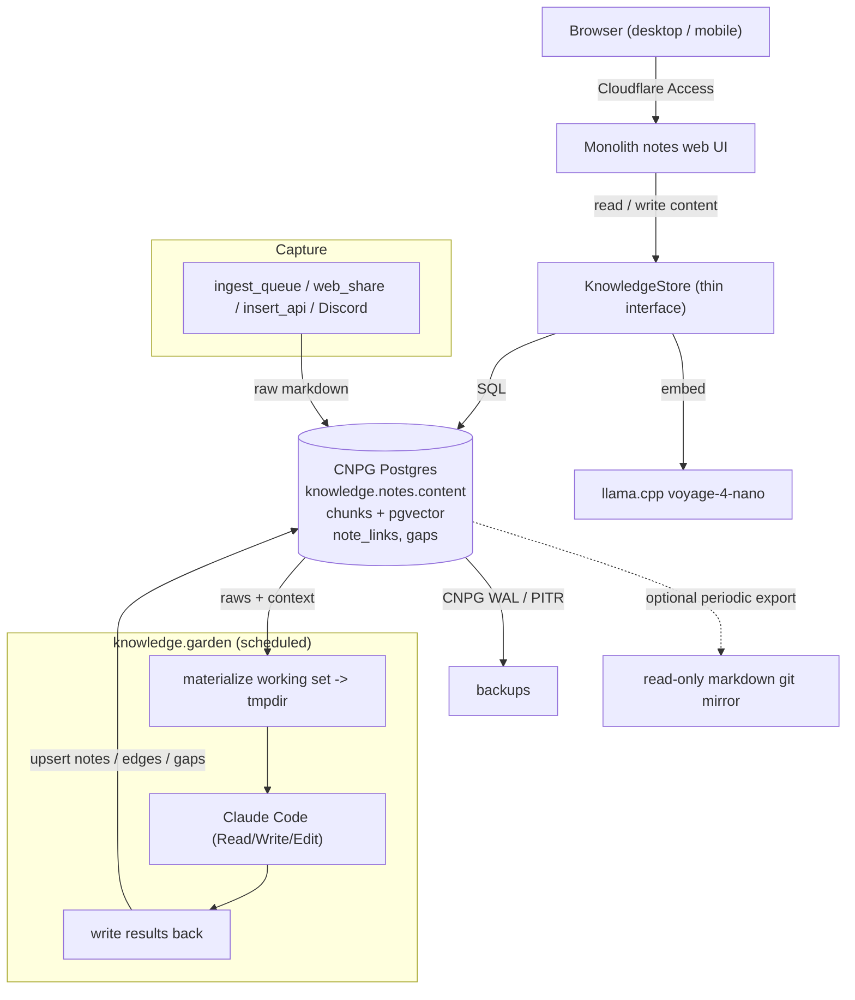

# ADR 006: Decommission Obsidian via a Postgres Interim

**Author:** jomcgi
**Status:** Draft
**Created:** 2026-06-12
**Supersedes:** [001 — Obsidian Vault Migration into Monolith](001-obsidian-vault-monolith-migration.md)
**Interim ahead of:** [004 — Iceberg-on-SeaweedFS Lakehouse](004-iceberg-lakehouse-hot-swap.md)

---

## Problem

Obsidian is the last third-party editor the knowledge graph depends on. Concretely it costs us three things:

1. **A paid Obsidian Sync subscription** plus the `headless-sync` sidecar, which exists only to keep the in-cluster `/vault` POSIX filesystem mirrored to Obsidian cloud so Joe can edit on mobile/desktop.
2. **A filesystem-shaped data model.** The gardener runs a Claude Code subprocess that reads and writes `/vault/_processed/*.md` with Read/Write/Edit tools, and `knowledge.notes` stores only a `content_hash`. Processed note bodies (atoms, facts, active notes) therefore live **only on the vault disk**, not in Postgres. The emptyDir `/vault` plus the RWO history behind it is the reason the deployment is pinned single-replica with a `Recreate`-style strategy.
3. **A data egress to a third party.** Every note Joe writes flows through Obsidian's sync servers.

[ADR 004](004-iceberg-lakehouse-hot-swap.md) (Accepted) already commits to decoupling Obsidian as part of the event-sourced lakehouse, and `projects/lakehouse/` is substantially built toward that end (Iceberg `note_events`/`gap_events` tables, backfill and serving-build Temporal workflows, Quack serving). But that cutover is a large, multi-substrate effort (NATS, Temporal, Iceberg, DuckDB/Quack) that is not finished. We do not want Obsidian's death blocked on the full event-sourced serving cutover. We want the subscription, the sidecar, and the third-party egress gone now, with a model that does not contradict the eventual lakehouse end-state.

---

## Decision

Make **Postgres the source of truth for note bodies** and **a monolith-served notes web app the editing surface**, then retire Obsidian. Specifically:

1. **Body in Postgres.** Add an authoritative `content` column to `knowledge.notes`. `get_note` stops reading the filesystem; the web app and MCP tools read and write `content` directly. One-shot backfill of existing `_processed/` bodies from disk (raws are already in `knowledge.raw_inputs`).
2. **Notes web UI.** A markdown read/write surface in the monolith (list, search, edit, wikilink and graph navigation reusing the existing search API and `layout_x/y`), reachable through Cloudflare Access exactly as the `homelab` CLI is today. This replaces the Obsidian app for both desktop and mobile (browser).
3. **Gardener without a vault filesystem.** The gardener keeps its Claude-Code-with-files ergonomics by materializing only its working set into a per-run temp directory from Postgres, letting the subprocess edit files there, and writing results back to `knowledge.notes`. The vault stops being a durable, externally-mutated filesystem.
4. **Retire Obsidian plumbing.** Remove the `headless-sync` sidecar and the durable `/vault` volume, cancel the Obsidian Sync subscription, and switch the deploy to `RollingUpdate`. Capture paths that previously relied on Obsidian mobile (quick capture) move to the already-built `ingest_queue`, `web_share`, `insert_api`, and Discord-mirror paths, plus a capture box in the web UI.
5. **Backup.** Replace the git-push `knowledge.vault-backup` job with CNPG WAL/PITR (already configured) plus an optional periodic markdown export to a read-only git mirror, preserving a human-readable audit trail.

This is explicitly an **interim**. ADR 004 remains the target end-state for the serving and storage layer. To keep the later lakehouse cutover a matter of re-pointing the read path rather than redoing the model, the interim's note and gap representation stays shape-compatible with the lakehouse `note_events`/`gap_events` tables, and web-app data access sits behind a thin store interface so it can later target Quack/DuckDB instead of Postgres.

| Aspect                  | Today (Obsidian)                                  | Decided (Postgres interim)                                       | Eventual (ADR 004)                          |
| ----------------------- | ------------------------------------------------- | --------------------------------------------------------------- | ------------------------------------------- |
| **Editing surface**     | Obsidian app + paid Sync                          | Monolith notes web UI (Cloudflare Access)                        | Web UI on Quack read path                   |
| **Note body of record** | `/vault/_processed/*.md` on disk                  | `knowledge.notes.content` in Postgres                           | Iceberg `note_events` (NATS source of truth)|
| **Search**              | pgvector on `chunks`                              | pgvector on `chunks` (unchanged)                                | DuckDB+VSS in Quack artifact                |
| **Gardener I/O**        | Claude Code against durable `/vault`              | Claude Code against per-run tmpdir, results to Postgres         | Workflows publishing `events.knowledge.*`   |
| **Sync sidecar**        | `headless-sync` (Obsidian Sync)                   | none                                                             | none (optional NATS->markdown consumer)     |
| **Vault volume**        | durable emptyDir/PVC, single replica              | none; `RollingUpdate`, N replicas                               | none                                        |
| **Backup**              | git push of `/vault`                              | CNPG WAL + optional markdown git export                         | rclone Iceberg warehouse + Temporal PG dump |
| **Third-party egress**  | Obsidian cloud                                    | none                                                            | none                                        |

---

## Architecture

The only components that change are the ones Obsidian touched: the editing surface (new web UI), the body-of-record (now `knowledge.notes.content`), and the gardener's file I/O (now a per-run tmpdir). Chunking, embedding, pgvector search, edges, gaps, graph layout, and the scheduler are unchanged.

---

## Alternatives Considered

- **Finish the lakehouse cutover first (ADR 004).** Rejected for *now*: it blocks Obsidian's death on the full NATS/Temporal/Iceberg/Quack serving cutover. This ADR is the interim; 004 remains the destination.
- **TigerFS, keep Obsidian Sync (ADR 001).** Rejected: it preserves the Obsidian subscription, the sidecar, and the third-party egress, which is exactly what we want gone. This ADR supersedes 001.
- **DuckDB/lakehouse as the body-of-record now.** Deferred to ADR 004: introduces the full event-sourced stack ahead of need just to store note text.
- **Swap Obsidian for another markdown app on a Postgres-backed sync.** Rejected: trades one third-party editor dependency for another instead of removing it.
- **MCP + CLI only, no GUI.** Rejected: too thin for daily note-taking and mobile capture.
- **Keep Obsidian.** Rejected: ongoing subscription, single-replica constraint, and disk-only note bodies.

---

## Security

Baseline per `docs/security.md`. Deviations and notes:

- **Web UI exposure** is via Cloudflare Access only, the same auth path as the `homelab` CLI and existing monolith routes. No new direct internet exposure.
- **Removing the `headless-sync` sidecar removes a third-party data egress**; note bodies stay inside cluster Postgres.
- `runAsNonRoot`, `DROP ALL`, uid 65532, and 1Password-managed secrets are unchanged. Dropping the durable vault volume removes the RWO constraint that forced single-replica.

---

## Risks

| Risk                                                            | Likelihood | Impact | Mitigation                                                                                                   |
| -------------------------------------------------------------- | ---------- | ------ | ----------------------------------------------------------------------------------------------------------- |
| Web UI is real net-new work, partly redone when ADR 004 lands  | High       | Medium | Keep data access behind a thin store interface so the read path re-points at Quack rather than being rewritten |
| Gardener tmpdir materialization loses or mis-writes notes      | Medium     | High   | Write-back is an explicit upsert keyed on `note_id` + `content_hash`; keep a markdown git export as recovery |
| Loss of Obsidian mobile capture ergonomics                     | Medium     | Medium | Web UI capture box plus existing `ingest_queue`/`web_share`/Discord paths; validate before cutting Sync      |
| Processed-note body backfill from disk is incomplete           | Low        | High   | One-shot reconcile diffs `content_hash` against disk; run before removing the vault volume                   |
| Interim model drifts from lakehouse `note_events` shape        | Medium     | Medium | Mirror the `note_events`/`gap_events` field shape now so the 004 backfill stays a re-point, not a remodel    |
| pgvector load grows on the shared CNPG cluster                  | Low        | Medium | Unchanged from today; monitor via SigNoz, bump CNPG resources if needed                                      |

---

## Open Questions

1. Does the v1 web UI need full wikilink graph navigation, or can graph view ship after the editor and search?
2. Markdown git-export cadence (and whether CNPG WAL alone is sufficient, making the export optional).
3. How much of the lakehouse `note_events` schema to mirror in `knowledge.notes` now versus at the 004 cutover.

---

## References

| Resource                                                                                   | Relevance                                                      |
| ------------------------------------------------------------------------------------------ | -------------------------------------------------------------- |
| [001 — Obsidian Vault Migration into Monolith](001-obsidian-vault-monolith-migration.md)   | Superseded: it kept Obsidian Sync via TigerFS                  |
| [004 — Iceberg-on-SeaweedFS Lakehouse](004-iceberg-lakehouse-hot-swap.md)                  | The end-state this interim precedes; model kept compatible     |
| [agents/016 — NATS canonical event stream](../agents/016-nats-canonical-event-stream.md)   | `events.knowledge.*` shape the interim stays compatible with   |
| `projects/lakehouse/iceberg/tables/note_events.py`                                          | Note-event field shape to mirror in the interim                |
| `projects/monolith/knowledge/`                                                             | Gardener, store, router, MCP tools being adapted               |
| `projects/monolith/chart/migrations/20260408000000_knowledge_schema.sql`                   | `knowledge.notes` schema gaining a `content` column            |
| `projects/monolith/chart/templates/cnpg-cluster.yaml`                                       | CNPG cluster + pgvector hosting the interim of record          |
