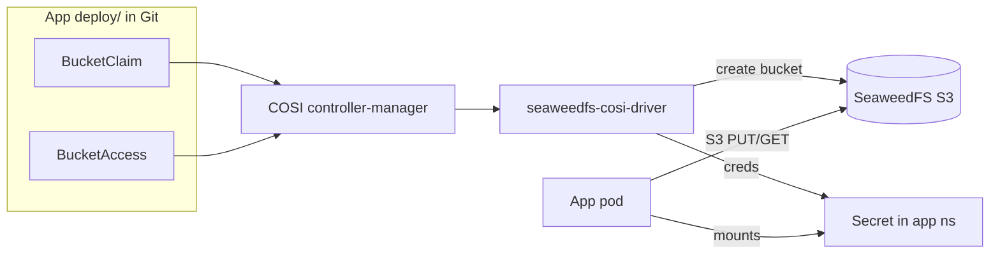

# ADR 007: Declarative SeaweedFS bucket provisioning via COSI

**Author:** Joe McGinley
**Status:** Accepted
**Created:** 2026-06-14
**Relates to:** [004-iceberg-lakehouse-hot-swap](004-iceberg-lakehouse-hot-swap.md) (decommissioned 2026-06-14)

---

## Problem

SeaweedFS buckets are currently created by imperative, create-only Kubernetes Jobs that drive the master via `weed shell` (the `warehouse-bucket` unit was the canonical example). This pattern has three structural gaps:

1. **No teardown.** Deleting the consuming app (its ArgoCD Application) never removes its bucket or the objects inside it. ArgoCD prunes Kubernetes resources, not S3 object contents.
2. **No lifecycle.** Object expiry (TTL) was a _separate_ Job (`warehouse-lifecycle`), wired up independently of bucket creation.
3. **No per-app credentials.** Every consumer shares the same dummy `duckdb`/`duckdb` creds because cluster-wide SeaweedFS auth is disabled.

These gaps are not theoretical. When the Iceberg lakehouse (ADR 004) was decommissioned on 2026-06-14, its `warehouse` bucket was found to hold **~34 GB of never-expired serving artifacts**: 1,315 near-identical `.duckdb` snapshots that `BuildServingArtifactWorkflow` rebuilt every ~15 minutes. The `warehouse-lifecycle` expiry Job that should have reaped them had never been added to any kustomization, so it silently never ran, and nothing alerts on object-storage growth. The bucket had to be deleted by hand with `weed shell` after the apps were gone.

The homelab is about to add more buckets (`chat` attachment blobs already, plus future `notes`/`monolith` stores, and `../loom` will have the same need). Repeating the create-only-Job pattern guarantees more orphaned storage.

---

## Decision

Adopt the **Container Object Storage Interface (COSI)** with the official `seaweedfs-cosi-driver` as the standard mechanism for provisioning SeaweedFS buckets. Each consuming app declares a `BucketClaim` (and, where it needs credentials, a `BucketAccess`) in its own `deploy/` directory; ArgoCD applies it like any other manifest, and the COSI driver provisions the bucket and writes credentials into a Secret. Bucket lifecycle is governed declaratively by the `BucketClass` `deletionPolicy`, exactly as a `StorageClass` `reclaimPolicy` governs a PVC.

The imperative `weed shell` Job pattern is retired for new buckets. Existing buckets (`stars`, `trips`, `chat`) are migrated to `BucketClaim`s opportunistically; this ADR does not block on backfilling them.

| Aspect                   | Today (imperative Job)         | Decided (COSI)                               |
| ------------------------ | ------------------------------ | -------------------------------------------- |
| Creation                 | `weed shell` Job per bucket    | `BucketClaim` CR in the app's `deploy/`      |
| Teardown on decommission | None (manual `weed shell`)     | `deletionPolicy: Delete` reclaims the bucket |
| Credentials              | Shared dummy `duckdb`/`duckdb` | Per-app via `BucketAccess` -> Secret         |
| Object TTL/expiry        | Separate, easily-orphaned Job  | S3 lifecycle config alongside the claim      |
| GitOps ownership         | Partial (creation only)        | Full (lifecycle end-to-end)                  |

`deletionPolicy` is chosen per bucket by data semantics: **`Retain`** for primary/user data that must outlive the app (e.g. `chat` attachment blobs are content-addressed permanent references), **`Delete`** for derived/rebuildable data (e.g. a future lakehouse-style serving store) so decommissioning reclaims it automatically. Object TTL is applied only to buckets that accumulate; content-addressed blob buckets get none.

---

## Architecture

A `BucketClass` (cluster-scoped) names the driver and the `deletionPolicy`; a `BucketAccessClass` names the driver and auth type. Apps reference these classes from their namespaced `BucketClaim`/`BucketAccess`. Deleting the `BucketClaim` (e.g. when its app's Application is pruned) triggers the driver to delete or retain the bucket per the class policy, closing the loop that the 34 GB orphan fell through.

---

## Alternatives Considered

- **Keep the imperative `weed shell` Job pattern.** Rejected: it is the status quo that produced the 34 GB orphan; create-only with no teardown or per-app creds.
- **Code self-ensures the bucket (boto3 `create_bucket` on first write).** Used as an interim for the `chat` bucket. Rejected as the standard: still no teardown, no declarative state, invisible to GitOps, and scatters provisioning logic across every app.
- **Crossplane with a generic S3 provider pointed at SeaweedFS.** Rejected: heavyweight to introduce solely for buckets, and provider-aws S3 against SeaweedFS hits S3-API-compatibility gaps. Revisit only if we adopt Crossplane for other reasons.

---

## Security

Baseline per `docs/security.md`. Cluster-wide SeaweedFS S3 auth is currently **disabled** (the `s3AccessKeyId: duckdb` dummy creds only satisfy boto3's "value required" check). COSI `BucketAccess` provisions per-app credentials into a Secret, which is the prerequisite for eventually enabling SeaweedFS auth and giving each app least-privilege access to only its bucket. This ADR does not enable auth on its own; it makes per-app creds the default so enabling auth later is incremental rather than a flag day.

---

## Risks

| Risk                                                                                            | Likelihood | Impact | Mitigation                                                                                                                            |
| ----------------------------------------------------------------------------------------------- | ---------- | ------ | ------------------------------------------------------------------------------------------------------------------------------------- |
| COSI is still a k8s-sig project (beta APIs)                                                     | Medium     | Medium | Pin the API version; the blast radius is bucket provisioning, not data-path; existing buckets keep working unmanaged during migration |
| `seaweedfs-cosi-driver` is community-maintained                                                 | Medium     | Medium | Vet on a non-critical bucket (`chat`) first before migrating `stars`/`trips`; keep the manual `weed shell` recovery documented        |
| SeaweedFS S3 lifecycle/TTL has rough edges (creation-vs-modification-time semantics, open bugs) | Medium     | Low    | Only rely on TTL for accumulating buckets; test expiry behavior before depending on it; content-addressed buckets need no TTL         |
| `deletionPolicy: Delete` deletes a bucket whose data was actually wanted                        | Low        | High   | Default to `Retain` for anything primary/user-facing; reserve `Delete` for explicitly derived/rebuildable stores                      |

---

## Open Questions

1. Maturity vetting of `seaweedfs-cosi-driver` against this SeaweedFS version before it becomes load-bearing for `stars`/`trips`.
2. Whether and when to enable cluster-wide SeaweedFS S3 auth now that per-app creds become available.
3. Migration order for the existing imperatively-created buckets (`stars`, `trips`, `chat`).

---

## References

| Resource                                                                              | Relevance                                                            |
| ------------------------------------------------------------------------------------- | -------------------------------------------------------------------- |
| [seaweedfs/seaweedfs-cosi-driver](https://github.com/seaweedfs/seaweedfs-cosi-driver) | The driver this ADR adopts (official, Apache-2.0)                    |
| [COSI (k8s SIG)](https://container-object-storage-interface.sigs.k8s.io/)             | The standard: BucketClaim/Bucket/BucketAccess CRDs                   |
| [ADR 004](004-iceberg-lakehouse-hot-swap.md)                                          | The decommissioned lakehouse whose `warehouse` bucket orphaned 34 GB |
