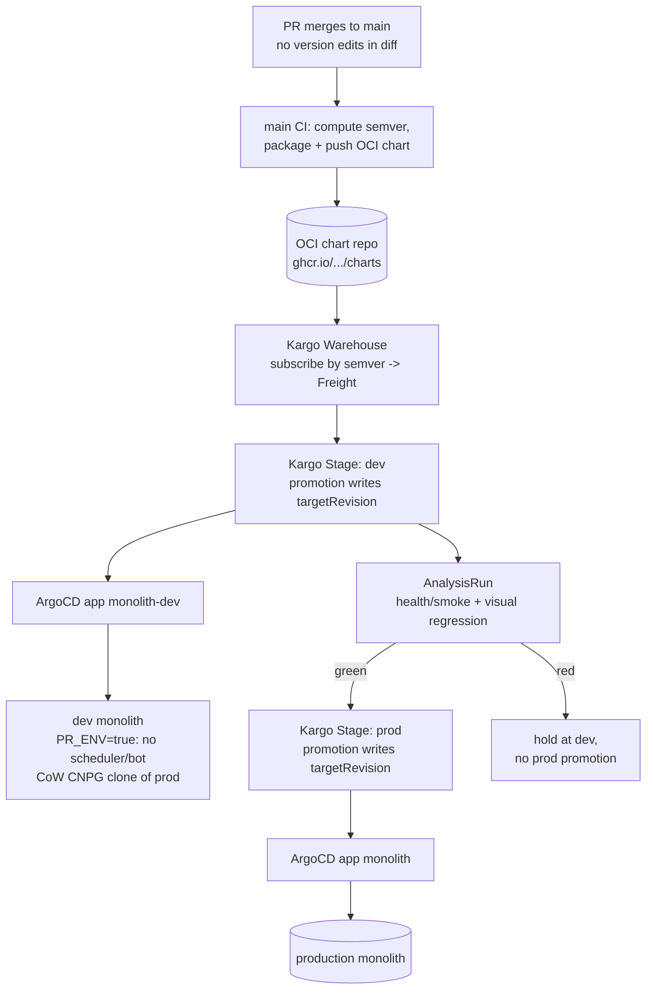

# ADR 009: Post-Merge Chart Versioning and Kargo Promotion Pipeline

**Author:** Joe McGinley
**Status:** Draft
**Created:** 2026-06-20
**Relates to:** [ADR 005: Per-PR Preview Environments for the Monolith](005-per-pr-preview-environments.md), [Networking ADR 002: Path-Based Ingress Tiers](../networking/002-path-based-ingress-tiers.md)

---

## Problem

Two problems, separable, both rooted in how a change becomes a deployed release.

**1. Chart version bumps conflict.** Today `bazel/helm/push.sh.tpl` bumps the chart version on the PR branch: during PR CI, `chart-version-bot` computes the next semver from conventional commits, writes `chart/Chart.yaml` `version:` and `deploy/application.yaml` `targetRevision:`, and commits that back to the branch. A monotonic counter is being incremented on parallel branches, so any two concurrent PRs touching the same chart collide in one of two ways:

- **Duplicate version (out of sync):** both PRs branch from `0.182.3`, both compute `0.182.4`. Whoever merges second publishes a colliding version that was already pushed to OCI.
- **Rebase conflict:** both branches edited the same `version:` / `targetRevision:` line, so the second PR conflicts on rebase and needs manual resolution.

This is structural, not a bot tuning issue. The only conflict-free place to increment a serial counter is the serial timeline itself: `main`.

**2. No pre-prod validation gate.** A merge to `main` rolls straight to production via ArgoCD. There is no environment where a change is exercised against a real cluster, database, and ingress before it reaches prod. Now that nearly everything (KG, trips, ships, stars, dr-jobs, the public tier) runs inside one monolith, the blast radius of a bad merge is the whole estate, and the appetite for a validation step before promotion has grown.

The current design couples these: because the deployed version is written on the branch, the PR is simultaneously the unit of code review, the unit of versioning, and the unit of deploy. Decoupling versioning and promotion from the branch fixes (1) and creates the seam where (2) can live.

---

## Decision

Separate versioning from promotion, and make `main` (not the PR branch) the single serial writer of every version string.

### 1. The version becomes an output of merging, not an input on the branch

PRs stop touching `chart/Chart.yaml` `version:` and `deploy/application.yaml` `targetRevision:` entirely. The chart version is computed and applied **after** merge, on `main`, where commits are serialized: CI computes the next semver from conventional commits, packages the chart at that version, and publishes it to the OCI registry. Because only `main` HEAD is ever advanced (and a publish reads the live HEAD value), there is no second writer and no collision. PR CI keeps building and pushing the ephemeral `0.0.0-dev.<ts>.g<sha>` chart it already produces, so per-PR image/chart verification loses nothing.

### 2. Kargo owns promotion and every `targetRevision` write

Adopt [Kargo](https://kargo.akuity.io/) as a post-merge promotion controller. A **Warehouse** subscribes to the monolith chart repo in OCI and discovers new **Freight** (a resolved set of artifact versions) by semver. **Stages** (`dev` then `prod`) receive Freight via **Promotions**, whose steps clone the repo, write the stage's `targetRevision`, commit, push, and trigger the ArgoCD sync. Kargo is therefore the **only** writer of any `targetRevision`, serialized by the controller, which removes the deploy-side half of the conflict problem for good. Promotion from `dev` to `prod` is **gated on Argo Rollouts `AnalysisRun`s** (synthetic checks: health/smoke probes plus the visual-regression suite already in flight on `feat/public-visual-regression`). Green promotes; red holds at `dev`.

### 3. The `dev` stage reuses ADR 005's data plane

The expensive part of a `dev` stage is giving it something realistic to test against without touching prod data or duplicating side effects. That mechanism is already designed in [ADR 005](005-per-pr-preview-environments.md): a copy-on-write CNPG clone of prod plus a single `PR_ENV=true` flag that mutes the scheduler loop and the Discord bot. The `dev` stage is a **standing** (not per-PR ephemeral) instance built from the same two primitives, behind Cloudflare Access. This means Kargo does not introduce a new data-plane problem; it consumes one ADR 005 already solved on paper.

| Aspect                                       | Today                                             | Decided                                                 |
| -------------------------------------------- | ------------------------------------------------- | ------------------------------------------------------- |
| Where the version is set                     | On the PR branch, by `chart-version-bot` in PR CI | On `main`, post-merge, as a publish output              |
| `Chart.yaml` / `targetRevision` in a PR diff | Yes (and conflicts)                               | No (PRs never touch them)                               |
| Concurrent-PR collisions                     | Duplicate versions and rebase conflicts           | Impossible (single serial writer)                       |
| Who writes `targetRevision`                  | `chart-version-bot` on the branch                 | Kargo, per stage, serialized                            |
| Path to prod                                 | Merge to `main` → ArgoCD syncs prod directly      | Merge → publish → Kargo `dev` → verify → promote `prod` |
| Pre-prod validation                          | None                                              | Synthetic `AnalysisRun`s gate `dev`→`prod`              |

---

## Architecture

---

## Alternatives Considered

- **Post-merge bump only, no Kargo.** The minimal fix for Problem 1: move the bump to `main`, keep ArgoCD syncing prod directly. Fully solves the conflicts with zero new infrastructure and is the industry-standard shape (semantic-release, release-please). Rejected as the _complete_ answer because it does nothing for Problem 2, but **adopted as the first increment** and as the fallback if the `dev` stage proves too costly: it is a strict prerequisite of the Kargo design above, not a competing one.
- **Keep the branch-side bump, serialize with a GitHub merge queue.** A merge queue rebases and tests PRs one at a time, so versions would no longer collide. Rejected: it still writes the version on a branch (now the queue's ephemeral branch), adds queue latency to every merge, and delivers no validation environment. It treats the symptom (concurrency) rather than the cause (version-as-branch-input).
- **Floating `targetRevision` (digest or `*` range).** Let ArgoCD track the newest chart automatically, removing the pinned string entirely. Rejected: loses the auditable, git-recorded "what is deployed" pin this repo deliberately keeps, and removes the natural gate point a staged promotion needs.
- **ArgoCD Image Updater.** Already rejected repo-wide (see CLAUDE.md): the operative path is build-time-pinned tags plus chart-version bumps, not Image Updater. Kargo is the promotion-layer successor to that idea, not a return to it.
- **Kargo as a prod-only promotion engine (no `dev` stage).** Run Kargo with a single `prod` stage purely to own the `targetRevision` write. Viable, and it would fix the conflicts, but it adds a controller and CRDs while delivering no more validation than the post-merge-bump alternative. Rejected as a destination (it pays for Kargo without using what Kargo is for) while remaining a sensible intermediate step on the way to the `dev` stage.

---

## Security

Follows the baseline in `docs/security.md`.

- **`dev` data isolation.** The `dev` stage inherits ADR 005's guarantees: a copy-on-write clone means it physically cannot write back to production blocks, and `PR_ENV=true` means it holds no Discord connection and runs no scheduler, so it emits no duplicate outbound actions.
- **`dev` exposure.** The `dev` origin sits behind a Cloudflare Access policy (trusted tier), never public, reachable by Joe and by CI/Claude via an Access service token, exactly as ADR 005 specifies for previews.
- **Kargo's git write credential.** Kargo needs a token to commit `targetRevision` changes. Scope it to this repo, store it as a `OnePasswordItem`-sourced secret (never hardcoded), and confine its writes to the deploy app files. This is a new write-capable credential in the cluster and is the main new surface.
- **Promotion authority.** Auto-promotion to `prod` is driven by `AnalysisRun` verdicts. A compromised or buggy analysis template could green-light a bad release; treat the templates as production code (reviewed, version-controlled) and keep a manual-approval option on the `prod` stage as a backstop.

---

## Risks

| Risk                                                                            | Likelihood | Impact | Mitigation                                                                                                                                                                    |
| ------------------------------------------------------------------------------- | ---------- | ------ | ----------------------------------------------------------------------------------------------------------------------------------------------------------------------------- |
| Standing `dev` monolith + CNPG clone exhausts node memory (node-2 already ~92%) | High       | High   | Start the `dev` stage on `monolith-public` (read-only tier, no write data plane) before the full monolith; cap the clone at `instances: 1`; size `dev` minimally              |
| Post-merge bump races two near-simultaneous `main` merges                       | Low        | Medium | The bump step does `git pull --rebase` + retry before committing; it is the only writer of that line, so a retry always converges                                             |
| Kargo controller/CRDs add platform maintenance burden                           | Medium     | Medium | Pin a known-good Kargo release via its upstream chart (no custom chart); treat as platform infra under ArgoCD like Linkerd/SigNoz                                             |
| Synthetic checks are too weak and green-light a bad prod release                | Medium     | High   | Begin with health/smoke + visual regression already being built; expand coverage over time; keep manual approval available on `prod`                                          |
| `dev` clone drifts stale vs prod schema/data                                    | Medium     | Low    | Clone is a point-in-time fork refreshed on promotion; forward-only Atlas migrations apply cleanly on the clone (per ADR 005 open question 3)                                  |
| Version computation loses its source of truth once not committed per PR         | Low        | Medium | Compute from conventional commits over the chart's Bazel dep closure as today (`chart-version.sh`), reading the live `main` `Chart.yaml`, which is still committed post-merge |
| Adopting Kargo without finishing ADR 005 leaves the `dev` data plane unbuilt    | Medium     | High   | The post-merge-bump increment ships independently; the Kargo `dev` stage is gated on ADR 005's PR_ENV + CoW-clone primitives existing                                         |

---

## Open Questions

1. **Does `Chart.yaml` `version:` still get committed to `main`, or only emitted as the OCI tag?** Committing it keeps `chart-version.sh`'s "last version commit" heuristic working unchanged and keeps git as the audit record. Not committing it removes the last git write entirely but needs a new version source (latest OCI tag or git tag). Leaning toward still committing on `main` (serial, conflict-free) for the first cut.
2. **One Kargo Warehouse/project per service, or one shared?** `monolith` and `monolith-public` are the two active charts; a shared project is simpler but couples their Freight timelines.
3. **`dev` stage scope for v1: `monolith-public` only, or the full monolith?** `monolith-public` is the cheaper, lower-risk first stage (no write data plane to reproduce) and exercises the public surface the visual-regression suite already targets.
4. **Auto-promote to `prod`, or require manual approval after green `dev`?** Auto is the full payoff; manual-with-green-required is the safer starting posture.
5. **Refresh cadence of the `dev` CoW clone:** on every promotion (freshest, more snapshot churn) versus on a schedule.

---

## References

| Resource                                                                                            | Relevance                                                                            |
| --------------------------------------------------------------------------------------------------- | ------------------------------------------------------------------------------------ |
| [ADR 005: Per-PR Preview Environments](005-per-pr-preview-environments.md)                          | Source of the CoW CNPG clone + `PR_ENV` muting the `dev` stage reuses                |
| [Kargo documentation](https://kargo.akuity.io/)                                                     | Warehouse/Stage/Freight/Promotion model and OCI semver subscription                  |
| [Kargo: Promotion Steps](https://kargo.akuity.io/references/promotion-steps/)                       | `git-clone` / write / `git-commit` / `argocd-update` steps that own `targetRevision` |
| [Argo Rollouts AnalysisTemplate](https://argo-rollouts.readthedocs.io/en/stable/features/analysis/) | Synthetic verification mechanism gating `dev`->`prod`                                |
| [`bazel/helm/push.sh.tpl`](../../../bazel/helm/push.sh.tpl)                                         | Current branch-side bump logic this ADR moves post-merge                             |
| [`bazel/helm/chart-version.sh`](../../../bazel/helm/chart-version.sh)                               | Conventional-commit semver computation, reused on `main`                             |
| Conventional release tooling (semantic-release, release-please)                                     | Prior art for default-branch, post-merge version bumps                               |
