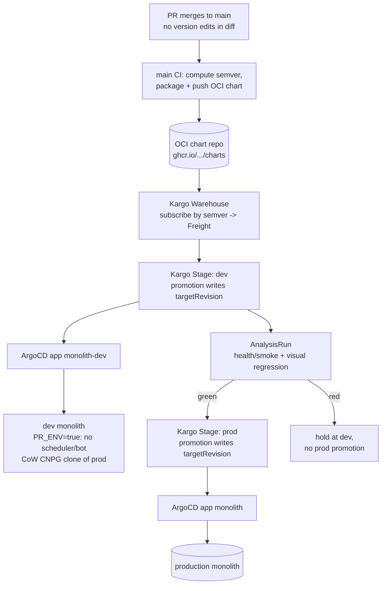

# ADR 009: Post-Merge Chart Versioning and Kargo Promotion Pipeline

**Author:** Joe McGinley
**Status:** Accepted (decisions 1 and 2); Kargo promotion (decisions 3 and 4) remains Draft
**Created:** 2026-06-20
**Revised:** 2026-08-09 (decision 1 accepted with a CI write-back writer instead of Kargo; adopting GitHub's native merge queue added as the forcing driver; the main-branch publish race named and closed)
**Relates to:** [ADR 005: Per-PR Preview Environments for the Monolith](005-per-pr-preview-environments.md), [Networking ADR 002: Path-Based Ingress Tiers](../networking/002-path-based-ingress-tiers.md)

---

## Problem

Four problems, separable, all rooted in how a change becomes a deployed release. The first two are the original 2026-06-20 framing; the last two were added on 2026-08-09 when adopting GitHub's native merge queue forced the question.

**1. Chart version bumps conflict.** Today `bazel/helm/push.sh.tpl` bumps the chart version on the PR branch: during PR CI, `chart-version-bot` computes the next semver from conventional commits, writes `chart/Chart.yaml` `version:` and `deploy/application.yaml` `targetRevision:`, and commits that back to the branch. A monotonic counter is being incremented on parallel branches, so any two concurrent PRs touching the same chart collide in one of two ways:

- **Duplicate version (out of sync):** both PRs branch from `0.182.3`, both compute `0.182.4`. Whoever merges second publishes a colliding version that was already pushed to OCI.
- **Rebase conflict:** both branches edited the same `version:` / `targetRevision:` line, so the second PR conflicts on rebase and needs manual resolution.

This is structural, not a bot tuning issue. The only conflict-free place to increment a serial counter is the serial timeline itself: `main`.

**2. No pre-prod validation gate.** A merge to `main` rolls straight to production via ArgoCD. There is no environment where a change is exercised against a real cluster, database, and ingress before it reaches prod. Now that nearly everything (KG, trips, ships, stars, dr-jobs, the public tier) runs inside one monolith, the blast radius of a bad merge is the whole estate, and the appetite for a validation step before promotion has grown.

The current design couples these: because the deployed version is written on the branch, the PR is simultaneously the unit of code review, the unit of versioning, and the unit of deploy. Decoupling versioning and promotion from the branch fixes (1) and creates the seam where (2) can live.

**3. Branch-side bumps block the merge queue (added 2026-08-09).** Problem 1 was a nuisance while merges were serialised by the strict "branch must be up to date with main" rule. Adopting GitHub's native merge queue turns it into a blocker. A merge group combines several PRs against the latest base, and two PRs that both bumped the same chart have edited the same `version:` line, so the group hits a textual conflict and GitHub **ejects** a PR from the queue. There is no way to fix this in the queue: `gh-readonly-queue/*` branches are read-only, and a failing required check removes the PR rather than letting anything amend the merge group.

This bites far harder here than it sounds, because the doc manifests are `data` on the monolith binaries, so ADRs, `CLAUDE.md` edits and most docs changes are all "deploying" PRs carrying a bump. Ejection would be the common case, not the exception. So decision 1 is a **prerequisite** for the merge queue, not an independent improvement, and enabling the queue first would make the common path worse than it is today.

**4. ArgoCD cannot simply track the newest chart.** The obvious escape (stop pinning `targetRevision` and let ArgoCD follow a semver range) is not available: ArgoCD's semver ranges require an `index.yaml`, which only classic Helm repositories publish, and our charts are OCI (`ghcr.io/jomcgi/homelab/charts`). This is a long-standing upstream limitation ([argo-cd#9528](https://github.com/argoproj/argo-cd/issues/9528), still open as [#22720](https://github.com/argoproj/argo-cd/issues/22720)). Something must therefore keep writing `targetRevision`, which is what makes "who writes it" a real decision rather than a formality.

---

## Decision

Separate versioning from promotion, and move every version string off the PR branch and onto `main`. Note that `main` is serial in its COMMITS but not in its publish JOBS, which decision 1 addresses explicitly rather than assuming away.

### 1. The version becomes an output of merging, not an input on the branch

PRs stop touching `chart/Chart.yaml` `version:` and `deploy/application.yaml` `targetRevision:` entirely. The chart version is computed and applied **after** merge, on `main`: CI computes the next semver, packages the chart at that version, publishes it to the OCI registry, and writes the resulting version back to `main`. PR CI keeps building and pushing the ephemeral `0.0.0-dev.<ts>.g<sha>` chart it already produces, so per-PR image/chart verification loses nothing.

`bazel/tools/git/bump-chart.sh` is retired, as is the PR-branch bump-and-commit path in `bazel/helm/push.sh.tpl` and its pre-merge missed-bump guard: with no version in the diff there is no bump to miss.

**The original framing of this decision was subtly wrong and is corrected here.** It argued that "because only `main` HEAD is ever advanced, there is no second writer and no collision". That is true of *commits* and false of *publish jobs*. BuildBuddy cancels superseded workflow runs only on **non-default** branches; runs on the default branch are explicitly exempt, so two merges in quick succession run two concurrent publishes. Each reads `Chart.yaml` from its own commit, so both can compute the same "next" version, and both can write back. Moving version computation to `main` therefore *introduces* a race that does not exist today, and saying "main is serial" does not close it.

Two properties close it, and both are required:

- **The version is a function of the commit, not of job start time.** Deriving the serial component from the commit's position in `main`'s history rather than from "read current, add one" makes concurrent jobs compute *different* versions deterministically, so they cannot collide on one tag. Publishing is already idempotent: `push.sh.tpl` skips a version that is present in the registry.
- **The write-back is monotonic.** It pushes with rebase-and-retry, and refuses to lower a version. Concurrent publishes then converge on the highest version, which is the newest commit, instead of the last job to finish winning. Without this, a slow publish for an older commit could walk `targetRevision` backwards and silently roll production back.

The write-back commit touches only `Chart.yaml` and `application.yaml`, never the chart templates, so the next publish sees identical image digests and does nothing. That is the loop guard, and it is the digest comparison `check-missed-bump.sh` already implements rather than new machinery. A belt-and-braces author check (skip when the last commit is the publish bot's) mirrors what the Format check action already does for `ci-format-bot`.

### 2. CI writes `targetRevision`; Kargo is not required for versioning

The original decision made Kargo the writer. That is rejected **for versioning**: it buys a promotion controller, its CRDs, and a promotion model in order to increment a counter. The publish job already computes the version and already has a checkout, so it writes the two lines itself.

Kargo would have brought serialisation for free, which is its genuine advantage and why it was proposed. Decision 1's monotonic write-back buys the same property for a rebase-retry loop and a "never lower the version" check, which is a much smaller thing to own and to remove.

This decision is explicitly reversible. If decisions 3 and 4 (a `dev` stage with promotion gates) are ever built, Kargo becomes the natural owner of `targetRevision` for both stages, and the CI write-back is deleted at that point. Versioning does not have to wait for that, and should not, because the merge queue is blocked behind it.

### 3. Kargo owns promotion, when promotion is wanted

Adopt [Kargo](https://kargo.akuity.io/) as a post-merge promotion controller. A **Warehouse** subscribes to the monolith chart repo in OCI and discovers new **Freight** (a resolved set of artifact versions) by semver. **Stages** (`dev` then `prod`) receive Freight via **Promotions**, whose steps clone the repo, write the stage's `targetRevision`, commit, push, and trigger the ArgoCD sync. Kargo is therefore the **only** writer of any `targetRevision`, serialized by the controller, which removes the deploy-side half of the conflict problem for good. Promotion from `dev` to `prod` is **gated on Argo Rollouts `AnalysisRun`s** (synthetic checks: health/smoke probes plus the visual-regression suite already in flight on `feat/public-visual-regression`). Green promotes; red holds at `dev`.

### 4. The `dev` stage reuses ADR 005's data plane

The expensive part of a `dev` stage is giving it something realistic to test against without touching prod data or duplicating side effects. That mechanism is already designed in [ADR 005](005-per-pr-preview-environments.md): a copy-on-write CNPG clone of prod plus a single `PR_ENV=true` flag that mutes the scheduler loop and the Discord bot. The `dev` stage is a **standing** (not per-PR ephemeral) instance built from the same two primitives, behind Cloudflare Access. This means Kargo does not introduce a new data-plane problem; it consumes one ADR 005 already solved on paper.

| Aspect                                       | Today                                                   | Decided                                                       |
| -------------------------------------------- | ------------------------------------------------------- | ------------------------------------------------------------- |
| Where the version is set                     | On the PR branch (`bump-chart.sh`, or the legacy bot)   | On `main`, post-merge, as a publish output                    |
| `Chart.yaml` / `targetRevision` in a PR diff | Yes (and conflicts)                                     | No (PRs never touch them)                                     |
| Concurrent-PR collisions                     | Duplicate versions and rebase conflicts                 | Impossible (no shared line in any PR diff)                    |
| Concurrent publishes on `main`               | N/A (version fixed on the branch)                       | Commit-derived versions + monotonic write-back                |
| Who writes `targetRevision`                  | The PR author or the legacy bot, on the branch          | The publish job on `main` (Kargo later, if promotion is built) |
| Missed-bump guard                            | Required, pre-merge, fails PRs                          | Retired (no version in the diff to miss)                      |
| GitHub merge queue                           | Blocked: bumping PRs conflict and get ejected           | Unblocked                                                     |
| Pre-prod validation                          | None                                                    | Deferred to decisions 3 and 4, not required for versioning    |

---

## Architecture

---

## Alternatives Considered

- **Post-merge bump only, no Kargo.** The minimal fix for Problem 1: move the bump to `main`, keep ArgoCD syncing prod directly. Zero new infrastructure, and the industry-standard shape (semantic-release, release-please). **This is now the accepted decision** (decisions 1 and 2), not merely a first increment. It still does nothing for Problem 2, which is why decisions 3 and 4 stay on the table, but Problem 3 (the merge queue) made shipping it independently urgent, and nothing about it forecloses Kargo later.
- **Keep the branch-side bump, serialize with a GitHub merge queue.** Rejected, and the 2026-06-20 reasoning for rejecting it was wrong on the facts: it said the queue "still writes the version on a branch (now the queue's ephemeral branch)". A merge queue writes nothing. `gh-readonly-queue/*` branches are read-only, there is no hook to amend a merge group, and a failing required check **ejects** the PR instead. So the branch-side bump does not merely survive a merge queue, it actively breaks it: two bumping PRs conflict on the same `version:` line and one is thrown out. The correct statement is that a merge queue REQUIRES this ADR, which is the opposite dependency direction from the one originally recorded.
- **Floating `targetRevision` (digest or `*` range).** Let ArgoCD track the newest chart automatically, removing the pinned string and the write-back entirely. Rejected on preference in 2026-06-20 (it loses the auditable git-recorded pin and the natural gate point a staged promotion needs); as of 2026-08-09 it is rejected on **capability**, which is the stronger reason. ArgoCD's semver ranges require an `index.yaml` that only classic Helm repositories publish, and these charts are OCI, so the option is not available at all ([argo-cd#9528](https://github.com/argoproj/argo-cd/issues/9528), [#22720](https://github.com/argoproj/argo-cd/issues/22720)). Taking it would mean abandoning OCI charts, which the whole image and chart pipeline is built on.
- **ArgoCD Image Updater.** Already rejected repo-wide (see CLAUDE.md): the operative path is build-time-pinned tags plus chart-version bumps, not Image Updater. Kargo is the promotion-layer successor to that idea, not a return to it.
- **Kargo as a prod-only promotion engine (no `dev` stage).** Run Kargo with a single `prod` stage purely to own the `targetRevision` write. Viable, and it would fix the conflicts, but it adds a controller and CRDs while delivering no more validation than the post-merge-bump alternative. Rejected as a destination (it pays for Kargo without using what Kargo is for) while remaining a sensible intermediate step on the way to the `dev` stage.

---

## Security

Follows the baseline in `docs/security.md`.

- **`dev` data isolation.** The `dev` stage inherits ADR 005's guarantees: a copy-on-write clone means it physically cannot write back to production blocks, and `PR_ENV=true` means it holds no Discord connection and runs no scheduler, so it emits no duplicate outbound actions.
- **`dev` exposure.** The `dev` origin sits behind a Cloudflare Access policy (trusted tier), never public, reachable by Joe and by CI/Claude via an Access service token, exactly as ADR 005 specifies for previews.
- **Kargo's git write credential.** Kargo needs a token to commit `targetRevision` changes. Scope it to this repo, store it as a `OnePasswordItem`-sourced secret (never hardcoded), and confine its writes to the deploy app files. This is a new write-capable credential in the cluster and is the main new surface.
- **Promotion authority.** Auto-promotion to `prod` is driven by `AnalysisRun` verdicts. A compromised or buggy analysis template could green-light a bad release; treat the templates as production code (reviewed, version-controlled) and keep a manual-approval option on the `prod` stage as a backstop.

---

## Risks

| Risk                                                                            | Likelihood | Impact | Mitigation                                                                                                                                                                    |
| ------------------------------------------------------------------------------- | ---------- | ------ | ----------------------------------------------------------------------------------------------------------------------------------------------------------------------------- |
| Two merges land close together and their publish jobs race on `main`            | High       | High   | Version is derived from the commit, not read-then-increment, so concurrent jobs cannot compute the same tag; write-back is monotonic and refuses to lower a version (decision 1)                |
| The publish bot's push to `main` is rejected once the merge queue is enabled     | High       | Medium | The bot needs an explicit bypass on the ruleset. Verify before enabling the queue, because the failure is a silently un-deployed merge rather than a red check                                  |
| Write-back commit retriggers the publish action, looping                        | Medium     | Medium | The commit touches only `Chart.yaml` and `application.yaml`, so image digests are unchanged and the existing guard publishes nothing; plus an author check mirroring the `ci-format-bot` skip     |
| Losing the pre-merge missed-bump guard hides a genuinely un-deployed merge       | Medium     | Medium | The guard exists only because a human could forget a bump. With no bump in the diff the class disappears, but `main`'s publish must alert on "computed a new version and failed to publish it"    |
| Standing `dev` monolith + CNPG clone exhausts node memory (node-2 already ~92%) | High       | High   | Start the `dev` stage on `monolith-public` (read-only tier, no write data plane) before the full monolith; cap the clone at `instances: 1`; size `dev` minimally              |
| Post-merge bump races two near-simultaneous `main` merges                       | Low        | Medium | The bump step does `git pull --rebase` + retry before committing; it is the only writer of that line, so a retry always converges                                             |
| Kargo controller/CRDs add platform maintenance burden                           | Medium     | Medium | Pin a known-good Kargo release via its upstream chart (no custom chart); treat as platform infra under ArgoCD like Linkerd/SigNoz                                             |
| Synthetic checks are too weak and green-light a bad prod release                | Medium     | High   | Begin with health/smoke + visual regression already being built; expand coverage over time; keep manual approval available on `prod`                                          |
| `dev` clone drifts stale vs prod schema/data                                    | Medium     | Low    | Clone is a point-in-time fork refreshed on promotion; forward-only Atlas migrations apply cleanly on the clone (per ADR 005 open question 3)                                  |
| Version computation loses its source of truth once not committed per PR         | Low        | Medium | Compute from conventional commits over the chart's Bazel dep closure as today (`chart-version.sh`), reading the live `main` `Chart.yaml`, which is still committed post-merge |
| Adopting Kargo without finishing ADR 005 leaves the `dev` data plane unbuilt    | Medium     | High   | The post-merge-bump increment ships independently; the Kargo `dev` stage is gated on ADR 005's PR_ENV + CoW-clone primitives existing                                         |

---

## Open Questions

1. **Does `Chart.yaml` `version:` still get committed to `main`, or only emitted as the OCI tag?** Committing it keeps `chart-version.sh`'s "last version commit" heuristic working unchanged and keeps git as the audit record. Not committing it removes the last git write entirely but needs a new version source (latest OCI tag or git tag). Leaning toward still committing on `main` (serial, conflict-free) for the first cut.
2. **One Kargo Warehouse/project per service, or one shared?** `monolith` and `monolith-public` are the two active charts; a shared project is simpler but couples their Freight timelines.
3. **`dev` stage scope for v1: `monolith-public` only, or the full monolith?** `monolith-public` is the cheaper, lower-risk first stage (no write data plane to reproduce) and exercises the public surface the visual-regression suite already targets.
4. **Auto-promote to `prod`, or require manual approval after green `dev`?** Auto is the full payoff; manual-with-green-required is the safer starting posture.
5. **Refresh cadence of the `dev` CoW clone:** on every promotion (freshest, more snapshot churn) versus on a schedule.

---

## References

| Resource                                                                                            | Relevance                                                                            |
| --------------------------------------------------------------------------------------------------- | ------------------------------------------------------------------------------------ |
| [ADR 005: Per-PR Preview Environments](005-per-pr-preview-environments.md)                          | Source of the CoW CNPG clone + `PR_ENV` muting the `dev` stage reuses                |
| [Kargo documentation](https://kargo.akuity.io/)                                                     | Warehouse/Stage/Freight/Promotion model and OCI semver subscription                  |
| [Kargo: Promotion Steps](https://kargo.akuity.io/references/promotion-steps/)                       | `git-clone` / write / `git-commit` / `argocd-update` steps that own `targetRevision` |
| [Argo Rollouts AnalysisTemplate](https://argo-rollouts.readthedocs.io/en/stable/features/analysis/) | Synthetic verification mechanism gating `dev`->`prod`                                |
| [`bazel/helm/push.sh.tpl`](../../../bazel/helm/push.sh.tpl)                                         | Current branch-side bump logic this ADR moves post-merge                             |
| [`bazel/helm/chart-version.sh`](../../../bazel/helm/chart-version.sh)                               | Conventional-commit semver computation, reused on `main`                             |
| Conventional release tooling (semantic-release, release-please)                                     | Prior art for default-branch, post-merge version bumps                               |
