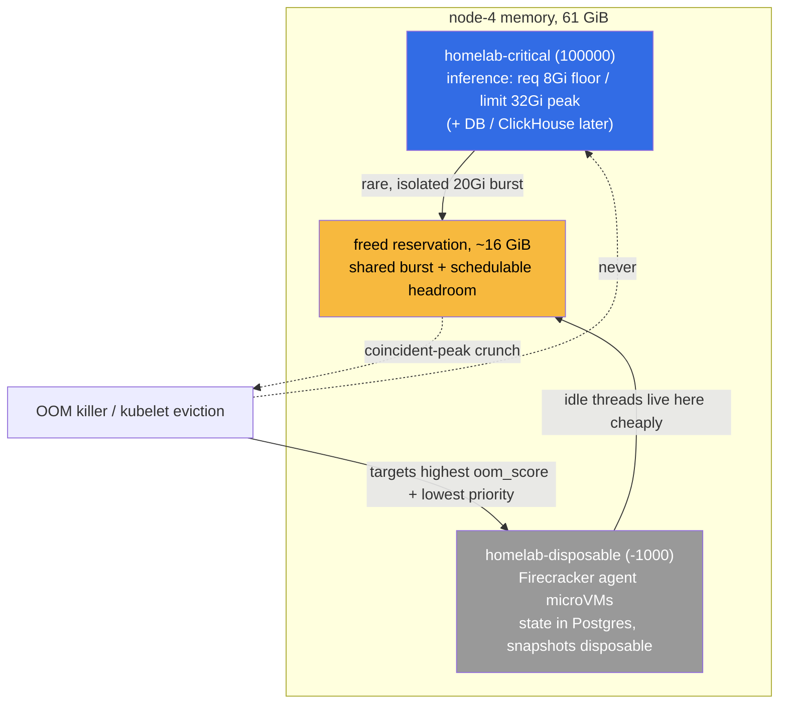

# ADR 010: Memory Oversubscription via Burstable QoS and a Designated-Victim PriorityClass Hierarchy

**Author:** jomcgi
**Status:** Accepted
**Created:** 2026-06-26
**Builds on:** [019 - Substrate Executor + AgentWorkflow over Argo](../agents/019-substrate-executor-agentworkflow.md) (the Firecracker tier this frees headroom for), [021 - Discord-Triggered AgentWorkflow](../agents/021-discord-triggered-agentworkflow-fast-model.md) (the disposable agent microVMs that become the designated OOM victims)

---

## Problem

Memory is the binding resource on this cluster. The 2026-06-18 right-sizing review found CPU sitting at roughly 9% used against 57% reserved, while memory is what actually fills nodes (node-2 has run near 92%). The agent-microVM work in [ADR 019](../agents/019-substrate-executor-agentworkflow.md) and [ADR 021](../agents/021-discord-triggered-agentworkflow-fast-model.md) needs schedulable memory headroom on node-4 (the GPU/AI worker, where that work will land) to stand up a Firecracker executor.

Rightsizing on 7-day peaks shows there is almost no "fat" to trim. node-4's largest apparent waste is the `inference` pod: it reserves 24 GiB of memory while an instantaneous snapshot shows roughly 5 GiB in use. But the snapshot lies (the same trap the 2026-06-18 review flagged for embeddings). The 7-day peak tells the real story:

- `inference` bursts to ~20 GiB (vLLM KV cache), and that burst is genuine, not slack.
- `inference-embeddings` and the SigNoz ClickHouse pod are actually under-provisioned at peak.

So the headroom is not hiding in oversized requests we can simply cut. It is hiding in the gap between what a workload **reserves** (its request) and what it uses **except at its rare peak**. `inference` holds 24 GiB reserved so the scheduler can guarantee its worst case, even though it sits near 5 GiB almost always and the 20 GiB spike is an isolated, once-in-many-hours event.

The question this ADR answers: can we hand that reserved-but-almost-never-used memory back to the scheduler without making the cluster fragile?

---

## Decision

Three decisions.

**1. Reserve steady-state via `requests`, allow peaks via `limits` (Burstable QoS) for intermittent-peak workloads.** Set a workload's memory `request` to steady-state-plus-margin and its `limit` to its measured peak, rather than pinning `request == limit` at the peak. The scheduler then reserves only the steady state and the difference becomes schedulable headroom, while the workload can still burst to its limit using node slack. The first adopter is `inference`, which moves from `request 24Gi / limit 32Gi` to `request 8Gi / limit 32Gi` (steady-state is ~5 GiB, sub-peaks ~6.6 GiB, so 8 GiB covers normal operation with margin), freeing ~16 GiB of reservation on node-4.

This is a deliberate divergence from the house convention of `memory request == limit`. CPU already behaves this way (the convention is CPU requests without limits, so CPU bursts freely into node slack); this decision brings the same request-reserves-floor, burst-into-slack shape to memory, with eyes open about why memory is different (below).

**2. The oversubscription is safe because the peaks are intermittent and uncorrelated.** Hourly memory data over the last several days shows `inference`'s ~20 GiB spike occurring in a single isolated hour, during which ClickHouse (~5 GiB) and embeddings (~5 GiB) were at their normal levels, not their peaks. Their own peaks happen at other times. That is the statistical-multiplexing condition that makes reserving the floor and sharing the ceiling a favorable bet rather than a reckless one. This is oversubscription chosen knowingly, not stumbled into.

**3. A `PriorityClass` hierarchy makes the disposable agent microVMs the designated victims when the bet occasionally loses.** Two new cluster-scoped classes sit below the existing `longhorn-critical` (1e9) and `system-*-critical` (2e9) classes:

| Class                | Value  | Applied to                                                                                                                                                         | Role                                                                                           |
| -------------------- | ------ | ------------------------------------------------------------------------------------------------------------------------------------------------------------------ | ---------------------------------------------------------------------------------------------- |
| `homelab-critical`   | 100000 | `inference`, and later the DB / ClickHouse / monolith                                                                                                              | Survives memory pressure; protected from preemption and eviction relative to default workloads |
| (default)            | 0      | every workload without a class                                                                                                                                     | Normal                                                                                         |
| `homelab-disposable` | -1000  | the Firecracker agent microVMs ([ADR 019](../agents/019-substrate-executor-agentworkflow.md) / [021](../agents/021-discord-triggered-agentworkflow-fast-model.md)) | First to be preempted and evicted; the intended sacrifice under a coincident-peak crunch       |

Agent microVMs are the ideal sacrifice because ADRs 019 and 021 already establish their state is **never load-bearing**: durable state lives in monolith Postgres and snapshots are disposable, so evicting an idle agent thread loses working memory that simply resumes later, never committed work.

---

## The incompressibility catch and the eviction invariant

Memory is not CPU. A pod over its CPU request is throttled back harmlessly; a pod that cannot get the memory it asks for is OOM-killed. So Burstable memory is only safe if we control **who dies** under pressure, and there is a trap: by default both the kubelet's eviction ranking and the kernel's OOM killer target the pod using the **most above its request first**. Lowering `inference`'s request while it still bursts to 20 GiB therefore makes `inference` itself a prime victim, and a lower request also raises its `oom_score_adj`. That is backwards.

The load-bearing invariant that fixes it, and the one rule every future adopter must preserve:

> **The disposable tenant must always be the cheapest thing to kill on the node, under both fast (kernel OOM) and slow (kubelet eviction) pressure.**

Concretely: agent microVMs run as BestEffort or with the lowest memory request (so their `oom_score_adj` is the highest, ~1000) AND carry the lowest PriorityClass (`homelab-disposable`), while critical large-footprint workloads carry `homelab-critical`. The kernel then picks a microVM before `inference`, and the kubelet evicts in priority order. If a node ever has Burstable memory oversubscription without a disposable victim present, the bet has no safety net and the policy is being misapplied.

---

## Architecture

---

## Alternatives Considered

- **Keep `memory request == limit` (Guaranteed QoS), the status quo.** Safe and simple: no oversubscription, no OOM surprise. Rejected because it makes the Firecracker tier impossible on node-4 without buying hardware: `inference` alone would permanently reserve 24 GiB it almost never uses.
- **Trim requests harder (classic rightsizing).** Rejected on the data: the 7-day peaks show inference genuinely uses ~20 GiB at peak and two neighbors are under-provisioned. There is no safe static cut that frees meaningful memory.
- **Warm pools for the agent tier instead of oversubscription.** Rejected as the headroom mechanism: warm pools pay standing RAM per idle thread on a memory-bound cluster, the opposite of what we need. (This mirrors ADR 019's executor-sequence reasoning.)
- **BestEffort everything (no memory requests).** Rejected: critical workloads need a guaranteed floor; BestEffort gives `inference` no reservation at all and makes it maximally killable.
- **Buy more memory.** The honest fallback, deferred: oversubscription extracts the headroom already paid for first; new hardware is the move if the multiplexing assumption stops holding.

---

## Security

Baseline in `docs/security.md`. Notes specific to this decision:

- **No new attack surface.** PriorityClasses and QoS are scheduling metadata; no new ingress, secrets, or RBAC.
- **Denial-of-service shape changes, deliberately.** Under a coincident-peak crunch, a disposable agent thread is killed. That is the designed outcome, not an incident: durable state is in Postgres, so nothing committed is lost. Critical workloads are insulated by `homelab-critical`.
- **The invariant is a safety control.** Misapplying Burstable memory without a disposable victim on the node removes the safety net; treat "is there a designated victim here?" as a review gate when extending this policy to a new node or workload.

---

## Risks

| Risk                                                                                                | Likelihood | Impact | Mitigation                                                                                                                                                               |
| --------------------------------------------------------------------------------------------------- | ---------- | ------ | ------------------------------------------------------------------------------------------------------------------------------------------------------------------------ |
| Peaks turn out to be correlated (multiple workloads spike together), causing OOM                    | Low        | Medium | Chosen on measured uncorrelated peaks; the disposable victim absorbs the loss; widen the inference request margin if correlation appears                                 |
| A future Burstable workload lands on a node with no disposable victim, so the bet has no safety net | Medium     | High   | The eviction invariant is the review gate; only oversubscribe where a `homelab-disposable` tenant is present                                                             |
| `inference` itself becomes the OOM victim despite intent (oom_score / eviction ordering)            | Medium     | High   | Keep `inference` on `homelab-critical` and keep agent microVMs at the lowest request + lowest priority so they always rank below it                                      |
| Freed headroom is backfilled before the Firecracker victim tier exists                              | Low        | Medium | node-4 scheduling is nodeSelector-driven (inference is GPU-pinned, most workloads are not pinned there), so the freed ~16 GiB stays unclaimed until the agent tier lands |
| Convention drift: someone re-pins memory `request == limit` not knowing why this diverged           | Medium     | Low    | This ADR is the record; the rule and its rationale are written down                                                                                                      |

---

## Open Questions

Answered during execution, not gates on the decision.

1. Which other critical workloads should adopt `homelab-critical` (monolith-pg, ClickHouse, the monolith API), and in what order?
2. What is the right steady-state margin for `inference` once the Firecracker tier is actually packing the freed headroom (is 8 GiB still right, or does observed contention argue for 10 to 12 GiB)?
3. Should `homelab-disposable` use `preemptionPolicy: Never` (it should never preempt others) while critical classes preempt it, and is a Kyverno policy warranted to enforce "Burstable memory only where a disposable victim exists"?
4. Does the agent tier want BestEffort memory or a tiny Burstable request, given the kubelet evicts above-request usage first?

---

## References

| Resource                                                                                                                    | Relevance                                                                                              |
| --------------------------------------------------------------------------------------------------------------------------- | ------------------------------------------------------------------------------------------------------ |
| [019 - Substrate Executor + AgentWorkflow over Argo](../agents/019-substrate-executor-agentworkflow.md)                     | The Firecracker tier this frees headroom for; frames the executor sequence as a memory-budget decision |
| [021 - Discord-Triggered AgentWorkflow](../agents/021-discord-triggered-agentworkflow-fast-model.md)                        | The disposable agent microVMs that are the designated victims                                          |
| [Kubernetes: Pod QoS Classes](https://kubernetes.io/docs/concepts/workloads/pods/pod-qos/)                                  | Guaranteed vs Burstable vs BestEffort and how QoS sets `oom_score_adj`                                 |
| [Kubernetes: Pod Priority and Preemption](https://kubernetes.io/docs/concepts/scheduling-eviction/pod-priority-preemption/) | PriorityClass semantics for preemption and eviction ordering                                           |
| [Kubernetes: Node-pressure Eviction](https://kubernetes.io/docs/concepts/scheduling-eviction/node-pressure-eviction/)       | How the kubelet ranks pods for eviction (above-requests, then priority)                                |
